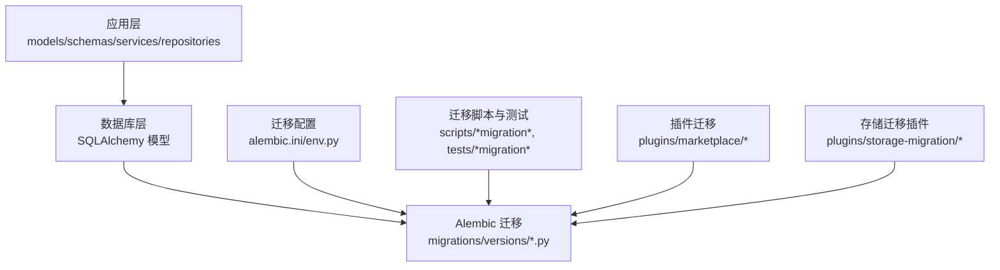
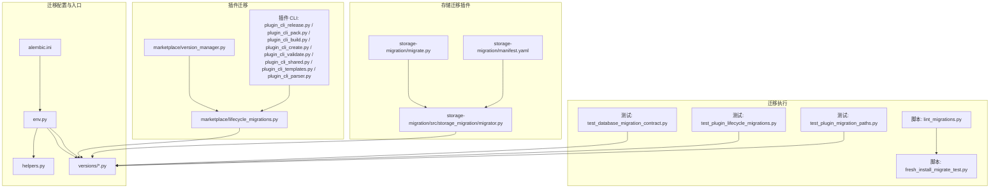
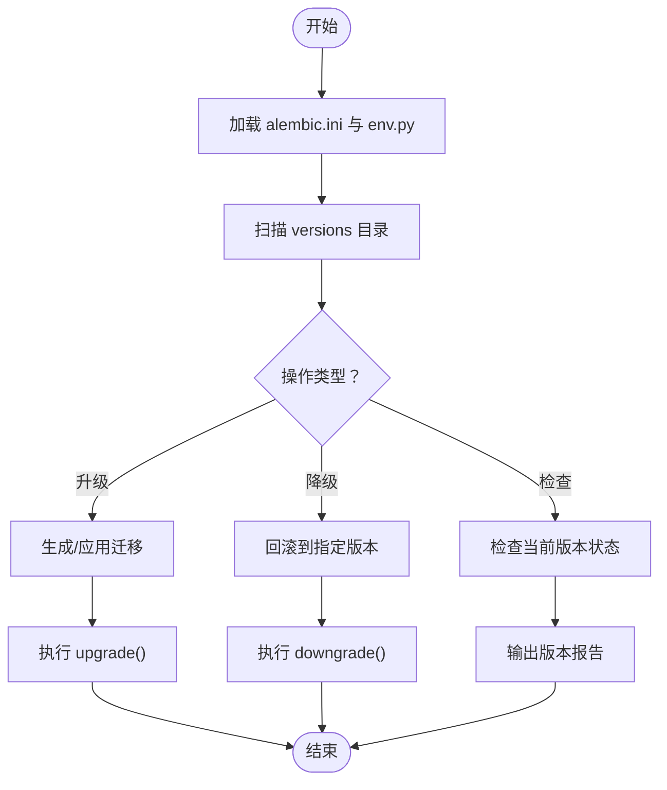
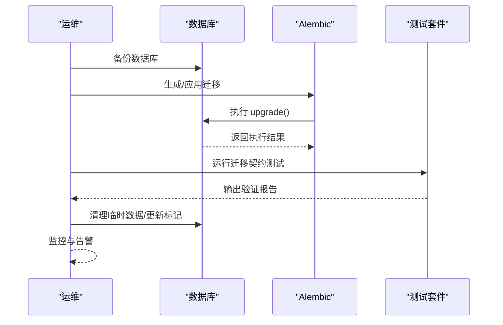
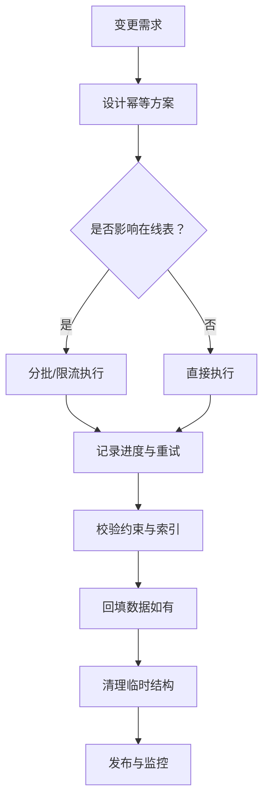
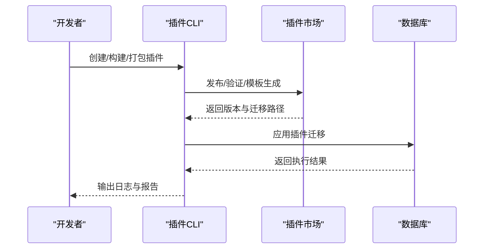
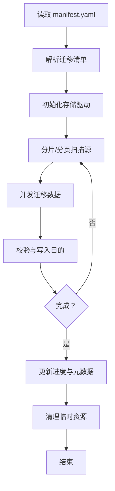
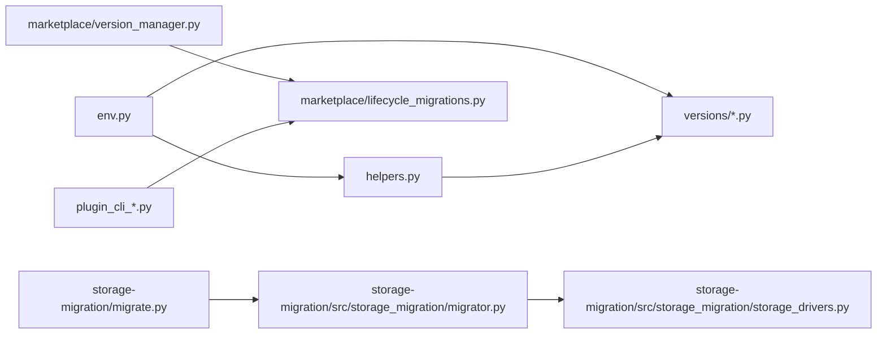

# 迁移和升级

<cite>
**本文引用的文件**
- [alembic.ini](file://backend/alembic.ini)
- [env.py](file://backend/migrations/env.py)
- [helpers.py](file://backend/migrations/helpers.py)
- [script.py.mako](file://backend/migrations/script.py.mako)
- [README](file://backend/migrations/README)
- [20260111_0001_initial.py](file://backend/migrations/versions/20260111_0001_initial.py)
- [20260216_add_plugin_migrations_table.py](file://backend/migrations/versions/20260216_add_plugin_migrations_table.py)
- [20260318_0003_add_trace_id_to_operation_logs.py](file://backend/migrations/versions/20260318_0003_add_trace_id_to_operation_logs.py)
- [20260325_org_authority_rebuild.py](file://backend/migrations/versions/20260325_org_authority_rebuild.py)
- [20260327_1930_residual_schema.py](file://backend/migrations/versions/20260327_1930_residual_schema.py)
- [20260329_0030_add_memory_records.py](file://backend/migrations/versions/20260329_0030_add_memory_records.py)
- [20260330_0060_add_execution_decision_id_to_ai_action_logs.py](file://backend/migrations/versions/20260330_0060_add_execution_decision_id_to_ai_action_logs.py)
- [fresh_install_migrate_test.py](file://backend/scripts/fresh_install_migrate_test.py)
- [lint_migrations.py](file://backend/scripts/lint_migrations.py)
- [test_database_migration_contract.py](file://backend/tests/test_database_migration_contract.py)
- [test_plugin_lifecycle_migrations.py](file://backend/tests/test_plugin_lifecycle_migrations.py)
- [test_plugin_migration_paths.py](file://backend/tests/test_plugin_migration_paths.py)
- [migration_helper.py](file://backend/codegen/migration_helper.py)
- [rollback.py](file://backend/codegen/rollback.py)
- [version_manager.py](file://backend/plugins/marketplace/version_manager.py)
- [lifecycle_migrations.py](file://backend/plugins/marketplace/lifecycle_migrations.py)
- [plugin_cli_release.py](file://backend/scripts/plugin_cli_release.py)
- [plugin_cli_pack.py](file://backend/scripts/plugin_cli_pack.py)
- [plugin_cli_build.py](file://backend/scripts/plugin_cli_build.py)
- [plugin_cli_create.py](file://backend/scripts/plugin_cli_create.py)
- [plugin_cli_validate.py](file://backend/scripts/plugin_cli_validate.py)
- [plugin_cli_shared.py](file://backend/scripts/plugin_cli_shared.py)
- [plugin_cli_templates.py](file://backend/scripts/plugin_cli_templates.py)
- [plugin_cli_parser.py](file://backend/scripts/plugin_cli_parser.py)
- [storage-migration](file://backend/plugins/storage-migration)
- [storage-migration/manifest.yaml](file://backend/plugins/storage-migration/manifest.yaml)
- [storage-migration/migrate.py](file://backend/plugins/storage-migration/migrate.py)
- [storage-migration/README.md](file://backend/plugins/storage-migration/README.md)
- [storage-migration/requirements.txt](file://backend/plugins/storage-migration/requirements.txt)
- [storage-migration/src/storage_migration/__init__.py](file://backend/plugins/storage-migration/src/storage_migration/__init__.py)
- [storage-migration/src/storage_migration/cli.py](file://backend/plugins/storage-migration/src/storage_migration/cli.py)
- [storage-migration/src/storage_migration/migrator.py](file://backend/plugins/storage-migration/src/storage_migration/migrator.py)
- [storage-migration/src/storage_migration/storage_drivers.py](file://backend/plugins/storage-migration/src/storage_migration/storage_drivers.py)
- [storage-migration/src/storage_migration/utils.py](file://backend/plugins/storage-migration/src/storage_migration/utils.py)
- [storage-migration/src/storage_migration/versioning.py](file://backend/plugins/storage-migration/src/storage_migration/versioning.py)
- [storage-migration/src/storage_migration/exceptions.py](file://backend/plugins/storage-migration/src/storage_migration/exceptions.py)
- [storage-migration/src/storage_migration/models.py](file://backend/plugins/storage-migration/src/storage_migration/models.py)
- [storage-migration/src/storage_migration/operations.py](file://backend/plugins/storage-migration/src/storage_migration/operations.py)
- [storage-migration/src/storage_migration/progress.py](file://backend/plugins/storage-migration/src/storage_migration/progress.py)
- [storage-migration/src/storage_migration/registry.py](file://backend/plugins/storage-migration/src/storage_migration/registry.py)
- [storage-migration/src/storage_migration/validators.py](file://backend/plugins/storage-migration/src/storage_migration/validators.py)
- [storage-migration/src/storage_migration/worker.py](file://backend/plugins/storage-migration/src/storage_migration/worker.py)
- [storage-migration/src/storage_migration/zipper.py](file://backend/plugins/storage-migration/src/storage_migration/zipper.py)
- [storage-migration/src/storage_migration/zipper_test.py](file://backend/plugins/storage-migration/src/storage_migration/zipper_test.py)
</cite>

## 目录
1. [引言](#引言)
2. [项目结构](#项目结构)
3. [核心组件](#核心组件)
4. [架构总览](#架构总览)
5. [详细组件分析](#详细组件分析)
6. [依赖关系分析](#依赖关系分析)
7. [性能考量](#性能考量)
8. [故障排查指南](#故障排查指南)
9. [结论](#结论)
10. [附录](#附录)

## 引言
本文件面向生产环境与平台扩展场景，系统化阐述数据库迁移与版本升级的策略、流程与兼容性保障。内容覆盖：
- 数据库迁移策略与 Alembic 管理
- 插件迁移与插件市场生命周期迁移
- 数据库结构变更与增量/批量迁移
- 版本升级流程、回滚策略与兼容性处理
- 零停机升级实施方案
- 升级测试策略、数据验证与完整性检查
- 生产环境最佳实践与应急处理程序

## 项目结构
后端采用 Python/SQLAlchemy/Alembic 的传统三层架构：应用层（业务模型/服务）、数据层（模型与迁移）与脚本层（迁移工具与测试）。迁移相关的关键位置如下：
- 迁移配置与入口：backend/alembic.ini、backend/migrations/env.py
- 迁移模板与辅助：backend/migrations/script.py.mako、backend/migrations/helpers.py
- 迁移版本集合：backend/migrations/versions/*.py
- 测试与脚本：backend/tests/*migration*、backend/scripts/*migration*
- 插件迁移：backend/plugins/marketplace/*、backend/plugins/storage-migration/*

图表来源
- [env.py](file://backend/migrations/env.py)
- [helpers.py](file://backend/migrations/helpers.py)
- [alembic.ini](file://backend/alembic.ini)
- [20260111_0001_initial.py](file://backend/migrations/versions/20260111_0001_initial.py)

章节来源
- [alembic.ini](file://backend/alembic.ini)
- [env.py](file://backend/migrations/env.py)
- [helpers.py](file://backend/migrations/helpers.py)
- [README](file://backend/migrations/README)

## 核心组件
- Alembic 迁移管理：通过配置与 env 入口加载数据库元数据，生成/执行迁移版本。
- 迁移版本集：按时间戳命名的版本文件，记录结构变更与数据迁移。
- 辅助工具与脚本：lint、fresh install 测试、回滚与代码生成辅助。
- 插件迁移：插件市场与插件生命周期迁移模块，支持插件维度的迁移路径与版本管理。
- 存储迁移插件：独立的存储驱动迁移工具，支持多云对象存储的结构与数据迁移。

章节来源
- [alembic.ini](file://backend/alembic.ini)
- [env.py](file://backend/migrations/env.py)
- [helpers.py](file://backend/migrations/helpers.py)
- [20260111_0001_initial.py](file://backend/migrations/versions/20260111_0001_initial.py)
- [lifecycle_migrations.py](file://backend/plugins/marketplace/lifecycle_migrations.py)
- [version_manager.py](file://backend/plugins/marketplace/version_manager.py)
- [storage-migration/migrate.py](file://backend/plugins/storage-migration/migrate.py)

## 架构总览
下图展示从迁移配置到版本执行、再到插件与存储迁移的整体流程。

图表来源
- [alembic.ini](file://backend/alembic.ini)
- [env.py](file://backend/migrations/env.py)
- [helpers.py](file://backend/migrations/helpers.py)
- [20260111_0001_initial.py](file://backend/migrations/versions/20260111_0001_initial.py)
- [lifecycle_migrations.py](file://backend/plugins/marketplace/lifecycle_migrations.py)
- [version_manager.py](file://backend/plugins/marketplace/version_manager.py)
- [plugin_cli_release.py](file://backend/scripts/plugin_cli_release.py)
- [plugin_cli_pack.py](file://backend/scripts/plugin_cli_pack.py)
- [plugin_cli_build.py](file://backend/scripts/plugin_cli_build.py)
- [plugin_cli_create.py](file://backend/scripts/plugin_cli_create.py)
- [plugin_cli_validate.py](file://backend/scripts/plugin_cli_validate.py)
- [plugin_cli_shared.py](file://backend/scripts/plugin_cli_shared.py)
- [plugin_cli_templates.py](file://backend/scripts/plugin_cli_templates.py)
- [plugin_cli_parser.py](file://backend/scripts/plugin_cli_parser.py)
- [storage-migration/migrate.py](file://backend/plugins/storage-migration/migrate.py)
- [storage-migration/src/storage_migration/migrator.py](file://backend/plugins/storage-migration/src/storage_migration/migrator.py)
- [storage-migration/manifest.yaml](file://backend/plugins/storage-migration/manifest.yaml)

## 详细组件分析

### 数据库迁移策略与 Alembic 管理
- 配置与入口
  - alembic.ini 提供迁移环境配置（数据库连接、目标表、脚本模板等）。
  - env.py 负责在迁移执行时加载应用的数据库元数据与模型，确保迁移上下文正确。
  - helpers.py 提供迁移辅助函数，如版本生成、约束处理、索引维护等。
- 迁移版本组织
  - versions 下的每个版本文件以时间戳+序号命名，记录结构变更与数据迁移步骤。
  - 常见模式包括：添加表/列、修改约束、索引重建、字段默认值设置、数据回填等。
- 迁移模板
  - script.py.mako 定义迁移脚本模板，统一生成迁移文件的结构与注释风格。

图表来源
- [alembic.ini](file://backend/alembic.ini)
- [env.py](file://backend/migrations/env.py)
- [helpers.py](file://backend/migrations/helpers.py)
- [script.py.mako](file://backend/migrations/script.py.mako)

章节来源
- [alembic.ini](file://backend/alembic.ini)
- [env.py](file://backend/migrations/env.py)
- [helpers.py](file://backend/migrations/helpers.py)
- [script.py.mako](file://backend/migrations/script.py.mako)
- [README](file://backend/migrations/README)

### 版本升级流程与兼容性处理
- 版本升级流程
  - 准备阶段：备份数据库、冻结写入、确认依赖版本、预热缓存。
  - 执行阶段：按顺序应用迁移，记录每步结果；对大表操作采用分批/限流。
  - 验证阶段：运行迁移契约测试与插件迁移测试，检查数据一致性与功能回归。
  - 收尾阶段：清理临时数据、更新部署标记、监控指标与日志告警。
- 向后兼容性
  - 字段与索引变更遵循“可逆”设计，保留旧字段一段时间再删除。
  - API 层对旧字段提供兼容映射，避免客户端中断。
  - 对外 schema 变更通过版本化接口或条件字段控制。
- 回滚策略
  - 使用 Alembic downgrade 到上一个稳定版本。
  - 对关键数据回填提供幂等回退逻辑。
  - 结合快照/镜像恢复，必要时进行全量回滚。

图表来源
- [test_database_migration_contract.py](file://backend/tests/test_database_migration_contract.py)
- [test_plugin_lifecycle_migrations.py](file://backend/tests/test_plugin_lifecycle_migrations.py)
- [test_plugin_migration_paths.py](file://backend/tests/test_plugin_migration_paths.py)
- [env.py](file://backend/migrations/env.py)

章节来源
- [test_database_migration_contract.py](file://backend/tests/test_database_migration_contract.py)
- [test_plugin_lifecycle_migrations.py](file://backend/tests/test_plugin_lifecycle_migrations.py)
- [test_plugin_migration_paths.py](file://backend/tests/test_plugin_migration_paths.py)
- [env.py](file://backend/migrations/env.py)

### 数据库结构变更示例与复杂度分析
以下示例展示了典型结构变更的实现模式与注意事项：
- 添加表/列：幂等创建、默认值与非空约束的分步处理。
- 修改唯一约束/索引：先删除旧索引，再创建新索引，避免锁竞争。
- 数据回填：分页/批次处理，带进度与重试。
- 删除列/表：延迟删除，先隐藏字段，再清理历史数据与依赖。

图表来源
- [helpers.py](file://backend/migrations/helpers.py)
- [20260325_org_authority_rebuild.py](file://backend/migrations/versions/20260325_org_authority_rebuild.py)
- [20260327_1930_residual_schema.py](file://backend/migrations/versions/20260327_1930_residual_schema.py)
- [20260329_0030_add_memory_records.py](file://backend/migrations/versions/20260329_0030_add_memory_records.py)
- [20260330_0060_add_execution_decision_id_to_ai_action_logs.py](file://backend/migrations/versions/20260330_0060_add_execution_decision_id_to_ai_action_logs.py)

章节来源
- [helpers.py](file://backend/migrations/helpers.py)
- [20260325_org_authority_rebuild.py](file://backend/migrations/versions/20260325_org_authority_rebuild.py)
- [20260327_1930_residual_schema.py](file://backend/migrations/versions/20260327_1930_residual_schema.py)
- [20260329_0030_add_memory_records.py](file://backend/migrations/versions/20260329_0030_add_memory_records.py)
- [20260330_0060_add_execution_decision_id_to_ai_action_logs.py](file://backend/migrations/versions/20260330_0060_add_execution_decision_id_to_ai_action_logs.py)

### 插件迁移与插件市场生命周期迁移
- 生命周期迁移
  - marketplace/lifecycle_migrations.py 定义插件安装/升级/卸载过程中的迁移路径与状态机。
  - version_manager.py 管理插件版本与依赖，确保迁移顺序与原子性。
- 插件 CLI 工具链
  - plugin_cli_release.py、plugin_cli_pack.py、plugin_cli_build.py、plugin_cli_create.py、plugin_cli_validate.py、plugin_cli_shared.py、plugin_cli_templates.py、plugin_cli_parser.py 提供从开发到发布的完整工作流，确保迁移脚本随插件版本一致。
- 插件迁移测试
  - test_plugin_lifecycle_migrations.py 与 test_plugin_migration_paths.py 验证迁移路径与契约，防止破坏性变更。

图表来源
- [lifecycle_migrations.py](file://backend/plugins/marketplace/lifecycle_migrations.py)
- [version_manager.py](file://backend/plugins/marketplace/version_manager.py)
- [plugin_cli_release.py](file://backend/scripts/plugin_cli_release.py)
- [plugin_cli_pack.py](file://backend/scripts/plugin_cli_pack.py)
- [plugin_cli_build.py](file://backend/scripts/plugin_cli_build.py)
- [plugin_cli_create.py](file://backend/scripts/plugin_cli_create.py)
- [plugin_cli_validate.py](file://backend/scripts/plugin_cli_validate.py)
- [plugin_cli_shared.py](file://backend/scripts/plugin_cli_shared.py)
- [plugin_cli_templates.py](file://backend/scripts/plugin_cli_templates.py)
- [plugin_cli_parser.py](file://backend/scripts/plugin_cli_parser.py)

章节来源
- [lifecycle_migrations.py](file://backend/plugins/marketplace/lifecycle_migrations.py)
- [version_manager.py](file://backend/plugins/marketplace/version_manager.py)
- [plugin_cli_release.py](file://backend/scripts/plugin_cli_release.py)
- [plugin_cli_pack.py](file://backend/scripts/plugin_cli_pack.py)
- [plugin_cli_build.py](file://backend/scripts/plugin_cli_build.py)
- [plugin_cli_create.py](file://backend/scripts/plugin_cli_create.py)
- [plugin_cli_validate.py](file://backend/scripts/plugin_cli_validate.py)
- [plugin_cli_shared.py](file://backend/scripts/plugin_cli_shared.py)
- [plugin_cli_templates.py](file://backend/scripts/plugin_cli_templates.py)
- [plugin_cli_parser.py](file://backend/scripts/plugin_cli_parser.py)
- [test_plugin_lifecycle_migrations.py](file://backend/tests/test_plugin_lifecycle_migrations.py)
- [test_plugin_migration_paths.py](file://backend/tests/test_plugin_migration_paths.py)

### 存储迁移插件（多云对象存储）
- 功能概述
  - storage-migration 提供跨云对象存储的结构与数据迁移能力，支持清单、版本化、进度跟踪与异常处理。
- 关键模块
  - migrate.py：入口与协调器。
  - src/storage_migration/migrator.py：迁移执行器，负责任务调度与幂等性。
  - src/storage_migration/storage_drivers.py：抽象不同云存储驱动。
  - src/storage_migration/manifest.yaml：定义迁移清单与版本。
- 实施要点
  - 幂等与重试：失败自动重试与断点续传。
  - 进度与校验：分片/分页迁移，校验源/目的哈希一致性。
  - 权限与网络：最小权限原则与网络隔离策略。

图表来源
- [storage-migration/migrate.py](file://backend/plugins/storage-migration/migrate.py)
- [storage-migration/src/storage_migration/migrator.py](file://backend/plugins/storage-migration/src/storage_migration/migrator.py)
- [storage-migration/src/storage_migration/storage_drivers.py](file://backend/plugins/storage-migration/src/storage_migration/storage_drivers.py)
- [storage-migration/manifest.yaml](file://backend/plugins/storage-migration/manifest.yaml)

章节来源
- [storage-migration/migrate.py](file://backend/plugins/storage-migration/migrate.py)
- [storage-migration/src/storage_migration/migrator.py](file://backend/plugins/storage-migration/src/storage_migration/migrator.py)
- [storage-migration/src/storage_migration/storage_drivers.py](file://backend/plugins/storage-migration/src/storage_migration/storage_drivers.py)
- [storage-migration/manifest.yaml](file://backend/plugins/storage-migration/manifest.yaml)
- [storage-migration/README.md](file://backend/plugins/storage-migration/README.md)

### 增量升级、批量迁移与零停机升级
- 增量升级
  - 将大变更拆分为多个小版本，每个版本只做一次结构或数据改动，降低锁竞争与失败风险。
  - 使用 helpers.py 中的幂等工具与分页回填。
- 批量迁移
  - 对大表数据回填采用分页/限流，记录进度并在失败时可恢复。
  - 在低峰时段执行，配合只读副本或镜像切换。
- 零停机升级
  - 通过双写/影子表/渐进式字段替换，保证读写兼容。
  - 使用只读副本切换与蓝绿部署，结合健康检查与自动回滚。

章节来源
- [helpers.py](file://backend/migrations/helpers.py)
- [20260329_0030_add_memory_records.py](file://backend/migrations/versions/20260329_0030_add_memory_records.py)
- [20260330_0060_add_execution_decision_id_to_ai_action_logs.py](file://backend/migrations/versions/20260330_0060_add_execution_decision_id_to_ai_action_logs.py)

### 升级测试策略、数据验证与完整性检查
- 迁移契约测试
  - test_database_migration_contract.py：验证迁移前后 schema 与约束一致性。
- 插件迁移测试
  - test_plugin_lifecycle_migrations.py：验证插件生命周期迁移路径。
  - test_plugin_migration_paths.py：验证迁移路径与依赖顺序。
- 迁移质量检查
  - lint_migrations.py：检查迁移文件命名、语法与模板一致性。
  - fresh_install_migrate_test.py：验证全新安装后的迁移链路完整性。
- 数据验证
  - 对关键表执行抽样/全量校验，比对主从数据一致性。
  - 核查索引、唯一约束与外键完整性。

章节来源
- [test_database_migration_contract.py](file://backend/tests/test_database_migration_contract.py)
- [test_plugin_lifecycle_migrations.py](file://backend/tests/test_plugin_lifecycle_migrations.py)
- [test_plugin_migration_paths.py](file://backend/tests/test_plugin_migration_paths.py)
- [lint_migrations.py](file://backend/scripts/lint_migrations.py)
- [fresh_install_migrate_test.py](file://backend/scripts/fresh_install_migrate_test.py)

## 依赖关系分析
- 组件耦合
  - env.py 与 helpers.py 为迁移执行的核心依赖，所有版本文件依赖其提供的上下文与工具。
  - 插件迁移依赖 marketplace 的版本管理与生命周期迁移模块。
  - 存储迁移插件通过 manifest.yaml 与 migrator 解耦于业务数据库迁移。
- 外部依赖
  - Alembic 作为迁移引擎，依赖 SQLAlchemy 与数据库驱动。
  - 插件 CLI 依赖 Python 包管理与 YAML/JSON 解析。
- 循环依赖
  - 迁移版本文件之间通过顺序与依赖声明避免循环；插件与存储迁移插件不与核心业务迁移形成循环。

图表来源
- [env.py](file://backend/migrations/env.py)
- [helpers.py](file://backend/migrations/helpers.py)
- [version_manager.py](file://backend/plugins/marketplace/version_manager.py)
- [lifecycle_migrations.py](file://backend/plugins/marketplace/lifecycle_migrations.py)
- [plugin_cli_release.py](file://backend/scripts/plugin_cli_release.py)
- [storage-migration/migrate.py](file://backend/plugins/storage-migration/migrate.py)
- [storage-migration/src/storage_migration/migrator.py](file://backend/plugins/storage-migration/src/storage_migration/migrator.py)
- [storage-migration/src/storage_migration/storage_drivers.py](file://backend/plugins/storage-migration/src/storage_migration/storage_drivers.py)

章节来源
- [env.py](file://backend/migrations/env.py)
- [helpers.py](file://backend/migrations/helpers.py)
- [version_manager.py](file://backend/plugins/marketplace/version_manager.py)
- [lifecycle_migrations.py](file://backend/plugins/marketplace/lifecycle_migrations.py)
- [plugin_cli_release.py](file://backend/scripts/plugin_cli_release.py)
- [storage-migration/migrate.py](file://backend/plugins/storage-migration/migrate.py)
- [storage-migration/src/storage_migration/migrator.py](file://backend/plugins/storage-migration/src/storage_migration/migrator.py)
- [storage-migration/src/storage_migration/storage_drivers.py](file://backend/plugins/storage-migration/src/storage_migration/storage_drivers.py)

## 性能考量
- 锁与并发
  - 避免长事务与大范围锁，优先使用分页/限流与异步任务。
- 索引与查询
  - 在大批量数据回填期间，考虑禁用非必要索引，完成后重建。
- 监控与可观测性
  - 记录迁移耗时、受影响行数与错误率，结合数据库慢查询日志定位瓶颈。
- 缓存与副本
  - 在低峰期执行，必要时切换只读副本，减少对主库压力。

## 故障排查指南
- 常见问题
  - 迁移卡住：检查锁等待、索引重建与分页参数；查看迁移日志与数据库进程列表。
  - 数据不一致：核对回填批次与幂等逻辑；执行抽样校验。
  - 插件迁移失败：检查版本管理与生命周期迁移路径；确认依赖顺序。
- 回滚步骤
  - 使用 downgrade 到上一稳定版本；对关键数据回填执行反向操作。
  - 必要时基于备份进行全量回滚，并通知用户与审计。
- 应急处理
  - 快速切换到只读副本或镜像；启用降级模式与只读接口。
  - 自动回滚：在 CI 中集成失败阈值与自动 downgrade 触发。

章节来源
- [env.py](file://backend/migrations/env.py)
- [test_database_migration_contract.py](file://backend/tests/test_database_migration_contract.py)
- [test_plugin_lifecycle_migrations.py](file://backend/tests/test_plugin_lifecycle_migrations.py)
- [test_plugin_migration_paths.py](file://backend/tests/test_plugin_migration_paths.py)

## 结论
本仓库提供了完善的数据库迁移与插件迁移基础设施：以 Alembic 为核心的版本化管理、以测试与脚本保障的质量与合规、以及针对插件与存储的专用迁移工具。通过幂等设计、分批执行与严格测试，可在生产环境中实现安全、可控且可回滚的升级流程。

## 附录
- 升级准备清单
  - 数据库备份与验证
  - 依赖版本锁定与兼容性检查
  - 测试环境演练与迁移契约测试
  - 回滚预案与应急联系人
- 生产环境最佳实践
  - 低峰期执行、只读副本切换、蓝绿部署
  - 分批灰度、逐步放量与自动回滚
  - 持续监控与告警联动