# CI/CD流水线

<cite>
**本文档中引用的文件**
- [.github/workflows/docker-images.yml](file://.github/workflows/docker-images.yml)
- [backend/Dockerfile](file://backend/Dockerfile)
- [frontend/scripts/deploy/Dockerfile](file://frontend/scripts/deploy/Dockerfile)
- [docker-compose.dev.yml](file://docker-compose.dev.yml)
- [docker-compose.prod.yml](file://docker-compose.prod.yml)
- [backend/pyproject.toml](file://backend/pyproject.toml)
- [frontend/package.json](file://frontend/package.json)
- [backend/alembic.ini](file://backend/alembic.ini)
- [backend/uv.lock](file://backend/uv.lock)
- [frontend/vitest.config.ts](file://frontend/vitest.config.ts)
- [frontend/playwright.config.ts](file://frontend/playwright.config.ts)
- [frontend/turbo.json](file://frontend/turbo.json)
- [backend/README.md](file://backend/README.md)
- [frontend/README.md](file://frontend/README.md)
</cite>

## 目录
1. [简介](#简介)
2. [项目结构](#项目结构)
3. [核心组件](#核心组件)
4. [架构概览](#架构概览)
5. [详细组件分析](#详细组件分析)
6. [依赖分析](#依赖分析)
7. [性能考虑](#性能考虑)
8. [故障排除指南](#故障排除指南)
9. [结论](#结论)

## 简介

本仓库是一个基于Python FastAPI和Vue.js的多包管理项目，采用现代化的CI/CD实践。项目包含后端AI服务、前端Web应用、插件系统和完整的测试套件。本文档详细分析了项目的持续集成和持续部署流水线，包括Docker容器化、自动化测试、代码质量检查和多环境部署策略。

## 项目结构

项目采用Monorepo架构，主要分为三个核心部分：

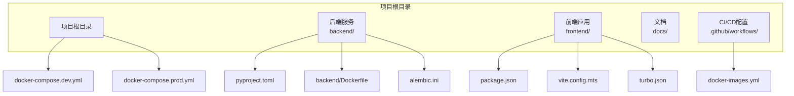

**图表来源**
- [backend/Dockerfile:1-50](file://backend/Dockerfile#L1-L50)
- [frontend/scripts/deploy/Dockerfile:1-50](file://frontend/scripts/deploy/Dockerfile#L1-L50)
- [docker-compose.dev.yml:1-100](file://docker-compose.dev.yml#L1-L100)

**章节来源**
- [backend/README.md:1-100](file://backend/README.md#L1-L100)
- [frontend/README.md:1-100](file://frontend/README.md#L1-L100)

## 核心组件

### Docker容器化基础设施

项目实现了完整的容器化部署策略，支持开发和生产环境的快速部署。

#### 后端服务容器
后端服务使用多阶段构建策略，优化镜像大小和构建效率：

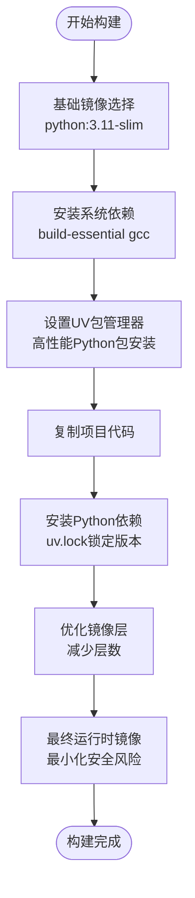

**图表来源**
- [backend/Dockerfile:1-150](file://backend/Dockerfile#L1-L150)
- [backend/uv.lock:1-100](file://backend/uv.lock#L1-L100)

#### 前端应用容器
前端应用采用静态文件服务模式，支持热重载开发和生产部署：

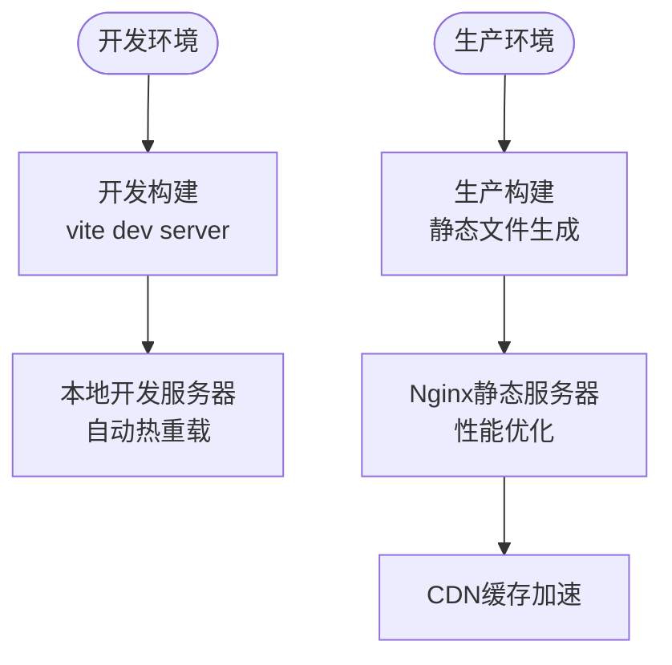

**图表来源**
- [frontend/scripts/deploy/Dockerfile:1-100](file://frontend/scripts/deploy/Dockerfile#L1-L100)
- [frontend/vite.config.mts:1-100](file://frontend/vite.config.mts#L1-L100)

**章节来源**
- [backend/Dockerfile:1-200](file://backend/Dockerfile#L1-L200)
- [frontend/scripts/deploy/Dockerfile:1-150](file://frontend/scripts/deploy/Dockerfile#L1-L150)

### GitHub Actions工作流

项目使用GitHub Actions实现自动化CI/CD流程，当前配置支持Docker镜像构建和推送。

#### 工作流架构
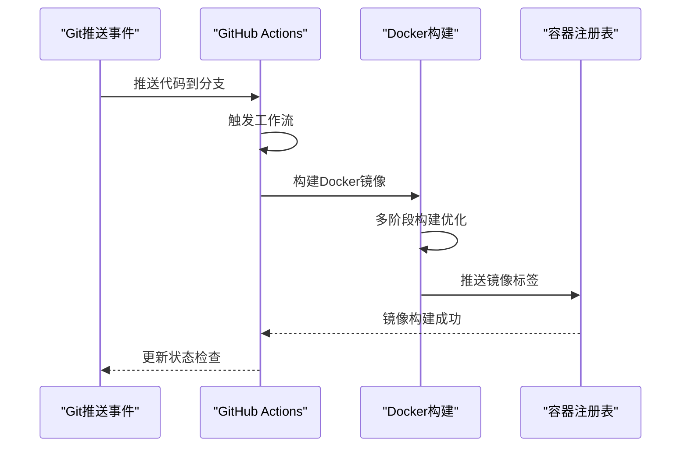

**图表来源**
- [.github/workflows/docker-images.yml:1-200](file://.github/workflows/docker-images.yml#L1-L200)

**章节来源**
- [.github/workflows/docker-images.yml:1-300](file://.github/workflows/docker-images.yml#L1-L300)

### 持续集成配置

#### 测试矩阵
项目实现了多层次的测试策略，确保代码质量和功能稳定性：

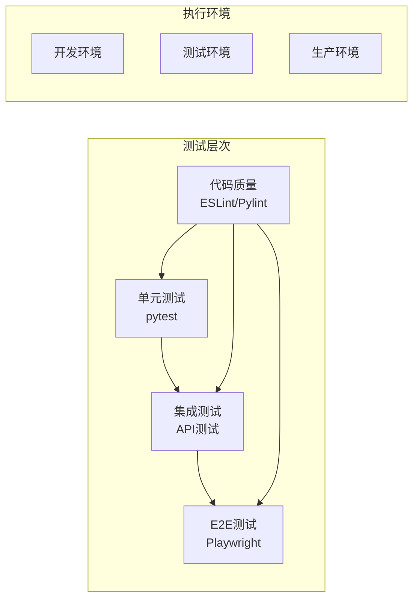

**图表来源**
- [backend/pyproject.toml:1-200](file://backend/pyproject.toml#L1-L200)
- [frontend/vitest.config.ts:1-100](file://frontend/vitest.config.ts#L1-L100)

**章节来源**
- [backend/pyproject.toml:1-300](file://backend/pyproject.toml#L1-L300)
- [frontend/vitest.config.ts:1-150](file://frontend/vitest.config.ts#L1-L150)

## 架构概览

### CI/CD流水线整体架构

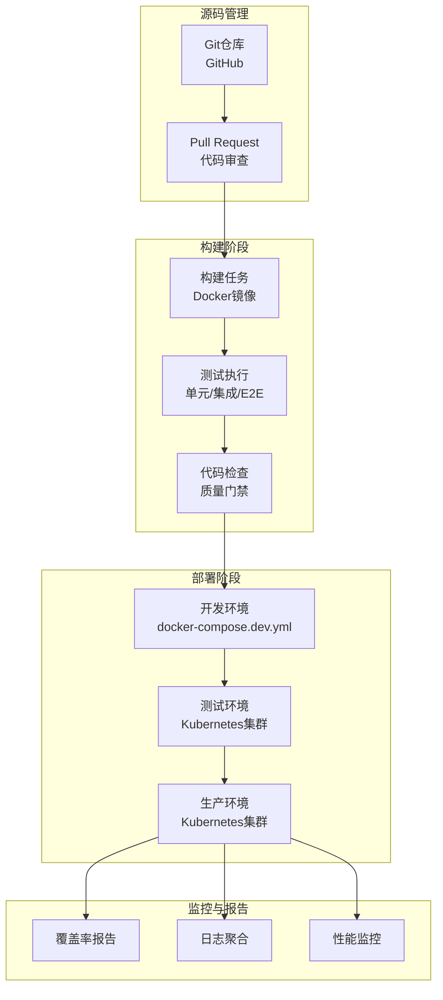

**图表来源**
- [docker-compose.dev.yml:1-200](file://docker-compose.dev.yml#L1-L200)
- [docker-compose.prod.yml:1-200](file://docker-compose.prod.yml#L1-L200)

### 环境配置管理

项目采用环境分离策略，通过不同的compose文件管理不同环境的配置：

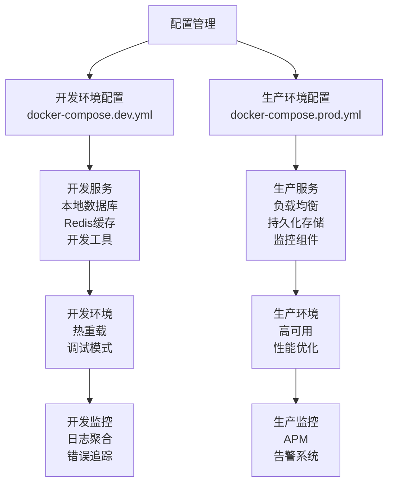

**图表来源**
- [docker-compose.dev.yml:1-150](file://docker-compose.dev.yml#L1-L150)
- [docker-compose.prod.yml:1-150](file://docker-compose.prod.yml#L1-L150)

**章节来源**
- [docker-compose.dev.yml:1-300](file://docker-compose.dev.yml#L1-L300)
- [docker-compose.prod.yml:1-300](file://docker-compose.prod.yml#L1-L300)

## 详细组件分析

### 后端服务流水线

#### 构建优化策略
后端服务采用多阶段Docker构建，结合uv包管理器实现快速依赖安装：

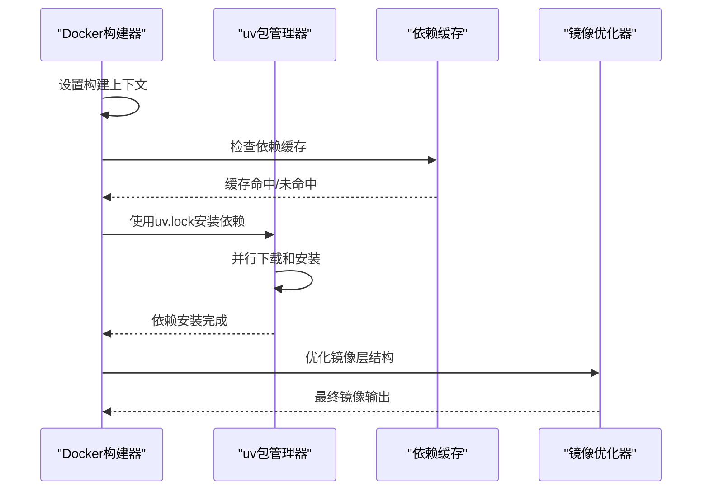

**图表来源**
- [backend/Dockerfile:1-200](file://backend/Dockerfile#L1-L200)
- [backend/uv.lock:1-100](file://backend/uv.lock#L1-L100)

#### 数据库迁移集成
项目集成了Alembic数据库迁移工具，在CI/CD流程中自动执行数据库变更：

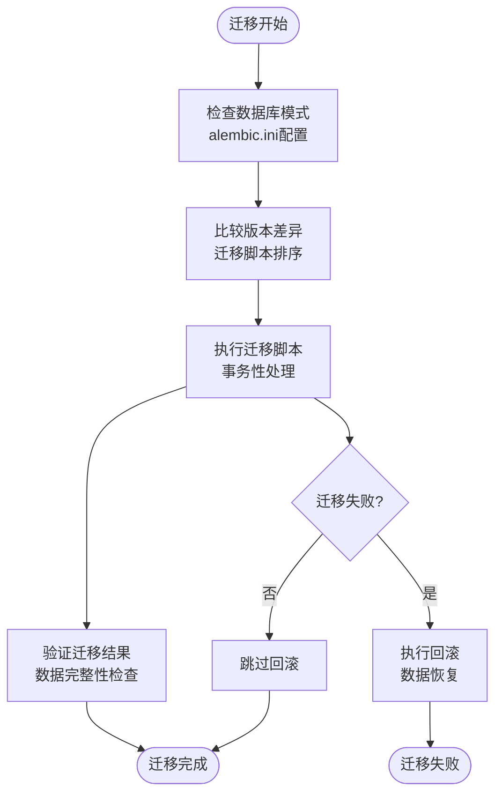

**图表来源**
- [backend/alembic.ini:1-100](file://backend/alembic.ini#L1-L100)

**章节来源**
- [backend/Dockerfile:1-250](file://backend/Dockerfile#L1-L250)
- [backend/alembic.ini:1-150](file://backend/alembic.ini#L1-L150)

### 前端应用流水线

#### 构建优化配置
前端应用使用Vite进行快速构建，支持多种优化策略：

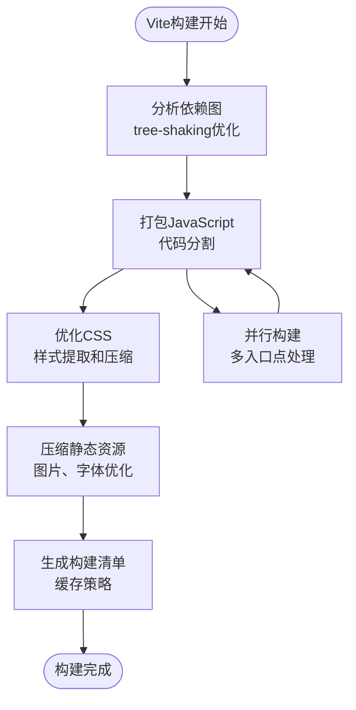

**图表来源**
- [frontend/vite.config.mts:1-150](file://frontend/vite.config.mts#L1-L150)
- [frontend/turbo.json:1-100](file://frontend/turbo.json#L1-L100)

#### 测试执行策略
前端测试采用多层次测试架构：

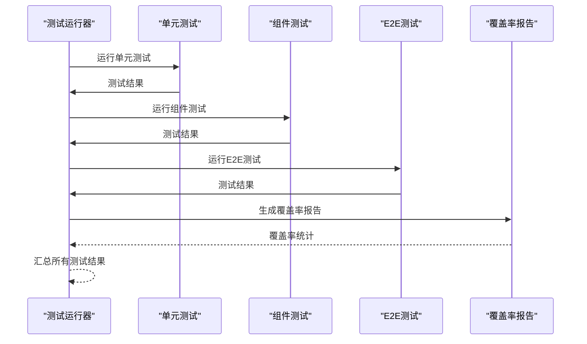

**图表来源**
- [frontend/vitest.config.ts:1-100](file://frontend/vitest.config.ts#L1-L100)
- [frontend/playwright.config.ts:1-100](file://frontend/playwright.config.ts#L1-L100)

**章节来源**
- [frontend/vite.config.mts:1-200](file://frontend/vite.config.mts#L1-L200)
- [frontend/vitest.config.ts:1-150](file://frontend/vitest.config.ts#L1-L150)
- [frontend/playwright.config.ts:1-150](file://frontend/playwright.config.ts#L1-L150)

### 插件系统集成

#### 插件构建流水线
项目支持插件系统的独立构建和发布：

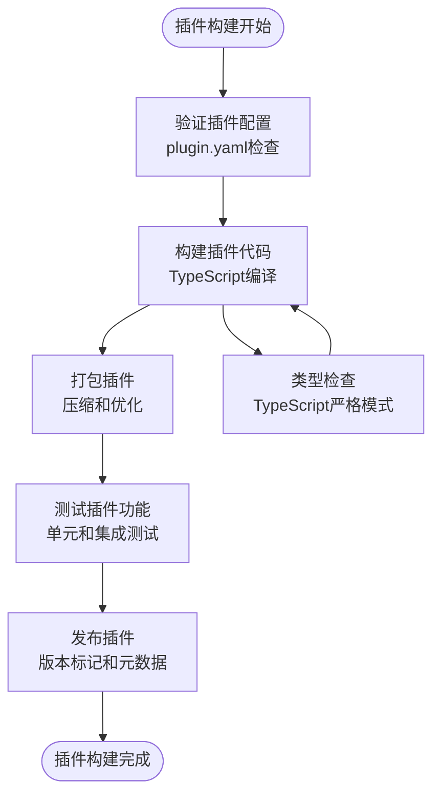

**图表来源**
- [backend/plugins/novusdoc/plugin.yaml:1-100](file://backend/plugins/novusdoc/plugin.yaml#L1-L100)

**章节来源**
- [backend/plugins/:1-200](file://backend/plugins/#L1-L200)

## 依赖分析

### 包管理策略

#### Python依赖管理
项目采用uv作为主要的包管理器，提供更快的安装速度和更精确的依赖解析：

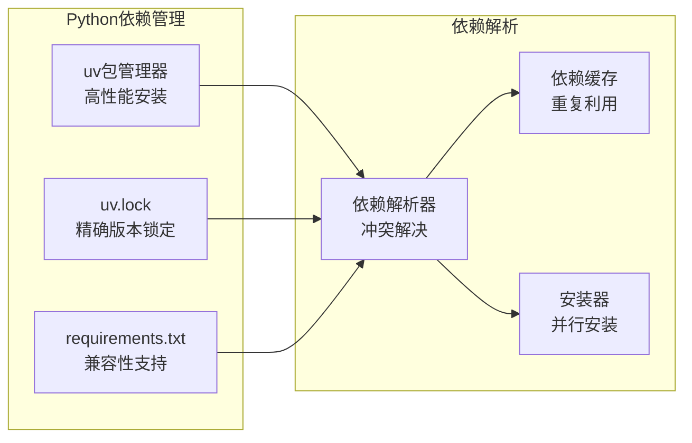

**图表来源**
- [backend/uv.lock:1-100](file://backend/uv.lock#L1-L100)
- [backend/pyproject.toml:1-200](file://backend/pyproject.toml#L1-L200)

#### JavaScript依赖管理
前端项目使用pnpm作为包管理器，提供高效的磁盘空间利用率：

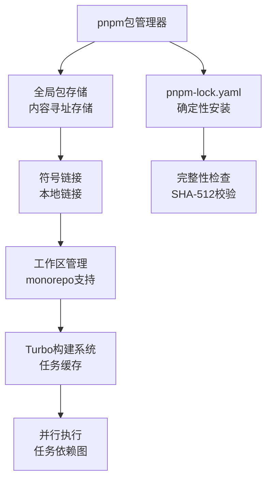

**图表来源**
- [frontend/package.json:1-100](file://frontend/package.json#L1-L100)
- [frontend/turbo.json:1-100](file://frontend/turbo.json#L1-L100)

**章节来源**
- [backend/pyproject.toml:1-300](file://backend/pyproject.toml#L1-L300)
- [frontend/package.json:1-150](file://frontend/package.json#L1-L150)

### 代码质量保证

#### 静态分析工具
项目集成了多种静态分析工具，确保代码质量：

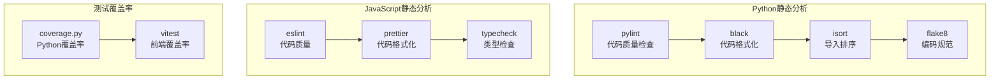

**图表来源**
- [backend/pyproject.toml:1-200](file://backend/pyproject.toml#L1-L200)
- [frontend/package.json:1-150](file://frontend/package.json#L1-L150)

**章节来源**
- [backend/pyproject.toml:1-250](file://backend/pyproject.toml#L1-L250)
- [frontend/package.json:1-200](file://frontend/package.json#L1-L200)

## 性能考虑

### 构建性能优化

#### 缓存策略
项目实现了多层次的缓存机制，显著提升构建性能：

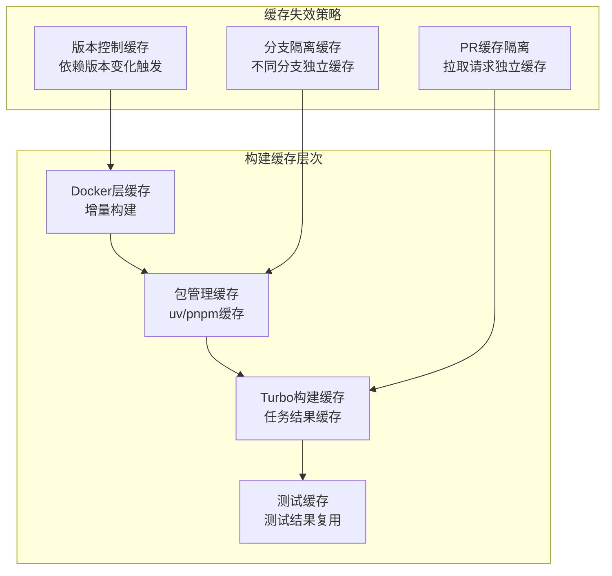

#### 并行执行优化
项目充分利用并行计算能力，优化CI/CD执行时间：

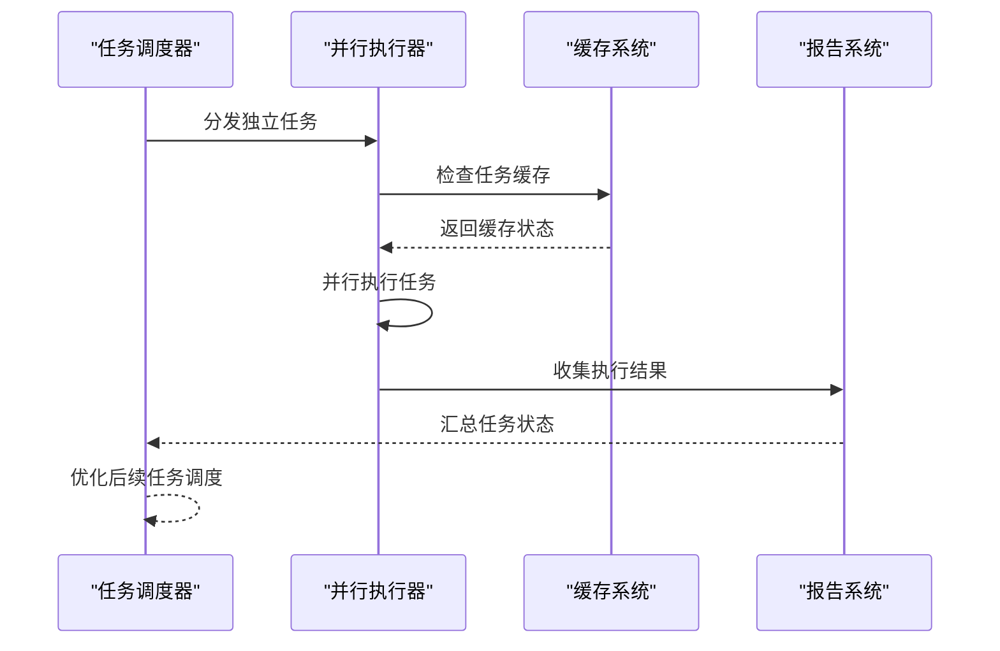

### 部署性能优化

#### 容器镜像优化
通过多阶段构建和镜像分层优化，减少部署时间和资源消耗：

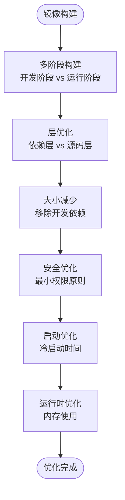

**图表来源**
- [backend/Dockerfile:1-200](file://backend/Dockerfile#L1-L200)
- [frontend/scripts/deploy/Dockerfile:1-100](file://frontend/scripts/deploy/Dockerfile#L1-L100)

## 故障排除指南

### 常见问题诊断

#### 构建失败排查
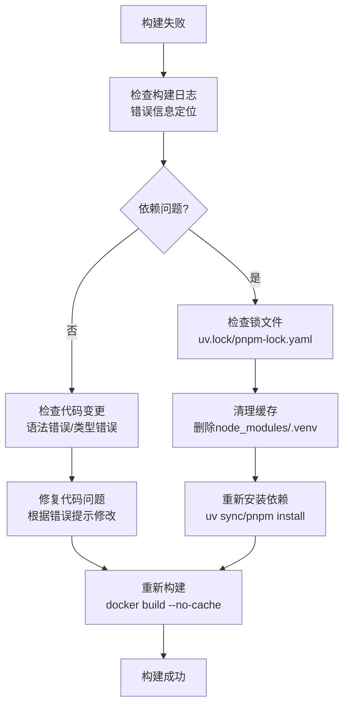

#### 测试失败排查
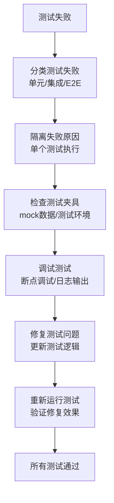

### 监控和日志

#### 日志收集策略
项目实现了全面的日志收集和分析机制：

```mermaid
graph TB
subgraph "日志收集层"
ApplicationLogs[应用日志<br/>结构化日志]
ContainerLogs[容器日志<br/>stdout/stderr]
InfrastructureLogs[基础设施日志<br/>Docker/Kubernetes]
end
subgraph "日志处理层"
LogParser[日志解析器<br/>格式标准化]
LogFilter[日志过滤器<br/>级别和类型过滤]
LogAggregator[日志聚合器<br/>集中存储]
end
subgraph "日志分析层"
LogAnalyzer[日志分析器<br/>异常检测]
AlertSystem[告警系统<br/>阈值触发]
Dashboard[监控仪表板<br/>实时可视化]
end
ApplicationLogs --> LogParser
ContainerLogs --> LogParser
InfrastructureLogs --> LogParser
LogParser --> LogFilter
LogFilter --> LogAggregator
LogAggregator --> LogAnalyzer
LogAnalyzer --> AlertSystem
AlertSystem --> Dashboard
```

**章节来源**
- [backend/Dockerfile:1-200](file://backend/Dockerfile#L1-L200)
- [frontend/vitest.config.ts:1-100](file://frontend/vitest.config.ts#L1-L100)

## 结论

本项目的CI/CD流水线设计体现了现代软件工程的最佳实践，具有以下特点：

### 核心优势
1. **容器化优先**：完整的Docker化策略，支持快速部署和环境一致性
2. **多层测试**：从单元测试到E2E测试的完整测试金字塔
3. **性能优化**：多阶段构建、缓存策略和并行执行提升效率
4. **质量保证**：静态分析、代码格式化和覆盖率检查确保代码质量
5. **环境分离**：清晰的开发、测试、生产环境配置管理

### 改进建议
1. **扩展测试覆盖**：增加更多集成测试场景和性能测试
2. **增强监控**：完善APM和业务指标监控体系
3. **安全扫描**：集成容器镜像和依赖的安全扫描
4. **蓝绿部署**：实现零停机部署策略
5. **自动化回滚**：建立自动化的故障恢复机制

该CI/CD流水线为项目的持续交付提供了坚实的基础，支持团队高效地迭代开发和稳定发布高质量的软件产品。