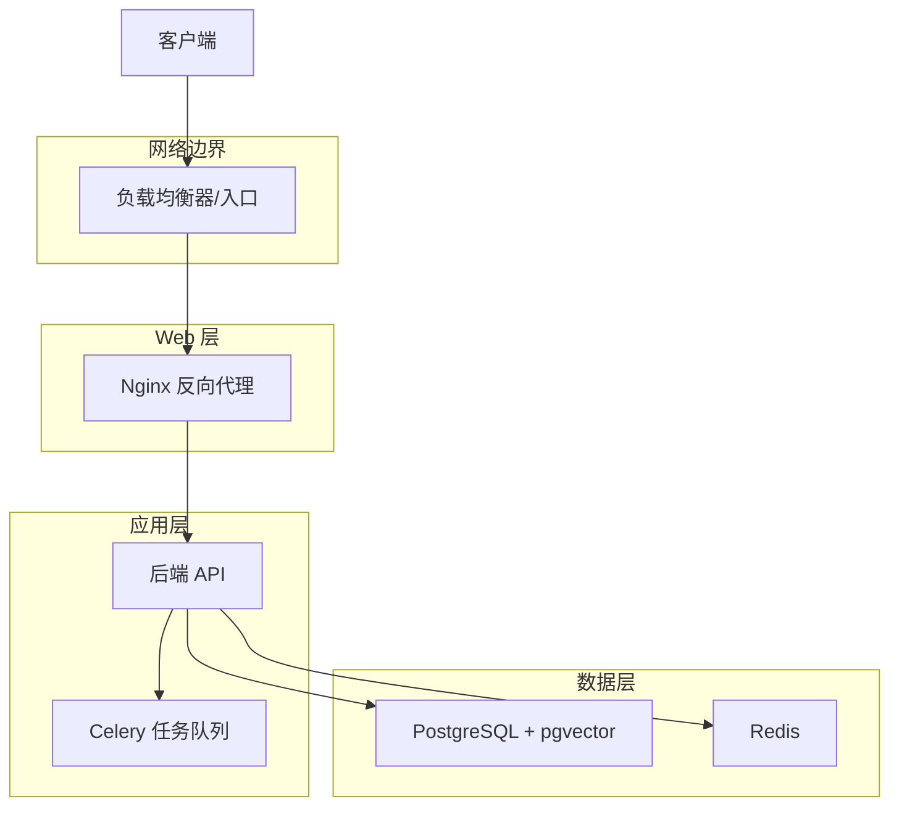
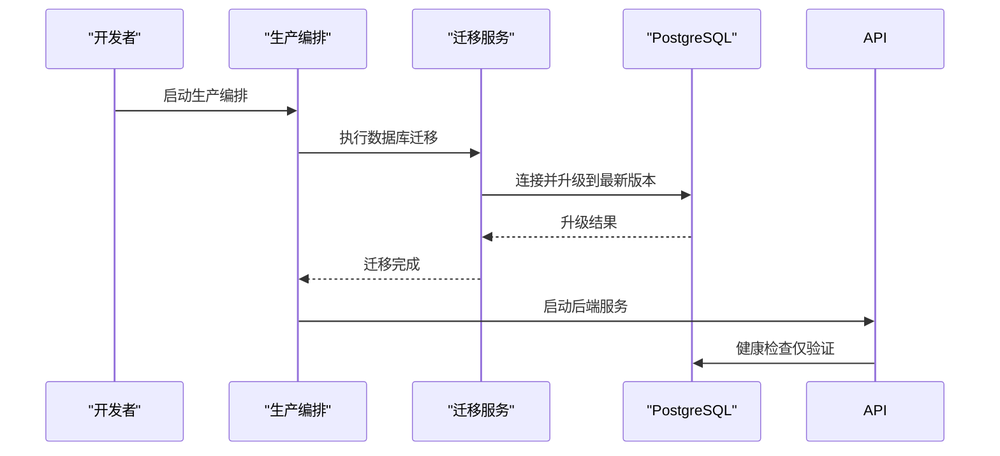
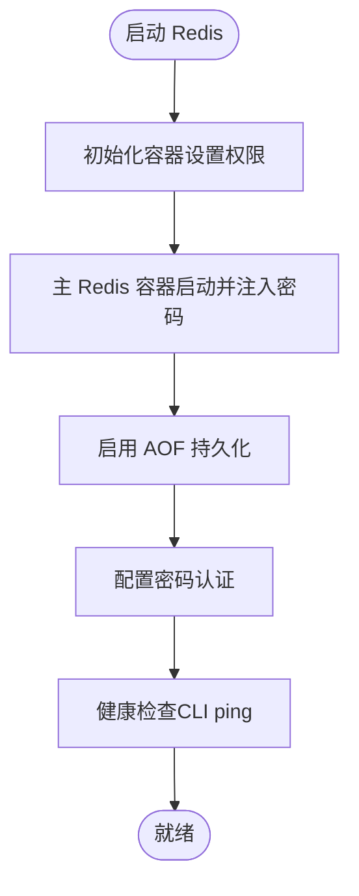
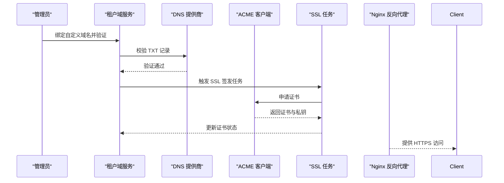
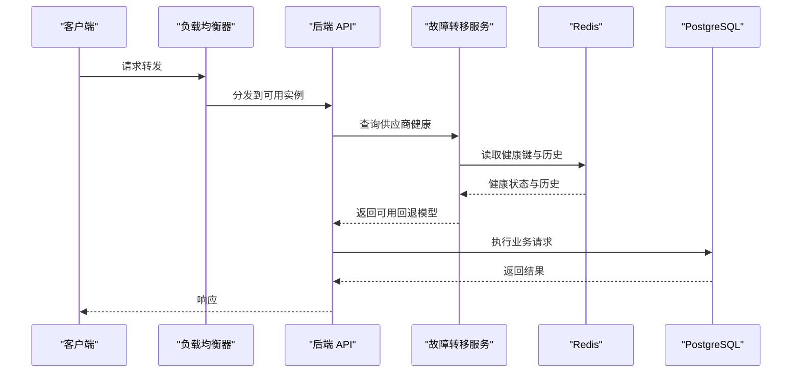
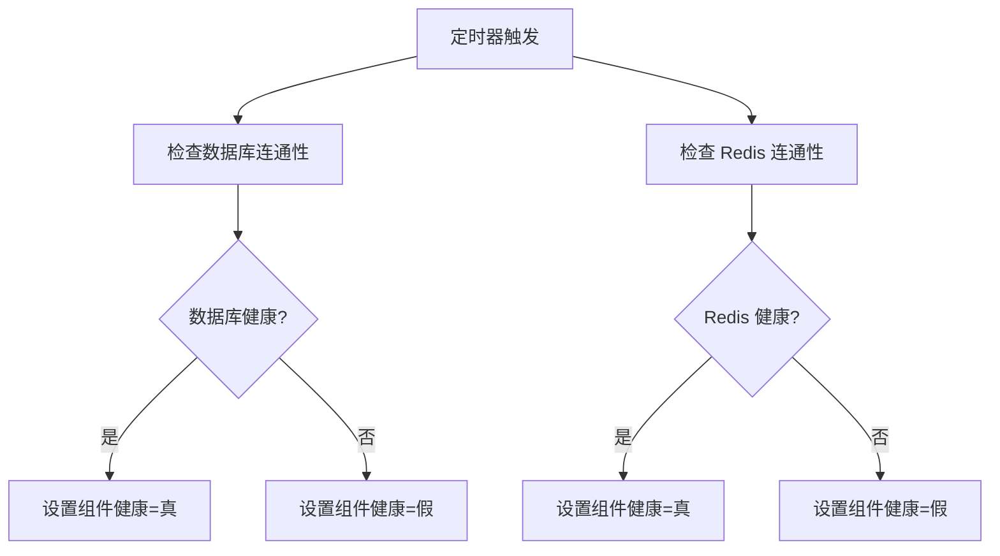
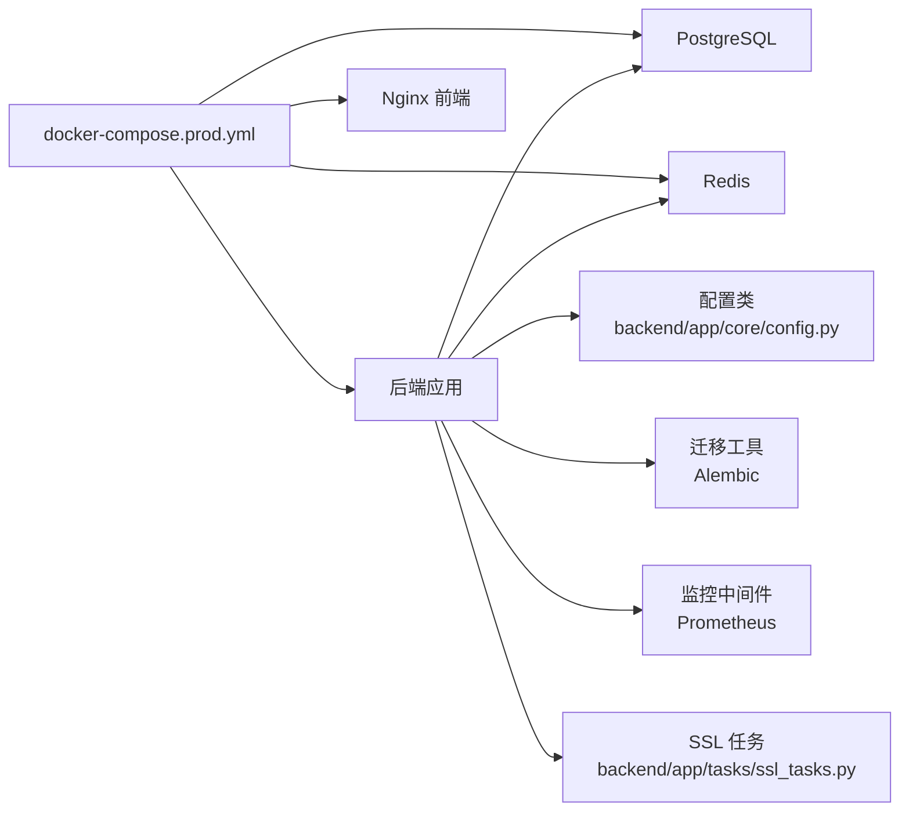

# 基础设施配置

<cite>
**本文档引用的文件**
- [docker-compose.prod.yml](file://docker-compose.prod.yml)
- [docker-compose.dev.yml](file://docker-compose.dev.yml)
- [.dockerignore](file://.dockerignore)
- [backend/app/core/config.py](file://backend/app/core/config.py)
- [backend/app/core/database.py](file://backend/app/core/database.py)
- [backend/app/core/redis.py](file://backend/app/core/redis.py)
- [backend/app/main.py](file://backend/app/main.py)
- [backend/app/services/system/acme_client.py](file://backend/app/services/system/acme_client.py)
- [backend/app/services/system/dns_provider.py](file://backend/app/services/system/dns_provider.py)
- [backend/app/services/system/tenant_domain_service.py](file://backend/app/services/system/tenant_domain_service.py)
- [backend/app/ai/failover.py](file://backend/app/ai/failover.py)
- [backend/app/ai/gateway_support/failover_orchestrator.py](file://backend/app/ai/gateway_support/failover_orchestrator.py)
- [backend/app/middleware/prometheus_metrics.py](file://backend/app/middleware/prometheus_metrics.py)
- [backend/app/tasks/ssl_tasks.py](file://backend/app/tasks/ssl_tasks.py)
- [backend/alembic.ini](file://backend/alembic.ini)
- [backend/migrations/env.py](file://backend/migrations/env.py)
- [backend/migrations/script.py.mako](file://backend/migrations/script.py.mako)
- [backend/pyproject.toml](file://backend/pyproject.toml)
- [frontend/scripts/deploy/Dockerfile](file://frontend/scripts/deploy/Dockerfile)
- [frontend/scripts/deploy/build-local-docker-image.sh](file://frontend/scripts/deploy/build-local-docker-image.sh)
</cite>

## 目录
1. [简介](#简介)
2. [项目结构](#项目结构)
3. [核心组件](#核心组件)
4. [架构总览](#架构总览)
5. [详细组件分析](#详细组件分析)
6. [依赖关系分析](#依赖关系分析)
7. [性能考虑](#性能考虑)
8. [故障排查指南](#故障排查指南)
9. [结论](#结论)
10. [附录](#附录)

## 简介
本文件面向生产环境基础设施配置，系统性梳理服务器配置、网络拓扑与安全设置；文档化数据库初始化、Redis配置与存储卷管理；说明SSL证书配置、域名绑定与反向代理设置；解释负载均衡策略、高可用性配置与故障转移机制；提供基础设施监控、告警配置与性能指标收集；并包含备份策略、数据恢复与灾难恢复计划。

## 项目结构
该仓库采用前后端分离与容器化部署架构，生产环境通过 Docker Compose 编排 PostgreSQL、Redis、后端应用与前端 Nginx 反向代理。开发环境提供本地数据库与缓存的便捷运行方式。基础设施相关的关键文件包括：
- 生产编排：docker-compose.prod.yml
- 开发编排：docker-compose.dev.yml
- 前端镜像构建：frontend/scripts/deploy/Dockerfile
- 前端构建脚本：frontend/scripts/deploy/build-local-docker-image.sh
- 后端配置与连接：backend/app/core/config.py、backend/app/core/database.py、backend/app/core/redis.py
- 启动与迁移：backend/app/main.py、backend/alembic.ini、backend/migrations/env.py
- SSL与DNS：backend/app/services/system/acme_client.py、backend/app/services/system/dns_provider.py、backend/app/services/system/tenant_domain_service.py、backend/app/tasks/ssl_tasks.py
- 故障转移与健康检查：backend/app/ai/failover.py、backend/app/ai/gateway_support/failover_orchestrator.py
- 监控与指标：backend/app/middleware/prometheus_metrics.py

```mermaid
graph TB
subgraph "生产环境"
NGINX["Nginx 反向代理<br/>frontend/scripts/deploy/Dockerfile"]
BACKEND["后端应用<br/>backend/app/main.py"]
DB["PostgreSQL(pgvector)<br/>docker-compose.prod.yml"]
REDIS["Redis<br/>docker-compose.prod.yml"]
VOLS["持久化卷<br/>postgres_data / redis_data / backend_storage / backend_logs"]
end
NGINX --> BACKEND
BACKEND --> DB
BACKEND --> REDIS
BACKEND -. 使用 .dockerignore 忽略敏感文件 .-> VOLS
```

图表来源
- [docker-compose.prod.yml:22-92](file://docker-compose.prod.yml#L22-L92)
- [frontend/scripts/deploy/Dockerfile:60-79](file://frontend/scripts/deploy/Dockerfile#L60-L79)
- [backend/app/main.py:87-109](file://backend/app/main.py#L87-L109)
- [.dockerignore:1-41](file://.dockerignore#L1-L41)

章节来源
- [docker-compose.prod.yml:1-92](file://docker-compose.prod.yml#L1-L92)
- [docker-compose.dev.yml:1-48](file://docker-compose.dev.yml#L1-L48)
- [frontend/scripts/deploy/Dockerfile:60-79](file://frontend/scripts/deploy/Dockerfile#L60-L79)
- [.dockerignore:1-41](file://.dockerignore#L1-L41)

## 核心组件
- 数据库（PostgreSQL + pgvector）
  - 使用官方镜像，启用健康检查，挂载持久化卷，支持初始化参数与字符集设置。
  - 连接URL在后端配置中统一生成，支持异步与同步两种驱动。
- 缓存（Redis）
  - 启用 AOF 持久化与密码认证，健康检查基于 CLI ping；通过临时配置文件注入密码。
- 应用（后端）
  - 生产模式下禁用启动迁移，仅进行连接性校验；迁移通过独立服务完成。
  - 提前初始化 Redis 以支持分布式锁等依赖。
- 前端（Nginx）
  - 多阶段构建，生产镜像仅包含静态资源与最小 Nginx 配置，暴露健康检查端点。
- 配置与安全
  - 环境变量集中于 Compose 文件，.dockerignore 显式排除敏感文件与私钥。
  - 后端配置类提供数据库与 Redis 连接串生成逻辑。

章节来源
- [docker-compose.prod.yml:23-92](file://docker-compose.prod.yml#L23-L92)
- [backend/app/core/config.py:93-122](file://backend/app/core/config.py#L93-L122)
- [backend/app/core/database.py](file://backend/app/core/database.py)
- [backend/app/core/redis.py](file://backend/app/core/redis.py)
- [backend/app/main.py:87-109](file://backend/app/main.py#L87-L109)
- [frontend/scripts/deploy/Dockerfile:60-79](file://frontend/scripts/deploy/Dockerfile#L60-L79)
- [.dockerignore:1-41](file://.dockerignore#L1-L41)

## 架构总览
生产环境采用“反向代理 + 应用 + 数据库 + 缓存”的分层架构。Nginx 作为入口，后端负责业务逻辑与数据访问，PostgreSQL 存储结构化数据，Redis 提供缓存与分布式协调。迁移与初始化通过独立服务完成，避免主进程阻塞。



图表来源
- [docker-compose.prod.yml:22-92](file://docker-compose.prod.yml#L22-L92)
- [backend/app/main.py:87-109](file://backend/app/main.py#L87-L109)
- [backend/app/tasks/ssl_tasks.py](file://backend/app/tasks/ssl_tasks.py)

## 详细组件分析

### 数据库初始化与迁移
- 初始化策略
  - 开发环境：启动时可执行数据库初始化与迁移。
  - 生产环境：通过独立迁移服务执行迁移，API 启动仅做连接性验证。
- 连接配置
  - 异步与同步连接串分别生成，便于 ORM 与迁移工具使用。
- 迁移工具
  - 使用 Alembic，配置文件与脚手架模板位于 backend 目录。



图表来源
- [docker-compose.prod.yml:83-92](file://docker-compose.prod.yml#L83-L92)
- [backend/app/main.py:87-109](file://backend/app/main.py#L87-L109)
- [backend/alembic.ini](file://backend/alembic.ini)
- [backend/migrations/env.py](file://backend/migrations/env.py)

章节来源
- [docker-compose.prod.yml:83-92](file://docker-compose.prod.yml#L83-L92)
- [backend/app/main.py:87-109](file://backend/app/main.py#L87-L109)
- [backend/app/core/config.py:93-122](file://backend/app/core/config.py#L93-L122)
- [backend/alembic.ini](file://backend/alembic.ini)
- [backend/migrations/env.py](file://backend/migrations/env.py)
- [backend/migrations/script.py.mako](file://backend/migrations/script.py.mako)

### Redis 配置与存储卷管理
- 安全与持久化
  - 启用 AOF 持久化与密码认证；通过临时配置文件注入密码，避免明文参数。
  - 健康检查使用带认证的 CLI 命令。
- 存储卷
  - 使用独立卷承载持久化数据，确保容器重建后数据不丢失。
- 启动顺序
  - 通过初始化容器修改目录权限，再启动 Redis 主服务。



图表来源
- [docker-compose.prod.yml:41-81](file://docker-compose.prod.yml#L41-L81)
- [backend/app/core/redis.py](file://backend/app/core/redis.py)

章节来源
- [docker-compose.prod.yml:41-81](file://docker-compose.prod.yml#L41-L81)
- [backend/app/core/redis.py](file://backend/app/core/redis.py)

### 存储卷管理与安全
- 忽略策略
  - .dockerignore 显式忽略敏感文件与私钥，避免被镜像层包含。
- 挂载卷
  - 生产编排定义了后端存储与日志卷，用于持久化应用数据与运行日志。
- 建议
  - 对外部挂载的卷进行访问控制与定期审计；对敏感文件使用环境变量注入而非硬编码。

章节来源
- [.dockerignore:1-41](file://.dockerignore#L1-L41)
- [docker-compose.prod.yml:18-21](file://docker-compose.prod.yml#L18-L21)

### SSL 证书配置、域名绑定与反向代理
- 域名绑定
  - 通过平台配置与租户域服务实现域名绑定与主域名切换。
- DNS 提供商
  - 支持 Cloudflare，需提供 API Token 与 Zone ID；手动模式在非调试环境下不被允许。
- ACME 自动签发
  - 支持 Let's Encrypt 与 Staging 环境；可配置自动续期提前天数。
- 反向代理
  - 前端 Nginx 多阶段构建，生产镜像仅包含静态资源与最小配置，暴露健康检查端口。
- 构建约束
  - 前端生产镜像要求 HTTPS 基础 URL，且禁止使用占位值。



图表来源
- [backend/app/services/system/tenant_domain_service.py:368-417](file://backend/app/services/system/tenant_domain_service.py#L368-L417)
- [backend/app/services/system/dns_provider.py:193-323](file://backend/app/services/system/dns_provider.py#L193-L323)
- [backend/app/services/system/acme_client.py:45-80](file://backend/app/services/system/acme_client.py#L45-L80)
- [backend/app/tasks/ssl_tasks.py](file://backend/app/tasks/ssl_tasks.py)
- [frontend/scripts/deploy/Dockerfile:60-79](file://frontend/scripts/deploy/Dockerfile#L60-L79)
- [frontend/scripts/deploy/build-local-docker-image.sh:19-37](file://frontend/scripts/deploy/build-local-docker-image.sh#L19-L37)

章节来源
- [backend/app/services/system/tenant_domain_service.py:334-438](file://backend/app/services/system/tenant_domain_service.py#L334-L438)
- [backend/app/services/system/dns_provider.py:193-323](file://backend/app/services/system/dns_provider.py#L193-L323)
- [backend/app/services/system/acme_client.py:45-80](file://backend/app/services/system/acme_client.py#L45-L80)
- [frontend/scripts/deploy/Dockerfile:60-79](file://frontend/scripts/deploy/Dockerfile#L60-L79)
- [frontend/scripts/deploy/build-local-docker-image.sh:19-37](file://frontend/scripts/deploy/build-local-docker-image.sh#L19-L37)

### 负载均衡策略、高可用性与故障转移
- 负载均衡
  - 建议在容器编排前增加 L4/L7 负载均衡器，实现多副本后端的流量分发。
- 高可用
  - 数据库与缓存均配置健康检查；后端在启动阶段依赖 Redis 进行分布式协调。
- 故障转移
  - AI 引擎具备供应商健康检查与回退模型选择能力，结合 Redis 存储健康状态与历史记录。
  - 网关层提供统一的健康查询与历史记录接口，便于观测与决策。



图表来源
- [backend/app/ai/failover.py:220-480](file://backend/app/ai/failover.py#L220-L480)
- [backend/app/ai/gateway_support/failover_orchestrator.py:31-68](file://backend/app/ai/gateway_support/failover_orchestrator.py#L31-L68)
- [backend/app/main.py:556-593](file://backend/app/main.py#L556-L593)

章节来源
- [backend/app/ai/failover.py:220-480](file://backend/app/ai/failover.py#L220-L480)
- [backend/app/ai/gateway_support/failover_orchestrator.py:31-68](file://backend/app/ai/gateway_support/failover_orchestrator.py#L31-L68)
- [backend/app/main.py:556-593](file://backend/app/main.py#L556-L593)

### 基础设施监控、告警与性能指标
- 组件健康刷新
  - 后端定时刷新数据库与 Redis 的健康状态，并写入组件健康指标。
- 指标中间件
  - Prometheus 指标中间件提供标准指标端点，便于集成监控系统。
- 建议
  - 结合负载均衡器与容器编排的健康探针，建立多层次监控与告警。



图表来源
- [backend/app/main.py:556-593](file://backend/app/main.py#L556-L593)
- [backend/app/middleware/prometheus_metrics.py](file://backend/app/middleware/prometheus_metrics.py)

章节来源
- [backend/app/main.py:556-593](file://backend/app/main.py#L556-L593)
- [backend/app/middleware/prometheus_metrics.py](file://backend/app/middleware/prometheus_metrics.py)

### 备份策略、数据恢复与灾难恢复
- 数据备份
  - PostgreSQL：建议使用 pg_dump/pg_restore 或逻辑/物理备份方案，结合对象存储归档。
  - Redis：建议在 AOF 启用基础上定期快照，或使用 RDB 备份。
  - 应用存储：对挂载卷进行周期性快照或备份。
- 数据恢复
  - 制定恢复演练流程，验证备份完整性与恢复时间目标（RTO/RPO）。
- 灾难恢复
  - 建立跨区域或多集群容灾方案，确保在主数据中心故障时快速接管。
  - 将 DNS 与负载均衡器配置为可快速切换至备用站点。

[本节为通用实践指导，无需特定文件引用]

## 依赖关系分析



图表来源
- [docker-compose.prod.yml:1-92](file://docker-compose.prod.yml#L1-L92)
- [backend/app/core/config.py:93-122](file://backend/app/core/config.py#L93-L122)
- [backend/alembic.ini](file://backend/alembic.ini)
- [backend/app/middleware/prometheus_metrics.py](file://backend/app/middleware/prometheus_metrics.py)
- [backend/app/tasks/ssl_tasks.py](file://backend/app/tasks/ssl_tasks.py)

章节来源
- [docker-compose.prod.yml:1-92](file://docker-compose.prod.yml#L1-L92)
- [backend/app/core/config.py:93-122](file://backend/app/core/config.py#L93-L122)
- [backend/alembic.ini](file://backend/alembic.ini)

## 性能考虑
- 连接池与并发
  - 合理配置数据库与缓存连接池大小，避免过度连接导致资源争用。
- 缓存策略
  - 对热点数据使用 Redis 缓存，结合失效策略与预热机制。
- 健康检查间隔
  - 调整健康检查间隔与超时，平衡探测频率与系统开销。
- 前端静态资源
  - 使用 Nginx 压缩与缓存头，减少带宽占用与响应延迟。

[本节提供通用指导，无需特定文件引用]

## 故障排查指南
- 数据库连接失败
  - 检查环境变量与连接串生成逻辑；确认容器健康检查状态与网络连通性。
- Redis 认证失败
  - 核对密码注入流程与健康检查命令；确认卷权限与配置文件生成。
- SSL 申请异常
  - 检查 DNS 提供商配置与 API 凭据；确认域名验证状态与任务队列。
- 组件健康指标异常
  - 查看定时刷新逻辑与日志输出，定位具体组件失败原因。

章节来源
- [backend/app/core/config.py:93-122](file://backend/app/core/config.py#L93-L122)
- [docker-compose.prod.yml:33-37](file://docker-compose.prod.yml#L33-L37)
- [backend/app/services/system/dns_provider.py:193-323](file://backend/app/services/system/dns_provider.py#L193-L323)
- [backend/app/main.py:556-593](file://backend/app/main.py#L556-L593)

## 结论
本基础设施配置以容器化为核心，通过明确的编排、严格的配置与安全策略、完善的监控与故障转移机制，支撑生产环境的稳定运行。建议在现有基础上进一步完善跨区域容灾、自动化运维与安全加固，持续提升可用性与可维护性。

## 附录
- 开发环境参考
  - 开发编排提供本地数据库与缓存的便捷运行方式，便于本地联调与测试。
- 前端构建约束
  - 生产镜像构建脚本对基础 URL 与占位值进行严格校验，确保生产环境的安全性与正确性。

章节来源
- [docker-compose.dev.yml:1-48](file://docker-compose.dev.yml#L1-L48)
- [frontend/scripts/deploy/build-local-docker-image.sh:19-37](file://frontend/scripts/deploy/build-local-docker-image.sh#L19-L37)