# 安全加固

<cite>
**本文引用的文件**
- [backend/app/core/security.py](file://backend/app/core/security.py)
- [backend/app/core/cors.py](file://backend/app/core/cors.py)
- [backend/app/middleware/dynamic_cors.py](file://backend/app/middleware/dynamic_cors.py)
- [backend/app/middleware/audit_log.py](file://backend/app/middleware/audit_log.py)
- [backend/app/services/common/auth_service.py](file://backend/app/services/common/auth_service.py)
- [backend/app/services/common/auth_domains/session_password.py](file://backend/app/services/common/auth_domains/session_password.py)
- [backend/app/services/common/auth_domains/tenant_user_login.py](file://backend/app/services/common/auth_domains/tenant_user_login.py)
- [backend/app/ai/tools/security.py](file://backend/app/ai/tools/security.py)
- [backend/app/ai/tools/executors/code_execution_executor.py](file://backend/app/ai/tools/executors/code_execution_executor.py)
- [backend/app/plugins/crypto.py](file://backend/app/plugins/crypto.py)
- [backend/app/plugins/security.py](file://backend/app/plugins/security.py)
- [backend/app/ai/rate_limiter.py](file://backend/app/ai/rate_limiter.py)
- [backend/app/middleware/access_control.py](file://backend/app/middleware/access_control.py)
- [backend/app/middleware/permission.py](file://backend/app/middleware/permission.py)
- [backend/app/rbac/services/permission_domains/query.py](file://backend/app/rbac/services/permission_domains/query.py)
- [backend/app/rbac/services/permission_domains/presentation.py](file://backend/app/rbac/services/permission_domains/presentation.py)
- [backend/app/ai/tools/security_output_support.py](file://backend/app/ai/tools/security_output_support.py)
- [backend/tests/services/test_auth_logging.py](file://backend/tests/services/test_auth_logging.py)
- [backend/tests/test_plugin_crypto.py](file://backend/tests/test_plugin_crypto.py)
- [backend/tests/test_plugin_public_asset_route.py](file://backend/tests/test_plugin_public_asset_route.py)
</cite>

## 目录
1. [引言](#引言)
2. [项目结构](#项目结构)
3. [核心组件](#核心组件)
4. [架构总览](#架构总览)
5. [详细组件分析](#详细组件分析)
6. [依赖关系分析](#依赖关系分析)
7. [性能考量](#性能考量)
8. [故障排查指南](#故障排查指南)
9. [结论](#结论)
10. [附录](#附录)

## 引言
本文件面向“安全加固”的目标，系统化梳理并文档化后端在身份认证、授权与会话管理、输入验证与SQL注入防护、XSS防护、CSRF保护、CORS配置、安全头设置、数据加密与密钥管理、敏感信息保护、安全审计、漏洞扫描与渗透测试流程、合规性与事件响应等方面的设计与实现要点。文档同时提供可视化图示与可操作建议，帮助开发者与运维人员快速理解与落地安全实践。

## 项目结构
后端采用分层与领域驱动设计，安全相关能力主要分布在以下模块：
- 核心安全与配置：核心安全常量、令牌解析、加密/解密、CORS策略等
- 中间件：审计日志、动态CORS、权限控制、访问控制等
- 认证与会话：认证服务、登录域、会话与密码域、登出与撤销
- 授权与RBAC：权限查询、展示、租户管理员域
- AI工具与插件安全：SQL安全校验、代码执行安全、输出敏感信息掩码、插件配置加密
- 速率限制：AI调用的RPM/TPM限制
- 测试：认证日志脱敏、插件配置加解密与掩码、公共资产路由安全头

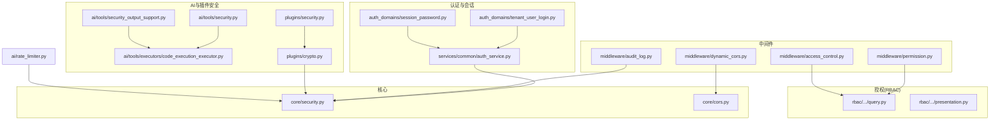

图表来源
- [backend/app/core/security.py:431-468](file://backend/app/core/security.py#L431-L468)
- [backend/app/core/cors.py:234-264](file://backend/app/core/cors.py#L234-L264)
- [backend/app/middleware/audit_log.py:1-581](file://backend/app/middleware/audit_log.py#L1-L581)
- [backend/app/middleware/dynamic_cors.py:1-65](file://backend/app/middleware/dynamic_cors.py#L1-L65)
- [backend/app/services/common/auth_service.py](file://backend/app/services/common/auth_service.py)
- [backend/app/services/common/auth_domains/tenant_user_login.py:34-72](file://backend/app/services/common/auth_domains/tenant_user_login.py#L34-L72)
- [backend/app/services/common/auth_domains/session_password.py:20-59](file://backend/app/services/common/auth_domains/session_password.py#L20-L59)
- [backend/app/rbac/services/permission_domains/query.py:1-33](file://backend/app/rbac/services/permission_domains/query.py#L1-L33)
- [backend/app/rbac/services/permission_domains/presentation.py:94-127](file://backend/app/rbac/services/permission_domains/presentation.py#L94-L127)
- [backend/app/ai/tools/security.py:398-433](file://backend/app/ai/tools/security.py#L398-L433)
- [backend/app/ai/tools/executors/code_execution_executor.py:121-148](file://backend/app/ai/tools/executors/code_execution_executor.py#L121-L148)
- [backend/app/ai/tools/security_output_support.py:92-123](file://backend/app/ai/tools/security_output_support.py#L92-L123)
- [backend/app/plugins/crypto.py:1-37](file://backend/app/plugins/crypto.py#L1-L37)
- [backend/app/plugins/security.py](file://backend/app/plugins/security.py)
- [backend/app/ai/rate_limiter.py:51-269](file://backend/app/ai/rate_limiter.py#L51-L269)

章节来源
- [backend/app/core/security.py:431-468](file://backend/app/core/security.py#L431-L468)
- [backend/app/core/cors.py:234-264](file://backend/app/core/cors.py#L234-L264)
- [backend/app/middleware/audit_log.py:1-581](file://backend/app/middleware/audit_log.py#L1-L581)
- [backend/app/middleware/dynamic_cors.py:1-65](file://backend/app/middleware/dynamic_cors.py#L1-L65)
- [backend/app/services/common/auth_service.py](file://backend/app/services/common/auth_service.py)
- [backend/app/services/common/auth_domains/tenant_user_login.py:34-72](file://backend/app/services/common/auth_domains/tenant_user_login.py#L34-L72)
- [backend/app/services/common/auth_domains/session_password.py:20-59](file://backend/app/services/common/auth_domains/session_password.py#L20-L59)
- [backend/app/rbac/services/permission_domains/query.py:1-33](file://backend/app/rbac/services/permission_domains/query.py#L1-L33)
- [backend/app/rbac/services/permission_domains/presentation.py:94-127](file://backend/app/rbac/services/permission_domains/presentation.py#L94-L127)
- [backend/app/ai/tools/security.py:398-433](file://backend/app/ai/tools/security.py#L398-L433)
- [backend/app/ai/tools/executors/code_execution_executor.py:121-148](file://backend/app/ai/tools/executors/code_execution_executor.py#L121-L148)
- [backend/app/ai/tools/security_output_support.py:92-123](file://backend/app/ai/tools/security_output_support.py#L92-L123)
- [backend/app/plugins/crypto.py:1-37](file://backend/app/plugins/crypto.py#L1-L37)
- [backend/app/plugins/security.py](file://backend/app/plugins/security.py)
- [backend/app/ai/rate_limiter.py:51-269](file://backend/app/ai/rate_limiter.py#L51-L269)

## 核心组件
- 令牌与会话管理：基于JTI与Redis的活跃令牌记录、撤销与登出流程
- 认证与登录域：用户名/邮箱/手机号多入口、租户域约束、验证码校验
- 授权与RBAC：权限树构建、菜单与资源动作映射、租户管理员域
- 输入与SQL安全：仅允许SELECT/CTE、禁止写操作序列、系统表访问阻断
- 代码执行安全：对不受信工具包进行安全扫描与阻断
- 输出敏感信息掩码：识别并掩码密钥前缀
- 数据加密与密钥管理：基于SECRET_KEY派生Fernet密钥，统一加密/解密接口
- 插件配置加密：基于Schema标记的自动加解密与API响应脱敏
- 审计日志：请求/响应信息采集、敏感字段脱敏、异步落库
- CORS与安全头：动态Origin策略、预检短路、暴露头与Vary控制
- 速率限制：RPM/TPM滑动窗口原子计数与预扣减

章节来源
- [backend/app/services/common/auth_domains/session_password.py:20-59](file://backend/app/services/common/auth_domains/session_password.py#L20-L59)
- [backend/app/services/common/auth_domains/tenant_user_login.py:34-72](file://backend/app/services/common/auth_domains/tenant_user_login.py#L34-L72)
- [backend/app/rbac/services/permission_domains/presentation.py:94-127](file://backend/app/rbac/services/permission_domains/presentation.py#L94-L127)
- [backend/app/ai/tools/security.py:398-433](file://backend/app/ai/tools/security.py#L398-L433)
- [backend/app/ai/tools/executors/code_execution_executor.py:121-148](file://backend/app/ai/tools/executors/code_execution_executor.py#L121-L148)
- [backend/app/ai/tools/security_output_support.py:92-123](file://backend/app/ai/tools/security_output_support.py#L92-L123)
- [backend/app/core/security.py:431-468](file://backend/app/core/security.py#L431-L468)
- [backend/app/plugins/crypto.py:1-37](file://backend/app/plugins/crypto.py#L1-L37)
- [backend/app/middleware/audit_log.py:1-581](file://backend/app/middleware/audit_log.py#L1-L581)
- [backend/app/core/cors.py:234-264](file://backend/app/core/cors.py#L234-L264)
- [backend/app/middleware/dynamic_cors.py:1-65](file://backend/app/middleware/dynamic_cors.py#L1-L65)
- [backend/app/ai/rate_limiter.py:51-269](file://backend/app/ai/rate_limiter.py#L51-L269)

## 架构总览
下图展示了从客户端到后端服务的关键交互路径，以及安全控制点的分布。

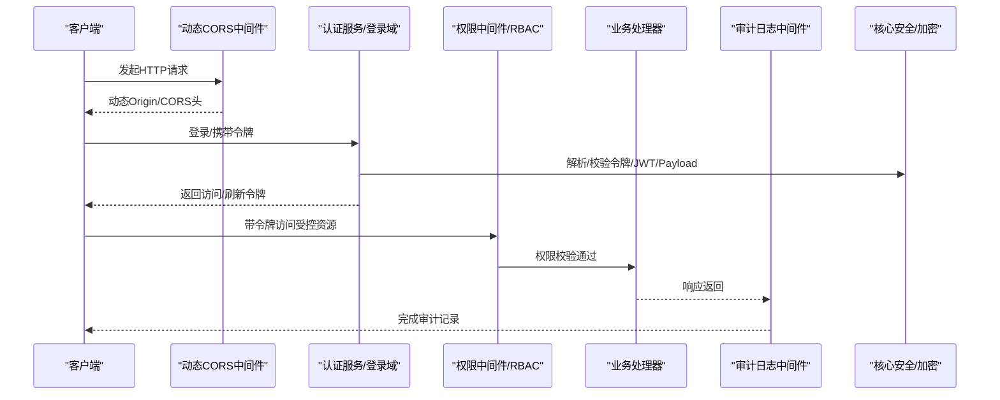

图表来源
- [backend/app/middleware/dynamic_cors.py:19-62](file://backend/app/middleware/dynamic_cors.py#L19-L62)
- [backend/app/services/common/auth_domains/tenant_user_login.py:34-72](file://backend/app/services/common/auth_domains/tenant_user_login.py#L34-L72)
- [backend/app/middleware/permission.py](file://backend/app/middleware/permission.py)
- [backend/app/middleware/audit_log.py:235-581](file://backend/app/middleware/audit_log.py#L235-L581)
- [backend/app/core/security.py:431-468](file://backend/app/core/security.py#L431-L468)

## 详细组件分析

### 身份认证与会话管理
- 登录域支持用户名/邮箱/手机号多入口，并强制租户域参数；登录失败与异常均记录告警日志并进行标识脱敏
- 会话与密码域通过Redis维护活跃令牌哈希，记录access JTI到refresh JTI映射，并按配置设置TTL
- 登出流程解析access token载荷，提取JTI与过期待计算剩余有效期，执行撤销逻辑并记录警告

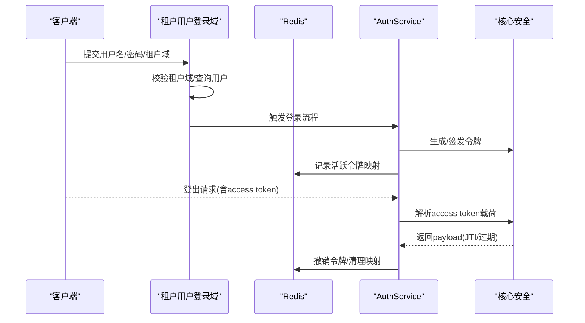

图表来源
- [backend/app/services/common/auth_domains/tenant_user_login.py:34-72](file://backend/app/services/common/auth_domains/tenant_user_login.py#L34-L72)
- [backend/app/services/common/auth_domains/session_password.py:26-59](file://backend/app/services/common/auth_domains/session_password.py#L26-L59)
- [backend/app/core/security.py:431-468](file://backend/app/core/security.py#L431-L468)

章节来源
- [backend/app/services/common/auth_domains/tenant_user_login.py:34-72](file://backend/app/services/common/auth_domains/tenant_user_login.py#L34-L72)
- [backend/app/services/common/auth_domains/session_password.py:20-59](file://backend/app/services/common/auth_domains/session_password.py#L20-L59)
- [backend/tests/services/test_auth_logging.py:19-42](file://backend/tests/services/test_auth_logging.py#L19-L42)

### 授权机制与RBAC
- 权限查询域负责按启用/未删除状态加载权限集合，并支持按类型过滤
- 展示域递归构建权限树，支持菜单、图标、路径等前端渲染所需字段
- 权限中间件与访问控制中间件配合，确保受控资源访问前完成权限校验

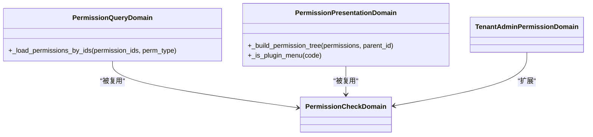

图表来源
- [backend/app/rbac/services/permission_domains/query.py:1-33](file://backend/app/rbac/services/permission_domains/query.py#L1-L33)
- [backend/app/rbac/services/permission_domains/presentation.py:94-127](file://backend/app/rbac/services/permission_domains/presentation.py#L94-L127)
- [backend/app/middleware/permission.py](file://backend/app/middleware/permission.py)
- [backend/app/middleware/access_control.py](file://backend/app/middleware/access_control.py)

章节来源
- [backend/app/rbac/services/permission_domains/query.py:1-33](file://backend/app/rbac/services/permission_domains/query.py#L1-L33)
- [backend/app/rbac/services/permission_domains/presentation.py:94-127](file://backend/app/rbac/services/permission_domains/presentation.py#L94-L127)
- [backend/app/middleware/permission.py](file://backend/app/middleware/permission.py)
- [backend/app/middleware/access_control.py](file://backend/app/middleware/access_control.py)

### 会话管理与令牌撤销
- 通过Redis哈希记录用户活跃令牌映射，设置TTL保证过期回收
- 登出时解析access token载荷，若存在JTI则按剩余有效期进行撤销与清理

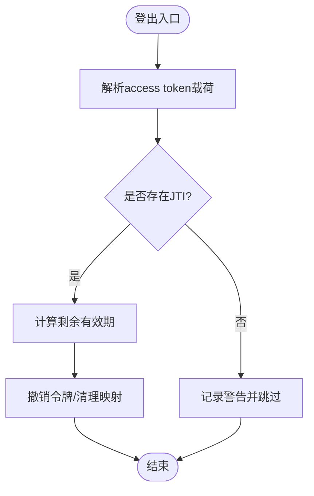

图表来源
- [backend/app/services/common/auth_domains/session_password.py:42-59](file://backend/app/services/common/auth_domains/session_password.py#L42-L59)

章节来源
- [backend/app/services/common/auth_domains/session_password.py:20-59](file://backend/app/services/common/auth_domains/session_password.py#L20-L59)

### 输入验证与SQL注入防护
- 工具层对SQL进行白名单校验：仅允许SELECT或WITH开头，禁止写操作序列，阻断系统表访问
- 若缺失LIMIT，自动注入上限以限制结果集规模

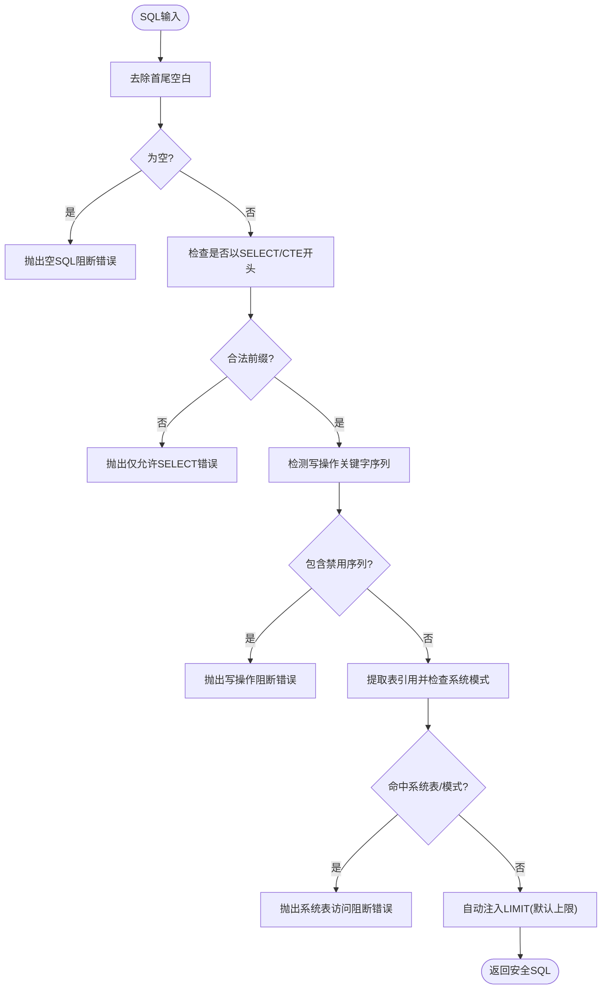

图表来源
- [backend/app/ai/tools/security.py:398-433](file://backend/app/ai/tools/security.py#L398-L433)

章节来源
- [backend/app/ai/tools/security.py:398-433](file://backend/app/ai/tools/security.py#L398-L433)

### XSS防护与输出敏感信息掩码
- 对输出中的敏感键前缀进行识别与掩码，避免在日志或响应中泄露
- 插件配置在API响应中进行脱敏显示，确保密钥类字段不可见全貌

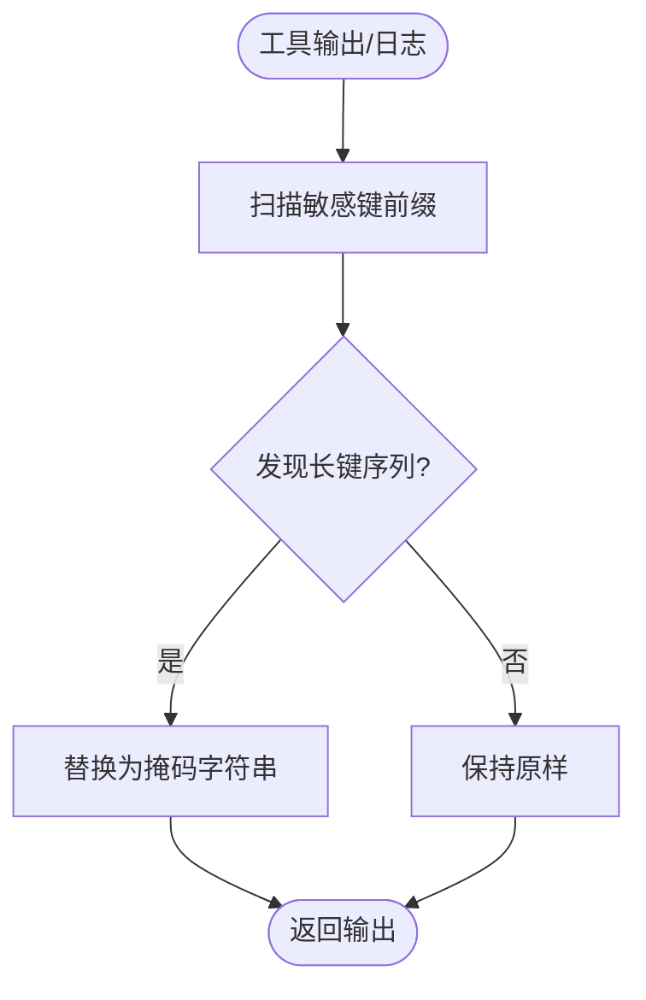

图表来源
- [backend/app/ai/tools/security_output_support.py:92-123](file://backend/app/ai/tools/security_output_support.py#L92-L123)

章节来源
- [backend/app/ai/tools/security_output_support.py:92-123](file://backend/app/ai/tools/security_output_support.py#L92-L123)
- [backend/tests/test_plugin_crypto.py:12-53](file://backend/tests/test_plugin_crypto.py#L12-L53)

### CSRF保护
- 当前仓库未发现显式的CSRF令牌中间件或CSRF保护实现。建议在前端与后端之间引入CSRF令牌机制（如Cookie + 同源校验、自定义Header），并在关键写操作接口强制校验。

[本节为概念性建议，不直接分析具体文件]

### CORS配置与安全头
- 动态CORS中间件根据Origin进行允许性判断，预检请求直接短路并返回允许的头
- 核心CORS模块提供统一的CORS头构建与Origin白名单校验
- 公共插件资产路由测试覆盖了安全头与Cookie清理策略（如Cache-Control、Vary、X-Content-Type-Options）

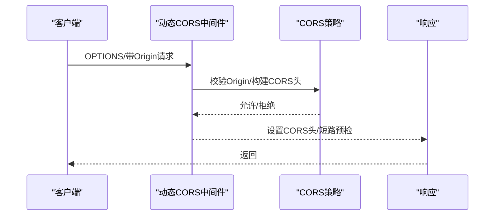

图表来源
- [backend/app/middleware/dynamic_cors.py:25-62](file://backend/app/middleware/dynamic_cors.py#L25-L62)
- [backend/app/core/cors.py:234-264](file://backend/app/core/cors.py#L234-L264)
- [backend/tests/test_plugin_public_asset_route.py:52-75](file://backend/tests/test_plugin_public_asset_route.py#L52-L75)

章节来源
- [backend/app/middleware/dynamic_cors.py:1-65](file://backend/app/middleware/dynamic_cors.py#L1-L65)
- [backend/app/core/cors.py:209-264](file://backend/app/core/cors.py#L209-L264)
- [backend/tests/test_plugin_public_asset_route.py:52-75](file://backend/tests/test_plugin_public_asset_route.py#L52-L75)

### 数据加密、密钥管理与敏感信息保护
- 基于SECRET_KEY派生Fernet密钥，提供统一的加密/解密接口
- 插件配置加密：依据Schema标记自动加解密，运行时解密，API响应脱敏
- 认证日志对标识符进行脱敏，避免明文泄露

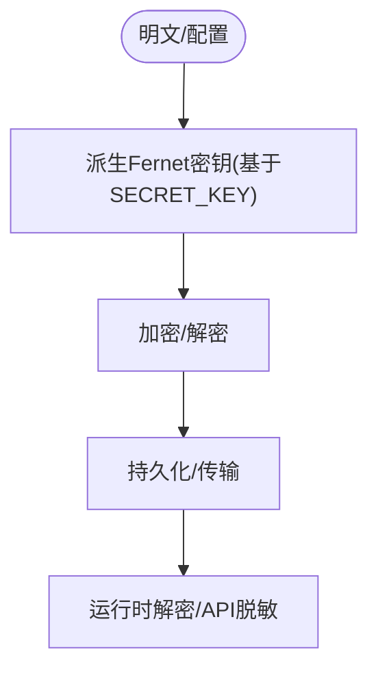

图表来源
- [backend/app/core/security.py:431-468](file://backend/app/core/security.py#L431-L468)
- [backend/app/plugins/crypto.py:1-37](file://backend/app/plugins/crypto.py#L1-L37)
- [backend/tests/services/test_auth_logging.py:19-42](file://backend/tests/services/test_auth_logging.py#L19-L42)

章节来源
- [backend/app/core/security.py:431-468](file://backend/app/core/security.py#L431-L468)
- [backend/app/plugins/crypto.py:1-37](file://backend/app/plugins/crypto.py#L1-L37)
- [backend/tests/services/test_auth_logging.py:19-42](file://backend/tests/services/test_auth_logging.py#L19-L42)

### 安全审计与日志
- 审计中间件拦截API请求，解析用户信息、方法、路径、参数、响应状态与耗时
- 对敏感字段进行脱敏处理，异步写入数据库，避免阻塞请求
- 特殊操作（如登录/登出）进行专门的动作类型推断与资源重建

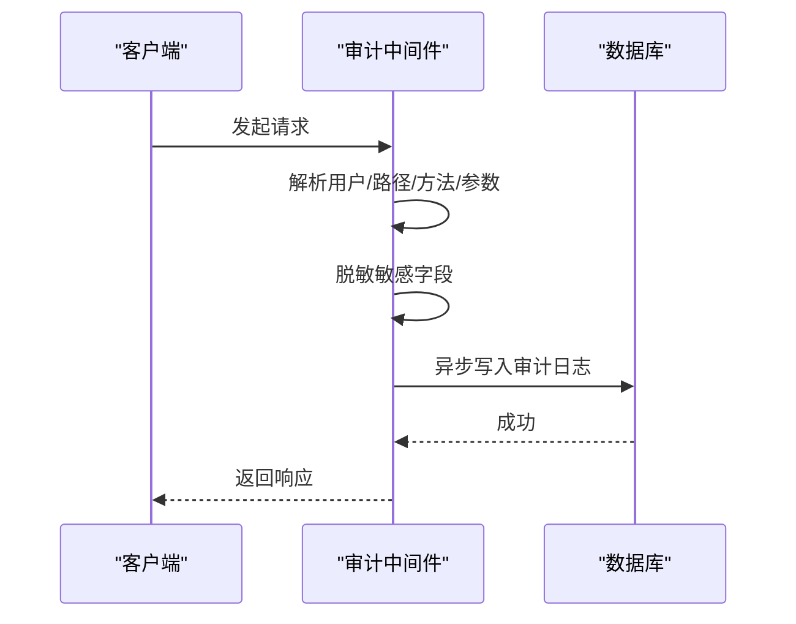

图表来源
- [backend/app/middleware/audit_log.py:235-581](file://backend/app/middleware/audit_log.py#L235-L581)

章节来源
- [backend/app/middleware/audit_log.py:1-581](file://backend/app/middleware/audit_log.py#L1-L581)

### 速率限制（RPM/TPM）
- 使用Redis与Lua脚本实现原子化的RPM（每分钟请求数）与TPM（每分钟Token数）限制
- 支持预扣减与回滚，避免竞态条件导致的超限

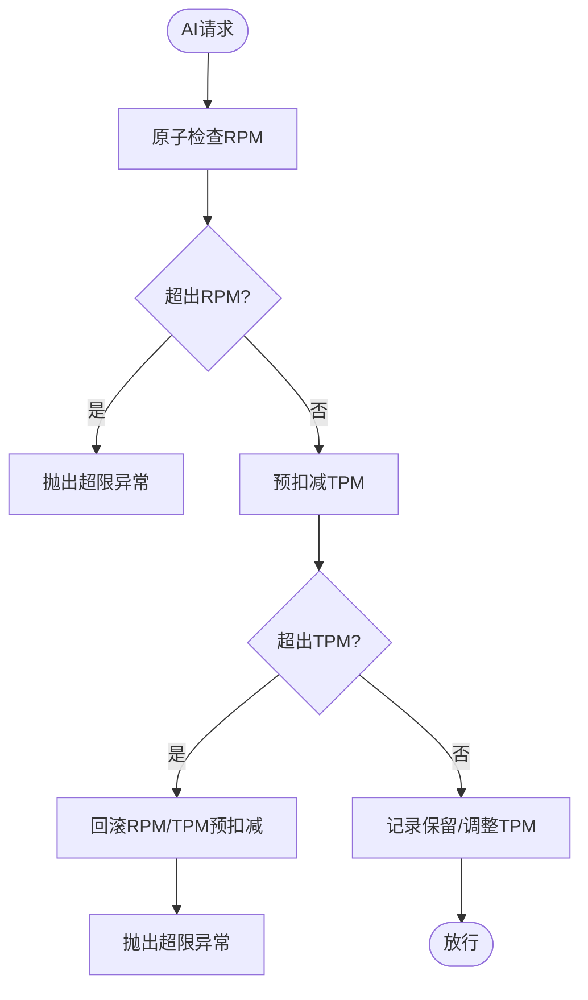

图表来源
- [backend/app/ai/rate_limiter.py:96-269](file://backend/app/ai/rate_limiter.py#L96-L269)

章节来源
- [backend/app/ai/rate_limiter.py:51-269](file://backend/app/ai/rate_limiter.py#L51-L269)

### 代码执行安全与插件安全
- 不受信工具包在执行前进行安全扫描，阻断违规行为（如禁止导入、eval/exec/compile、文件操作等）
- 代码执行审计：记录工具名称、语言、代码预览、状态、耗时与错误信息

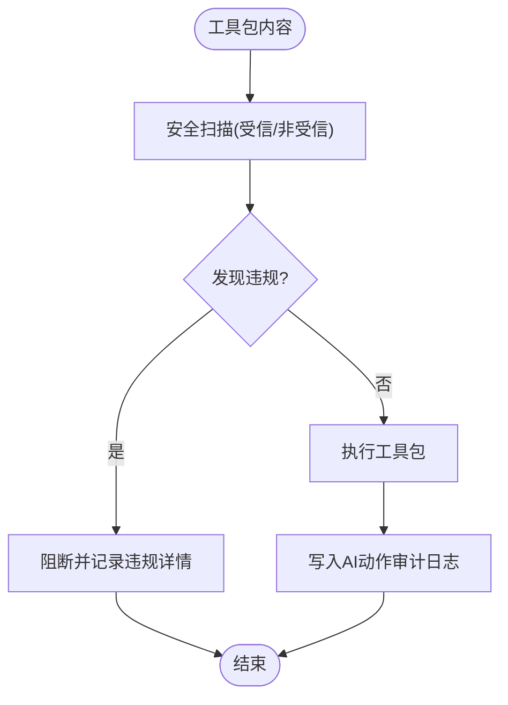

图表来源
- [backend/app/ai/tools/executors/code_execution_executor.py:121-148](file://backend/app/ai/tools/executors/code_execution_executor.py#L121-L148)
- [backend/app/ai/tools/executors/code_execution_executor.py:410-453](file://backend/app/ai/tools/executors/code_execution_executor.py#L410-L453)

章节来源
- [backend/app/ai/tools/executors/code_execution_executor.py:121-148](file://backend/app/ai/tools/executors/code_execution_executor.py#L121-L148)
- [backend/app/ai/tools/executors/code_execution_executor.py:410-453](file://backend/app/ai/tools/executors/code_execution_executor.py#L410-L453)

## 依赖关系分析
- 认证服务依赖核心安全模块进行令牌解析与撤销，依赖Redis记录活跃令牌
- 登录域依赖数据库查询与租户域约束，失败场景触发认证日志
- RBAC中间件依赖权限查询域与展示域，构建权限树并进行访问控制
- 审计中间件依赖核心安全模块解析用户信息，异步写入数据库
- AI工具安全与代码执行安全依赖Redis与Lua脚本实现速率限制与原子操作
- 插件配置加密依赖核心安全模块的加密接口与Schema元数据

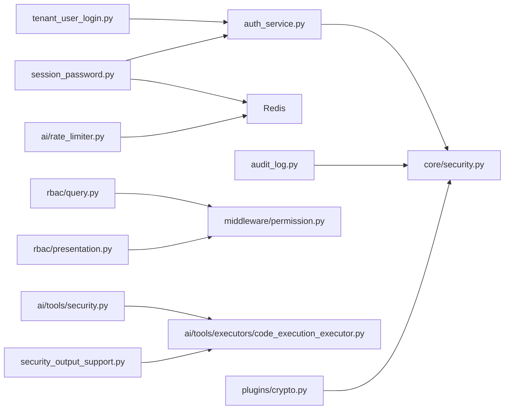

图表来源
- [backend/app/services/common/auth_service.py](file://backend/app/services/common/auth_service.py)
- [backend/app/core/security.py:431-468](file://backend/app/core/security.py#L431-L468)
- [backend/app/services/common/auth_domains/tenant_user_login.py:34-72](file://backend/app/services/common/auth_domains/tenant_user_login.py#L34-L72)
- [backend/app/services/common/auth_domains/session_password.py:20-59](file://backend/app/services/common/auth_domains/session_password.py#L20-L59)
- [backend/app/middleware/audit_log.py:1-581](file://backend/app/middleware/audit_log.py#L1-L581)
- [backend/app/rbac/services/permission_domains/query.py:1-33](file://backend/app/rbac/services/permission_domains/query.py#L1-L33)
- [backend/app/rbac/services/permission_domains/presentation.py:94-127](file://backend/app/rbac/services/permission_domains/presentation.py#L94-L127)
- [backend/app/middleware/permission.py](file://backend/app/middleware/permission.py)
- [backend/app/ai/tools/security.py:398-433](file://backend/app/ai/tools/security.py#L398-L433)
- [backend/app/ai/tools/executors/code_execution_executor.py:121-148](file://backend/app/ai/tools/executors/code_execution_executor.py#L121-L148)
- [backend/app/ai/tools/security_output_support.py:92-123](file://backend/app/ai/tools/security_output_support.py#L92-L123)
- [backend/app/plugins/crypto.py:1-37](file://backend/app/plugins/crypto.py#L1-L37)
- [backend/app/ai/rate_limiter.py:51-269](file://backend/app/ai/rate_limiter.py#L51-L269)

章节来源
- [backend/app/services/common/auth_service.py](file://backend/app/services/common/auth_service.py)
- [backend/app/core/security.py:431-468](file://backend/app/core/security.py#L431-L468)
- [backend/app/services/common/auth_domains/tenant_user_login.py:34-72](file://backend/app/services/common/auth_domains/tenant_user_login.py#L34-L72)
- [backend/app/services/common/auth_domains/session_password.py:20-59](file://backend/app/services/common/auth_domains/session_password.py#L20-L59)
- [backend/app/middleware/audit_log.py:1-581](file://backend/app/middleware/audit_log.py#L1-L581)
- [backend/app/rbac/services/permission_domains/query.py:1-33](file://backend/app/rbac/services/permission_domains/query.py#L1-L33)
- [backend/app/rbac/services/permission_domains/presentation.py:94-127](file://backend/app/rbac/services/permission_domains/presentation.py#L94-L127)
- [backend/app/middleware/permission.py](file://backend/app/middleware/permission.py)
- [backend/app/ai/tools/security.py:398-433](file://backend/app/ai/tools/security.py#L398-L433)
- [backend/app/ai/tools/executors/code_execution_executor.py:121-148](file://backend/app/ai/tools/executors/code_execution_executor.py#L121-L148)
- [backend/app/ai/tools/security_output_support.py:92-123](file://backend/app/ai/tools/security_output_support.py#L92-L123)
- [backend/app/plugins/crypto.py:1-37](file://backend/app/plugins/crypto.py#L1-L37)
- [backend/app/ai/rate_limiter.py:51-269](file://backend/app/ai/rate_limiter.py#L51-L269)

## 性能考量
- 审计日志采用异步写入，避免阻塞主请求链路
- 速率限制使用Redis与Lua脚本实现原子操作，降低竞态与网络往返开销
- CORS预检短路减少不必要的后续处理
- 令牌撤销与活跃令牌映射通过Redis哈希与TTL管理，降低查询复杂度

[本节为通用性能讨论，不直接分析具体文件]

## 故障排查指南
- 认证日志脱敏：确认标识符脱敏规则生效，避免明文出现在日志中
- 插件配置加解密：核对Schema标记与加解密流程，确保API响应中密钥字段被正确掩码
- 公共资产路由安全头：检查Cache-Control、Vary、X-Content-Type-Options与Cookie清理策略是否按预期设置
- 令牌撤销：若登出无效，检查access token载荷中JTI是否存在、Redis映射是否清理

章节来源
- [backend/tests/services/test_auth_logging.py:19-42](file://backend/tests/services/test_auth_logging.py#L19-L42)
- [backend/tests/test_plugin_crypto.py:12-53](file://backend/tests/test_plugin_crypto.py#L12-L53)
- [backend/tests/test_plugin_public_asset_route.py:52-75](file://backend/tests/test_plugin_public_asset_route.py#L52-L75)
- [backend/app/services/common/auth_domains/session_password.py:42-59](file://backend/app/services/common/auth_domains/session_password.py#L42-L59)

## 结论
本项目在安全方面已形成较为完整的体系：认证与会话管理、授权与RBAC、输入与SQL安全、代码执行安全、输出敏感信息掩码、数据加密与密钥管理、审计日志、CORS与安全头、速率限制等。建议在现有基础上补充CSRF保护与更完善的合规性与事件响应流程，以进一步提升整体安全性与可审计性。

[本节为总结性内容，不直接分析具体文件]

## 附录
- 建议补充的CSRF保护：引入CSRF令牌与同源校验，关键写操作强制校验
- 合规性与事件响应：制定安全策略、漏洞扫描与渗透测试流程、事件响应预案与演练计划

[本节为概念性建议，不直接分析具体文件]