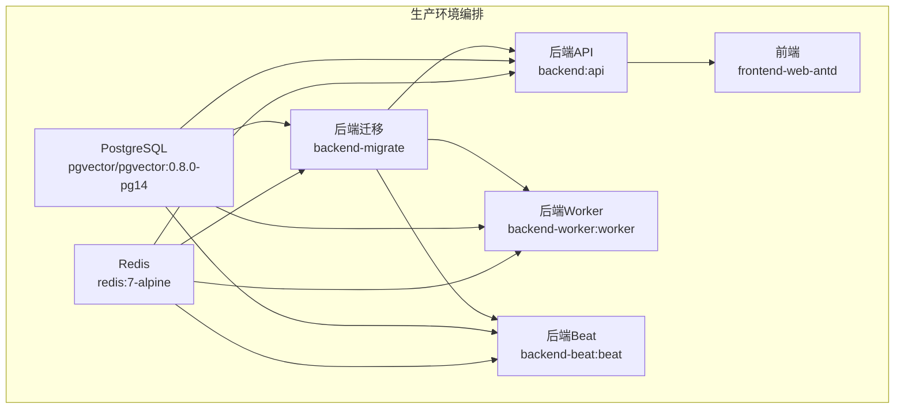
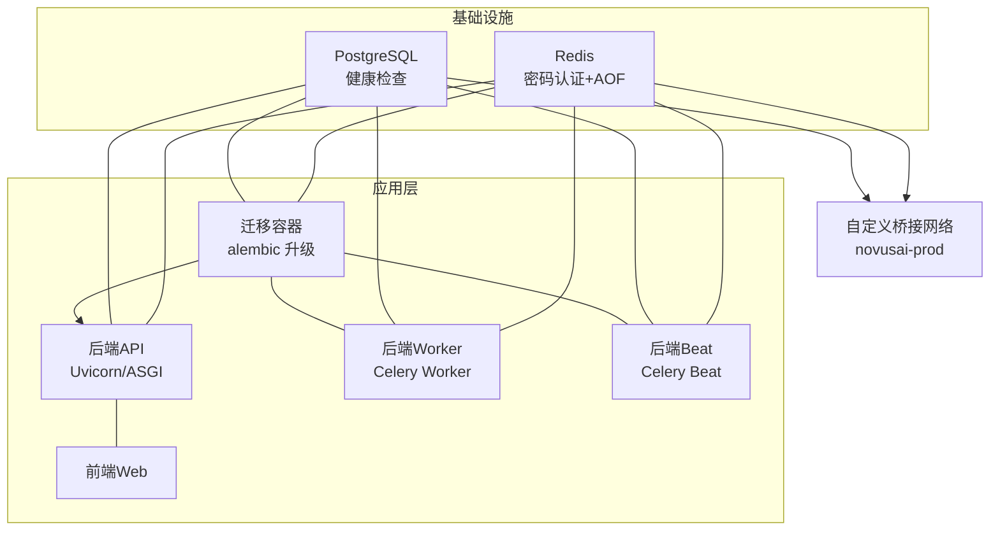
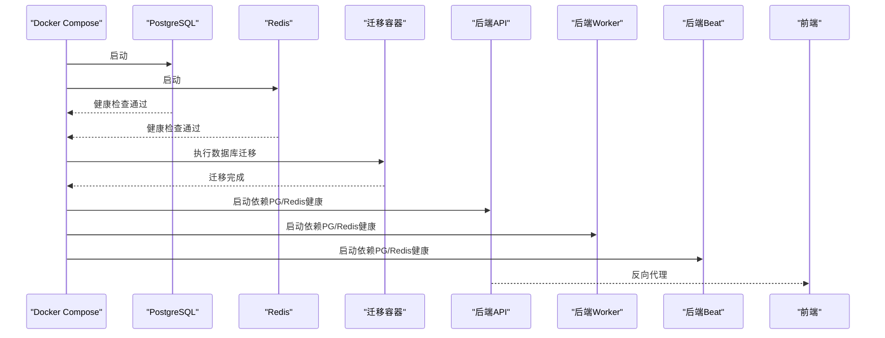
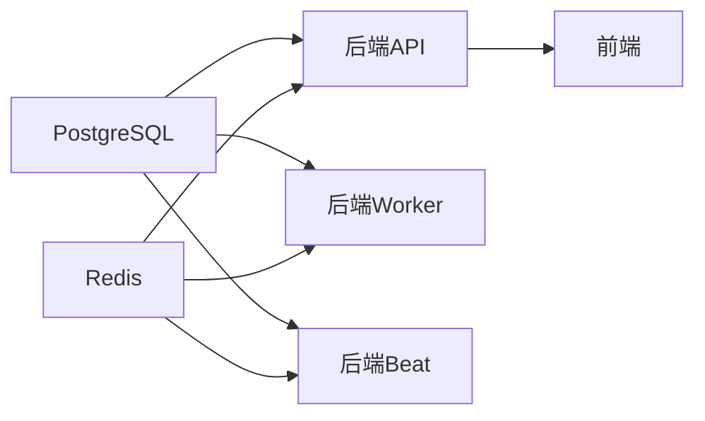

# 容器化部署

<cite>
**本文引用的文件**
- [docker-compose.prod.yml](file://docker-compose.prod.yml)
- [docker-compose.dev.yml](file://docker-compose.dev.yml)
- [backend/Dockerfile](file://backend/Dockerfile)
- [backend/.dockerignore](file://backend/.dockerignore)
- [backend/alembic.ini](file://backend/alembic.ini)
- [backend/pyproject.toml](file://backend/pyproject.toml)
- [backend/app/celery_app.py](file://backend/app/celery_app.py)
- [backend/app/main.py](file://backend/app/main.py)
</cite>

## 目录
1. [简介](#简介)
2. [项目结构](#项目结构)
3. [核心组件](#核心组件)
4. [架构总览](#架构总览)
5. [详细组件分析](#详细组件分析)
6. [依赖分析](#依赖分析)
7. [性能考虑](#性能考虑)
8. [故障排查指南](#故障排查指南)
9. [结论](#结论)
10. [附录](#附录)

## 简介
本技术文档面向生产环境的容器化部署，系统性说明基于 Docker Compose 的编排方案，涵盖镜像构建、服务编排、健康检查、环境变量管理、卷挂载策略、网络设置、启动顺序与依赖关系、服务发现、安全配置、资源限制与性能优化、日志与监控集成以及故障恢复策略。目标是帮助运维与开发团队在生产环境中稳定、可重复地部署与维护 NovusAI SaaS 平台。

## 项目结构
本仓库采用多模块组织方式，容器化部署主要涉及以下部分：
- 后端服务（FastAPI + Uvicorn + Celery）：通过单体 Dockerfile 构建多阶段镜像，产出 API、Worker、Beat 三种运行形态。
- 生产环境编排：使用 docker-compose.prod.yml 统一编排数据库、缓存、后端 API、Worker、Beat 与前端。
- 开发环境编排：使用 docker-compose.dev.yml 提供最小可用栈（PostgreSQL + Redis）。
- 数据迁移：通过 Alembic 配置与迁移脚本管理数据库版本。
- 镜像构建与忽略规则：Dockerfile 与 .dockerignore 控制构建产物与排除内容。

图表来源
- [docker-compose.prod.yml:22-186](file://docker-compose.prod.yml#L22-L186)

章节来源
- [docker-compose.prod.yml:1-191](file://docker-compose.prod.yml#L1-L191)
- [docker-compose.dev.yml:1-49](file://docker-compose.dev.yml#L1-L49)

## 核心组件
- PostgreSQL（向量数据库扩展）：提供主数据存储与向量检索能力，内置健康检查与持久化卷。
- Redis：提供缓存与消息队列，支持密码认证与 AOF 持久化，独立初始化容器确保权限正确。
- 后端 API：基于 Uvicorn 的 FastAPI 服务，暴露就绪与健康探针，支持多工作进程。
- 后端 Worker：Celery 工作进程，按队列优先级与业务域路由执行任务。
- 后端 Beat：Celery Beat，基于数据库动态调度周期任务。
- 前端：静态站点服务，反向代理后端 API。
- 数据迁移：Alembic 管理数据库版本，生产环境通过独立迁移容器执行。

章节来源
- [docker-compose.prod.yml:22-186](file://docker-compose.prod.yml#L22-L186)
- [backend/Dockerfile:55-69](file://backend/Dockerfile#L55-L69)

## 架构总览
生产环境采用“单主机多容器”模式，所有服务运行在同一 Docker 网络中，通过服务名进行内部通信。数据库与缓存作为共享基础设施，API、Worker、Beat 三类服务围绕其协作。迁移容器在首次部署或版本升级时执行，完成后其他服务才启动，确保数据一致性。

图表来源
- [docker-compose.prod.yml:188-191](file://docker-compose.prod.yml#L188-L191)
- [docker-compose.prod.yml:23-162](file://docker-compose.prod.yml#L23-L162)

## 详细组件分析

### PostgreSQL（数据库）
- 镜像与版本：pgvector/pgvector:0.8.0-pg14，启用 UTF8 与 C 语言环境。
- 健康检查：使用 pg_isready 连接验证，失败重试次数充足，适合容器编排等待。
- 存储：持久化卷映射到 /var/lib/postgresql/data，保障数据安全。
- 环境变量：通过环境变量设置数据库名、用户、密码与初始化参数。
- 网络：加入自定义桥接网络，便于服务间通信。

章节来源
- [docker-compose.prod.yml:23-39](file://docker-compose.prod.yml#L23-L39)

### Redis（缓存与消息队列）
- 镜像与版本：redis:7-alpine。
- 初始化容器：独立容器以 root 权限修正数据目录属主，再切换到非 root 用户运行主实例，提升安全性。
- 主容器：通过命令生成临时配置文件启用 AOF 与密码认证，避免明文配置写入镜像。
- 健康检查：通过 redis-cli ping 验证，结合密码认证。
- 依赖关系：主容器依赖初始化容器成功完成。
- 存储：持久化卷映射到 /data。

章节来源
- [docker-compose.prod.yml:41-81](file://docker-compose.prod.yml#L41-L81)

### 后端迁移容器（数据库版本管理）
- 镜像：使用后端镜像，执行数据库迁移命令。
- 依赖关系：必须在数据库与缓存健康后执行，且仅运行一次（restart: no）。
- 目标：确保数据库结构与迁移脚本一致，为后续 API/Worker/Beat 提供稳定基线。

章节来源
- [docker-compose.prod.yml:83-92](file://docker-compose.prod.yml#L83-L92)

### 后端 API（FastAPI + Uvicorn）
- 镜像：使用后端 API 镜像，暴露 8000 端口。
- 健康检查：通过本地 HTTP 请求访问就绪探针，失败重试与启动延时避免冷启动抖动。
- 端口映射：默认仅绑定到 127.0.0.1，可通过环境变量调整宿主机端口。
- 依赖关系：依赖迁移容器完成、数据库与缓存健康。
- 日志与存储：通过卷挂载提供 logs 与 storage，便于采集与持久化。

章节来源
- [docker-compose.prod.yml:94-114](file://docker-compose.prod.yml#L94-L114)
- [backend/Dockerfile:55-60](file://backend/Dockerfile#L55-L60)

### 后端 Worker（Celery）
- 镜像：使用后端 Worker 镜像。
- 健康检查：通过 celery inspect ping 验证，具备超时与重试控制。
- 依赖关系：依赖迁移容器完成、数据库与缓存健康。
- 队列与路由：多队列支持高优先级、AI 网关、定时任务与通知等路由，确保任务隔离与优先级。

章节来源
- [docker-compose.prod.yml:116-134](file://docker-compose.prod.yml#L116-L134)
- [backend/app/celery_app.py:67-88](file://backend/app/celery_app.py#L67-L88)

### 后端 Beat（Celery Beat）
- 镜像：使用后端 Beat 镜像。
- 健康检查：验证调度状态文件可写与存在，确保调度器正常工作。
- 依赖关系：依赖迁移容器完成、数据库与缓存健康。
- 存储：挂载调度状态卷，保障重启后调度状态恢复。

章节来源
- [docker-compose.prod.yml:136-162](file://docker-compose.prod.yml#L136-L162)

### 前端（Web）
- 镜像：使用前端镜像。
- 健康检查：通过 HTTP GET 校验根路径可达。
- 依赖关系：依赖后端 API 健康。
- 端口映射：默认仅绑定到 127.0.0.1，可通过环境变量调整宿主机端口。

章节来源
- [docker-compose.prod.yml:164-179](file://docker-compose.prod.yml#L164-L179)

### 数据迁移与版本管理（Alembic）
- 配置位置：Alembic 配置文件指定迁移脚本位置、时区、版本位置与日志级别。
- 运行方式：生产环境通过独立迁移容器执行升级至最新版本。
- 插件迁移：版本位置包含多个插件迁移目录，确保插件扩展的迁移纳入统一管理。

章节来源
- [backend/alembic.ini:1-76](file://backend/alembic.ini#L1-L76)
- [docker-compose.prod.yml:83-92](file://docker-compose.prod.yml#L83-L92)

### 镜像构建与忽略规则
- 多阶段构建：Builder 阶段安装构建依赖，Runtime 阶段仅包含运行时库，最终产出 API、Worker、Beat 三种镜像形态。
- 用户与权限：运行时以非 root 用户执行，提升安全性。
- 健康检查内嵌：API 镜像内置健康检查指令，简化编排。
- 构建忽略：.dockerignore 排除测试、文档、缓存与本地开发产物，减少镜像体积。

章节来源
- [backend/Dockerfile:1-69](file://backend/Dockerfile#L1-L69)
- [backend/.dockerignore:1-31](file://backend/.dockerignore#L1-L31)

### 启动顺序与依赖关系
- 数据层：PostgreSQL 与 Redis 先行启动并通过健康检查。
- 迁移层：迁移容器在数据库与缓存健康后执行，仅运行一次。
- 应用层：API、Worker、Beat 在迁移完成后启动，并各自依赖数据库与缓存健康。
- 前端：在后端 API 健康后启动。

图表来源
- [docker-compose.prod.yml:87-103](file://docker-compose.prod.yml#L87-L103)
- [docker-compose.prod.yml:119-145](file://docker-compose.prod.yml#L119-L145)

## 依赖分析
- 组件耦合：API、Worker、Beat 对数据库与缓存存在直接依赖；迁移容器对数据库与缓存存在间接依赖。
- 外部依赖：PostgreSQL 与 Redis 版本固定，确保兼容性与稳定性。
- 循环依赖：未见循环依赖，启动顺序清晰。
- 外部集成：前端通过后端 API 提供服务，后端通过 Redis 与数据库交互。

图表来源
- [docker-compose.prod.yml:97-103](file://docker-compose.prod.yml#L97-L103)
- [docker-compose.prod.yml:119-125](file://docker-compose.prod.yml#L119-L125)
- [docker-compose.prod.yml:139-145](file://docker-compose.prod.yml#L139-L145)

章节来源
- [docker-compose.prod.yml:22-186](file://docker-compose.prod.yml#L22-L186)

## 性能考虑
- Worker 并发与预取：通过 Celery 配置控制并发与预取倍数，平衡吞吐与延迟。
- 队列优先级：高优先级队列与业务域队列分离，避免长耗时任务阻塞关键路径。
- 数据库连接池：建议在部署层面配合连接池参数与只读副本策略（如需）。
- 缓存命中：合理设置缓存键与失效策略，降低数据库压力。
- 日志与存储：通过卷挂载分离日志与上传目录，便于磁盘容量规划与 IO 优化。
- 端口与网络：仅监听 127.0.0.1，结合反向代理或负载均衡器对外暴露，减少直接暴露风险。

章节来源
- [backend/app/celery_app.py:62-63](file://backend/app/celery_app.py#L62-L63)
- [backend/app/celery_app.py:83-88](file://backend/app/celery_app.py#L83-L88)
- [docker-compose.prod.yml:110-111](file://docker-compose.prod.yml#L110-L111)
- [docker-compose.prod.yml:169-170](file://docker-compose.prod.yml#L169-L170)

## 故障排查指南
- 健康检查失败
  - 数据库：查看 API 就绪探针逻辑与数据库连接参数，确认迁移已完成。
  - 缓存：确认 Redis 密码与 AOF 配置是否生效，检查卷挂载权限。
  - Worker/Beat：确认 Celery 配置与 broker_url、result_backend，检查队列路由与任务模块注册。
- 启动顺序问题
  - 确认迁移容器已成功完成，且 API/Worker/Beat 的健康检查条件满足。
- 端口冲突
  - 检查宿主机端口映射与防火墙策略，避免与现有服务冲突。
- 日志定位
  - 查看 API/Worker/Beat 的日志卷挂载目录，结合错误响应与异常处理器输出定位问题。
- 数据库版本
  - 使用迁移容器执行升级，避免手动修改数据库结构导致不一致。

章节来源
- [backend/app/main.py:596-628](file://backend/app/main.py#L596-L628)
- [backend/app/celery_app.py:20-21](file://backend/app/celery_app.py#L20-L21)
- [docker-compose.prod.yml:104-109](file://docker-compose.prod.yml#L104-L109)
- [docker-compose.prod.yml:126-131](file://docker-compose.prod.yml#L126-L131)
- [docker-compose.prod.yml:146-155](file://docker-compose.prod.yml#L146-L155)

## 结论
该容器化方案通过多阶段构建与多服务编排，实现了数据库、缓存、后端 API、Worker、Beat 与前端的协同部署。借助健康检查、迁移容器与严格的启动顺序，保证了生产环境的稳定性与一致性。建议在实际部署中结合企业安全基线与监控体系，进一步完善资源限制、密钥管理与备份策略。

## 附录

### 环境变量与配置要点
- 生产环境变量文件：通过 env_file 指定，示例文件用于引导配置项。
- 关键变量：数据库与缓存主机、端口、密码、内部基础 URL、迁移开关等。
- 端口映射：API 与前端默认仅绑定到 127.0.0.1，可通过环境变量覆盖。

章节来源
- [docker-compose.prod.yml:3-17](file://docker-compose.prod.yml#L3-L17)
- [docker-compose.prod.yml:110-111](file://docker-compose.prod.yml#L110-L111)
- [docker-compose.prod.yml:169-170](file://docker-compose.prod.yml#L169-L170)

### 卷挂载策略
- 后端存储：storage 与 logs 卷，用于上传文件与日志持久化。
- Beat 状态：celerybeat 状态卷，保障调度状态恢复。
- 数据持久化：PostgreSQL 与 Redis 数据卷，确保重启不丢失。

章节来源
- [docker-compose.prod.yml:18-20](file://docker-compose.prod.yml#L18-L20)
- [docker-compose.prod.yml:156-159](file://docker-compose.prod.yml#L156-L159)
- [docker-compose.prod.yml:31-32](file://docker-compose.prod.yml#L31-L32)
- [docker-compose.prod.yml:70-71](file://docker-compose.prod.yml#L70-L71)

### 网络设置
- 自定义桥接网络：novusai-prod，服务间通过服务名相互发现。
- 端口暴露：仅本地回环地址映射，结合反向代理对外提供服务。

章节来源
- [docker-compose.prod.yml:188-191](file://docker-compose.prod.yml#L188-L191)
- [docker-compose.prod.yml:110-111](file://docker-compose.prod.yml#L110-L111)
- [docker-compose.prod.yml:169-170](file://docker-compose.prod.yml#L169-L170)

### 安全配置
- Redis 密码认证：通过环境变量注入，主容器动态生成配置文件。
- 非 root 运行：运行时切换到非 root 用户，降低权限风险。
- 初始化容器：先以 root 修改权限，再切换到非 root 用户运行，符合最小权限原则。

章节来源
- [docker-compose.prod.yml:59-69](file://docker-compose.prod.yml#L59-L69)
- [docker-compose.prod.yml:44-46](file://docker-compose.prod.yml#L44-L46)
- [backend/Dockerfile:42-53](file://backend/Dockerfile#L42-L53)

### 资源限制与性能优化
- Worker 并发与预取：通过 Celery 配置控制，避免过度占用 CPU 或内存。
- 队列路由：将高优先级与关键任务分离，提升整体吞吐。
- 日志与存储分离：通过卷挂载与日志轮转策略，降低 IO 压力。

章节来源
- [backend/app/celery_app.py:62-63](file://backend/app/celery_app.py#L62-L63)
- [backend/app/celery_app.py:83-88](file://backend/app/celery_app.py#L83-L88)
- [docker-compose.prod.yml:18-20](file://docker-compose.prod.yml#L18-L20)

### 日志收集与监控集成
- 日志卷：后端 API/Beat 挂载日志卷，便于集中采集。
- 指标与健康：后端 API 暴露就绪与健康探针，结合 Prometheus 抓取指标。
- 建议：结合企业日志平台与告警系统，实现统一采集与可视化。

章节来源
- [docker-compose.prod.yml:104-109](file://docker-compose.prod.yml#L104-L109)
- [docker-compose.prod.yml:156-159](file://docker-compose.prod.yml#L156-L159)
- [backend/app/main.py:596-628](file://backend/app/main.py#L596-L628)

### 故障恢复策略
- 健康检查失败：根据探针返回与日志定位，优先修复数据库与缓存连接。
- 迁移失败：重新执行迁移容器，确保数据库版本一致。
- Worker/Beat 异常：检查 broker_url、result_backend 与队列路由，必要时重建容器。

章节来源
- [docker-compose.prod.yml:104-109](file://docker-compose.prod.yml#L104-L109)
- [docker-compose.prod.yml:126-131](file://docker-compose.prod.yml#L126-L131)
- [docker-compose.prod.yml:146-155](file://docker-compose.prod.yml#L146-L155)
- [backend/app/celery_app.py:20-21](file://backend/app/celery_app.py#L20-L21)