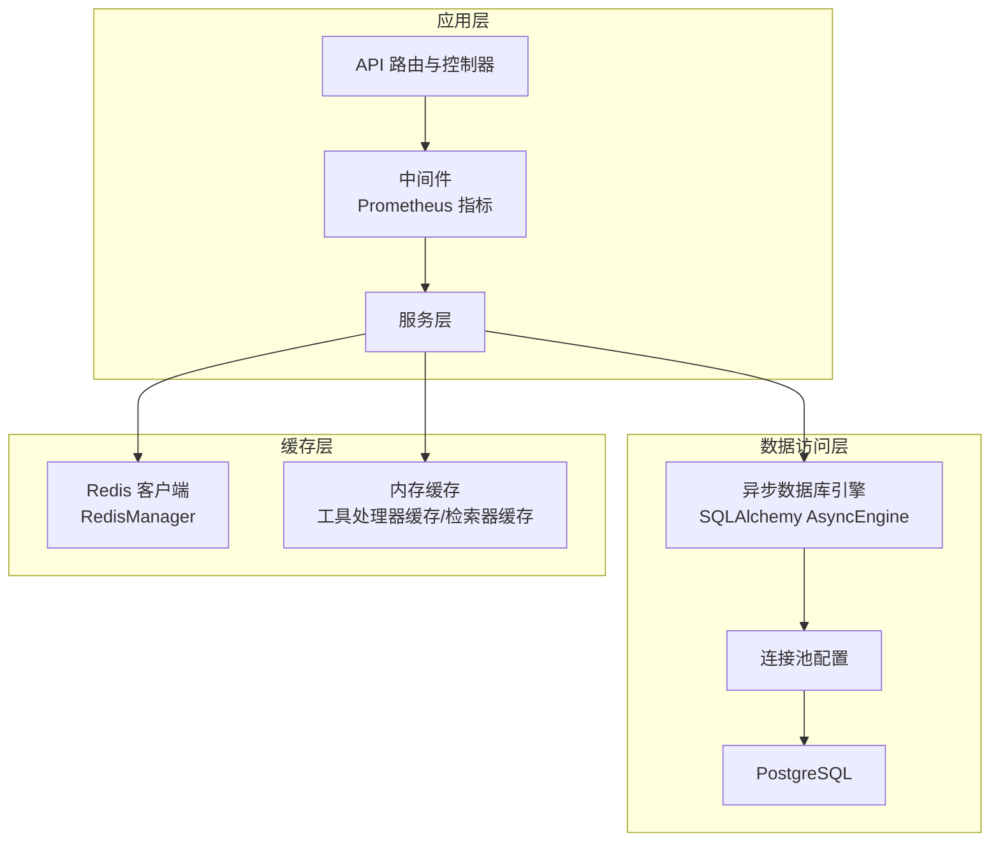
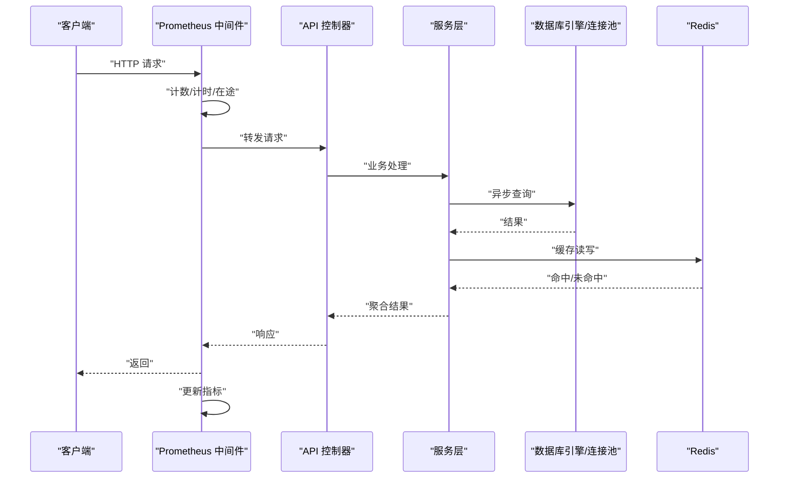
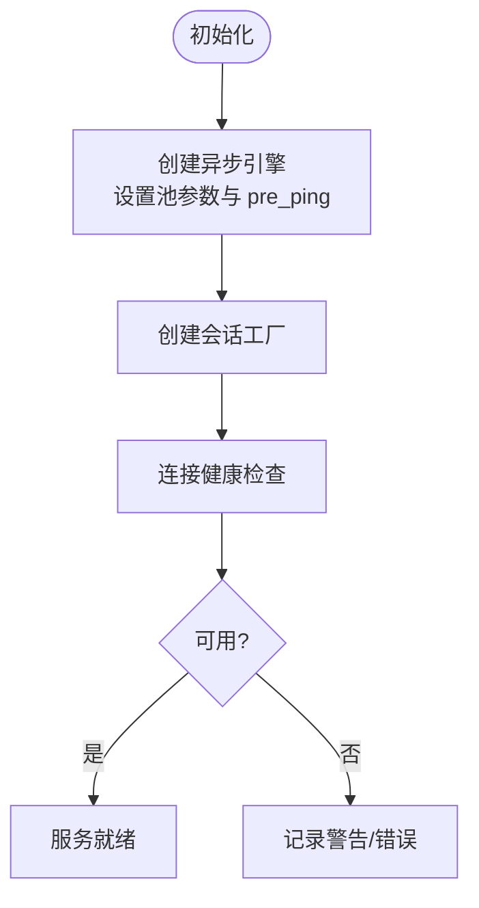
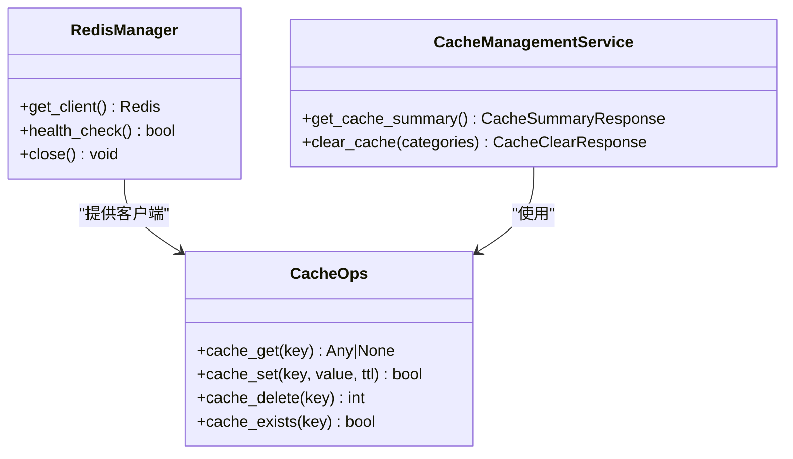
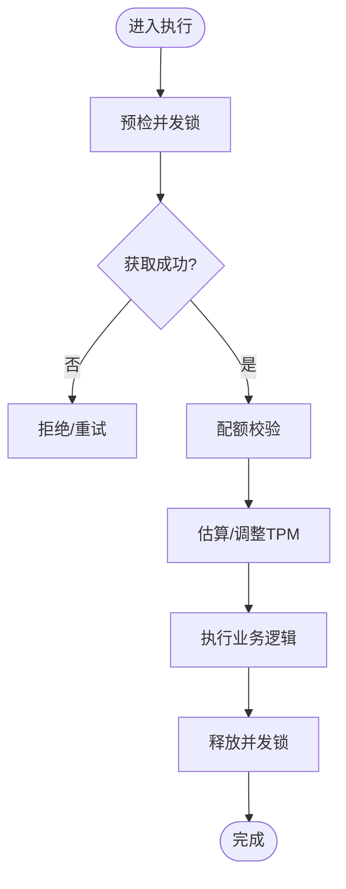
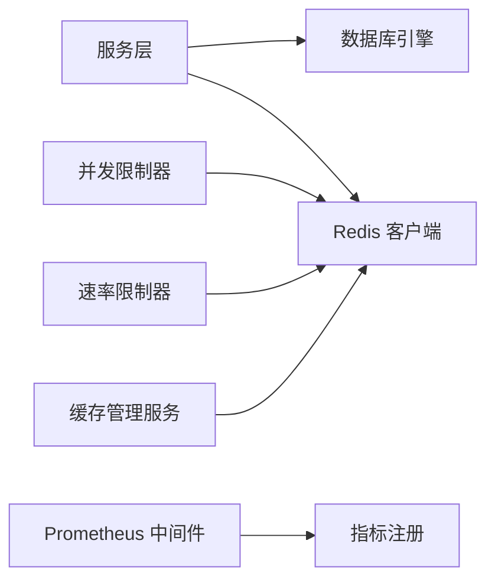

# 性能优化

<cite>
**本文引用的文件**
- [backend/app/core/config.py](file://backend/app/core/config.py)
- [backend/app/core/database.py](file://backend/app/core/database.py)
- [backend/app/core/redis.py](file://backend/app/core/redis.py)
- [backend/app/ai/agent_quota_concurrency.py](file://backend/app/ai/agent_quota_concurrency.py)
- [backend/app/ai/rate_limiter.py](file://backend/app/ai/rate_limiter.py)
- [backend/app/ai/cache.py](file://backend/app/ai/cache.py)
- [backend/app/ai/engine/tool_processor_cache.py](file://backend/app/ai/engine/tool_processor_cache.py)
- [backend/app/ai/rag/retriever_cache.py](file://backend/app/ai/rag/retriever_cache.py)
- [backend/app/ai/rag/retriever_cache_ops.py](file://backend/app/ai/rag/retriever_cache_ops.py)
- [backend/app/api/admin/cache.py](file://backend/app/api/admin/cache.py)
- [backend/app/enums/cache.py](file://backend/app/enums/cache.py)
- [backend/app/schemas/system/cache.py](file://backend/app/schemas/system/cache.py)
- [backend/app/services/system/cache_management_service.py](file://backend/app/services/system/cache_management_service.py)
- [backend/app/middleware/prometheus_metrics.py](file://backend/app/middleware/prometheus_metrics.py)
- [backend/app/main.py](file://backend/app/main.py)
- [backend/tests/services/test_cache_management_service.py](file://backend/tests/services/test_cache_management_service.py)
- [backend/tests/services/test_monitoring_service.py](file://backend/tests/services/test_monitoring_service.py)
</cite>

## 目录
1. [简介](#简介)
2. [项目结构](#项目结构)
3. [核心组件](#核心组件)
4. [架构总览](#架构总览)
5. [详细组件分析](#详细组件分析)
6. [依赖关系分析](#依赖关系分析)
7. [性能考量与优化建议](#性能考量与优化建议)
8. [故障排查指南](#故障排查指南)
9. [结论](#结论)
10. [附录](#附录)

## 简介
本文件聚焦于系统在数据库查询、索引策略、连接池配置、缓存策略（含 Redis 优化与内存管理）、API 响应时间优化、并发控制与资源限制、负载与基准测试、瓶颈分析方法、性能监控指标与调优参数，以及扩展性（水平与垂直）策略。文档基于仓库中现有实现进行归纳总结，并提供可操作的最佳实践与可视化图示。

## 项目结构
后端采用 FastAPI + ASGI 架构，数据库使用异步 SQLAlchemy 引擎，缓存以 Redis 为主，辅以本地内存缓存与检索器缓存。中间件提供 Prometheus 指标采集，主程序负责就绪/健康探针与组件健康刷新。

图表来源
- [backend/app/core/database.py:65-81](file://backend/app/core/database.py#L65-L81)
- [backend/app/core/config.py:88-107](file://backend/app/core/config.py#L88-L107)
- [backend/app/core/redis.py:50-115](file://backend/app/core/redis.py#L50-L115)
- [backend/app/middleware/prometheus_metrics.py:114-168](file://backend/app/middleware/prometheus_metrics.py#L114-L168)
- [backend/app/main.py:513-593](file://backend/app/main.py#L513-L593)

章节来源
- [backend/app/core/config.py:88-122](file://backend/app/core/config.py#L88-L122)
- [backend/app/core/database.py:65-81](file://backend/app/core/database.py#L65-L81)
- [backend/app/core/redis.py:50-115](file://backend/app/core/redis.py#L50-L115)
- [backend/app/middleware/prometheus_metrics.py:114-168](file://backend/app/middleware/prometheus_metrics.py#L114-L168)
- [backend/app/main.py:513-593](file://backend/app/main.py#L513-L593)

## 核心组件
- 数据库连接与连接池：通过异步引擎与会话工厂配置连接池大小、溢出与超时，并启用 pre_ping 保持连接健康。
- Redis 管理：集中式 RedisManager 提供客户端获取、健康检查与关闭，封装常用缓存操作。
- 并发与配额：Agent 并发限制器使用 Redis ZSET 与 Lua 原子脚本实现“清理过期→检查计数→添加令牌”的无竞态并发控制；速率限制器结合 Redis 实现 RPM/TPM 的估计与调整。
- 缓存体系：系统支持 Redis 缓存、内存缓存（工具处理器缓存、检索器缓存），并提供缓存管理服务与管理员接口，支持扫描、统计与清理。
- 指标与监控：Prometheus 中间件记录请求总量、持续进行中的请求数、耗时分布；主程序定时刷新组件健康状态，暴露 /metrics。

章节来源
- [backend/app/core/database.py:65-81](file://backend/app/core/database.py#L65-L81)
- [backend/app/core/redis.py:50-115](file://backend/app/core/redis.py#L50-L115)
- [backend/app/ai/agent_quota_concurrency.py:40-154](file://backend/app/ai/agent_quota_concurrency.py#L40-L154)
- [backend/app/ai/rate_limiter.py:214-235](file://backend/app/ai/rate_limiter.py#L214-L235)
- [backend/app/ai/cache.py](file://backend/app/ai/cache.py)
- [backend/app/ai/engine/tool_processor_cache.py](file://backend/app/ai/engine/tool_processor_cache.py)
- [backend/app/ai/rag/retriever_cache.py](file://backend/app/ai/rag/retriever_cache.py)
- [backend/app/ai/rag/retriever_cache_ops.py](file://backend/app/ai/rag/retriever_cache_ops.py)
- [backend/app/api/admin/cache.py](file://backend/app/api/admin/cache.py)
- [backend/app/enums/cache.py](file://backend/app/enums/cache.py)
- [backend/app/schemas/system/cache.py](file://backend/app/schemas/system/cache.py)
- [backend/app/services/system/cache_management_service.py](file://backend/app/services/system/cache_management_service.py)
- [backend/app/middleware/prometheus_metrics.py:114-168](file://backend/app/middleware/prometheus_metrics.py#L114-L168)
- [backend/app/main.py:513-593](file://backend/app/main.py#L513-L593)

## 架构总览
下图展示请求在系统中的典型路径：API 接收请求，经中间件采集指标，服务层调用数据库与缓存，最终返回响应。

图表来源
- [backend/app/middleware/prometheus_metrics.py:114-168](file://backend/app/middleware/prometheus_metrics.py#L114-L168)
- [backend/app/core/database.py:65-81](file://backend/app/core/database.py#L65-L81)
- [backend/app/core/redis.py:89-115](file://backend/app/core/redis.py#L89-L115)
- [backend/app/main.py:513-593](file://backend/app/main.py#L513-L593)

## 详细组件分析

### 数据库查询与连接池
- 异步引擎与会话工厂：使用异步 SQLAlchemy 引擎，开启 pre_ping 以自动探测失效连接；会话工厂设置过期行为与 flush/autocommit 策略，降低事务开销。
- 连接池参数：通过配置类提供池大小、最大溢出与超时，便于在不同环境按需调优。
- 健康检查：提供独立的数据库连接检查方法，异常时记录并提示启动数据库服务。

图表来源
- [backend/app/core/database.py:65-81](file://backend/app/core/database.py#L65-L81)
- [backend/app/core/config.py:88-107](file://backend/app/core/config.py#L88-L107)
- [backend/app/core/database.py:218-233](file://backend/app/core/database.py#L218-L233)

章节来源
- [backend/app/core/config.py:88-107](file://backend/app/core/config.py#L88-L107)
- [backend/app/core/database.py:65-81](file://backend/app/core/database.py#L65-L81)
- [backend/app/core/database.py:218-233](file://backend/app/core/database.py#L218-L233)

### Redis 缓存与内存管理
- Redis 管理：集中式 RedisManager 提供客户端获取、健康检查与关闭；封装 cache_get/cache_set/cache_delete/cache_exists 等常用操作。
- 内存缓存：工具处理器缓存与检索器缓存减少重复计算与外部调用；缓存管理服务支持分类扫描、统计与清理。
- 管理接口：提供缓存概览与清理的管理员接口，配合单元测试验证功能与边界条件。

图表来源
- [backend/app/core/redis.py:50-115](file://backend/app/core/redis.py#L50-L115)
- [backend/app/services/system/cache_management_service.py](file://backend/app/services/system/cache_management_service.py)
- [backend/app/api/admin/cache.py](file://backend/app/api/admin/cache.py)
- [backend/app/enums/cache.py](file://backend/app/enums/cache.py)
- [backend/app/schemas/system/cache.py](file://backend/app/schemas/system/cache.py)

章节来源
- [backend/app/core/redis.py:50-115](file://backend/app/core/redis.py#L50-L115)
- [backend/app/ai/cache.py](file://backend/app/ai/cache.py)
- [backend/app/ai/engine/tool_processor_cache.py](file://backend/app/ai/engine/tool_processor_cache.py)
- [backend/app/ai/rag/retriever_cache.py](file://backend/app/ai/rag/retriever_cache.py)
- [backend/app/ai/rag/retriever_cache_ops.py](file://backend/app/ai/rag/retriever_cache_ops.py)
- [backend/app/services/system/cache_management_service.py](file://backend/app/services/system/cache_management_service.py)
- [backend/tests/services/test_cache_management_service.py:1-261](file://backend/tests/services/test_cache_management_service.py#L1-L261)

### 并发控制与资源限制
- Agent 并发限制器：使用 Redis ZSET 存储并发令牌，Lua 原子脚本实现“清理过期→检查计数→添加令牌”，避免 TOCTOU 竞态；支持单智能体与企业级并发上限。
- 预检锁：在执行前根据配额配置申请并发位，若超限则抛出异常并提示重试。
- 速率限制：RPM/TPM 结合 Redis 与 Lua 脚本进行估计与调整，保证吞吐与成本可控。

图表来源
- [backend/app/ai/agent_quota_concurrency.py:40-154](file://backend/app/ai/agent_quota_concurrency.py#L40-L154)
- [backend/app/ai/engine/execution_preflight_support.py:35-79](file://backend/app/ai/engine/execution_preflight_support.py#L35-L79)
- [backend/app/ai/rate_limiter.py:214-235](file://backend/app/ai/rate_limiter.py#L214-L235)

章节来源
- [backend/app/ai/agent_quota_concurrency.py:40-154](file://backend/app/ai/agent_quota_concurrency.py#L40-L154)
- [backend/app/ai/engine/execution_preflight_support.py:35-79](file://backend/app/ai/engine/execution_preflight_support.py#L35-L79)
- [backend/app/ai/rate_limiter.py:214-235](file://backend/app/ai/rate_limiter.py#L214-L235)

### API 响应时间优化
- 中间件指标：记录每条路由的请求数量、在途请求数与耗时分布，便于识别慢接口与热点路径。
- 就绪/健康探针：主程序定期刷新数据库与 Redis 健康状态，避免仅依赖副作用导致指标延迟。
- 建议：对慢接口引入分页/批量/缓存、异步化非关键路径、合并冗余查询、使用连接池复用与预热。

章节来源
- [backend/app/middleware/prometheus_metrics.py:114-168](file://backend/app/middleware/prometheus_metrics.py#L114-L168)
- [backend/app/main.py:513-593](file://backend/app/main.py#L513-L593)

### 负载测试、基准测试与瓶颈分析
- 负载测试：使用压测工具对关键路由施加并发负载，观察 P50/P95/P99 延迟与错误率。
- 基准测试：针对数据库查询与缓存命中场景进行对比实验，评估不同索引/缓存策略的效果。
- 瓶颈分析：结合 Prometheus 指标定位 CPU/IO/网络瓶颈；对数据库查询进行 EXPLAIN 分析，识别慢查询与缺失索引；对缓存路径进行命中率统计与 TTL 调整。

（本节为通用方法论，不直接分析具体文件）

## 依赖关系分析
- 组件耦合：服务层依赖数据库引擎与 Redis 客户端；并发与配额模块依赖 Redis；缓存管理服务依赖 Redis 与本地缓存实现；中间件依赖路由信息与指标注册。
- 外部依赖：PostgreSQL（异步驱动）、Redis（Python 客户端）、Prometheus（指标导出）。

图表来源
- [backend/app/core/database.py:65-81](file://backend/app/core/database.py#L65-L81)
- [backend/app/core/redis.py:50-115](file://backend/app/core/redis.py#L50-L115)
- [backend/app/ai/agent_quota_concurrency.py:40-154](file://backend/app/ai/agent_quota_concurrency.py#L40-L154)
- [backend/app/ai/rate_limiter.py:214-235](file://backend/app/ai/rate_limiter.py#L214-L235)
- [backend/app/services/system/cache_management_service.py](file://backend/app/services/system/cache_management_service.py)
- [backend/app/middleware/prometheus_metrics.py:114-168](file://backend/app/middleware/prometheus_metrics.py#L114-L168)

## 性能考量与优化建议

### 数据库查询优化与索引策略
- 查询优化
  - 合理使用分页与批量加载，避免一次性拉取大结果集。
  - 对高频过滤字段建立合适索引（如唯一索引、复合索引），并定期分析表统计信息。
  - 使用 EXPLAIN 分析慢查询计划，识别全表扫描与缺失索引。
- 索引策略
  - 唯一约束字段优先建立唯一索引，减少重复与冲突。
  - 复合过滤条件按选择性排序建立复合索引，避免过多重叠索引。
  - 定期维护统计信息与重建索引，保持查询计划最优。
- 连接池配置
  - 根据并发峰值与平均延迟设置池大小与溢出，避免过度连接导致上下文切换开销。
  - 启用 pre_ping 与合理超时，提升连接可用性与稳定性。

章节来源
- [backend/app/core/config.py:88-107](file://backend/app/core/config.py#L88-L107)
- [backend/app/core/database.py:65-81](file://backend/app/core/database.py#L65-L81)

### 缓存策略与 Redis 优化
- 缓存分层
  - 读多写少场景优先使用 Redis 缓存；对热点数据设置合理 TTL，避免雪崩。
  - 工具处理器缓存与检索器缓存减少重复计算，结合缓存管理服务进行周期性清理。
- Redis 优化
  - 使用流水线与批量命令降低 RTT；合理设置 maxmemory 与淘汰策略。
  - 对大对象使用压缩或序列化优化；监控内存使用与键空间大小。
- 内存管理
  - 本地内存缓存用于短期高频访问，注意容量与生命周期管理；定期扫描与清理。

章节来源
- [backend/app/core/redis.py:89-115](file://backend/app/core/redis.py#L89-L115)
- [backend/app/ai/engine/tool_processor_cache.py](file://backend/app/ai/engine/tool_processor_cache.py)
- [backend/app/ai/rag/retriever_cache.py](file://backend/app/ai/rag/retriever_cache.py)
- [backend/app/services/system/cache_management_service.py](file://backend/app/services/system/cache_management_service.py)

### API 响应时间优化与并发处理
- 中间件指标：利用 Prometheus 中间件识别慢接口与高延迟路径，针对性优化。
- 并发控制：通过并发限制器与预检锁控制瞬时并发，避免资源争用导致的尾延迟。
- 资源限制：结合速率限制器的 RPM/TPM 调整，平衡吞吐与成本。

章节来源
- [backend/app/middleware/prometheus_metrics.py:114-168](file://backend/app/middleware/prometheus_metrics.py#L114-L168)
- [backend/app/ai/agent_quota_concurrency.py:40-154](file://backend/app/ai/agent_quota_concurrency.py#L40-L154)
- [backend/app/ai/rate_limiter.py:214-235](file://backend/app/ai/rate_limiter.py#L214-L235)

### 负载测试、基准测试与瓶颈分析
- 负载测试：对关键接口施加阶梯式并发，观察延迟与错误率变化。
- 基准测试：对比不同缓存策略与数据库索引方案，量化收益。
- 瓶颈分析：结合指标与日志定位 CPU/IO/网络瓶颈，针对性优化。

（本节为通用方法论，不直接分析具体文件）

### 性能监控指标与调优参数
- 关键指标
  - HTTP 请求总量、在途请求数、耗时分布（P50/P95/P99）、错误率。
  - 数据库连接池利用率、等待时间、活跃连接数。
  - Redis 命中率、内存使用、键空间大小、慢查询数量。
- 调优参数
  - 数据库：连接池大小、最大溢出、超时、预热连接数。
  - Redis：maxmemory、淘汰策略、pipeline 批量大小、TTL 分布。
  - 缓存：TTL、清理阈值、扫描步长、批量删除大小。
- 主程序健康刷新：定期检查数据库与 Redis 健康，避免指标滞后。

章节来源
- [backend/app/middleware/prometheus_metrics.py:114-168](file://backend/app/middleware/prometheus_metrics.py#L114-L168)
- [backend/app/main.py:541-593](file://backend/app/main.py#L541-L593)

### 扩展性策略
- 垂直扩展：提升单实例硬件配置（CPU/内存/存储），优化数据库与 Redis 参数，增强连接池与缓存容量。
- 水平扩展：通过多副本部署与负载均衡分摊流量；对缓存与数据库进行分片或读写分离；使用消息队列异步化非关键任务。

（本节为通用方法论，不直接分析具体文件）

## 故障排查指南
- 数据库连接失败
  - 现象：连接检查失败，日志提示无法连接。
  - 排查：确认数据库服务运行、网络连通、凭据正确；查看连接池参数与超时设置。
- Redis 不可用
  - 现象：Redis 健康检查失败，指标显示不可用。
  - 排查：确认 Redis 服务运行、认证信息、网络连通与内存压力。
- 缓存清理异常
  - 现象：缓存清理结果与预期不符。
  - 排查：核对缓存类别与键模式，检查扫描步长与批量删除；参考单元测试用例验证边界条件。
- 指标异常
  - 现象：Prometheus 指标缺失或延迟。
  - 排查：确认中间件已注册、/metrics 路由可达、健康刷新定时任务正常。

章节来源
- [backend/app/core/database.py:218-233](file://backend/app/core/database.py#L218-L233)
- [backend/app/core/redis.py:67-73](file://backend/app/core/redis.py#L67-L73)
- [backend/tests/services/test_cache_management_service.py:1-261](file://backend/tests/services/test_cache_management_service.py#L1-L261)
- [backend/app/middleware/prometheus_metrics.py:114-168](file://backend/app/middleware/prometheus_metrics.py#L114-L168)
- [backend/app/main.py:541-593](file://backend/app/main.py#L541-L593)

## 结论
通过合理的数据库连接池配置、分层缓存与 Redis 优化、严格的并发与配额控制、完善的指标监控与健康刷新，以及系统化的负载与基准测试流程，可以显著提升系统的吞吐、稳定性和可扩展性。建议在生产环境中持续观测关键指标，动态调整参数，并结合业务增长趋势制定垂直与水平扩展策略。

## 附录
- 测试参考
  - 缓存管理服务单元测试覆盖了缓存统计、清理与格式化工具函数等关键路径。
  - 监控服务测试展示了统计数据结构与查询结果映射。

章节来源
- [backend/tests/services/test_cache_management_service.py:1-261](file://backend/tests/services/test_cache_management_service.py#L1-L261)
- [backend/tests/services/test_monitoring_service.py:356-838](file://backend/tests/services/test_monitoring_service.py#L356-L838)