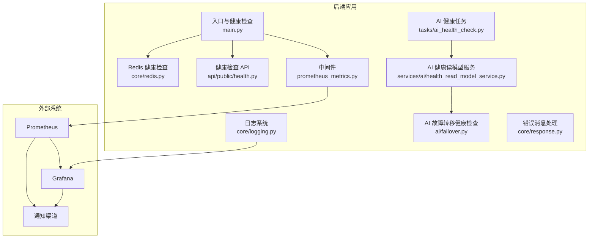
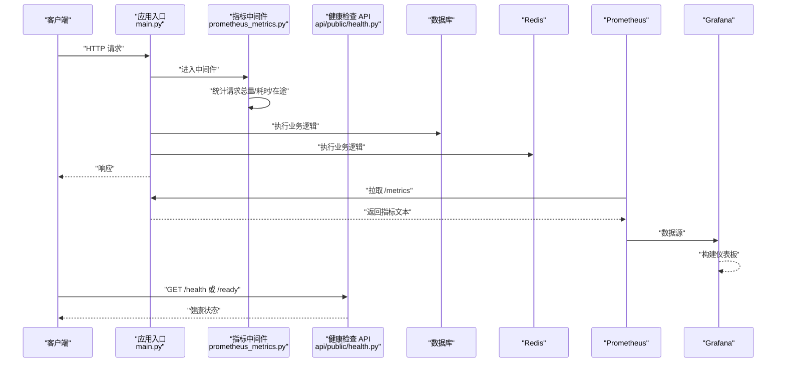
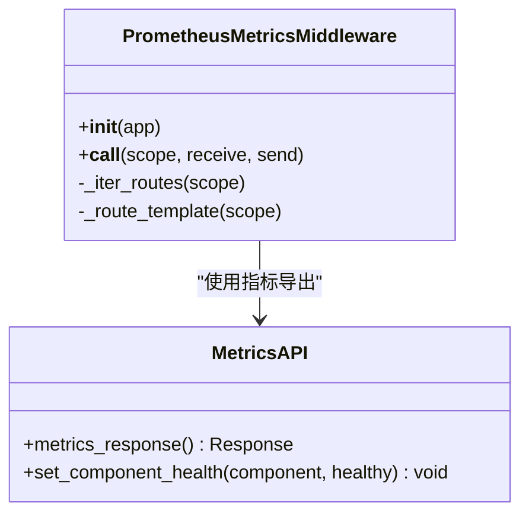
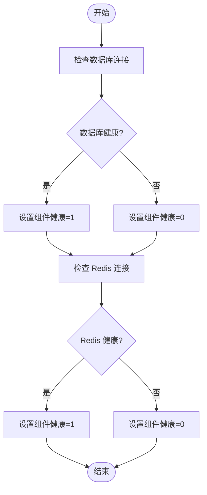
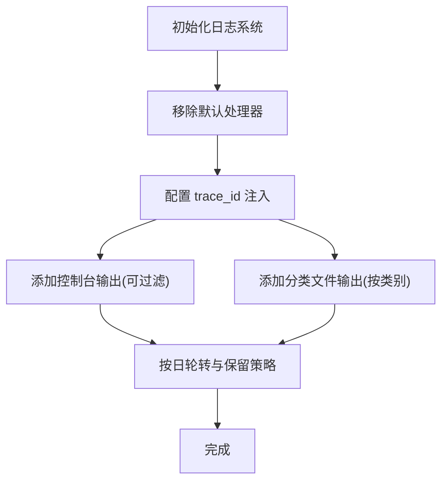
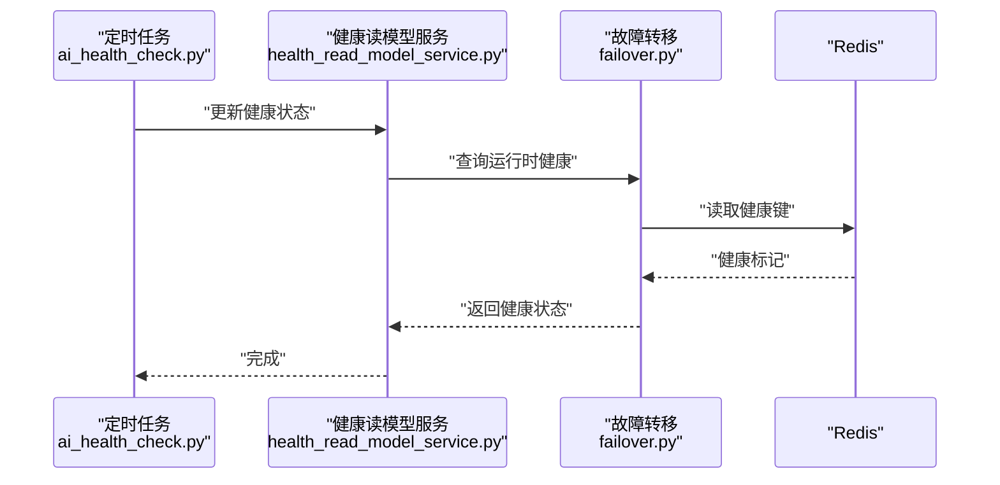
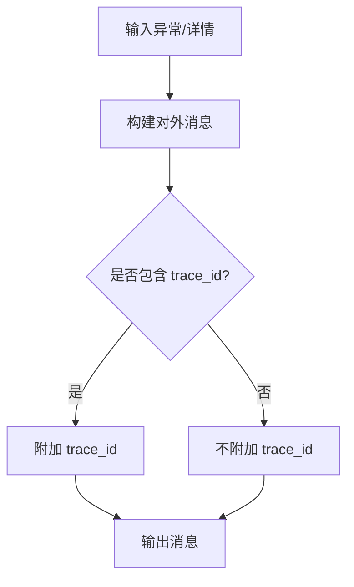
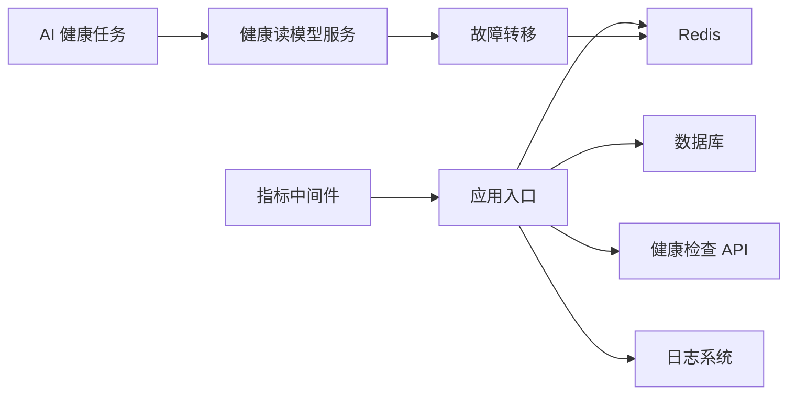

# 监控和日志

<cite>
**本文引用的文件**
- [backend/app/middleware/prometheus_metrics.py](file://backend/app/middleware/prometheus_metrics.py)
- [backend/app/main.py](file://backend/app/main.py)
- [backend/app/core/logging.py](file://backend/app/core/logging.py)
- [backend/app/api/public/health.py](file://backend/app/api/public/health.py)
- [backend/app/core/redis.py](file://backend/app/core/redis.py)
- [backend/app/tasks/ai_health_check.py](file://backend/app/tasks/ai_health_check.py)
- [backend/app/services/ai/health_read_model_service.py](file://backend/app/services/ai/health_read_model_service.py)
- [backend/app/ai/failover.py](file://backend/app/ai/failover.py)
- [backend/app/core/response.py](file://backend/app/core/response.py)
- [backend/docs/RUN_LOG_ANALYSIS.md](file://backend/docs/RUN_LOG_ANALYSIS.md)
</cite>

## 目录
1. [简介](#简介)
2. [项目结构](#项目结构)
3. [核心组件](#核心组件)
4. [架构总览](#架构总览)
5. [组件详解](#组件详解)
6. [依赖关系分析](#依赖关系分析)
7. [性能考量](#性能考量)
8. [故障排查指南](#故障排查指南)
9. [结论](#结论)
10. [附录](#附录)

## 简介
本文件面向监控与日志体系，系统性说明后端在 Prometheus 指标采集、Grafana 仪表板配置建议、告警规则设计、应用日志结构与格式、错误追踪与性能监控、业务指标监控、日志聚合与分析工具配置、健康检查端点与服务可用性监控、依赖服务监控以及监控告警与通知渠道的落地实践。内容基于仓库中现有实现进行归纳与扩展，帮助读者快速理解并部署生产级可观测性方案。

## 项目结构
后端监控与日志相关的关键位置如下：
- 指标与中间件：middleware/prometheus_metrics.py
- 应用入口与健康检查：main.py
- 日志系统：core/logging.py
- 健康检查 API：api/public/health.py
- Redis 健康检查：core/redis.py
- AI 健康任务：tasks/ai_health_check.py
- AI 健康读模型服务：services/ai/health_read_model_service.py
- AI 故障转移健康检查：ai/failover.py
- 错误消息处理：core/response.py
- 运行日志分析文档：docs/RUN_LOG_ANALYSIS.md

**图表来源**
- [backend/app/middleware/prometheus_metrics.py:114-168](file://backend/app/middleware/prometheus_metrics.py#L114-L168)
- [backend/app/main.py:513-593](file://backend/app/main.py#L513-L593)
- [backend/app/core/logging.py:130-267](file://backend/app/core/logging.py#L130-L267)
- [backend/app/api/public/health.py:22-22](file://backend/app/api/public/health.py#L22-L22)
- [backend/app/core/redis.py:66-66](file://backend/app/core/redis.py#L66-L66)
- [backend/app/tasks/ai_health_check.py](file://backend/app/tasks/ai_health_check.py)
- [backend/app/services/ai/health_read_model_service.py:398-435](file://backend/app/services/ai/health_read_model_service.py#L398-L435)
- [backend/app/ai/failover.py:220-246](file://backend/app/ai/failover.py#L220-L246)
- [backend/app/core/response.py:156-175](file://backend/app/core/response.py#L156-L175)

**章节来源**
- [backend/app/middleware/prometheus_metrics.py:114-168](file://backend/app/middleware/prometheus_metrics.py#L114-L168)
- [backend/app/main.py:513-593](file://backend/app/main.py#L513-L593)
- [backend/app/core/logging.py:130-267](file://backend/app/core/logging.py#L130-L267)
- [backend/app/api/public/health.py:22-22](file://backend/app/api/public/health.py#L22-L22)
- [backend/app/core/redis.py:66-66](file://backend/app/core/redis.py#L66-L66)
- [backend/app/tasks/ai_health_check.py](file://backend/app/tasks/ai_health_check.py)
- [backend/app/services/ai/health_read_model_service.py:398-435](file://backend/app/services/ai/health_read_model_service.py#L398-L435)
- [backend/app/ai/failover.py:220-246](file://backend/app/ai/failover.py#L220-L246)
- [backend/app/core/response.py:156-175](file://backend/app/core/response.py#L156-L175)

## 核心组件
- 指标中间件与导出
  - 提供 HTTP 请求总量、请求耗时分布、在途请求数等指标，并暴露 /metrics 文本端点。
  - 组件健康度（数据库、Redis）以 Gauge 形式记录，供告警规则消费。
- 健康检查端点
  - /health 与 /ready 用于容器编排与负载均衡探活。
  - 后台定时任务与运行时主动刷新组件健康，避免仅依赖探活副作用。
- 日志系统
  - 基于 Loguru 的集中化日志管理器，支持控制台与文件双通道、按类别分文件、trace_id 注入、过滤策略。
- AI 健康与故障转移
  - 定时任务与服务层读模型维护 AI 服务健康状态；故障转移模块从缓存读取健康标记。
- 错误消息与追踪
  - 统一错误消息解析与 trace_id 输出，便于跨系统关联定位问题。

**章节来源**
- [backend/app/middleware/prometheus_metrics.py:74-87](file://backend/app/middleware/prometheus_metrics.py#L74-L87)
- [backend/app/middleware/prometheus_metrics.py:114-168](file://backend/app/middleware/prometheus_metrics.py#L114-L168)
- [backend/app/main.py:513-593](file://backend/app/main.py#L513-L593)
- [backend/app/core/logging.py:130-267](file://backend/app/core/logging.py#L130-L267)
- [backend/app/tasks/ai_health_check.py](file://backend/app/tasks/ai_health_check.py)
- [backend/app/services/ai/health_read_model_service.py:398-435](file://backend/app/services/ai/health_read_model_service.py#L398-L435)
- [backend/app/ai/failover.py:220-246](file://backend/app/ai/failover.py#L220-L246)
- [backend/app/core/response.py:156-175](file://backend/app/core/response.py#L156-L175)

## 架构总览
下图展示从请求到指标采集、健康检查与日志输出的整体链路，以及与 Prometheus/Grafana 的集成关系。

**图表来源**
- [backend/app/middleware/prometheus_metrics.py:114-168](file://backend/app/middleware/prometheus_metrics.py#L114-L168)
- [backend/app/main.py:513-593](file://backend/app/main.py#L513-L593)
- [backend/app/api/public/health.py:22-22](file://backend/app/api/public/health.py#L22-L22)
- [backend/app/core/redis.py:66-66](file://backend/app/core/redis.py#L66-L66)

## 组件详解

### 指标中间件与导出
- 指标维度
  - 方法、路由模板、状态码、在途请求数、请求耗时分布。
  - 组件健康度（数据库、Redis）以 Gauge 暴露。
- 导出方式
  - /metrics 文本格式，由中间件统一生成与返回。
- 关键实现要点
  - 使用 ASGI 中间件避免 BaseHTTPMiddleware 的取消级联影响。
  - 在请求结束时更新指标，保证并发安全与时间测量准确。

**图表来源**
- [backend/app/middleware/prometheus_metrics.py:114-168](file://backend/app/middleware/prometheus_metrics.py#L114-L168)
- [backend/app/middleware/prometheus_metrics.py:82-87](file://backend/app/middleware/prometheus_metrics.py#L82-L87)
- [backend/app/middleware/prometheus_metrics.py:74-80](file://backend/app/middleware/prometheus_metrics.py#L74-L80)

**章节来源**
- [backend/app/middleware/prometheus_metrics.py:114-168](file://backend/app/middleware/prometheus_metrics.py#L114-L168)
- [backend/app/middleware/prometheus_metrics.py:82-87](file://backend/app/middleware/prometheus_metrics.py#L82-L87)
- [backend/app/middleware/prometheus_metrics.py:74-80](file://backend/app/middleware/prometheus_metrics.py#L74-L80)

### 健康检查与组件健康刷新
- 探针端点
  - /health：整体健康状态。
  - /ready：就绪状态（可接受流量）。
- 组件健康刷新
  - 应用启动后定期刷新数据库与 Redis 健康状态，写入 Gauge 指标。
  - 刷新受锁保护与 TTL 控制，避免频繁探测与竞态。
- 异常描述
  - 将异常转换为可读字符串，便于日志与告警识别。

**图表来源**
- [backend/app/main.py:513-593](file://backend/app/main.py#L513-L593)
- [backend/app/core/redis.py:66-66](file://backend/app/core/redis.py#L66-L66)

**章节来源**
- [backend/app/main.py:513-593](file://backend/app/main.py#L513-L593)
- [backend/app/core/redis.py:66-66](file://backend/app/core/redis.py#L66-L66)

### 日志系统与输出格式
- 初始化与配置
  - 支持控制台与文件输出，按类别分文件（如 app、error、db、task、queue、captcha、storage、auth、impersonate）。
  - 日志级别与目录通过环境变量与设置模块控制。
- 格式与字段
  - 控制台与文件统一包含时间、级别、logger 名称、trace_id、消息。
  - trace_id 自动注入，便于端到端追踪。
- 过滤策略
  - 可抑制特定日志（如 WebSocket 握手噪声、数据库日志到控制台）。
- CLI 与文件日志开关
  - 通过环境变量控制是否启用文件日志。

**图表来源**
- [backend/app/core/logging.py:145-170](file://backend/app/core/logging.py#L145-L170)
- [backend/app/core/logging.py:172-186](file://backend/app/core/logging.py#L172-L186)
- [backend/app/core/logging.py:188-224](file://backend/app/core/logging.py#L188-L224)
- [backend/app/core/logging.py:226-267](file://backend/app/core/logging.py#L226-L267)

**章节来源**
- [backend/app/core/logging.py:130-267](file://backend/app/core/logging.py#L130-L267)

### AI 健康监控与故障转移
- 健康任务
  - 定时任务周期性检查 AI 服务可用性，更新健康读模型。
- 健康读模型服务
  - 暴露运行时依赖与健康探针能力，供上层系统评估。
- 故障转移健康检查
  - 从缓存读取健康标记，若无则视为可用；异常时视为不可用，避免绕过故障转移。

**图表来源**
- [backend/app/tasks/ai_health_check.py](file://backend/app/tasks/ai_health_check.py)
- [backend/app/services/ai/health_read_model_service.py:398-435](file://backend/app/services/ai/health_read_model_service.py#L398-L435)
- [backend/app/ai/failover.py:220-246](file://backend/app/ai/failover.py#L220-L246)

**章节来源**
- [backend/app/tasks/ai_health_check.py](file://backend/app/tasks/ai_health_check.py)
- [backend/app/services/ai/health_read_model_service.py:398-435](file://backend/app/services/ai/health_read_model_service.py#L398-L435)
- [backend/app/ai/failover.py:220-246](file://backend/app/ai/failover.py#L220-L246)

### 错误消息与追踪
- 公共错误消息解析
  - 将异常或详细信息解析为对外可见的安全消息，可选择是否包含 trace_id。
- trace_id 注入
  - 日志与响应均支持 trace_id，便于跨系统串联定位。

**图表来源**
- [backend/app/core/response.py:156-175](file://backend/app/core/response.py#L156-L175)
- [backend/app/core/logging.py:117-122](file://backend/app/core/logging.py#L117-L122)

**章节来源**
- [backend/app/core/response.py:156-175](file://backend/app/core/response.py#L156-L175)
- [backend/app/core/logging.py:117-122](file://backend/app/core/logging.py#L117-L122)

## 依赖关系分析
- 指标中间件依赖应用路由模板匹配与请求生命周期，确保指标标签完整。
- 健康检查依赖数据库与 Redis 连接，刷新逻辑受并发锁与 TTL 保护。
- 日志系统依赖 trace_id 上下文与类别过滤器，输出到控制台与多文件。
- AI 健康与故障转移形成闭环：任务更新状态，服务暴露状态，故障转移读取状态。

**图表来源**
- [backend/app/middleware/prometheus_metrics.py:114-168](file://backend/app/middleware/prometheus_metrics.py#L114-L168)
- [backend/app/main.py:513-593](file://backend/app/main.py#L513-L593)
- [backend/app/api/public/health.py:22-22](file://backend/app/api/public/health.py#L22-L22)
- [backend/app/core/logging.py:130-267](file://backend/app/core/logging.py#L130-L267)
- [backend/app/tasks/ai_health_check.py](file://backend/app/tasks/ai_health_check.py)
- [backend/app/services/ai/health_read_model_service.py:398-435](file://backend/app/services/ai/health_read_model_service.py#L398-L435)
- [backend/app/ai/failover.py:220-246](file://backend/app/ai/failover.py#L220-L246)

**章节来源**
- [backend/app/middleware/prometheus_metrics.py:114-168](file://backend/app/middleware/prometheus_metrics.py#L114-L168)
- [backend/app/main.py:513-593](file://backend/app/main.py#L513-L593)
- [backend/app/api/public/health.py:22-22](file://backend/app/api/public/health.py#L22-L22)
- [backend/app/core/logging.py:130-267](file://backend/app/core/logging.py#L130-L267)
- [backend/app/tasks/ai_health_check.py](file://backend/app/tasks/ai_health_check.py)
- [backend/app/services/ai/health_read_model_service.py:398-435](file://backend/app/services/ai/health_read_model_service.py#L398-L435)
- [backend/app/ai/failover.py:220-246](file://backend/app/ai/failover.py#L220-L246)

## 性能考量
- 指标中间件采用轻量级计数与直方图观测，避免额外序列化开销。
- 健康检查刷新使用锁与 TTL，降低频繁探测带来的抖动。
- 日志系统按类别分文件与按日轮转，兼顾可读性与磁盘占用。
- trace_id 注入与过滤策略减少噪音，提升日志检索效率。

## 故障排查指南
- 指标缺失或异常
  - 检查 /metrics 端点可达性与中间件是否正确挂载。
  - 关注组件健康 Gauge 是否为 0，结合日志定位数据库/Redis 连接问题。
- 健康探针失败
  - 查看 /health 与 /ready 返回值，确认刷新逻辑是否正常执行。
  - 检查异常描述字符串是否包含关键错误信息。
- 日志异常
  - 确认日志目录权限与轮转策略，检查类别过滤是否误屏蔽关键日志。
  - 使用 trace_id 在日志中快速定位请求全链路。
- AI 健康与故障转移
  - 检查定时任务是否执行成功，服务层健康状态是否更新。
  - 若故障转移判定异常，优先检查缓存中的健康键是否存在与可解析。

**章节来源**
- [backend/app/middleware/prometheus_metrics.py:82-87](file://backend/app/middleware/prometheus_metrics.py#L82-L87)
- [backend/app/main.py:513-593](file://backend/app/main.py#L513-L593)
- [backend/app/core/logging.py:130-267](file://backend/app/core/logging.py#L130-L267)
- [backend/app/tasks/ai_health_check.py](file://backend/app/tasks/ai_health_check.py)
- [backend/app/services/ai/health_read_model_service.py:398-435](file://backend/app/services/ai/health_read_model_service.py#L398-L435)
- [backend/app/ai/failover.py:220-246](file://backend/app/ai/failover.py#L220-L246)

## 结论
本项目已具备完善的监控与日志基础：指标中间件、健康检查端点、组件健康刷新、分类日志与 trace_id 追踪，以及 AI 健康与故障转移机制。结合 Prometheus/Grafana 的标准实践与告警规则设计，可快速构建生产级可观测性体系。建议后续补充告警规则与通知渠道配置，完善日志聚合与检索工具链。

## 附录
- 运行日志分析参考文档：backend/docs/RUN_LOG_ANALYSIS.md

**章节来源**
- [backend/docs/RUN_LOG_ANALYSIS.md](file://backend/docs/RUN_LOG_ANALYSIS.md)