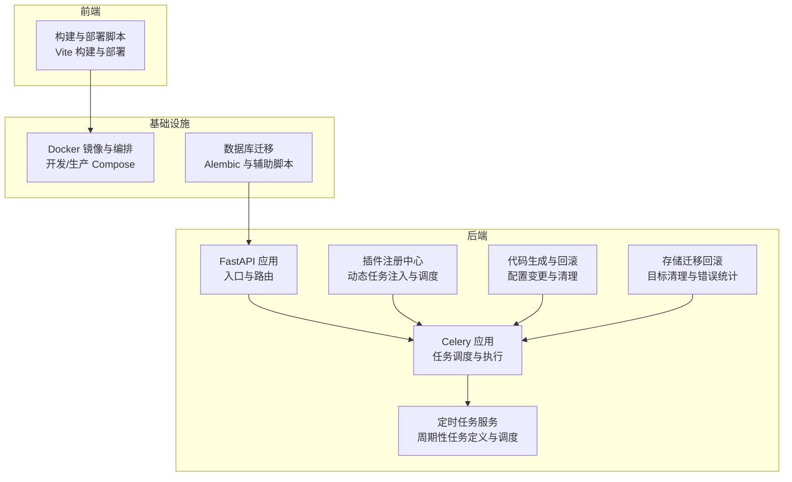
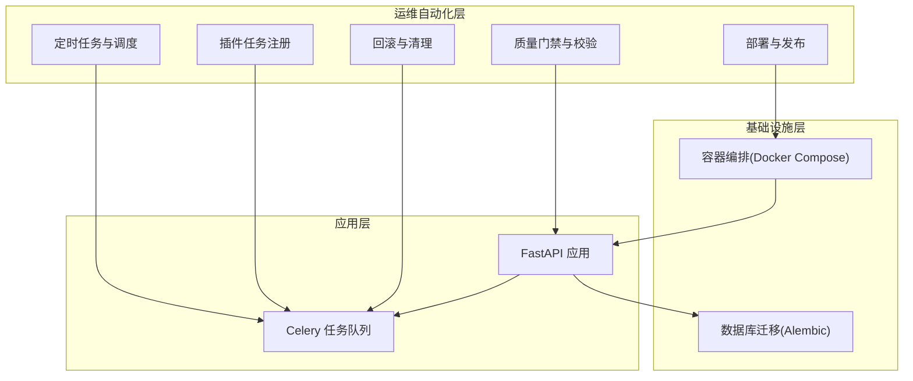
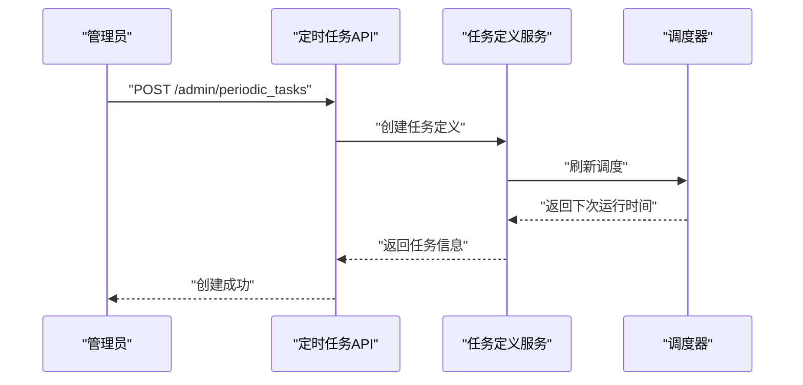
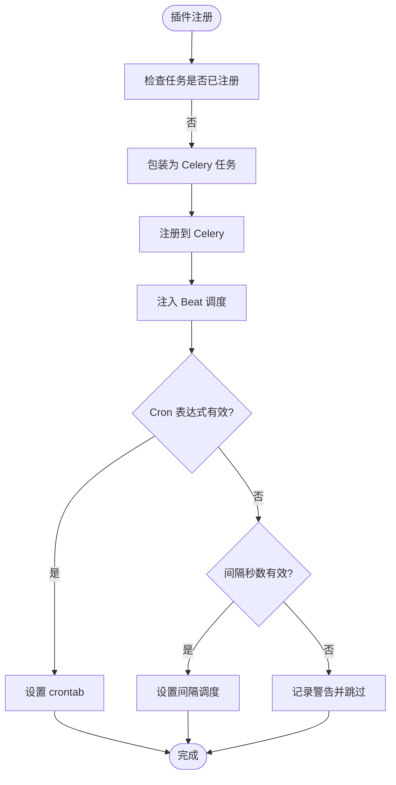
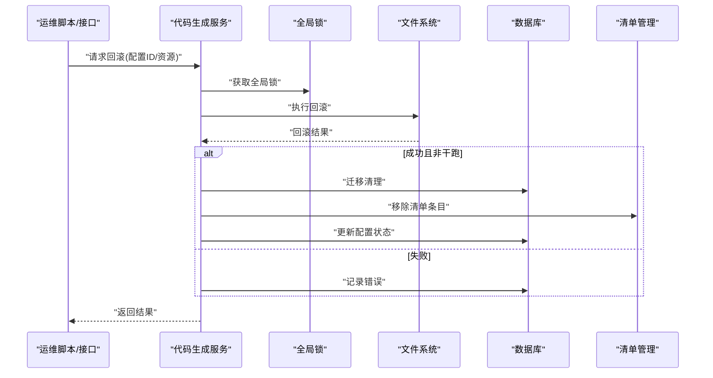
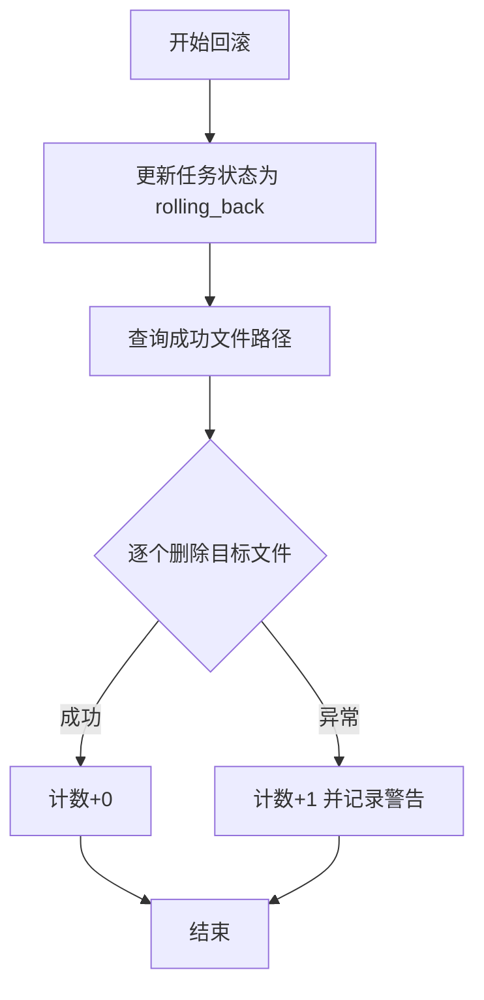
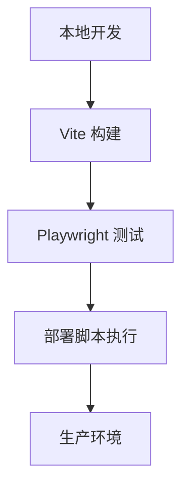
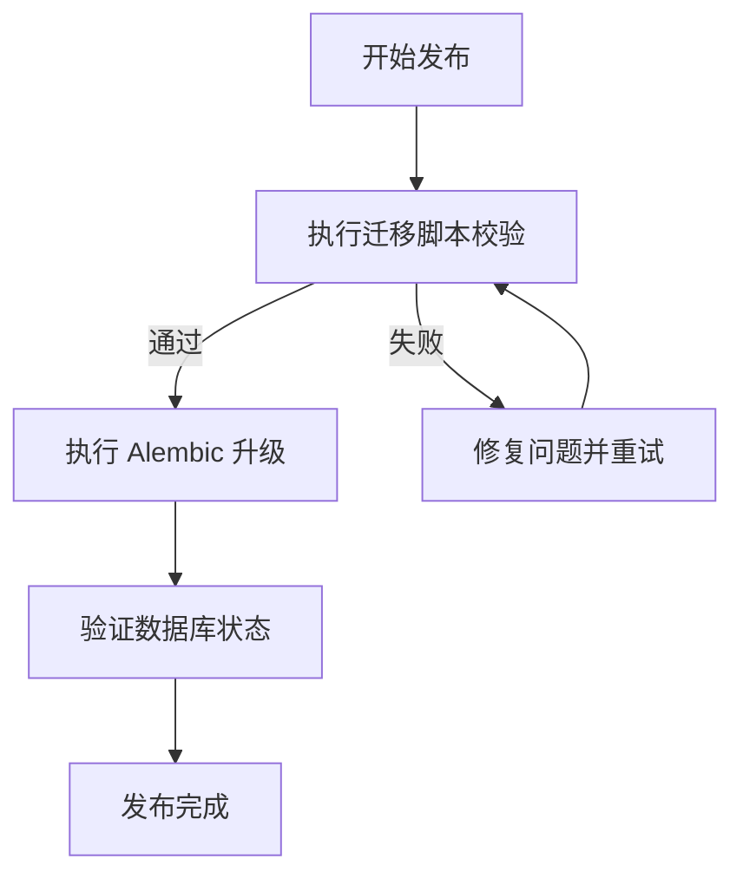
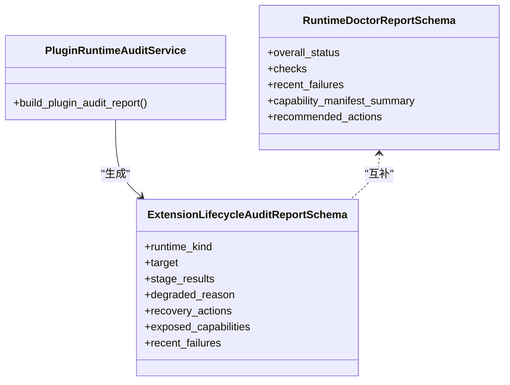
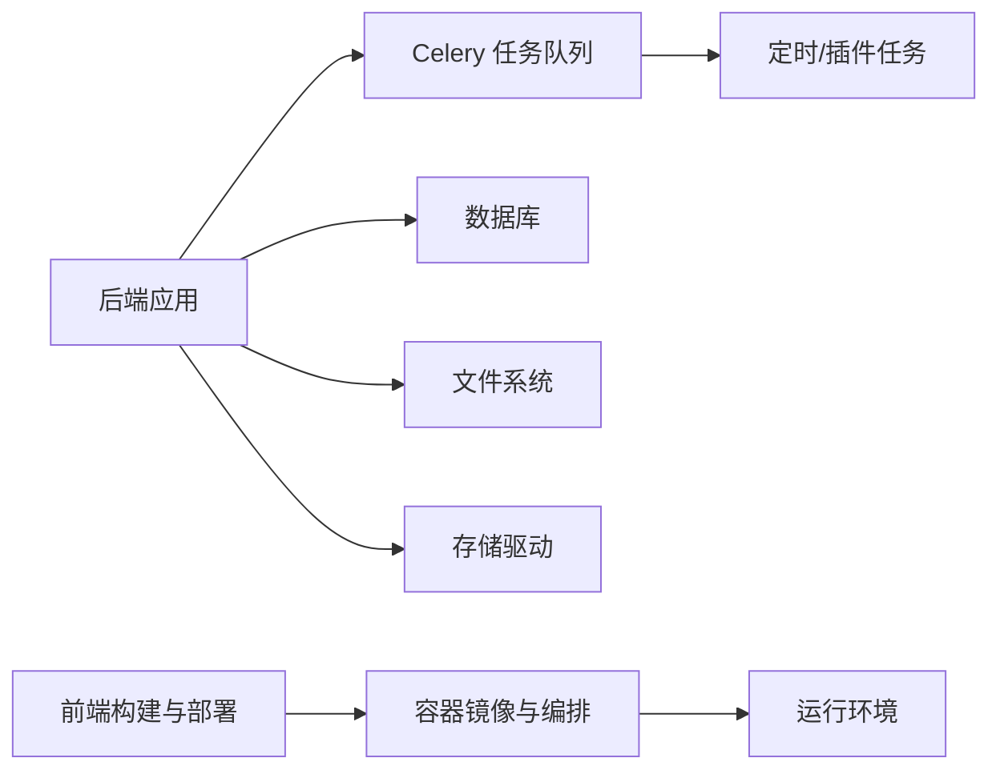

# 运维自动化

<cite>
**本文引用的文件**
- [backend/app/celery_app.py](file://backend/app/celery_app.py)
- [backend/app/tasks/scheduler.py](file://backend/app/tasks/scheduler.py)
- [backend/app/tasks/scheduled.py](file://backend/app/tasks/scheduled.py)
- [backend/app/plugins/registry.py](file://backend/app/plugins/registry.py)
- [backend/app/api/admin/periodic_tasks.py](file://backend/app/api/admin/periodic_tasks.py)
- [backend/app/services/system/task_definition_service.py](file://backend/app/services/system/task_definition_service.py)
- [backend/app/services/system/periodic_task_query_service.py](file://backend/app/services/system/periodic_task_query_service.py)
- [backend/app/services/system/codegen_service_parts/execution_mixin.py](file://backend/app/services/system/codegen_service_parts/execution_mixin.py)
- [backend/plugins/storage-migration/backend/services/migration_service_recovery.py](file://backend/plugins/storage-migration/backend/services/migration_service_recovery.py)
- [backend/app/schemas/ai/runtime_diagnostics.py](file://backend/app/schemas/ai/runtime_diagnostics.py)
- [backend/app/services/system/plugin_runtime_audit_service.py](file://backend/app/services/system/plugin_runtime_audit_service.py)
- [backend/scripts/lint_migrations.py](file://backend/scripts/lint_migrations.py)
- [backend/Dockerfile](file://backend/Dockerfile)
- [backend/docker-compose.dev.yml](file://backend/docker-compose.dev.yml)
- [backend/docker-compose.prod.yml](file://backend/docker-compose.prod.yml)
- [backend/pyproject.toml](file://backend/pyproject.toml)
- [backend/alembic.ini](file://backend/alembic.ini)
- [backend/migrations/script.py.mako](file://backend/migrations/script.py.mako)
- [backend/migrations/env.py](file://backend/migrations/env.py)
- [backend/migrations/helpers.py](file://backend/migrations/helpers.py)
- [backend/migrations/README](file://backend/migrations/README)
- [backend/README.md](file://backend/README.md)
- [frontend/package.json](file://frontend/package.json)
- [frontend/vite.config.mts](file://frontend/vite.config.mts)
- [frontend/playwright.config.ts](file://frontend/playwright.config.ts)
- [frontend/playwright_mcp_config.json](file://frontend/playwright_mcp_config.json)
- [frontend/scripts/deploy/index.ts](file://frontend/scripts/deploy/index.ts)
- [frontend/scripts/turbo-run/index.ts](file://frontend/scripts/turbo-run/index.ts)
- [frontend/scripts/vsh/index.ts](file://frontend/scripts/vsh/index.ts)
- [frontend/.dockerignore](file://frontend/.dockerignore)
- [frontend/.gitignore](file://frontend/.gitignore)
- [frontend/README.md](file://frontend/README.md)
- [README.md](file://README.md)
</cite>

## 目录
1. [引言](#引言)
2. [项目结构](#项目结构)
3. [核心组件](#核心组件)
4. [架构总览](#架构总览)
5. [详细组件分析](#详细组件分析)
6. [依赖关系分析](#依赖关系分析)
7. [性能考量](#性能考量)
8. [故障排查指南](#故障排查指南)
9. [结论](#结论)
10. [附录](#附录)

## 引言
本技术文档面向运维与平台工程团队，系统化阐述本项目的运维自动化能力，包括：
- CI/CD 流水线配置与自动化部署、回滚策略
- 定时任务、批处理作业与后台任务管理
- 自动化测试、质量门禁与发布流程
- 运维脚本、批量操作与维护任务自动化
- 配置管理、基础设施即代码与版本控制
- 变更管理、发布管理与运维监控自动化

文档以代码为依据，结合架构图与流程图，帮助读者快速理解并落地运维自动化实践。

## 项目结构
后端采用 Python/FastAPI + Celery 的服务化架构；前端采用 Vite + TypeScript 生态。整体通过 Docker Compose 在开发与生产环境运行。数据库迁移采用 Alembic，配合自定义脚本与校验工具保障发布质量。

**图表来源**
- [backend/app/celery_app.py](file://backend/app/celery_app.py)
- [backend/app/tasks/scheduler.py](file://backend/app/tasks/scheduler.py)
- [backend/app/tasks/scheduled.py](file://backend/app/tasks/scheduled.py)
- [backend/app/plugins/registry.py](file://backend/app/plugins/registry.py)
- [backend/app/services/system/codegen_service_parts/execution_mixin.py](file://backend/app/services/system/codegen_service_parts/execution_mixin.py)
- [backend/plugins/storage-migration/backend/services/migration_service_recovery.py](file://backend/plugins/storage-migration/backend/services/migration_service_recovery.py)
- [backend/Dockerfile](file://backend/Dockerfile)
- [backend/docker-compose.dev.yml](file://backend/docker-compose.dev.yml)
- [backend/docker-compose.prod.yml](file://backend/docker-compose.prod.yml)
- [backend/alembic.ini](file://backend/alembic.ini)

**章节来源**
- [backend/README.md](file://backend/README.md)
- [README.md](file://README.md)

## 核心组件
- 任务调度与执行：基于 Celery 的分布式任务队列，支持定时任务与后台异步任务。
- 插件任务注册：插件可动态注册 Celery 任务，并注入到 Beat 调度器。
- 定时任务管理：统一的任务定义、序列化与查询服务，支持 Cron 与间隔调度。
- 代码生成与回滚：对生成的配置进行回滚，并在成功时清理迁移与清单。
- 存储迁移回滚：在迁移失败或回滚场景下清理目标存储文件并记录错误。
- 前端构建与部署：Vite 构建与部署脚本，支持多环境配置。
- 基础设施与编排：Docker 镜像与 Compose 文件，覆盖开发与生产环境。
- 数据库迁移：Alembic 管理迁移版本与辅助脚本，保障发布一致性。

**章节来源**
- [backend/app/celery_app.py](file://backend/app/celery_app.py)
- [backend/app/tasks/scheduler.py](file://backend/app/tasks/scheduler.py)
- [backend/app/tasks/scheduled.py](file://backend/app/tasks/scheduled.py)
- [backend/app/plugins/registry.py](file://backend/app/plugins/registry.py)
- [backend/app/services/system/task_definition_service.py](file://backend/app/services/system/task_definition_service.py)
- [backend/app/services/system/periodic_task_query_service.py](file://backend/app/services/system/periodic_task_query_service.py)
- [backend/app/services/system/codegen_service_parts/execution_mixin.py](file://backend/app/services/system/codegen_service_parts/execution_mixin.py)
- [backend/plugins/storage-migration/backend/services/migration_service_recovery.py](file://backend/plugins/storage-migration/backend/services/migration_service_recovery.py)
- [backend/Dockerfile](file://backend/Dockerfile)
- [backend/docker-compose.dev.yml](file://backend/docker-compose.dev.yml)
- [backend/docker-compose.prod.yml](file://backend/docker-compose.prod.yml)
- [backend/alembic.ini](file://backend/alembic.ini)

## 架构总览
运维自动化围绕“任务驱动 + 配置驱动 + 迁移驱动”的闭环展开。后端通过 Celery 执行任务，插件注册中心负责动态注入任务，定时任务服务统一管理调度，代码生成与回滚模块确保配置变更可追踪、可回滚，存储迁移回滚模块保障数据一致性，前端通过脚本完成构建与部署，基础设施层由 Docker 与 Compose 提供一致的运行环境。

**图表来源**
- [backend/app/celery_app.py](file://backend/app/celery_app.py)
- [backend/app/plugins/registry.py](file://backend/app/plugins/registry.py)
- [backend/app/services/system/codegen_service_parts/execution_mixin.py](file://backend/app/services/system/codegen_service_parts/execution_mixin.py)
- [backend/plugins/storage-migration/backend/services/migration_service_recovery.py](file://backend/plugins/storage-migration/backend/services/migration_service_recovery.py)
- [backend/alembic.ini](file://backend/alembic.ini)
- [backend/docker-compose.dev.yml](file://backend/docker-compose.dev.yml)
- [backend/docker-compose.prod.yml](file://backend/docker-compose.prod.yml)

## 详细组件分析

### 组件一：定时任务与调度
- 任务定义与序列化：提供统一的任务定义模型与序列化逻辑，支持插件任务的国际化描述与启用状态。
- 调度计算：根据 Cron 表达式或间隔秒数计算下次运行时间，保证调度准确性。
- API 创建：提供管理员接口用于创建定时任务，设置默认参数、通知策略与优先级等。

**图表来源**
- [backend/app/api/admin/periodic_tasks.py](file://backend/app/api/admin/periodic_tasks.py)
- [backend/app/services/system/task_definition_service.py](file://backend/app/services/system/task_definition_service.py)
- [backend/app/services/system/periodic_task_query_service.py](file://backend/app/services/system/periodic_task_query_service.py)

**章节来源**
- [backend/app/api/admin/periodic_tasks.py](file://backend/app/api/admin/periodic_tasks.py)
- [backend/app/services/system/task_definition_service.py](file://backend/app/services/system/task_definition_service.py)
- [backend/app/services/system/periodic_task_query_service.py](file://backend/app/services/system/periodic_task_query_service.py)

### 组件二：插件任务注册与调度
- 动态注册：插件可注册 Celery 任务，若尚未注册则包装为同步任务并注册到指定队列。
- 调度注入：根据任务类型与表达式注入 Beat 调度表，支持 Cron 与间隔两种模式。
- 错误处理：当 Cron 表达式无效或未配置调度时记录警告并跳过。

**图表来源**
- [backend/app/plugins/registry.py](file://backend/app/plugins/registry.py)

**章节来源**
- [backend/app/plugins/registry.py](file://backend/app/plugins/registry.py)

### 组件三：代码生成与回滚
- 回滚流程：支持按配置 ID 或资源名回滚，失败时可回退到资源回滚；回滚成功后执行迁移清理与清单移除，并更新配置状态。
- 并发控制：全局锁保护回滚过程，避免并发冲突。
- 清理与同步：在干跑模式下不写盘，在成功时同步配置状态与清单条目。

**图表来源**
- [backend/app/services/system/codegen_service_parts/execution_mixin.py](file://backend/app/services/system/codegen_service_parts/execution_mixin.py)

**章节来源**
- [backend/app/services/system/codegen_service_parts/execution_mixin.py](file://backend/app/services/system/codegen_service_parts/execution_mixin.py)

### 组件四：存储迁移回滚
- 回滚阶段：将任务状态更新为“rolling_back”，随后遍历日志中成功的文件路径，尝试删除目标存储中的文件。
- 错误统计：对删除失败的文件进行计数并记录警告，便于后续人工干预。
- 目标解析：在无法解析目标驱动时记录警告，避免回滚中断。

**图表来源**
- [backend/plugins/storage-migration/backend/services/migration_service_recovery.py](file://backend/plugins/storage-migration/backend/services/migration_service_recovery.py)

**章节来源**
- [backend/plugins/storage-migration/backend/services/migration_service_recovery.py](file://backend/plugins/storage-migration/backend/services/migration_service_recovery.py)

### 组件五：前端构建与部署自动化
- 构建与部署：Vite 配置与部署脚本支持多环境构建与部署，Playwright 配置用于端到端测试。
- 开发与生产：前端仓库提供独立的构建与部署脚本，便于与后端解耦。

**图表来源**
- [frontend/vite.config.mts](file://frontend/vite.config.mts)
- [frontend/playwright.config.ts](file://frontend/playwright.config.ts)
- [frontend/playwright_mcp_config.json](file://frontend/playwright_mcp_config.json)
- [frontend/scripts/deploy/index.ts](file://frontend/scripts/deploy/index.ts)

**章节来源**
- [frontend/vite.config.mts](file://frontend/vite.config.mts)
- [frontend/playwright.config.ts](file://frontend/playwright.config.ts)
- [frontend/playwright_mcp_config.json](file://frontend/playwright_mcp_config.json)
- [frontend/scripts/deploy/index.ts](file://frontend/scripts/deploy/index.ts)

### 组件六：基础设施即代码与版本控制
- Docker 镜像与编排：后端提供 Dockerfile 与开发/生产 Compose 文件，确保环境一致性。
- 版本控制：项目根目录与子模块均包含 .gitignore 与 .dockerignore，规范忽略规则。
- 前端工程：package.json 与工作区配置支持多包管理与脚本执行。

**章节来源**
- [backend/Dockerfile](file://backend/Dockerfile)
- [backend/docker-compose.dev.yml](file://backend/docker-compose.dev.yml)
- [backend/docker-compose.prod.yml](file://backend/docker-compose.prod.yml)
- [frontend/package.json](file://frontend/package.json)
- [frontend/.dockerignore](file://frontend/.dockerignore)
- [frontend/.gitignore](file://frontend/.gitignore)

### 组件七：数据库迁移与质量门禁
- 迁移管理：Alembic 配置与脚本模板，提供迁移版本管理与辅助函数。
- 迁移校验：提供迁移脚本的静态检查脚本，减少发布风险。
- 发布流程：迁移 README 提供发布说明与注意事项。

**图表来源**
- [backend/alembic.ini](file://backend/alembic.ini)
- [backend/migrations/script.py.mako](file://backend/migrations/script.py.mako)
- [backend/migrations/env.py](file://backend/migrations/env.py)
- [backend/migrations/helpers.py](file://backend/migrations/helpers.py)
- [backend/migrations/README](file://backend/migrations/README)
- [backend/scripts/lint_migrations.py](file://backend/scripts/lint_migrations.py)

**章节来源**
- [backend/alembic.ini](file://backend/alembic.ini)
- [backend/migrations/script.py.mako](file://backend/migrations/script.py.mako)
- [backend/migrations/env.py](file://backend/migrations/env.py)
- [backend/migrations/helpers.py](file://backend/migrations/helpers.py)
- [backend/migrations/README](file://backend/migrations/README)
- [backend/scripts/lint_migrations.py](file://backend/scripts/lint_migrations.py)

### 组件八：运维监控与健康审计
- 运行时诊断：提供运行时检查、最近失败聚合、能力清单摘要与建议动作。
- 插件生命周期审计：评估依赖、恢复状态、健康状态与准入门禁，输出审计报告与降级原因。
- 报告结构：标准化的 Schema 定义，便于前端展示与自动化处理。

**图表来源**
- [backend/app/schemas/ai/runtime_diagnostics.py](file://backend/app/schemas/ai/runtime_diagnostics.py)
- [backend/app/services/system/plugin_runtime_audit_service.py](file://backend/app/services/system/plugin_runtime_audit_service.py)

**章节来源**
- [backend/app/schemas/ai/runtime_diagnostics.py](file://backend/app/schemas/ai/runtime_diagnostics.py)
- [backend/app/services/system/plugin_runtime_audit_service.py](file://backend/app/services/system/plugin_runtime_audit_service.py)

## 依赖关系分析
- 后端应用依赖 Celery 作为任务执行引擎，定时任务与插件任务均通过 Celery 执行。
- 代码生成与回滚模块依赖清单管理与数据库状态同步，确保变更可追踪。
- 存储迁移回滚模块依赖存储驱动与日志表，实现目标清理与错误统计。
- 前端构建与部署脚本独立于后端，通过脚本化实现自动化。

**图表来源**
- [backend/app/celery_app.py](file://backend/app/celery_app.py)
- [backend/app/services/system/codegen_service_parts/execution_mixin.py](file://backend/app/services/system/codegen_service_parts/execution_mixin.py)
- [backend/plugins/storage-migration/backend/services/migration_service_recovery.py](file://backend/plugins/storage-migration/backend/services/migration_service_recovery.py)
- [backend/Dockerfile](file://backend/Dockerfile)
- [backend/docker-compose.dev.yml](file://backend/docker-compose.dev.yml)
- [backend/docker-compose.prod.yml](file://backend/docker-compose.prod.yml)

**章节来源**
- [backend/app/celery_app.py](file://backend/app/celery_app.py)
- [backend/app/services/system/codegen_service_parts/execution_mixin.py](file://backend/app/services/system/codegen_service_parts/execution_mixin.py)
- [backend/plugins/storage-migration/backend/services/migration_service_recovery.py](file://backend/plugins/storage-migration/backend/services/migration_service_recovery.py)
- [backend/Dockerfile](file://backend/Dockerfile)
- [backend/docker-compose.dev.yml](file://backend/docker-compose.dev.yml)
- [backend/docker-compose.prod.yml](file://backend/docker-compose.prod.yml)

## 性能考量
- 任务并发与队列：通过队列与优先级控制任务执行顺序，避免热点任务阻塞。
- 全局锁保护：代码生成回滚使用全局锁，防止并发回滚导致的状态不一致。
- 调度精度：Cron 表达式与间隔调度结合，满足不同场景的调度需求。
- 存储清理：回滚阶段仅清理成功项，降低失败回滚的成本与风险。
- 构建优化：前端构建脚本与缓存策略提升构建效率。

## 故障排查指南
- 定时任务未触发
  - 检查任务定义的服务端点与调度类型，确认 Cron 表达式或间隔秒数有效。
  - 查看调度刷新日志，确认调度器已加载最新配置。
- 插件任务未注册
  - 确认插件已正确注册 Celery 任务，Beat 调度表中存在对应键值。
  - 检查任务名称与队列配置是否匹配。
- 回滚失败
  - 查看回滚结果与错误列表，确认是否执行了迁移清理与清单移除。
  - 对于存储迁移回滚，检查目标文件删除失败计数并手动清理。
- 数据库迁移问题
  - 使用迁移校验脚本提前发现问题，必要时回滚并修复后再升级。
  - 参考迁移 README 中的发布步骤与注意事项。

**章节来源**
- [backend/app/services/system/task_definition_service.py](file://backend/app/services/system/task_definition_service.py)
- [backend/app/plugins/registry.py](file://backend/app/plugins/registry.py)
- [backend/app/services/system/codegen_service_parts/execution_mixin.py](file://backend/app/services/system/codegen_service_parts/execution_mixin.py)
- [backend/plugins/storage-migration/backend/services/migration_service_recovery.py](file://backend/plugins/storage-migration/backend/services/migration_service_recovery.py)
- [backend/scripts/lint_migrations.py](file://backend/scripts/lint_migrations.py)
- [backend/migrations/README](file://backend/migrations/README)

## 结论
本项目通过 Celery 任务队列、插件注册中心、定时任务服务、代码生成与回滚、存储迁移回滚以及前端构建与部署脚本，形成了完整的运维自动化体系。结合 Alembic 迁移与质量门禁脚本，能够稳定地支撑持续交付与发布。建议在实际落地中进一步完善监控告警、变更审批与演练机制，以提升系统的可观测性与韧性。

## 附录
- 参考配置文件与脚本路径，便于快速定位与修改：
  - 后端应用与任务：[backend/app/celery_app.py](file://backend/app/celery_app.py)
  - 定时任务 API：[backend/app/api/admin/periodic_tasks.py](file://backend/app/api/admin/periodic_tasks.py)
  - 任务定义服务：[backend/app/services/system/task_definition_service.py](file://backend/app/services/system/task_definition_service.py)
  - 插件注册中心：[backend/app/plugins/registry.py](file://backend/app/plugins/registry.py)
  - 代码生成回滚：[backend/app/services/system/codegen_service_parts/execution_mixin.py](file://backend/app/services/system/codegen_service_parts/execution_mixin.py)
  - 存储迁移回滚：[backend/plugins/storage-migration/backend/services/migration_service_recovery.py](file://backend/plugins/storage-migration/backend/services/migration_service_recovery.py)
  - 前端构建与部署：[frontend/vite.config.mts](file://frontend/vite.config.mts), [frontend/scripts/deploy/index.ts](file://frontend/scripts/deploy/index.ts)
  - 基础设施与编排：[backend/Dockerfile](file://backend/Dockerfile), [backend/docker-compose.dev.yml](file://backend/docker-compose.dev.yml), [backend/docker-compose.prod.yml](file://backend/docker-compose.prod.yml)
  - 数据库迁移：[backend/alembic.ini](file://backend/alembic.ini), [backend/migrations/README](file://backend/migrations/README), [backend/scripts/lint_migrations.py](file://backend/scripts/lint_migrations.py)