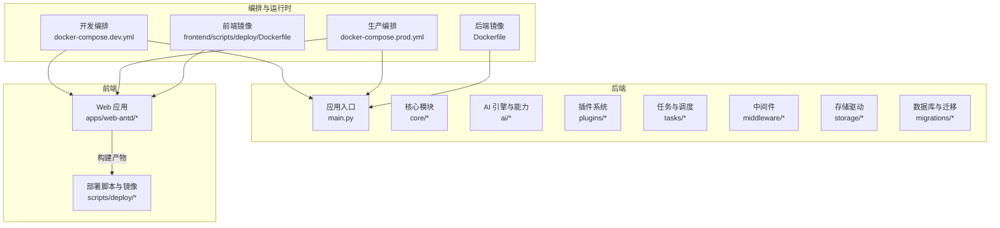
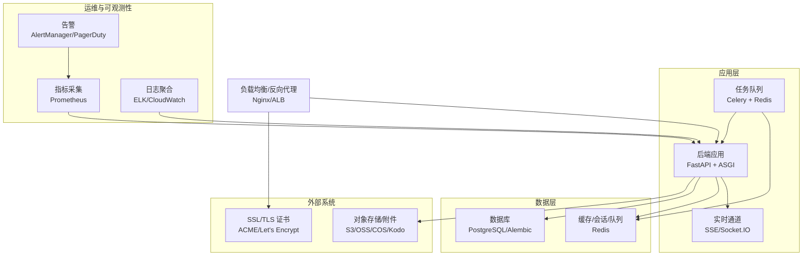
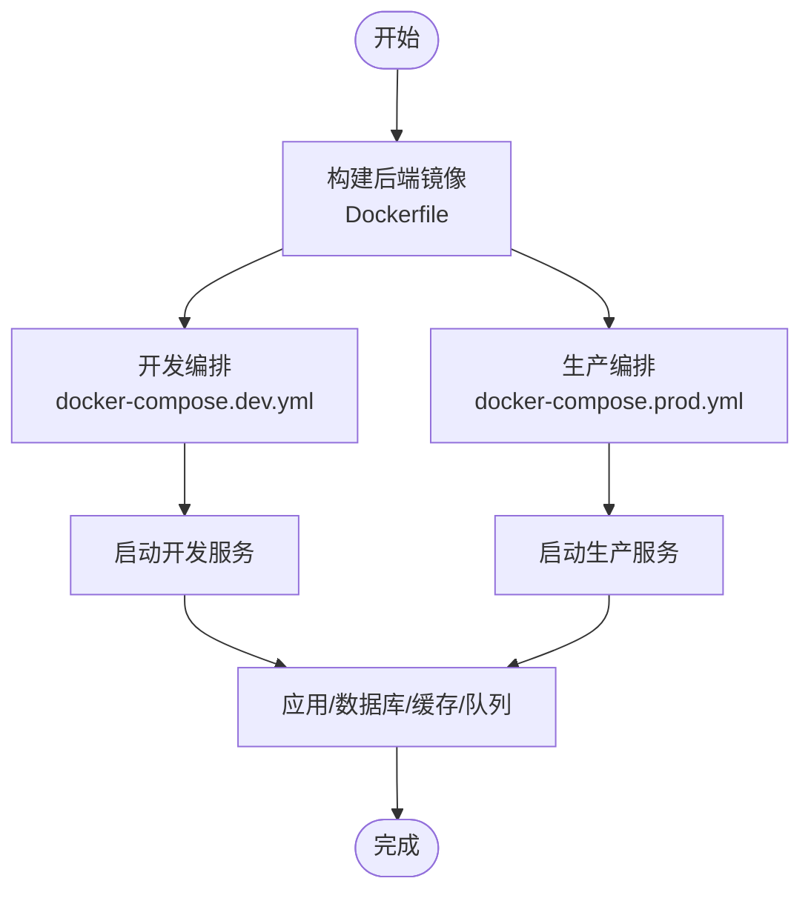
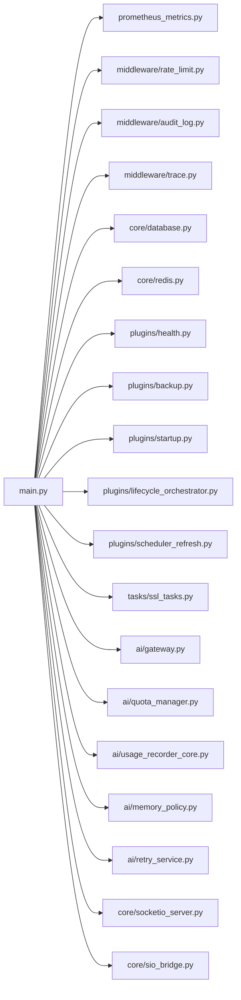

# 部署和运维

<cite>
**本文引用的文件**
- [Dockerfile（后端）](file://backend/Dockerfile)
- [docker-compose.dev.yml](file://docker-compose.dev.yml)
- [docker-compose.prod.yml](file://docker-compose.prod.yml)
- [pyproject.toml（后端）](file://backend/pyproject.toml)
- [alembic.ini](file://backend/alembic.ini)
- [README.md（项目总览）](file://README.md)
- [README.md（后端）](file://backend/README.md)
- [celery_app.py](file://backend/app/celery_app.py)
- [main.py](file://backend/app/main.py)
- [redis.py](file://backend/app/core/redis.py)
- [database.py](file://backend/app/core/database.py)
- [logging.py](file://backend/app/core/logging.py)
- [prometheus_metrics.py](file://backend/app/middleware/prometheus_metrics.py)
- [ssl_tasks.py](file://backend/app/tasks/ssl_tasks.py)
- [health.py](file://backend/app/plugins/health.py)
- [backup.py](file://backend/app/plugins/backup.py)
- [startup.py](file://backend/app/plugins/startup.py)
- [runtime_recovery.py](file://backend/app/plugins/runtime_recovery.py)
- [lifecycle_orchestrator.py](file://backend/app/plugins/lifecycle_orchestrator.py)
- [scheduler_refresh.py](file://backend/app/plugins/scheduler_refresh.py)
- [maintenance.py](file://backend/app/middleware/maintenance.py)
- [rate_limit.py](file://backend/app/core/rate_limit.py)
- [retry_service.py](file://backend/app/ai/retry_service.py)
- [gateway.py](file://backend/app/ai/gateway.py)
- [quota_manager.py](file://backend/app/ai/quota_manager.py)
- [failover.py](file://backend/app/ai/failover.py)
- [sse.py](file://backend/app/ai/sse.py)
- [socketio_server.py](file://backend/app/core/socketio_server.py)
- [sio_bridge.py](file://backend/app/core/sio_bridge.py)
- [trace.py](file://backend/app/middleware/trace.py)
- [audit_log.py](file://backend/app/middleware/audit_log.py)
- [i18n.py](file://backend/app/core/i18n.py)
- [hosts_helper.py](file://backend/app/core/hosts_helper.py)
- [security.py](file://backend/app/core/security.py)
- [cors.py](file://backend/app/core/cors.py)
- [rate_limit.py（中间件）](file://backend/app/middleware/rate_limit.py)
- [rate_limiter.py](file://backend/app/ai/rate_limiter.py)
- [quota_usage_tracker.py](file://backend/app/ai/quota_usage_tracker.py)
- [usage_recorder_core.py](file://backend/app/ai/usage_recorder_core.py)
- [usage_recorder_context.py](file://backend/app/ai/usage_recorder_context.py)
- [usage_recorder_support.py](file://backend/app/ai/usage_recorder_support.py)
- [text_semantics.py](file://backend/app/ai/text_semantics.py)
- [text_semantics_json.py](file://backend/app/ai/text_semantics_json.py)
- [text_semantics_terms.py](file://backend/app/ai/text_semantics_terms.py)
- [text_semantics_tokens.py](file://backend/app/ai/text_semantics_tokens.py)
- [text_semantics_urls.py](file://backend/app/ai/text_semantics_urls.py)
- [memory_policy.py](file://backend/app/ai/memory_policy.py)
- [agent_stats.py](file://backend/app/ai/agent_stats.py)
- [agent_quota_manager.py](file://backend/app/ai/agent_quota_manager.py)
- [agent_quota_manager_support.py](file://backend/app/ai/agent_quota_manager_support.py)
- [agent_quota_concurrency.py](file://backend/app/ai/agent_quota_concurrency.py)
- [agent_quota_config.py](file://backend/app/ai/agent_quota_config.py)
- [agent_quota_exceptions.py](file://backend/app/ai/agent_quota_exceptions.py)
- [cache.py](file://backend/app/ai/cache.py)
- [constants.py](file://backend/app/ai/constants.py)
- [exceptions.py](file://backend/app/ai/exceptions.py)
- [types.py](file://backend/app/ai/types.py)
- [usage_mode.py](file://backend/app/ai/usage_mode.py)
- [json_safe.py](file://backend/app/ai/json_safe.py)
- [page_locale.py](file://backend/app/ai/page_locale.py)
- [quota_exceptions.py](file://backend/app/ai/quota_exceptions.py)
- [quota_models.py](file://backend/app/ai/quota_models.py)
- [rag_injector.py](file://backend/app/ai/rag_injector.py)
- [internal_ai_service.py](file://backend/app/ai/internal_ai_service.py)
- [gateway_support/](file://backend/app/ai/gateway_support/)
- [routing/](file://backend/app/ai/routing/)
- [skills/](file://backend/app/ai/skills/)
- [tools/](file://backend/app/ai/tools/)
- [prompt_contracts/](file://backend/app/ai/prompt_contracts/)
- [context/](file://backend/app/ai/context/)
- [engine/](file://backend/app/ai/engine/)
- [capabilities/](file://backend/app/ai/capabilities/)
- [events/](file://backend/app/ai/events/)
- [runtime/](file://backend/app/ai/runtime/)
- [utils/](file://backend/app/ai/utils/)
- [ai/](file://backend/app/api/v1/)
- [common/](file://backend/app/api/common/)
- [public/](file://backend/app/api/public/)
- [tenant/](file://backend/app/api/tenant/)
- [user/](file://backend/app/api/user/)
- [admin/](file://backend/app/api/admin/)
- [shared/](file://backend/app/api/shared/)
- [cli_commands/](file://backend/app/cli_commands/)
- [codegen/](file://backend/app/codegen/)
- [configs/](file://backend/app/configs/)
- [core/](file://backend/app/core/)
- [enums/](file://backend/app/enums/)
- [exceptions/](file://backend/app/exceptions/)
- [locales/](file://backend/app/locales/)
- [middleware/](file://backend/app/middleware/)
- [models/](file://backend/app/models/)
- [plugins/](file://backend/app/plugins/)
- [rbac/](file://backend/app/rbac/)
- [repositories/](file://backend/app/repositories/)
- [schemas/](file://backend/app/schemas/)
- [services/](file://backend/app/services/)
- [sio/](file://backend/app/sio/)
- [storage/](file://backend/app/storage/)
- [tasks/](file://backend/app/tasks/)
- [templates/email/](file://backend/app/templates/email/)
- [utils/](file://backend/app/utils/)
- [scripts/](file://backend/scripts/)
- [tests/](file://backend/tests/)
- [frontend/README.md](file://frontend/README.md)
- [frontend/apps/web-antd/package.json](file://frontend/apps/web-antd/package.json)
- [frontend/apps/web-antd/vite.config.mts](file://frontend/apps/web-antd/vite.config.mts)
- [frontend/scripts/deploy/Dockerfile](file://frontend/scripts/deploy/Dockerfile)
- [frontend/scripts/deploy/](file://frontend/scripts/deploy/)
</cite>

## 目录
1. [简介](#简介)
2. [项目结构](#项目结构)
3. [核心组件](#核心组件)
4. [架构总览](#架构总览)
5. [详细组件分析](#详细组件分析)
6. [依赖关系分析](#依赖关系分析)
7. [性能考量](#性能考量)
8. [故障排除指南](#故障排除指南)
9. [结论](#结论)
10. [附录](#附录)

## 简介
本文件面向生产环境部署与运维，覆盖后端与前端的容器化部署、基础设施配置、监控与日志、性能优化与容量规划、备份恢复与灾难恢复、高可用与负载均衡、SSL 证书与安全加固、运维自动化与 CI/CD 流程、变更管理、故障排除、性能分析与问题诊断、扩展性与成本优化等主题。内容基于仓库中现有的 Dockerfile、docker-compose、中间件、任务调度、插件与配置等代码进行归纳总结，并通过图示展示关键流程与组件交互。

## 项目结构
后端采用 Python/FastAPI 架构，包含 AI 引擎、API 层、插件系统、任务调度、存储与迁移等模块；前端采用 Vite/Vue 技术栈，提供 Web 应用构建与部署脚本。项目同时提供开发与生产的 docker-compose 配置，便于本地与生产环境快速编排。

图表来源
- [docker-compose.dev.yml](file://docker-compose.dev.yml)
- [docker-compose.prod.yml](file://docker-compose.prod.yml)
- [backend/Dockerfile](file://backend/Dockerfile)
- [frontend/scripts/deploy/Dockerfile](file://frontend/scripts/deploy/Dockerfile)
- [backend/app/main.py](file://backend/app/main.py)
- [frontend/apps/web-antd/package.json](file://frontend/apps/web-antd/package.json)

章节来源
- [README.md（项目总览）](file://README.md)
- [README.md（后端）](file://backend/README.md)
- [docker-compose.dev.yml](file://docker-compose.dev.yml)
- [docker-compose.prod.yml](file://docker-compose.prod.yml)
- [backend/Dockerfile](file://backend/Dockerfile)
- [frontend/scripts/deploy/Dockerfile](file://frontend/scripts/deploy/Dockerfile)

## 核心组件
- 应用入口与路由：后端通过主入口组织路由与服务，支持多租户、鉴权、审计、国际化、CORS、追踪等通用能力。
- 中间件体系：包括指标采集（Prometheus）、速率限制、维护模式、审计日志、请求追踪等，贯穿请求生命周期。
- 插件系统：提供生命周期编排、健康检查、备份、启动恢复、调度刷新等功能，支撑可插拔扩展。
- 任务与队列：Celery 用于异步任务，结合 Redis 作为消息代理，支持定时任务与后台处理。
- 存储与迁移：统一的存储驱动抽象与 Alembic 迁移框架，确保数据一致性与版本演进。
- AI 能力与配额：AI 引擎、路由、网关、重试、配额与用量记录、内存策略等模块协同，保障服务质量与成本控制。
- 前端构建与部署：Vite 构建、静态资源与部署脚本，配合 docker-compose 生产镜像。

章节来源
- [backend/app/main.py](file://backend/app/main.py)
- [backend/app/middleware/prometheus_metrics.py](file://backend/app/middleware/prometheus_metrics.py)
- [backend/app/middleware/rate_limit.py](file://backend/app/middleware/rate_limit.py)
- [backend/app/plugins/lifecycle_orchestrator.py](file://backend/app/plugins/lifecycle_orchestrator.py)
- [backend/app/plugins/health.py](file://backend/app/plugins/health.py)
- [backend/app/plugins/backup.py](file://backend/app/plugins/backup.py)
- [backend/app/plugins/startup.py](file://backend/app/plugins/startup.py)
- [backend/app/plugins/runtime_recovery.py](file://backend/app/plugins/runtime_recovery.py)
- [backend/app/plugins/scheduler_refresh.py](file://backend/app/plugins/scheduler_refresh.py)
- [backend/app/celery_app.py](file://backend/app/celery_app.py)
- [backend/app/core/redis.py](file://backend/app/core/redis.py)
- [backend/app/core/database.py](file://backend/app/core/database.py)
- [backend/app/core/logging.py](file://backend/app/core/logging.py)
- [backend/app/ai/](file://backend/app/ai/)

## 架构总览
下图展示了生产环境的关键组件与交互：Nginx/反向代理负责 SSL 终止与负载均衡，后端应用通过 FastAPI 提供 API 与 SSE/Socket.IO 实时通道，Redis 作为缓存与队列，数据库承载持久化，插件系统与任务队列支撑后台处理与健康监控。

图表来源
- [backend/app/main.py](file://backend/app/main.py)
- [backend/app/core/redis.py](file://backend/app/core/redis.py)
- [backend/app/core/database.py](file://backend/app/core/database.py)
- [backend/app/middleware/prometheus_metrics.py](file://backend/app/middleware/prometheus_metrics.py)
- [backend/app/tasks/ssl_tasks.py](file://backend/app/tasks/ssl_tasks.py)
- [backend/app/plugins/backup.py](file://backend/app/plugins/backup.py)
- [backend/app/plugins/health.py](file://backend/app/plugins/health.py)

## 详细组件分析

### 容器化与编排（后端）
- 后端镜像构建：基于仓库提供的 Dockerfile，定义 Python 运行时、依赖安装、工作目录与启动命令。
- 开发与生产编排：docker-compose.dev.yml 与 docker-compose.prod.yml 分别描述开发与生产环境的服务编排，包含应用、数据库、缓存、任务队列等服务依赖。
- 端口与网络：应用暴露 HTTP 端口，服务间通过内部网络通信；生产环境建议通过反向代理对外提供服务。
- 环境变量与密钥：通过环境变量注入数据库连接、Redis 地址、密钥与第三方服务凭据；生产环境应使用机密管理方案。

图表来源
- [backend/Dockerfile](file://backend/Dockerfile)
- [docker-compose.dev.yml](file://docker-compose.dev.yml)
- [docker-compose.prod.yml](file://docker-compose.prod.yml)

章节来源
- [backend/Dockerfile](file://backend/Dockerfile)
- [docker-compose.dev.yml](file://docker-compose.dev.yml)
- [docker-compose.prod.yml](file://docker-compose.prod.yml)

### 容器化与编排（前端）
- 前端镜像构建：仓库提供前端部署 Dockerfile，用于在容器内构建与打包静态资源。
- 构建与产物：前端通过包管理工具安装依赖并执行构建，生成静态资源供反向代理或静态托管使用。
- 部署脚本：前端 scripts/deploy 目录包含部署相关脚本与配置，便于自动化发布。

章节来源
- [frontend/scripts/deploy/Dockerfile](file://frontend/scripts/deploy/Dockerfile)
- [frontend/apps/web-antd/package.json](file://frontend/apps/web-antd/package.json)
- [frontend/scripts/deploy/](file://frontend/scripts/deploy/)

### 数据库与迁移
- 迁移框架：Alembic 配置文件定义迁移路径、目标表与版本历史，支持增量演进与回滚。
- 初始化与升级：生产环境应在首次部署时执行迁移初始化，并在每次发布前评估迁移风险与停机窗口。
- 备份策略：建议结合数据库快照与逻辑备份，定期验证恢复流程。

章节来源
- [backend/alembic.ini](file://backend/alembic.ini)

### 缓存与队列（Redis）
- 缓存：用于会话、配额状态、短期数据等，提升响应速度与削峰填谷。
- 队列：Celery 使用 Redis 作为消息中间件，实现异步任务分发与重试。
- 持久化与淘汰策略：生产环境建议开启 RDB/AOF 或集群模式，合理设置过期策略与内存上限。

章节来源
- [backend/app/core/redis.py](file://backend/app/core/redis.py)
- [backend/app/celery_app.py](file://backend/app/celery_app.py)

### 任务与调度
- Celery：异步任务与定时任务，结合 Redis 与 Broker 实现任务分发与状态跟踪。
- SSL 任务：自动检测与续期 SSL 证书，降低运维负担。
- 调度刷新：插件负责周期性刷新调度状态，保证任务一致性。

章节来源
- [backend/app/celery_app.py](file://backend/app/celery_app.py)
- [backend/app/tasks/ssl_tasks.py](file://backend/app/tasks/ssl_tasks.py)
- [backend/app/plugins/scheduler_refresh.py](file://backend/app/plugins/scheduler_refresh.py)

### 中间件与可观测性
- 指标采集：Prometheus 中间件收集请求耗时、请求数、错误率等关键指标。
- 审计日志：记录用户操作与系统事件，支持合规与溯源。
- 请求追踪：跨服务链路追踪，辅助定位性能瓶颈与异常路径。
- 维护模式：在维护期间返回统一响应，避免对用户造成干扰。

章节来源
- [backend/app/middleware/prometheus_metrics.py](file://backend/app/middleware/prometheus_metrics.py)
- [backend/app/middleware/audit_log.py](file://backend/app/middleware/audit_log.py)
- [backend/app/middleware/trace.py](file://backend/app/middleware/trace.py)
- [backend/app/middleware/maintenance.py](file://backend/app/middleware/maintenance.py)

### 安全与访问控制
- CORS 与安全头：统一处理跨域与安全响应头，减少 XSS 与点击劫持风险。
- 国际化与主机校验：根据主机与语言设置动态调整行为，避免误判。
- 速率限制：在核心路径实施速率限制，防止滥用与 DDoS。
- 审计与追踪：结合审计日志与链路追踪，实现操作留痕与异常定位。

章节来源
- [backend/app/core/security.py](file://backend/app/core/security.py)
- [backend/app/core/cors.py](file://backend/app/core/cors.py)
- [backend/app/core/hosts_helper.py](file://backend/app/core/hosts_helper.py)
- [backend/app/middleware/rate_limit.py](file://backend/app/middleware/rate_limit.py)
- [backend/app/middleware/audit_log.py](file://backend/app/middleware/audit_log.py)
- [backend/app/middleware/trace.py](file://backend/app/middleware/trace.py)

### 日志与监控
- 日志：集中化日志输出，按级别与上下文区分，便于检索与告警。
- 指标：暴露 Prometheus 指标端点，结合 Grafana 可视化。
- 告警：基于阈值触发告警，联动值班流程。

章节来源
- [backend/app/core/logging.py](file://backend/app/core/logging.py)
- [backend/app/middleware/prometheus_metrics.py](file://backend/app/middleware/prometheus_metrics.py)

### 备份与灾难恢复
- 插件备份：插件系统提供备份能力，支持数据导出与导入。
- 生命周期编排：在安装、升级、卸载过程中执行一致性检查与回滚准备。
- 启动恢复：应用启动阶段执行恢复流程，确保状态一致。
- 建议：定期演练恢复流程，验证备份完整性与恢复时间目标。

章节来源
- [backend/app/plugins/backup.py](file://backend/app/plugins/backup.py)
- [backend/app/plugins/lifecycle_orchestrator.py](file://backend/app/plugins/lifecycle_orchestrator.py)
- [backend/app/plugins/runtime_recovery.py](file://backend/app/plugins/runtime_recovery.py)

### 高可用与负载均衡
- 多实例：通过反向代理将流量分发至多个应用实例，实现水平扩展。
- 健康检查：利用插件健康检查与任务心跳，剔除不健康节点。
- 会话与状态：使用共享缓存或无状态设计，避免单点状态丢失。

章节来源
- [backend/app/plugins/health.py](file://backend/app/plugins/health.py)

### SSL 证书与安全加固
- 自动续期：通过任务自动检测证书到期并执行续期。
- 证书存储：建议使用硬件安全模块或托管密钥服务，保护私钥。
- 安全基线：启用 HTTPS、禁用不安全协议、最小权限原则与网络隔离。

章节来源
- [backend/app/tasks/ssl_tasks.py](file://backend/app/tasks/ssl_tasks.py)

### 运维自动化与 CI/CD
- 构建与测试：前端通过包管理与构建工具生成静态资源；后端通过依赖管理与测试套件保证质量。
- 镜像与发布：使用 Dockerfile 构建镜像，结合编排文件进行部署。
- 变更管理：通过版本控制与发布分支策略，结合自动化测试与审批流程。

章节来源
- [frontend/apps/web-antd/package.json](file://frontend/apps/web-antd/package.json)
- [backend/pyproject.toml](file://backend/pyproject.toml)
- [backend/tests/](file://backend/tests/)

### 扩展性与容量规划
- 水平扩展：增加应用实例数量，结合负载均衡与共享缓存。
- 垂直扩展：提升 CPU/内存与存储规格，配合数据库读写分离。
- AI 引擎：通过配额与用量记录模块进行容量与成本控制，结合内存策略与重试机制优化吞吐。

章节来源
- [backend/app/ai/quota_manager.py](file://backend/app/ai/quota_manager.py)
- [backend/app/ai/quota_usage_tracker.py](file://backend/app/ai/quota_usage_tracker.py)
- [backend/app/ai/usage_recorder_core.py](file://backend/app/ai/usage_recorder_core.py)
- [backend/app/ai/memory_policy.py](file://backend/app/ai/memory_policy.py)
- [backend/app/ai/retry_service.py](file://backend/app/ai/retry_service.py)

## 依赖关系分析
下图展示后端核心模块之间的依赖关系，突出中间件、插件、任务与 AI 引擎的耦合与协作。

图表来源
- [backend/app/main.py](file://backend/app/main.py)
- [backend/app/middleware/prometheus_metrics.py](file://backend/app/middleware/prometheus_metrics.py)
- [backend/app/middleware/rate_limit.py](file://backend/app/middleware/rate_limit.py)
- [backend/app/middleware/audit_log.py](file://backend/app/middleware/audit_log.py)
- [backend/app/middleware/trace.py](file://backend/app/middleware/trace.py)
- [backend/app/core/database.py](file://backend/app/core/database.py)
- [backend/app/core/redis.py](file://backend/app/core/redis.py)
- [backend/app/plugins/health.py](file://backend/app/plugins/health.py)
- [backend/app/plugins/backup.py](file://backend/app/plugins/backup.py)
- [backend/app/plugins/startup.py](file://backend/app/plugins/startup.py)
- [backend/app/plugins/lifecycle_orchestrator.py](file://backend/app/plugins/lifecycle_orchestrator.py)
- [backend/app/plugins/scheduler_refresh.py](file://backend/app/plugins/scheduler_refresh.py)
- [backend/app/tasks/ssl_tasks.py](file://backend/app/tasks/ssl_tasks.py)
- [backend/app/ai/gateway.py](file://backend/app/ai/gateway.py)
- [backend/app/ai/quota_manager.py](file://backend/app/ai/quota_manager.py)
- [backend/app/ai/usage_recorder_core.py](file://backend/app/ai/usage_recorder_core.py)
- [backend/app/ai/memory_policy.py](file://backend/app/ai/memory_policy.py)
- [backend/app/ai/retry_service.py](file://backend/app/ai/retry_service.py)
- [backend/app/core/socketio_server.py](file://backend/app/core/socketio_server.py)
- [backend/app/core/sio_bridge.py](file://backend/app/core/sio_bridge.py)

章节来源
- [backend/app/main.py](file://backend/app/main.py)
- [backend/app/plugins/](file://backend/app/plugins/)
- [backend/app/middleware/](file://backend/app/middleware/)
- [backend/app/ai/](file://backend/app/ai/)
- [backend/app/core/](file://backend/app/core/)

## 性能考量
- 指标与告警：通过 Prometheus 中间件暴露关键指标，结合告警规则识别异常。
- 缓存策略：合理设置缓存键空间与过期策略，避免热点与雪崩。
- 数据库优化：索引、查询计划与连接池配置，减少慢查询与锁竞争。
- 任务队列：调整并发与重试策略，平衡吞吐与稳定性。
- 实时通道：SSE/Socket.IO 的连接数与消息频率需受控，避免带宽与 CPU 压力。
- AI 引擎：通过配额与用量记录模块进行成本与性能平衡，结合内存策略与重试机制。

章节来源
- [backend/app/middleware/prometheus_metrics.py](file://backend/app/middleware/prometheus_metrics.py)
- [backend/app/core/redis.py](file://backend/app/core/redis.py)
- [backend/app/core/database.py](file://backend/app/core/database.py)
- [backend/app/celery_app.py](file://backend/app/celery_app.py)
- [backend/app/ai/quota_usage_tracker.py](file://backend/app/ai/quota_usage_tracker.py)
- [backend/app/ai/usage_recorder_core.py](file://backend/app/ai/usage_recorder_core.py)
- [backend/app/ai/memory_policy.py](file://backend/app/ai/memory_policy.py)
- [backend/app/ai/retry_service.py](file://backend/app/ai/retry_service.py)
- [backend/app/ai/quota_manager.py](file://backend/app/ai/quota_manager.py)

## 故障排除指南
- 健康检查失败：检查插件健康检查与任务心跳，确认数据库与缓存连通性。
- 任务堆积：查看队列长度与消费者状态，调整并发与重试策略。
- 指标异常：核对 Prometheus 指标与日志，定位慢请求与错误热点。
- SSL 问题：检查证书续期任务与证书存储，确认域名解析与防火墙放行。
- 配额与用量：核查配额管理与用量记录，排查超额与异常调用。
- 实时通道：检查 Socket.IO 连接与桥接状态，确认消息路由与广播范围。

章节来源
- [backend/app/plugins/health.py](file://backend/app/plugins/health.py)
- [backend/app/celery_app.py](file://backend/app/celery_app.py)
- [backend/app/middleware/prometheus_metrics.py](file://backend/app/middleware/prometheus_metrics.py)
- [backend/app/tasks/ssl_tasks.py](file://backend/app/tasks/ssl_tasks.py)
- [backend/app/ai/quota_manager.py](file://backend/app/ai/quota_manager.py)
- [backend/app/ai/quota_usage_tracker.py](file://backend/app/ai/quota_usage_tracker.py)
- [backend/app/core/socketio_server.py](file://backend/app/core/socketio_server.py)
- [backend/app/core/sio_bridge.py](file://backend/app/core/sio_bridge.py)

## 结论
本项目提供了完善的容器化与编排基础、可观测性中间件、插件化扩展与任务调度能力。生产部署建议结合负载均衡、SSL 续期、备份恢复与灾难恢复策略，持续优化缓存、数据库与任务队列配置，并建立自动化 CI/CD 与变更管理流程，以实现稳定、可扩展与可维护的 SaaS 平台。

## 附录
- 快速检查清单
  - 环境变量与密钥已正确注入
  - 数据库迁移已完成且版本一致
  - Redis 与数据库连通性正常
  - Prometheus 指标端点可达
  - SSL 证书续期任务正常
  - 备份策略已制定并演练
  - 负载均衡与健康检查配置完成
  - 审计日志与追踪已启用