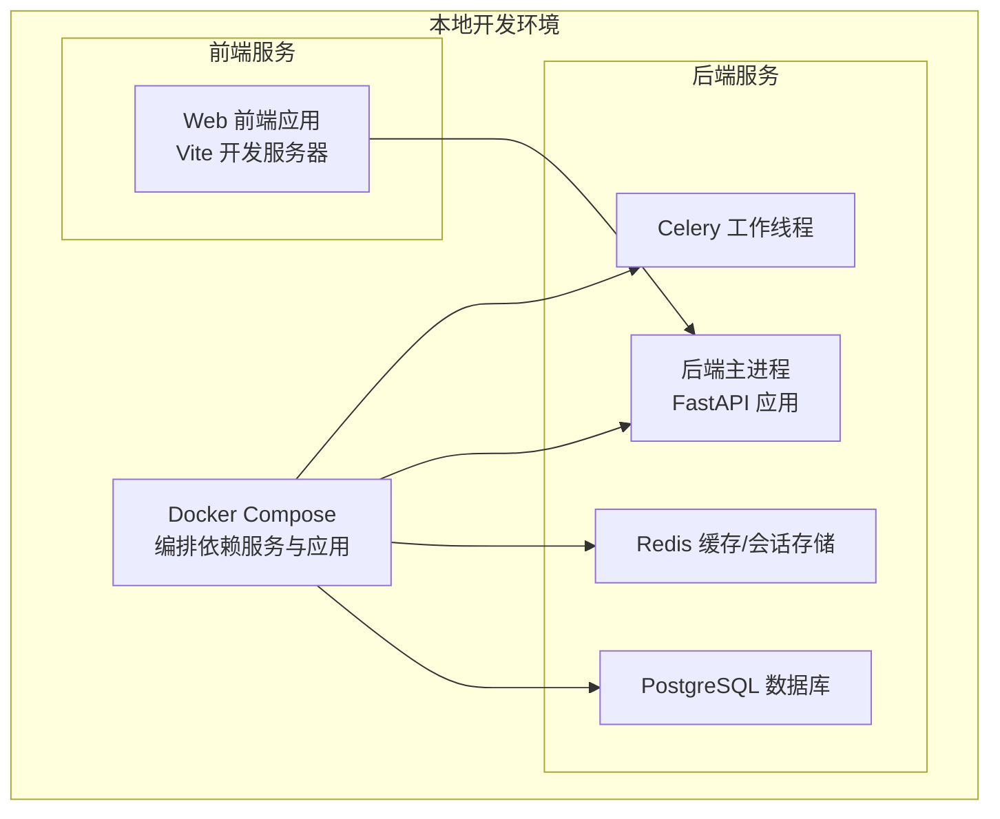
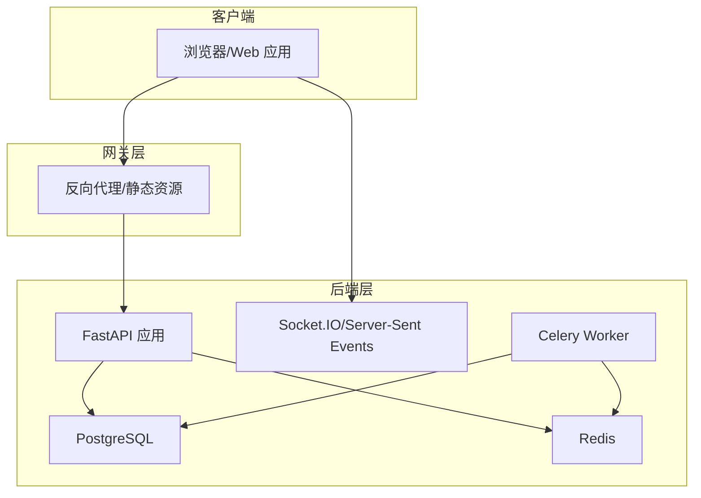
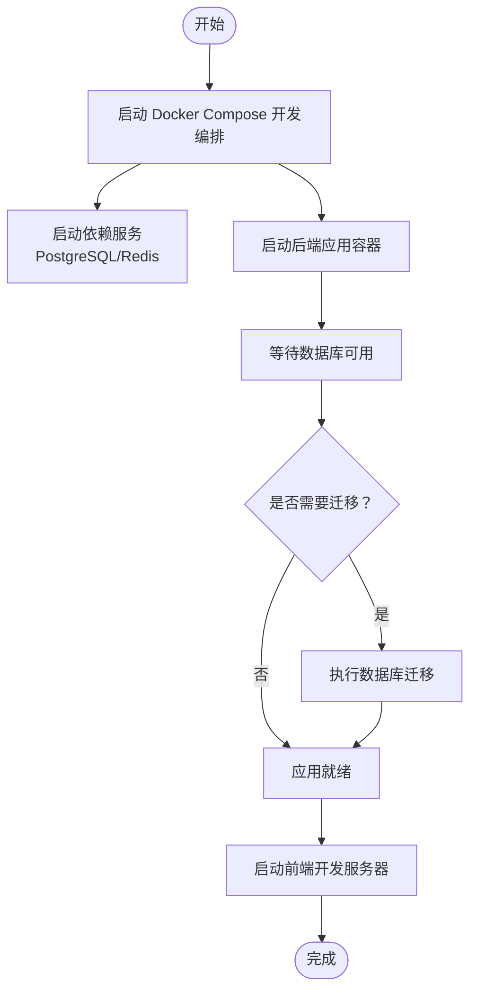
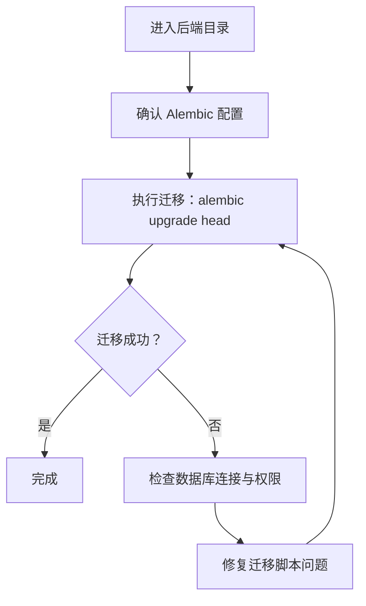
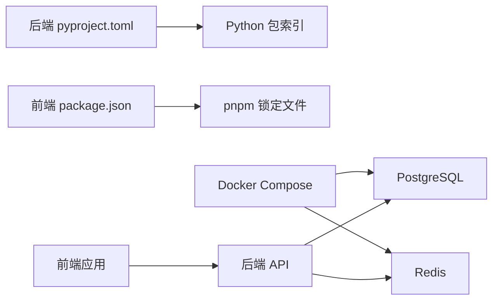

# 快速开始

<cite>
**本文引用的文件**
- [README.md](file://README.md)
- [backend/README.md](file://backend/README.md)
- [docker-compose.dev.yml](file://docker-compose.dev.yml)
- [docker-compose.prod.yml](file://docker-compose.prod.yml)
- [backend/pyproject.toml](file://backend/pyproject.toml)
- [frontend/package.json](file://frontend/package.json)
- [backend/Dockerfile](file://backend/Dockerfile)
- [backend/alembic.ini](file://backend/alembic.ini)
- [backend/migrations/env.py](file://backend/migrations/env.py)
- [backend/main.py](file://backend/main.py)
- [backend/cli.py](file://backend/cli.py)
- [backend/celery_app.py](file://backend/celery_app.py)
- [frontend/apps/web-antd/package.json](file://frontend/apps/web-antd/package.json)
- [frontend/playwright.config.ts](file://frontend/playwright.config.ts)
- [backend/scripts/fresh_install_migrate_test.py](file://backend/scripts/fresh_install_migrate_test.py)
</cite>

## 目录
1. [简介](#简介)
2. [项目结构](#项目结构)
3. [核心组件](#核心组件)
4. [架构总览](#架构总览)
5. [详细组件分析](#详细组件分析)
6. [依赖分析](#依赖分析)
7. [性能考虑](#性能考虑)
8. [故障排除指南](#故障排除指南)
9. [结论](#结论)
10. [附录](#附录)

## 简介
本指南面向新加入的开发者，帮助你在最短时间内完成 NovusAI SaaS 项目的本地开发环境搭建与首次运行。你将获得从系统要求、依赖安装、数据库与缓存服务配置、Docker 开发环境启动到后端与前端应用运行的完整步骤；同时包含默认访问地址与端口、初始管理员账号创建流程、安全配置建议以及常见问题排查方法。

## 项目结构
该项目采用前后端分离架构，后端基于 Python（FastAPI/Falcon 风格）与 PostgreSQL/Redis，前端基于 Vite + TypeScript 的多包工作区（pnpm monorepo）。开发环境通过 Docker Compose 编排依赖服务（PostgreSQL、Redis）与应用容器。

**图表来源**
- [docker-compose.dev.yml](file://docker-compose.dev.yml)
- [backend/main.py](file://backend/main.py)
- [backend/celery_app.py](file://backend/celery_app.py)

**章节来源**
- [README.md](file://README.md)
- [backend/README.md](file://backend/README.md)
- [docker-compose.dev.yml](file://docker-compose.dev.yml)

## 核心组件
- 后端应用：基于 Python 的 Web 服务，提供 REST API、任务队列（Celery）、WebSocket 支持等。
- 数据库：PostgreSQL，使用 Alembic 进行迁移管理。
- 缓存：Redis，用于会话、速率限制、缓存等。
- 前端应用：基于 Vite 的单页应用，提供用户界面与交互。
- 开发编排：Docker Compose 将数据库、缓存与应用容器统一管理。

**章节来源**
- [backend/main.py](file://backend/main.py)
- [backend/celery_app.py](file://backend/celery_app.py)
- [backend/alembic.ini](file://backend/alembic.ini)
- [backend/migrations/env.py](file://backend/migrations/env.py)
- [docker-compose.dev.yml](file://docker-compose.dev.yml)

## 架构总览
下图展示了本地开发时各组件之间的交互关系与数据流向。

**图表来源**
- [backend/main.py](file://backend/main.py)
- [backend/celery_app.py](file://backend/celery_app.py)
- [docker-compose.dev.yml](file://docker-compose.dev.yml)

## 详细组件分析

### 环境准备与系统要求
- Python 3.10+：用于后端开发与脚本执行。
- Node.js 20.19+：用于前端构建与测试。
- pnpm 10+：作为包管理器，统一管理前端 monorepo。
- PostgreSQL：数据库服务，需可连接。
- Redis：缓存与会话存储，需可连接。

提示：请先在本机安装上述软件，并确保 PostgreSQL 与 Redis 可通过默认端口访问。

**章节来源**
- [backend/pyproject.toml](file://backend/pyproject.toml)
- [frontend/package.json](file://frontend/package.json)

### Docker 本地开发环境启动
- 使用开发编排文件启动依赖服务与应用容器：
  - 启动命令：docker compose -f docker-compose.dev.yml up -d
  - 停止命令：docker compose -f docker-compose.dev.yml down
- 容器内后端应用将自动等待数据库可用并执行迁移（如需手动迁移，请参考“数据库迁移”部分）。
- 前端应用通过 Vite 开发服务器提供热重载与调试支持。

**图表来源**
- [docker-compose.dev.yml](file://docker-compose.dev.yml)
- [backend/Dockerfile](file://backend/Dockerfile)

**章节来源**
- [docker-compose.dev.yml](file://docker-compose.dev.yml)
- [backend/Dockerfile](file://backend/Dockerfile)

### 命令行操作指南
以下为常用命令的分步说明（请根据实际目录执行）：

- 创建并激活 Python 虚拟环境（后端）
  - 建议使用 venv 或 pyenv 创建隔离环境
  - 激活虚拟环境后安装依赖：pip install -r requirements.txt（如存在）
  - 或使用项目后端的包管理配置进行安装（参考后端 pyproject.toml）

- 安装前端依赖
  - 在项目根目录执行：pnpm install
  - 如需清理缓存或锁文件问题，可删除 pnpm-lock.yaml 并重新安装

- 数据库迁移
  - 使用 Alembic 执行迁移：alembic upgrade head
  - 若迁移失败，检查数据库连接字符串与权限
  - 可参考迁移配置文件位置：backend/alembic.ini 与 backend/migrations/env.py

- 启动后端应用
  - 方式一：直接运行后端入口文件（FastAPI 主程序）
  - 方式二：通过 Docker Compose 启动（见“Docker 本地开发环境启动”）

- 启动前端应用
  - 在 frontend 目录下执行：pnpm dev
  - 默认开发端口可在前端 package.json 中查看（通常为 5173）

- 启动 Celery 工作线程（如需后台任务）
  - 在后端目录执行：celery -A celery_app worker --loglevel=info

**章节来源**
- [backend/pyproject.toml](file://backend/pyproject.toml)
- [frontend/package.json](file://frontend/package.json)
- [backend/alembic.ini](file://backend/alembic.ini)
- [backend/migrations/env.py](file://backend/migrations/env.py)
- [backend/main.py](file://backend/main.py)
- [backend/celery_app.py](file://backend/celery_app.py)

### 默认访问地址与端口配置
- 后端 API（开发模式）：http://localhost:8000
- 前端应用（开发模式）：http://localhost:5173
- PostgreSQL：默认端口 5432
- Redis：默认端口 6379
- 生产编排文件中可能包含额外服务（如反向代理），请参考 docker-compose.prod.yml

注意：以上端口为常见默认值，具体以你的 Docker 环境映射为准。若端口冲突，请在 docker-compose 文件中调整映射。

**章节来源**
- [docker-compose.dev.yml](file://docker-compose.dev.yml)
- [docker-compose.prod.yml](file://docker-compose.prod.yml)
- [frontend/apps/web-antd/package.json](file://frontend/apps/web-antd/package.json)

### 初始管理员账号创建与安全配置
- 初次运行后端应用时，可通过内置脚本或 CLI 命令创建初始管理员账号（例如：python -m backend.cli create-admin）。
- 建议立即修改默认密码并启用强密码策略。
- 生产部署前务必：
  - 配置 HTTPS 与安全头（如 X-Frame-Options、Content-Security-Policy）
  - 限制源站域名与跨域策略
  - 为数据库与 Redis 设置强口令与网络访问控制
  - 启用审计日志与操作追踪

提示：更多 CLI 命令与功能可通过后端 CLI 入口查看。

**章节来源**
- [backend/cli.py](file://backend/cli.py)
- [backend/scripts/fresh_install_migrate_test.py](file://backend/scripts/fresh_install_migrate_test.py)

### 数据库迁移流程
- 使用 Alembic 执行迁移：alembic upgrade head
- 如需回滚，可使用：alembic downgrade -1
- 迁移配置位于 backend/alembic.ini 与 backend/migrations/env.py
- 若迁移失败，检查数据库连接字符串、权限与版本状态

**图表来源**
- [backend/alembic.ini](file://backend/alembic.ini)
- [backend/migrations/env.py](file://backend/migrations/env.py)

**章节来源**
- [backend/alembic.ini](file://backend/alembic.ini)
- [backend/migrations/env.py](file://backend/migrations/env.py)

### 前端开发与测试
- 启动开发服务器：在 frontend 目录执行 pnpm dev
- 端到端测试：可使用 Playwright 配置进行自动化测试
- 包管理：统一使用 pnpm，避免与 npm/yarn 混用导致锁定文件冲突

**章节来源**
- [frontend/package.json](file://frontend/package.json)
- [frontend/playwright.config.ts](file://frontend/playwright.config.ts)

## 依赖分析
- 后端依赖管理：通过 pyproject.toml 管理 Python 包与版本约束。
- 前端依赖管理：通过 pnpm 管理 monorepo 内各包的依赖与版本。
- 数据库与缓存：由 Docker Compose 提供，后端通过连接字符串访问。
- 开发工具链：Vite、TypeScript、ESLint、Prettier、Stylelint 等。

**图表来源**
- [backend/pyproject.toml](file://backend/pyproject.toml)
- [frontend/package.json](file://frontend/package.json)
- [docker-compose.dev.yml](file://docker-compose.dev.yml)

**章节来源**
- [backend/pyproject.toml](file://backend/pyproject.toml)
- [frontend/package.json](file://frontend/package.json)
- [docker-compose.dev.yml](file://docker-compose.dev.yml)

## 性能考虑
- 数据库连接池与查询优化：合理设置连接数与超时，避免长事务。
- 缓存命中率：对热点数据使用 Redis 缓存，减少数据库压力。
- 前端资源优化：开启压缩与持久缓存，拆分代码与懒加载。
- 异步任务：使用 Celery 分担耗时任务，避免阻塞主请求线程。
- 监控与指标：集成 Prometheus 与日志采集，持续观察性能瓶颈。

## 故障排除指南
- 数据库无法连接
  - 检查 PostgreSQL 是否启动且监听正确端口
  - 核对连接字符串与凭据
  - 查看 Alembic 迁移日志定位问题
- Redis 连接异常
  - 确认 Redis 服务可用与端口开放
  - 检查后端配置中的 Redis 地址与密码
- 前端页面空白或热更新失效
  - 清理 pnpm 缓存并重新安装依赖
  - 检查 Vite 配置与端口占用
- Docker 启动失败
  - 查看容器日志：docker compose logs -f
  - 确认端口未被占用，必要时调整映射
- 初始管理员账号创建失败
  - 使用后端 CLI 命令重新创建
  - 检查数据库迁移是否已完成

**章节来源**
- [backend/alembic.ini](file://backend/alembic.ini)
- [backend/migrations/env.py](file://backend/migrations/env.py)
- [docker-compose.dev.yml](file://docker-compose.dev.yml)
- [backend/cli.py](file://backend/cli.py)

## 结论
按照本指南完成环境准备与 Docker 启动后，你将拥有可运行的后端 API、数据库与缓存服务，以及可热更新的前端开发环境。建议在本地验证完基本功能后再进行生产部署前的安全加固与性能优化。

## 附录
- 快速命令清单（示例）
  - 启动开发环境：docker compose -f docker-compose.dev.yml up -d
  - 停止开发环境：docker compose -f docker-compose.dev.yml down
  - 后端迁移：alembic upgrade head
  - 前端启动：pnpm dev
  - Celery 工作线程：celery -A celery_app worker --loglevel=info