# 技术栈

<cite>
**本文引用的文件**
- [backend/pyproject.toml](file://backend/pyproject.toml)
- [backend/alembic.ini](file://backend/alembic.ini)
- [backend/Dockerfile](file://backend/Dockerfile)
- [docker-compose.dev.yml](file://docker-compose.dev.yml)
- [docker-compose.prod.yml](file://docker-compose.prod.yml)
- [frontend/apps/web-antd/package.json](file://frontend/apps/web-antd/package.json)
- [frontend/package.json](file://frontend/package.json)
- [frontend/turbo.json](file://frontend/turbo.json)
- [frontend/eslint.config.mjs](file://frontend/eslint.config.mjs)
- [frontend/stylelint.config.mjs](file://frontend/stylelint.config.mjs)
- [frontend/.prettierrc.mjs](file://frontend/.prettierrc.mjs)
- [frontend/vitest.config.ts](file://frontend/vitest.config.ts)
- [backend/main.py](file://backend/app/main.py)
- [backend/celery_app.py](file://backend/app/celery_app.py)
- [backend/core/socketio_server.py](file://backend/app/core/socketio_server.py)
- [backend/core/database.py](file://backend/app/core/database.py)
- [backend/core/redis.py](file://backend/app/core/redis.py)
- [backend/migrations/env.py](file://backend/migrations/env.py)
- [backend/tasks/scheduler.py](file://backend/app/tasks/scheduler.py)
- [backend/sio/ws_config.py](file://backend/app/sio/ws_config.py)
- [backend/api/v1/__init__.py](file://backend/app/api/v1/__init__.py)
- [backend/core/i18n.py](file://backend/app/core/i18n.py)
- [backend/locales/en/translation.json](file://backend/app/locales/en/translation.json)
- [backend/locales/zh_CN/translation.json](file://backend/app/locales/zh_CN/translation.json)
- [frontend/src/router/index.ts](file://frontend/apps/web-antd/src/router/index.ts)
- [frontend/src/main.ts](file://frontend/apps/web-antd/src/main.ts)
- [frontend/src/settings.ts](file://frontend/apps/web-antd/src/settings.ts)
- [frontend/packages/@core/base/shared/src/index.ts](file://frontend/packages/@core/base/shared/src/index.ts)
- [frontend/packages/@core/composables/src/index.ts](file://frontend/packages/@core/composables/src/index.ts)
- [frontend/internal/vite-config/package.json](file://frontend/internal/vite-config/package.json)
- [frontend/internal/lint-configs/eslint-config/package.json](file://frontend/internal/lint-configs/eslint-config/package.json)
- [frontend/internal/lint-configs/stylelint-config/package.json](file://frontend/internal/lint-configs/stylelint-config/package.json)
- [frontend/internal/lint-configs/prettier-config/package.json](file://frontend/internal/lint-configs/prettier-config/package.json)
- [frontend/internal/tsconfig/package.json](file://frontend/internal/tsconfig/package.json)
- [frontend/internal/tailwind-config/package.json](file://frontend/internal/tailwind-config/package.json)
- [frontend/playground/src/main.ts](file://frontend/playground/src/main.ts)
- [backend/cli.py](file://backend/app/cli.py)
- [backend/cli_commands/entrypoint.py](file://backend/app/cli_commands/entrypoint.py)
- [backend/codegen/generator.py](file://backend/app/codegen/generator.py)
- [backend/codegen/templates/README.md](file://backend/app/codegen/templates/README.md)
- [backend/plugins/marketplace_registry/registry.py](file://backend/app/plugins/marketplace_registry/registry.py)
- [backend/plugins/manifest.py](file://backend/app/plugins/manifest.py)
- [backend/plugins/runtime_registration.py](file://backend/app/plugins/runtime_registration.py)
- [backend/plugins/event_bus.py](file://backend/app/plugins/event_bus.py)
- [backend/plugins/api_dispatcher.py](file://backend/app/plugins/api_dispatcher.py)
- [backend/plugins/asset_runtime.py](file://backend/app/plugins/asset_runtime.py)
- [backend/plugins/webhook_dispatcher.py](file://backend/app/plugins/webhook_dispatcher.py)
- [backend/plugins/scheduler_refresh.py](file://backend/app/plugins/scheduler_refresh.py)
- [backend/plugins/system_hooks.py](file://backend/app/plugins/system_hooks.py)
- [backend/plugins/license.py](file://backend/app/plugins/license.py)
- [backend/plugins/version_manager.py](file://backend/app/plugins/version_manager.py)
- [backend/plugins/update_checker.py](file://backend/app/plugins/update_checker.py)
- [backend/plugins/preview.py](file://backend/app/plugins/preview.py)
- [backend/plugins/health.py](file://backend/app/plugins/health.py)
- [backend/plugins/crypto.py](file://backend/app/plugins/crypto.py)
- [backend/plugins/security.py](file://backend/app/plugins/security.py)
- [backend/plugins/backup.py](file://backend/app/plugins/backup.py)
- [backend/plugins/startup.py](file://backend/app/plugins/startup.py)
- [backend/plugins/loader.py](file://backend/app/plugins/loader.py)
- [backend/plugins/context.py](file://backend/app/plugins/context.py)
- [backend/plugins/context_factory.py](file://backend/app/plugins/context_factory.py)
- [backend/plugins/context_primitives.py](file://backend/app/plugins/context_primitives.py)
- [backend/plugins/exposure_policy.py](file://backend/app/plugins/exposure_policy.py)
- [backend/plugins/feature_entitlement_guards.py](file://backend/app/plugins/feature_entitlement_guards.py)
- [backend/plugins/tenant_plan_preflight.py](file://backend/app/plugins/tenant_plan_preflight.py)
- [backend/plugins/migration_paths.py](file://backend/app/plugins/migration_paths.py)
- [backend/plugins/module_loader.py](file://backend/app/plugins/module_loader.py)
</cite>

## 目录
1. [引言](#引言)
2. [项目结构](#项目结构)
3. [核心组件](#核心组件)
4. [架构总览](#架构总览)
5. [详细组件分析](#详细组件分析)
6. [依赖关系分析](#依赖关系分析)
7. [性能考量](#性能考量)
8. [故障排查指南](#故障排查指南)
9. [结论](#结论)
10. [附录](#附录)

## 引言
本文件面向NovusAI SaaS项目的开发者与架构师，系统性梳理并说明后端与前端技术栈、工程化工具链、数据库与缓存、以及容器化部署方案。文档以仓库中现有实现为依据，结合各模块职责与配置文件，给出技术选型的合理性说明，并提供替代方案对比，帮助读者快速理解并高效迭代。

## 项目结构
项目采用前后端分离架构，后端位于backend目录，前端位于frontend目录，二者通过REST API与消息推送（Socket.IO）交互；数据库迁移由Alembic管理，容器化通过Docker与Compose编排。

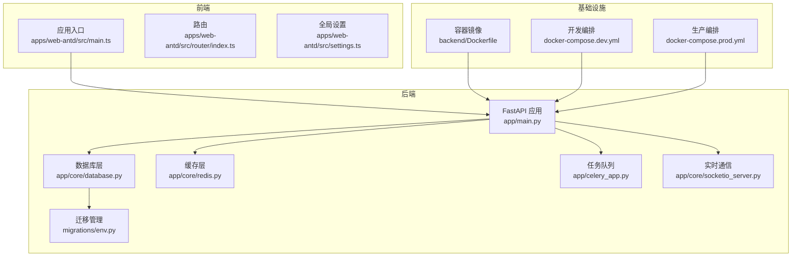

图示来源
- [backend/app/main.py](file://backend/app/main.py)
- [backend/app/core/database.py](file://backend/app/core/database.py)
- [backend/app/core/redis.py](file://backend/app/core/redis.py)
- [backend/app/celery_app.py](file://backend/app/celery_app.py)
- [backend/app/core/socketio_server.py](file://backend/app/core/socketio_server.py)
- [backend/migrations/env.py](file://backend/migrations/env.py)
- [frontend/apps/web-antd/src/main.ts](file://frontend/apps/web-antd/src/main.ts)
- [frontend/apps/web-antd/src/router/index.ts](file://frontend/apps/web-antd/src/router/index.ts)
- [frontend/apps/web-antd/src/settings.ts](file://frontend/apps/web-antd/src/settings.ts)
- [backend/Dockerfile](file://backend/Dockerfile)
- [docker-compose.dev.yml](file://docker-compose.dev.yml)
- [docker-compose.prod.yml](file://docker-compose.prod.yml)

章节来源
- [backend/app/main.py](file://backend/app/main.py)
- [frontend/apps/web-antd/src/main.ts](file://frontend/apps/web-antd/src/main.ts)

## 核心组件
- 后端技术栈
  - Python 3.10+：后端运行时与包管理器uv均指向该版本，确保类型检查、异步并发与生态兼容性。
  - FastAPI：提供高性能、自动生成OpenAPI文档的Web框架，广泛用于API路由与中间件集成。
  - SQLAlchemy 2.x：ORM与查询构建，配合Alembic进行数据库迁移。
  - Alembic：数据库版本控制与迁移脚本生成。
  - Pydantic：数据验证与序列化，贯穿Schema定义与请求响应模型。
  - Celery：分布式任务队列，支持定时任务与后台作业。
  - Socket.IO：实时双向通信，用于通知与状态推送。
  - Redis：缓存与会话存储，提升高并发下的响应速度。
  - PostgreSQL：关系型数据库，承载业务主数据与审计日志。
- 前端技术栈
  - Vue 3 + TypeScript：渐进式前端框架与强类型语言，保障可维护性与开发效率。
  - Vben Admin：企业级中后台前端/设计解决方案，提供丰富的UI组件与布局能力。
  - Ant Design Vue：高质量UI组件库，统一视觉与交互体验。
  - Vite：现代化构建工具，提供快速热更新与打包能力。
  - pnpm：高性能包管理器，减少磁盘占用并加速安装。
  - vue-i18n：国际化方案，结合多语言资源文件实现多语种支持。
- 工程化工具链
  - Ruff：Python代码质量与格式化工具，替代flake8与black。
  - pytest：Python测试框架，覆盖单元与集成测试。
  - ESLint/Stylelint/Prettier：前端代码质量与风格统一。
  - Vitest：前端单元测试与快照测试。
  - Turbo：Monorepo工作流优化，加速构建与测试。
- 数据库与缓存
  - PostgreSQL：主数据库，配合Alembic迁移。
  - Redis：会话、缓存与事件桥接。
- 部署
  - Docker：容器化后端服务。
  - Docker Compose：本地开发与生产环境编排。

章节来源
- [backend/pyproject.toml](file://backend/pyproject.toml)
- [backend/alembic.ini](file://backend/alembic.ini)
- [frontend/package.json](file://frontend/package.json)
- [frontend/turbo.json](file://frontend/turbo.json)
- [frontend/eslint.config.mjs](file://frontend/eslint.config.mjs)
- [frontend/stylelint.config.mjs](file://frontend/stylelint.config.mjs)
- [frontend/.prettierrc.mjs](file://frontend/.prettierrc.mjs)
- [frontend/vitest.config.ts](file://frontend/vitest.config.ts)

## 架构总览
下图展示从浏览器到后端服务、数据库与缓存的整体交互路径，包括同步API调用、异步任务与实时通信。

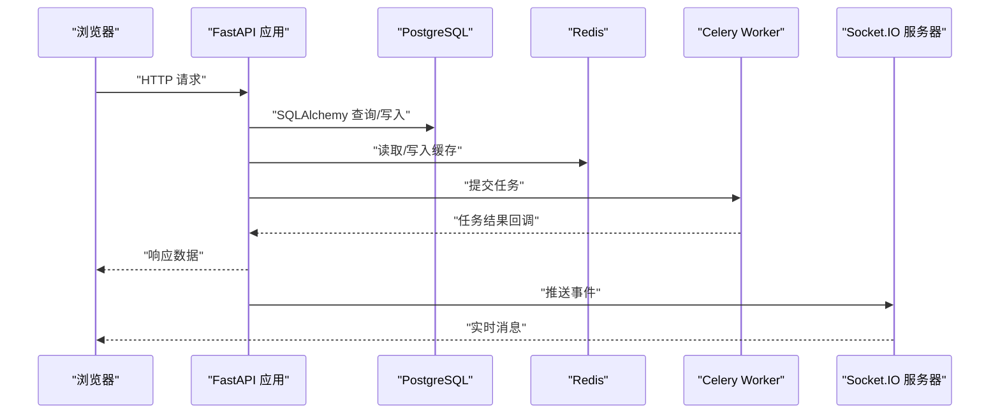

图示来源
- [backend/app/main.py](file://backend/app/main.py)
- [backend/app/core/database.py](file://backend/app/core/database.py)
- [backend/app/core/redis.py](file://backend/app/core/redis.py)
- [backend/app/celery_app.py](file://backend/app/celery_app.py)
- [backend/app/core/socketio_server.py](file://backend/app/core/socketio_server.py)

## 详细组件分析

### 后端框架与路由
- FastAPI应用入口负责注册路由、中间件、异常处理与插件系统；API版本化组织在v1命名空间下，便于演进与向后兼容。
- 典型流程：请求进入路由层，经权限/审计/跨域等中间件处理，调用服务层执行业务逻辑，再通过仓储层访问数据库或缓存，最终返回响应。

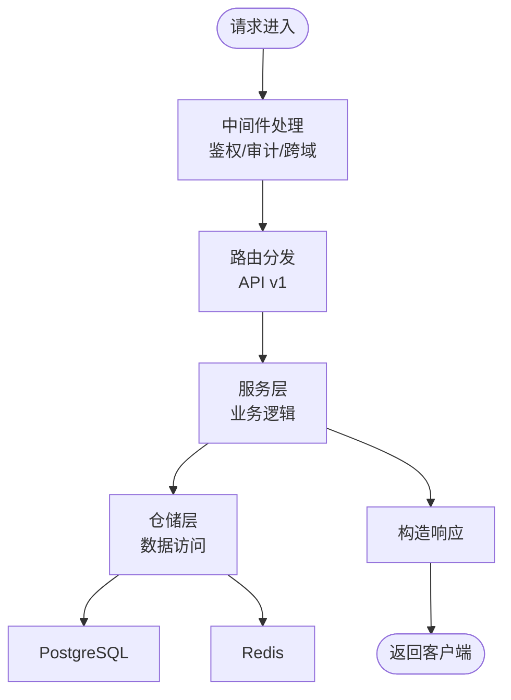

图示来源
- [backend/app/main.py](file://backend/app/main.py)
- [backend/api/v1/__init__.py](file://backend/app/api/v1/__init__.py)

章节来源
- [backend/app/main.py](file://backend/app/main.py)
- [backend/api/v1/__init__.py](file://backend/app/api/v1/__init__.py)

### 数据库与迁移（SQLAlchemy + Alembic）
- SQLAlchemy 2.x作为ORM，提供强类型模型与查询DSL；迁移通过Alembic管理，版本文件位于migrations/versions。
- 迁移环境配置在env.py中，结合数据库连接字符串与目标表元数据生成差异脚本。

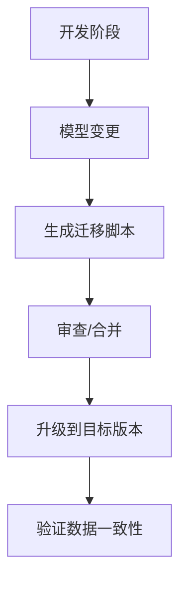

图示来源
- [backend/alembic.ini](file://backend/alembic.ini)
- [backend/migrations/env.py](file://backend/migrations/env.py)

章节来源
- [backend/alembic.ini](file://backend/alembic.ini)
- [backend/migrations/env.py](file://backend/migrations/env.py)

### 缓存与会话（Redis）
- Redis用于会话存储、速率限制、临时数据与事件桥接；与后端服务解耦，提升高并发下的吞吐与延迟表现。
- 连接与配置在core/redis.py中集中管理，供上层服务按需调用。

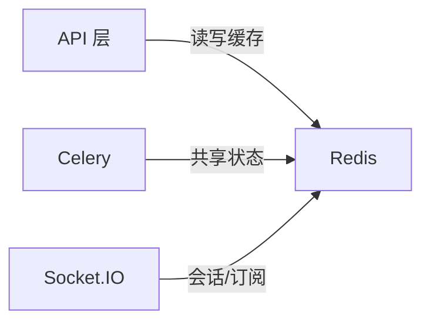

图示来源
- [backend/app/core/redis.py](file://backend/app/core/redis.py)

章节来源
- [backend/app/core/redis.py](file://backend/app/core/redis.py)

### 实时通信（Socket.IO）
- Socket.IO服务器独立于HTTP服务，提供命名空间隔离与事件广播；ws_config.py集中配置连接参数与中间件。
- 适用于通知、状态同步与协作场景。

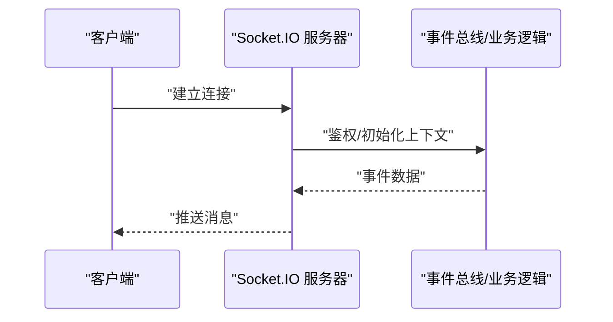

图示来源
- [backend/app/core/socketio_server.py](file://backend/app/core/socketio_server.py)
- [backend/sio/ws_config.py](file://backend/app/sio/ws_config.py)

章节来源
- [backend/app/core/socketio_server.py](file://backend/app/core/socketio_server.py)
- [backend/sio/ws_config.py](file://backend/app/sio/ws_config.py)

### 任务调度与后台作业（Celery）
- Celery应用在celery_app.py中初始化，结合定时任务与周期性任务，通过调度器统一管理。
- 支持失败重试、幂等与结果存储，适合耗时操作与批量处理。

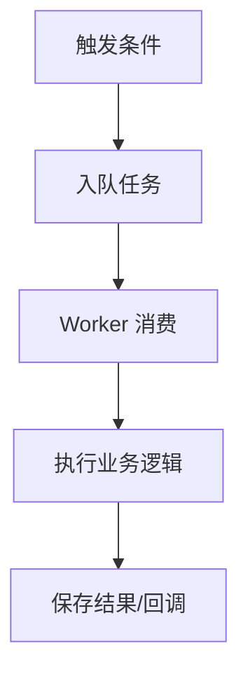

图示来源
- [backend/app/celery_app.py](file://backend/app/celery_app.py)
- [backend/tasks/scheduler.py](file://backend/app/tasks/scheduler.py)

章节来源
- [backend/app/celery_app.py](file://backend/app/celery_app.py)
- [backend/tasks/scheduler.py](file://backend/app/tasks/scheduler.py)

### 国际化（i18n）
- 后端通过core/i18n.py与locales目录提供多语言资源；前端在packages/locales中维护翻译键值。
- 通过中间件与路由层注入语言上下文，实现API与界面的双端一致。

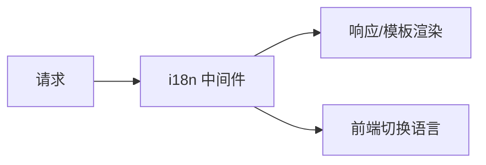

图示来源
- [backend/app/core/i18n.py](file://backend/app/core/i18n.py)
- [backend/app/locales/en/translation.json](file://backend/app/locales/en/translation.json)
- [backend/app/locales/zh_CN/translation.json](file://backend/app/locales/zh_CN/translation.json)

章节来源
- [backend/app/core/i18n.py](file://backend/app/core/i18n.py)
- [backend/app/locales/en/translation.json](file://backend/app/locales/en/translation.json)
- [backend/app/locales/zh_CN/translation.json](file://backend/app/locales/zh_CN/translation.json)

### 前端应用与工程化
- 应用入口在apps/web-antd/src/main.ts，路由在router/index.ts，全局设置在settings.ts；Vben Admin提供主题、布局与权限基础。
- Monorepo通过turbo.json与pnpm工作区组织，内部包如@core/base/shared与composables提供通用能力。
- Lint与格式化配置分别位于eslint.config.mjs、stylelint.config.mjs与.prettierrc.mjs；Vitest用于单元测试。

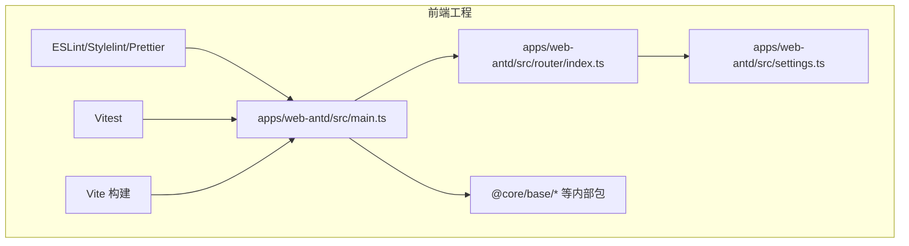

图示来源
- [frontend/apps/web-antd/src/main.ts](file://frontend/apps/web-antd/src/main.ts)
- [frontend/apps/web-antd/src/router/index.ts](file://frontend/apps/web-antd/src/router/index.ts)
- [frontend/apps/web-antd/src/settings.ts](file://frontend/apps/web-antd/src/settings.ts)
- [frontend/packages/@core/base/shared/src/index.ts](file://frontend/packages/@core/base/shared/src/index.ts)
- [frontend/packages/@core/composables/src/index.ts](file://frontend/packages/@core/composables/src/index.ts)
- [frontend/eslint.config.mjs](file://frontend/eslint.config.mjs)
- [frontend/stylelint.config.mjs](file://frontend/stylelint.config.mjs)
- [frontend/.prettierrc.mjs](file://frontend/.prettierrc.mjs)
- [frontend/vitest.config.ts](file://frontend/vitest.config.ts)
- [frontend/turbo.json](file://frontend/turbo.json)

章节来源
- [frontend/apps/web-antd/src/main.ts](file://frontend/apps/web-antd/src/main.ts)
- [frontend/apps/web-antd/src/router/index.ts](file://frontend/apps/web-antd/src/router/index.ts)
- [frontend/apps/web-antd/src/settings.ts](file://frontend/apps/web-antd/src/settings.ts)
- [frontend/packages/@core/base/shared/src/index.ts](file://frontend/packages/@core/base/shared/src/index.ts)
- [frontend/packages/@core/composables/src/index.ts](file://frontend/packages/@core/composables/src/index.ts)
- [frontend/eslint.config.mjs](file://frontend/eslint.config.mjs)
- [frontend/stylelint.config.mjs](file://frontend/stylelint.config.mjs)
- [frontend/.prettierrc.mjs](file://frontend/.prettierrc.mjs)
- [frontend/vitest.config.ts](file://frontend/vitest.config.ts)
- [frontend/turbo.json](file://frontend/turbo.json)

### 插件系统与扩展
- 插件体系包含生命周期管理、清单解析、资产运行时、事件总线、API分发、许可证与版本管理等模块，支持市场注册中心与动态加载。
- 通过模块加载器与上下文工厂，实现插件沙箱与安全边界。

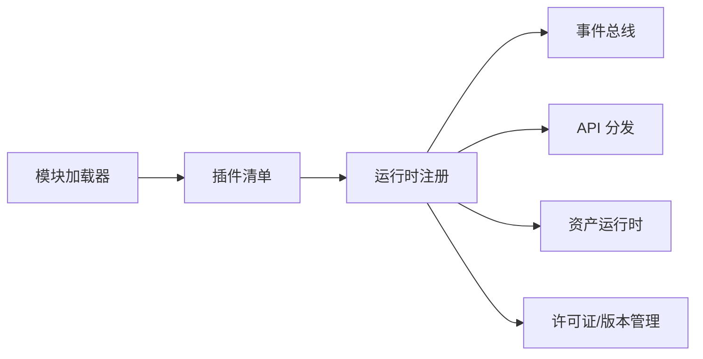

图示来源
- [backend/app/plugins/loader.py](file://backend/app/plugins/loader.py)
- [backend/app/plugins/manifest.py](file://backend/app/plugins/manifest.py)
- [backend/app/plugins/runtime_registration.py](file://backend/app/plugins/runtime_registration.py)
- [backend/app/plugins/event_bus.py](file://backend/app/plugins/event_bus.py)
- [backend/app/plugins/api_dispatcher.py](file://backend/app/plugins/api_dispatcher.py)
- [backend/app/plugins/asset_runtime.py](file://backend/app/plugins/asset_runtime.py)
- [backend/app/plugins/license.py](file://backend/app/plugins/license.py)
- [backend/app/plugins/version_manager.py](file://backend/app/plugins/version_manager.py)

章节来源
- [backend/app/plugins/loader.py](file://backend/app/plugins/loader.py)
- [backend/app/plugins/manifest.py](file://backend/app/plugins/manifest.py)
- [backend/app/plugins/runtime_registration.py](file://backend/app/plugins/runtime_registration.py)
- [backend/app/plugins/event_bus.py](file://backend/app/plugins/event_bus.py)
- [backend/app/plugins/api_dispatcher.py](file://backend/app/plugins/api_dispatcher.py)
- [backend/app/plugins/asset_runtime.py](file://backend/app/plugins/asset_runtime.py)
- [backend/app/plugins/license.py](file://backend/app/plugins/license.py)
- [backend/app/plugins/version_manager.py](file://backend/app/plugins/version_manager.py)

### CLI与代码生成
- CLI入口在cli.py与cli_commands/entrypoint.py，提供健康检查、状态查看、AI相关命令等；codegen子系统支持模板化生成与输出装配。

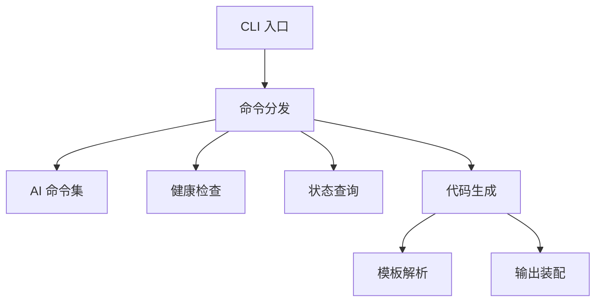

图示来源
- [backend/app/cli.py](file://backend/app/cli.py)
- [backend/app/cli_commands/entrypoint.py](file://backend/app/cli_commands/entrypoint.py)
- [backend/app/codegen/generator.py](file://backend/app/codegen/generator.py)
- [backend/app/codegen/templates/README.md](file://backend/app/codegen/templates/README.md)

章节来源
- [backend/app/cli.py](file://backend/app/cli.py)
- [backend/app/cli_commands/entrypoint.py](file://backend/app/cli_commands/entrypoint.py)
- [backend/app/codegen/generator.py](file://backend/app/codegen/generator.py)
- [backend/app/codegen/templates/README.md](file://backend/app/codegen/templates/README.md)

## 依赖关系分析
- 后端依赖
  - FastAPI依赖中间件、路由、服务与仓储层；数据库与缓存通过核心模块注入；任务与实时通信作为横切关注点。
  - 插件系统与CLI/代码生成功能作为扩展能力，不改变核心路径。
- 前端依赖
  - 应用入口依赖路由与设置；Vben Admin与Ant Design Vue提供UI基础；Monorepo内部包提供复用能力。
  - Lint与测试工具贯穿开发流程，保证质量与一致性。

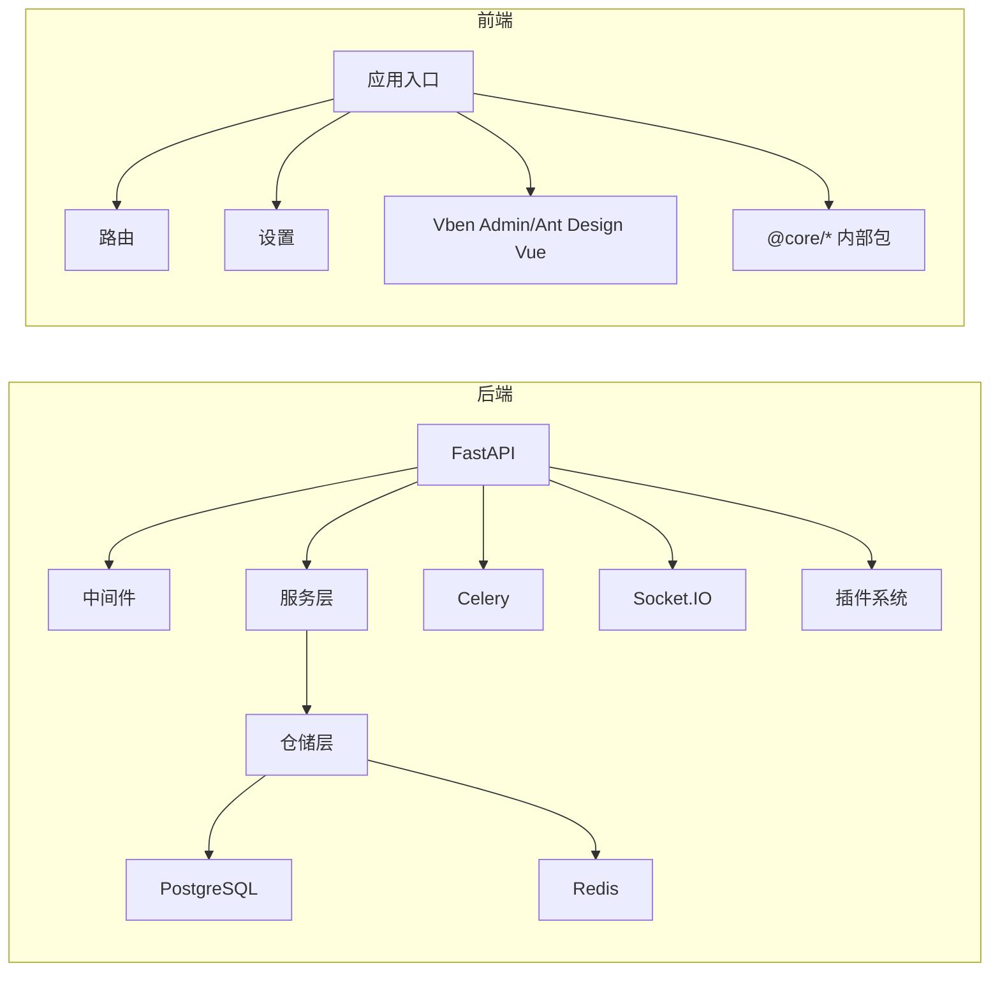

图示来源
- [backend/app/main.py](file://backend/app/main.py)
- [backend/app/core/database.py](file://backend/app/core/database.py)
- [backend/app/core/redis.py](file://backend/app/core/redis.py)
- [backend/app/celery_app.py](file://backend/app/celery_app.py)
- [backend/app/core/socketio_server.py](file://backend/app/core/socketio_server.py)
- [frontend/apps/web-antd/src/main.ts](file://frontend/apps/web-antd/src/main.ts)
- [frontend/apps/web-antd/src/router/index.ts](file://frontend/apps/web-antd/src/router/index.ts)
- [frontend/apps/web-antd/src/settings.ts](file://frontend/apps/web-antd/src/settings.ts)

章节来源
- [backend/app/main.py](file://backend/app/main.py)
- [frontend/apps/web-antd/src/main.ts](file://frontend/apps/web-antd/src/main.ts)

## 性能考量
- 并发与异步：FastAPI基于Starlette，支持异步I/O；建议在I/O密集型接口（文件上传、外部API调用）充分利用异步特性。
- 数据库：合理使用索引与查询优化；对热点数据使用Redis缓存；避免N+1查询，优先使用联结与预加载。
- 任务队列：将耗时任务放入Celery，避免阻塞主线程；为重试与幂等设计提供容错能力。
- 实时通信：命名空间与房间管理应避免过度广播；对长连接进行心跳与断线重连策略。
- 前端：Vite提供快速热更新；组件按需引入Ant Design Vue以减少包体积；Monorepo中内部包按需导入，避免循环依赖。

## 故障排查指南
- 数据库连接失败
  - 检查数据库连接字符串与凭据；确认容器网络与端口映射；核对迁移是否完成。
  - 参考：[backend/migrations/env.py](file://backend/migrations/env.py)
- Redis不可用
  - 核对Redis连接配置与网络可达性；检查键空间与过期策略。
  - 参考：[backend/app/core/redis.py](file://backend/app/core/redis.py)
- 任务未执行
  - 检查Celery worker是否启动；确认broker与backend配置；查看任务日志与重试策略。
  - 参考：[backend/app/celery_app.py](file://backend/app/celery_app.py)
- 实时消息未达
  - 检查Socket.IO命名空间与认证；确认客户端重连机制；查看服务器日志。
  - 参考：[backend/app/core/socketio_server.py](file://backend/app/core/socketio_server.py)
- 前端页面空白或样式异常
  - 清理缓存与node_modules；检查Vite构建日志；确认Tailwind与Prettier配置。
  - 参考：[frontend/apps/web-antd/src/main.ts](file://frontend/apps/web-antd/src/main.ts)，[frontend/turbo.json](file://frontend/turbo.json)

章节来源
- [backend/migrations/env.py](file://backend/migrations/env.py)
- [backend/app/core/redis.py](file://backend/app/core/redis.py)
- [backend/app/celery_app.py](file://backend/app/celery_app.py)
- [backend/app/core/socketio_server.py](file://backend/app/core/socketio_server.py)
- [frontend/apps/web-antd/src/main.ts](file://frontend/apps/web-antd/src/main.ts)
- [frontend/turbo.json](file://frontend/turbo.json)

## 结论
本项目采用成熟且互补的技术栈：后端以FastAPI为核心，结合SQLAlchemy/Alembic、Redis与Celery，形成高可用、可扩展的服务架构；前端以Vue 3与Vben Admin为基础，辅以完善的工程化工具链，保障开发效率与交付质量。容器化与编排方案为本地开发与生产部署提供了稳定支撑。整体架构在可维护性、性能与扩展性之间取得良好平衡。

## 附录
- 技术选型与替代方案对比（概念性说明）
  - Python 3.10+ vs 更低版本：更高版本带来更好的类型系统与性能；替代方案如3.9需评估兼容性。
  - FastAPI vs Django：前者更适合API优先与自动生成文档；后者更适合全栈一体化。
  - SQLAlchemy 2.x vs Tortoise ORM：前者生态成熟、性能更优；后者异步友好但生态相对较小。
  - Alembic vs Django Migrations：前者灵活可控、版本管理清晰；后者开箱即用。
  - Celery vs RQ：前者功能丰富、支持多种Broker；后者轻量易用。
  - Socket.IO vs WebSocket：前者提供房间、命名空间与自动重连；后者需要自行实现。
  - PostgreSQL vs MySQL：前者功能更强、扩展性更好；后者部署简单。
  - Redis vs Memcached：前者功能更丰富（列表/集合/有序集）；后者更轻量。
  - Vue 3 + Vben Admin vs React + Ant Design Pro：前者学习曲线平缓、生态完善；后者组件库更丰富。
  - Vite vs Webpack：前者冷启更快、生态活跃；后者生态成熟。
  - pnpm vs npm/yarn：前者安装更快、磁盘占用更小。
  - ESLint/Stylelint/Prettier vs 其他组合：三者组合在前端质量保障方面成熟稳定。
  - Vitest vs Jest：前者原生Vite生态、启动更快；后者生态更广。
  - Turbo vs Lerna：前者针对Vite与Monorepo优化；后者历史更悠久。