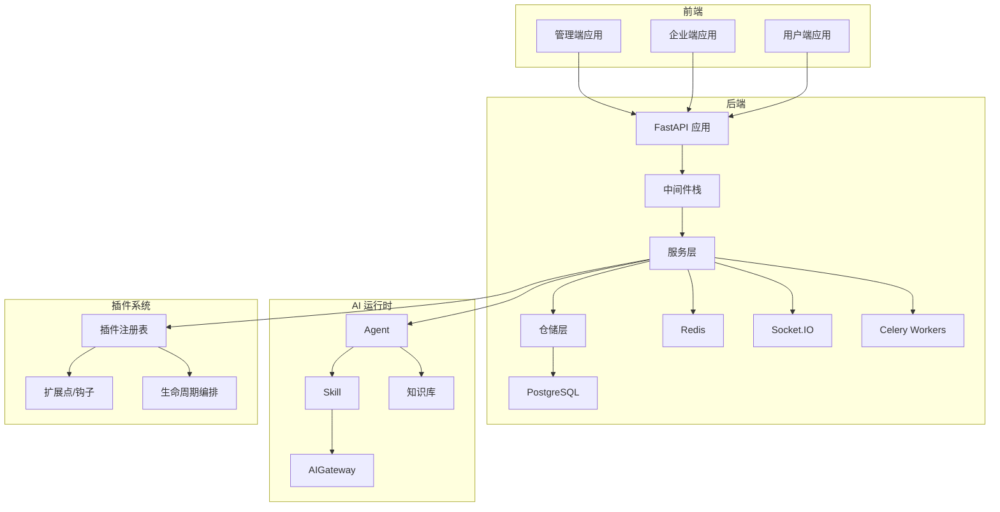
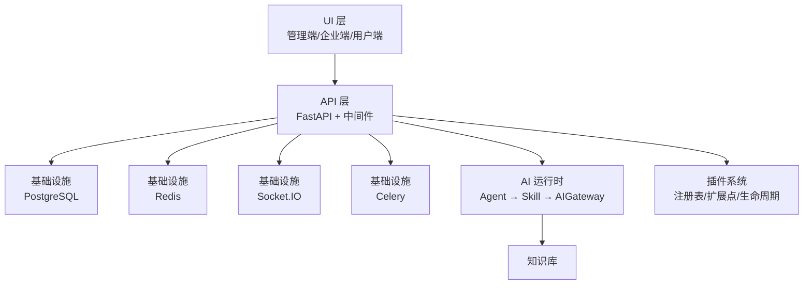
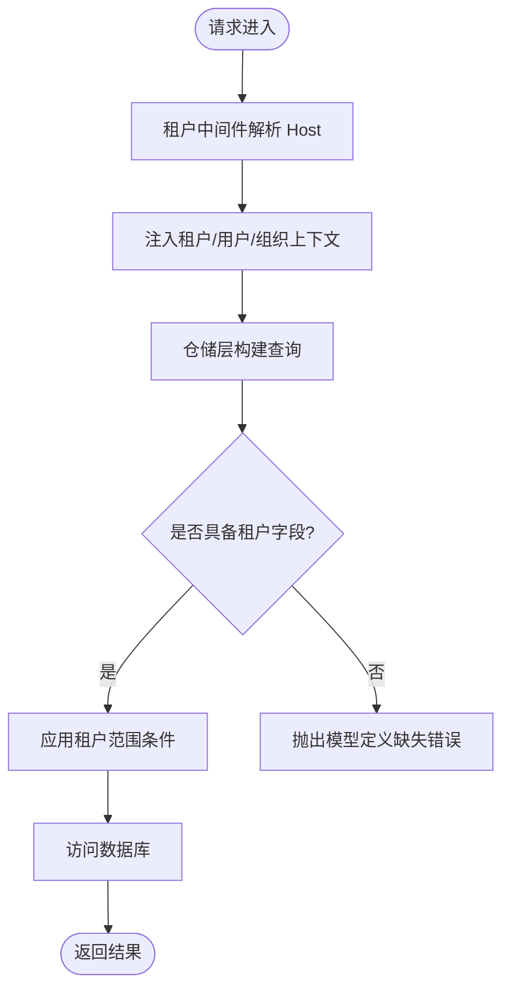
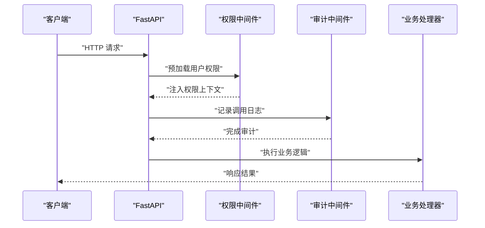
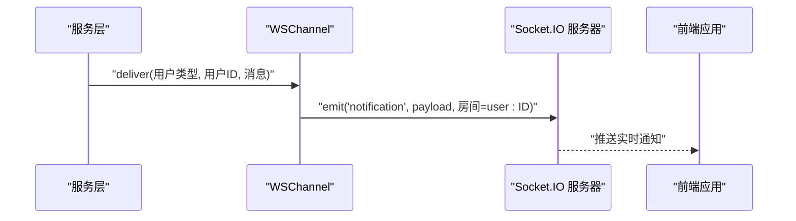
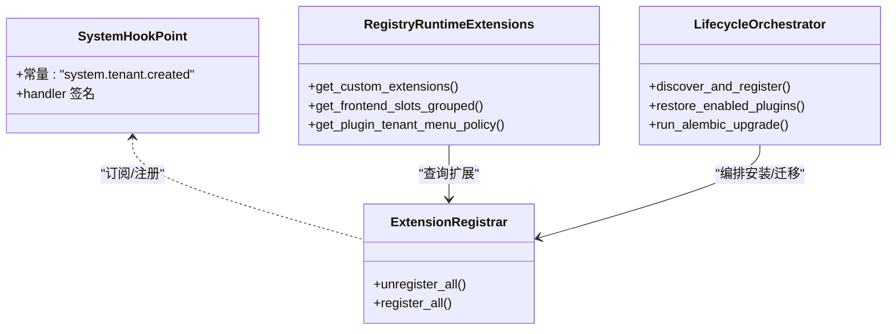
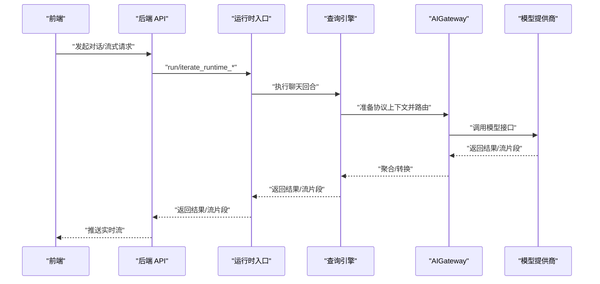
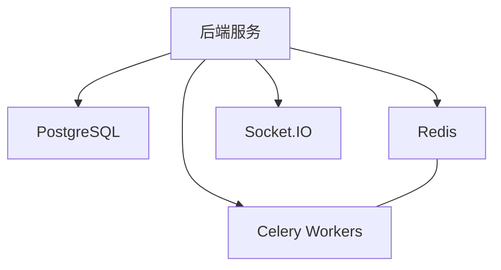
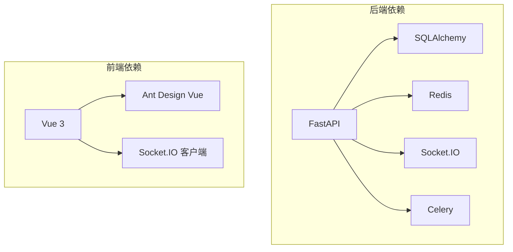

# 架构概览

<cite>
**本文引用的文件**
- [README.md](file://README.md)
- [main.py](file://backend/app/main.py)
- [package.json](file://frontend/apps/web-antd/package.json)
- [pyproject.toml](file://backend/pyproject.toml)
- [tenant_scope.py](file://backend/app/core/repository_parts/tenant_scope.py)
- [data_permission.py](file://backend/app/core/data_permission.py)
- [permission.py](file://backend/app/middleware/permission.py)
- [ws_channel.py](file://backend/app/services/common/channels/ws_channel.py)
- [sio_bridge.py](file://backend/app/core/sio_bridge.py)
- [context.py](file://backend/app/plugins/context.py)
- [database.py](file://backend/app/core/database.py)
- [failover_orchestrator.py](file://backend/app/ai/gateway_support/failover_orchestrator.py)
- [conversation_runtime_entrypoint_runner.py](file://backend/app/ai/engine/conversation_runtime_entrypoint_runner.py)
- [types.py](file://backend/app/ai/engine/types.py)
- [protocol_runtime_context.py](file://backend/app/ai/adapters/openai_compatible/protocol_runtime_context.py)
- [system_hooks.py](file://backend/app/plugins/system_hooks.py)
- [registry_runtime_extensions.py](file://backend/app/plugins/registry_runtime_extensions.py)
- [_extension_registrar.py](file://backend/app/plugins/_extension_registrar.py)
- [registry.py](file://backend/app/plugins/registry.py)
- [lifecycle_orchestrator.py](file://backend/app/plugins/lifecycle_orchestrator.py)
</cite>

## 目录
1. [简介](#简介)
2. [项目结构](#项目结构)
3. [核心组件](#核心组件)
4. [架构总览](#架构总览)
5. [详细组件分析](#详细组件分析)
6. [依赖关系分析](#依赖关系分析)
7. [性能考量](#性能考量)
8. [故障排查指南](#故障排查指南)
9. [结论](#结论)
10. [附录](#附录)

## 简介
本项目是一个面向二次开发的多租户 AI SaaS 开发框架，提供平台管理端、企业端、用户端、权限体系、插件系统、AI Agent 运行链路、实时通知、附件存储、代码生成与数据库迁移等基础能力。后端采用 FastAPI + SQLAlchemy + Celery + Redis + Socket.IO，前端采用 Vue 3 + TypeScript + Ant Design Vue + Vite，整体遵循前后端分离与多租户隔离的设计理念。

## 项目结构
- 后端 backend：包含 API、服务、模型、仓储、AI、RBAC、任务、存储、插件系统、中间件、配置与迁移等模块。
- 前端 frontend：采用 pnpm monorepo，包含主 Web 应用与共享包。
- 文档 docs：包含品牌素材与指南。
- docker-compose.*：提供本地开发与生产编排参考。

**图表来源**
- [README.md:48-87](file://README.md#L48-L87)
- [main.py:635-800](file://backend/app/main.py#L635-L800)
- [ws_channel.py:20-87](file://backend/app/services/common/channels/ws_channel.py#L20-L87)

**章节来源**
- [README.md:99-119](file://README.md#L99-L119)

## 核心组件
- 前端应用：基于 Vue 3 + Vben Admin + Ant Design Vue，提供管理端、企业端、用户端三类应用，路由与权限命名空间相互隔离。
- 后端服务：FastAPI 应用，内置国际化、动态 CORS、权限预加载、审计日志、访问控制、租户识别、指标与健康检查等中间件。
- 多租户与权限：通过中间件注入租户上下文，仓储层提供租户范围混入，数据权限过滤器实现组织边界与可见性控制。
- 插件系统：支持后端插件、前端插件入口、菜单、资源、生命周期与扩展点，提供钩子常量与运行时扩展查询能力。
- AI 运行时：Agent → Skill → AIGateway 的链路，支持流式对话、协议执行上下文、故障转移编排与运行时类型约束。
- 基础设施：PostgreSQL（Alembic 迁移）、Redis（缓存/分布式锁/指标）、Celery（异步任务）、Socket.IO（实时通知）。

**章节来源**
- [README.md:31-45](file://README.md#L31-L45)
- [main.py:635-800](file://backend/app/main.py#L635-L800)
- [tenant_scope.py:17-40](file://backend/app/core/repository_parts/tenant_scope.py#L17-L40)
- [data_permission.py:125-456](file://backend/app/core/data_permission.py#L125-L456)
- [permission.py:254-271](file://backend/app/middleware/permission.py#L254-L271)
- [ws_channel.py:20-87](file://backend/app/services/common/channels/ws_channel.py#L20-L87)
- [system_hooks.py:29-31](file://backend/app/plugins/system_hooks.py#L29-L31)
- [registry_runtime_extensions.py:242-252](file://backend/app/plugins/registry_runtime_extensions.py#L242-L252)
- [conversation_runtime_entrypoint_runner.py:37-76](file://backend/app/ai/engine/conversation_runtime_entrypoint_runner.py#L37-L76)
- [failover_orchestrator.py:25-32](file://backend/app/ai/gateway_support/failover_orchestrator.py#L25-L32)

## 架构总览
系统采用前后端分离与多租户隔离的分层架构：
- UI 层：三端应用通过 REST 与 Socket.IO 与后端交互。
- API 层：FastAPI 提供路由、中间件、异常处理与健康检查；仓储层负责租户隔离与数据权限过滤。
- AI 运行时：Agent 调度 Skill，经由 AIGateway 访问模型提供商，支持流式输出与协议上下文。
- 插件系统：通过注册表与生命周期编排，实现后端扩展点与前端插槽的统一治理。
- 基础设施：数据库、缓存、消息队列与实时通信服务贯穿各层。

**图表来源**
- [README.md:48-87](file://README.md#L48-L87)
- [main.py:635-800](file://backend/app/main.py#L635-L800)
- [ws_channel.py:20-87](file://backend/app/services/common/channels/ws_channel.py#L20-L87)

## 详细组件分析

### 多租户与数据隔离
- 租户识别：通过中间件解析 Host 头并注入租户上下文，后续仓储层根据模型字段（如 owner_tenant_id、tenant_id）进行范围限定。
- 数据权限：在创建/查询时自动填充创建人与组织节点，结合权限域计算可见范围，确保跨租户与跨部门数据隔离。
- 仓储混入：TenantScopeMixin 提供读写与批量操作的租户范围条件构建，避免越权访问。

**图表来源**
- [permission.py:254-271](file://backend/app/middleware/permission.py#L254-L271)
- [tenant_scope.py:17-40](file://backend/app/core/repository_parts/tenant_scope.py#L17-L40)
- [data_permission.py:125-456](file://backend/app/core/data_permission.py#L125-L456)

**章节来源**
- [permission.py:254-271](file://backend/app/middleware/permission.py#L254-L271)
- [tenant_scope.py:17-40](file://backend/app/core/repository_parts/tenant_scope.py#L17-L40)
- [data_permission.py:125-456](file://backend/app/core/data_permission.py#L125-L456)

### 权限控制与审计
- 权限预加载：在中间件中加载用户权限到请求上下文，供后续校验与菜单渲染使用。
- 审计日志：记录所有 API 调用，便于合规与问题追踪。
- 访问控制：默认拒绝策略，严格限制未授权访问。

**图表来源**
- [main.py:650-702](file://backend/app/main.py#L650-L702)
- [main.py:705-799](file://backend/app/main.py#L705-L799)

**章节来源**
- [main.py:650-702](file://backend/app/main.py#L650-L702)
- [main.py:705-799](file://backend/app/main.py#L705-L799)

### 实时通知与通信
- WebSocket 渠道：通过 Socket.IO 将通知推送到指定用户房间，按用户类型选择命名空间。
- 同步桥接：在非异步环境中提供同步通知桥接，支持强制下线等事件广播。
- 插件推送：插件上下文可向特定用户实时推送事件，自动添加插件前缀避免冲突。

**图表来源**
- [ws_channel.py:40-84](file://backend/app/services/common/channels/ws_channel.py#L40-L84)
- [sio_bridge.py:86-132](file://backend/app/core/sio_bridge.py#L86-L132)
- [context.py:864-895](file://backend/app/plugins/context.py#L864-L895)

**章节来源**
- [ws_channel.py:20-87](file://backend/app/services/common/channels/ws_channel.py#L20-L87)
- [sio_bridge.py:86-132](file://backend/app/core/sio_bridge.py#L86-L132)
- [context.py:864-895](file://backend/app/plugins/context.py#L864-L895)

### 插件化系统
- 扩展点与钩子：定义标准系统钩子点常量，插件可在清单中订阅事件，框架自动调度。
- 注册表与运行时扩展：提供自定义扩展查询、前端插槽分组与菜单策略读取。
- 生命周期编排：自动发现、迁移与恢复，支持分布式锁避免并发冲突。

**图表来源**
- [system_hooks.py:29-31](file://backend/app/plugins/system_hooks.py#L29-L31)
- [registry_runtime_extensions.py:224-252](file://backend/app/plugins/registry_runtime_extensions.py#L224-L252)
- [_extension_registrar.py:171-181](file://backend/app/plugins/_extension_registrar.py#L171-L181)
- [lifecycle_orchestrator.py:387-426](file://backend/app/plugins/lifecycle_orchestrator.py#L387-L426)

**章节来源**
- [system_hooks.py:1-31](file://backend/app/plugins/system_hooks.py#L1-L31)
- [registry_runtime_extensions.py:217-252](file://backend/app/plugins/registry_runtime_extensions.py#L217-L252)
- [_extension_registrar.py:171-181](file://backend/app/plugins/_extension_registrar.py#L171-L181)
- [lifecycle_orchestrator.py:387-426](file://backend/app/plugins/lifecycle_orchestrator.py#L387-L426)

### AI 运行时与分布式处理
- 运行时入口：统一的对话运行入口与流式迭代器，屏蔽底层引擎差异。
- 协议执行上下文：封装活跃端点、Wire API、视觉/音视频能力标记与运行参数。
- 故障转移编排：网关侧的健康探测与回退策略协作，提升可用性。

**图表来源**
- [conversation_runtime_entrypoint_runner.py:37-76](file://backend/app/ai/engine/conversation_runtime_entrypoint_runner.py#L37-L76)
- [protocol_runtime_context.py:125-138](file://backend/app/ai/adapters/openai_compatible/protocol_runtime_context.py#L125-L138)
- [failover_orchestrator.py:25-32](file://backend/app/ai/gateway_support/failover_orchestrator.py#L25-L32)

**章节来源**
- [conversation_runtime_entrypoint_runner.py:37-76](file://backend/app/ai/engine/conversation_runtime_entrypoint_runner.py#L37-L76)
- [protocol_runtime_context.py:125-138](file://backend/app/ai/adapters/openai_compatible/protocol_runtime_context.py#L125-L138)
- [failover_orchestrator.py:25-32](file://backend/app/ai/gateway_support/failover_orchestrator.py#L25-L32)

### 基础设施层
- 数据库：PostgreSQL + Alembic 迁移，支持多版本迁移与头部解析。
- 缓存：Redis 用于分布式锁、指标与插件启动阶段的并发控制。
- 消息队列：Celery + Broker（Redis），用于后台任务与定时任务。
- 实时通信：Socket.IO 用于通知与强制下线等事件推送。

**图表来源**
- [database.py:274-314](file://backend/app/core/database.py#L274-L314)
- [main.py:505-594](file://backend/app/main.py#L505-L594)

**章节来源**
- [database.py:274-314](file://backend/app/core/database.py#L274-L314)
- [main.py:505-594](file://backend/app/main.py#L505-L594)

## 依赖关系分析
- 技术栈与依赖：后端使用 FastAPI、SQLAlchemy、Celery、Redis、Socket.IO 等；前端使用 Vue 3、Ant Design Vue、Socket.IO 客户端等。
- 工程化：Ruff、pytest、ESLint、Prettier、Stylelint、Vitest、Turbo 等工具链保障质量与效率。
- 部署：Docker 与 Docker Compose 提供本地与生产编排参考。

**图表来源**
- [pyproject.toml:23-110](file://backend/pyproject.toml#L23-L110)
- [package.json:34-91](file://frontend/apps/web-antd/package.json#L34-L91)

**章节来源**
- [pyproject.toml:23-110](file://backend/pyproject.toml#L23-L110)
- [package.json:34-91](file://frontend/apps/web-antd/package.json#L34-L91)

## 性能考量
- 并发与锁：启动阶段使用 Redis 分布式锁避免多 Worker 并发执行发现/恢复/权限/配置同步等重操作。
- 指标与健康：Prometheus 指标中间件与就绪/存活探针，主动刷新组件健康状态，降低依赖副作用。
- 缓存与异步：Redis 缓存热点数据与分布式锁；Celery 异步化后台任务，降低请求延迟。
- 数据权限：在查询层应用租户范围与数据权限过滤，避免不必要的扫描与越权查询。

**章节来源**
- [main.py:120-225](file://backend/app/main.py#L120-L225)
- [main.py:541-594](file://backend/app/main.py#L541-L594)
- [data_permission.py:125-456](file://backend/app/core/data_permission.py#L125-L456)

## 故障排查指南
- 启动失败：检查数据库连接、Redis 初始化、插件发现与恢复、权限/配置同步等关键步骤的日志。
- 插件问题：确认插件清单、依赖安装、迁移执行与注册表状态；关注分布式锁等待超时与回退模式。
- 实时通信：验证 Socket.IO 配置、命名空间映射与房间号格式；检查通知模板与通道可用性。
- AI 运行：核对协议执行上下文、模型提供商健康状态与故障转移策略；检查运行时类型约束与技能选择。

**章节来源**
- [main.py:476-486](file://backend/app/main.py#L476-L486)
- [lifecycle_orchestrator.py:387-426](file://backend/app/plugins/lifecycle_orchestrator.py#L387-L426)
- [ws_channel.py:31-84](file://backend/app/services/common/channels/ws_channel.py#L31-L84)
- [failover_orchestrator.py:25-32](file://backend/app/ai/gateway_support/failover_orchestrator.py#L25-L32)

## 结论
本架构以多租户隔离为核心，结合插件化扩展与 AI 运行时链路，形成前后端分离、可观测、可扩展的企业级 SaaS 基座。通过中间件、仓储混入与数据权限过滤实现强隔离，借助 Redis/Celery/Socket.IO 构建高可用基础设施，适合二次开发与规模化演进。

## 附录
- 快速开始与环境要求：详见项目自述文件中的“快速开始”与“环境要求”章节。
- 部署参考：提供 docker-compose 开发与生产编排参考文件。

**章节来源**
- [README.md:130-256](file://README.md#L130-L256)