# AI运行时引擎

<cite>

**本文引用的文件**
- [engine/base.py](file://backend/app/ai/engine/base.py)
- [engine/conversation.py](file://backend/app/ai/engine/conversation.py)
- [engine/conversation_sync_entrypoint.py](file://backend/app/ai/engine/conversation_sync_entrypoint.py)
- [engine/conversation_stream_entrypoint.py](file://backend/app/ai/engine/conversation_stream_entrypoint.py)
- [engine/tool_processor.py](file://backend/app/ai/engine/tool_processor.py)
- [engine/tool_execution_helpers.py](file://backend/app/ai/engine/tool_execution_helpers.py)
- [engine/tool_call_loop_runtime.py](file://backend/app/ai/engine/tool_call_loop_runtime.py)
- [engine/tool_call_loop_policy.py](file://backend/app/ai/engine/tool_call_loop_policy.py)
- [engine/stream_output_projection.py](file://backend/app/ai/engine/stream_output_projection.py)
- [engine/stream_generation_pipeline.py](file://backend/app/ai/engine/stream_generation_pipeline.py)
- [engine/final_output_policy.py](file://backend/app/ai/engine/final_output_policy.py)
- [engine/budget_guard.py](file://backend/app/ai/engine/budget_guard.py)
- [engine/budget_helpers.py](file://backend/app/ai/engine/budget_helpers.py)
- [engine/intent_planner.py](file://backend/app/ai/engine/intent_planner.py)
- [engine/intent_domain_rules.py](file://backend/app/ai/engine/intent_domain_rules.py)
- [engine/intent_runtime_accessors.py](file://backend/app/ai/engine/intent_runtime_accessors.py)
- [engine/system_prompt_helpers.py](file://backend/app/ai/engine/system_prompt_helpers.py)
- [engine/system_prompt_rendering.py](file://backend/app/ai/engine/system_prompt_rendering.py)
- [engine/system_prompt_intent_helpers.py](file://backend/app/ai/engine/system_prompt_intent_helpers.py)
- [engine/llm_call_orchestrator.py](file://backend/app/ai/engine/llm_call_orchestrator.py)
- [engine/prepare_execution_pipeline.py](file://backend/app/ai/engine/prepare_execution_pipeline.py)
- [engine/execution_preflight_support.py](file://backend/app/ai/engine/execution_preflight_support.py)
- [engine/execution_postflight_support.py](file://backend/app/ai/engine/execution_postflight_support.py)
- [context/engine.py](file://backend/app/ai/context/engine.py)
- [context/orchestrator.py](file://backend/app/ai/context/orchestrator.py)
- [context/budget_manager.py](file://backend/app/ai/context/budget_manager.py)
- [context/budget_support.py](file://backend/app/ai/context/budget_support.py)
- [context/pruning.py](file://backend/app/ai/context/pruning.py)
- [context/long_term_memory.py](file://backend/app/ai/context/long_term_memory.py)
- [gateway.py](file://backend/app/ai/gateway.py)
- [gateway_support/chat_gateway.py](file://backend/app/ai/gateway_support/chat_gateway.py)
- [gateway_support/stream_chat_gateway.py](file://backend/app/ai/gateway_support/stream_chat_gateway.py)
- [adapters/openai_adapter.py](file://backend/app/ai/adapters/openai_adapter.py)
- [adapters/openai_compatible/support/gateway_entrypoints.py](file://backend/app/ai/adapters/openai_compatible/support/gateway_entrypoints.py)
- [skills/__init__.py](file://backend/app/ai/skills/__init__.py)
- [tools/__init__.py](file://backend/app/ai/tools/__init__.py)
- [runtime/query_engine.py](file://backend/app/ai/runtime/query_engine.py)
- [quota_manager.py](file://backend/app/ai/quota_manager.py)
- [agent_quota_manager.py](file://backend/app/ai/agent_quota_manager.py)
- [failover.py](file://backend/app/ai/failover.py)
- [rate_limiter.py](file://backend/app/ai/rate_limiter.py)
- [sse.py](file://backend/app/ai/sse.py)
- [usage_recorder_core.py](file://backend/app/ai/usage_recorder_core.py)
- [usage_recorder_context.py](file://backend/app/ai/usage_recorder_context.py)
- [usage_recorder_support.py](file://backend/app/ai/usage_recorder_support.py)
- [types.py](file://backend/app/ai/types.py)
- [constants.py](file://backend/app/ai/constants.py)
- [exceptions.py](file://backend/app/ai/exceptions.py)
- [internal_ai_service.py](file://backend/app/ai/internal_ai_service.py)
- [prompt_contracts/...](file://backend/app/ai/prompt_contracts/)
- [rag_injector.py](file://backend/app/ai/rag_injector.py)
- [routing/...](file://backend/app/ai/routing/)
- [capabilities/description_builder.py](file://backend/app/ai/capabilities/description_builder.py)
- [text_semantics_terms.py](file://backend/app/ai/text_semantics_terms.py)
- [text_semantics_tokens.py](file://backend/app/ai/text_semantics_tokens.py)
- [text_semantics_urls.py](file://backend/app/ai/text_semantics_urls.py)
- [text_semantics_json.py](file://backend/app/ai/text_semantics_json.py)
- [text_semantics.py](file://backend/app/ai/text_semantics.py)
- [json_safe.py](file://backend/app/ai/json_safe.py)
- [memory_policy.py](file://backend/app/ai/memory_policy.py)
- [page_locale.py](file://backend/app/ai/page_locale.py)
- [cache.py](file://backend/app/ai/cache.py)
- [retry_service.py](file://backend/app/ai/retry_service.py)
- [stream_handler.py](file://backend/app/ai/engine/stream_handler.py)
- [stream_runtime_hooks.py](file://backend/app/ai/engine/stream_runtime_hooks.py)
- [stream_runtime_record_support.py](file://backend/app/ai/engine/stream_runtime_record_support.py)
- [stream_tool_call_helpers.py](file://backend/app/ai/engine/stream_tool_call_helpers.py)
- [stream_llm_round_support.py](file://backend/app/ai/engine/stream_llm_round_support.py)
- [stream_replay_events.py](file://backend/app/ai/engine/stream_replay_events.py)
- [stream_finalization_pipeline.py](file://backend/app/ai/engine/stream_finalization_pipeline.py)
- [stream_completion_support.py](file://backend/app/ai/engine/stream_completion_support.py)
- [stream_error_utils.py](file://backend/app/ai/engine/stream_error_utils.py)
- [stream_execution_runtime.py](file://backend/app/ai/engine/stream_execution_runtime.py)
- [stream_tool_batch_runtime.py](file://backend/app/ai/engine/stream_tool_batch_runtime.py)
- [conversation_runtime_entrypoint_runner.py](file://backend/app/ai/engine/conversation_runtime_entrypoint_runner.py)
- [conversation_runtime_context_builder.py](file://backend/app/ai/engine/conversation_runtime_context_builder.py)
- [conversation_runtime_preflight.py](file://backend/app/ai/engine/conversation_runtime_preflight.py)
- [conversation_sync_io_adapter.py](file://backend/app/ai/engine/conversation_sync_io_adapter.py)
- [conversation_sync_io_support.py](file://backend/app/ai/engine/conversation_sync_io_support.py)
- [conversation_sync_result_support.py](file://backend/app/ai/engine/conversation_sync_result_support.py)
- [conversation_result_projector.py](file://backend/app/ai/engine/conversation_result_projector.py)
- [conversation_helpers.py](file://backend/app/ai/engine/conversation_helpers.py)
- [conversation_entrypoints.py](file://backend/app/ai/engine/conversation_entrypoints.py)
- [image_generation.py](file://backend/app/ai/engine/image_generation.py)
- [intent_clause_helpers.py](file://backend/app/ai/engine/intent_clause_helpers.py)
- [intent_signal_helpers.py](file://backend/app/ai/engine/intent_signal_helpers.py)
- [intent_plan_accessors.py](file://backend/app/ai/engine/intent_plan_accessors.py)
- [system_prompt_capability_decisions.py](file://backend/app/ai/engine/system_prompt_capability_decisions.py)
- [system_prompt_capability_hints.py](file://backend/app/ai/engine/system_prompt_capability_hints.py)
- [system_prompt_runtime_summary.py](file://backend/app/ai/engine/system_prompt_runtime_summary.py)
- [model_policy.py](file://backend/app/ai/engine/model_policy.py)
- [output_parser.py](file://backend/app/ai/engine/output_parser.py)
- [path_selector.py](file://backend/app/ai/engine/path_selector.py)
- [recovery_manager.py](file://backend/app/ai/engine/recovery_manager.py)
- [recovery_decision_policy.py](file://backend/app/ai/engine/recovery_decision_policy.py)
- [recovery_consent_helpers.py](file://backend/app/ai/engine/recovery_consent_helpers.py)
- [recovery_prompt_builders.py](file://backend/app/ai/engine/recovery_prompt_builders.py)
- [recovery_result_normalizer.py](file://backend/app/ai/engine/recovery_result_normalizer.py)
- [recovery_tool_result_helpers.py](file://backend/app/ai/engine/recovery_tool_result_helpers.py)
- [recovery_status_update.py](file://backend/app/ai/engine/recovery_status_update.py)
- [tool_contract_breach_analysis.py](file://backend/app/ai/engine/tool_contract_breach_analysis.py)
- [tool_contract_diagnostics.py](file://backend/app/ai/engine/tool_contract_diagnostics.py)
- [tool_contract_evidence.py](file://backend/app/ai/engine/tool_contract_evidence.py)
- [tool_contract_retry_helpers.py](file://backend/app/ai/engine/tool_contract_retry_helpers.py)
- [tool_contract_retry_policies.py](file://backend/app/ai/engine/tool_contract_retry_policies.py)
- [tool_policy_helpers.py](file://backend/app/ai/engine/tool_policy_helpers.py)
- [tool_policy_intent_helpers.py](file://backend/app/ai/engine/tool_policy_intent_helpers.py)
- [tool_policy_message_helpers.py](file://backend/app/ai/engine/tool_policy_message_helpers.py)
- [tool_policy_selection_helpers.py](file://backend/app/ai/engine/tool_policy_selection_helpers.py)
- [tool_policy_semantics.py](file://backend/app/ai/engine/tool_policy_semantics.py)
- [tool_policy_trust_helpers.py](file://backend/app/ai/engine/tool_policy_trust_helpers.py)
- [engine/contract_diagnostics_helpers.py](file://backend/app/ai/engine/contract_diagnostics_helpers.py)
- [engine/base_prompt_contract_support.py](file://backend/app/ai/engine/base_prompt_contract_support.py)
- [engine/base_prompt_system_support.py](file://backend/app/ai/engine/base_prompt_system_support.py)
- [engine/base_prompt_tool_policy_support.py](file://backend/app/ai/engine/base_prompt_tool_policy_support.py)
- [engine/base_prompt_llm_support.py](file://backend/app/ai/engine/base_prompt_llm_support.py)
- [engine/base_prompt_support.py](file://backend/app/ai/engine/base_prompt_support.py)
- [engine/base_tool_loop_support.py](file://backend/app/ai/engine/base_tool_loop_support.py)
- [engine/base_identity_support.py](file://backend/app/ai/engine/base_identity_support.py)
- [engine/base_execution_support.py](file://backend/app/ai/engine/base_execution_support.py)
- [engine/base_event_support.py](file://backend/app/ai/engine/base_event_support.py)
- [engine/base_helpers.py](file://backend/app/ai/engine/base_helpers.py)
</cite>

## 目录
1. [简介](#简介)
2. [项目结构](#项目结构)
3. [核心组件](#核心组件)
4. [架构总览](#架构总览)
5. [详细组件分析](#详细组件分析)
6. [依赖关系分析](#依赖关系分析)
7. [性能考量](#性能考量)
8. [故障排查指南](#故障排查指南)
9. [结论](#结论)
10. [附录](#附录)

## 简介
本文件系统性梳理 NovusAI SaaS 的 AI 运行时引擎，围绕 Agent-Skill-AIGateway 完整链路进行深入解析：从智能体调度、技能执行到 AI 网关适配器的协调；覆盖对话上下文管理、意图识别与规划、工具调用执行器、结果投影与错误处理；阐述预算管理、超时控制与资源限制策略；并详解流式响应、增量输出与实时交互的技术实现。文档同时提供可操作的配置与扩展接口说明，帮助开发者快速理解与优化 AI 引擎。

## 项目结构
AI 运行时引擎位于后端应用的 AI 子模块中，采用“能力层-引擎层-上下文层-网关层”的分层组织方式：
- 能力层（capabilities）：构建系统提示词与能力描述
- 上下文层（context）：会话上下文组装、预算管理、长程记忆、裁剪与编排
- 引擎层（engine）：对话入口、同步/流式执行、工具循环、LLM 调度、输出投影、恢复与诊断
- 网关层（gateway_support/adapters）：适配不同供应商的聊天、流式聊天、嵌入、图像等网关
- 技能与工具（skills/tools）：技能包与工具集的注册与执行
- 运行时（runtime）：查询引擎等运行时支撑
- 计费与配额（quota_manager、agent_quota_manager）：全局与代理维度的配额与并发控制
- 其他支撑（rate_limiter、failover、sse、usage_recorder、retry_service 等）

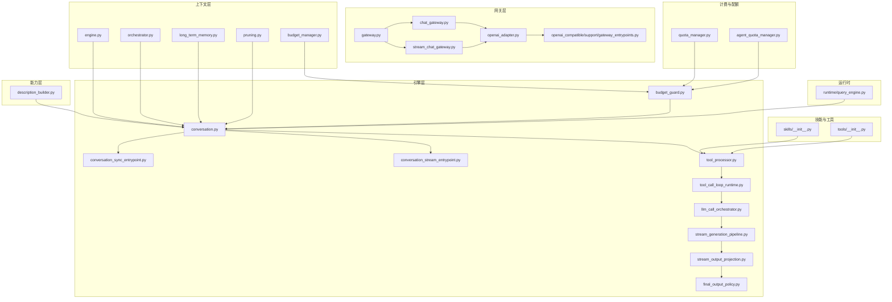

图表来源
- [context/engine.py](file://backend/app/ai/context/engine.py)
- [context/orchestrator.py](file://backend/app/ai/context/orchestrator.py)
- [engine/conversation.py](file://backend/app/ai/engine/conversation.py)
- [engine/conversation_sync_entrypoint.py](file://backend/app/ai/engine/conversation_sync_entrypoint.py)
- [engine/conversation_stream_entrypoint.py](file://backend/app/ai/engine/conversation_stream_entrypoint.py)
- [engine/tool_processor.py](file://backend/app/ai/engine/tool_processor.py)
- [engine/tool_call_loop_runtime.py](file://backend/app/ai/engine/tool_call_loop_runtime.py)
- [engine/llm_call_orchestrator.py](file://backend/app/ai/engine/llm_call_orchestrator.py)
- [engine/stream_generation_pipeline.py](file://backend/app/ai/engine/stream_generation_pipeline.py)
- [engine/stream_output_projection.py](file://backend/app/ai/engine/stream_output_projection.py)
- [engine/final_output_policy.py](file://backend/app/ai/engine/final_output_policy.py)
- [engine/budget_guard.py](file://backend/app/ai/engine/budget_guard.py)
- [gateway.py](file://backend/app/ai/gateway.py)
- [gateway_support/chat_gateway.py](file://backend/app/ai/gateway_support/chat_gateway.py)
- [gateway_support/stream_chat_gateway.py](file://backend/app/ai/gateway_support/stream_chat_gateway.py)
- [adapters/openai_adapter.py](file://backend/app/ai/adapters/openai_adapter.py)
- [adapters/openai_compatible/support/gateway_entrypoints.py](file://backend/app/ai/adapters/openai_compatible/support/gateway_entrypoints.py)
- [skills/__init__.py](file://backend/app/ai/skills/__init__.py)
- [tools/__init__.py](file://backend/app/ai/tools/__init__.py)
- [runtime/query_engine.py](file://backend/app/ai/runtime/query_engine.py)
- [quota_manager.py](file://backend/app/ai/quota_manager.py)
- [agent_quota_manager.py](file://backend/app/ai/agent_quota_manager.py)

章节来源
- [engine/base.py](file://backend/app/ai/engine/base.py)
- [engine/conversation.py](file://backend/app/ai/engine/conversation.py)
- [context/engine.py](file://backend/app/ai/context/engine.py)
- [gateway.py](file://backend/app/ai/gateway.py)

## 核心组件
- 智能体调度与对话入口
  - 同步对话入口与流式对话入口分别负责阻塞式与流式响应的统一编排
  - 对话运行时上下文构建与预检，确保执行前的参数与权限校验
- 工具调用执行器与循环
  - 工具处理器与工具循环运行时协同，按策略选择工具、执行并聚合结果
  - 工具契约诊断与重试策略保障调用可靠性
- LLM 调度与系统提示词
  - LLM 调度器负责模型选择、轮询与回退
  - 系统提示词渲染与意图辅助，提升上下文质量与意图对齐
- 输出投影与最终输出策略
  - 流式输出投影与最终输出策略共同决定响应形态与合规性
- 预算与配额
  - 预算守卫与预算助手在执行前后进行成本与限额检查
  - 全局与代理维度的配额管理与并发控制
- 网关适配器
  - 统一网关抽象，适配不同供应商的聊天、流式聊天、嵌入与图像能力
- 上下文与记忆
  - 上下文引擎与编排器负责消息组装、裁剪与长期记忆注入
- 实时与流式
  - 流式生成管线、流式输出投影、事件回放与完成支持，实现增量输出与实时交互

章节来源
- [engine/conversation_sync_entrypoint.py](file://backend/app/ai/engine/conversation_sync_entrypoint.py)
- [engine/conversation_stream_entrypoint.py](file://backend/app/ai/engine/conversation_stream_entrypoint.py)
- [engine/conversation_runtime_context_builder.py](file://backend/app/ai/engine/conversation_runtime_context_builder.py)
- [engine/conversation_runtime_preflight.py](file://backend/app/ai/engine/conversation_runtime_preflight.py)
- [engine/tool_processor.py](file://backend/app/ai/engine/tool_processor.py)
- [engine/tool_call_loop_runtime.py](file://backend/app/ai/engine/tool_call_loop_runtime.py)
- [engine/llm_call_orchestrator.py](file://backend/app/ai/engine/llm_call_orchestrator.py)
- [engine/system_prompt_rendering.py](file://backend/app/ai/engine/system_prompt_rendering.py)
- [engine/stream_generation_pipeline.py](file://backend/app/ai/engine/stream_generation_pipeline.py)
- [engine/stream_output_projection.py](file://backend/app/ai/engine/stream_output_projection.py)
- [engine/final_output_policy.py](file://backend/app/ai/engine/final_output_policy.py)
- [engine/budget_guard.py](file://backend/app/ai/engine/budget_guard.py)
- [engine/budget_helpers.py](file://backend/app/ai/engine/budget_helpers.py)
- [context/engine.py](file://backend/app/ai/context/engine.py)
- [context/orchestrator.py](file://backend/app/ai/context/orchestrator.py)
- [context/budget_manager.py](file://backend/app/ai/context/budget_manager.py)
- [gateway.py](file://backend/app/ai/gateway.py)
- [gateway_support/chat_gateway.py](file://backend/app/ai/gateway_support/chat_gateway.py)
- [gateway_support/stream_chat_gateway.py](file://backend/app/ai/gateway_support/stream_chat_gateway.py)

## 架构总览
AI 运行时引擎以“对话入口”为起点，贯穿“上下文组装—意图识别—规划—工具循环—LLM 推理—输出投影—最终输出—预算与配额—网关适配”的闭环。系统通过运行时钩子与记录支持实现可观测性，并通过失败分类与恢复策略提升鲁棒性。

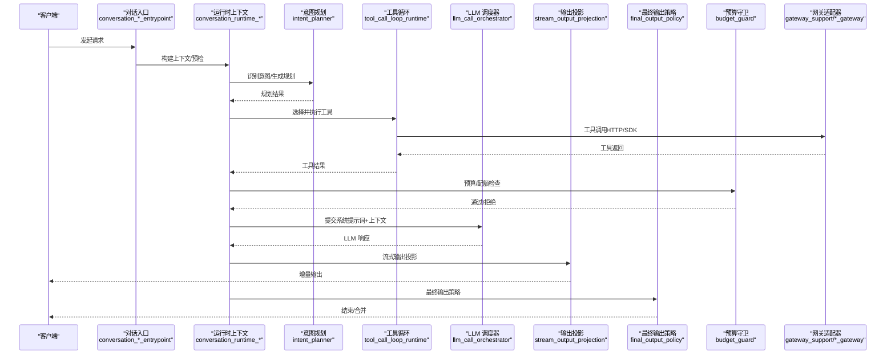

图表来源
- [engine/conversation_sync_entrypoint.py](file://backend/app/ai/engine/conversation_sync_entrypoint.py)
- [engine/conversation_stream_entrypoint.py](file://backend/app/ai/engine/conversation_stream_entrypoint.py)
- [engine/conversation_runtime_context_builder.py](file://backend/app/ai/engine/conversation_runtime_context_builder.py)
- [engine/conversation_runtime_preflight.py](file://backend/app/ai/engine/conversation_runtime_preflight.py)
- [engine/intent_planner.py](file://backend/app/ai/engine/intent_planner.py)
- [engine/tool_call_loop_runtime.py](file://backend/app/ai/engine/tool_call_loop_runtime.py)
- [engine/llm_call_orchestrator.py](file://backend/app/ai/engine/llm_call_orchestrator.py)
- [engine/stream_output_projection.py](file://backend/app/ai/engine/stream_output_projection.py)
- [engine/final_output_policy.py](file://backend/app/ai/engine/final_output_policy.py)
- [engine/budget_guard.py](file://backend/app/ai/engine/budget_guard.py)
- [gateway_support/chat_gateway.py](file://backend/app/ai/gateway_support/chat_gateway.py)
- [gateway_support/stream_chat_gateway.py](file://backend/app/ai/gateway_support/stream_chat_gateway.py)

## 详细组件分析

### 对话上下文管理
- 上下文引擎与编排器负责消息组装、裁剪与长期记忆注入，确保上下文长度与质量平衡
- 预算管理器与预算支持在上下文中维护成本与限额信息，驱动预算守卫决策
- 长期记忆与裁剪策略结合，避免上下文膨胀导致的性能与成本问题

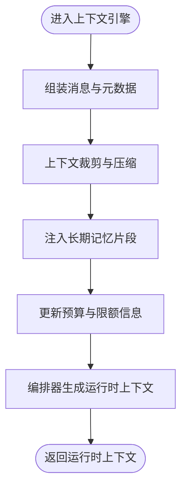

图表来源
- [context/engine.py](file://backend/app/ai/context/engine.py)
- [context/orchestrator.py](file://backend/app/ai/context/orchestrator.py)
- [context/budget_manager.py](file://backend/app/ai/context/budget_manager.py)
- [context/budget_support.py](file://backend/app/ai/context/budget_support.py)
- [context/pruning.py](file://backend/app/ai/context/pruning.py)
- [context/long_term_memory.py](file://backend/app/ai/context/long_term_memory.py)

章节来源
- [context/engine.py](file://backend/app/ai/context/engine.py)
- [context/orchestrator.py](file://backend/app/ai/context/orchestrator.py)
- [context/budget_manager.py](file://backend/app/ai/context/budget_manager.py)
- [context/budget_support.py](file://backend/app/ai/context/budget_support.py)
- [context/pruning.py](file://backend/app/ai/context/pruning.py)
- [context/long_term_memory.py](file://backend/app/ai/context/long_term_memory.py)

### 意图识别与规划算法
- 意图规划器基于系统提示词与上下文生成意图与规划
- 意图域规则与信号辅助函数用于增强意图识别的准确性
- 运行时访问器提供规划结果的读取与后续流程衔接

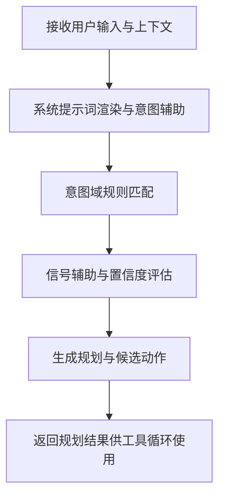

图表来源
- [engine/intent_planner.py](file://backend/app/ai/engine/intent_planner.py)
- [engine/intent_domain_rules.py](file://backend/app/ai/engine/intent_domain_rules.py)
- [engine/intent_runtime_accessors.py](file://backend/app/ai/engine/intent_runtime_accessors.py)
- [engine/system_prompt_helpers.py](file://backend/app/ai/engine/system_prompt_helpers.py)
- [engine/system_prompt_rendering.py](file://backend/app/ai/engine/system_prompt_rendering.py)
- [engine/system_prompt_intent_helpers.py](file://backend/app/ai/engine/system_prompt_intent_helpers.py)

章节来源
- [engine/intent_planner.py](file://backend/app/ai/engine/intent_planner.py)
- [engine/intent_domain_rules.py](file://backend/app/ai/engine/intent_domain_rules.py)
- [engine/intent_runtime_accessors.py](file://backend/app/ai/engine/intent_runtime_accessors.py)
- [engine/system_prompt_helpers.py](file://backend/app/ai/engine/system_prompt_helpers.py)
- [engine/system_prompt_rendering.py](file://backend/app/ai/engine/system_prompt_rendering.py)
- [engine/system_prompt_intent_helpers.py](file://backend/app/ai/engine/system_prompt_intent_helpers.py)

### 工具调用执行器与结果投影
- 工具处理器负责工具选择、参数构造与执行
- 工具循环运行时按策略迭代执行工具，聚合结果
- 工具契约诊断与重试策略保障调用稳定性
- 输出投影将工具结果映射为可读格式，参与最终输出

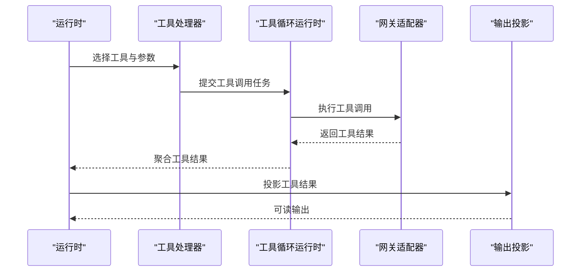

图表来源
- [engine/tool_processor.py](file://backend/app/ai/engine/tool_processor.py)
- [engine/tool_call_loop_runtime.py](file://backend/app/ai/engine/tool_call_loop_runtime.py)
- [engine/tool_execution_helpers.py](file://backend/app/ai/engine/tool_execution_helpers.py)
- [engine/tool_contract_diagnostics.py](file://backend/app/ai/engine/tool_contract_diagnostics.py)
- [engine/tool_contract_retry_policies.py](file://backend/app/ai/engine/tool_contract_retry_policies.py)
- [engine/stream_output_projection.py](file://backend/app/ai/engine/stream_output_projection.py)

章节来源
- [engine/tool_processor.py](file://backend/app/ai/engine/tool_processor.py)
- [engine/tool_call_loop_runtime.py](file://backend/app/ai/engine/tool_call_loop_runtime.py)
- [engine/tool_execution_helpers.py](file://backend/app/ai/engine/tool_execution_helpers.py)
- [engine/tool_contract_diagnostics.py](file://backend/app/ai/engine/tool_contract_diagnostics.py)
- [engine/tool_contract_retry_policies.py](file://backend/app/ai/engine/tool_contract_retry_policies.py)
- [engine/stream_output_projection.py](file://backend/app/ai/engine/stream_output_projection.py)

### LLM 调度与系统提示词
- LLM 调度器负责模型选择、轮询与回退策略
- 系统提示词渲染与能力提示、决策辅助提升上下文质量
- 运行时摘要与能力决策影响系统提示词的动态生成

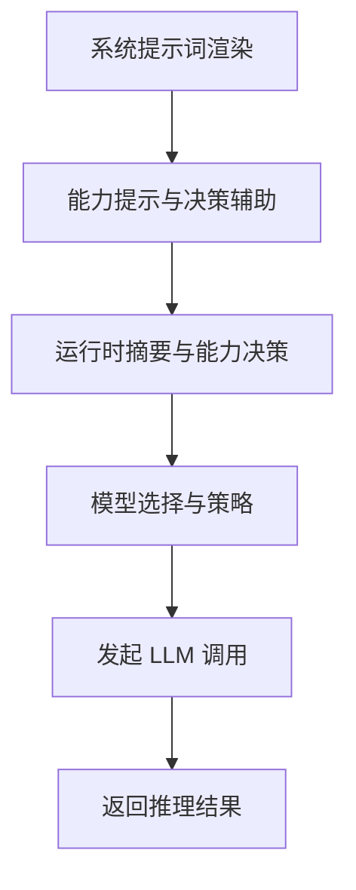

图表来源
- [engine/llm_call_orchestrator.py](file://backend/app/ai/engine/llm_call_orchestrator.py)
- [engine/system_prompt_rendering.py](file://backend/app/ai/engine/system_prompt_rendering.py)
- [engine/system_prompt_capability_hints.py](file://backend/app/ai/engine/system_prompt_capability_hints.py)
- [engine/system_prompt_capability_decisions.py](file://backend/app/ai/engine/system_prompt_capability_decisions.py)
- [engine/system_prompt_runtime_summary.py](file://backend/app/ai/engine/system_prompt_runtime_summary.py)

章节来源
- [engine/llm_call_orchestrator.py](file://backend/app/ai/engine/llm_call_orchestrator.py)
- [engine/system_prompt_rendering.py](file://backend/app/ai/engine/system_prompt_rendering.py)
- [engine/system_prompt_capability_hints.py](file://backend/app/ai/engine/system_prompt_capability_hints.py)
- [engine/system_prompt_capability_decisions.py](file://backend/app/ai/engine/system_prompt_capability_decisions.py)
- [engine/system_prompt_runtime_summary.py](file://backend/app/ai/engine/system_prompt_runtime_summary.py)

### 流式响应处理、增量输出与实时交互
- 流式生成管线与输出投影实现增量输出
- 事件回放与完成支持确保流式过程的完整性
- 流式运行时钩子与记录支持提供可观测性
- 流式工具调用与批量运行时提升吞吐

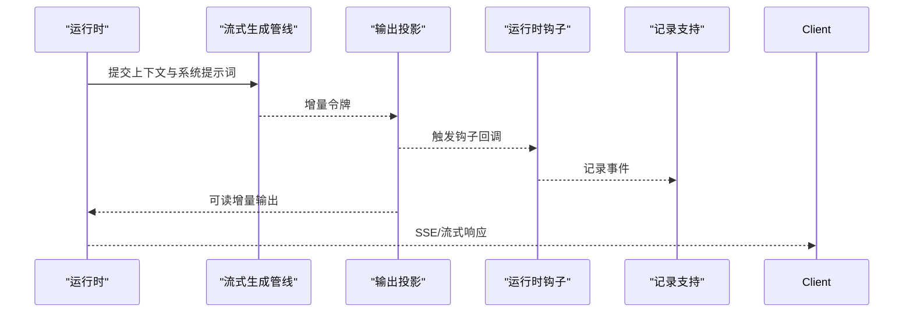

图表来源
- [engine/stream_generation_pipeline.py](file://backend/app/ai/engine/stream_generation_pipeline.py)
- [engine/stream_output_projection.py](file://backend/app/ai/engine/stream_output_projection.py)
- [stream_handler.py](file://backend/app/ai/engine/stream_handler.py)
- [stream_runtime_hooks.py](file://backend/app/ai/engine/stream_runtime_hooks.py)
- [stream_runtime_record_support.py](file://backend/app/ai/engine/stream_runtime_record_support.py)
- [stream_tool_call_helpers.py](file://backend/app/ai/engine/stream_tool_call_helpers.py)
- [stream_llm_round_support.py](file://backend/app/ai/engine/stream_llm_round_support.py)
- [stream_replay_events.py](file://backend/app/ai/engine/stream_replay_events.py)
- [stream_finalization_pipeline.py](file://backend/app/ai/engine/stream_finalization_pipeline.py)
- [stream_completion_support.py](file://backend/app/ai/engine/stream_completion_support.py)

章节来源
- [engine/stream_generation_pipeline.py](file://backend/app/ai/engine/stream_generation_pipeline.py)
- [engine/stream_output_projection.py](file://backend/app/ai/engine/stream_output_projection.py)
- [stream_handler.py](file://backend/app/ai/engine/stream_handler.py)
- [stream_runtime_hooks.py](file://backend/app/ai/engine/stream_runtime_hooks.py)
- [stream_runtime_record_support.py](file://backend/app/ai/engine/stream_runtime_record_support.py)
- [stream_tool_call_helpers.py](file://backend/app/ai/engine/stream_tool_call_helpers.py)
- [stream_llm_round_support.py](file://backend/app/ai/engine/stream_llm_round_support.py)
- [stream_replay_events.py](file://backend/app/ai/engine/stream_replay_events.py)
- [stream_finalization_pipeline.py](file://backend/app/ai/engine/stream_finalization_pipeline.py)
- [stream_completion_support.py](file://backend/app/ai/engine/stream_completion_support.py)

### 预算管理、超时控制与资源限制
- 预算守卫在执行前后检查成本与限额，防止超支
- 预算助手提供成本估算与限额计算逻辑
- 全局与代理维度的配额管理与并发控制保障资源安全
- 速率限制与重试服务提升稳定性

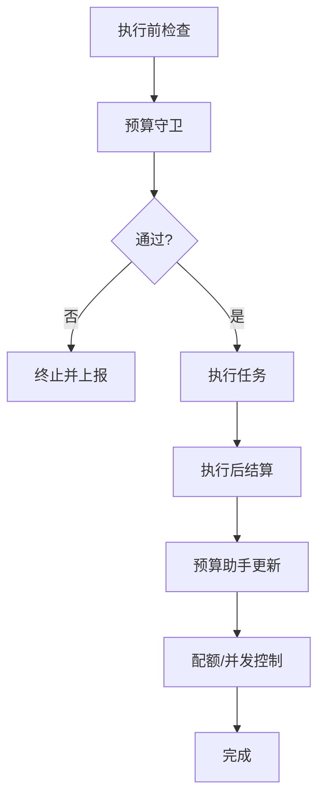

图表来源
- [engine/budget_guard.py](file://backend/app/ai/engine/budget_guard.py)
- [engine/budget_helpers.py](file://backend/app/ai/engine/budget_helpers.py)
- [quota_manager.py](file://backend/app/ai/quota_manager.py)
- [agent_quota_manager.py](file://backend/app/ai/agent_quota_manager.py)
- [rate_limiter.py](file://backend/app/ai/rate_limiter.py)
- [retry_service.py](file://backend/app/ai/retry_service.py)

章节来源
- [engine/budget_guard.py](file://backend/app/ai/engine/budget_guard.py)
- [engine/budget_helpers.py](file://backend/app/ai/engine/budget_helpers.py)
- [quota_manager.py](file://backend/app/ai/quota_manager.py)
- [agent_quota_manager.py](file://backend/app/ai/agent_quota_manager.py)
- [rate_limiter.py](file://backend/app/ai/rate_limiter.py)
- [retry_service.py](file://backend/app/ai/retry_service.py)

### 错误处理机制
- 失败分类器与恢复管理器根据错误类型触发恢复策略
- 恢复决策策略、同意辅助与状态更新形成闭环
- 流式错误工具与最终化管线保证异常场景下的一致性

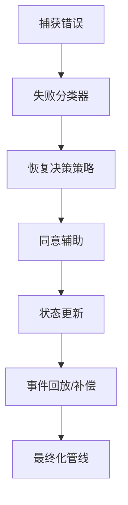

图表来源
- [engine/failure_classifier.py](file://backend/app/ai/engine/failure_classifier.py)
- [recovery_manager.py](file://backend/app/ai/engine/recovery_manager.py)
- [recovery_decision_policy.py](file://backend/app/ai/engine/recovery_decision_policy.py)
- [recovery_consent_helpers.py](file://backend/app/ai/engine/recovery_consent_helpers.py)
- [recovery_status_update.py](file://backend/app/ai/engine/recovery_status_update.py)
- [stream_error_utils.py](file://backend/app/ai/engine/stream_error_utils.py)
- [stream_finalization_pipeline.py](file://backend/app/ai/engine/stream_finalization_pipeline.py)

章节来源
- [engine/failure_classifier.py](file://backend/app/ai/engine/failure_classifier.py)
- [recovery_manager.py](file://backend/app/ai/engine/recovery_manager.py)
- [recovery_decision_policy.py](file://backend/app/ai/engine/recovery_decision_policy.py)
- [recovery_consent_helpers.py](file://backend/app/ai/engine/recovery_consent_helpers.py)
- [recovery_status_update.py](file://backend/app/ai/engine/recovery_status_update.py)
- [stream_error_utils.py](file://backend/app/ai/engine/stream_error_utils.py)
- [stream_finalization_pipeline.py](file://backend/app/ai/engine/stream_finalization_pipeline.py)

### AI 网关适配器与供应商集成
- 统一网关抽象，适配聊天、流式聊天、嵌入与图像等能力
- OpenAI 兼容适配器提供标准化入口与协议安全
- 回退与故障转移策略保障可用性

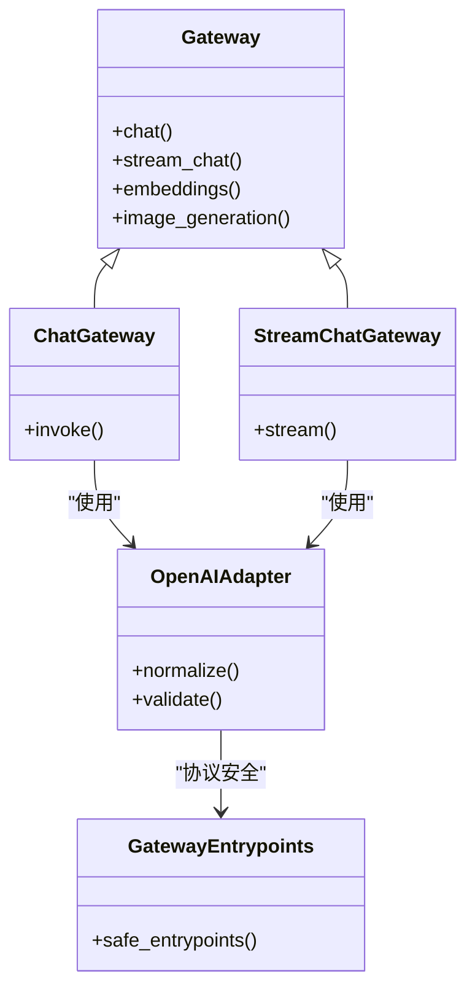

图表来源
- [gateway.py](file://backend/app/ai/gateway.py)
- [gateway_support/chat_gateway.py](file://backend/app/ai/gateway_support/chat_gateway.py)
- [gateway_support/stream_chat_gateway.py](file://backend/app/ai/gateway_support/stream_chat_gateway.py)
- [adapters/openai_adapter.py](file://backend/app/ai/adapters/openai_adapter.py)
- [adapters/openai_compatible/support/gateway_entrypoints.py](file://backend/app/ai/adapters/openai_compatible/support/gateway_entrypoints.py)
- [failover.py](file://backend/app/ai/failover.py)

章节来源
- [gateway.py](file://backend/app/ai/gateway.py)
- [gateway_support/chat_gateway.py](file://backend/app/ai/gateway_support/chat_gateway.py)
- [gateway_support/stream_chat_gateway.py](file://backend/app/ai/gateway_support/stream_chat_gateway.py)
- [adapters/openai_adapter.py](file://backend/app/ai/adapters/openai_adapter.py)
- [adapters/openai_compatible/support/gateway_entrypoints.py](file://backend/app/ai/adapters/openai_compatible/support/gateway_entrypoints.py)
- [failover.py](file://backend/app/ai/failover.py)

### 配置方法与扩展接口
- 运行时上下文构建与预检：通过运行时上下文构建器与预检支持，定义对话执行前的参数与权限校验
- 工具循环策略：通过工具循环策略与访问器，自定义工具选择与执行顺序
- 输出策略：通过最终输出策略与投影策略，控制响应形态与合规性
- 网关适配器：通过适配器与安全入口点，扩展新的供应商或协议
- 预算与配额：通过预算守卫与配额管理器，接入新的计费模型与限额策略
- 流式钩子与记录：通过运行时钩子与记录支持，扩展可观测性与审计

章节来源
- [engine/conversation_runtime_context_builder.py](file://backend/app/ai/engine/conversation_runtime_context_builder.py)
- [engine/conversation_runtime_preflight.py](file://backend/app/ai/engine/conversation_runtime_preflight.py)
- [engine/tool_call_loop_policy.py](file://backend/app/ai/engine/tool_call_loop_policy.py)
- [engine/final_output_policy.py](file://backend/app/ai/engine/final_output_policy.py)
- [engine/stream_output_projection.py](file://backend/app/ai/engine/stream_output_projection.py)
- [adapters/openai_compatible/support/gateway_entrypoints.py](file://backend/app/ai/adapters/openai_compatible/support/gateway_entrypoints.py)
- [engine/budget_guard.py](file://backend/app/ai/engine/budget_guard.py)
- [quota_manager.py](file://backend/app/ai/quota_manager.py)
- [agent_quota_manager.py](file://backend/app/ai/agent_quota_manager.py)
- [stream_runtime_hooks.py](file://backend/app/ai/engine/stream_runtime_hooks.py)
- [stream_runtime_record_support.py](file://backend/app/ai/engine/stream_runtime_record_support.py)

## 依赖关系分析
- 组件耦合与内聚
  - 上下文层与引擎层高内聚，通过运行时上下文解耦
  - 网关层与适配器层低耦合，通过统一抽象对接多供应商
  - 工具循环与 LLM 调度器通过策略接口松耦合
- 直接与间接依赖
  - 对话入口依赖运行时上下文与预检支持
  - 工具循环依赖工具处理器与网关适配器
  - LLM 调度器依赖系统提示词与模型策略
- 外部依赖与集成点
  - 供应商 SDK/HTTP 接口作为外部依赖
  - Redis/数据库用于持久化与缓存
  - SSE/SocketIO 用于实时推送

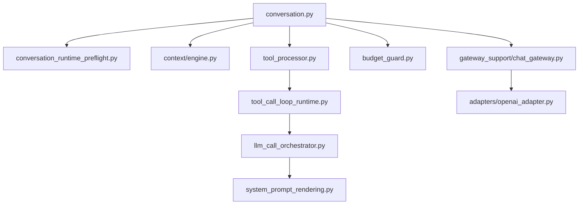

图表来源
- [engine/conversation.py](file://backend/app/ai/engine/conversation.py)
- [engine/conversation_runtime_preflight.py](file://backend/app/ai/engine/conversation_runtime_preflight.py)
- [context/engine.py](file://backend/app/ai/context/engine.py)
- [engine/tool_processor.py](file://backend/app/ai/engine/tool_processor.py)
- [engine/tool_call_loop_runtime.py](file://backend/app/ai/engine/tool_call_loop_runtime.py)
- [engine/llm_call_orchestrator.py](file://backend/app/ai/engine/llm_call_orchestrator.py)
- [engine/system_prompt_rendering.py](file://backend/app/ai/engine/system_prompt_rendering.py)
- [engine/budget_guard.py](file://backend/app/ai/engine/budget_guard.py)
- [gateway_support/chat_gateway.py](file://backend/app/ai/gateway_support/chat_gateway.py)
- [adapters/openai_adapter.py](file://backend/app/ai/adapters/openai_adapter.py)

章节来源
- [engine/conversation.py](file://backend/app/ai/engine/conversation.py)
- [engine/conversation_runtime_preflight.py](file://backend/app/ai/engine/conversation_runtime_preflight.py)
- [context/engine.py](file://backend/app/ai/context/engine.py)
- [engine/tool_processor.py](file://backend/app/ai/engine/tool_processor.py)
- [engine/tool_call_loop_runtime.py](file://backend/app/ai/engine/tool_call_loop_runtime.py)
- [engine/llm_call_orchestrator.py](file://backend/app/ai/engine/llm_call_orchestrator.py)
- [engine/system_prompt_rendering.py](file://backend/app/ai/engine/system_prompt_rendering.py)
- [engine/budget_guard.py](file://backend/app/ai/engine/budget_guard.py)
- [gateway_support/chat_gateway.py](file://backend/app/ai/gateway_support/chat_gateway.py)
- [adapters/openai_adapter.py](file://backend/app/ai/adapters/openai_adapter.py)

## 性能考量
- 上下文裁剪与长期记忆注入减少无效信息，降低推理成本
- 工具循环批量化与流式工具调用提升吞吐
- LLM 调度器的轮询与回退策略在可用性与延迟间取得平衡
- 预算守卫与配额控制防止资源滥用，保障系统稳定性
- 流式输出投影与事件回放减少全量重算，提高实时性

## 故障排查指南
- 错误分类与恢复
  - 使用失败分类器定位错误类型，触发相应恢复策略
  - 通过恢复管理器与状态更新确保异常场景一致性
- 流式异常处理
  - 使用流式错误工具与最终化管线保证异常时的收尾
- 预算与配额异常
  - 检查预算守卫与配额管理器日志，确认限额触发原因
- 网关适配器问题
  - 通过安全入口点与适配器验证，排查协议与认证问题

章节来源
- [engine/failure_classifier.py](file://backend/app/ai/engine/failure_classifier.py)
- [recovery_manager.py](file://backend/app/ai/engine/recovery_manager.py)
- [recovery_status_update.py](file://backend/app/ai/engine/recovery_status_update.py)
- [stream_error_utils.py](file://backend/app/ai/engine/stream_error_utils.py)
- [stream_finalization_pipeline.py](file://backend/app/ai/engine/stream_finalization_pipeline.py)
- [engine/budget_guard.py](file://backend/app/ai/engine/budget_guard.py)
- [quota_manager.py](file://backend/app/ai/quota_manager.py)
- [agent_quota_manager.py](file://backend/app/ai/agent_quota_manager.py)
- [adapters/openai_compatible/support/gateway_entrypoints.py](file://backend/app/ai/adapters/openai_compatible/support/gateway_entrypoints.py)

## 结论
NovusAI 的 AI 运行时引擎通过清晰的分层与模块化设计，实现了从意图识别到工具执行再到流式输出的完整闭环。其在预算与配额控制、错误恢复、网关适配与实时交互方面的工程化实践，为大规模 SaaS 场景提供了稳定、可扩展且高性能的 AI 引擎基础。开发者可基于本文档提供的配置与扩展接口，快速定制与优化运行时行为。

## 附录
- 关键类型与常量
  - 类型定义与枚举用于约束运行时行为与状态
  - 常量用于模型策略、提示词模板与默认阈值
- 文本语义与 JSON 安全
  - 术语、Token、URL 与 JSON 语义工具保障输入与输出的安全性与一致性
- 内部 AI 服务与使用记录
  - 内部 AI 服务封装底层调用细节
  - 使用记录核心与上下文支持用于审计与统计

章节来源
- [types.py](file://backend/app/ai/types.py)
- [constants.py](file://backend/app/ai/constants.py)
- [text_semantics_terms.py](file://backend/app/ai/text_semantics_terms.py)
- [text_semantics_tokens.py](file://backend/app/ai/text_semantics_tokens.py)
- [text_semantics_urls.py](file://backend/app/ai/text_semantics_urls.py)
- [text_semantics_json.py](file://backend/app/ai/text_semantics_json.py)
- [text_semantics.py](file://backend/app/ai/text_semantics.py)
- [json_safe.py](file://backend/app/ai/json_safe.py)
- [internal_ai_service.py](file://backend/app/ai/internal_ai_service.py)
- [usage_recorder_core.py](file://backend/app/ai/usage_recorder_core.py)
- [usage_recorder_context.py](file://backend/app/ai/usage_recorder_context.py)
- [usage_recorder_support.py](file://backend/app/ai/usage_recorder_support.py)