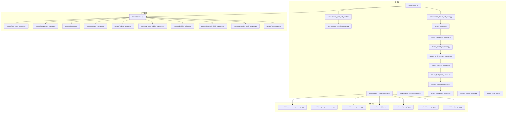
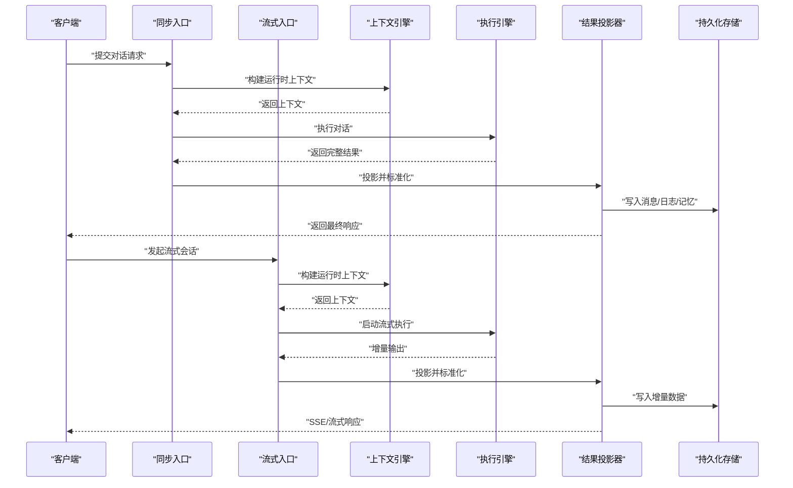
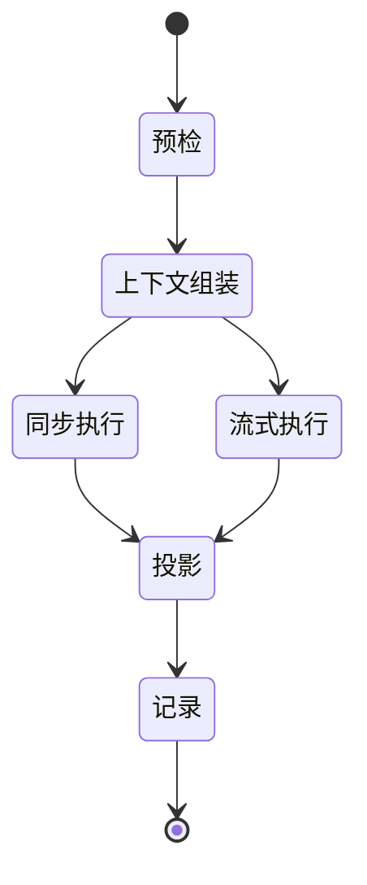
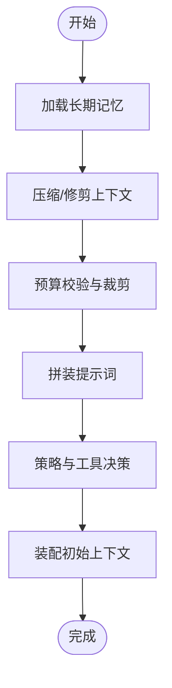
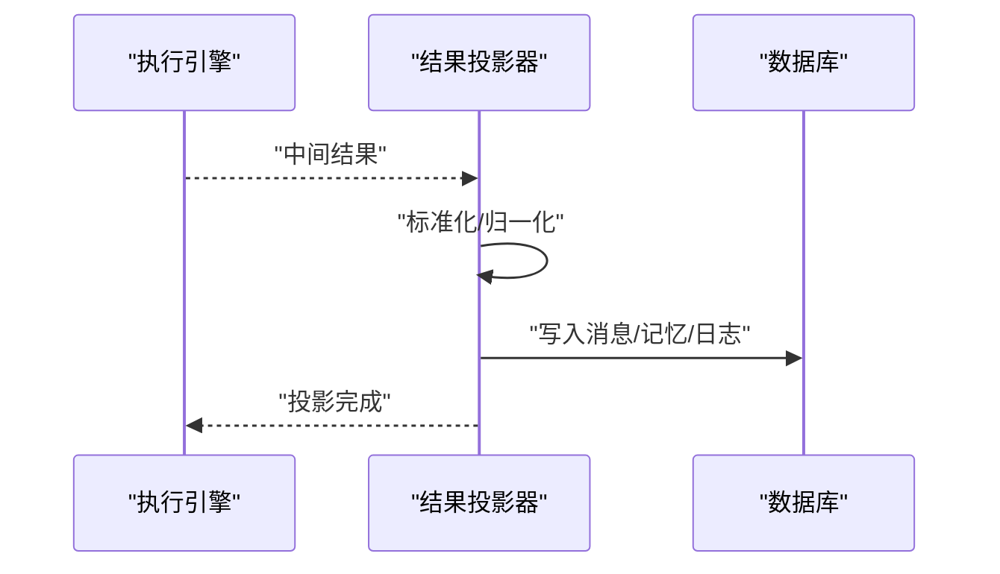
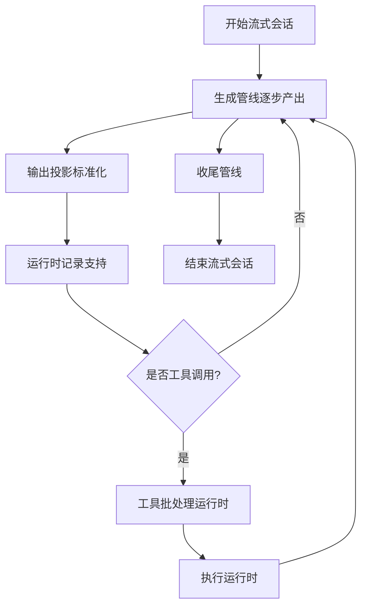
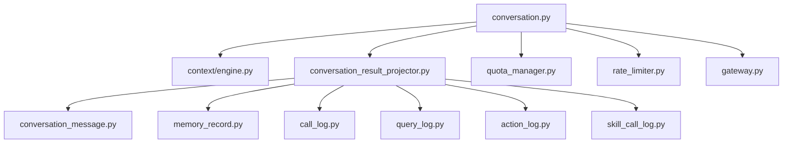

# 对话管理系统

<cite>

**本文引用的文件**
- [conversation.py](file://backend/app/ai/engine/conversation.py)
- [conversation_entrypoints.py](file://backend/app/ai/engine/conversation_entrypoints.py)
- [conversation_runtime_context_builder.py](file://backend/app/ai/engine/conversation_runtime_context_builder.py)
- [conversation_result_projector.py](file://backend/app/ai/engine/conversation_result_projector.py)
- [conversation_sync_entrypoint.py](file://backend/app/ai/engine/conversation_sync_entrypoint.py)
- [conversation_stream_entrypoint.py](file://backend/app/ai/engine/conversation_stream_entrypoint.py)
- [conversation_sync_io_adapter.py](file://backend/app/ai/engine/conversation_sync_io_adapter.py)
- [conversation_sync_result_support.py](file://backend/app/ai/engine/conversation_sync_result_support.py)
- [stream_handler.py](file://backend/app/ai/engine/stream_handler.py)
- [stream_generation_pipeline.py](file://backend/app/ai/engine/stream_generation_pipeline.py)
- [stream_output_projection.py](file://backend/app/ai/engine/stream_output_projection.py)
- [stream_runtime_record_support.py](file://backend/app/ai/engine/stream_runtime_record_support.py)
- [stream_tool_call_helpers.py](file://backend/app/ai/engine/stream_tool_call_helpers.py)
- [stream_tool_batch_runtime.py](file://backend/app/ai/engine/stream_tool_batch_runtime.py)
- [stream_execution_runtime.py](file://backend/app/ai/engine/stream_execution_runtime.py)
- [stream_finalization_pipeline.py](file://backend/app/ai/engine/stream_finalization_pipeline.py)
- [stream_runtime_hooks.py](file://backend/app/ai/engine/stream_runtime_hooks.py)
- [stream_error_utils.py](file://backend/app/ai/engine/stream_error_utils.py)
- [conversation_helpers.py](file://backend/app/ai/engine/conversation_helpers.py)
- [conversation_runtime_preflight.py](file://backend/app/ai/engine/conversation_runtime_preflight.py)
- [conversation_runtime_entrypoint_runner.py](file://backend/app/ai/engine/conversation_runtime_entrypoint_runner.py)
- [conversation_runtime_bridge.py](file://backend/app/ai/engine/conversation_runtime_bridge.py)
- [conversation_facade_support.py](file://backend/app/ai/engine/conversation_facade_support.py)
- [conversation_sync_io_support.py](file://backend/app/ai/engine/conversation_sync_io_support.py)
- [engine.py](file://backend/app/ai/context/engine.py)
- [long_term_memory.py](file://backend/app/ai/context/long_term_memory.py)
- [compaction_support.py](file://backend/app/ai/context/compaction_support.py)
- [pruning.py](file://backend/app/ai/context/pruning.py)
- [budget_manager.py](file://backend/app/ai/context/budget_manager.py)
- [budget_support.py](file://backend/app/ai/context/budget_support.py)
- [prompt_addition_support.py](file://backend/app/ai/context/prompt_addition_support.py)
- [decision_helpers.py](file://backend/app/ai/context/decision_helpers.py)
- [assembly_initial_support.py](file://backend/app/ai/context/assembly_initial_support.py)
- [assembly_result_support.py](file://backend/app/ai/context/assembly_result_support.py)
- [orchestrator.py](file://backend/app/ai/context/orchestrator.py)
- [conversation_message.py](file://backend/app/models/ai/conversation_message.py)
- [agent_conversation.py](file://backend/app/models/ai/agent_conversation.py)
- [memory_record.py](file://backend/app/models/ai/memory_record.py)
- [call_log.py](file://backend/app/models/ai/call_log.py)
- [query_log.py](file://backend/app/models/ai/query_log.py)
- [action_log.py](file://backend/app/models/ai/action_log.py)
- [skill_call_log.py](file://backend/app/models/ai/skill_call_log.py)
- [agent.py](file://backend/app/models/ai/agent.py)
- [model.py](file://backend/app/models/ai/model.py)
- [tenant_quota.py](file://backend/app/models/ai/tenant_quota.py)
- [tenant_rate_limit.py](file://backend/app/models/ai/tenant_rate_limit.py)
- [quota_manager.py](file://backend/app/ai/quota_manager.py)
- [quota_usage_tracker.py](file://backend/app/ai/quota_usage_tracker.py)
- [quota_models.py](file://backend/app/ai/quota_models.py)
- [quota_exceptions.py](file://backend/app/ai/quota_exceptions.py)
- [rate_limiter.py](file://backend/app/ai/rate_limiter.py)
- [failover.py](file://backend/app/ai/failover.py)
- [retry_service.py](file://backend/app/ai/retry_service.py)
- [gateway.py](file://backend/app/ai/gateway.py)
- [internal_ai_service.py](file://backend/app/ai/internal_ai_service.py)
- [sse.py](file://backend/app/ai/sse.py)
- [text_semantics.py](file://backend/app/ai/text_semantics.py)
- [text_semantics_tokens.py](file://backend/app/ai/text_semantics_tokens.py)
- [text_semantics_json.py](file://backend/app/ai/text_semantics_json.py)
- [text_semantics_urls.py](file://backend/app/ai/text_semantics_urls.py)
- [text_semantics_terms.py](file://backend/app/ai/text_semantics_terms.py)
- [usage_recorder_core.py](file://backend/app/ai/usage_recorder_core.py)
- [usage_recorder_context.py](file://backend/app/ai/usage_recorder_context.py)
- [usage_recorder_support.py](file://backend/app/ai/usage_recorder_support.py)
- [types.py](file://backend/app/ai/types.py)
- [constants.py](file://backend/app/ai/constants.py)
- [exceptions.py](file://backend/app/ai/exceptions.py)
- [json_safe.py](file://backend/app/ai/json_safe.py)
- [memory_policy.py](file://backend/app/ai/memory_policy.py)
- [page_locale.py](file://backend/app/ai/page_locale.py)
- [cache.py](file://backend/app/ai/cache.py)
- [adapter_base.py](file://backend/app/ai/adapters/base.py)
- [openai_adapter.py](file://backend/app/ai/adapters/openai_adapter.py)
- [openai_compatible/adapter.py](file://backend/app/ai/adapters/openai_compatible/adapter.py)
- [gateway_support/base.py](file://backend/app/ai/gateway_support/base.py)
- [gateway_support/registry.py](file://backend/app/ai/gateway_support/registry.py)
- [gateway_support/provider.py](file://backend/app/ai/gateway_support/provider.py)
- [gateway_support/runtime.py](file://backend/app/ai/gateway_support/runtime.py)
- [gateway_support/service.py](file://backend/app/ai/gateway_support/service.py)
- [gateway_support/trace.py](file://backend/app/ai/gateway_support/trace.py)
- [gateway_support/utils.py](file://backend/app/ai/gateway_support/utils.py)
- [gateway_support/health.py](file://backend/app/ai/gateway_support/health.py)
- [gateway_support/metrics.py](file://backend/app/ai/gateway_support/metrics.py)
- [gateway_support/limits.py](file://backend/app/ai/gateway_support/limits.py)
- [gateway_support/rate_limit.py](file://backend/app/ai/gateway_support/rate_limit.py)
- [gateway_support/failover.py](file://backend/app/ai/gateway_support/failover.py)
- [gateway_support/retry.py](file://backend/app/ai/gateway_support/retry.py)
- [gateway_support/timeout.py](file://backend/app/ai/gateway_support/timeout.py)
- [gateway_support/validation.py](file://backend/app/ai/gateway_support/validation.py)
- [gateway_support/security.py](file://backend/app/ai/gateway_support/security.py)
- [gateway_support/telemetry.py](file://backend/app/ai/gateway_support/telemetry.py)
- [gateway_support/transform.py](file://backend/app/ai/gateway_support/transform.py)
- [gateway_support/normalize.py](file://backend/app/ai/gateway_support/normalize.py)
- [gateway_support/audit.py](file://backend/app/ai/gateway_support/audit.py)
- [gateway_support/monitor.py](file://backend/app/ai/gateway_support/monitor.py)
- [gateway_support/debug.py](file://backend/app/ai/gateway_support/debug.py)
- [gateway_support/compatibility.py](file://backend/app/ai/gateway_support/compatibility.py)
</cite>

## 目录
1. [简介](#简介)
2. [项目结构](#项目结构)
3. [核心组件](#核心组件)
4. [架构总览](#架构总览)
5. [详细组件分析](#详细组件分析)
6. [依赖关系分析](#依赖关系分析)
7. [性能考量](#性能考量)
8. [故障排查指南](#故障排查指南)
9. [结论](#结论)
10. [附录](#附录)

## 简介
本文件系统性梳理对话管理系统的架构与实现，围绕对话生命周期管理、上下文维护与消息流转机制展开，重点覆盖以下主题：
- 对话入口点处理：同步与流式两种模式的调用链与执行路径
- 运行时上下文构建：如何组装输入、历史、预算、提示词与工具策略
- 结果投影器：将中间产物标准化为统一输出格式
- 历史与状态持久化：消息、记忆与调用日志的落库与查询
- 并发控制与配额：租户级配额、速率限制与降级重试
- 流式处理与增量响应：SSE/流式管线、工具批处理与实时交互
- 诊断、监控与调试：错误分类、追踪与可观测性支持

## 项目结构
对话系统位于后端 AI 引擎与上下文模块中，核心文件分布如下：
- 引擎层（engine）：负责对话执行、流式处理、结果投影与 IO 适配
- 上下文层（context）：负责历史压缩、修剪、预算管理与提示词拼装
- 模型层（models/ai）：持久化实体，包括对话消息、记忆记录、调用日志等
- 网关与适配层（gateway_support/adapters）：提供多供应商适配与运行时支撑
- 配额与限流（quota_manager、rate_limiter、failover、retry_service）：保障稳定性与公平性

图表来源
- [conversation.py](file://backend/app/ai/engine/conversation.py)
- [conversation_sync_entrypoint.py](file://backend/app/ai/engine/conversation_sync_entrypoint.py)
- [conversation_stream_entrypoint.py](file://backend/app/ai/engine/conversation_stream_entrypoint.py)
- [conversation_result_projector.py](file://backend/app/ai/engine/conversation_result_projector.py)
- [conversation_sync_io_adapter.py](file://backend/app/ai/engine/conversation_sync_io_adapter.py)
- [stream_handler.py](file://backend/app/ai/engine/stream_handler.py)
- [stream_generation_pipeline.py](file://backend/app/ai/engine/stream_generation_pipeline.py)
- [stream_output_projection.py](file://backend/app/ai/engine/stream_output_projection.py)
- [stream_runtime_record_support.py](file://backend/app/ai/engine/stream_runtime_record_support.py)
- [stream_tool_call_helpers.py](file://backend/app/ai/engine/stream_tool_call_helpers.py)
- [stream_tool_batch_runtime.py](file://backend/app/ai/engine/stream_tool_batch_runtime.py)
- [stream_execution_runtime.py](file://backend/app/ai/engine/stream_execution_runtime.py)
- [stream_finalization_pipeline.py](file://backend/app/ai/engine/stream_finalization_pipeline.py)
- [context/engine.py](file://backend/app/ai/context/engine.py)
- [context/long_term_memory.py](file://backend/app/ai/context/long_term_memory.py)
- [context/compaction_support.py](file://backend/app/ai/context/compaction_support.py)
- [context/pruning.py](file://backend/app/ai/context/pruning.py)
- [context/budget_manager.py](file://backend/app/ai/context/budget_manager.py)
- [context/budget_support.py](file://backend/app/ai/context/budget_support.py)
- [context/prompt_addition_support.py](file://backend/app/ai/context/prompt_addition_support.py)
- [context/decision_helpers.py](file://backend/app/ai/context/decision_helpers.py)
- [context/assembly_initial_support.py](file://backend/app/ai/context/assembly_initial_support.py)
- [context/assembly_result_support.py](file://backend/app/ai/context/assembly_result_support.py)
- [context/orchestrator.py](file://backend/app/ai/context/orchestrator.py)
- [conversation_message.py](file://backend/app/models/ai/conversation_message.py)
- [agent_conversation.py](file://backend/app/models/ai/agent_conversation.py)
- [memory_record.py](file://backend/app/models/ai/memory_record.py)
- [call_log.py](file://backend/app/models/ai/call_log.py)
- [query_log.py](file://backend/app/models/ai/query_log.py)
- [action_log.py](file://backend/app/models/ai/action_log.py)
- [skill_call_log.py](file://backend/app/models/ai/skill_call_log.py)

章节来源
- [conversation.py](file://backend/app/ai/engine/conversation.py)
- [context/engine.py](file://backend/app/ai/context/engine.py)

## 核心组件
- 对话引擎（conversation.py）：定义对话生命周期、状态机与主流程编排
- 同步入口（conversation_sync_entrypoint.py）：面向阻塞式调用的执行路径
- 流式入口（conversation_stream_entrypoint.py）：面向 SSE/流式输出的执行路径
- 结果投影器（conversation_result_projector.py）：统一输出格式与落库
- 上下文引擎（context/engine.py）：历史压缩、预算、提示词拼装与决策
- 流式处理器（stream_handler.py 及相关管线）：生成、投影、记录与收尾
- 模型持久化（models/ai/*）：消息、记忆、调用日志等实体

章节来源
- [conversation.py](file://backend/app/ai/engine/conversation.py)
- [conversation_sync_entrypoint.py](file://backend/app/ai/engine/conversation_sync_entrypoint.py)
- [conversation_stream_entrypoint.py](file://backend/app/ai/engine/conversation_stream_entrypoint.py)
- [conversation_result_projector.py](file://backend/app/ai/engine/conversation_result_projector.py)
- [context/engine.py](file://backend/app/ai/context/engine.py)

## 架构总览
对话系统采用“入口点 -> 上下文组装 -> 执行引擎 -> 结果投影 -> 持久化”的分层架构。同步与流式两条路径共享上下文组装与执行逻辑，差异在于输出与 IO 适配。

图表来源
- [conversation_sync_entrypoint.py](file://backend/app/ai/engine/conversation_sync_entrypoint.py)
- [conversation_stream_entrypoint.py](file://backend/app/ai/engine/conversation_stream_entrypoint.py)
- [context/engine.py](file://backend/app/ai/context/engine.py)
- [conversation_result_projector.py](file://backend/app/ai/engine/conversation_result_projector.py)
- [conversation_message.py](file://backend/app/models/ai/conversation_message.py)

## 详细组件分析

### 对话生命周期与状态机
- 生命周期阶段：预检（preflight）-> 组装上下文 -> 执行（同步/流式）-> 投影 -> 记录 -> 完成
- 状态机驱动：在引擎层通过状态机推进各阶段，确保幂等与可恢复
- 入口点选择：根据是否需要流式输出选择不同入口

图表来源
- [conversation.py](file://backend/app/ai/engine/conversation.py)
- [conversation_runtime_preflight.py](file://backend/app/ai/engine/conversation_runtime_preflight.py)
- [conversation_runtime_context_builder.py](file://backend/app/ai/engine/conversation_runtime_context_builder.py)
- [conversation_runtime_entrypoint_runner.py](file://backend/app/ai/engine/conversation_runtime_entrypoint_runner.py)

章节来源
- [conversation.py](file://backend/app/ai/engine/conversation.py)
- [conversation_runtime_preflight.py](file://backend/app/ai/engine/conversation_runtime_preflight.py)
- [conversation_runtime_context_builder.py](file://backend/app/ai/engine/conversation_runtime_context_builder.py)
- [conversation_runtime_entrypoint_runner.py](file://backend/app/ai/engine/conversation_runtime_entrypoint_runner.py)

### 上下文维护与历史管理
- 长期记忆（long_term_memory.py）：基于历史消息与记忆记录进行检索与融合
- 压缩与修剪（compaction_support.py、pruning.py）：降低上下文长度与成本
- 预算管理（budget_manager.py、budget_support.py）：控制 token/调用成本
- 提示词拼装（prompt_addition_support.py）：动态注入系统/用户/工具提示
- 决策辅助（decision_helpers.py）：选择策略、工具与回退方案
- 初始装配（assembly_initial_support.py）：聚合输入与上下文
- 结果装配（assembly_result_support.py）：整合中间产物

图表来源
- [context/long_term_memory.py](file://backend/app/ai/context/long_term_memory.py)
- [context/compaction_support.py](file://backend/app/ai/context/compaction_support.py)
- [context/pruning.py](file://backend/app/ai/context/pruning.py)
- [context/budget_manager.py](file://backend/app/ai/context/budget_manager.py)
- [context/budget_support.py](file://backend/app/ai/context/budget_support.py)
- [context/prompt_addition_support.py](file://backend/app/ai/context/prompt_addition_support.py)
- [context/decision_helpers.py](file://backend/app/ai/context/decision_helpers.py)
- [context/assembly_initial_support.py](file://backend/app/ai/context/assembly_initial_support.py)
- [context/assembly_result_support.py](file://backend/app/ai/context/assembly_result_support.py)

章节来源
- [context/engine.py](file://backend/app/ai/context/engine.py)
- [context/long_term_memory.py](file://backend/app/ai/context/long_term_memory.py)
- [context/compaction_support.py](file://backend/app/ai/context/compaction_support.py)
- [context/pruning.py](file://backend/app/ai/context/pruning.py)
- [context/budget_manager.py](file://backend/app/ai/context/budget_manager.py)
- [context/budget_support.py](file://backend/app/ai/context/budget_support.py)
- [context/prompt_addition_support.py](file://backend/app/ai/context/prompt_addition_support.py)
- [context/decision_helpers.py](file://backend/app/ai/context/decision_helpers.py)
- [context/assembly_initial_support.py](file://backend/app/ai/context/assembly_initial_support.py)
- [context/assembly_result_support.py](file://backend/app/ai/context/assembly_result_support.py)

### 消息流转与结果投影
- 同步 IO 适配（conversation_sync_io_adapter.py）：封装阻塞式输入输出
- 同步结果支持（conversation_sync_result_support.py）：标准化同步输出
- 结果投影器（conversation_result_projector.py）：将中间结果映射到统一输出结构，并写入数据库
- 模型层实体：消息、记忆、调用日志、技能调用日志等

图表来源
- [conversation_sync_io_adapter.py](file://backend/app/ai/engine/conversation_sync_io_adapter.py)
- [conversation_sync_result_support.py](file://backend/app/ai/engine/conversation_sync_result_support.py)
- [conversation_result_projector.py](file://backend/app/ai/engine/conversation_result_projector.py)
- [conversation_message.py](file://backend/app/models/ai/conversation_message.py)
- [memory_record.py](file://backend/app/models/ai/memory_record.py)
- [call_log.py](file://backend/app/models/ai/call_log.py)
- [query_log.py](file://backend/app/models/ai/query_log.py)
- [action_log.py](file://backend/app/models/ai/action_log.py)
- [skill_call_log.py](file://backend/app/models/ai/skill_call_log.py)

章节来源
- [conversation_sync_io_adapter.py](file://backend/app/ai/engine/conversation_sync_io_adapter.py)
- [conversation_sync_result_support.py](file://backend/app/ai/engine/conversation_sync_result_support.py)
- [conversation_result_projector.py](file://backend/app/ai/engine/conversation_result_projector.py)
- [conversation_message.py](file://backend/app/models/ai/conversation_message.py)
- [memory_record.py](file://backend/app/models/ai/memory_record.py)
- [call_log.py](file://backend/app/models/ai/call_log.py)
- [query_log.py](file://backend/app/models/ai/query_log.py)
- [action_log.py](file://backend/app/models/ai/action_log.py)
- [skill_call_log.py](file://backend/app/models/ai/skill_call_log.py)

### 流式处理、增量响应与实时交互
- 流式处理器（stream_handler.py）：接收执行引擎的增量输出
- 生成管线（stream_generation_pipeline.py）：LLM 输出的逐步生成
- 输出投影（stream_output_projection.py）：将增量输出投影为统一格式
- 运行时记录（stream_runtime_record_support.py）：记录每轮交互的中间态
- 工具批处理（stream_tool_batch_runtime.py）：批量工具调用与结果聚合
- 执行运行时（stream_execution_runtime.py）：驱动工具调用与回路
- 收尾管线（stream_finalization_pipeline.py）：结束流式会话并清理资源
- 错误处理（stream_error_utils.py）：流式过程中的异常捕获与转换
- 运行时钩子（stream_runtime_hooks.py）：扩展点以接入观测与审计

图表来源
- [stream_handler.py](file://backend/app/ai/engine/stream_handler.py)
- [stream_generation_pipeline.py](file://backend/app/ai/engine/stream_generation_pipeline.py)
- [stream_output_projection.py](file://backend/app/ai/engine/stream_output_projection.py)
- [stream_runtime_record_support.py](file://backend/app/ai/engine/stream_runtime_record_support.py)
- [stream_tool_batch_runtime.py](file://backend/app/ai/engine/stream_tool_batch_runtime.py)
- [stream_execution_runtime.py](file://backend/app/ai/engine/stream_execution_runtime.py)
- [stream_finalization_pipeline.py](file://backend/app/ai/engine/stream_finalization_pipeline.py)
- [stream_error_utils.py](file://backend/app/ai/engine/stream_error_utils.py)
- [stream_runtime_hooks.py](file://backend/app/ai/engine/stream_runtime_hooks.py)

章节来源
- [stream_handler.py](file://backend/app/ai/engine/stream_handler.py)
- [stream_generation_pipeline.py](file://backend/app/ai/engine/stream_generation_pipeline.py)
- [stream_output_projection.py](file://backend/app/ai/engine/stream_output_projection.py)
- [stream_runtime_record_support.py](file://backend/app/ai/engine/stream_runtime_record_support.py)
- [stream_tool_batch_runtime.py](file://backend/app/ai/engine/stream_tool_batch_runtime.py)
- [stream_execution_runtime.py](file://backend/app/ai/engine/stream_execution_runtime.py)
- [stream_finalization_pipeline.py](file://backend/app/ai/engine/stream_finalization_pipeline.py)
- [stream_error_utils.py](file://backend/app/ai/engine/stream_error_utils.py)
- [stream_runtime_hooks.py](file://backend/app/ai/engine/stream_runtime_hooks.py)

### 并发控制、配额与限流
- 配额管理（quota_manager.py、quota_usage_tracker.py、quota_models.py、quota_exceptions.py）
- 租户级配额与速率限制（tenant_quota.py、tenant_rate_limit.py、rate_limiter.py）
- 降级与重试（failover.py、retry_service.py）
- 网关与适配层（gateway.py、internal_ai_service.py、adapters/*）：统一外部调用与兼容性

图表来源
- [quota_manager.py](file://backend/app/ai/quota_manager.py)
- [quota_usage_tracker.py](file://backend/app/ai/quota_usage_tracker.py)
- [quota_models.py](file://backend/app/ai/quota_models.py)
- [quota_exceptions.py](file://backend/app/ai/quota_exceptions.py)
- [tenant_quota.py](file://backend/app/models/ai/tenant_quota.py)
- [tenant_rate_limit.py](file://backend/app/models/ai/tenant_rate_limit.py)
- [rate_limiter.py](file://backend/app/ai/rate_limiter.py)
- [failover.py](file://backend/app/ai/failover.py)
- [retry_service.py](file://backend/app/ai/retry_service.py)
- [gateway.py](file://backend/app/ai/gateway.py)
- [internal_ai_service.py](file://backend/app/ai/internal_ai_service.py)
- [adapter_base.py](file://backend/app/ai/adapters/base.py)
- [openai_adapter.py](file://backend/app/ai/adapters/openai_adapter.py)
- [openai_compatible/adapter.py](file://backend/app/ai/adapters/openai_compatible/adapter.py)

章节来源
- [quota_manager.py](file://backend/app/ai/quota_manager.py)
- [quota_usage_tracker.py](file://backend/app/ai/quota_usage_tracker.py)
- [quota_models.py](file://backend/app/ai/quota_models.py)
- [quota_exceptions.py](file://backend/app/ai/quota_exceptions.py)
- [tenant_quota.py](file://backend/app/models/ai/tenant_quota.py)
- [tenant_rate_limit.py](file://backend/app/models/ai/tenant_rate_limit.py)
- [rate_limiter.py](file://backend/app/ai/rate_limiter.py)
- [failover.py](file://backend/app/ai/failover.py)
- [retry_service.py](file://backend/app/ai/retry_service.py)
- [gateway.py](file://backend/app/ai/gateway.py)
- [internal_ai_service.py](file://backend/app/ai/internal_ai_service.py)
- [adapter_base.py](file://backend/app/ai/adapters/base.py)
- [openai_adapter.py](file://backend/app/ai/adapters/openai_adapter.py)
- [openai_compatible/adapter.py](file://backend/app/ai/adapters/openai_compatible/adapter.py)

### 诊断、监控与调试
- 文本语义分析（text_semantics.py 及其子模块）：Token/JSON/URL/术语统计
- 使用量记录（usage_recorder_core.py、usage_recorder_context.py、usage_recorder_support.py）
- SSE 支持（sse.py）：流式输出通道
- 网关支持的可观测性（gateway_support/trace.py、metrics.py、monitor.py、debug.py）

章节来源
- [text_semantics.py](file://backend/app/ai/text_semantics.py)
- [text_semantics_tokens.py](file://backend/app/ai/text_semantics_tokens.py)
- [text_semantics_json.py](file://backend/app/ai/text_semantics_json.py)
- [text_semantics_urls.py](file://backend/app/ai/text_semantics_urls.py)
- [text_semantics_terms.py](file://backend/app/ai/text_semantics_terms.py)
- [usage_recorder_core.py](file://backend/app/ai/usage_recorder_core.py)
- [usage_recorder_context.py](file://backend/app/ai/usage_recorder_context.py)
- [usage_recorder_support.py](file://backend/app/ai/usage_recorder_support.py)
- [sse.py](file://backend/app/ai/sse.py)
- [gateway_support/trace.py](file://backend/app/ai/gateway_support/trace.py)
- [gateway_support/metrics.py](file://backend/app/ai/gateway_support/metrics.py)
- [gateway_support/monitor.py](file://backend/app/ai/gateway_support/monitor.py)
- [gateway_support/debug.py](file://backend/app/ai/gateway_support/debug.py)

## 依赖关系分析
- 引擎层对上下文层存在强依赖：上下文组装是执行前置条件
- 结果投影器依赖模型层实体进行持久化
- 流式管线依赖工具批处理与执行运行时
- 配额与限流贯穿入口到执行的全链路
- 网关与适配层提供外部能力抽象

图表来源
- [conversation.py](file://backend/app/ai/engine/conversation.py)
- [context/engine.py](file://backend/app/ai/context/engine.py)
- [conversation_result_projector.py](file://backend/app/ai/engine/conversation_result_projector.py)
- [conversation_message.py](file://backend/app/models/ai/conversation_message.py)
- [memory_record.py](file://backend/app/models/ai/memory_record.py)
- [call_log.py](file://backend/app/models/ai/call_log.py)
- [query_log.py](file://backend/app/models/ai/query_log.py)
- [action_log.py](file://backend/app/models/ai/action_log.py)
- [skill_call_log.py](file://backend/app/models/ai/skill_call_log.py)
- [quota_manager.py](file://backend/app/ai/quota_manager.py)
- [rate_limiter.py](file://backend/app/ai/rate_limiter.py)
- [gateway.py](file://backend/app/ai/gateway.py)

章节来源
- [conversation.py](file://backend/app/ai/engine/conversation.py)
- [context/engine.py](file://backend/app/ai/context/engine.py)
- [conversation_result_projector.py](file://backend/app/ai/engine/conversation_result_projector.py)
- [conversation_message.py](file://backend/app/models/ai/conversation_message.py)
- [memory_record.py](file://backend/app/models/ai/memory_record.py)
- [call_log.py](file://backend/app/models/ai/call_log.py)
- [query_log.py](file://backend/app/models/ai/query_log.py)
- [action_log.py](file://backend/app/models/ai/action_log.py)
- [skill_call_log.py](file://backend/app/models/ai/skill_call_log.py)
- [quota_manager.py](file://backend/app/ai/quota_manager.py)
- [rate_limiter.py](file://backend/app/ai/rate_limiter.py)
- [gateway.py](file://backend/app/ai/gateway.py)

## 性能考量
- 上下文压缩与修剪：减少 token 消耗与延迟
- 预算管理：在生成前进行成本估算与裁剪
- 工具批处理：合并多次工具调用，降低往返开销
- 流式输出：边生成边返回，改善首字节延迟
- 缓存与语义分析：复用热点数据与统计信息
- 速率限制与配额：避免突发流量导致的抖动

## 故障排查指南
- 错误分类与恢复（failure_classifier.py、recovery_*）：识别可恢复错误并执行回退
- 流式错误处理（stream_error_utils.py）：将异常转换为可消费的错误事件
- 运行时钩子（stream_runtime_hooks.py）：在关键节点注入诊断与审计
- 调用日志（call_log.py、query_log.py、action_log.py、skill_call_log.py）：定位问题根因
- 网关可观测性（gateway_support/trace.py、metrics.py、monitor.py、debug.py）：追踪请求链路与指标

章节来源
- [stream_error_utils.py](file://backend/app/ai/engine/stream_error_utils.py)
- [stream_runtime_hooks.py](file://backend/app/ai/engine/stream_runtime_hooks.py)
- [call_log.py](file://backend/app/models/ai/call_log.py)
- [query_log.py](file://backend/app/models/ai/query_log.py)
- [action_log.py](file://backend/app/models/ai/action_log.py)
- [skill_call_log.py](file://backend/app/models/ai/skill_call_log.py)
- [gateway_support/trace.py](file://backend/app/ai/gateway_support/trace.py)
- [gateway_support/metrics.py](file://backend/app/ai/gateway_support/metrics.py)
- [gateway_support/monitor.py](file://backend/app/ai/gateway_support/monitor.py)
- [gateway_support/debug.py](file://backend/app/ai/gateway_support/debug.py)

## 结论
对话管理系统通过清晰的分层与职责划分，实现了从上下文维护、执行引擎到结果投影与持久化的完整闭环。同步与流式双入口满足不同场景需求；配额、限流与降级保障系统稳定性；丰富的诊断与监控能力便于运维与优化。开发者可基于现有扩展点（运行时钩子、投影器、适配器）进行定制化增强。

## 附录
- 配置与扩展建议
  - 自定义结果投影器：参考结果投影器接口与模型层实体映射
  - 新增适配器：遵循适配器基类规范，实现统一的输入输出转换
  - 注入运行时钩子：在流式管线的关键节点插入观测与审计逻辑
  - 优化上下文策略：结合业务场景调整压缩、修剪与预算策略
- 关键实现路径（仅列路径，不展示具体代码）
  - 对话入口与生命周期：[conversation.py](file://backend/app/ai/engine/conversation.py)
  - 同步执行路径：[conversation_sync_entrypoint.py](file://backend/app/ai/engine/conversation_sync_entrypoint.py)
  - 流式执行路径：[conversation_stream_entrypoint.py](file://backend/app/ai/engine/conversation_stream_entrypoint.py)
  - 结果投影器：[conversation_result_projector.py](file://backend/app/ai/engine/conversation_result_projector.py)
  - 上下文引擎与历史管理：[context/engine.py](file://backend/app/ai/context/engine.py)、[context/long_term_memory.py](file://backend/app/ai/context/long_term_memory.py)
  - 流式管线与工具批处理：[stream_generation_pipeline.py](file://backend/app/ai/engine/stream_generation_pipeline.py)、[stream_tool_batch_runtime.py](file://backend/app/ai/engine/stream_tool_batch_runtime.py)
  - 配额与限流：[quota_manager.py](file://backend/app/ai/quota_manager.py)、[rate_limiter.py](file://backend/app/ai/rate_limiter.py)
  - 诊断与监控：[text_semantics.py](file://backend/app/ai/text_semantics.py)、[usage_recorder_core.py](file://backend/app/ai/usage_recorder_core.py)、[gateway_support/monitor.py](file://backend/app/ai/gateway_support/monitor.py)