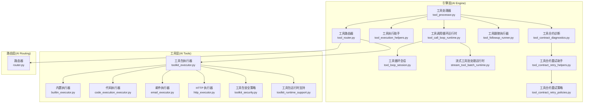
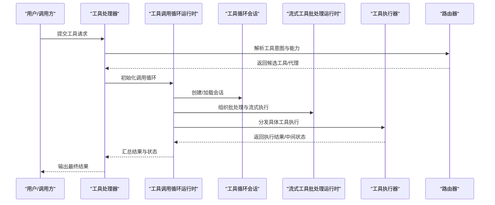
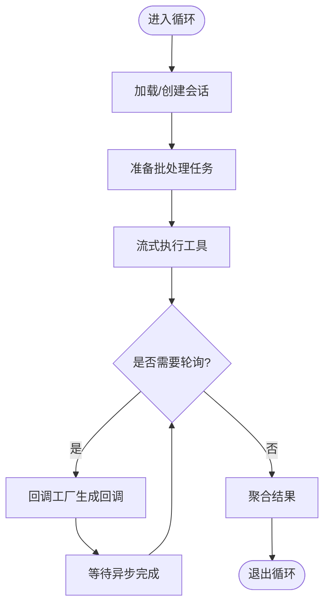
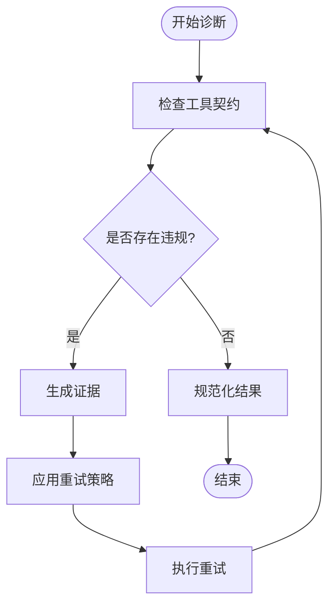
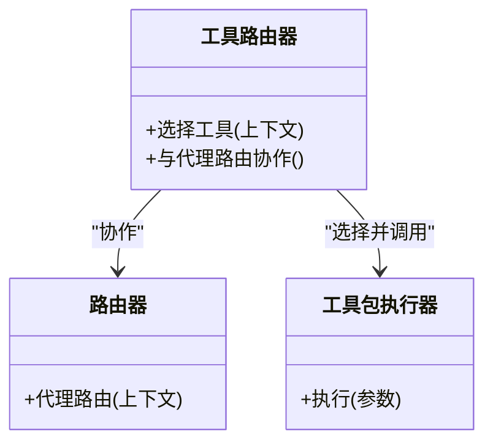
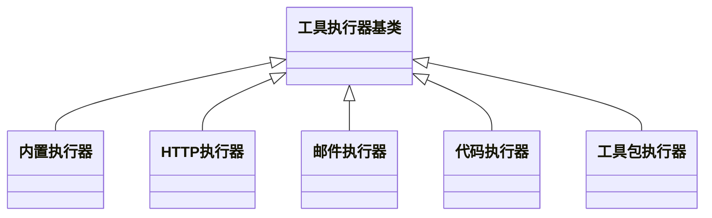
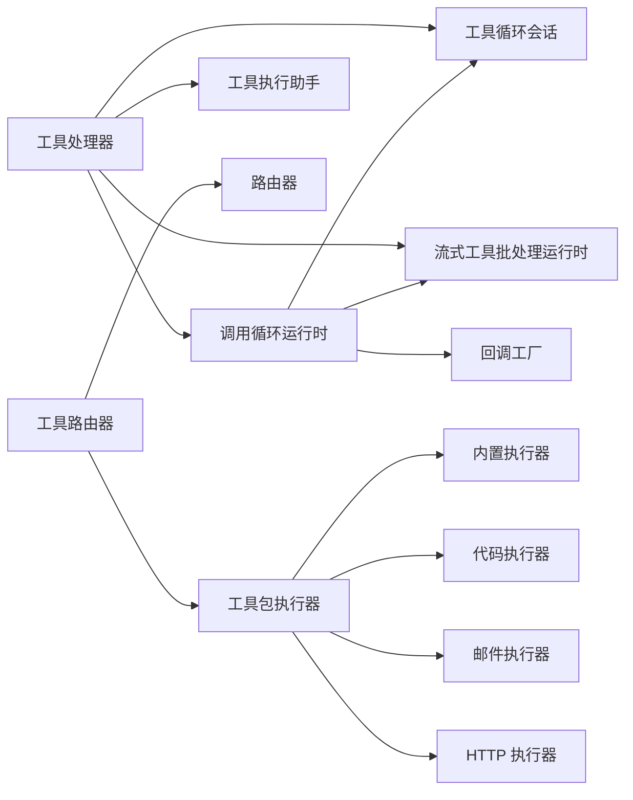

# 工具执行系统

<cite>
**本文引用的文件**
- [tool_processor.py](file://backend/app/ai/engine/tool_processor.py)
- [tool_call_loop_runtime.py](file://backend/app/ai/engine/tool_call_loop_runtime.py)
- [tool_call_loop_callbacks_factory.py](file://backend/app/ai/engine/tool_call_loop_callbacks_factory.py)
- [tool_loop_session.py](file://backend/app/ai/engine/tool_loop_session.py)
- [stream_tool_batch_runtime.py](file://backend/app/ai/engine/stream_tool_batch_runtime.py)
- [tool_execution_helpers.py](file://backend/app/ai/engine/tool_execution_helpers.py)
- [tool_contract_diagnostics.py](file://backend/app/ai/engine/tool_contract_diagnostics.py)
- [tool_contract_retry_helpers.py](file://backend/app/ai/engine/tool_contract_retry_helpers.py)
- [tool_contract_retry_policies.py](file://backend/app/ai/engine/tool_contract_retry_policies.py)
- [tool_followup_runner.py](file://backend/app/ai/engine/tool_followup_runner.py)
- [tool_router.py](file://backend/app/ai/engine/tool_router.py)
- [router.py](file://backend/app/ai/routing/router.py)
- [builtin_executor.py](file://backend/app/ai/tools/executors/builtin_executor.py)
- [code_execution_executor.py](file://backend/app/ai/tools/executors/code_execution_executor.py)
- [email_executor.py](file://backend/app/ai/tools/executors/email_executor.py)
- [http_executor.py](file://backend/app/ai/tools/executors/http_executor.py)
- [toolkit_executor.py](file://backend/app/ai/tools/executors/toolkit_executor.py)
- [toolkit_security.py](file://backend/app/ai/tools/toolkit_security.py)
- [toolkit_runtime_support.py](file://backend/app/ai/tools/toolkit_runtime_support.py)
- [toolkit_executor_test.py](file://backend/tests/test_toolkit_executor.py)
- [builtin_executor_safety_test.py](file://backend/tests/test_builtin_executor_safety.py)
- [tool_router_test.py](file://backend/tests/ai/engine/test_tool_router.py)
- [turn_executor.py](file://backend/app/ai/engine/turn_executor.py)
- [turn_executor_tool_batch.py](file://backend/app/ai/engine/turn_executor_tool_batch.py)
- [turn_executor_contracts.py](file://backend/app/ai/engine/turn_executor_contracts.py)
</cite>

## 目录
1. [简介](#简介)
2. [项目结构](#项目结构)
3. [核心组件](#核心组件)
4. [架构总览](#架构总览)
5. [详细组件分析](#详细组件分析)
6. [依赖关系分析](#依赖关系分析)
7. [性能考量](#性能考量)
8. [故障排查指南](#故障排查指南)
9. [结论](#结论)
10. [附录](#附录)

## 简介
本文件面向开发者与架构师，系统性解析工具执行系统的设计与实现，重点覆盖以下方面：
- 工具处理器：负责工具选择、参数准备、执行调度与结果归一化
- 执行助手：封装工具调用的通用流程、错误恢复与状态管理
- 路由器：在工具链路中进行工具选择与路径决策
- 工具调用循环运行时：会话管理、批量执行、回调工厂与轮询
- 合约诊断与重试策略：工具契约违规分析、重试策略与结果规范化
- 安全策略与输出支持：沙箱、权限控制与输出过滤
- 性能监控与最佳实践：资源预算、流式执行与可观测性

## 项目结构
工具执行系统位于后端 AI 引擎与工具层之间，形成“引擎-工具-执行器”的分层架构。核心文件分布如下：
- 引擎层（AI Engine）：工具处理器、调用循环、会话、批处理、合约诊断与重试、跟随执行器等
- 工具层（AI Tools）：内置执行器、HTTP 执行器、邮件执行器、代码执行器、工具包执行器及安全与运行时支持
- 路由层（AI Routing）：工具路由与代理路由能力

图表来源
- [tool_processor.py](file://backend/app/ai/engine/tool_processor.py)
- [tool_call_loop_runtime.py](file://backend/app/ai/engine/tool_call_loop_runtime.py)
- [tool_loop_session.py](file://backend/app/ai/engine/tool_loop_session.py)
- [stream_tool_batch_runtime.py](file://backend/app/ai/engine/stream_tool_batch_runtime.py)
- [tool_execution_helpers.py](file://backend/app/ai/engine/tool_execution_helpers.py)
- [tool_contract_diagnostics.py](file://backend/app/ai/engine/tool_contract_diagnostics.py)
- [tool_contract_retry_helpers.py](file://backend/app/ai/engine/tool_contract_retry_helpers.py)
- [tool_contract_retry_policies.py](file://backend/app/ai/engine/tool_contract_retry_policies.py)
- [tool_followup_runner.py](file://backend/app/ai/engine/tool_followup_runner.py)
- [tool_router.py](file://backend/app/ai/engine/tool_router.py)
- [router.py](file://backend/app/ai/routing/router.py)
- [builtin_executor.py](file://backend/app/ai/tools/executors/builtin_executor.py)
- [code_execution_executor.py](file://backend/app/ai/tools/executors/code_execution_executor.py)
- [email_executor.py](file://backend/app/ai/tools/executors/email_executor.py)
- [http_executor.py](file://backend/app/ai/tools/executors/http_executor.py)
- [toolkit_executor.py](file://backend/app/ai/tools/executors/toolkit_executor.py)
- [toolkit_security.py](file://backend/app/ai/tools/toolkit_security.py)
- [toolkit_runtime_support.py](file://backend/app/ai/tools/toolkit_runtime_support.py)

章节来源
- [tool_processor.py](file://backend/app/ai/engine/tool_processor.py)
- [tool_router.py](file://backend/app/ai/engine/tool_router.py)
- [router.py](file://backend/app/ai/routing/router.py)

## 核心组件
- 工具处理器：负责从上下文提取工具意图、构建调用参数、选择执行器并驱动执行与结果归一化
- 工具调用循环运行时：维护调用生命周期、处理轮询与回调、协调批处理与流式输出
- 工具循环会话：保存对话上下文、工具调用历史与状态，支持回放与恢复
- 流式工具批处理运行时：对多工具调用进行批量化与流式化处理，提升吞吐与延迟表现
- 工具执行助手：封装执行前检查、执行后恢复、错误分类与状态更新
- 工具合约诊断与重试：识别契约违规、生成证据、制定重试策略并规范化结果
- 工具跟随执行器：在一次工具调用后触发后续工具链路，实现复杂工作流
- 工具路由器：根据上下文与能力选择合适的工具或代理路由
- 工具执行器族：内置执行器、HTTP 执行器、邮件执行器、代码执行器、工具包执行器

章节来源
- [tool_processor.py](file://backend/app/ai/engine/tool_processor.py)
- [tool_call_loop_runtime.py](file://backend/app/ai/engine/tool_call_loop_runtime.py)
- [tool_loop_session.py](file://backend/app/ai/engine/tool_loop_session.py)
- [stream_tool_batch_runtime.py](file://backend/app/ai/engine/stream_tool_batch_runtime.py)
- [tool_execution_helpers.py](file://backend/app/ai/engine/tool_execution_helpers.py)
- [tool_contract_diagnostics.py](file://backend/app/ai/engine/tool_contract_diagnostics.py)
- [tool_contract_retry_helpers.py](file://backend/app/ai/engine/tool_contract_retry_helpers.py)
- [tool_contract_retry_policies.py](file://backend/app/ai/engine/tool_contract_retry_policies.py)
- [tool_followup_runner.py](file://backend/app/ai/engine/tool_followup_runner.py)
- [tool_router.py](file://backend/app/ai/engine/tool_router.py)
- [builtin_executor.py](file://backend/app/ai/tools/executors/builtin_executor.py)
- [http_executor.py](file://backend/app/ai/tools/executors/http_executor.py)
- [email_executor.py](file://backend/app/ai/tools/executors/email_executor.py)
- [code_execution_executor.py](file://backend/app/ai/tools/executors/code_execution_executor.py)
- [toolkit_executor.py](file://backend/app/ai/tools/executors/toolkit_executor.py)

## 架构总览
工具执行系统采用“引擎-工具-路由”三层协作：
- 引擎层：统一编排工具选择、执行、恢复与输出
- 工具层：提供可插拔的执行器，支持安全与运行时增强
- 路由层：在工具与代理之间做智能选择

图表来源
- [tool_processor.py](file://backend/app/ai/engine/tool_processor.py)
- [tool_call_loop_runtime.py](file://backend/app/ai/engine/tool_call_loop_runtime.py)
- [tool_loop_session.py](file://backend/app/ai/engine/tool_loop_session.py)
- [stream_tool_batch_runtime.py](file://backend/app/ai/engine/stream_tool_batch_runtime.py)
- [tool_router.py](file://backend/app/ai/engine/tool_router.py)

## 详细组件分析

### 工具处理器（Tool Processor）
职责与流程
- 从上下文提取工具意图与参数
- 选择执行器并准备执行环境
- 驱动执行助手完成执行与恢复
- 规范化结果并返回给调用循环

关键点
- 参数准备与校验
- 执行器选择与路由
- 结果归一化与错误传播

章节来源
- [tool_processor.py](file://backend/app/ai/engine/tool_processor.py)

### 工具调用循环运行时（Tool Call Loop Runtime）
职责与流程
- 维护工具调用生命周期
- 协调会话、批处理与流式输出
- 处理轮询与回调工厂
- 支持中断、恢复与重试

关键点
- 会话状态管理
- 批量执行与流式处理
- 回调工厂与轮询策略

图表来源
- [tool_call_loop_runtime.py](file://backend/app/ai/engine/tool_call_loop_runtime.py)
- [tool_call_loop_callbacks_factory.py](file://backend/app/ai/engine/tool_call_loop_callbacks_factory.py)
- [tool_loop_session.py](file://backend/app/ai/engine/tool_loop_session.py)
- [stream_tool_batch_runtime.py](file://backend/app/ai/engine/stream_tool_batch_runtime.py)

章节来源
- [tool_call_loop_runtime.py](file://backend/app/ai/engine/tool_call_loop_runtime.py)
- [tool_call_loop_callbacks_factory.py](file://backend/app/ai/engine/tool_call_loop_callbacks_factory.py)
- [tool_loop_session.py](file://backend/app/ai/engine/tool_loop_session.py)
- [stream_tool_batch_runtime.py](file://backend/app/ai/engine/stream_tool_batch_runtime.py)

### 工具循环会话（Tool Loop Session）
职责与流程
- 记录工具调用历史与上下文
- 支持回放、恢复与状态迁移
- 与调用循环运行时协同

关键点
- 上下文持久化
- 历史记录与回放
- 与执行助手的状态同步

章节来源
- [tool_loop_session.py](file://backend/app/ai/engine/tool_loop_session.py)

### 流式工具批处理运行时（Stream Tool Batch Runtime）
职责与流程
- 将多个工具调用组织为批处理
- 在流式场景中提升吞吐与降低延迟
- 与调用循环运行时配合

关键点
- 批量调度与并发控制
- 流式输出与事件驱动
- 与执行助手的集成

章节来源
- [stream_tool_batch_runtime.py](file://backend/app/ai/engine/stream_tool_batch_runtime.py)

### 工具执行助手（Tool Execution Helpers）
职责与流程
- 执行前检查与预处理
- 执行后恢复与状态更新
- 错误分类与失败处理
- 与恢复管理器协作

关键点
- 预飞行检查
- 执行后恢复
- 失败分类与重试触发

章节来源
- [tool_execution_helpers.py](file://backend/app/ai/engine/tool_execution_helpers.py)

### 工具合约诊断与重试（Contract Diagnostics & Retry）
职责与流程
- 诊断工具调用是否违反契约
- 生成证据与违规报告
- 制定重试策略并执行
- 规范化结果格式

关键点
- 合约违规检测
- 证据收集与报告
- 重试策略与幂等性
- 结果规范化

图表来源
- [tool_contract_diagnostics.py](file://backend/app/ai/engine/tool_contract_diagnostics.py)
- [tool_contract_retry_helpers.py](file://backend/app/ai/engine/tool_contract_retry_helpers.py)
- [tool_contract_retry_policies.py](file://backend/app/ai/engine/tool_contract_retry_policies.py)

章节来源
- [tool_contract_diagnostics.py](file://backend/app/ai/engine/tool_contract_diagnostics.py)
- [tool_contract_retry_helpers.py](file://backend/app/ai/engine/tool_contract_retry_helpers.py)
- [tool_contract_retry_policies.py](file://backend/app/ai/engine/tool_contract_retry_policies.py)

### 工具跟随执行器（Tool Follow-up Runner）
职责与流程
- 在一次工具调用完成后触发后续工具链路
- 实现复杂工作流与条件执行
- 与调用循环运行时协同

关键点
- 条件判断与链路触发
- 与循环运行时的状态同步
- 失败隔离与回滚

章节来源
- [tool_followup_runner.py](file://backend/app/ai/engine/tool_followup_runner.py)

### 工具路由器（Tool Router）
职责与流程
- 根据上下文与能力选择工具
- 与代理路由协作实现跨工具链路
- 与执行器族对接

关键点
- 工具选择策略
- 与代理路由的协作
- 与执行器族的解耦

图表来源
- [tool_router.py](file://backend/app/ai/engine/tool_router.py)
- [router.py](file://backend/app/ai/routing/router.py)
- [toolkit_executor.py](file://backend/app/ai/tools/executors/toolkit_executor.py)

章节来源
- [tool_router.py](file://backend/app/ai/engine/tool_router.py)
- [router.py](file://backend/app/ai/routing/router.py)

### 工具执行器族（Executors）
- 内置执行器：提供基础 JSON/数学/时间操作
- HTTP 执行器：发起 HTTP 请求并处理响应
- 邮件执行器：发送邮件
- 代码执行器：在受控环境下执行代码
- 工具包执行器：封装复杂工具集，提供统一入口

图表来源
- [builtin_executor.py](file://backend/app/ai/tools/executors/builtin_executor.py)
- [http_executor.py](file://backend/app/ai/tools/executors/http_executor.py)
- [email_executor.py](file://backend/app/ai/tools/executors/email_executor.py)
- [code_execution_executor.py](file://backend/app/ai/tools/executors/code_execution_executor.py)
- [toolkit_executor.py](file://backend/app/ai/tools/executors/toolkit_executor.py)

章节来源
- [builtin_executor.py](file://backend/app/ai/tools/executors/builtin_executor.py)
- [http_executor.py](file://backend/app/ai/tools/executors/http_executor.py)
- [email_executor.py](file://backend/app/ai/tools/executors/email_executor.py)
- [code_execution_executor.py](file://backend/app/ai/tools/executors/code_execution_executor.py)
- [toolkit_executor.py](file://backend/app/ai/tools/executors/toolkit_executor.py)

### 轮询管理与回调工厂（Polling & Callback Factory）
- 回调工厂：根据工具类型与状态生成回调函数
- 轮询管理：在异步工具调用完成后进行轮询直至完成
- 与调用循环运行时协同，确保非阻塞执行

章节来源
- [tool_call_loop_callbacks_factory.py](file://backend/app/ai/engine/tool_call_loop_callbacks_factory.py)
- [tool_call_loop_runtime.py](file://backend/app/ai/engine/tool_call_loop_runtime.py)

### 安全策略与输出支持（Security & Output Support）
- 工具包安全策略：限制工具包执行的权限与资源
- 运行时支持：提供沙箱与隔离环境
- 输出支持：对输出进行过滤与规范化

章节来源
- [toolkit_security.py](file://backend/app/ai/tools/toolkit_security.py)
- [toolkit_runtime_support.py](file://backend/app/ai/tools/toolkit_runtime_support.py)

### 性能监控与最佳实践
- 资源预算与配额：通过预算守卫与限额器控制资源消耗
- 流式执行：利用流式管线与批处理提升吞吐
- 可观测性：通过流式钩子与记录支持进行监控与审计

章节来源
- [tool_execution_helpers.py](file://backend/app/ai/engine/tool_execution_helpers.py)
- [stream_tool_batch_runtime.py](file://backend/app/ai/engine/stream_tool_batch_runtime.py)

## 依赖关系分析
工具执行系统的关键依赖关系如下：
- 工具处理器依赖调用循环运行时、会话、批处理与执行助手
- 调用循环运行时依赖会话、批处理、回调工厂与轮询管理
- 工具路由器依赖路由器与工具包执行器
- 工具执行器族彼此独立，通过工具包执行器统一接入

图表来源
- [tool_processor.py](file://backend/app/ai/engine/tool_processor.py)
- [tool_call_loop_runtime.py](file://backend/app/ai/engine/tool_call_loop_runtime.py)
- [tool_call_loop_callbacks_factory.py](file://backend/app/ai/engine/tool_call_loop_callbacks_factory.py)
- [tool_loop_session.py](file://backend/app/ai/engine/tool_loop_session.py)
- [stream_tool_batch_runtime.py](file://backend/app/ai/engine/stream_tool_batch_runtime.py)
- [tool_router.py](file://backend/app/ai/engine/tool_router.py)
- [router.py](file://backend/app/ai/routing/router.py)
- [toolkit_executor.py](file://backend/app/ai/tools/executors/toolkit_executor.py)
- [builtin_executor.py](file://backend/app/ai/tools/executors/builtin_executor.py)
- [code_execution_executor.py](file://backend/app/ai/tools/executors/code_execution_executor.py)
- [email_executor.py](file://backend/app/ai/tools/executors/email_executor.py)
- [http_executor.py](file://backend/app/ai/tools/executors/http_executor.py)

章节来源
- [tool_processor.py](file://backend/app/ai/engine/tool_processor.py)
- [tool_call_loop_runtime.py](file://backend/app/ai/engine/tool_call_loop_runtime.py)
- [tool_call_loop_callbacks_factory.py](file://backend/app/ai/engine/tool_call_loop_callbacks_factory.py)
- [tool_loop_session.py](file://backend/app/ai/engine/tool_loop_session.py)
- [stream_tool_batch_runtime.py](file://backend/app/ai/engine/stream_tool_batch_runtime.py)
- [tool_router.py](file://backend/app/ai/engine/tool_router.py)
- [router.py](file://backend/app/ai/routing/router.py)
- [toolkit_executor.py](file://backend/app/ai/tools/executors/toolkit_executor.py)

## 性能考量
- 并发与批处理：通过流式批处理运行时提升吞吐，减少等待时间
- 轮询与回调：异步工具调用采用回调工厂与轮询管理，避免阻塞
- 资源预算：预算守卫与限额器控制工具调用频率与资源占用
- 流式管线：利用流式生成与完成管线，降低端到端延迟

## 故障排查指南
- 合约违规：通过工具合约诊断生成证据，定位违规原因并调整策略
- 重试策略：依据重试助手与策略，自动或手动触发重试
- 执行失败：借助执行助手进行状态更新与恢复，必要时回滚
- 安全问题：检查工具包安全策略与运行时支持，确保沙箱与权限控制生效

章节来源
- [tool_contract_diagnostics.py](file://backend/app/ai/engine/tool_contract_diagnostics.py)
- [tool_contract_retry_helpers.py](file://backend/app/ai/engine/tool_contract_retry_helpers.py)
- [tool_execution_helpers.py](file://backend/app/ai/engine/tool_execution_helpers.py)
- [toolkit_security.py](file://backend/app/ai/tools/toolkit_security.py)

## 结论
工具执行系统通过“引擎-工具-路由”三层协作，实现了高内聚、低耦合的工具链路编排。其核心优势包括：
- 明确的生命周期管理与会话机制
- 可插拔的执行器族与安全策略
- 契约诊断与重试保障可靠性
- 流式批处理与轮询管理提升性能
- 良好的扩展性与可观测性

## 附录
- 配置与扩展接口参考
  - 工具处理器配置：参见 [tool_processor.py](file://backend/app/ai/engine/tool_processor.py)
  - 调用循环运行时配置：参见 [tool_call_loop_runtime.py](file://backend/app/ai/engine/tool_call_loop_runtime.py)
  - 回调工厂与轮询：参见 [tool_call_loop_callbacks_factory.py](file://backend/app/ai/engine/tool_call_loop_callbacks_factory.py)
  - 会话管理：参见 [tool_loop_session.py](file://backend/app/ai/engine/tool_loop_session.py)
  - 批处理与流式执行：参见 [stream_tool_batch_runtime.py](file://backend/app/ai/engine/stream_tool_batch_runtime.py)
  - 合约诊断与重试：参见 [tool_contract_diagnostics.py](file://backend/app/ai/engine/tool_contract_diagnostics.py)、[tool_contract_retry_helpers.py](file://backend/app/ai/engine/tool_contract_retry_helpers.py)、[tool_contract_retry_policies.py](file://backend/app/ai/engine/tool_contract_retry_policies.py)
  - 路由器与代理路由：参见 [tool_router.py](file://backend/app/ai/engine/tool_router.py)、[router.py](file://backend/app/ai/routing/router.py)
  - 执行器族：参见 [builtin_executor.py](file://backend/app/ai/tools/executors/builtin_executor.py)、[http_executor.py](file://backend/app/ai/tools/executors/http_executor.py)、[email_executor.py](file://backend/app/ai/tools/executors/email_executor.py)、[code_execution_executor.py](file://backend/app/ai/tools/executors/code_execution_executor.py)、[toolkit_executor.py](file://backend/app/ai/tools/executors/toolkit_executor.py)
  - 安全策略与输出支持：参见 [toolkit_security.py](file://backend/app/ai/tools/toolkit_security.py)、[toolkit_runtime_support.py](file://backend/app/ai/tools/toolkit_runtime_support.py)
- 测试参考
  - 工具包执行器测试：参见 [toolkit_executor_test.py](file://backend/tests/test_toolkit_executor.py)
  - 内置执行器安全测试：参见 [builtin_executor_safety_test.py](file://backend/tests/test_builtin_executor_safety.py)
  - 工具路由器测试：参见 [tool_router_test.py](file://backend/tests/ai/engine/test_tool_router.py)
  - 转折执行器相关：参见 [turn_executor.py](file://backend/app/ai/engine/turn_executor.py)、[turn_executor_tool_batch.py](file://backend/app/ai/engine/turn_executor_tool_batch.py)、[turn_executor_contracts.py](file://backend/app/ai/engine/turn_executor_contracts.py)