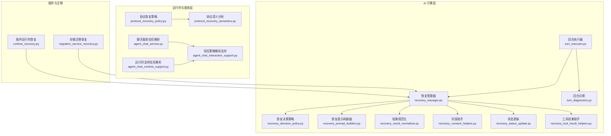
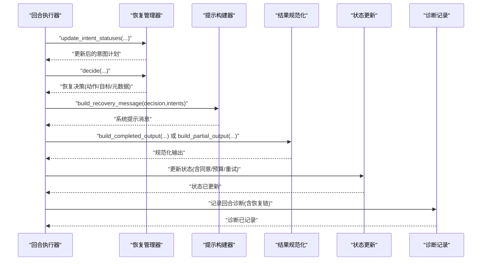
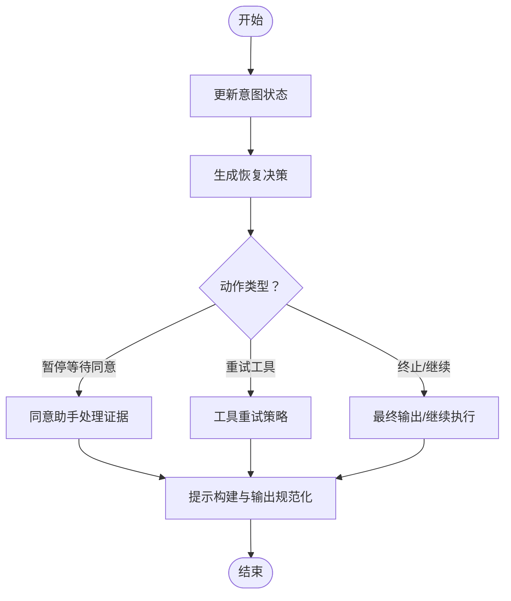
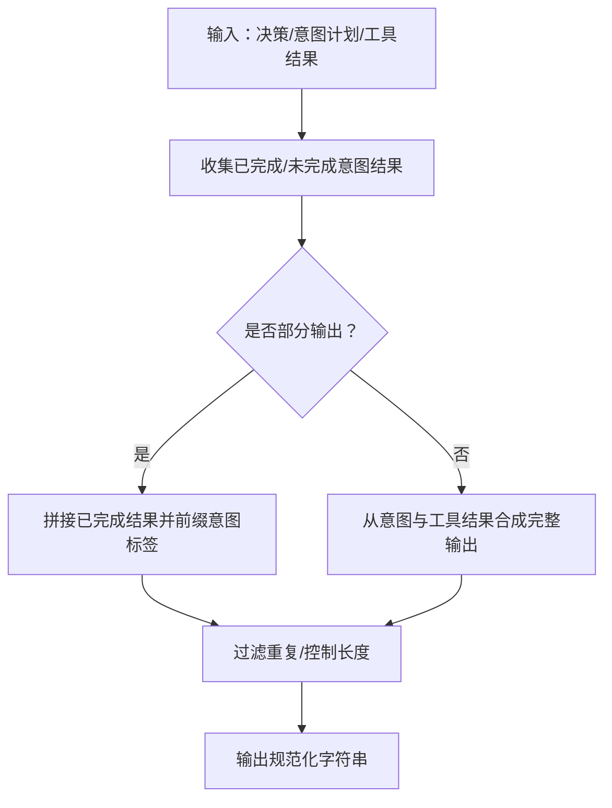
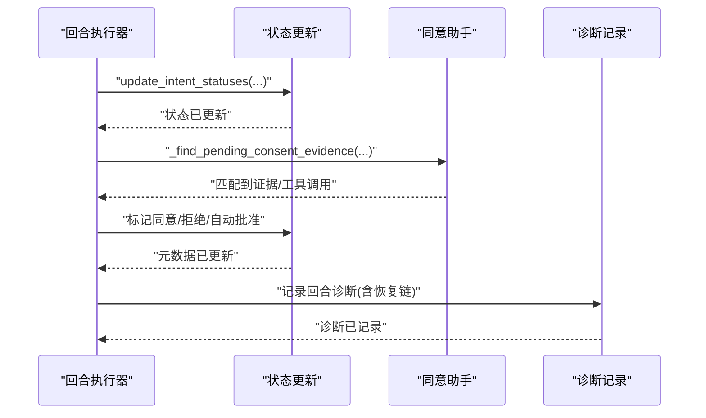
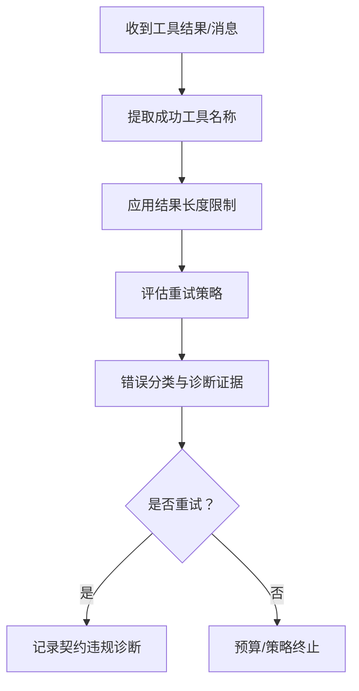
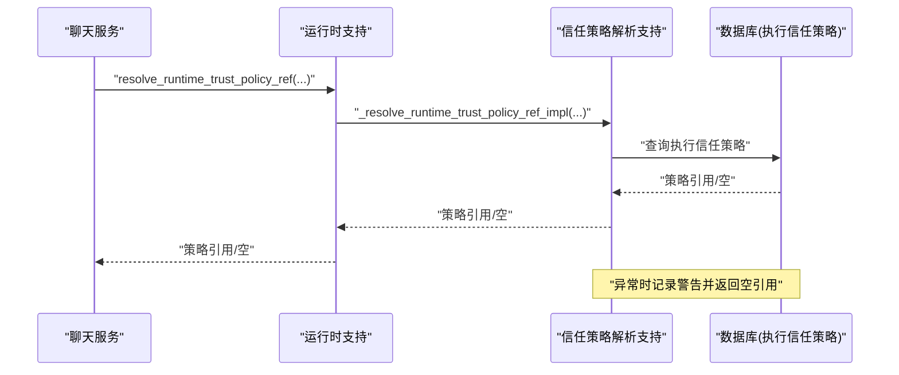
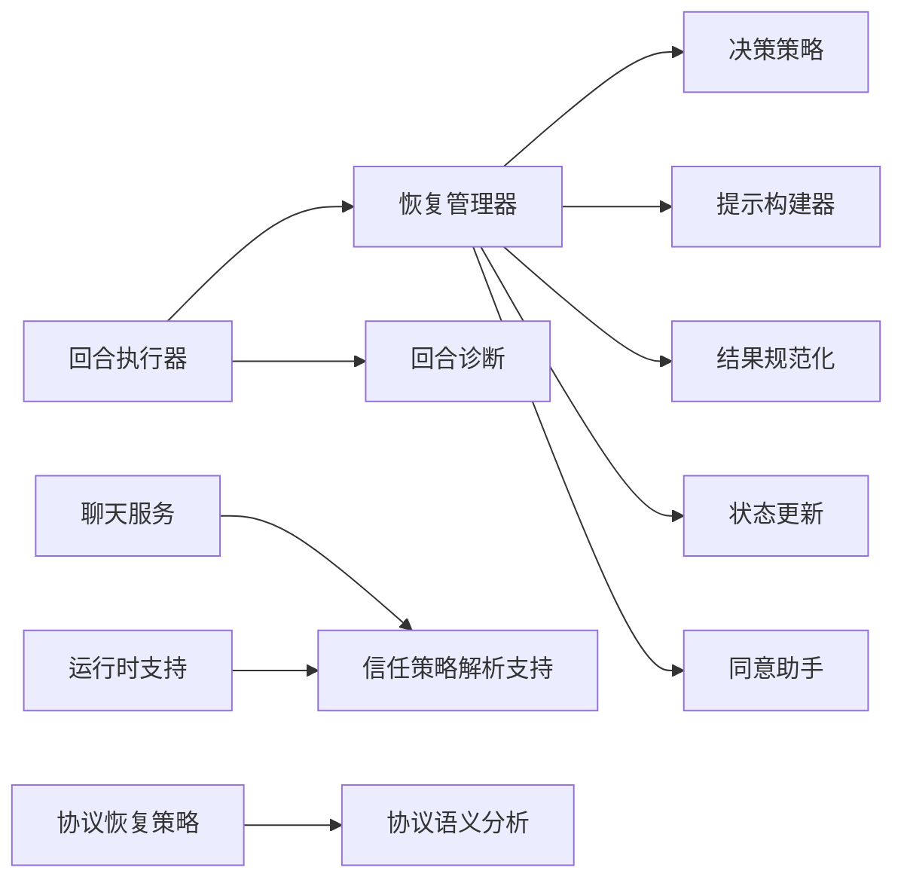

# 恢复系统

<cite>
**本文引用的文件**
- [recovery_manager.py](file://backend/app/ai/engine/recovery_manager.py)
- [recovery_decision_policy.py](file://backend/app/ai/engine/recovery_decision_policy.py)
- [recovery_prompt_builders.py](file://backend/app/ai/engine/recovery_prompt_builders.py)
- [recovery_result_normalizer.py](file://backend/app/ai/engine/recovery_result_normalizer.py)
- [recovery_consent_helpers.py](file://backend/app/ai/engine/recovery_consent_helpers.py)
- [recovery_status_update.py](file://backend/app/ai/engine/recovery_status_update.py)
- [recovery_tool_result_helpers.py](file://backend/app/ai/engine/recovery_tool_result_helpers.py)
- [turn_executor.py](file://backend/app/ai/engine/turn_executor.py)
- [turn_diagnostics.py](file://backend/app/ai/engine/turn_diagnostics.py)
- [protocol_recovery_policy.py](file://backend/app/ai/runtime/protocol_recovery_policy.py)
- [protocol_recovery_semantics.py](file://backend/app/ai/runtime/protocol_recovery_semantics.py)
- [agent_chat_interaction_support.py](file://backend/app/services/ai/agent_chat_interaction_support.py)
- [agent_chat_service.py](file://backend/app/services/ai/agent_chat_service.py)
- [agent_chat_runtime_support.py](file://backend/app/services/ai/agent_chat_runtime_support.py)
- [test_recovery_manager_consent.py](file://backend/tests/ai/engine/test_recovery_manager_consent.py)
- [test_turn_executor.py](file://backend/tests/ai/engine/test_turn_executor.py)
- [test_protocol_recovery_policy.py](file://backend/tests/ai/engine/test_protocol_recovery_policy.py)
- [migration_service_recovery.py](file://backend/plugins/storage-migration/backend/services/migration_service_recovery.py)
- [runtime_recovery.py](file://backend/app/plugins/runtime_recovery.py)
- [test_plugin_runtime_recovery.py](file://backend/tests/test_plugin_runtime_recovery.py)
- [test_scheduler_recovery.py](file://backend/tests/tasks/test_scheduler_recovery.py)
- [tool_contract_retry_policies.py](file://backend/app/ai/engine/tool_contract_retry_policies.py)
- [tool_contract_retry_helpers.py](file://backend/app/ai/engine/tool_contract_retry_helpers.py)
- [tool_contract_diagnostics.py](file://backend/app/ai/engine/tool_contract_diagnostics.py)
- [failure_classifier.py](file://backend/app/ai/engine/failure_classifier.py)
- [contract_diagnostics_helpers.py](file://backend/app/ai/engine/contract_diagnostics_helpers.py)
- [20260329_0040_add_execution_trust_policies.py](file://backend/migrations/versions/20260329_0040_add_execution_trust_policies.py)
</cite>

## 目录
1. [简介](#简介)
2. [项目结构](#项目结构)
3. [核心组件](#核心组件)
4. [架构总览](#架构总览)
5. [详细组件分析](#详细组件分析)
6. [依赖关系分析](#依赖关系分析)
7. [性能考量](#性能考量)
8. [故障排查指南](#故障排查指南)
9. [结论](#结论)
10. [附录](#附录)

## 简介
本文件系统性梳理并阐释恢复系统的整体设计与实现，覆盖恢复管理器、决策策略、提示构建器、结果规范化、同意助手与状态更新机制；同时深入解析恢复工具结果助手、重试策略与错误分类处理，以及协议恢复策略、语义分析与信任管理。文档通过图示化方式呈现关键流程，并提供可直接定位到源码的路径指引，帮助开发者快速理解并扩展恢复系统的容错能力。

## 项目结构
恢复系统主要分布在 AI 引擎层（engine）与运行时（runtime）层，配合服务层的信任策略解析与状态更新逻辑，形成“决策—提示—执行—反馈”的闭环。

图表来源
- [recovery_manager.py](file://backend/app/ai/engine/recovery_manager.py)
- [recovery_decision_policy.py](file://backend/app/ai/engine/recovery_decision_policy.py)
- [recovery_prompt_builders.py](file://backend/app/ai/engine/recovery_prompt_builders.py)
- [recovery_result_normalizer.py](file://backend/app/ai/engine/recovery_result_normalizer.py)
- [recovery_consent_helpers.py](file://backend/app/ai/engine/recovery_consent_helpers.py)
- [recovery_status_update.py](file://backend/app/ai/engine/recovery_status_update.py)
- [recovery_tool_result_helpers.py](file://backend/app/ai/engine/recovery_tool_result_helpers.py)
- [turn_executor.py](file://backend/app/ai/engine/turn_executor.py)
- [turn_diagnostics.py](file://backend/app/ai/engine/turn_diagnostics.py)
- [protocol_recovery_policy.py](file://backend/app/ai/runtime/protocol_recovery_policy.py)
- [protocol_recovery_semantics.py](file://backend/app/ai/runtime/protocol_recovery_semantics.py)
- [agent_chat_interaction_support.py](file://backend/app/services/ai/agent_chat_interaction_support.py)
- [agent_chat_service.py](file://backend/app/services/ai/agent_chat_service.py)
- [agent_chat_runtime_support.py](file://backend/app/services/ai/agent_chat_runtime_support.py)
- [runtime_recovery.py](file://backend/app/plugins/runtime_recovery.py)
- [migration_service_recovery.py](file://backend/plugins/storage-migration/backend/services/migration_service_recovery.py)

章节来源
- [recovery_manager.py](file://backend/app/ai/engine/recovery_manager.py)
- [turn_executor.py](file://backend/app/ai/engine/turn_executor.py)

## 核心组件
- 恢复管理器：负责综合意图计划、工具调用证据与对话状态，生成恢复动作、目标意图与元数据，并驱动后续提示构建与输出规范化。
- 决策策略：定义在不同失败场景下的恢复动作选择，如暂停等待同意、重试工具调用、终止或继续等。
- 提示构建器：根据恢复决策与已完成/未完成意图，构造面向 LLM 的系统提示，确保上下文清晰且约束明确。
- 结果规范化：对部分/完整输出进行统一格式化，保证用户可见文本友好、可审计且符合合同约束。
- 同意助手：处理“待审批”意图的证据收集与状态标记，确保合规与可追溯。
- 状态更新：在回合执行过程中，基于消息与工具结果更新意图状态，必要时触发预算退出与恢复决策。
- 工具结果助手：提取成功工具名称、限制单次恢复结果长度等，辅助输出与诊断。
- 协议恢复策略与语义分析：在运行时层面定义协议级恢复规则与语义判定，保障跨适配器一致性。
- 信任策略解析：在服务层解析当前会话的执行信任策略，影响可用工具集与风险上限。
- 插件与迁移恢复：在插件生命周期与存储迁移中注入恢复与回退机制。

章节来源
- [recovery_manager.py](file://backend/app/ai/engine/recovery_manager.py)
- [recovery_decision_policy.py](file://backend/app/ai/engine/recovery_decision_policy.py)
- [recovery_prompt_builders.py](file://backend/app/ai/engine/recovery_prompt_builders.py)
- [recovery_result_normalizer.py](file://backend/app/ai/engine/recovery_result_normalizer.py)
- [recovery_consent_helpers.py](file://backend/app/ai/engine/recovery_consent_helpers.py)
- [recovery_status_update.py](file://backend/app/ai/engine/recovery_status_update.py)
- [recovery_tool_result_helpers.py](file://backend/app/ai/engine/recovery_tool_result_helpers.py)
- [protocol_recovery_policy.py](file://backend/app/ai/runtime/protocol_recovery_policy.py)
- [protocol_recovery_semantics.py](file://backend/app/ai/runtime/protocol_recovery_semantics.py)
- [agent_chat_interaction_support.py](file://backend/app/services/ai/agent_chat_interaction_support.py)
- [agent_chat_service.py](file://backend/app/services/ai/agent_chat_service.py)
- [agent_chat_runtime_support.py](file://backend/app/services/ai/agent_chat_runtime_support.py)
- [runtime_recovery.py](file://backend/app/plugins/runtime_recovery.py)
- [migration_service_recovery.py](file://backend/plugins/storage-migration/backend/services/migration_service_recovery.py)

## 架构总览
恢复系统围绕“意图计划 + 对话证据 + 工具结果”三要素进行决策与恢复，贯穿提示构建、输出规范化、状态更新与诊断记录。

图表来源
- [turn_executor.py](file://backend/app/ai/engine/turn_executor.py)
- [recovery_manager.py](file://backend/app/ai/engine/recovery_manager.py)
- [recovery_prompt_builders.py](file://backend/app/ai/engine/recovery_prompt_builders.py)
- [recovery_result_normalizer.py](file://backend/app/ai/engine/recovery_result_normalizer.py)
- [recovery_status_update.py](file://backend/app/ai/engine/recovery_status_update.py)
- [turn_diagnostics.py](file://backend/app/ai/engine/turn_diagnostics.py)

## 详细组件分析

### 恢复管理器与决策策略
- 恢复管理器负责：
  - 基于当前回合消息与工具结果，更新意图状态；
  - 综合失败原因、预算与工具可用性，决定恢复动作（如暂停等待同意、重试工具、终止等）；
  - 生成包含目标意图 ID、已完成/未完成意图集合、允许工具列表与元数据的决策对象。
- 决策策略模块定义了在不同失败类型（如预算耗尽、工具契约违规、超时等）下的动作选择逻辑，确保系统在异常情况下仍能收敛。

图表来源
- [recovery_manager.py](file://backend/app/ai/engine/recovery_manager.py)
- [recovery_decision_policy.py](file://backend/app/ai/engine/recovery_decision_policy.py)
- [recovery_consent_helpers.py](file://backend/app/ai/engine/recovery_consent_helpers.py)

章节来源
- [recovery_manager.py](file://backend/app/ai/engine/recovery_manager.py)
- [recovery_decision_policy.py](file://backend/app/ai/engine/recovery_decision_policy.py)
- [recovery_consent_helpers.py](file://backend/app/ai/engine/recovery_consent_helpers.py)

### 提示构建器与结果规范化
- 提示构建器根据恢复决策与意图计划，构造系统提示，强调“仅完成剩余意图”，并列出已完成与允许使用的工具，确保 LLM 在受限上下文中聚焦修复。
- 结果规范化负责：
  - 部分输出：聚合已完成意图的结果，按需前缀意图标签，过滤重复项，控制长度；
  - 完整输出：在无可见消息时，从意图计划与工具结果合成最终输出，标注合同违规类型与恢复原因。

图表来源
- [recovery_prompt_builders.py](file://backend/app/ai/engine/recovery_prompt_builders.py)
- [recovery_result_normalizer.py](file://backend/app/ai/engine/recovery_result_normalizer.py)

章节来源
- [recovery_prompt_builders.py](file://backend/app/ai/engine/recovery_prompt_builders.py)
- [recovery_result_normalizer.py](file://backend/app/ai/engine/recovery_result_normalizer.py)

### 同意助手与状态更新机制
- 同意助手在“待审批”意图上收集证据，匹配消息中的 pending_consent 字段或工具调用内的证据，标记同意/拒绝/自动批准状态，并更新元数据。
- 状态更新在回合执行期间持续进行，包括：
  - 基于消息与工具结果更新意图状态；
  - 预算耗尽时触发部分退出；
  - 工具契约违规时记录诊断并决定是否重试。

图表来源
- [recovery_status_update.py](file://backend/app/ai/engine/recovery_status_update.py)
- [recovery_consent_helpers.py](file://backend/app/ai/engine/recovery_consent_helpers.py)
- [turn_executor.py](file://backend/app/ai/engine/turn_executor.py)
- [turn_diagnostics.py](file://backend/app/ai/engine/turn_diagnostics.py)

章节来源
- [recovery_status_update.py](file://backend/app/ai/engine/recovery_status_update.py)
- [recovery_consent_helpers.py](file://backend/app/ai/engine/recovery_consent_helpers.py)
- [turn_executor.py](file://backend/app/ai/engine/turn_executor.py)
- [turn_diagnostics.py](file://backend/app/ai/engine/turn_diagnostics.py)

### 工具结果助手、重试策略与错误分类
- 工具结果助手：
  - 提取成功工具名称，避免重复；
  - 提供默认恢复结果最大长度，用于控制输出体积。
- 重试策略与错误分类：
  - 工具契约重试策略与辅助函数定义了在契约违规时的重试行为；
  - 错误分类器与诊断辅助模块负责识别失败类别与生成诊断证据，支撑恢复决策。
- 回合执行器在无工具调用但需要强制重试时，记录工具契约诊断并决定失败重试。

图表来源
- [recovery_tool_result_helpers.py](file://backend/app/ai/engine/recovery_tool_result_helpers.py)
- [tool_contract_retry_policies.py](file://backend/app/ai/engine/tool_contract_retry_policies.py)
- [tool_contract_retry_helpers.py](file://backend/app/ai/engine/tool_contract_retry_helpers.py)
- [tool_contract_diagnostics.py](file://backend/app/ai/engine/tool_contract_diagnostics.py)
- [failure_classifier.py](file://backend/app/ai/engine/failure_classifier.py)
- [contract_diagnostics_helpers.py](file://backend/app/ai/engine/contract_diagnostics_helpers.py)
- [turn_executor.py](file://backend/app/ai/engine/turn_executor.py)

章节来源
- [recovery_tool_result_helpers.py](file://backend/app/ai/engine/recovery_tool_result_helpers.py)
- [tool_contract_retry_policies.py](file://backend/app/ai/engine/tool_contract_retry_policies.py)
- [tool_contract_retry_helpers.py](file://backend/app/ai/engine/tool_contract_retry_helpers.py)
- [tool_contract_diagnostics.py](file://backend/app/ai/engine/tool_contract_diagnostics.py)
- [failure_classifier.py](file://backend/app/ai/engine/failure_classifier.py)
- [contract_diagnostics_helpers.py](file://backend/app/ai/engine/contract_diagnostics_helpers.py)
- [turn_executor.py](file://backend/app/ai/engine/turn_executor.py)

### 协议恢复策略、语义分析与信任管理
- 协议恢复策略与语义分析：
  - 在运行时层面定义协议级恢复规则，确保不同适配器在契约违规或异常时遵循一致的恢复流程；
  - 语义分析模块对消息与工具调用进行语义校验，辅助决策与诊断。
- 信任管理：
  - 聊天服务与运行时支持通过信任策略解析器获取当前会话的执行信任策略引用；
  - 解析过程具备降级保护，异常时记录警告并返回空引用，避免阻断主流程；
  - 数据库迁移脚本新增“执行信任策略”表，支撑策略持久化与查询。

图表来源
- [agent_chat_service.py](file://backend/app/services/ai/agent_chat_service.py)
- [agent_chat_runtime_support.py](file://backend/app/services/ai/agent_chat_runtime_support.py)
- [agent_chat_interaction_support.py](file://backend/app/services/ai/agent_chat_interaction_support.py)
- [20260329_0040_add_execution_trust_policies.py](file://backend/migrations/versions/20260329_0040_add_execution_trust_policies.py)

章节来源
- [protocol_recovery_policy.py](file://backend/app/ai/runtime/protocol_recovery_policy.py)
- [protocol_recovery_semantics.py](file://backend/app/ai/runtime/protocol_recovery_semantics.py)
- [agent_chat_service.py](file://backend/app/services/ai/agent_chat_service.py)
- [agent_chat_runtime_support.py](file://backend/app/services/ai/agent_chat_runtime_support.py)
- [agent_chat_interaction_support.py](file://backend/app/services/ai/agent_chat_interaction_support.py)
- [20260329_0040_add_execution_trust_policies.py](file://backend/migrations/versions/20260329_0040_add_execution_trust_policies.py)

### 插件与迁移恢复
- 插件运行时恢复：在插件生命周期中注入恢复与回退逻辑，确保插件加载/卸载/升级过程中的稳定性。
- 存储迁移恢复：针对存储迁移任务提供恢复能力，结合测试用例验证恢复流程。

章节来源
- [runtime_recovery.py](file://backend/app/plugins/runtime_recovery.py)
- [migration_service_recovery.py](file://backend/plugins/storage-migration/backend/services/migration_service_recovery.py)
- [test_plugin_runtime_recovery.py](file://backend/tests/test_plugin_runtime_recovery.py)
- [test_scheduler_recovery.py](file://backend/tests/tasks/test_scheduler_recovery.py)

## 依赖关系分析
- 组件内聚与耦合：
  - 恢复管理器作为中枢，依赖决策策略、提示构建器、结果规范化与状态更新；
  - 回合执行器在执行过程中调用恢复管理器与诊断模块，形成强关联；
  - 信任策略解析位于服务层，通过运行时支持间接影响恢复策略的可用工具集。
- 外部依赖：
  - 工具契约诊断与错误分类依赖 LLM 与工具调用证据；
  - 运行时协议策略依赖语义分析与策略表。

图表来源
- [turn_executor.py](file://backend/app/ai/engine/turn_executor.py)
- [recovery_manager.py](file://backend/app/ai/engine/recovery_manager.py)
- [recovery_decision_policy.py](file://backend/app/ai/engine/recovery_decision_policy.py)
- [recovery_prompt_builders.py](file://backend/app/ai/engine/recovery_prompt_builders.py)
- [recovery_result_normalizer.py](file://backend/app/ai/engine/recovery_result_normalizer.py)
- [recovery_status_update.py](file://backend/app/ai/engine/recovery_status_update.py)
- [recovery_consent_helpers.py](file://backend/app/ai/engine/recovery_consent_helpers.py)
- [turn_diagnostics.py](file://backend/app/ai/engine/turn_diagnostics.py)
- [agent_chat_service.py](file://backend/app/services/ai/agent_chat_service.py)
- [agent_chat_runtime_support.py](file://backend/app/services/ai/agent_chat_runtime_support.py)
- [agent_chat_interaction_support.py](file://backend/app/services/ai/agent_chat_interaction_support.py)
- [protocol_recovery_policy.py](file://backend/app/ai/runtime/protocol_recovery_policy.py)
- [protocol_recovery_semantics.py](file://backend/app/ai/runtime/protocol_recovery_semantics.py)

## 性能考量
- 输出长度控制：通过工具结果助手限制单意图恢复结果的最大长度，降低上下文开销与渲染成本。
- 重试策略优化：在工具契约违规时优先记录诊断并按策略重试，避免无效轮询。
- 诊断聚合：回合诊断模块将历史恢复决策聚合为恢复链，便于快速定位问题根因，减少重复计算。
- 信任策略降级：信任解析异常时返回空引用并记录警告，避免阻塞主流程，提升系统韧性。

## 故障排查指南
- 常见问题定位
  - 预算耗尽导致部分退出：检查回合执行器中的预算退出逻辑与恢复决策 reason 字段。
  - 工具契约违规：查看工具契约诊断记录与重试策略，确认是否正确触发重试。
  - 待审批意图未推进：核对同意助手证据匹配逻辑与状态更新流程。
- 关键测试参考
  - 恢复管理器同意相关测试：验证暂停等待同意的动作与元数据完整性。
  - 回合执行器输出合成测试：验证完成/部分输出的合成逻辑与令牌统计。
  - 协议恢复策略测试：验证运行时协议恢复规则的一致性。

章节来源
- [test_recovery_manager_consent.py](file://backend/tests/ai/engine/test_recovery_manager_consent.py)
- [test_turn_executor.py](file://backend/tests/ai/engine/test_turn_executor.py)
- [test_protocol_recovery_policy.py](file://backend/tests/ai/engine/test_protocol_recovery_policy.py)

## 结论
恢复系统以“意图—证据—策略”为核心，通过恢复管理器串联决策、提示、输出与诊断，结合工具结果助手与重试策略，实现高鲁棒性的容错闭环。运行时协议策略与信任管理进一步增强了跨适配器一致性与可控性。配套的插件与迁移恢复机制完善了全生命周期的恢复能力。建议在扩展新适配器或工具时，优先遵循协议恢复策略与语义分析规范，并在测试中覆盖同意、重试与诊断三大场景。

## 附录
- 配置与扩展接口指引（以路径代替代码）
  - 自定义恢复决策策略：参考 [recovery_decision_policy.py](file://backend/app/ai/engine/recovery_decision_policy.py)，在现有动作枚举基础上扩展新动作与触发条件。
  - 扩展提示构建模板：参考 [recovery_prompt_builders.py](file://backend/app/ai/engine/recovery_prompt_builders.py)，在提示合约中增加字段并更新渲染逻辑。
  - 调整结果规范化规则：参考 [recovery_result_normalizer.py](file://backend/app/ai/engine/recovery_result_normalizer.py)，修改部分/完整输出的拼接与前缀策略。
  - 注入同意证据收集：参考 [recovery_consent_helpers.py](file://backend/app/ai/engine/recovery_consent_helpers.py)，在消息与工具调用中识别并标记 pending_consent。
  - 集成工具重试策略：参考 [tool_contract_retry_policies.py](file://backend/app/ai/engine/tool_contract_retry_policies.py) 与 [tool_contract_retry_helpers.py](file://backend/app/ai/engine/tool_contract_retry_helpers.py)，在回合执行器中启用或调整重试模式。
  - 运行时信任策略解析：参考 [agent_chat_service.py](file://backend/app/services/ai/agent_chat_service.py) 与 [agent_chat_runtime_support.py](file://backend/app/services/ai/agent_chat_runtime_support.py)，在服务层注入信任策略解析器并处理降级。
  - 插件与迁移恢复：参考 [runtime_recovery.py](file://backend/app/plugins/runtime_recovery.py) 与 [migration_service_recovery.py](file://backend/plugins/storage-migration/backend/services/migration_service_recovery.py)，在插件生命周期钩子中注册恢复回调。