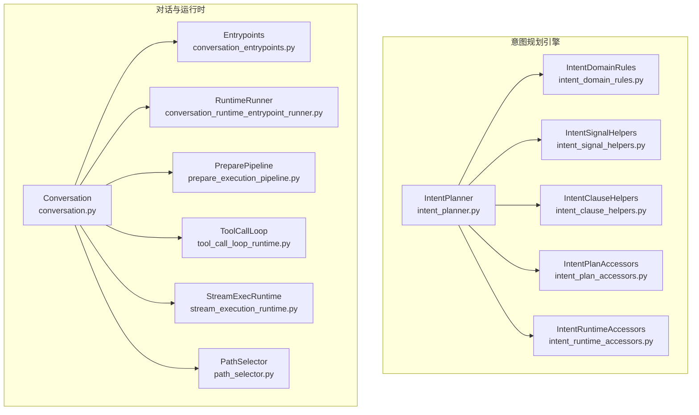
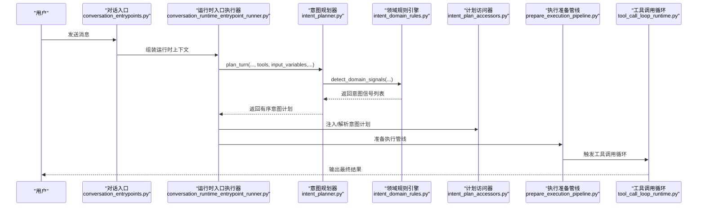
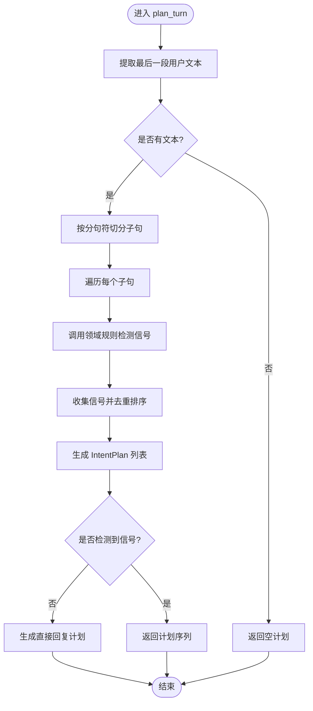
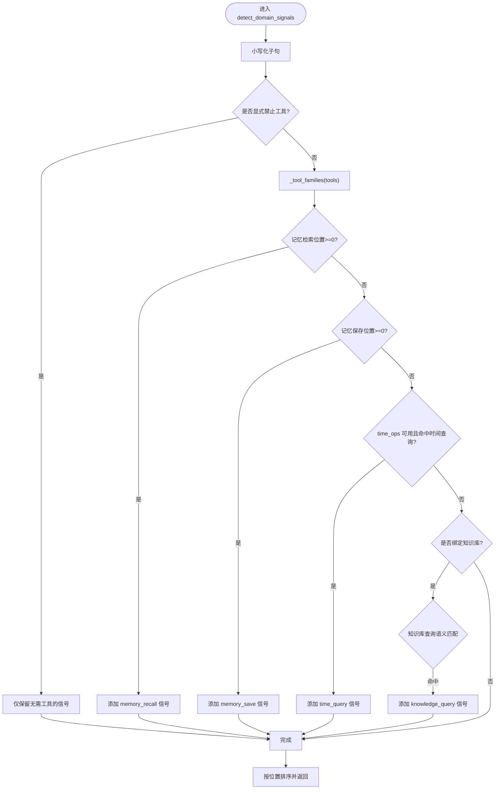
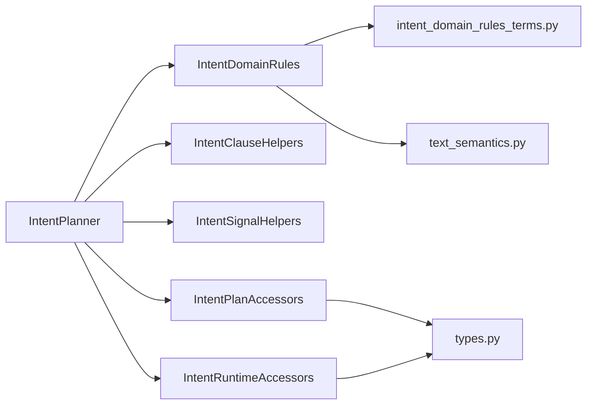

# 意图规划系统

<cite>

**本文引用的文件**
- [intent_planner.py](file://backend/app/ai/engine/intent_planner.py)
- [intent_domain_rules.py](file://backend/app/ai/engine/intent_domain_rules.py)
- [intent_clause_helpers.py](file://backend/app/ai/engine/intent_clause_helpers.py)
- [intent_plan_accessors.py](file://backend/app/ai/engine/intent_plan_accessors.py)
- [intent_runtime_accessors.py](file://backend/app/ai/engine/intent_runtime_accessors.py)
- [intent_signal_helpers.py](file://backend/app/ai/engine/intent_signal_helpers.py)
- [intent_domain_rules_terms.py](file://backend/app/ai/engine/intent_domain_rules_terms.py)
- [text_semantics.py](file://backend/app/ai/text_semantics.py)
- [types.py](file://backend/app/ai/types.py)
- [conversation.py](file://backend/app/ai/engine/conversation.py)
- [conversation_runtime_entrypoint_runner.py](file://backend/app/ai/engine/conversation_runtime_entrypoint_runner.py)
- [prepare_execution_pipeline.py](file://backend/app/ai/engine/prepare_execution_pipeline.py)
- [tool_call_loop_runtime.py](file://backend/app/ai/engine/tool_call_loop_runtime.py)
- [stream_execution_runtime.py](file://backend/app/ai/engine/stream_execution_runtime.py)
- [path_selector.py](file://backend/app/ai/engine/path_selector.py)
- [system_prompt_intent_helpers.py](file://backend/app/ai/engine/system_prompt_intent_helpers.py)
- [system_prompt_helpers.py](file://backend/app/ai/engine/system_prompt_helpers.py)
- [system_prompt_rendering.py](file://backend/app/ai/engine/system_prompt_rendering.py)
- [system_prompt_runtime_summary.py](file://backend/app/ai/engine/system_prompt_runtime_summary.py)
- [failure_classifier.py](file://backend/app/ai/engine/failure_classifier.py)
- [recovery_manager.py](file://backend/app/ai/engine/recovery_manager.py)
- [recovery_decision_policy.py](file://backend/app/ai/engine/recovery_decision_policy.py)
- [recovery_tool_result_helpers.py](file://backend/app/ai/engine/recovery_tool_result_helpers.py)
- [tool_contract_retry_policies.py](file://backend/app/ai/engine/tool_contract_retry_policies.py)
- [tool_contract_retry_helpers.py](file://backend/app/ai/engine/tool_contract_retry_helpers.py)
- [tool_execution_helpers.py](file://backend/app/ai/engine/tool_execution_helpers.py)
- [tool_processor.py](file://backend/app/ai/engine/tool_processor.py)
- [engine.py](file://backend/app/ai/context/engine.py)
- [orchestrator.py](file://backend/app/ai/context/orchestrator.py)
- [long_term_memory.py](file://backend/app/ai/context/long_term_memory.py)
- [decision_helpers.py](file://backend/app/ai/context/decision_helpers.py)
- [budget_manager.py](file://backend/app/ai/context/budget_manager.py)
- [pruning.py](file://backend/app/ai/context/pruning.py)
- [conversation_entrypoints.py](file://backend/app/ai/engine/conversation_entrypoints.py)
- [conversation_runtime_context_builder.py](file://backend/app/ai/engine/conversation_runtime_context_builder.py)
- [conversation_runtime_preflight.py](file://backend/app/ai/engine/conversation_runtime_preflight.py)
- [conversation_sync_entrypoint.py](file://backend/app/ai/engine/conversation_sync_entrypoint.py)
- [conversation_stream_entrypoint.py](file://backend/app/ai/engine/conversation_stream_entrypoint.py)
- [conversation_sync_io_adapter.py](file://backend/app/ai/engine/conversation_sync_io_adapter.py)
- [conversation_sync_result_support.py](file://backend/app/ai/engine/conversation_sync_result_support.py)
- [conversation_result_projector.py](file://backend/app/ai/engine/conversation_result_projector.py)
- [conversation_runtime_bridge.py](file://backend/app/ai/engine/conversation_runtime_bridge.py)
- [conversation_runtime_hooks.py](file://backend/app/ai/engine/conversation_runtime_hooks.py)
- [conversation_runtime_record_support.py](file://backend/app/ai/engine/conversation_runtime_record_support.py)
- [conversation_runtime_support.py](file://backend/app/ai/engine/conversation_runtime_support.py)
- [conversation_facade_support.py](file://backend/app/ai/engine/conversation_facade_support.py)
- [conversation_helpers.py](file://backend/app/ai/engine/conversation_helpers.py)
- [conversation_sync_io_support.py](file://backend/app/ai/engine/conversation_sync_io_support.py)
</cite>

## 目录
1. [引言](#引言)
2. [项目结构](#项目结构)
3. [核心组件](#核心组件)
4. [架构总览](#架构总览)
5. [详细组件分析](#详细组件分析)
6. [依赖分析](#依赖分析)
7. [性能考虑](#性能考虑)
8. [故障排查指南](#故障排查指南)
9. [结论](#结论)
10. [附录](#附录)

## 引言
本文件面向意图规划系统，围绕“意图识别算法、领域规则引擎、规划器”三大支柱，系统性阐述语义解析、意图分类与动作规划的技术实现；并深入解释意图条款助手、计划访问器与运行时访问器的功能机制；最后给出意图信号处理、决策树构建与路径选择算法的实现要点，并提供意图诊断、错误处理与重试策略的实践建议。文中所有技术细节均以仓库源码为依据，配合可视化图示帮助读者快速建立整体认知。

## 项目结构
意图规划系统位于后端 AI 引擎子系统中，核心文件集中在 backend/app/ai/engine 下，围绕“规划器-规则引擎-信号与条款助手-计划与运行时访问器”的层次化组织展开。上层对话流通过运行时入口与上下文桥接，驱动规划器生成意图计划，再由工具执行循环完成动作规划与输出。

图表来源
- [intent_planner.py:1-147](file://backend/app/ai/engine/intent_planner.py#L1-L147)
- [intent_domain_rules.py:1-439](file://backend/app/ai/engine/intent_domain_rules.py#L1-L439)
- [intent_clause_helpers.py:1-52](file://backend/app/ai/engine/intent_clause_helpers.py#L1-L52)
- [intent_plan_accessors.py:1-61](file://backend/app/ai/engine/intent_plan_accessors.py#L1-L61)
- [intent_runtime_accessors.py:1-140](file://backend/app/ai/engine/intent_runtime_accessors.py#L1-L140)
- [conversation.py](file://backend/app/ai/engine/conversation.py)
- [conversation_entrypoints.py](file://backend/app/ai/engine/conversation_entrypoints.py)
- [conversation_runtime_entrypoint_runner.py](file://backend/app/ai/engine/conversation_runtime_entrypoint_runner.py)
- [prepare_execution_pipeline.py](file://backend/app/ai/engine/prepare_execution_pipeline.py)
- [tool_call_loop_runtime.py](file://backend/app/ai/engine/tool_call_loop_runtime.py)
- [stream_execution_runtime.py](file://backend/app/ai/engine/stream_execution_runtime.py)
- [path_selector.py](file://backend/app/ai/engine/path_selector.py)

章节来源
- [intent_planner.py:1-147](file://backend/app/ai/engine/intent_planner.py#L1-L147)
- [intent_domain_rules.py:1-439](file://backend/app/ai/engine/intent_domain_rules.py#L1-L439)
- [intent_clause_helpers.py:1-52](file://backend/app/ai/engine/intent_clause_helpers.py#L1-L52)
- [intent_plan_accessors.py:1-61](file://backend/app/ai/engine/intent_plan_accessors.py#L1-L61)
- [intent_runtime_accessors.py:1-140](file://backend/app/ai/engine/intent_runtime_accessors.py#L1-L140)

## 核心组件
- 意图规划器（IntentPlanner）：负责将用户多意图的对话轮次切分为子句，检测领域信号，生成有序意图计划；当未检测到明确意图时回退为直接回复。
- 领域规则引擎（IntentDomainRules）：基于术语表与正则模式，识别记忆检索/保存、时间查询、知识库查询等确定性意图，提供短路路由与结构化语义路由。
- 子句助手（IntentClauseHelpers）：按中英文分句符拆分用户文本，保留偏移量以便定位意图位置。
- 信号助手（IntentSignalHelpers）：定义意图信号结构与位置计算、工具族提取等辅助能力。
- 计划访问器（IntentPlanAccessors）：从输入变量中解析/注入预计算的意图计划，支持运行时键名兼容。
- 运行时访问器（IntentRuntimeAccessors）：在不触发规划副作用的前提下，从多源输入变量中解析当前活动意图、请求意图列表与意图计划视图。

章节来源
- [intent_planner.py:19-147](file://backend/app/ai/engine/intent_planner.py#L19-L147)
- [intent_domain_rules.py:110-439](file://backend/app/ai/engine/intent_domain_rules.py#L110-L439)
- [intent_clause_helpers.py:25-52](file://backend/app/ai/engine/intent_clause_helpers.py#L25-L52)
- [intent_plan_accessors.py:10-61](file://backend/app/ai/engine/intent_plan_accessors.py#L10-L61)
- [intent_runtime_accessors.py:17-140](file://backend/app/ai/engine/intent_runtime_accessors.py#L17-L140)

## 架构总览
意图规划贯穿“对话入口—上下文组装—意图规划—执行准备—工具调用—结果投影”的完整链路。规划器在对话运行时入口处被调用，生成的意图计划作为后续执行阶段的输入；运行时访问器确保在不同上下文形态下稳定获取意图信息。

图表来源
- [conversation_entrypoints.py](file://backend/app/ai/engine/conversation_entrypoints.py)
- [conversation_runtime_entrypoint_runner.py](file://backend/app/ai/engine/conversation_runtime_entrypoint_runner.py)
- [intent_planner.py:62-147](file://backend/app/ai/engine/intent_planner.py#L62-L147)
- [intent_domain_rules.py:346-439](file://backend/app/ai/engine/intent_domain_rules.py#L346-L439)
- [intent_plan_accessors.py:27-61](file://backend/app/ai/engine/intent_plan_accessors.py#L27-L61)
- [prepare_execution_pipeline.py](file://backend/app/ai/engine/prepare_execution_pipeline.py)
- [tool_call_loop_runtime.py](file://backend/app/ai/engine/tool_call_loop_runtime.py)

## 详细组件分析

### 组件A：意图规划器（IntentPlanner）
- 功能职责
  - 将用户文本按分句符切分为子句，逐句检测领域信号。
  - 若未检测到有效信号，则回退为“直接回复”意图，保证最小可用响应。
  - 基于信号位置去重并生成有序 IntentPlan 列表，包含意图类型、家族、是否需要工具、短路标记、元数据等。
- 关键流程
  - 输入：消息列表、工具清单、输入变量、延续上下文、能力包。
  - 处理：提取最后一段用户文本，切分子句，逐句调用领域规则检测信号，汇总排序后生成计划。
  - 输出：IntentPlan 序列或直接回复计划。
- 性能与健壮性
  - 分句与信号检测均为线性扫描，复杂度 O(n)。
  - 对空输入与无效信号进行早返回，避免无意义计算。
  - 使用集合去重，避免重复意图计划。

图表来源
- [intent_planner.py:62-147](file://backend/app/ai/engine/intent_planner.py#L62-L147)

章节来源
- [intent_planner.py:19-147](file://backend/app/ai/engine/intent_planner.py#L19-L147)

### 组件B：领域规则引擎（IntentDomainRules）
- 功能职责
  - 基于术语表与正则表达式，识别确定性意图（记忆检索/保存、时间查询）与结构化语义意图（知识库查询）。
  - 提供短路路由（如记忆与时间查询）与结构化语义路由（KB 查询），并可过滤禁止工具使用的场景。
- 关键算法
  - 确定性短路：记忆检索/保存、时间查询位置计算，命中即短路。
  - 结构化语义：知识库查询通过显式 KB 绑定判断与语义画像匹配，避免泛化误判。
  - 工具禁用过滤：当用户显式禁止工具调用时，仅保留无需工具的信号。
- 数据结构
  - 信号结构：包含 kind、family、label、position、requires_tools、shortcircuit、metadata 等字段。
  - 术语与正则：涵盖中文/英文的记忆词、时间词、KB 引用与知识查询模式。

图表来源
- [intent_domain_rules.py:346-439](file://backend/app/ai/engine/intent_domain_rules.py#L346-L439)

章节来源
- [intent_domain_rules.py:110-439](file://backend/app/ai/engine/intent_domain_rules.py#L110-L439)

### 组件C：子句助手（IntentClauseHelpers）
- 功能职责
  - 定义中英文分句符集合，按出现顺序切分用户文本，保留原始偏移量，便于后续信号定位。
- 复杂度
  - 单次切分 O(n)，空间开销与子句数量线性相关。

章节来源
- [intent_clause_helpers.py:25-52](file://backend/app/ai/engine/intent_clause_helpers.py#L25-L52)

### 组件D：信号助手（IntentSignalHelpers）
- 功能职责
  - 定义意图信号结构体与位置计算、工具族提取、语义画像匹配等通用辅助函数。
- 作用
  - 为领域规则引擎提供统一的信号抽象与位置定位能力。

章节来源
- [intent_signal_helpers.py](file://backend/app/ai/engine/intent_signal_helpers.py)

### 组件E：计划访问器（IntentPlanAccessors）
- 功能职责
  - 从输入变量中解析预计算的意图计划，支持多种键名兼容（如 _runtime_intent_plan、intent_plan、context_diagnostics 中的 intent_plan）。
  - 将意图计划以字典形式注入输入变量，避免重复注入。
- 兼容性
  - 支持原生 IntentPlan 实例与字典构造两种输入形态，异常时安全降级为空列表。

章节来源
- [intent_plan_accessors.py:10-61](file://backend/app/ai/engine/intent_plan_accessors.py#L10-L61)

### 组件F：运行时访问器（IntentRuntimeAccessors）
- 功能职责
  - 在不触发规划副作用的前提下，从多源输入变量解析当前活动意图、请求意图列表与意图计划视图。
  - 支持从 tool_planner、context_diagnostics 等结构中抽取意图事实。
- 适用场景
  - 上游规划器尚未执行或需要旁路读取意图状态时使用。

章节来源
- [intent_runtime_accessors.py:84-140](file://backend/app/ai/engine/intent_runtime_accessors.py#L84-L140)

### 组件G：系统提示与路径选择（System Prompt 与 PathSelector）
- 系统提示集成
  - 系统提示渲染与意图辅助模块将意图计划与运行时摘要注入系统提示，指导 LLM 行为与输出风格。
- 路径选择
  - 路径选择器根据意图计划与工具可用性，决定下一步执行路径（同步/流式、直返/工具调用）。

章节来源
- [system_prompt_intent_helpers.py](file://backend/app/ai/engine/system_prompt_intent_helpers.py)
- [system_prompt_helpers.py](file://backend/app/ai/engine/system_prompt_helpers.py)
- [system_prompt_rendering.py](file://backend/app/ai/engine/system_prompt_rendering.py)
- [system_prompt_runtime_summary.py](file://backend/app/ai/engine/system_prompt_runtime_summary.py)
- [path_selector.py](file://backend/app/ai/engine/path_selector.py)

## 依赖分析
- 组件耦合
  - IntentPlanner 依赖 IntentDomainRules、IntentClauseHelpers、IntentSignalHelpers 与计划/运行时访问器。
  - 领域规则引擎依赖术语表与语义工具（问题指示器、工具族提取等）。
  - 计划/运行时访问器彼此独立，通过输入变量解耦。
- 外部依赖
  - 术语表与正则来自领域规则术语模块与文本语义模块。
  - 类型定义来自引擎类型模块。

图表来源
- [intent_planner.py:7-16](file://backend/app/ai/engine/intent_planner.py#L7-L16)
- [intent_domain_rules.py:8-28](file://backend/app/ai/engine/intent_domain_rules.py#L8-L28)
- [intent_clause_helpers.py](file://backend/app/ai/engine/intent_clause_helpers.py)
- [intent_plan_accessors.py](file://backend/app/ai/engine/intent_plan_accessors.py)
- [intent_runtime_accessors.py](file://backend/app/ai/engine/intent_runtime_accessors.py)
- [intent_domain_rules_terms.py](file://backend/app/ai/engine/intent_domain_rules_terms.py)
- [text_semantics.py](file://backend/app/ai/text_semantics.py)
- [types.py](file://backend/app/ai/types.py)

章节来源
- [intent_planner.py:1-147](file://backend/app/ai/engine/intent_planner.py#L1-L147)
- [intent_domain_rules.py:1-439](file://backend/app/ai/engine/intent_domain_rules.py#L1-L439)
- [intent_clause_helpers.py:1-52](file://backend/app/ai/engine/intent_clause_helpers.py#L1-L52)
- [intent_plan_accessors.py:1-61](file://backend/app/ai/engine/intent_plan_accessors.py#L1-L61)
- [intent_runtime_accessors.py:1-140](file://backend/app/ai/engine/intent_runtime_accessors.py#L1-L140)

## 性能考虑
- 分句与信号检测
  - 采用线性扫描与常量集查找，整体复杂度 O(n)；对长文本应避免重复切分，复用中间结果。
- 去重与排序
  - 使用集合去重与按位置排序，确保计划唯一且有序；注意元组键包含 kind、family、position，避免误判。
- 短路策略
  - 记忆与时间查询等确定性意图优先短路，减少不必要的语义匹配成本。
- 输入变量解析
  - 计划/运行时访问器对输入变量进行多源合并与类型校验，避免异常导致的全链路失败。

## 故障排查指南
- 未检测到意图
  - 检查用户文本是否为空或仅含禁止工具的表述；确认领域规则术语是否覆盖该场景。
- 计划为空或回退为直接回复
  - 排查分句是否正确；确认信号位置计算与排序逻辑是否生效。
- 运行时无法解析意图计划
  - 确认输入变量中是否存在 _runtime_intent_plan 或 intent_plan 键；检查 context_diagnostics 是否包含 intent_plan。
- 执行阶段失败
  - 使用失败分类器与恢复管理器定位错误类型与恢复策略；结合工具调用重试策略与工具结果归一化处理。

章节来源
- [failure_classifier.py](file://backend/app/ai/engine/failure_classifier.py)
- [recovery_manager.py](file://backend/app/ai/engine/recovery_manager.py)
- [recovery_decision_policy.py](file://backend/app/ai/engine/recovery_decision_policy.py)
- [recovery_tool_result_helpers.py](file://backend/app/ai/engine/recovery_tool_result_helpers.py)
- [tool_contract_retry_policies.py](file://backend/app/ai/engine/tool_contract_retry_policies.py)
- [tool_contract_retry_helpers.py](file://backend/app/ai/engine/tool_contract_retry_helpers.py)
- [tool_execution_helpers.py](file://backend/app/ai/engine/tool_execution_helpers.py)
- [tool_processor.py](file://backend/app/ai/engine/tool_processor.py)

## 结论
意图规划系统通过“规划器 + 领域规则引擎 + 信号与条款助手 + 计划/运行时访问器”的分层设计，实现了从多意图对话到确定性与语义混合路由的稳健转换。其短路与结构化语义相结合的策略，既保证了常见意图的低延迟响应，又保留了复杂场景下的可扩展性。配合完善的运行时访问与恢复机制，系统在稳定性与可维护性方面具备良好基础。

## 附录
- 配置与扩展接口
  - 自定义领域规则：在领域规则引擎中扩展术语表与正则，新增意图类型与短路条件。
  - 扩展信号结构：在信号助手模块中完善位置计算与工具族提取逻辑。
  - 扩展计划访问器：在计划/运行时访问器中增加新的键名或来源解析逻辑。
  - 集成系统提示：在系统提示渲染模块中注入意图计划与运行时摘要，影响 LLM 的行为与输出风格。
- 示例路径（不展示具体代码）
  - 规划器调用入口：[conversation_runtime_entrypoint_runner.py](file://backend/app/ai/engine/conversation_runtime_entrypoint_runner.py)
  - 执行准备管线：[prepare_execution_pipeline.py](file://backend/app/ai/engine/prepare_execution_pipeline.py)
  - 工具调用循环：[tool_call_loop_runtime.py](file://backend/app/ai/engine/tool_call_loop_runtime.py)
  - 流式执行运行时：[stream_execution_runtime.py](file://backend/app/ai/engine/stream_execution_runtime.py)
  - 路径选择器：[path_selector.py](file://backend/app/ai/engine/path_selector.py)
  - 系统提示集成：[system_prompt_intent_helpers.py](file://backend/app/ai/engine/system_prompt_intent_helpers.py)、[system_prompt_rendering.py](file://backend/app/ai/engine/system_prompt_rendering.py)、[system_prompt_runtime_summary.py](file://backend/app/ai/engine/system_prompt_runtime_summary.py)