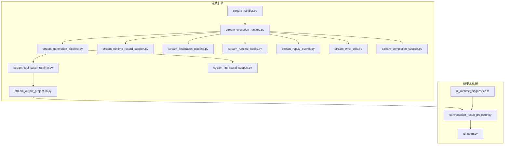
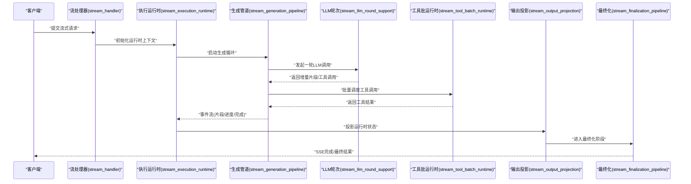
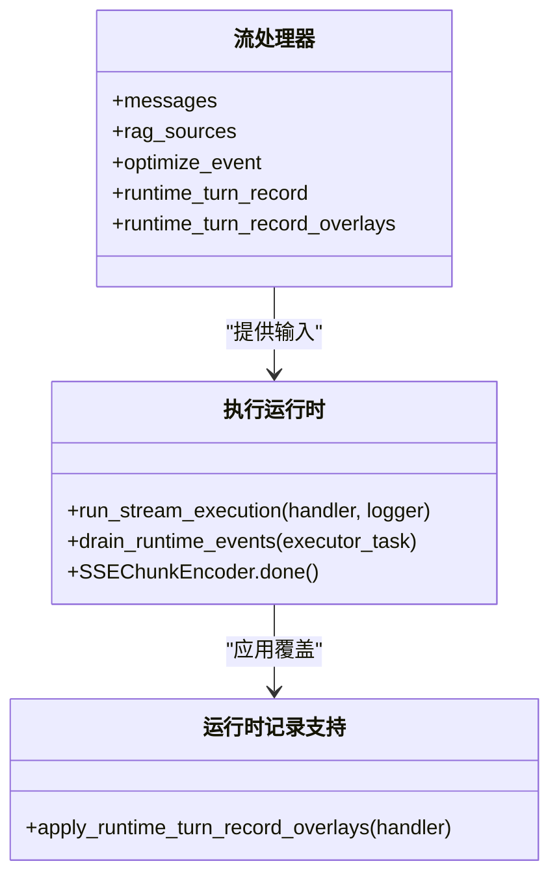
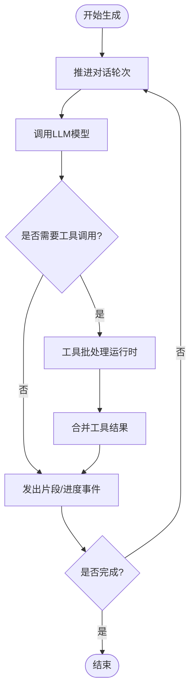
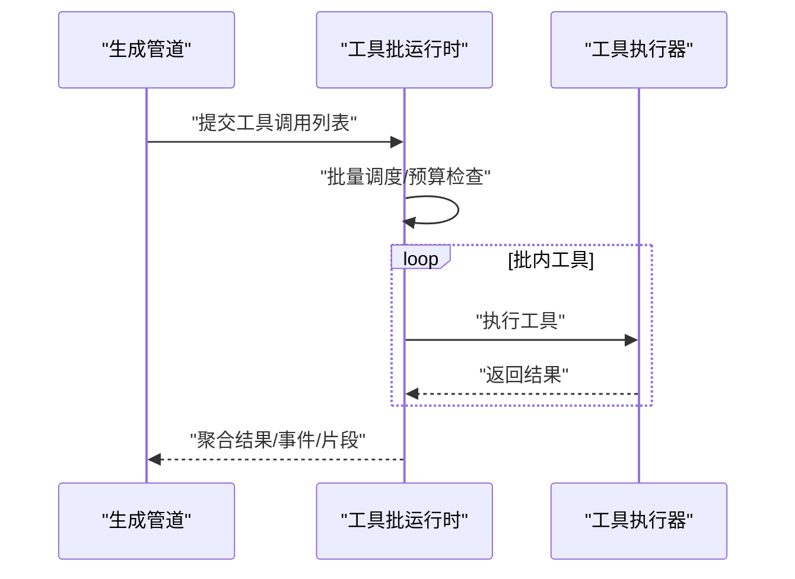
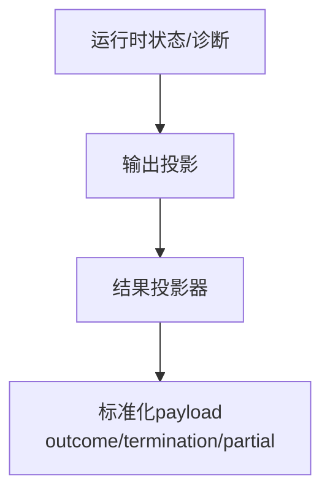
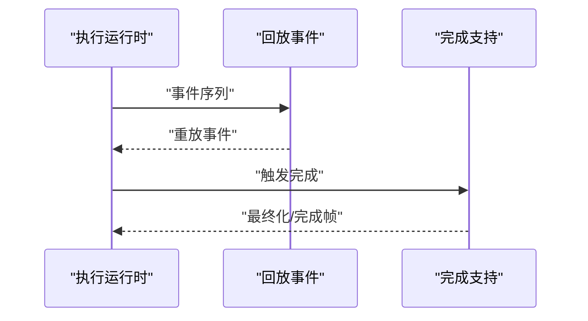
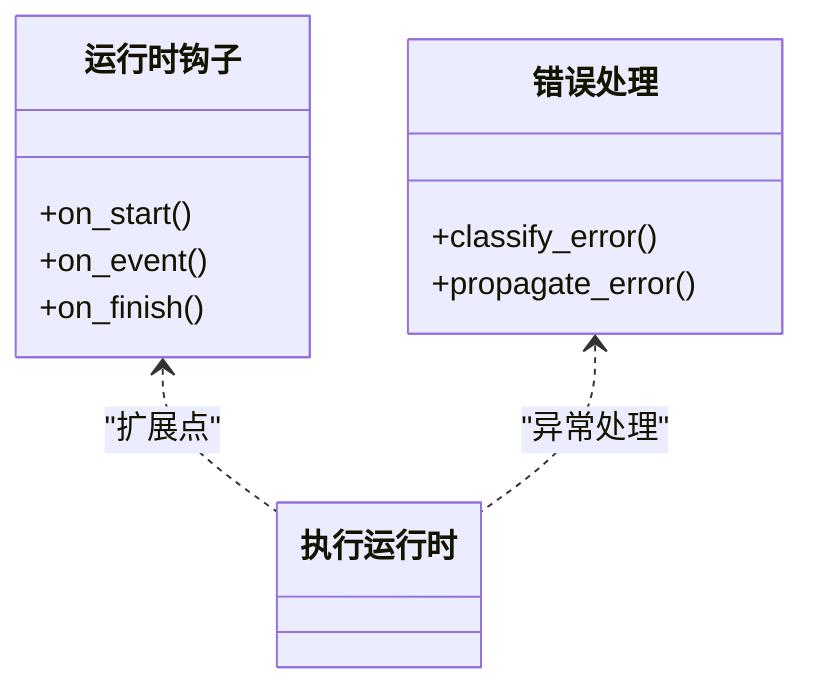
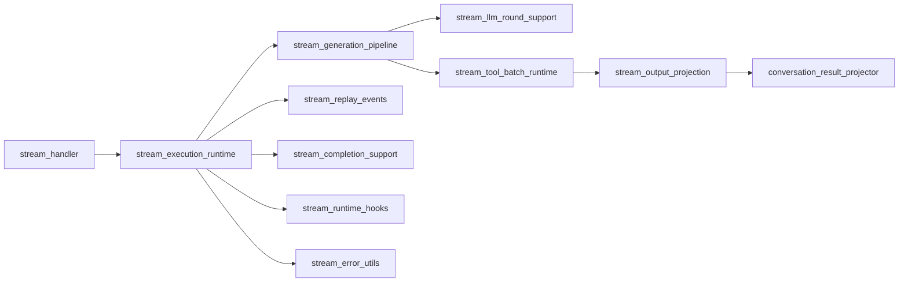

# 流式处理系统

<cite>
**本文引用的文件**
- [stream_execution_runtime.py](file://backend/app/ai/engine/stream_execution_runtime.py)
- [stream_generation_pipeline.py](file://backend/app/ai/engine/stream_generation_pipeline.py)
- [stream_tool_batch_runtime.py](file://backend/app/ai/engine/stream_tool_batch_runtime.py)
- [stream_handler.py](file://backend/app/ai/engine/stream_handler.py)
- [stream_output_projection.py](file://backend/app/ai/engine/stream_output_projection.py)
- [conversation_result_projector.py](file://backend/app/ai/engine/conversation_result_projector.py)
- [stream_llm_round_support.py](file://backend/app/ai/engine/stream_llm_round_support.py)
- [stream_finalization_pipeline.py](file://backend/app/ai/engine/stream_finalization_pipeline.py)
- [stream_runtime_hooks.py](file://backend/app/ai/engine/stream_runtime_hooks.py)
- [stream_replay_events.py](file://backend/app/ai/engine/stream_replay_events.py)
- [stream_error_utils.py](file://backend/app/ai/engine/stream_error_utils.py)
- [stream_runtime_record_support.py](file://backend/app/ai/engine/stream_runtime_record_support.py)
- [stream_completion_support.py](file://backend/app/ai/engine/stream_completion_support.py)
- [ai_norm.py](file://backend/app/cli_commands/ai_norm.py)
- [ai_runtime_diagnostics.ts](file://frontend/apps/web-antd/src/utils/ai-runtime-diagnostics.ts)
</cite>

## 目录
1. [引言](#引言)
2. [项目结构](#项目结构)
3. [核心组件](#核心组件)
4. [架构总览](#架构总览)
5. [详细组件分析](#详细组件分析)
6. [依赖关系分析](#依赖关系分析)
7. [性能考虑](#性能考虑)
8. [故障排查指南](#故障排查指南)
9. [结论](#结论)
10. [附录](#附录)

## 引言
本文件面向开发者与架构师，系统性解析后端流式处理引擎的实现原理与运行机制，覆盖流处理器、执行运行时、生成管道、输出投影、运行时契约、错误处理、流式LLM轮次、工具批处理运行时、回放事件处理、流式完成与最终化管道、运行时钩子以及流式诊断与性能优化策略。通过具体文件路径与图示，帮助读者快速掌握实时交互优化技巧与扩展接口。

## 项目结构
后端在 backend/app/ai/engine 下集中实现了流式处理相关模块，包括：
- 执行运行时：负责事件驱动的流式执行、中断与完成信号处理
- 生成管道：构建并推进对话轮次，协调LLM调用与工具执行
- 工具批处理运行时：批量调度与聚合工具调用，提升吞吐
- 输出投影：将运行时状态与诊断信息投影到对话结果中
- 回放事件：重放历史事件以恢复或审计
- 错误处理：统一的错误分类与异常传播
- 运行时钩子：扩展点以注入自定义行为
- 诊断与规范化：前端可见的诊断令牌过滤与CLI侧的规范化

**图表来源**
- [stream_execution_runtime.py](file://backend/app/ai/engine/stream_execution_runtime.py)
- [stream_generation_pipeline.py](file://backend/app/ai/engine/stream_generation_pipeline.py)
- [stream_tool_batch_runtime.py](file://backend/app/ai/engine/stream_tool_batch_runtime.py)
- [stream_output_projection.py](file://backend/app/ai/engine/stream_output_projection.py)
- [stream_runtime_record_support.py](file://backend/app/ai/engine/stream_runtime_record_support.py)
- [stream_llm_round_support.py](file://backend/app/ai/engine/stream_llm_round_support.py)
- [stream_finalization_pipeline.py](file://backend/app/ai/engine/stream_finalization_pipeline.py)
- [stream_handler.py](file://backend/app/ai/engine/stream_handler.py)
- [stream_runtime_hooks.py](file://backend/app/ai/engine/stream_runtime_hooks.py)
- [stream_replay_events.py](file://backend/app/ai/engine/stream_replay_events.py)
- [stream_error_utils.py](file://backend/app/ai/engine/stream_error_utils.py)
- [stream_completion_support.py](file://backend/app/ai/engine/stream_completion_support.py)
- [conversation_result_projector.py](file://backend/app/ai/engine/conversation_result_projector.py)
- [ai_norm.py](file://backend/app/cli_commands/ai_norm.py)
- [ai_runtime_diagnostics.ts](file://frontend/apps/web-antd/src/utils/ai-runtime-diagnostics.ts)

**章节来源**
- [stream_execution_runtime.py](file://backend/app/ai/engine/stream_execution_runtime.py)
- [stream_generation_pipeline.py](file://backend/app/ai/engine/stream_generation_pipeline.py)
- [stream_tool_batch_runtime.py](file://backend/app/ai/engine/stream_tool_batch_runtime.py)
- [stream_output_projection.py](file://backend/app/ai/engine/stream_output_projection.py)
- [conversation_result_projector.py](file://backend/app/ai/engine/conversation_result_projector.py)
- [stream_llm_round_support.py](file://backend/app/ai/engine/stream_llm_round_support.py)
- [stream_finalization_pipeline.py](file://backend/app/ai/engine/stream_finalization_pipeline.py)
- [stream_handler.py](file://backend/app/ai/engine/stream_handler.py)
- [stream_runtime_hooks.py](file://backend/app/ai/engine/stream_runtime_hooks.py)
- [stream_replay_events.py](file://backend/app/ai/engine/stream_replay_events.py)
- [stream_error_utils.py](file://backend/app/ai/engine/stream_error_utils.py)
- [stream_completion_support.py](file://backend/app/ai/engine/stream_completion_support.py)
- [ai_norm.py](file://backend/app/cli_commands/ai_norm.py)
- [ai_runtime_diagnostics.ts](file://frontend/apps/web-antd/src/utils/ai-runtime_diagnostics.ts)

## 核心组件
- 流处理器（Handler）：封装一次流式会话的准备数据、消息与RAG源，作为运行时入口参数
- 执行运行时（Runtime）：驱动事件循环，处理中断、完成与SSE分块编码
- 生成管道（Generation Pipeline）：推进对话轮次，协调LLM调用与工具执行
- 工具批处理运行时（Tool Batch Runtime）：批量调度工具调用，聚合输出与预算控制
- 输出投影（Output Projection）：将运行时状态映射到最终结果字段
- 结果投影器（Conversation Result Projector）：标准化转录记录的outcome/termination/partial等
- 回放事件（Replay Events）：按顺序重放历史事件，支持审计与恢复
- 错误处理（Error Utils）：统一错误分类与异常传播
- 运行时钩子（Runtime Hooks）：扩展点，允许注入自定义逻辑
- 完成支持（Completion Support）：完成信号与最终化流程
- 诊断与规范化（Diagnostics & Norm）：前端可见诊断过滤与CLI侧规范化

**章节来源**
- [stream_handler.py](file://backend/app/ai/engine/stream_handler.py)
- [stream_execution_runtime.py](file://backend/app/ai/engine/stream_execution_runtime.py)
- [stream_generation_pipeline.py](file://backend/app/ai/engine/stream_generation_pipeline.py)
- [stream_tool_batch_runtime.py](file://backend/app/ai/engine/stream_tool_batch_runtime.py)
- [stream_output_projection.py](file://backend/app/ai/engine/stream_output_projection.py)
- [conversation_result_projector.py](file://backend/app/ai/engine/conversation_result_projector.py)
- [stream_replay_events.py](file://backend/app/ai/engine/stream_replay_events.py)
- [stream_error_utils.py](file://backend/app/ai/engine/stream_error_utils.py)
- [stream_runtime_hooks.py](file://backend/app/ai/engine/stream_runtime_hooks.py)
- [stream_completion_support.py](file://backend/app/ai/engine/stream_completion_support.py)
- [ai_norm.py](file://backend/app/cli_commands/ai_norm.py)
- [ai_runtime_diagnostics.ts](file://frontend/apps/web-antd/src/utils/ai-runtime_diagnostics.ts)

## 架构总览
下图展示了从Handler到最终结果的完整链路，包括事件驱动的执行、工具批处理、输出投影与最终化。

**图表来源**
- [stream_handler.py](file://backend/app/ai/engine/stream_handler.py)
- [stream_execution_runtime.py](file://backend/app/ai/engine/stream_execution_runtime.py)
- [stream_generation_pipeline.py](file://backend/app/ai/engine/stream_generation_pipeline.py)
- [stream_llm_round_support.py](file://backend/app/ai/engine/stream_llm_round_support.py)
- [stream_tool_batch_runtime.py](file://backend/app/ai/engine/stream_tool_batch_runtime.py)
- [stream_output_projection.py](file://backend/app/ai/engine/stream_output_projection.py)
- [stream_finalization_pipeline.py](file://backend/app/ai/engine/stream_finalization_pipeline.py)

## 详细组件分析

### 组件A：流处理器与执行运行时
- 流处理器封装输入消息、RAG源、优化选项与运行时记录覆盖，作为运行时的输入参数
- 执行运行时负责事件循环、中断检测、完成信号与SSE分块编码；支持将命名取消异常识别为中断
- 运行时记录支持对工具轮次进度进行叠加覆盖，确保状态一致性

**图表来源**
- [stream_handler.py](file://backend/app/ai/engine/stream_handler.py)
- [stream_execution_runtime.py](file://backend/app/ai/engine/stream_execution_runtime.py)
- [stream_runtime_record_support.py](file://backend/app/ai/engine/stream_runtime_record_support.py)

**章节来源**
- [stream_handler.py](file://backend/app/ai/engine/stream_handler.py)
- [stream_execution_runtime.py](file://backend/app/ai/engine/stream_execution_runtime.py)
- [stream_runtime_record_support.py](file://backend/app/ai/engine/stream_runtime_record_support.py)

### 组件B：生成管道与流式LLM轮次
- 生成管道推进对话轮次，协调LLM调用与工具执行；支持多轮对话与工具调用的混合编排
- 流式LLM轮次支持增量输出与工具调用的混合，逐步构建最终响应

**图表来源**
- [stream_generation_pipeline.py](file://backend/app/ai/engine/stream_generation_pipeline.py)
- [stream_llm_round_support.py](file://backend/app/ai/engine/stream_llm_round_support.py)

**章节来源**
- [stream_generation_pipeline.py](file://backend/app/ai/engine/stream_generation_pipeline.py)
- [stream_llm_round_support.py](file://backend/app/ai/engine/stream_llm_round_support.py)

### 组件C：工具批处理运行时
- 负责批量调度工具调用，聚合输出、注册预算退出原因，并提供事件与文本片段回调
- 支持在预算耗尽时优雅退出并上报原因

**图表来源**
- [stream_tool_batch_runtime.py](file://backend/app/ai/engine/stream_tool_batch_runtime.py)

**章节来源**
- [stream_tool_batch_runtime.py](file://backend/app/ai/engine/stream_tool_batch_runtime.py)

### 组件D：输出投影与结果投影
- 输出投影将运行时状态映射到最终结果字段，如片段、进度、诊断键等
- 结果投影器负责标准化转录记录的turn_outcome、termination_reason与partial_exit_reason，并根据协议路径与执行路径写入payload

**图表来源**
- [stream_output_projection.py](file://backend/app/ai/engine/stream_output_projection.py)
- [conversation_result_projector.py](file://backend/app/ai/engine/conversation_result_projector.py)

**章节来源**
- [stream_output_projection.py](file://backend/app/ai/engine/stream_output_projection.py)
- [conversation_result_projector.py](file://backend/app/ai/engine/conversation_result_projector.py)

### 组件E：回放事件与完成支持
- 回放事件支持按顺序重放历史事件，用于审计与恢复
- 完成支持负责完成信号与最终化流程，确保SSE完成帧与最终结果一致

**图表来源**
- [stream_replay_events.py](file://backend/app/ai/engine/stream_replay_events.py)
- [stream_completion_support.py](file://backend/app/ai/engine/stream_completion_support.py)

**章节来源**
- [stream_replay_events.py](file://backend/app/ai/engine/stream_replay_events.py)
- [stream_completion_support.py](file://backend/app/ai/engine/stream_completion_support.py)

### 组件F：运行时钩子与错误处理
- 运行时钩子提供扩展点，可在关键节点注入自定义逻辑
- 错误处理统一分类异常，支持中断识别与错误传播

**图表来源**
- [stream_runtime_hooks.py](file://backend/app/ai/engine/stream_runtime_hooks.py)
- [stream_error_utils.py](file://backend/app/ai/engine/stream_error_utils.py)

**章节来源**
- [stream_runtime_hooks.py](file://backend/app/ai/engine/stream_runtime_hooks.py)
- [stream_error_utils.py](file://backend/app/ai/engine/stream_error_utils.py)

## 依赖关系分析
- 模块间耦合以“事件驱动”为核心，Handler → Runtime → Generation → Tool Batch → Projection → Finalization 形成单向数据流
- 运行时记录支持与结果投影器分别承担状态覆盖与标准化职责，避免直接耦合
- 回放事件与完成支持作为横切关注点，被运行时复用

**图表来源**
- [stream_handler.py](file://backend/app/ai/engine/stream_handler.py)
- [stream_execution_runtime.py](file://backend/app/ai/engine/stream_execution_runtime.py)
- [stream_generation_pipeline.py](file://backend/app/ai/engine/stream_generation_pipeline.py)
- [stream_llm_round_support.py](file://backend/app/ai/engine/stream_llm_round_support.py)
- [stream_tool_batch_runtime.py](file://backend/app/ai/engine/stream_tool_batch_runtime.py)
- [stream_output_projection.py](file://backend/app/ai/engine/stream_output_projection.py)
- [conversation_result_projector.py](file://backend/app/ai/engine/conversation_result_projector.py)
- [stream_replay_events.py](file://backend/app/ai/engine/stream_replay_events.py)
- [stream_completion_support.py](file://backend/app/ai/engine/stream_completion_support.py)
- [stream_runtime_hooks.py](file://backend/app/ai/engine/stream_runtime_hooks.py)
- [stream_error_utils.py](file://backend/app/ai/engine/stream_error_utils.py)

**章节来源**
- 同上

## 性能考虑
- 批量工具执行：通过工具批处理运行时减少调用开销，提高吞吐
- 增量输出：LLM轮次与工具结果增量推送，降低首屏延迟
- 预算控制：在工具批运行时中注册预算退出原因，避免超限
- 事件驱动：运行时采用事件驱动模型，减少阻塞等待
- SSE分块：使用SSE分块编码，保证客户端实时接收

[本节为通用指导，无需特定文件引用]

## 故障排查指南
- 中断识别：命名取消异常会被识别为中断，检查运行时日志与完成原因
- 错误分类：统一通过错误处理模块进行分类与传播，定位根因
- 诊断过滤：前端可见诊断令牌需过滤已退役值，避免噪声
- CLI规范化：CLI侧对失败项进行规范化，确保turn_outcome/termination_reason/failure_kind一致

**章节来源**
- [stream_execution_runtime.py](file://backend/app/ai/engine/stream_execution_runtime.py)
- [stream_error_utils.py](file://backend/app/ai/engine/stream_error_utils.py)
- [ai_runtime_diagnostics.ts](file://frontend/apps/web-antd/src/utils/ai-runtime-diagnostics.ts)
- [ai_norm.py](file://backend/app/cli_commands/ai_norm.py)

## 结论
该流式处理系统以事件驱动为核心，通过生成管道、工具批处理与输出投影形成清晰的数据流；运行时契约与钩子提供可扩展性；回放事件与完成支持保障可审计与可恢复；错误处理与诊断机制确保稳定性与可观测性。开发者可基于此架构进行实时交互优化与功能扩展。

[本节为总结，无需特定文件引用]

## 附录
- 配置与扩展接口建议
  - 在运行时钩子中注入自定义逻辑，如指标采集、安全校验
  - 使用工具批运行时的预算回调控制资源消耗
  - 通过结果投影器标准化输出字段，便于前端消费
- 实时交互优化技巧
  - 将长耗时步骤拆分为多个增量事件，提升感知速度
  - 对工具调用进行批量化与并发控制，平衡延迟与吞吐
  - 利用SSE分块编码与完成帧，确保客户端体验一致

[本节为通用指导，无需特定文件引用]