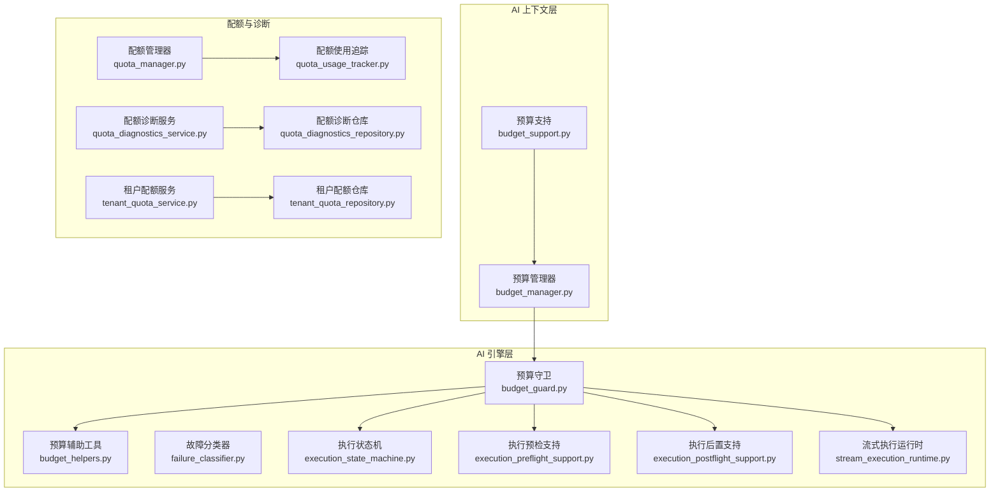
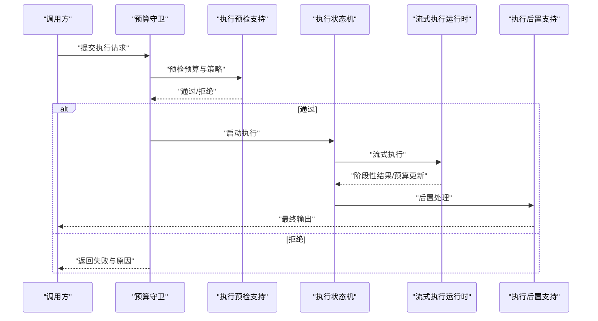
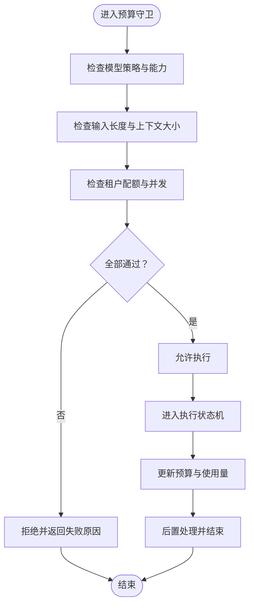
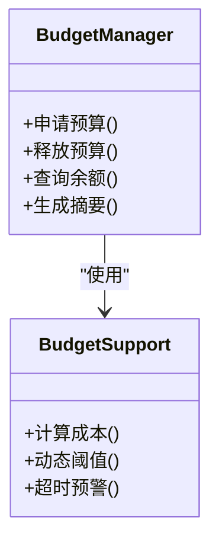
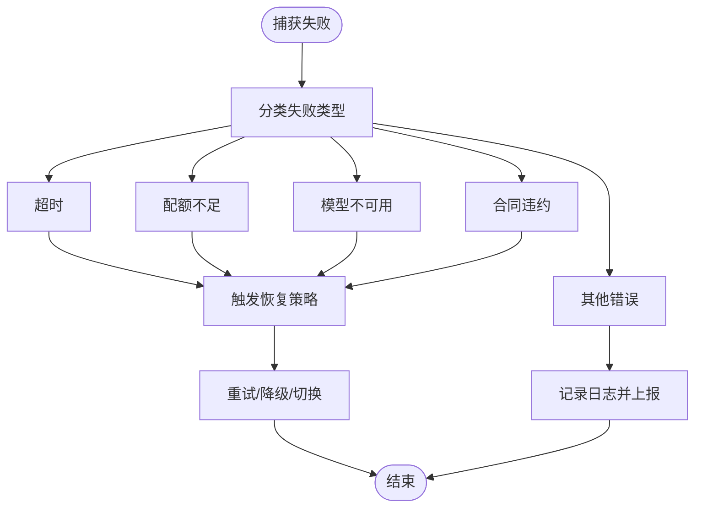
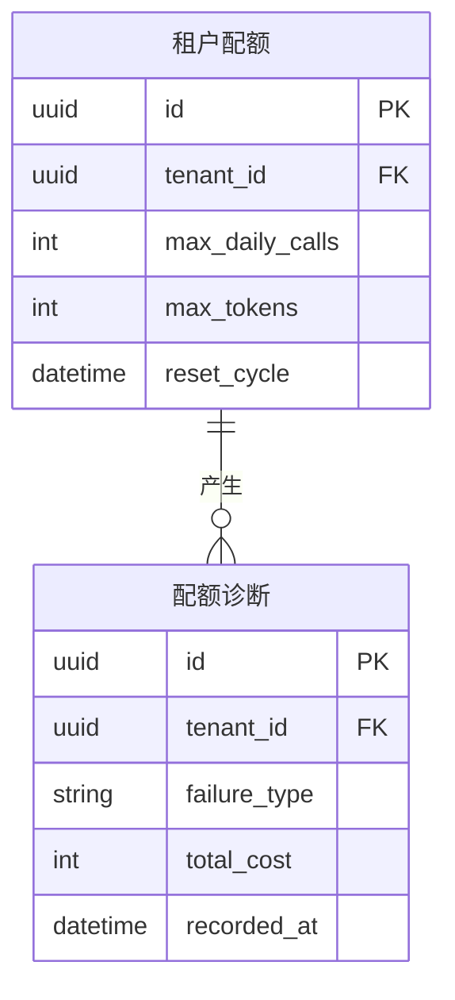
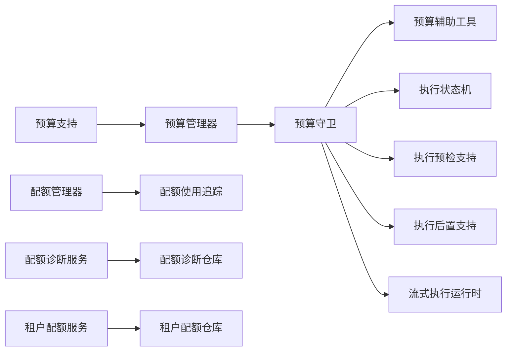

# 预算控制系统

<cite>
**本文引用的文件**
- [budget_guard.py](file://backend/app/ai/engine/budget_guard.py)
- [budget_helpers.py](file://backend/app/ai/engine/budget_helpers.py)
- [budget_manager.py](file://backend/app/ai/context/budget_manager.py)
- [budget_support.py](file://backend/app/ai/context/budget_support.py)
- [failure_classifier.py](file://backend/app/ai/engine/failure_classifier.py)
- [quota_manager.py](file://backend/app/ai/quota_manager.py)
- [quota_models.py](file://backend/app/ai/quota_models.py)
- [quota_usage_tracker.py](file://backend/app/ai/quota_usage_tracker.py)
- [quota_diagnostics_service.py](file://backend/app/services/ai/quota_diagnostics_service.py)
- [quota_diagnostics_repository.py](file://backend/app/repositories/ai/quota_diagnostics_repository.py)
- [quota_diagnostics.py](file://backend/app/schemas/ai/quota_diagnostics.py)
- [tenant_quota_service.py](file://backend/app/services/ai/tenant_quota_service.py)
- [tenant_quota_repository.py](file://backend/app/repositories/ai/tenant_quota_repository.py)
- [tenant_quota.py](file://backend/app/models/ai/tenant_quota.py)
- [tenant_quota.py](file://backend/app/schemas/ai/tenant_quota.py)
- [execution_state_machine.py](file://backend/app/ai/engine/execution_state_machine.py)
- [execution_preflight_support.py](file://backend/app/ai/engine/execution_preflight_support.py)
- [execution_postflight_support.py](file://backend/app/ai/engine/execution_postflight_support.py)
- [stream_execution_runtime.py](file://backend/app/ai/engine/stream_execution_runtime.py)
- [system_prompt_runtime_summary.py](file://backend/app/ai/engine/system_prompt_runtime_summary.py)
- [test_budget_guard_defaults.py](file://backend/tests/ai/engine/test_budget_guard_defaults.py)
- [test_system_prompt_runtime_summary_budget.py](file://backend/tests/ai/engine/test_system_prompt_runtime_summary_budget.py)
- [test_execution_budget.py](file://backend/tests/services/test_execution_budget.py)
</cite>

## 目录
1. [简介](#简介)
2. [项目结构](#项目结构)
3. [核心组件](#核心组件)
4. [架构总览](#架构总览)
5. [详细组件分析](#详细组件分析)
6. [依赖关系分析](#依赖关系分析)
7. [性能考量](#性能考量)
8. [故障排查指南](#故障排查指南)
9. [结论](#结论)
10. [附录](#附录)

## 简介
本文件系统性阐述预算控制系统的设计与实现，覆盖预算守卫、辅助工具与故障分类器三大核心模块；详解模型策略、失败分类与资源限制机制；说明预算管理、超时控制与成本优化策略；解释执行状态机、预检支持与后置处理流程；并提供预算诊断、监控指标与异常处理机制，辅以具体代码路径示例，帮助开发者快速掌握预算系统的架构设计与资源管理最佳实践。

## 项目结构
预算控制系统主要分布在 AI 引擎层与上下文层，同时在配额与诊断服务中提供支撑能力。整体结构围绕“预算守卫”进行资源约束，“预算辅助工具”提供计算与策略支持，“故障分类器”负责失败归因与恢复决策，配合“执行状态机”完成端到端的执行生命周期管理。

图表来源
- [budget_guard.py](file://backend/app/ai/engine/budget_guard.py)
- [budget_helpers.py](file://backend/app/ai/engine/budget_helpers.py)
- [budget_manager.py](file://backend/app/ai/context/budget_manager.py)
- [budget_support.py](file://backend/app/ai/context/budget_support.py)
- [failure_classifier.py](file://backend/app/ai/engine/failure_classifier.py)
- [execution_state_machine.py](file://backend/app/ai/engine/execution_state_machine.py)
- [execution_preflight_support.py](file://backend/app/ai/engine/execution_preflight_support.py)
- [execution_postflight_support.py](file://backend/app/ai/engine/execution_postflight_support.py)
- [stream_execution_runtime.py](file://backend/app/ai/engine/stream_execution_runtime.py)
- [quota_manager.py](file://backend/app/ai/quota_manager.py)
- [quota_usage_tracker.py](file://backend/app/ai/quota_usage_tracker.py)
- [quota_diagnostics_service.py](file://backend/app/services/ai/quota_diagnostics_service.py)
- [quota_diagnostics_repository.py](file://backend/app/repositories/ai/quota_diagnostics_repository.py)
- [tenant_quota_service.py](file://backend/app/services/ai/tenant_quota_service.py)
- [tenant_quota_repository.py](file://backend/app/repositories/ai/tenant_quota_repository.py)

章节来源
- [budget_guard.py](file://backend/app/ai/engine/budget_guard.py)
- [budget_helpers.py](file://backend/app/ai/engine/budget_helpers.py)
- [budget_manager.py](file://backend/app/ai/context/budget_manager.py)
- [budget_support.py](file://backend/app/ai/context/budget_support.py)
- [failure_classifier.py](file://backend/app/ai/engine/failure_classifier.py)
- [execution_state_machine.py](file://backend/app/ai/engine/execution_state_machine.py)
- [execution_preflight_support.py](file://backend/app/ai/engine/execution_preflight_support.py)
- [execution_postflight_support.py](file://backend/app/ai/engine/execution_postflight_support.py)
- [stream_execution_runtime.py](file://backend/app/ai/engine/stream_execution_runtime.py)
- [quota_manager.py](file://backend/app/ai/quota_manager.py)
- [quota_usage_tracker.py](file://backend/app/ai/quota_usage_tracker.py)
- [quota_diagnostics_service.py](file://backend/app/services/ai/quota_diagnostics_service.py)
- [quota_diagnostics_repository.py](file://backend/app/repositories/ai/quota_diagnostics_repository.py)
- [tenant_quota_service.py](file://backend/app/services/ai/tenant_quota_service.py)
- [tenant_quota_repository.py](file://backend/app/repositories/ai/tenant_quota_repository.py)

## 核心组件
- 预算守卫：在执行前对模型策略、输入长度、上下文大小、并发与时间预算进行综合评估与拦截，确保资源不被超额消耗。
- 预算辅助工具：提供预算计算、阈值判定、成本估算与动态调整等算法支持。
- 故障分类器：对执行失败进行归类（如超时、配额不足、模型不可用、合同违约等），驱动恢复策略与重试。
- 执行状态机：定义执行生命周期的状态流转（准备、运行、后置、结束），并与预算守卫协同进行资源校验与释放。
- 预算管理器与支持：在上下文层维护预算实例、跟踪使用量、生成摘要与诊断信息。
- 配额与诊断：提供租户级配额管理、使用追踪、诊断查询与可视化支持。

章节来源
- [budget_guard.py](file://backend/app/ai/engine/budget_guard.py)
- [budget_helpers.py](file://backend/app/ai/engine/budget_helpers.py)
- [failure_classifier.py](file://backend/app/ai/engine/failure_classifier.py)
- [execution_state_machine.py](file://backend/app/ai/engine/execution_state_machine.py)
- [budget_manager.py](file://backend/app/ai/context/budget_manager.py)
- [budget_support.py](file://backend/app/ai/context/budget_support.py)
- [quota_manager.py](file://backend/app/ai/quota_manager.py)
- [quota_usage_tracker.py](file://backend/app/ai/quota_usage_tracker.py)
- [quota_diagnostics_service.py](file://backend/app/services/ai/quota_diagnostics_service.py)
- [quota_diagnostics_repository.py](file://backend/app/repositories/ai/quota_diagnostics_repository.py)
- [tenant_quota_service.py](file://backend/app/services/ai/tenant_quota_service.py)
- [tenant_quota_repository.py](file://backend/app/repositories/ai/tenant_quota_repository.py)

## 架构总览
预算控制系统采用“守卫-执行-诊断”的三层架构：
- 守卫层：在进入执行阶段前进行资源与策略校验，必要时阻断或降级。
- 执行层：在状态机驱动下完成实际推理与工具调用，并在流式场景中持续更新预算。
- 诊断层：记录预算使用、失败原因与恢复动作，形成可审计、可观测的数据闭环。

图表来源
- [budget_guard.py](file://backend/app/ai/engine/budget_guard.py)
- [execution_preflight_support.py](file://backend/app/ai/engine/execution_preflight_support.py)
- [execution_state_machine.py](file://backend/app/ai/engine/execution_state_machine.py)
- [stream_execution_runtime.py](file://backend/app/ai/engine/stream_execution_runtime.py)
- [execution_postflight_support.py](file://backend/app/ai/engine/execution_postflight_support.py)

## 详细组件分析

### 预算守卫（Budget Guard）
职责与行为
- 综合评估模型策略（如最大输出、温度、采样参数）与资源限制（上下文长度、并发、时间预算）。
- 在预检阶段决定是否允许执行，若不允许则返回明确失败原因。
- 在执行过程中与流式运行时协作，动态更新预算并及时中断高风险路径。

关键流程
- 预检：检查模型能力、输入长度、上下文大小、租户配额与全局并发。
- 执行：在状态机驱动下推进，结合预算辅助工具进行成本估算与阈值判断。
- 后置：释放资源、记录使用量、生成诊断摘要。

图表来源
- [budget_guard.py](file://backend/app/ai/engine/budget_guard.py)
- [execution_preflight_support.py](file://backend/app/ai/engine/execution_preflight_support.py)
- [execution_state_machine.py](file://backend/app/ai/engine/execution_state_machine.py)
- [stream_execution_runtime.py](file://backend/app/ai/engine/stream_execution_runtime.py)
- [execution_postflight_support.py](file://backend/app/ai/engine/execution_postflight_support.py)

章节来源
- [budget_guard.py](file://backend/app/ai/engine/budget_guard.py)
- [execution_preflight_support.py](file://backend/app/ai/engine/execution_preflight_support.py)
- [execution_state_machine.py](file://backend/app/ai/engine/execution_state_machine.py)
- [stream_execution_runtime.py](file://backend/app/ai/engine/stream_execution_runtime.py)
- [execution_postflight_support.py](file://backend/app/ai/engine/execution_postflight_support.py)

### 预算辅助工具（Budget Helpers）
职责与行为
- 提供预算计算与阈值判定逻辑，包括成本估算、动态预算调整与超时预警。
- 支持不同模型与适配器的成本模型差异，保证跨供应商一致性。

典型算法
- 成本估算：基于 tokens、轮次、工具调用次数等维度进行加权计算。
- 动态阈值：根据历史使用与剩余配额动态调整执行上限。
- 超时预警：在接近预算上限时提前触发告警与降级策略。

章节来源
- [budget_helpers.py](file://backend/app/ai/engine/budget_helpers.py)

### 执行状态机（Execution State Machine）
职责与行为
- 定义执行生命周期的状态与转换条件，确保预算守卫与执行过程的有序衔接。
- 在每个状态节点与流式阶段之间进行预算校验与资源回收。

关键状态
- 准备：预检通过，初始化预算与资源。
- 运行：执行推理与工具调用，持续更新预算。
- 后置：清理资源、汇总结果、生成诊断。
- 结束：释放锁与并发计数，持久化使用量。

章节来源
- [execution_state_machine.py](file://backend/app/ai/engine/execution_state_machine.py)

### 预算管理器与支持（Budget Manager & Budget Support）
职责与行为
- 在上下文层维护预算实例，跟踪累计使用量与剩余配额。
- 生成运行时摘要（如 tokens 使用、轮次统计、工具调用次数），用于诊断与优化。

图表来源
- [budget_manager.py](file://backend/app/ai/context/budget_manager.py)
- [budget_support.py](file://backend/app/ai/context/budget_support.py)

章节来源
- [budget_manager.py](file://backend/app/ai/context/budget_manager.py)
- [budget_support.py](file://backend/app/ai/context/budget_support.py)

### 故障分类器（Failure Classifier）
职责与行为
- 对执行失败进行归类，区分超时、配额不足、模型不可用、合同违约等类型。
- 基于分类结果驱动恢复策略（重试、降级、切换模型、提示修正等）。

图表来源
- [failure_classifier.py](file://backend/app/ai/engine/failure_classifier.py)

章节来源
- [failure_classifier.py](file://backend/app/ai/engine/failure_classifier.py)

### 配额与诊断（Quota & Diagnostics）
职责与行为
- 配额管理器：统一管理租户与全局配额，提供使用追踪与阈值告警。
- 诊断服务：聚合预算使用、失败分类与恢复动作，形成可查询的诊断视图。

图表来源
- [tenant_quota.py](file://backend/app/models/ai/tenant_quota.py)
- [quota_diagnostics.py](file://backend/app/schemas/ai/quota_diagnostics.py)
- [tenant_quota_repository.py](file://backend/app/repositories/ai/tenant_quota_repository.py)
- [quota_diagnostics_repository.py](file://backend/app/repositories/ai/quota_diagnostics_repository.py)
- [tenant_quota_service.py](file://backend/app/services/ai/tenant_quota_service.py)
- [quota_diagnostics_service.py](file://backend/app/services/ai/quota_diagnostics_service.py)

章节来源
- [quota_manager.py](file://backend/app/ai/quota_manager.py)
- [quota_usage_tracker.py](file://backend/app/ai/quota_usage_tracker.py)
- [quota_diagnostics_service.py](file://backend/app/services/ai/quota_diagnostics_service.py)
- [quota_diagnostics_repository.py](file://backend/app/repositories/ai/quota_diagnostics_repository.py)
- [quota_diagnostics.py](file://backend/app/schemas/ai/quota_diagnostics.py)
- [tenant_quota_service.py](file://backend/app/services/ai/tenant_quota_service.py)
- [tenant_quota_repository.py](file://backend/app/repositories/ai/tenant_quota_repository.py)
- [tenant_quota.py](file://backend/app/models/ai/tenant_quota.py)
- [tenant_quota.py](file://backend/app/schemas/ai/tenant_quota.py)

## 依赖关系分析
预算控制系统内部依赖清晰，耦合度低，便于扩展与测试：
- 预算守卫依赖预算辅助工具与执行支持模块，确保在执行前后进行一致的资源校验。
- 执行状态机作为编排中枢，串联预检、运行与后置阶段。
- 预算管理器与诊断服务独立存在，便于观测与审计。
- 故障分类器与恢复策略解耦，支持灵活的失败处理策略。

图表来源
- [budget_guard.py](file://backend/app/ai/engine/budget_guard.py)
- [budget_helpers.py](file://backend/app/ai/engine/budget_helpers.py)
- [execution_state_machine.py](file://backend/app/ai/engine/execution_state_machine.py)
- [execution_preflight_support.py](file://backend/app/ai/engine/execution_preflight_support.py)
- [execution_postflight_support.py](file://backend/app/ai/engine/execution_postflight_support.py)
- [stream_execution_runtime.py](file://backend/app/ai/engine/stream_execution_runtime.py)
- [budget_manager.py](file://backend/app/ai/context/budget_manager.py)
- [budget_support.py](file://backend/app/ai/context/budget_support.py)
- [quota_manager.py](file://backend/app/ai/quota_manager.py)
- [quota_usage_tracker.py](file://backend/app/ai/quota_usage_tracker.py)
- [quota_diagnostics_service.py](file://backend/app/services/ai/quota_diagnostics_service.py)
- [quota_diagnostics_repository.py](file://backend/app/repositories/ai/quota_diagnostics_repository.py)
- [tenant_quota_service.py](file://backend/app/services/ai/tenant_quota_service.py)
- [tenant_quota_repository.py](file://backend/app/repositories/ai/tenant_quota_repository.py)

章节来源
- [budget_guard.py](file://backend/app/ai/engine/budget_guard.py)
- [budget_helpers.py](file://backend/app/ai/engine/budget_helpers.py)
- [execution_state_machine.py](file://backend/app/ai/engine/execution_state_machine.py)
- [execution_preflight_support.py](file://backend/app/ai/engine/execution_preflight_support.py)
- [execution_postflight_support.py](file://backend/app/ai/engine/execution_postflight_support.py)
- [stream_execution_runtime.py](file://backend/app/ai/engine/stream_execution_runtime.py)
- [budget_manager.py](file://backend/app/ai/context/budget_manager.py)
- [budget_support.py](file://backend/app/ai/context/budget_support.py)
- [quota_manager.py](file://backend/app/ai/quota_manager.py)
- [quota_usage_tracker.py](file://backend/app/ai/quota_usage_tracker.py)
- [quota_diagnostics_service.py](file://backend/app/services/ai/quota_diagnostics_service.py)
- [quota_diagnostics_repository.py](file://backend/app/repositories/ai/quota_diagnostics_repository.py)
- [tenant_quota_service.py](file://backend/app/services/ai/tenant_quota_service.py)
- [tenant_quota_repository.py](file://backend/app/repositories/ai/tenant_quota_repository.py)

## 性能考量
- 成本估算与阈值判定应尽量轻量化，避免在热路径上引入额外 IO。
- 流式执行中，预算更新频率与粒度需平衡实时性与开销。
- 并发控制与配额检查应合并为原子操作，减少竞争条件。
- 诊断数据写入建议异步化，避免阻塞主执行路径。
- 对高频失败类型（如超时）建立快速通道降级策略，提升整体吞吐。

## 故障排查指南
常见问题与定位步骤
- 预算不足导致拒绝：检查租户配额与当前使用量，确认是否达到日限额或周期重置。
- 超时失败：查看执行状态机的时间预算配置与模型响应时间，适当放宽或切换模型。
- 合同违约：核对提示词合约与工具策略，修正后重试。
- 诊断缺失：确认诊断服务与仓库的写入链路是否正常，检查异常处理分支。

章节来源
- [failure_classifier.py](file://backend/app/ai/engine/failure_classifier.py)
- [quota_diagnostics_service.py](file://backend/app/services/ai/quota_diagnostics_service.py)
- [quota_diagnostics_repository.py](file://backend/app/repositories/ai/quota_diagnostics_repository.py)
- [quota_diagnostics.py](file://backend/app/schemas/ai/quota_diagnostics.py)

## 结论
预算控制系统通过“守卫-执行-诊断”的分层设计，实现了对模型策略、资源限制与成本的全生命周期管理。预算守卫与辅助工具确保执行前后的资源安全，故障分类器提供可追溯的失败归因，执行状态机保障流程可控，配额与诊断体系提供可观测性与治理能力。该架构既满足高可用需求，又为扩展与优化留足空间。

## 附录
- 配置与扩展接口参考路径
  - 预算守卫配置与默认策略：[预算守卫测试](file://backend/tests/ai/engine/test_budget_guard_defaults.py)
  - 系统提示运行时摘要预算：[系统提示运行时摘要预算测试](file://backend/tests/ai/engine/test_system_prompt_runtime_summary_budget.py)
  - 执行预算服务测试：[执行预算服务测试](file://backend/tests/services/test_execution_budget.py)
  - 预算辅助工具算法实现：[预算辅助工具](file://backend/app/ai/engine/budget_helpers.py)
  - 预算管理器与支持：[预算管理器](file://backend/app/ai/context/budget_manager.py)、[预算支持](file://backend/app/ai/context/budget_support.py)
  - 故障分类器实现：[故障分类器](file://backend/app/ai/engine/failure_classifier.py)
  - 执行状态机与流式运行时：[执行状态机](file://backend/app/ai/engine/execution_state_machine.py)、[流式执行运行时](file://backend/app/ai/engine/stream_execution_runtime.py)
  - 配额与诊断服务：[配额管理器](file://backend/app/ai/quota_manager.py)、[配额使用追踪](file://backend/app/ai/quota_usage_tracker.py)、[配额诊断服务](file://backend/app/services/ai/quota_diagnostics_service.py)、[租户配额服务](file://backend/app/services/ai/tenant_quota_service.py)