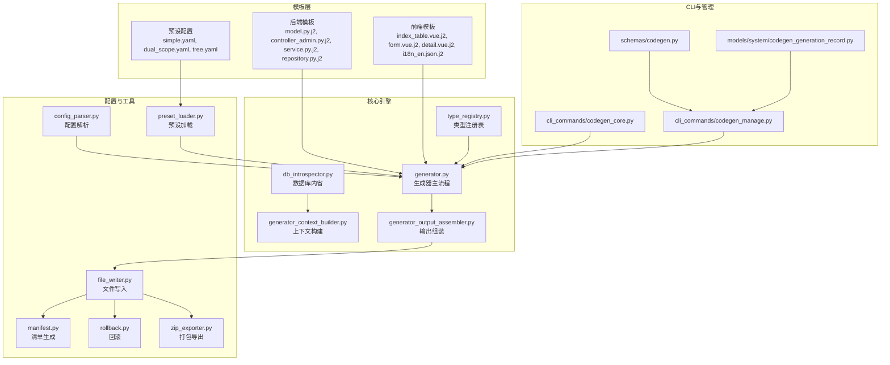
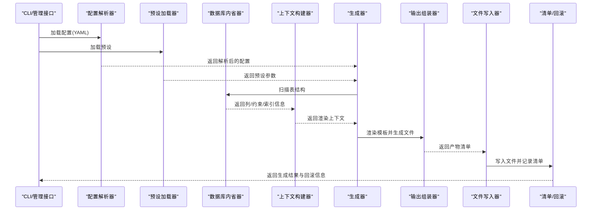
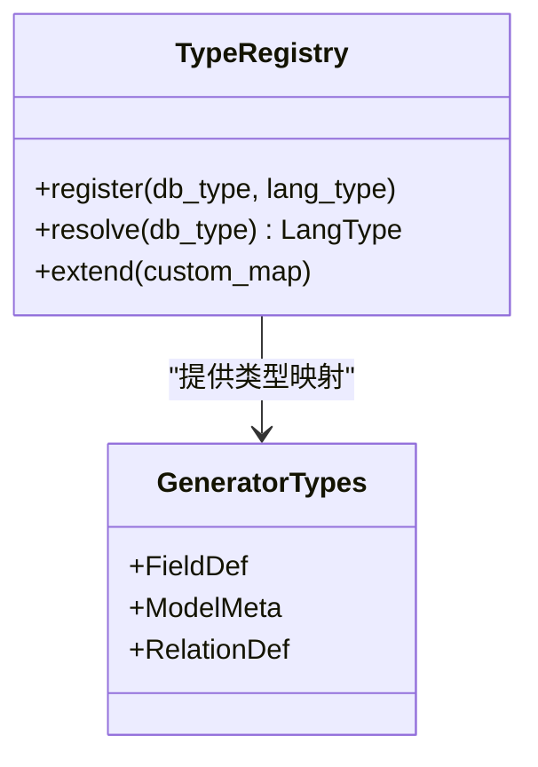
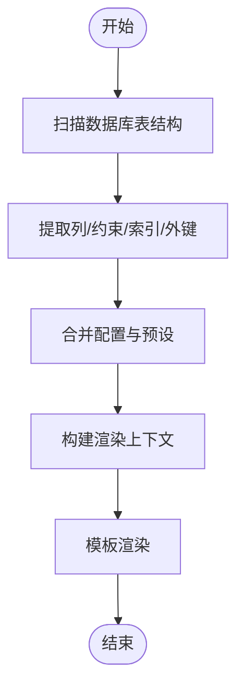
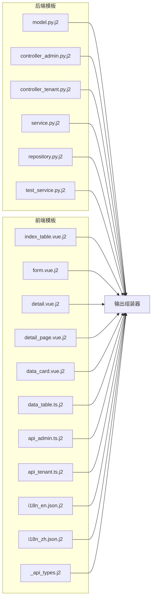
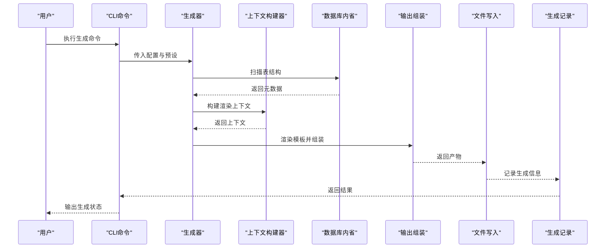
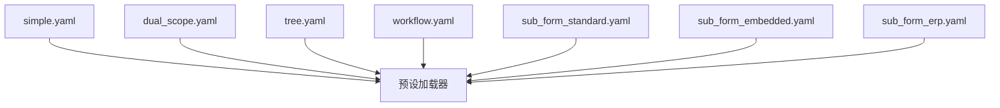
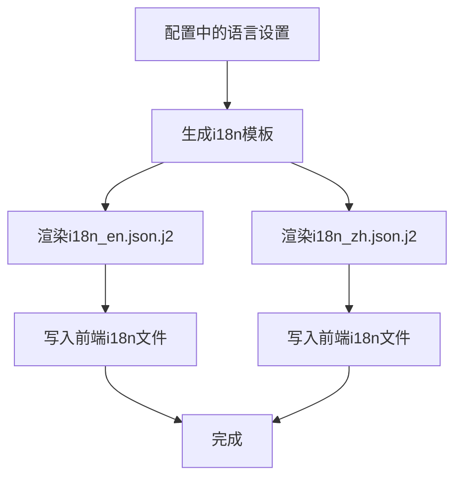
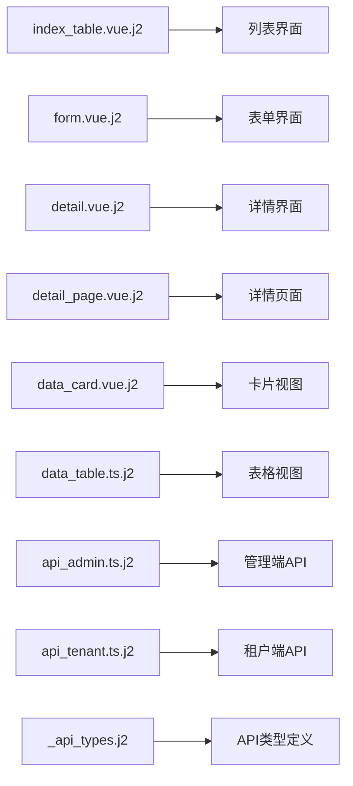
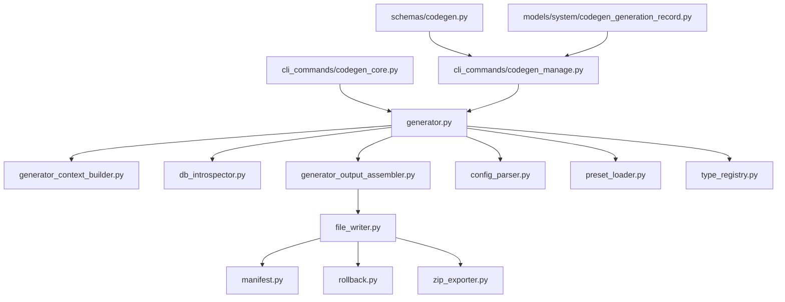

# CRUD代码生成

<cite>
**本文档引用的文件**
- [backend/app/codegen/generator.py](file://backend/app/codegen/generator.py)
- [backend/app/codegen/generator_context_builder.py](file://backend/app/codegen/generator_context_builder.py)
- [backend/app/codegen/generator_output_assembler.py](file://backend/app/codegen/generator_output_assembler.py)
- [backend/app/codegen/generator_types.py](file://backend/app/codegen/generator_types.py)
- [backend/app/codegen/type_registry.py](file://backend/app/codegen/type_registry.py)
- [backend/app/codegen/db_introspector.py](file://backend/app/codegen/db_introspector.py)
- [backend/app/codegen/preset_loader.py](file://backend/app/codegen/preset_loader.py)
- [backend/app/codegen/config_parser.py](file://backend/app/codegen/config_parser.py)
- [backend/app/codegen/file_writer.py](file://backend/app/codegen/file_writer.py)
- [backend/app/codegen/manifest.py](file://backend/app/codegen/manifest.py)
- [backend/app/codegen/rollback.py](file://backend/app/codegen/rollback.py)
- [backend/app/codegen/zip_exporter.py](file://backend/app/codegen/zip_exporter.py)
- [backend/app/codegen/templates/backend/model.py.j2](file://backend/app/codegen/templates/backend/model.py.j2)
- [backend/app/codegen/templates/backend/controller_admin.py.j2](file://backend/app/codegen/templates/backend/controller_admin.py.j2)
- [backend/app/codegen/templates/frontend/index_table.vue.j2](file://backend/app/codegen/templates/frontend/index_table.vue.j2)
- [backend/app/codegen/templates/frontend/form.vue.j2](file://backend/app/codegen/templates/frontend/form.vue.j2)
- [backend/app/codegen/templates/frontend/i18n_en.json.j2](file://backend/app/codegen/templates/frontend/i18n_en.json.j2)
- [backend/app/codegen/templates/presets/simple.yaml](file://backend/app/codegen/templates/presets/simple.yaml)
- [backend/app/codegen/templates/presets/dual_scope.yaml](file://backend/app/codegen/templates/presets/dual_scope.yaml)
- [backend/app/codegen/templates/presets/tree.yaml](file://backend/app/codegen/templates/presets/tree.yaml)
- [backend/app/cli_commands/codegen_core.py](file://backend/app/cli_commands/codegen_core.py)
- [backend/app/cli_commands/codegen_manage.py](file://backend/app/cli_commands/codegen_manage.py)
- [backend/app/schemas/codegen.py](file://backend/app/schemas/codegen.py)
- [backend/app/models/system/codegen_generation_record.py](file://backend/app/models/system/codegen_generation_record.py)
- [backend/migrations/versions/20260215_add_crud_generation_records.py](file://backend/migrations/versions/20260215_add_crud_generation_records.py)
</cite>

## 目录
1. [简介](#简介)
2. [项目结构](#项目结构)
3. [核心组件](#核心组件)
4. [架构总览](#架构总览)
5. [详细组件分析](#详细组件分析)
6. [依赖关系分析](#依赖关系分析)
7. [性能考虑](#性能考虑)
8. [故障排除指南](#故障排除指南)
9. [结论](#结论)
10. [附录](#附录)

## 简介
本文件面向NovusAI SaaS项目的CRUD代码生成功能，系统性阐述数据库表结构自动分析与代码生成器的设计原理，覆盖前端CRUD界面、后端API接口与数据模型的自动生成流程。文档重点解析类型注册表、模板系统与代码组装机制的实现方式，说明配置选项、定制化模板与扩展接口，并描述多语言支持、国际化生成与样式集成策略。通过具体文件路径与图示，帮助开发者快速理解技术架构与定制化能力。

## 项目结构
CRUD代码生成模块位于后端应用的codegen子目录，采用“模板驱动 + 上下文构建 + 组装输出”的分层设计：
- 模板层：提供前后端模板与预设配置，覆盖模型、控制器、服务、仓库、前端页面、表单、国际化等。
- 核心引擎：负责上下文构建、类型映射、模板渲染与输出组装。
- 配置与预设：支持从YAML配置加载生成规则，内置多种业务场景预设。
- CLI与管理：提供命令行入口与管理接口，支持生成记录与回滚。



图表来源
- [backend/app/codegen/generator.py](file://backend/app/codegen/generator.py)
- [backend/app/codegen/generator_context_builder.py](file://backend/app/codegen/generator_context_builder.py)
- [backend/app/codegen/type_registry.py](file://backend/app/codegen/type_registry.py)
- [backend/app/codegen/db_introspector.py](file://backend/app/codegen/db_introspector.py)
- [backend/app/codegen/generator_output_assembler.py](file://backend/app/codegen/generator_output_assembler.py)
- [backend/app/codegen/config_parser.py](file://backend/app/codegen/config_parser.py)
- [backend/app/codegen/preset_loader.py](file://backend/app/codegen/preset_loader.py)
- [backend/app/codegen/file_writer.py](file://backend/app/codegen/file_writer.py)
- [backend/app/codegen/manifest.py](file://backend/app/codegen/manifest.py)
- [backend/app/codegen/rollback.py](file://backend/app/codegen/rollback.py)
- [backend/app/codegen/zip_exporter.py](file://backend/app/codegen/zip_exporter.py)
- [backend/app/cli_commands/codegen_core.py](file://backend/app/cli_commands/codegen_core.py)
- [backend/app/cli_commands/codegen_manage.py](file://backend/app/cli_commands/codegen_manage.py)
- [backend/app/schemas/codegen.py](file://backend/app/schemas/codegen.py)
- [backend/app/models/system/codegen_generation_record.py](file://backend/app/models/system/codegen_generation_record.py)

章节来源
- [backend/app/codegen/generator.py](file://backend/app/codegen/generator.py)
- [backend/app/codegen/generator_context_builder.py](file://backend/app/codegen/generator_context_builder.py)
- [backend/app/codegen/type_registry.py](file://backend/app/codegen/type_registry.py)
- [backend/app/codegen/db_introspector.py](file://backend/app/codegen/db_introspector.py)
- [backend/app/codegen/generator_output_assembler.py](file://backend/app/codegen/generator_output_assembler.py)
- [backend/app/codegen/config_parser.py](file://backend/app/codegen/config_parser.py)
- [backend/app/codegen/preset_loader.py](file://backend/app/codegen/preset_loader.py)
- [backend/app/codegen/file_writer.py](file://backend/app/codegen/file_writer.py)
- [backend/app/codegen/manifest.py](file://backend/app/codegen/manifest.py)
- [backend/app/codegen/rollback.py](file://backend/app/codegen/rollback.py)
- [backend/app/codegen/zip_exporter.py](file://backend/app/codegen/zip_exporter.py)
- [backend/app/cli_commands/codegen_core.py](file://backend/app/cli_commands/codegen_core.py)
- [backend/app/cli_commands/codegen_manage.py](file://backend/app/cli_commands/codegen_manage.py)
- [backend/app/schemas/codegen.py](file://backend/app/schemas/codegen.py)
- [backend/app/models/system/codegen_generation_record.py](file://backend/app/models/system/codegen_generation_record.py)

## 核心组件
- 类型注册表（type_registry.py）：维护数据库类型到语言类型的映射规则，支持扩展与覆盖。
- 数据库内省（db_introspector.py）：扫描数据库表结构，提取列定义、约束、索引与外键信息。
- 上下文构建（generator_context_builder.py）：基于内省结果与配置，生成渲染上下文。
- 生成器（generator.py）：协调模板渲染、输出组装与文件写入。
- 输出组装（generator_output_assembler.py）：将渲染后的文件按目标位置与命名规则组织。
- 预设加载（preset_loader.py）：加载内置或用户自定义预设配置。
- 配置解析（config_parser.py）：解析YAML配置，合并默认值与用户选项。
- 文件写入（file_writer.py）：执行文件系统写入，支持dry-run与备份。
- 清单与回滚（manifest.py, rollback.py）：记录生成产物，支持回滚与导出。
- 打包导出（zip_exporter.py）：将生成产物打包为可分发的压缩包。
- CLI与管理（cli_commands/codegen_core.py, codegen_manage.py）：提供命令行入口与管理接口。
- 数据模型与迁移（models/system/codegen_generation_record.py, migrations/...）：持久化生成记录，支持审计与追踪。

章节来源
- [backend/app/codegen/type_registry.py](file://backend/app/codegen/type_registry.py)
- [backend/app/codegen/db_introspector.py](file://backend/app/codegen/db_introspector.py)
- [backend/app/codegen/generator_context_builder.py](file://backend/app/codegen/generator_context_builder.py)
- [backend/app/codegen/generator.py](file://backend/app/codegen/generator.py)
- [backend/app/codegen/generator_output_assembler.py](file://backend/app/codegen/generator_output_assembler.py)
- [backend/app/codegen/preset_loader.py](file://backend/app/codegen/preset_loader.py)
- [backend/app/codegen/config_parser.py](file://backend/app/codegen/config_parser.py)
- [backend/app/codegen/file_writer.py](file://backend/app/codegen/file_writer.py)
- [backend/app/codegen/manifest.py](file://backend/app/codegen/manifest.py)
- [backend/app/codegen/rollback.py](file://backend/app/codegen/rollback.py)
- [backend/app/codegen/zip_exporter.py](file://backend/app/codegen/zip_exporter.py)
- [backend/app/cli_commands/codegen_core.py](file://backend/app/cli_commands/codegen_core.py)
- [backend/app/cli_commands/codegen_manage.py](file://backend/app/cli_commands/codegen_manage.py)
- [backend/app/models/system/codegen_generation_record.py](file://backend/app/models/system/codegen_generation_record.py)
- [backend/migrations/versions/20260215_add_crud_generation_records.py](file://backend/migrations/versions/20260215_add_crud_generation_records.py)

## 架构总览
CRUD生成器遵循“配置驱动 + 模板渲染 + 组装输出”的流水线式架构。其核心流程包括：读取配置与预设 → 内省数据库 → 构建渲染上下文 → 渲染模板 → 组装输出 → 写入文件系统 → 记录清单与回滚信息。



图表来源
- [backend/app/codegen/config_parser.py](file://backend/app/codegen/config_parser.py)
- [backend/app/codegen/preset_loader.py](file://backend/app/codegen/preset_loader.py)
- [backend/app/codegen/db_introspector.py](file://backend/app/codegen/db_introspector.py)
- [backend/app/codegen/generator_context_builder.py](file://backend/app/codegen/generator_context_builder.py)
- [backend/app/codegen/generator.py](file://backend/app/codegen/generator.py)
- [backend/app/codegen/generator_output_assembler.py](file://backend/app/codegen/generator_output_assembler.py)
- [backend/app/codegen/file_writer.py](file://backend/app/codegen/file_writer.py)
- [backend/app/codegen/manifest.py](file://backend/app/codegen/manifest.py)
- [backend/app/codegen/rollback.py](file://backend/app/codegen/rollback.py)

## 详细组件分析

### 类型注册表与映射机制
类型注册表负责将数据库字段类型映射到后端语言类型（如Python类型注解），并支持扩展自定义映射。该机制确保生成的模型、Schema与API接口在类型层面保持一致。



图表来源
- [backend/app/codegen/type_registry.py](file://backend/app/codegen/type_registry.py)
- [backend/app/codegen/generator_types.py](file://backend/app/codegen/generator_types.py)

章节来源
- [backend/app/codegen/type_registry.py](file://backend/app/codegen/type_registry.py)
- [backend/app/codegen/generator_types.py](file://backend/app/codegen/generator_types.py)

### 数据库内省与上下文构建
数据库内省器扫描目标表，提取列定义、主键、唯一键、外键、索引与注释等元数据；上下文构建器基于这些信息与配置，生成模板渲染所需的完整上下文。



图表来源
- [backend/app/codegen/db_introspector.py](file://backend/app/codegen/db_introspector.py)
- [backend/app/codegen/generator_context_builder.py](file://backend/app/codegen/generator_context_builder.py)
- [backend/app/codegen/config_parser.py](file://backend/app/codegen/config_parser.py)
- [backend/app/codegen/preset_loader.py](file://backend/app/codegen/preset_loader.py)

章节来源
- [backend/app/codegen/db_introspector.py](file://backend/app/codegen/db_introspector.py)
- [backend/app/codegen/generator_context_builder.py](file://backend/app/codegen/generator_context_builder.py)
- [backend/app/codegen/config_parser.py](file://backend/app/codegen/config_parser.py)
- [backend/app/codegen/preset_loader.py](file://backend/app/codegen/preset_loader.py)

### 模板系统与代码组装
模板系统采用Jinja2风格的模板文件，分别覆盖后端模型、控制器、服务、仓库与前端页面、表单、详情页、国际化等。输出组装器根据命名规则与目标路径，将渲染结果组织为最终产物。



图表来源
- [backend/app/codegen/templates/backend/model.py.j2](file://backend/app/codegen/templates/backend/model.py.j2)
- [backend/app/codegen/templates/backend/controller_admin.py.j2](file://backend/app/codegen/templates/backend/controller_admin.py.j2)
- [backend/app/codegen/templates/frontend/index_table.vue.j2](file://backend/app/codegen/templates/frontend/index_table.vue.j2)
- [backend/app/codegen/templates/frontend/form.vue.j2](file://backend/app/codegen/templates/frontend/form.vue.j2)
- [backend/app/codegen/templates/frontend/i18n_en.json.j2](file://backend/app/codegen/templates/frontend/i18n_en.json.j2)

章节来源
- [backend/app/codegen/templates/backend/model.py.j2](file://backend/app/codegen/templates/backend/model.py.j2)
- [backend/app/codegen/templates/backend/controller_admin.py.j2](file://backend/app/codegen/templates/backend/controller_admin.py.j2)
- [backend/app/codegen/templates/frontend/index_table.vue.j2](file://backend/app/codegen/templates/frontend/index_table.vue.j2)
- [backend/app/codegen/templates/frontend/form.vue.j2](file://backend/app/codegen/templates/frontend/form.vue.j2)
- [backend/app/codegen/templates/frontend/i18n_en.json.j2](file://backend/app/codegen/templates/frontend/i18n_en.json.j2)

### 生成器主流程与CLI集成
生成器协调各组件完成一次完整的代码生成任务；CLI提供命令行入口，支持直接调用与管理接口封装。



图表来源
- [backend/app/codegen/generator.py](file://backend/app/codegen/generator.py)
- [backend/app/codegen/generator_context_builder.py](file://backend/app/codegen/generator_context_builder.py)
- [backend/app/codegen/db_introspector.py](file://backend/app/codegen/db_introspector.py)
- [backend/app/codegen/generator_output_assembler.py](file://backend/app/codegen/generator_output_assembler.py)
- [backend/app/codegen/file_writer.py](file://backend/app/codegen/file_writer.py)
- [backend/app/models/system/codegen_generation_record.py](file://backend/app/models/system/codegen_generation_record.py)

章节来源
- [backend/app/codegen/generator.py](file://backend/app/codegen/generator.py)
- [backend/app/codegen/generator_context_builder.py](file://backend/app/codegen/generator_context_builder.py)
- [backend/app/codegen/db_introspector.py](file://backend/app/codegen/db_introspector.py)
- [backend/app/codegen/generator_output_assembler.py](file://backend/app/codegen/generator_output_assembler.py)
- [backend/app/codegen/file_writer.py](file://backend/app/codegen/file_writer.py)
- [backend/app/models/system/codegen_generation_record.py](file://backend/app/models/system/codegen_generation_record.py)

### 预设配置与定制化模板
系统内置多种业务场景预设，如简单CRUD、双重作用域、树形结构、工作流等；同时支持用户自定义预设与模板扩展，满足不同领域模型的生成需求。



图表来源
- [backend/app/codegen/templates/presets/simple.yaml](file://backend/app/codegen/templates/presets/simple.yaml)
- [backend/app/codegen/templates/presets/dual_scope.yaml](file://backend/app/codegen/templates/presets/dual_scope.yaml)
- [backend/app/codegen/templates/presets/tree.yaml](file://backend/app/codegen/templates/presets/tree.yaml)
- [backend/app/codegen/preset_loader.py](file://backend/app/codegen/preset_loader.py)

章节来源
- [backend/app/codegen/templates/presets/simple.yaml](file://backend/app/codegen/templates/presets/simple.yaml)
- [backend/app/codegen/templates/presets/dual_scope.yaml](file://backend/app/codegen/templates/presets/dual_scope.yaml)
- [backend/app/codegen/templates/presets/tree.yaml](file://backend/app/codegen/templates/presets/tree.yaml)
- [backend/app/codegen/preset_loader.py](file://backend/app/codegen/preset_loader.py)

### 多语言支持与国际化生成
国际化生成通过模板在前端生成i18n资源文件，支持英文与中文等多语言；结合后端i18n中间件与前端本地化策略，实现全链路国际化。



图表来源
- [backend/app/codegen/templates/frontend/i18n_en.json.j2](file://backend/app/codegen/templates/frontend/i18n_en.json.j2)
- [backend/app/codegen/generator_output_assembler.py](file://backend/app/codegen/generator_output_assembler.py)
- [backend/app/codegen/file_writer.py](file://backend/app/codegen/file_writer.py)

章节来源
- [backend/app/codegen/templates/frontend/i18n_en.json.j2](file://backend/app/codegen/templates/frontend/i18n_en.json.j2)
- [backend/app/codegen/generator_output_assembler.py](file://backend/app/codegen/generator_output_assembler.py)
- [backend/app/codegen/file_writer.py](file://backend/app/codegen/file_writer.py)

### 前端CRUD界面生成
前端模板覆盖列表页、表单页、详情页、卡片视图与表格视图等，配合API模板与类型模板，形成完整的前端CRUD界面。



图表来源
- [backend/app/codegen/templates/frontend/index_table.vue.j2](file://backend/app/codegen/templates/frontend/index_table.vue.j2)
- [backend/app/codegen/templates/frontend/form.vue.j2](file://backend/app/codegen/templates/frontend/form.vue.j2)
- [backend/app/codegen/templates/frontend/detail.vue.j2](file://backend/app/codegen/templates/frontend/detail.vue.j2)
- [backend/app/codegen/templates/frontend/detail_page.vue.j2](file://backend/app/codegen/templates/frontend/detail_page.vue.j2)
- [backend/app/codegen/templates/frontend/data_card.vue.j2](file://backend/app/codegen/templates/frontend/data_card.vue.j2)
- [backend/app/codegen/templates/frontend/data_table.ts.j2](file://backend/app/codegen/templates/frontend/data_table.ts.j2)
- [backend/app/codegen/templates/frontend/api_admin.ts.j2](file://backend/app/codegen/templates/frontend/api_admin.ts.j2)
- [backend/app/codegen/templates/frontend/api_tenant.ts.j2](file://backend/app/codegen/templates/frontend/api_tenant.ts.j2)
- [backend/app/codegen/templates/frontend/_api_types.j2](file://backend/app/codegen/templates/frontend/_api_types.j2)

章节来源
- [backend/app/codegen/templates/frontend/index_table.vue.j2](file://backend/app/codegen/templates/frontend/index_table.vue.j2)
- [backend/app/codegen/templates/frontend/form.vue.j2](file://backend/app/codegen/templates/frontend/form.vue.j2)
- [backend/app/codegen/templates/frontend/detail.vue.j2](file://backend/app/codegen/templates/frontend/detail.vue.j2)
- [backend/app/codegen/templates/frontend/detail_page.vue.j2](file://backend/app/codegen/templates/frontend/detail_page.vue.j2)
- [backend/app/codegen/templates/frontend/data_card.vue.j2](file://backend/app/codegen/templates/frontend/data_card.vue.j2)
- [backend/app/codegen/templates/frontend/data_table.ts.j2](file://backend/app/codegen/templates/frontend/data_table.ts.j2)
- [backend/app/codegen/templates/frontend/api_admin.ts.j2](file://backend/app/codegen/templates/frontend/api_admin.ts.j2)
- [backend/app/codegen/templates/frontend/api_tenant.ts.j2](file://backend/app/codegen/templates/frontend/api_tenant.ts.j2)
- [backend/app/codegen/templates/frontend/_api_types.j2](file://backend/app/codegen/templates/frontend/_api_types.j2)

### 后端API与数据模型生成
后端模板生成模型、控制器、服务与仓库等组件，确保API接口、数据访问与业务逻辑的一致性与可维护性。

```mermaid
classDiagram
class ModelTemplate["model.py.j2"]
class ControllerAdminTemplate["controller_admin.py.j2"]
class ControllerTenantTemplate["controller_tenant.py.j2"]
class ServiceTemplate["service.py.j2"]
class RepositoryTemplate["repository.py.j2"]
class TestServiceTemplate["test_service.py.j2"]
ModelTemplate --> GeneratedModel["生成的模型类"]
ControllerAdminTemplate --> GeneratedAdminAPI["生成的管理端控制器"]
ControllerTenantTemplate --> GeneratedTenantAPI["生成的租户端控制器"]
ServiceTemplate --> GeneratedService["生成的服务类"]
RepositoryTemplate --> GeneratedRepository["生成的仓库类"]
TestServiceTemplate --> GeneratedTest["生成的服务测试"]
```

图表来源
- [backend/app/codegen/templates/backend/model.py.j2](file://backend/app/codegen/templates/backend/model.py.j2)
- [backend/app/codegen/templates/backend/controller_admin.py.j2](file://backend/app/codegen/templates/backend/controller_admin.py.j2)
- [backend/app/codegen/templates/backend/service.py.j2](file://backend/app/codegen/templates/backend/service.py.j2)
- [backend/app/codegen/templates/backend/repository.py.j2](file://backend/app/codegen/templates/backend/repository.py.j2)
- [backend/app/codegen/templates/backend/test_service.py.j2](file://backend/app/codegen/templates/backend/test_service.py.j2)

章节来源
- [backend/app/codegen/templates/backend/model.py.j2](file://backend/app/codegen/templates/backend/model.py.j2)
- [backend/app/codegen/templates/backend/controller_admin.py.j2](file://backend/app/codegen/templates/backend/controller_admin.py.j2)
- [backend/app/codegen/templates/backend/service.py.j2](file://backend/app/codegen/templates/backend/service.py.j2)
- [backend/app/codegen/templates/backend/repository.py.j2](file://backend/app/codegen/templates/backend/repository.py.j2)
- [backend/app/codegen/templates/backend/test_service.py.j2](file://backend/app/codegen/templates/backend/test_service.py.j2)

## 依赖关系分析
生成器内部模块之间存在清晰的职责划分与依赖关系，避免循环依赖并保证可测试性与可扩展性。



图表来源
- [backend/app/codegen/generator.py](file://backend/app/codegen/generator.py)
- [backend/app/codegen/generator_context_builder.py](file://backend/app/codegen/generator_context_builder.py)
- [backend/app/codegen/db_introspector.py](file://backend/app/codegen/db_introspector.py)
- [backend/app/codegen/generator_output_assembler.py](file://backend/app/codegen/generator_output_assembler.py)
- [backend/app/codegen/config_parser.py](file://backend/app/codegen/config_parser.py)
- [backend/app/codegen/preset_loader.py](file://backend/app/codegen/preset_loader.py)
- [backend/app/codegen/type_registry.py](file://backend/app/codegen/type_registry.py)
- [backend/app/codegen/file_writer.py](file://backend/app/codegen/file_writer.py)
- [backend/app/codegen/manifest.py](file://backend/app/codegen/manifest.py)
- [backend/app/codegen/rollback.py](file://backend/app/codegen/rollback.py)
- [backend/app/codegen/zip_exporter.py](file://backend/app/codegen/zip_exporter.py)
- [backend/app/cli_commands/codegen_core.py](file://backend/app/cli_commands/codegen_core.py)
- [backend/app/cli_commands/codegen_manage.py](file://backend/app/cli_commands/codegen_manage.py)
- [backend/app/schemas/codegen.py](file://backend/app/schemas/codegen.py)
- [backend/app/models/system/codegen_generation_record.py](file://backend/app/models/system/codegen_generation_record.py)

章节来源
- [backend/app/codegen/generator.py](file://backend/app/codegen/generator.py)
- [backend/app/codegen/generator_context_builder.py](file://backend/app/codegen/generator_context_builder.py)
- [backend/app/codegen/db_introspector.py](file://backend/app/codegen/db_introspector.py)
- [backend/app/codegen/generator_output_assembler.py](file://backend/app/codegen/generator_output_assembler.py)
- [backend/app/codegen/config_parser.py](file://backend/app/codegen/config_parser.py)
- [backend/app/codegen/preset_loader.py](file://backend/app/codegen/preset_loader.py)
- [backend/app/codegen/type_registry.py](file://backend/app/codegen/type_registry.py)
- [backend/app/codegen/file_writer.py](file://backend/app/codegen/file_writer.py)
- [backend/app/codegen/manifest.py](file://backend/app/codegen/manifest.py)
- [backend/app/codegen/rollback.py](file://backend/app/codegen/rollback.py)
- [backend/app/codegen/zip_exporter.py](file://backend/app/codegen/zip_exporter.py)
- [backend/app/cli_commands/codegen_core.py](file://backend/app/cli_commands/codegen_core.py)
- [backend/app/cli_commands/codegen_manage.py](file://backend/app/cli_commands/codegen_manage.py)
- [backend/app/schemas/codegen.py](file://backend/app/schemas/codegen.py)
- [backend/app/models/system/codegen_generation_record.py](file://backend/app/models/system/codegen_generation_record.py)

## 性能考虑
- 模板渲染优化：尽量减少模板中的复杂逻辑，将计算移至上下文构建阶段，降低渲染成本。
- 并行写入：在文件写入阶段可考虑并发写入以提升吞吐量，但需注意文件锁与冲突处理。
- 缓存策略：对数据库内省结果进行缓存，避免重复扫描；对常用预设与类型映射进行内存缓存。
- 产物增量：支持增量生成与差异对比，仅更新变更的文件，减少不必要的IO操作。
- 配置校验：在生成前进行配置与预设的完整性校验，提前发现错误，避免无效渲染。

## 故障排除指南
- 生成失败排查：检查配置解析与预设加载是否正确，确认数据库连接与权限；查看上下文构建日志定位问题。
- 模板渲染异常：核对模板语法与变量名，确保上下文字段完整；逐步缩小到具体模板文件。
- 文件写入失败：检查目标路径权限与磁盘空间，启用dry-run模式验证输出路径与命名规则。
- 回滚与恢复：利用清单记录与回滚机制，快速恢复到上一个稳定版本；必要时导出打包产物进行人工修复。
- 国际化缺失：确认配置中语言设置与模板选择，检查i18n资源文件是否生成完整。

章节来源
- [backend/app/codegen/rollback.py](file://backend/app/codegen/rollback.py)
- [backend/app/codegen/manifest.py](file://backend/app/codegen/manifest.py)
- [backend/app/codegen/file_writer.py](file://backend/app/codegen/file_writer.py)

## 结论
NovusAI SaaS项目的CRUD代码生成器通过“配置驱动 + 模板渲染 + 组装输出”的架构，实现了从前端界面到后端API与数据模型的自动化生成。类型注册表、数据库内省、上下文构建与模板系统共同构成了高可扩展、易定制的生成体系。借助预设配置与CLI管理，开发者可以快速适配不同业务场景，显著提升开发效率与代码一致性。

## 附录
- 配置选项与使用示例：参考配置解析与预设加载模块，结合CLI命令进行实际生成。
- 定制化模板：在templates目录下新增或修改模板文件，扩展生成能力。
- 扩展接口：通过类型注册表与上下文构建器扩展新的类型映射与渲染上下文。
- 多语言与样式：通过国际化模板与前端样式约定，统一界面风格与文案表达。