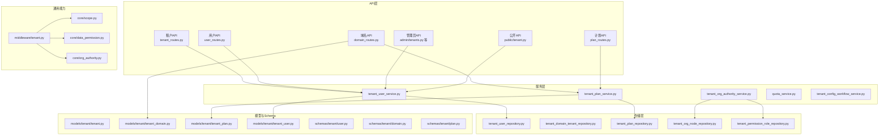
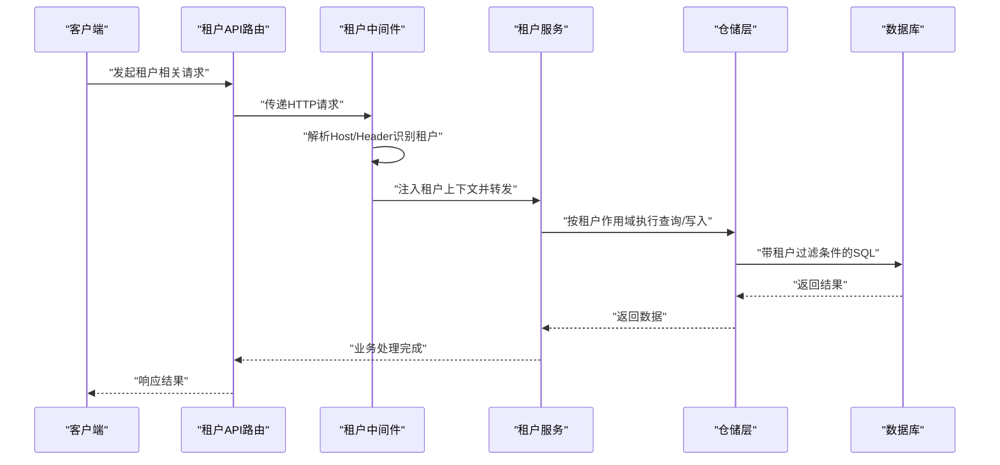
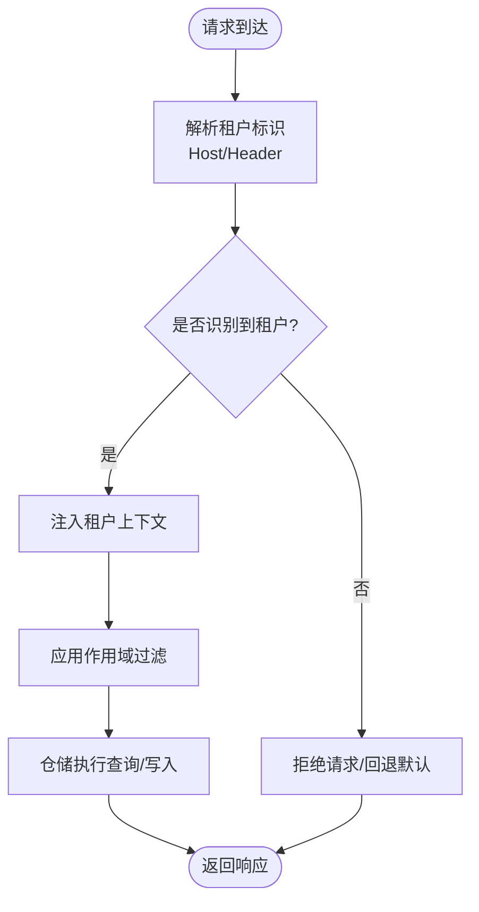
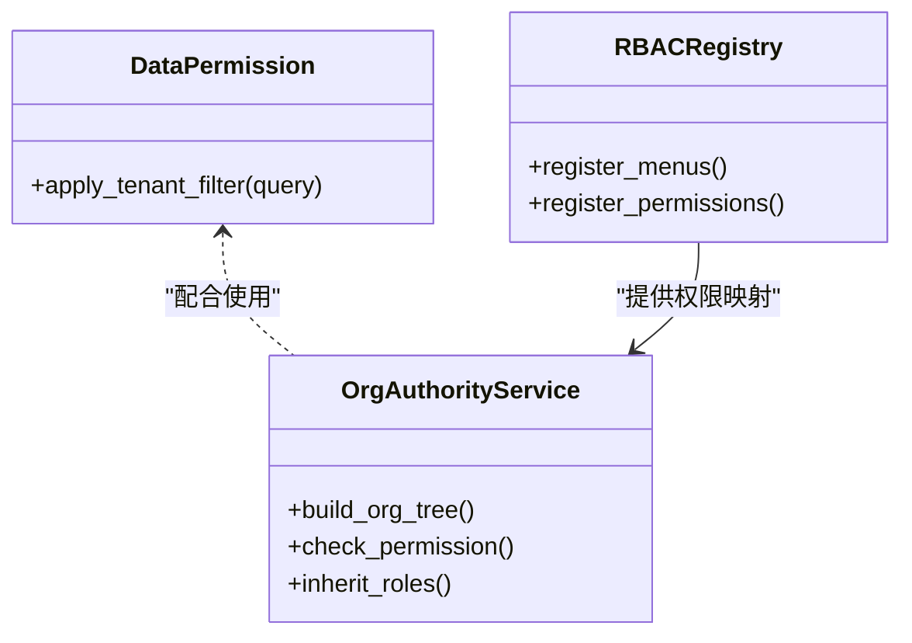
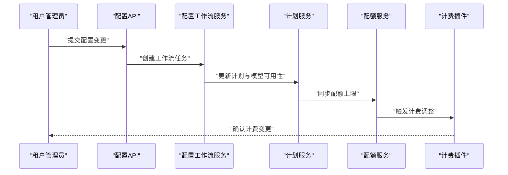
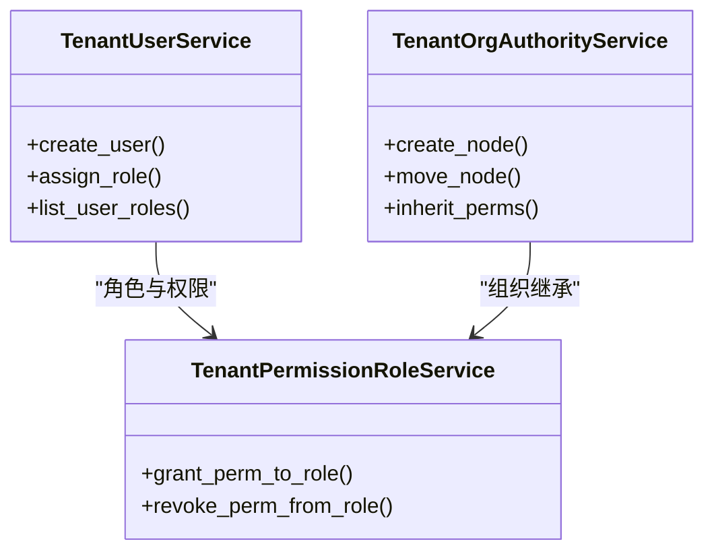
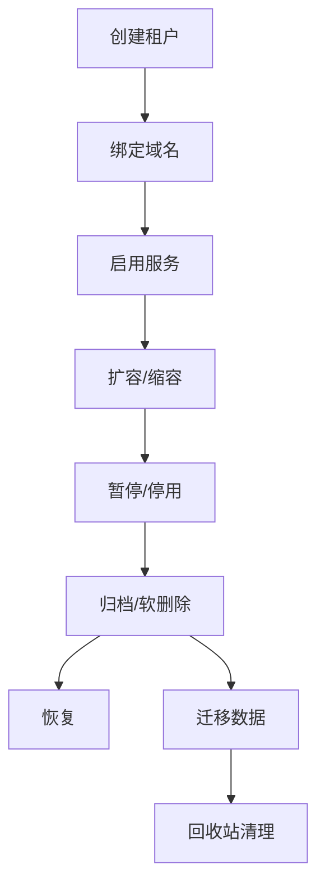
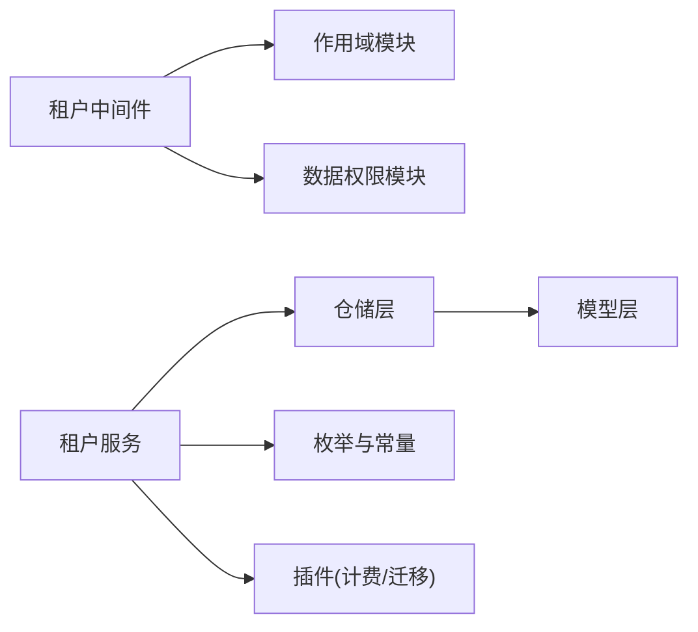

# 多租户管理

<cite>
**本文引用的文件**
- [backend/app/middleware/tenant.py](file://backend/app/middleware/tenant.py)
- [backend/app/core/scope.py](file://backend/app/core/scope.py)
- [backend/app/core/data_permission.py](file://backend/app/core/data_permission.py)
- [backend/app/core/org_authority.py](file://backend/app/core/org_authority.py)
- [backend/app/models/tenant/tenant.py](file://backend/app/models/tenant/tenant.py)
- [backend/app/models/tenant/tenant_domain.py](file://backend/app/models/tenant/tenant_domain.py)
- [backend/app/models/tenant/tenant_plan.py](file://backend/app/models/tenant/tenant_plan.py)
- [backend/app/models/tenant/tenant_user.py](file://backend/app/models/tenant/tenant_user.py)
- [backend/app/models/tenant/tenant_admin.py](file://backend/app/models/tenant/tenant_admin.py)
- [backend/app/models/tenant/tenant_quota.py](file://backend/app/models/tenant/tenant_quota.py)
- [backend/app/schemas/tenant/user.py](file://backend/app/schemas/tenant/user.py)
- [backend/app/schemas/tenant/domain.py](file://backend/app/schemas/tenant/domain.py)
- [backend/app/schemas/tenant/plan.py](file://backend/app/schemas/tenant/plan.py)
- [backend/app/schemas/tenant/tenant_org_node.py](file://backend/app/schemas/tenant/tenant_org_node.py)
- [backend/app/schemas/tenant/tenant_permission_role.py](file://backend/app/schemas/tenant/tenant_permission_role.py)
- [backend/app/repositories/tenant/tenant_user_repository.py](file://backend/app/repositories/tenant/tenant_user_repository.py)
- [backend/app/repositories/tenant/tenant_domain_tenant_repository.py](file://backend/app/repositories/tenant/tenant_domain_tenant_repository.py)
- [backend/app/repositories/tenant/tenant_plan_repository.py](file://backend/app/repositories/tenant/tenant_plan_repository.py)
- [backend/app/repositories/tenant/tenant_org_node_repository.py](file://backend/app/repositories/tenant/tenant_org_node_repository.py)
- [backend/app/repositories/tenant/tenant_permission_role_repository.py](file://backend/app/repositories/tenant/tenant_permission_role_repository.py)
- [backend/app/services/tenant/tenant_user_service.py](file://backend/app/services/tenant/tenant_user_service.py)
- [backend/app/services/tenant/tenant_plan_service.py](file://backend/app/services/tenant/tenant_plan_service.py)
- [backend/app/services/tenant/tenant_org_authority_service.py](file://backend/app/services/tenant/tenant_org_authority_service.py)
- [backend/app/services/tenant/tenant_config_workflow_service.py](file://backend/app/services/tenant/tenant_config_workflow_service.py)
- [backend/app/services/tenant/quota_service.py](file://backend/app/services/tenant/quota_service.py)
- [backend/app/api/tenant/__init__.py](file://backend/app/api/tenant/__init__.py)
- [backend/app/api/tenant/tenant_routes.py](file://backend/app/api/tenant/tenant_routes.py)
- [backend/app/api/tenant/user_routes.py](file://backend/app/api/tenant/user_routes.py)
- [backend/app/api/tenant/domain_routes.py](file://backend/app/api/tenant/domain_routes.py)
- [backend/app/api/tenant/plan_routes.py](file://backend/app/api/tenant/plan_routes.py)
- [backend/app/api/tenant/announcement_routes.py](file://backend/app/api/tenant/announcement_routes.py)
- [backend/app/api/admin/tenants.py](file://backend/app/api/admin/tenants.py)
- [backend/app/api/admin/tenant_domains.py](file://backend/app/api/admin/tenant_domains.py)
- [backend/app/api/admin/tenant_users.py](file://backend/app/api/admin/tenant_users.py)
- [backend/app/api/admin/tenant_admins.py](file://backend/app/api/admin/tenant_admins.py)
- [backend/app/api/public/tenant.py](file://backend/app/api/public/tenant.py)
- [backend/app/enums/domain.py](file://backend/app/enums/domain.py)
- [backend/app/enums/rbac.py](file://backend/app/enums/rbac.py)
- [backend/app/enums/billing.py](file://backend/app/enums/billing.py)
- [backend/app/plugins/storage-billing/service.py](file://backend/app/plugins/storage-billing/service.py)
- [backend/app/plugins/storage-migration/service.py](file://backend/app/plugins/storage-migration/service.py)
- [backend/app/tasks/recycle_bin.py](file://backend/app/tasks/recycle_bin.py)
- [backend/app/tasks/scheduled.py](file://backend/app/tasks/scheduled.py)
- [backend/app/migrations/versions/20260112_0002_add_tenant_domains.py](file://backend/app/migrations/versions/20260112_0002_add_tenant_domains.py)
- [backend/app/migrations/versions/20260208_004_add_tenant_quotas.py](file://backend/app/migrations/versions/20260208_004_add_tenant_quotas.py)
- [backend/app/migrations/versions/20260216_add_tenant_id_to_agent_assignments.py](file://backend/app/migrations/versions/20260216_add_tenant_id_to_agent_assignments.py)
- [backend/app/migrations/versions/20260307_add_tenant_user_roles.py](file://backend/app/migrations/versions/20260307_add_tenant_user_roles.py)
- [backend/app/migrations/versions/20260318_0001_add_tier_column_to_ai_models.py](file://backend/app/migrations/versions/20260318_0001_add_tier_column_to_ai_models.py)
- [backend/app/migrations/versions/20260320_unified_resource_and_permission_scope.py](file://backend/app/migrations/versions/20260320_unified_resource_and_permission_scope.py)
- [backend/app/migrations/versions/20260325_org_authority_rebuild.py](file://backend/app/migrations/versions/20260325_org_authority_rebuild.py)
- [backend/app/migrations/versions/20260325_org_node_perm.py](file://backend/app/migrations/versions/20260325_org_node_perm.py)
- [backend/app/migrations/versions/20260329_0010_normalize_task_definition_platform_scope.py](file://backend/app/migrations/versions/20260329_0010_normalize_task_definition_platform_scope.py)
- [backend/app/migrations/versions/20260329_0020_cleanup_task_binding_scope_semantics.py](file://backend/app/migrations/versions/20260329_0020_cleanup_task_binding_scope_semantics.py)
- [backend/app/migrations/versions/20260329_0030_add_memory_records.py](file://backend/app/migrations/versions/20260329_0030_add_memory_records.py)
- [backend/app/migrations/versions/20260329_0040_add_execution_trust_policies.py](file://backend/app/migrations/versions/20260329_0040_add_execution_trust_policies.py)
- [backend/app/migrations/versions/20260329_0050_add_execution_decisions.py](file://backend/app/migrations/versions/20260329_0050_add_execution_decisions.py)
- [backend/app/migrations/versions/20260330_0060_add_execution_decision_id_to_ai_action_logs.py](file://backend/app/migrations/versions/20260330_0060_add_execution_decision_id_to_ai_action_logs.py)
- [backend/app/migrations/versions/20260330_0070_add_profile_snapshots.py](file://backend/app/migrations/versions/20260330_0070_add_profile_snapshots.py)
- [backend/app/migrations/versions/20260330_0080_ephem_docs.py](file://backend/app/migrations/versions/20260330_0080_ephem_docs.py)
</cite>

## 目录
1. [引言](#引言)
2. [项目结构](#项目结构)
3. [核心组件](#核心组件)
4. [架构总览](#架构总览)
5. [详细组件分析](#详细组件分析)
6. [依赖关系分析](#依赖关系分析)
7. [性能考虑](#性能考虑)
8. [故障排查指南](#故障排查指南)
9. [结论](#结论)
10. [附录](#附录)

## 引言
本文件面向NovusAI SaaS平台的多租户管理能力，系统性阐述多租户架构的设计与实现，覆盖租户隔离、数据访问控制、权限体系、域名绑定、配置与配额、计费集成、用户与组织管理、生命周期与迁移备份等主题，并通过具体代码路径指引帮助开发者快速定位实现细节与最佳实践。

## 项目结构
后端以“领域驱动”方式组织：API层负责对外接口；服务层封装业务规则；仓储层处理数据持久化；模型层定义实体；枚举与中间件提供通用能力。多租户相关能力主要分布在以下模块：
- 中间件与通用能力：租户中间件、作用域与数据权限、组织权限
- 模型与Schema：租户、域名、计划、配额、用户与角色
- 仓储与服务：用户、域名、计划、配额、组织权限、配置工作流
- API路由：租户域内路由、管理员路由、公开路由
- 迁移与插件：数据库迁移脚本、存储计费与迁移插件、定时任务

图表来源
- [backend/app/api/tenant/tenant_routes.py](file://backend/app/api/tenant/tenant_routes.py)
- [backend/app/api/tenant/user_routes.py](file://backend/app/api/tenant/user_routes.py)
- [backend/app/api/tenant/domain_routes.py](file://backend/app/api/tenant/domain_routes.py)
- [backend/app/api/tenant/plan_routes.py](file://backend/app/api/tenant/plan_routes.py)
- [backend/app/api/admin/tenants.py](file://backend/app/api/admin/tenants.py)
- [backend/app/api/public/tenant.py](file://backend/app/api/public/tenant.py)
- [backend/app/services/tenant/tenant_user_service.py](file://backend/app/services/tenant/tenant_user_service.py)
- [backend/app/services/tenant/tenant_plan_service.py](file://backend/app/services/tenant/tenant_plan_service.py)
- [backend/app/services/tenant/tenant_org_authority_service.py](file://backend/app/services/tenant/tenant_org_authority_service.py)
- [backend/app/services/tenant/quota_service.py](file://backend/app/services/tenant/quota_service.py)
- [backend/app/repositories/tenant/tenant_user_repository.py](file://backend/app/repositories/tenant/tenant_user_repository.py)
- [backend/app/repositories/tenant/tenant_domain_tenant_repository.py](file://backend/app/repositories/tenant/tenant_domain_tenant_repository.py)
- [backend/app/repositories/tenant/tenant_plan_repository.py](file://backend/app/repositories/tenant/tenant_plan_repository.py)
- [backend/app/repositories/tenant/tenant_org_node_repository.py](file://backend/app/repositories/tenant/tenant_org_node_repository.py)
- [backend/app/repositories/tenant/tenant_permission_role_repository.py](file://backend/app/repositories/tenant/tenant_permission_role_repository.py)
- [backend/app/models/tenant/tenant_user.py](file://backend/app/models/tenant/tenant_user.py)
- [backend/app/models/tenant/tenant_plan.py](file://backend/app/models/tenant/tenant_plan.py)
- [backend/app/models/tenant/tenant_domain.py](file://backend/app/models/tenant/tenant_domain.py)
- [backend/app/middleware/tenant.py](file://backend/app/middleware/tenant.py)
- [backend/app/core/scope.py](file://backend/app/core/scope.py)
- [backend/app/core/data_permission.py](file://backend/app/core/data_permission.py)
- [backend/app/core/org_authority.py](file://backend/app/core/org_authority.py)

章节来源
- [backend/app/api/tenant/__init__.py](file://backend/app/api/tenant/__init__.py)
- [backend/app/api/tenant/tenant_routes.py](file://backend/app/api/tenant/tenant_routes.py)
- [backend/app/api/tenant/user_routes.py](file://backend/app/api/tenant/user_routes.py)
- [backend/app/api/tenant/domain_routes.py](file://backend/app/api/tenant/domain_routes.py)
- [backend/app/api/tenant/plan_routes.py](file://backend/app/api/tenant/plan_routes.py)
- [backend/app/api/admin/tenants.py](file://backend/app/api/admin/tenants.py)
- [backend/app/api/admin/tenant_domains.py](file://backend/app/api/admin/tenant_domains.py)
- [backend/app/api/admin/tenant_users.py](file://backend/app/api/admin/tenant_users.py)
- [backend/app/api/admin/tenant_admins.py](file://backend/app/api/admin/tenant_admins.py)
- [backend/app/api/public/tenant.py](file://backend/app/api/public/tenant.py)

## 核心组件
- 租户中间件：解析请求上下文中的租户标识，注入当前租户作用域，确保后续服务与仓储在租户边界内执行
- 作用域与数据权限：统一的数据访问范围定义与过滤逻辑，保障跨表关联查询时的租户隔离
- 组织权限：基于组织节点的权限树与继承关系，支持层级授权与数据域控制
- 模型与Schema：租户、域名、计划、配额、用户与角色的实体与输入输出结构
- 仓储与服务：用户与角色管理、域名绑定、计划与配额、组织权限、配置工作流
- API路由：租户域内路由、管理员路由、公开路由，分别服务于租户内部操作、平台级管理与外部公开能力

章节来源
- [backend/app/middleware/tenant.py](file://backend/app/middleware/tenant.py)
- [backend/app/core/scope.py](file://backend/app/core/scope.py)
- [backend/app/core/data_permission.py](file://backend/app/core/data_permission.py)
- [backend/app/core/org_authority.py](file://backend/app/core/org_authority.py)
- [backend/app/models/tenant/tenant.py](file://backend/app/models/tenant/tenant.py)
- [backend/app/models/tenant/tenant_domain.py](file://backend/app/models/tenant/tenant_domain.py)
- [backend/app/models/tenant/tenant_plan.py](file://backend/app/models/tenant/tenant_plan.py)
- [backend/app/models/tenant/tenant_user.py](file://backend/app/models/tenant/tenant_user.py)
- [backend/app/schemas/tenant/user.py](file://backend/app/schemas/tenant/user.py)
- [backend/app/schemas/tenant/domain.py](file://backend/app/schemas/tenant/domain.py)
- [backend/app/schemas/tenant/plan.py](file://backend/app/schemas/tenant/plan.py)

## 架构总览
多租户架构围绕“租户上下文—作用域—权限—数据”的闭环展开。请求进入后由租户中间件解析并注入租户信息，随后在服务层通过作用域与数据权限进行查询过滤，组织权限确保资源可见性与可操作性，最终由仓储层落库并触发相关计费与配额统计。

图表来源
- [backend/app/middleware/tenant.py](file://backend/app/middleware/tenant.py)
- [backend/app/api/tenant/tenant_routes.py](file://backend/app/api/tenant/tenant_routes.py)
- [backend/app/services/tenant/tenant_user_service.py](file://backend/app/services/tenant/tenant_user_service.py)
- [backend/app/repositories/tenant/tenant_user_repository.py](file://backend/app/repositories/tenant/tenant_user_repository.py)

## 详细组件分析

### 租户身份识别与作用域管理
- 身份识别：中间件从请求头或主机名中提取租户标识，建立运行时租户上下文，贯穿整个请求生命周期
- 作用域管理：核心作用域模块提供统一的资源作用域定义，结合数据权限模块对查询进行自动过滤，确保跨表关联也受租户约束
- 域名绑定：域名模型与仓储支持租户域名校验与绑定，配合中间件实现按域名路由到对应租户

图表来源
- [backend/app/middleware/tenant.py](file://backend/app/middleware/tenant.py)
- [backend/app/core/scope.py](file://backend/app/core/scope.py)
- [backend/app/core/data_permission.py](file://backend/app/core/data_permission.py)
- [backend/app/models/tenant/tenant_domain.py](file://backend/app/models/tenant/tenant_domain.py)

章节来源
- [backend/app/middleware/tenant.py](file://backend/app/middleware/tenant.py)
- [backend/app/core/scope.py](file://backend/app/core/scope.py)
- [backend/app/core/data_permission.py](file://backend/app/core/data_permission.py)
- [backend/app/models/tenant/tenant_domain.py](file://backend/app/models/tenant/tenant_domain.py)

### 数据访问控制与权限体系
- 数据权限：通过统一的数据权限过滤器，自动在查询中加入租户条件，避免越权访问
- 组织权限：组织权限服务基于组织节点构建权限树，支持角色继承、数据域限制与动态授权
- 角色与菜单：角色与菜单注册中心提供权限映射与校验，结合装饰器在API层进行细粒度控制

图表来源
- [backend/app/core/data_permission.py](file://backend/app/core/data_permission.py)
- [backend/app/core/org_authority.py](file://backend/app/core/org_authority.py)
- [backend/app/rbac/registry.py](file://backend/app/rbac/registry.py)

章节来源
- [backend/app/core/data_permission.py](file://backend/app/core/data_permission.py)
- [backend/app/core/org_authority.py](file://backend/app/core/org_authority.py)
- [backend/app/enums/rbac.py](file://backend/app/enums/rbac.py)

### 租户配置管理与资源配额
- 配置工作流：配置变更通过工作流服务进行审批与发布，确保租户配置变更的可追溯与一致性
- 资源配额：配额服务提供限额检查、用量统计与超限告警，结合计费插件实现按量计费
- 计划与模型：计划服务管理租户套餐与模型可用性，支持按计划启用/禁用模型与功能

图表来源
- [backend/app/services/tenant/tenant_config_workflow_service.py](file://backend/app/services/tenant/tenant_config_workflow_service.py)
- [backend/app/services/tenant/tenant_plan_service.py](file://backend/app/services/tenant/tenant_plan_service.py)
- [backend/app/services/tenant/quota_service.py](file://backend/app/services/tenant/quota_service.py)
- [backend/app/plugins/storage-billing/service.py](file://backend/app/plugins/storage-billing/service.py)

章节来源
- [backend/app/services/tenant/tenant_config_workflow_service.py](file://backend/app/services/tenant/tenant_config_workflow_service.py)
- [backend/app/services/tenant/tenant_plan_service.py](file://backend/app/services/tenant/tenant_plan_service.py)
- [backend/app/services/tenant/quota_service.py](file://backend/app/services/tenant/quota_service.py)
- [backend/app/enums/billing.py](file://backend/app/enums/billing.py)

### 用户权限继承与组织结构管理
- 用户与角色：用户服务与仓储提供用户增删改查、角色分配与继承；角色服务支持角色层级与权限合并
- 组织节点：组织节点服务维护组织树，支持节点移动、权限下放与继承链路
- 权限角色：权限角色模型与仓储支持细粒度权限与角色绑定，结合组织权限实现跨节点的权限传播

图表来源
- [backend/app/services/tenant/tenant_user_service.py](file://backend/app/services/tenant/tenant_user_service.py)
- [backend/app/services/tenant/tenant_org_authority_service.py](file://backend/app/services/tenant/tenant_org_authority_service.py)
- [backend/app/services/tenant/tenant_permission_role_service.py](file://backend/app/services/tenant/tenant_permission_role_service.py)
- [backend/app/repositories/tenant/tenant_user_role_repository.py](file://backend/app/repositories/tenant/tenant_user_role_repository.py)
- [backend/app/schemas/tenant/tenant_permission_role.py](file://backend/app/schemas/tenant/tenant_permission_role.py)

章节来源
- [backend/app/services/tenant/tenant_user_service.py](file://backend/app/services/tenant/tenant_user_service.py)
- [backend/app/services/tenant/tenant_org_authority_service.py](file://backend/app/services/tenant/tenant_org_authority_service.py)
- [backend/app/services/tenant/tenant_permission_role_service.py](file://backend/app/services/tenant/tenant_permission_role_service.py)
- [backend/app/repositories/tenant/tenant_user_role_repository.py](file://backend/app/repositories/tenant/tenant_user_role_repository.py)
- [backend/app/schemas/tenant/tenant_permission_role.py](file://backend/app/schemas/tenant/tenant_permission_role.py)

### 域名绑定与租户生命周期
- 域名绑定：域名API支持添加、验证与删除租户域名，仓储层保证唯一性与有效性
- 生命周期：从创建租户到停用/删除，涉及数据隔离、资源回收与审计日志；迁移插件支持跨租户数据迁移
- 备份与恢复：回收站与定时任务配合实现软删除与周期性清理，支持备份与恢复流程

图表来源
- [backend/app/api/tenant/domain_routes.py](file://backend/app/api/tenant/domain_routes.py)
- [backend/app/repositories/tenant/tenant_domain_tenant_repository.py](file://backend/app/repositories/tenant/tenant_domain_tenant_repository.py)
- [backend/app/plugins/storage-migration/service.py](file://backend/app/plugins/storage-migration/service.py)
- [backend/app/tasks/recycle_bin.py](file://backend/app/tasks/recycle_bin.py)
- [backend/app/tasks/scheduled.py](file://backend/app/tasks/scheduled.py)

章节来源
- [backend/app/api/tenant/domain_routes.py](file://backend/app/api/tenant/domain_routes.py)
- [backend/app/repositories/tenant/tenant_domain_tenant_repository.py](file://backend/app/repositories/tenant/tenant_domain_tenant_repository.py)
- [backend/app/plugins/storage-migration/service.py](file://backend/app/plugins/storage-migration/service.py)
- [backend/app/tasks/recycle_bin.py](file://backend/app/tasks/recycle_bin.py)
- [backend/app/tasks/scheduled.py](file://backend/app/tasks/scheduled.py)

### 多租户API使用与最佳实践
- 租户域内API：通过租户路由访问，自动携带租户上下文，适合内部资源管理
- 管理员API：平台管理员对租户进行全局管理，如域名审核、用户封禁等
- 公开API：对外公开能力，需谨慎设置访问控制与配额
- 最佳实践：
  - 在中间件层统一解析租户标识，避免在各服务重复解析
  - 使用作用域与数据权限过滤器，确保所有查询均受租户约束
  - 对敏感操作使用工作流与审计日志，保留变更轨迹
  - 对外暴露的API应设置严格的配额与速率限制

章节来源
- [backend/app/api/tenant/tenant_routes.py](file://backend/app/api/tenant/tenant_routes.py)
- [backend/app/api/tenant/user_routes.py](file://backend/app/api/tenant/user_routes.py)
- [backend/app/api/tenant/domain_routes.py](file://backend/app/api/tenant/domain_routes.py)
- [backend/app/api/tenant/plan_routes.py](file://backend/app/api/tenant/plan_routes.py)
- [backend/app/api/admin/tenants.py](file://backend/app/api/admin/tenants.py)
- [backend/app/api/admin/tenant_domains.py](file://backend/app/api/admin/tenant_domains.py)
- [backend/app/api/admin/tenant_users.py](file://backend/app/api/admin/tenant_users.py)
- [backend/app/api/admin/tenant_admins.py](file://backend/app/api/admin/tenant_admins.py)
- [backend/app/api/public/tenant.py](file://backend/app/api/public/tenant.py)

## 依赖关系分析
多租户能力的耦合与协作体现在以下方面：
- 中间件依赖作用域与数据权限模块，形成统一的租户上下文
- 服务层依赖仓储层，仓储层依赖模型层，形成清晰的分层
- 组织权限服务与角色/菜单注册中心协同，提供细粒度权限控制
- 计费插件与配额服务联动，实现资源使用的闭环管理

图表来源
- [backend/app/middleware/tenant.py](file://backend/app/middleware/tenant.py)
- [backend/app/core/scope.py](file://backend/app/core/scope.py)
- [backend/app/core/data_permission.py](file://backend/app/core/data_permission.py)
- [backend/app/services/tenant/tenant_user_service.py](file://backend/app/services/tenant/tenant_user_service.py)
- [backend/app/repositories/tenant/tenant_user_repository.py](file://backend/app/repositories/tenant/tenant_user_repository.py)
- [backend/app/enums/domain.py](file://backend/app/enums/domain.py)
- [backend/app/enums/rbac.py](file://backend/app/enums/rbac.py)
- [backend/app/enums/billing.py](file://backend/app/enums/billing.py)
- [backend/app/plugins/storage-billing/service.py](file://backend/app/plugins/storage-billing/service.py)
- [backend/app/plugins/storage-migration/service.py](file://backend/app/plugins/storage-migration/service.py)

章节来源
- [backend/app/middleware/tenant.py](file://backend/app/middleware/tenant.py)
- [backend/app/core/scope.py](file://backend/app/core/scope.py)
- [backend/app/core/data_permission.py](file://backend/app/core/data_permission.py)
- [backend/app/services/tenant/tenant_user_service.py](file://backend/app/services/tenant/tenant_user_service.py)
- [backend/app/repositories/tenant/tenant_user_repository.py](file://backend/app/repositories/tenant/tenant_user_repository.py)
- [backend/app/enums/domain.py](file://backend/app/enums/domain.py)
- [backend/app/enums/rbac.py](file://backend/app/enums/rbac.py)
- [backend/app/enums/billing.py](file://backend/app/enums/billing.py)
- [backend/app/plugins/storage-billing/service.py](file://backend/app/plugins/storage-billing/service.py)
- [backend/app/plugins/storage-migration/service.py](file://backend/app/plugins/storage-migration/service.py)

## 性能考虑
- 查询优化：在仓储层为常用过滤字段建立索引，减少跨租户扫描；对大表采用分页与投影
- 缓存策略：对只读配置与计划信息进行缓存，降低频繁查询成本
- 并发控制：配额检查与计费计算需原子化，避免并发导致的超支
- 监控与告警：对慢查询、超配额与异常计费进行监控与告警

## 故障排查指南
- 租户识别失败：检查中间件对Host/Header的解析逻辑，确认域名与租户映射正确
- 数据越权：核查数据权限过滤器是否生效，确认查询语句是否包含租户条件
- 权限异常：核对组织权限树与角色继承链，确认权限授予与回收流程
- 配额超限：检查配额服务的用量统计与计费插件的触发时机
- 回收站问题：核对定时任务与回收站清理策略，确认软删除与硬清理的边界

章节来源
- [backend/app/middleware/tenant.py](file://backend/app/middleware/tenant.py)
- [backend/app/core/data_permission.py](file://backend/app/core/data_permission.py)
- [backend/app/core/org_authority.py](file://backend/app/core/org_authority.py)
- [backend/app/services/tenant/quota_service.py](file://backend/app/services/tenant/quota_service.py)
- [backend/app/tasks/recycle_bin.py](file://backend/app/tasks/recycle_bin.py)
- [backend/app/tasks/scheduled.py](file://backend/app/tasks/scheduled.py)

## 结论
NovusAI的多租户系统通过“租户中间件+作用域+数据权限+组织权限”的组合拳，实现了强隔离与灵活扩展。配合计划、配额与计费插件，形成了从配置到使用的完整闭环。建议在生产环境中强化监控与审计，持续优化查询与缓存策略，确保多租户场景下的稳定性与性能。

## 附录
- 数据库迁移要点：关注域名、配额、角色与组织权限相关迁移脚本，确保版本升级时的数据一致性
- 插件生态：计费与迁移插件作为扩展点，建议制定标准化接口与测试规范

章节来源
- [backend/app/migrations/versions/20260112_0002_add_tenant_domains.py](file://backend/app/migrations/versions/20260112_0002_add_tenant_domains.py)
- [backend/app/migrations/versions/20260208_004_add_tenant_quotas.py](file://backend/app/migrations/versions/20260208_004_add_tenant_quotas.py)
- [backend/app/migrations/versions/20260307_add_tenant_user_roles.py](file://backend/app/migrations/versions/20260307_add_tenant_user_roles.py)
- [backend/app/migrations/versions/20260325_org_authority_rebuild.py](file://backend/app/migrations/versions/20260325_org_authority_rebuild.py)
- [backend/app/migrations/versions/20260325_org_node_perm.py](file://backend/app/migrations/versions/20260325_org_node_perm.py)
- [backend/app/plugins/storage-billing/service.py](file://backend/app/plugins/storage-billing/service.py)
- [backend/app/plugins/storage-migration/service.py](file://backend/app/plugins/storage-migration/service.py)