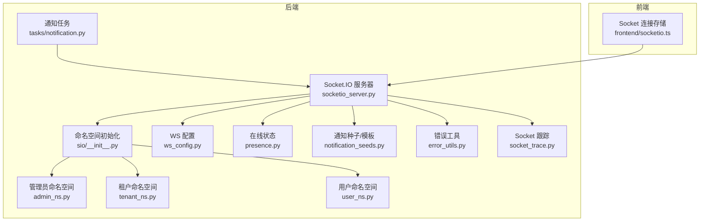
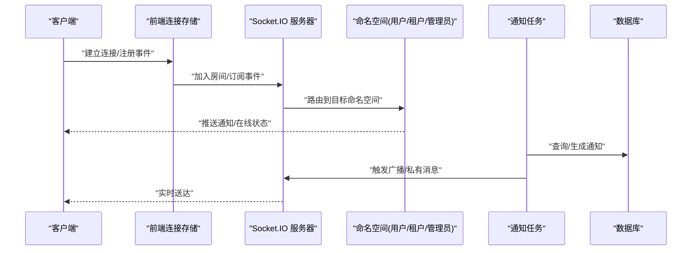
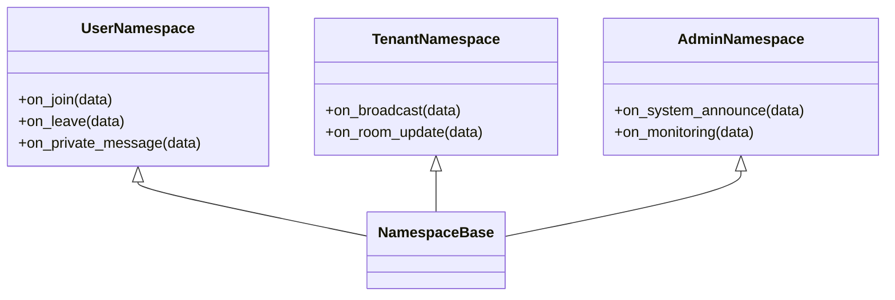
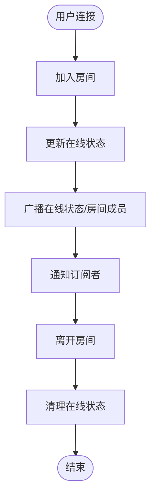
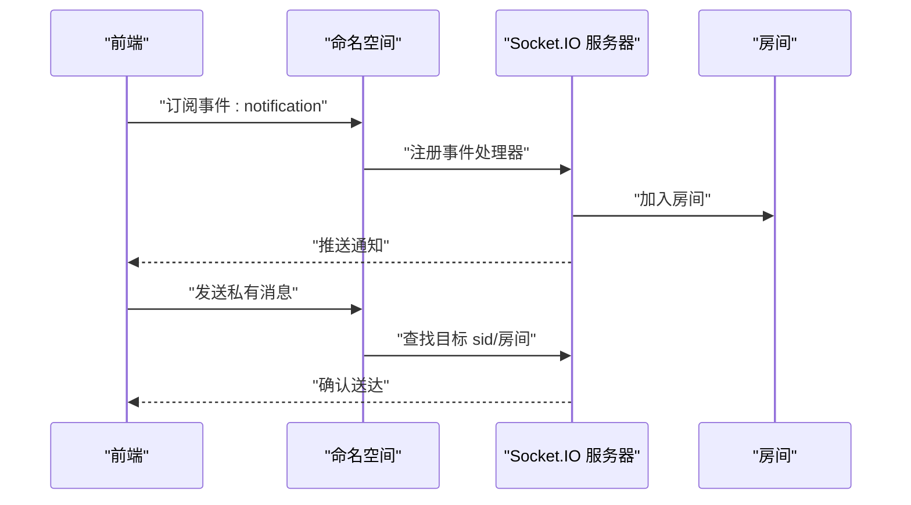
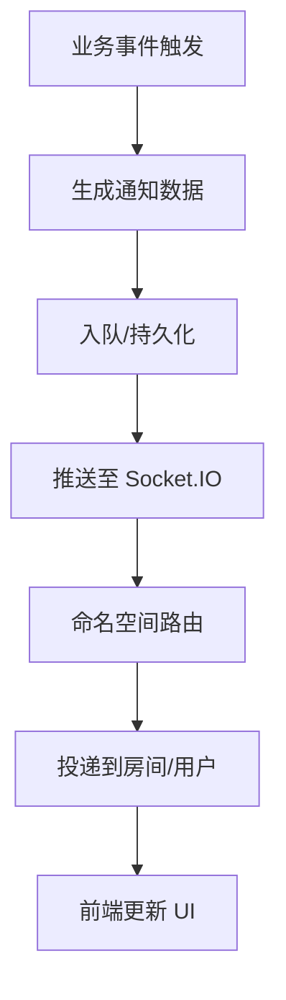
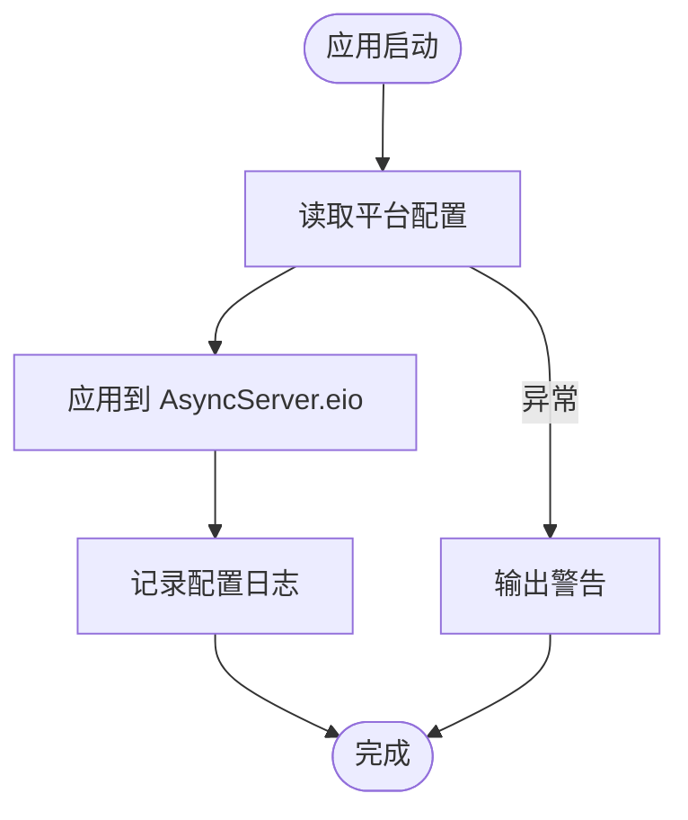
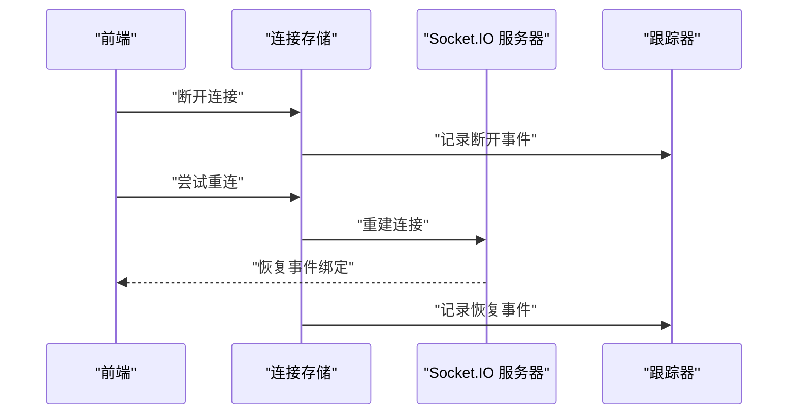
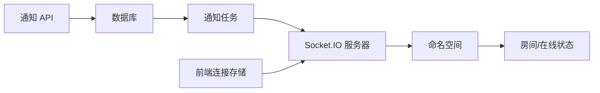

# 实时通知系统

<cite>
**本文引用的文件**
- [backend/app/sio/__init__.py](file://backend/app/sio/__init__.py)
- [backend/app/sio/admin_ns.py](file://backend/app/sio/admin_ns.py)
- [backend/app/sio/tenant_ns.py](file://backend/app/sio/tenant_ns.py)
- [backend/app/sio/user_ns.py](file://backend/app/sio/user_ns.py)
- [backend/app/sio/ws_config.py](file://backend/app/sio/ws_config.py)
- [backend/app/sio/presence.py](file://backend/app/sio/presence.py)
- [backend/app/sio/notification_seeds.py](file://backend/app/sio/notification_seeds.py)
- [backend/app/sio/error_utils.py](file://backend/app/sio/error_utils.py)
- [backend/app/sio/socket_trace.py](file://backend/app/sio/socket_trace.py)
- [backend/app/core/socketio_server.py](file://backend/app/core/socketio_server.py)
- [backend/app/tasks/notification.py](file://backend/app/tasks/notification.py)
- [backend/app/api/tenant/notifications.py](file://backend/app/api/tenant/notifications.py)
- [backend/app/api/tenant/notification_preferences.py](file://backend/app/api/tenant/notification_preferences.py)
- [frontend/apps/web-antd/src/store/shared/socketio.ts](file://frontend/apps/web-antd/src/store/shared/socketio.ts)
</cite>

## 目录
1. [简介](#简介)
2. [项目结构](#项目结构)
3. [核心组件](#核心组件)
4. [架构总览](#架构总览)
5. [详细组件分析](#详细组件分析)
6. [依赖关系分析](#依赖关系分析)
7. [性能考虑](#性能考虑)
8. [故障排查指南](#故障排查指南)
9. [结论](#结论)
10. [附录](#附录)

## 简介
本文件面向 NovusAI SaaS 项目的实时通知系统，系统基于 Socket.IO 构建，提供用户、租户与管理员三层通知通道，支持在线状态管理、消息广播与私有消息传递，并通过任务调度实现事件驱动的实时数据同步与状态变更通知。本文档从架构设计、命名空间与连接管理、事件订阅机制、在线状态与心跳、故障恢复与性能优化等维度进行深入解析，并给出可操作的配置与使用路径。

## 项目结构
实时通知系统主要由后端命名空间模块、WebSocket 配置与服务、前端连接与事件处理组成，同时配合任务调度与 API 接口完成偏好设置与未读计数等功能。

图表来源
- [backend/app/core/socketio_server.py:46-87](file://backend/app/core/socketio_server.py#L46-L87)
- [backend/app/sio/__init__.py:20-30](file://backend/app/sio/__init__.py#L20-L30)
- [backend/app/sio/admin_ns.py](file://backend/app/sio/admin_ns.py)
- [backend/app/sio/tenant_ns.py](file://backend/app/sio/tenant_ns.py)
- [backend/app/sio/user_ns.py](file://backend/app/sio/user_ns.py)
- [backend/app/sio/ws_config.py](file://backend/app/sio/ws_config.py)
- [backend/app/sio/presence.py](file://backend/app/sio/presence.py)
- [backend/app/sio/notification_seeds.py](file://backend/app/sio/notification_seeds.py)
- [backend/app/sio/error_utils.py](file://backend/app/sio/error_utils.py)
- [backend/app/sio/socket_trace.py](file://backend/app/sio/socket_trace.py)
- [backend/app/tasks/notification.py](file://backend/app/tasks/notification.py)
- [frontend/apps/web-antd/src/store/shared/socketio.ts:110-157](file://frontend/apps/web-antd/src/store/shared/socketio.ts#L110-L157)

章节来源
- [backend/app/core/socketio_server.py:46-87](file://backend/app/core/socketio_server.py#L46-L87)
- [backend/app/sio/__init__.py:20-30](file://backend/app/sio/__init__.py#L20-L30)

## 核心组件
- 命名空间层：分别定义用户、租户、管理员三类通知通道，按角色隔离事件与房间。
- WebSocket 配置：动态加载平台配置，调整 ping 间隔与超时，影响新连接的心跳行为。
- 在线状态：维护用户在线状态与房间成员，支持 presence 事件广播。
- 通知种子与模板：统一管理通知类型与渲染模板，便于扩展与复用。
- 错误与跟踪：集中化错误处理与 Socket 行为跟踪，辅助排障。
- 任务调度：后台任务触发通知发送，解耦业务与实时推送。
- 前端连接存储：封装 Socket 连接、事件注册与断线重连逻辑。

章节来源
- [backend/app/sio/admin_ns.py](file://backend/app/sio/admin_ns.py)
- [backend/app/sio/tenant_ns.py](file://backend/app/sio/tenant_ns.py)
- [backend/app/sio/user_ns.py](file://backend/app/sio/user_ns.py)
- [backend/app/sio/ws_config.py](file://backend/app/sio/ws_config.py)
- [backend/app/sio/presence.py](file://backend/app/sio/presence.py)
- [backend/app/sio/notification_seeds.py](file://backend/app/sio/notification_seeds.py)
- [backend/app/sio/error_utils.py](file://backend/app/sio/error_utils.py)
- [backend/app/sio/socket_trace.py](file://backend/app/sio/socket_trace.py)
- [backend/app/tasks/notification.py](file://backend/app/tasks/notification.py)
- [frontend/apps/web-antd/src/store/shared/socketio.ts:110-157](file://frontend/apps/web-antd/src/store/shared/socketio.ts#L110-L157)

## 架构总览
系统采用“命名空间隔离 + 任务驱动 + 前端事件订阅”的架构模式。业务侧通过 API 或任务触发通知，Socket.IO 将消息路由至对应命名空间与房间，最终由前端事件处理器消费并更新 UI。

图表来源
- [backend/app/core/socketio_server.py:46-87](file://backend/app/core/socketio_server.py#L46-L87)
- [backend/app/sio/admin_ns.py](file://backend/app/sio/admin_ns.py)
- [backend/app/sio/tenant_ns.py](file://backend/app/sio/tenant_ns.py)
- [backend/app/sio/user_ns.py](file://backend/app/sio/user_ns.py)
- [backend/app/tasks/notification.py](file://backend/app/tasks/notification.py)
- [frontend/apps/web-antd/src/store/shared/socketio.ts:110-157](file://frontend/apps/web-antd/src/store/shared/socketio.ts#L110-L157)

## 详细组件分析

### 命名空间设计与连接管理
- 用户命名空间：面向普通用户，负责私有消息与个人房间的事件订阅。
- 租户命名空间：面向租户管理员，支持租户级广播与房间管理。
- 管理员命名空间：面向系统管理员，用于全局或平台级通知。
- 初始化流程：在应用生命周期中注册各命名空间，确保连接建立后即可接收对应事件。

图表来源
- [backend/app/sio/user_ns.py](file://backend/app/sio/user_ns.py)
- [backend/app/sio/tenant_ns.py](file://backend/app/sio/tenant_ns.py)
- [backend/app/sio/admin_ns.py](file://backend/app/sio/admin_ns.py)

章节来源
- [backend/app/sio/__init__.py:20-30](file://backend/app/sio/__init__.py#L20-L30)
- [backend/app/sio/user_ns.py](file://backend/app/sio/user_ns.py)
- [backend/app/sio/tenant_ns.py](file://backend/app/sio/tenant_ns.py)
- [backend/app/sio/admin_ns.py](file://backend/app/sio/admin_ns.py)

### 在线状态管理与房间机制
- 在线状态：通过 presence 模块维护用户在线集合与房间成员，支持查询与广播。
- 房间加入/离开：命名空间监听 join/leave 事件，将用户加入/移除对应房间。
- 广播策略：根据房间与角色维度进行定向广播，避免跨域消息泄露。

图表来源
- [backend/app/sio/presence.py](file://backend/app/sio/presence.py)
- [backend/app/sio/user_ns.py](file://backend/app/sio/user_ns.py)
- [backend/app/sio/tenant_ns.py](file://backend/app/sio/tenant_ns.py)
- [backend/app/sio/admin_ns.py](file://backend/app/sio/admin_ns.py)

章节来源
- [backend/app/sio/presence.py](file://backend/app/sio/presence.py)
- [backend/app/sio/user_ns.py](file://backend/app/sio/user_ns.py)
- [backend/app/sio/tenant_ns.py](file://backend/app/sio/tenant_ns.py)
- [backend/app/sio/admin_ns.py](file://backend/app/sio/admin_ns.py)

### 事件订阅机制与消息传递
- 私有消息：用户命名空间支持一对一私信，仅向指定 sid 或用户房间投递。
- 广播消息：租户/管理员命名空间支持房间内广播，实现多用户同时接收。
- 事件命名：前端通过事件名注册回调，后端按命名空间与房间路由，保证低耦合与高内聚。

图表来源
- [frontend/apps/web-antd/src/store/shared/socketio.ts:110-157](file://frontend/apps/web-antd/src/store/shared/socketio.ts#L110-L157)
- [backend/app/sio/user_ns.py](file://backend/app/sio/user_ns.py)
- [backend/app/sio/tenant_ns.py](file://backend/app/sio/tenant_ns.py)
- [backend/app/sio/admin_ns.py](file://backend/app/sio/admin_ns.py)

章节来源
- [frontend/apps/web-antd/src/store/shared/socketio.ts:110-157](file://frontend/apps/web-antd/src/store/shared/socketio.ts#L110-L157)
- [backend/app/sio/user_ns.py](file://backend/app/sio/user_ns.py)
- [backend/app/sio/tenant_ns.py](file://backend/app/sio/tenant_ns.py)
- [backend/app/sio/admin_ns.py](file://backend/app/sio/admin_ns.py)

### 实时数据同步与状态变更通知
- 任务驱动：后台任务根据业务事件生成通知，调用 Socket.IO 广播或私有消息。
- 事件驱动：命名空间监听业务事件，转换为实时通知事件，推送给订阅者。
- 数据一致性：通过数据库事务与任务队列保障通知生成与推送的一致性。

图表来源
- [backend/app/tasks/notification.py](file://backend/app/tasks/notification.py)
- [backend/app/sio/admin_ns.py](file://backend/app/sio/admin_ns.py)
- [backend/app/sio/tenant_ns.py](file://backend/app/sio/tenant_ns.py)
- [backend/app/sio/user_ns.py](file://backend/app/sio/user_ns.py)

章节来源
- [backend/app/tasks/notification.py](file://backend/app/tasks/notification.py)
- [backend/app/sio/admin_ns.py](file://backend/app/sio/admin_ns.py)
- [backend/app/sio/tenant_ns.py](file://backend/app/sio/tenant_ns.py)
- [backend/app/sio/user_ns.py](file://backend/app/sio/user_ns.py)

### WebSocket 配置与心跳检测
- 动态配置：启动阶段从平台配置读取 ws_enabled、ws_ping_interval、ws_ping_timeout，应用于引擎属性。
- 心跳策略：新连接生效，旧连接保持原有心跳参数；ping_interval/ping_timeout 控制保活与超时阈值。
- 日志记录：成功应用配置后记录日志，失败时输出警告，便于运维监控。

图表来源
- [backend/app/core/socketio_server.py:51-87](file://backend/app/core/socketio_server.py#L51-L87)
- [backend/app/sio/ws_config.py](file://backend/app/sio/ws_config.py)

章节来源
- [backend/app/core/socketio_server.py:51-87](file://backend/app/core/socketio_server.py#L51-L87)
- [backend/app/sio/ws_config.py](file://backend/app/sio/ws_config.py)

### 错误处理与故障恢复
- 错误工具：集中化错误处理，提供统一的错误码与消息格式。
- Socket 跟踪：记录关键事件与异常，辅助定位连接与路由问题。
- 前端断线重连：前端连接存储提供断开与重连逻辑，保留已注册事件处理器，登出时重置。

图表来源
- [backend/app/sio/error_utils.py](file://backend/app/sio/error_utils.py)
- [backend/app/sio/socket_trace.py](file://backend/app/sio/socket_trace.py)
- [frontend/apps/web-antd/src/store/shared/socketio.ts:110-157](file://frontend/apps/web-antd/src/store/shared/socketio.ts#L110-L157)

章节来源
- [backend/app/sio/error_utils.py](file://backend/app/sio/error_utils.py)
- [backend/app/sio/socket_trace.py](file://backend/app/sio/socket_trace.py)
- [frontend/apps/web-antd/src/store/shared/socketio.ts:110-157](file://frontend/apps/web-antd/src/store/shared/socketio.ts#L110-L157)

### 通知种子与模板
- 通知种子：统一管理通知类型、模板与渲染规则，便于扩展与复用。
- 模板复用：通过种子与模板实现多场景通知的标准化输出。

章节来源
- [backend/app/sio/notification_seeds.py](file://backend/app/sio/notification_seeds.py)

### 前端实时通知配置与使用
- 连接管理：封装连接建立、断开、事件注册与重连逻辑。
- 事件处理：通过事件名注册回调，自动绑定与解绑，支持断线后自动重绑。
- 登出清理：登出时调用重置方法，清空事件处理器，避免内存泄漏。

章节来源
- [frontend/apps/web-antd/src/store/shared/socketio.ts:110-157](file://frontend/apps/web-antd/src/store/shared/socketio.ts#L110-L157)

### API 支撑：未读计数与偏好设置
- 未读计数：提供租户管理员未读通知数量查询接口。
- 偏好设置：支持批量保存与重置通知偏好，包含全局回退逻辑。

章节来源
- [backend/app/api/tenant/notifications.py:76-109](file://backend/app/api/tenant/notifications.py#L76-L109)
- [backend/app/api/tenant/notification_preferences.py:69-120](file://backend/app/api/tenant/notification_preferences.py#L69-L120)

## 依赖关系分析
- 命名空间依赖于 Socket.IO 服务器与房间管理模块，通过事件路由实现解耦。
- 任务调度依赖数据库与 Socket.IO 服务器，形成事件驱动的数据同步链路。
- 前端依赖连接存储与命名空间事件，实现 UI 与实时数据的联动。

图表来源
- [backend/app/tasks/notification.py](file://backend/app/tasks/notification.py)
- [backend/app/core/socketio_server.py:46-87](file://backend/app/core/socketio_server.py#L46-L87)
- [backend/app/sio/__init__.py:20-30](file://backend/app/sio/__init__.py#L20-L30)
- [frontend/apps/web-antd/src/store/shared/socketio.ts:110-157](file://frontend/apps/web-antd/src/store/shared/socketio.ts#L110-L157)
- [backend/app/api/tenant/notifications.py:76-109](file://backend/app/api/tenant/notifications.py#L76-L109)

章节来源
- [backend/app/tasks/notification.py](file://backend/app/tasks/notification.py)
- [backend/app/core/socketio_server.py:46-87](file://backend/app/core/socketio_server.py#L46-L87)
- [backend/app/sio/__init__.py:20-30](file://backend/app/sio/__init__.py#L20-L30)
- [frontend/apps/web-antd/src/store/shared/socketio.ts:110-157](file://frontend/apps/web-antd/src/store/shared/socketio.ts#L110-L157)
- [backend/app/api/tenant/notifications.py:76-109](file://backend/app/api/tenant/notifications.py#L76-L109)

## 性能考虑
- 心跳参数：合理设置 ping_interval 与 ping_timeout，平衡保活与资源消耗。
- 房间规模：控制房间成员数量，避免大规模广播导致延迟上升。
- 事件粒度：按需订阅事件，减少不必要的事件处理与序列化开销。
- 任务批量化：将高频通知合并或限流，降低 Socket.IO 压力。
- 前端缓存：前端对重复通知进行去重与节流，提升用户体验。

## 故障排查指南
- 连接失败：检查平台配置是否正确应用，确认 ws_enabled、ping_interval、ping_timeout 设置。
- 事件未到达：核对前端事件注册与命名空间事件名是否一致，查看跟踪日志定位路由问题。
- 在线状态异常：检查 presence 模块房间加入/离开逻辑，确认房间成员一致性。
- 断线重连：确认前端断开与重连逻辑，必要时调用重置方法清理事件处理器。

章节来源
- [backend/app/core/socketio_server.py:51-87](file://backend/app/core/socketio_server.py#L51-L87)
- [backend/app/sio/socket_trace.py](file://backend/app/sio/socket_trace.py)
- [frontend/apps/web-antd/src/store/shared/socketio.ts:110-157](file://frontend/apps/web-antd/src/store/shared/socketio.ts#L110-L157)

## 结论
本实时通知系统以命名空间隔离为核心，结合任务驱动与事件路由，实现了用户、租户、管理员三层通知通道的高效运行。通过动态 WS 配置、在线状态管理与错误跟踪，系统具备良好的可维护性与可观测性。建议在生产环境中持续优化心跳参数、房间规模与事件粒度，并完善前端去重与节流策略，以获得更佳的实时体验与性能表现。

## 附录
- 配置项参考
  - ws_enabled：启用/禁用 WebSocket
  - ws_ping_interval：心跳间隔（秒）
  - ws_ping_timeout：心跳超时（秒）
- 前端事件名建议
  - 私有消息：notification
  - 在线状态：presence:online
  - 房间更新：room:update