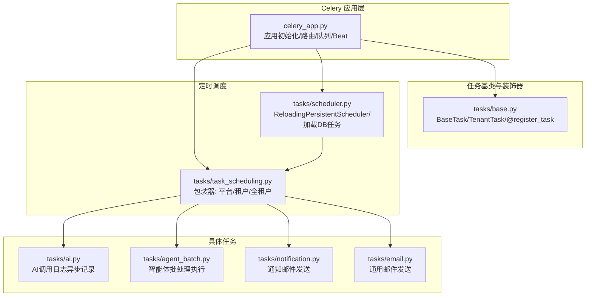
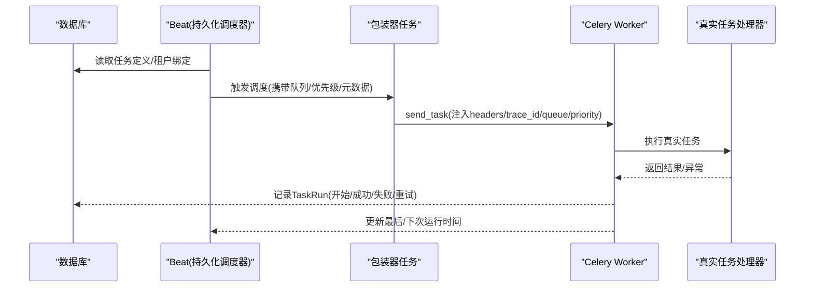
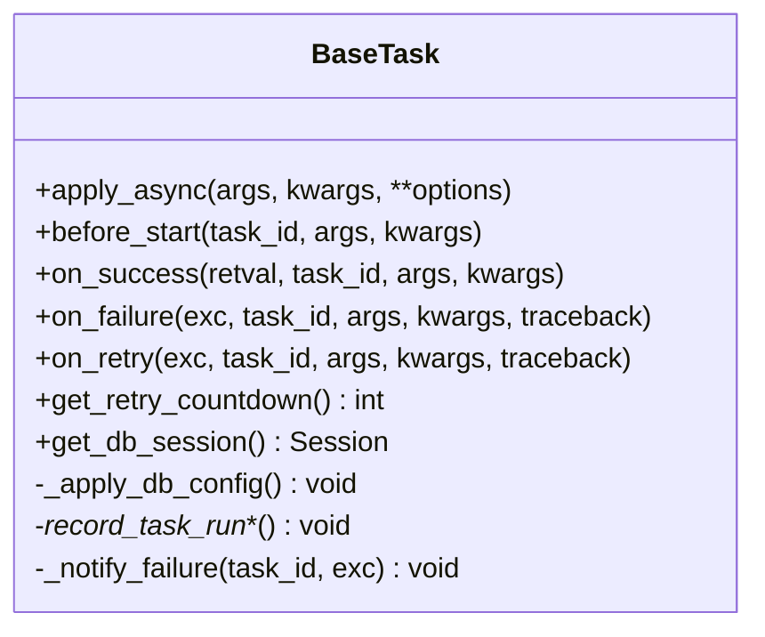
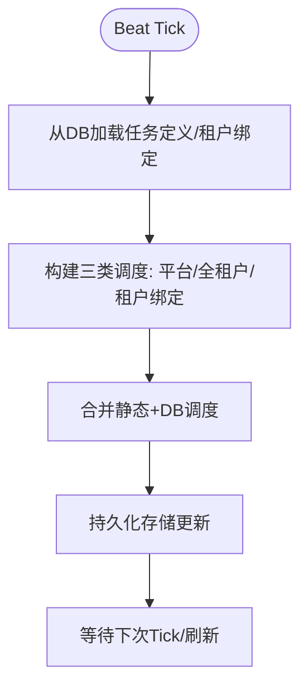
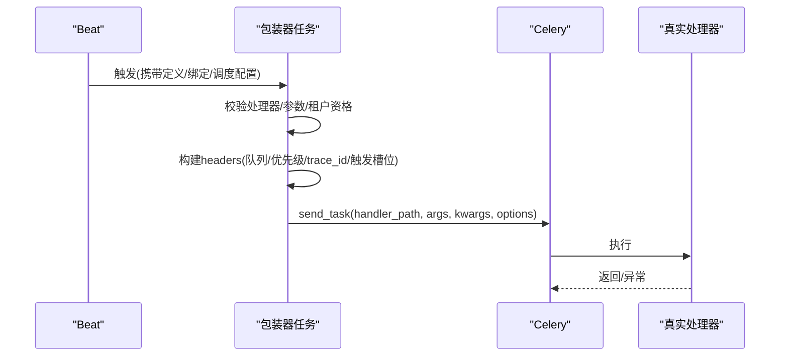
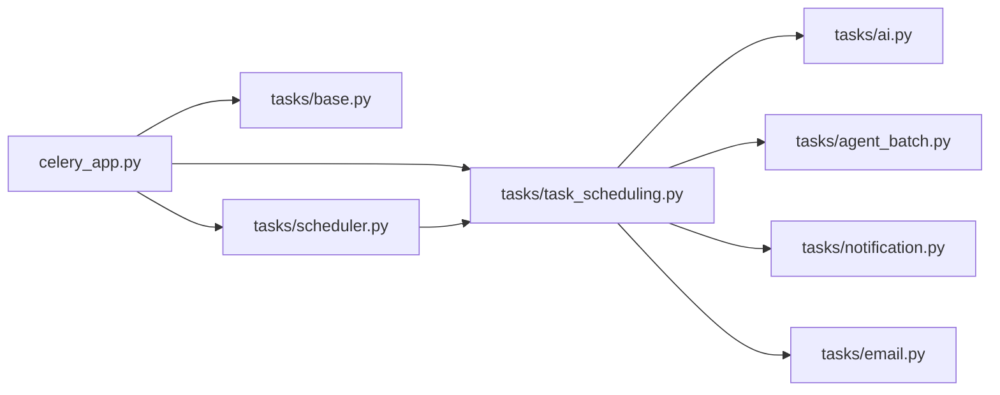

# 异步任务处理

<cite>
**本文引用的文件**
- [backend/app/celery_app.py](file://backend/app/celery_app.py)
- [backend/app/tasks/base.py](file://backend/app/tasks/base.py)
- [backend/app/tasks/scheduler.py](file://backend/app/tasks/scheduler.py)
- [backend/app/tasks/task_scheduling.py](file://backend/app/tasks/task_scheduling.py)
- [backend/app/tasks/ai.py](file://backend/app/tasks/ai.py)
- [backend/app/tasks/agent_batch.py](file://backend/app/tasks/agent_batch.py)
- [backend/app/tasks/notification.py](file://backend/app/tasks/notification.py)
- [backend/app/tasks/email.py](file://backend/app/tasks/email.py)
</cite>

## 目录
1. [简介](#简介)
2. [项目结构](#项目结构)
3. [核心组件](#核心组件)
4. [架构总览](#架构总览)
5. [详细组件分析](#详细组件分析)
6. [依赖分析](#依赖分析)
7. [性能考量](#性能考量)
8. [故障排查指南](#故障排查指南)
9. [结论](#结论)
10. [附录](#附录)

## 简介
本文件面向 NovusAI SaaS 的异步任务处理系统，围绕 Celery 任务队列的配置与使用进行系统性说明，涵盖任务调度、执行监控、结果管理、定时任务调度器、任务优先级与并发控制、任务分类与实现、重试策略与失败恢复、状态跟踪与进度报告、性能监控等主题。文档通过代码级图示与路径引用，帮助开发者快速理解并实践该系统的最佳实践。

## 项目结构
异步任务处理相关的核心代码位于 backend/app/tasks 目录，Celery 应用入口与全局配置位于 backend/app/celery_app.py。定时任务调度器与包装器位于 backend/app/tasks/scheduler.py 与 backend/app/tasks/task_scheduling.py。AI 相关任务、智能体批处理、通知与邮件发送任务分别位于对应模块中。

图表来源
- [backend/app/celery_app.py:1-226](file://backend/app/celery_app.py#L1-L226)
- [backend/app/tasks/base.py:1-973](file://backend/app/tasks/base.py#L1-L973)
- [backend/app/tasks/scheduler.py:1-389](file://backend/app/tasks/scheduler.py#L1-L389)
- [backend/app/tasks/task_scheduling.py:1-626](file://backend/app/tasks/task_scheduling.py#L1-L626)
- [backend/app/tasks/ai.py:1-264](file://backend/app/tasks/ai.py#L1-L264)
- [backend/app/tasks/agent_batch.py:1-369](file://backend/app/tasks/agent_batch.py#L1-L369)
- [backend/app/tasks/notification.py:1-242](file://backend/app/tasks/notification.py#L1-L242)
- [backend/app/tasks/email.py:1-179](file://backend/app/tasks/email.py#L1-L179)

章节来源
- [backend/app/celery_app.py:1-226](file://backend/app/celery_app.py#L1-L226)
- [backend/app/tasks/base.py:1-973](file://backend/app/tasks/base.py#L1-L973)
- [backend/app/tasks/scheduler.py:1-389](file://backend/app/tasks/scheduler.py#L1-L389)
- [backend/app/tasks/task_scheduling.py:1-626](file://backend/app/tasks/task_scheduling.py#L1-L626)
- [backend/app/tasks/ai.py:1-264](file://backend/app/tasks/ai.py#L1-L264)
- [backend/app/tasks/agent_batch.py:1-369](file://backend/app/tasks/agent_batch.py#L1-L369)
- [backend/app/tasks/notification.py:1-242](file://backend/app/tasks/notification.py#L1-L242)
- [backend/app/tasks/email.py:1-179](file://backend/app/tasks/email.py#L1-L179)

## 核心组件
- Celery 应用与全局配置：负责 broker、result backend、序列化、时区、任务执行参数、多队列路由、任务自动发现、Beat 调度器替换与插件队列扩展恢复。
- 任务基类与装饰器：提供统一的生命周期钩子、重试与失败回调、幂等运行键、任务运行记录（TaskRun）、失败通知（WS/邮件）、DB 配置动态覆盖。
- 定时调度器：基于数据库的任务定义与租户绑定，支持 cron 与 interval 两种调度类型，动态刷新，持久化存储，Beat 启动时自动恢复。
- 包装器任务：将任务定义/租户绑定映射到真实处理器，注入任务运行元数据（trace_id、队列、优先级、触发源、触发槽位等），并进行参数校验与租户分发。
- 具体任务：AI 调用日志异步记录、智能体批处理执行、通知邮件发送、通用邮件发送。

章节来源
- [backend/app/celery_app.py:1-226](file://backend/app/celery_app.py#L1-L226)
- [backend/app/tasks/base.py:1-973](file://backend/app/tasks/base.py#L1-L973)
- [backend/app/tasks/scheduler.py:1-389](file://backend/app/tasks/scheduler.py#L1-L389)
- [backend/app/tasks/task_scheduling.py:1-626](file://backend/app/tasks/task_scheduling.py#L1-L626)
- [backend/app/tasks/ai.py:1-264](file://backend/app/tasks/ai.py#L1-L264)
- [backend/app/tasks/agent_batch.py:1-369](file://backend/app/tasks/agent_batch.py#L1-L369)
- [backend/app/tasks/notification.py:1-242](file://backend/app/tasks/notification.py#L1-L242)
- [backend/app/tasks/email.py:1-179](file://backend/app/tasks/email.py#L1-L179)

## 架构总览
系统采用“数据库驱动的动态调度 + 多队列路由 + 任务包装器”的架构。Beat 使用自定义的持久化调度器，从数据库加载任务定义与租户绑定，动态合并静态配置；任务包装器负责参数解析、租户分发、元数据注入与队列/优先级选择；具体任务在各自队列中执行，统一通过 BaseTask 记录运行状态与失败通知。

图表来源
- [backend/app/tasks/scheduler.py:260-389](file://backend/app/tasks/scheduler.py#L260-L389)
- [backend/app/tasks/task_scheduling.py:249-626](file://backend/app/tasks/task_scheduling.py#L249-L626)
- [backend/app/tasks/base.py:138-973](file://backend/app/tasks/base.py#L138-L973)

## 详细组件分析

### Celery 应用与配置（celery_app.py）
- Broker 与结果后端：从设置读取 broker_url 与 result_backend。
- 序列化与时区：task_serializer/result_serializer/accept_content，timezone/enable_utc。
- 任务执行参数：task_track_started、task_time_limit、task_soft_time_limit、worker_prefetch_multiplier、worker_concurrency。
- 多队列路由：默认队列 default、高优先级 high_priority、AI 网关 ai_gateway、定时 scheduled、通知 notification。
- 任务自动发现：include 明确列出任务模块，强制导入确保 Windows --pool=solo 下也能注册。
- 插件队列扩展恢复：扫描启用插件，注册其队列扩展（Beat 仍由 DB 驱动）。
- AI 适配器注册：Worker 进程中注册核心适配器。
- Beat 调度器替换：使用 ReloadingPersistentScheduler，Beat 启动时记录运行身份标识。

章节来源
- [backend/app/celery_app.py:1-226](file://backend/app/celery_app.py#L1-L226)

### 任务基类与装饰器（tasks/base.py）
- BaseTask：统一生命周期钩子（before_start/after_return/on_success/on_failure/on_retry），动态从 headers 中读取 task_definition_id/binding_id，加载 DB 配置（max_retries/timeout），覆盖默认重试延迟。
- 幂等运行键：build_task_run_key，支持显式 run_key 或基于 task_definition_id/binding_id/tenant/trigger_source/trigger_slot/trigger_id 构建。
- 任务运行记录：TaskRun 表插入/更新（开始/成功/失败/重试），包含 trace_id、队列、优先级、触发源、触发槽位、重试关联等。
- 失败通知：根据 DB 配置决定是否发送通知，当前支持 WS 与邮件模板渲染。
- DB 配置动态覆盖：优先 DB 配置，其次装饰器硬编码值；超时软限制、最大重试数可动态调整。

图表来源
- [backend/app/tasks/base.py:138-973](file://backend/app/tasks/base.py#L138-L973)

章节来源
- [backend/app/tasks/base.py:1-973](file://backend/app/tasks/base.py#L1-L973)

### 定时任务调度器（tasks/scheduler.py）
- 数据库驱动：从 TaskDefinition、TenantTaskBinding、Tenant、TenantPlan 与租户资格服务联合查询，构建平台/全租户/租户绑定三类调度。
- 调度类型：cron（解析表达式）与 interval（秒）；动态计算下次运行时间。
- 持久化调度器：ReloadingPersistentScheduler，启动时打开/恢复持久化存储，合并静态与 DB 调度，定期刷新（默认 60 秒），保留上次有效调度以防瞬时 DB 不可用。
- 刷新机制：setup_task_schedules/refresh_schedule，支持强制刷新与增量合并。

图表来源
- [backend/app/tasks/scheduler.py:198-389](file://backend/app/tasks/scheduler.py#L198-L389)

章节来源
- [backend/app/tasks/scheduler.py:1-389](file://backend/app/tasks/scheduler.py#L1-L389)

### 任务调度包装器（tasks/task_scheduling.py）
- 包装器任务：run_task_definition、run_all_tenants_task_definition、run_tenant_task_binding。
- 参数解析：合并基础参数与覆盖参数，校验处理器签名，支持租户分发（当处理器声明为 TenantTask 基类）。
- 元数据注入：headers 包含 task_definition_id/binding_id、handler_path 快照、触发源、运行种类、队列、优先级、trace_id、触发槽位等。
- 触发槽位：按 interval/cron/调度器生成稳定槽位，用于去重与幂等。
- 队列与优先级：从任务注册表与定义中解析，支持动态优先级。

图表来源
- [backend/app/tasks/task_scheduling.py:249-626](file://backend/app/tasks/task_scheduling.py#L249-L626)

章节来源
- [backend/app/tasks/task_scheduling.py:1-626](file://backend/app/tasks/task_scheduling.py#L1-L626)

### AI 任务（tasks/ai.py）
- 任务：log_ai_call_task，异步记录 AI 调用日志，直接使用同步 Session 写入 AICallLog。
- 数据净化与截断：对敏感字段脱敏、响应体超过阈值截断。
- 请求哈希：基于模型、消息、温度、工具等生成哈希，便于缓存命中检测。
- 执行约束：在 Celery Worker 同步环境中直接写库，避免 asyncio 问题。

章节来源
- [backend/app/tasks/ai.py:1-264](file://backend/app/tasks/ai.py#L1-L264)

### 智能体批处理任务（tasks/agent_batch.py）
- 任务：execute_batch_run，异步执行批量请求，逐项调用 TaskEngine.execute()，实时更新 BatchRun 的完成/失败计数与进度。
- 实时通知：通过 Socket.IO 推送进度与完成/失败事件。
- 取消与失败处理：支持中途取消，失败时回滚状态；最终汇总统计并记录结果。

章节来源
- [backend/app/tasks/agent_batch.py:1-369](file://backend/app/tasks/agent_batch.py#L1-L369)

### 通知邮件任务（tasks/notification.py）
- 任务：send_notification_email，通知系统触发的邮件发送，走 notification 队列。
- 重试策略：SMTP 错误重试，配置问题（禁用/不完整/无收件人等）不重试。
- 投递状态与日志：更新通知投递记录状态并记录邮件日志。

章节来源
- [backend/app/tasks/notification.py:1-242](file://backend/app/tasks/notification.py#L1-L242)

### 通用邮件任务（tasks/email.py）
- 任务：send_email_task，通用异步邮件发送，默认队列 default。
- 重试策略：SMTP 错误重试，配置/校验失败不重试。
- 日志记录：写入 email_logs 表。

章节来源
- [backend/app/tasks/email.py:1-179](file://backend/app/tasks/email.py#L1-L179)

## 依赖分析
- Celery 应用依赖：settings 提供 broker/result_backend/序列化与时区配置；注册任务模块与插件队列扩展；替换 Beat 调度器。
- 任务基类依赖：TaskRun/TaskDefinition/TenantTaskBinding 等模型，通知服务与邮件服务，trace 上下文。
- 调度器依赖：TaskDefinition/TenantTaskBinding/Tenant/TenantPlan 与租户资格服务，构建三类调度。
- 包装器依赖：处理器注册表、任务注册器、租户资格解析、参数签名检查。
- 具体任务依赖：各自领域服务与模型（如 AICallLog、BatchRun、EmailLog 等）。

图表来源
- [backend/app/celery_app.py:1-226](file://backend/app/celery_app.py#L1-L226)
- [backend/app/tasks/base.py:1-973](file://backend/app/tasks/base.py#L1-L973)
- [backend/app/tasks/scheduler.py:1-389](file://backend/app/tasks/scheduler.py#L1-L389)
- [backend/app/tasks/task_scheduling.py:1-626](file://backend/app/tasks/task_scheduling.py#L1-L626)
- [backend/app/tasks/ai.py:1-264](file://backend/app/tasks/ai.py#L1-L264)
- [backend/app/tasks/agent_batch.py:1-369](file://backend/app/tasks/agent_batch.py#L1-L369)
- [backend/app/tasks/notification.py:1-242](file://backend/app/tasks/notification.py#L1-L242)
- [backend/app/tasks/email.py:1-179](file://backend/app/tasks/email.py#L1-L179)

## 性能考量
- 并发与预取：worker_concurrency 与 worker_prefetch_multiplier 控制并发度与本地预取数量，建议结合队列负载与资源瓶颈调优。
- 队列隔离：AI 网关、定时、通知、高优先级队列分离，避免长耗时任务阻塞关键路径。
- 超时与重试：软/硬超时与指数退避重试，防止任务卡死与无限重试。
- DB 写入：AI 与邮件任务使用同步 Session，避免在同步 Worker 中引入异步事件循环问题。
- 动态配置：DB 配置优先，可在不重启 Worker 的情况下调整重试与超时策略。

## 故障排查指南
- 任务未被识别：确认任务模块已在 celery_app.include 中注册且强制导入；检查装饰器 @register_task 是否正确标注。
- 任务重复执行：检查幂等运行键构建逻辑与 TaskRun 唯一约束；关注触发槽位与 trace_id 注入。
- Beat 调度异常：ReloadingPersistentScheduler 在 DB 不可用时保留上次有效调度；检查 DB 连接与权限。
- 失败通知未送达：检查 DB 配置 notify_on_failure 与通知模板；查看 WS 与邮件服务日志。
- 队列堆积：核对队列路由规则与任务 headers；评估 worker_concurrency 与 worker_prefetch_multiplier。

章节来源
- [backend/app/tasks/base.py:1-973](file://backend/app/tasks/base.py#L1-L973)
- [backend/app/tasks/scheduler.py:1-389](file://backend/app/tasks/scheduler.py#L1-L389)
- [backend/app/tasks/task_scheduling.py:1-626](file://backend/app/tasks/task_scheduling.py#L1-L626)
- [backend/app/celery_app.py:1-226](file://backend/app/celery_app.py#L1-L226)

## 结论
该异步任务系统通过数据库驱动的动态调度、多队列路由与统一的任务基类，实现了高可用、可观测、可扩展的任务编排。配合包装器任务与幂等运行键，系统在复杂业务场景（AI 日志、智能体批处理、通知邮件）中具备良好的稳定性与可维护性。建议在生产中持续监控队列长度、任务耗时与失败率，并根据业务波动动态调整并发与优先级策略。

## 附录
- 任务定义与绑定：通过 TaskDefinition 与 TenantTaskBinding 管理任务元数据、调度类型与租户资格。
- 任务运行记录：TaskRun 记录任务开始、成功、失败、重试的完整生命周期，便于审计与重放。
- Trace 关联：通过 headers 注入 trace_id，贯穿请求链路与任务执行，提升可观测性。