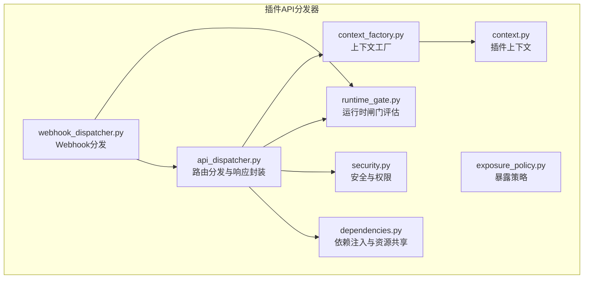
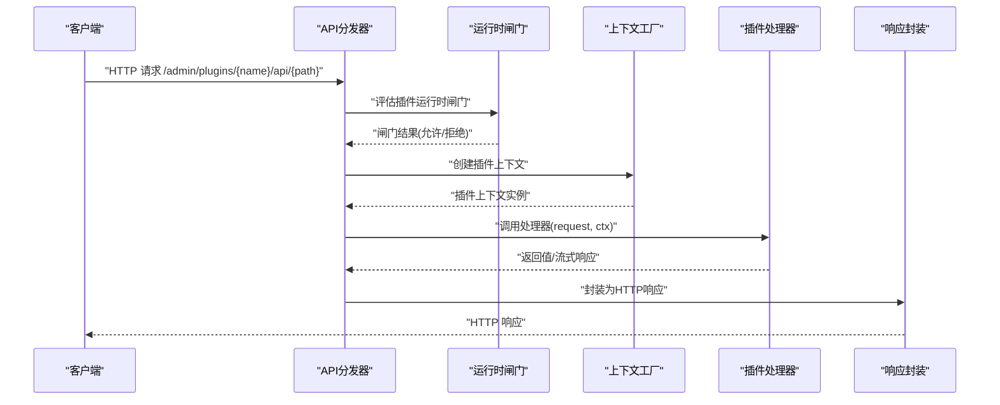
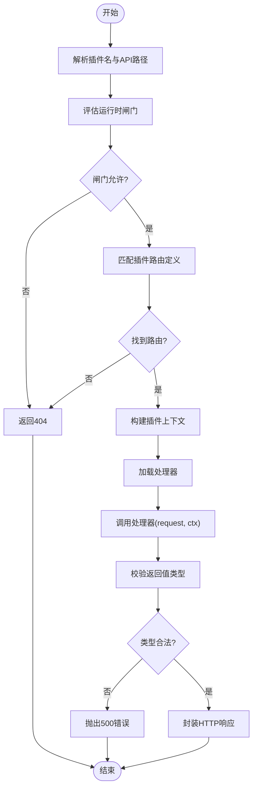
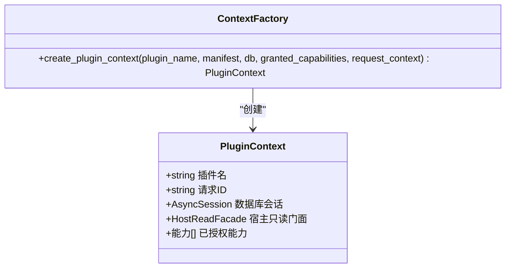
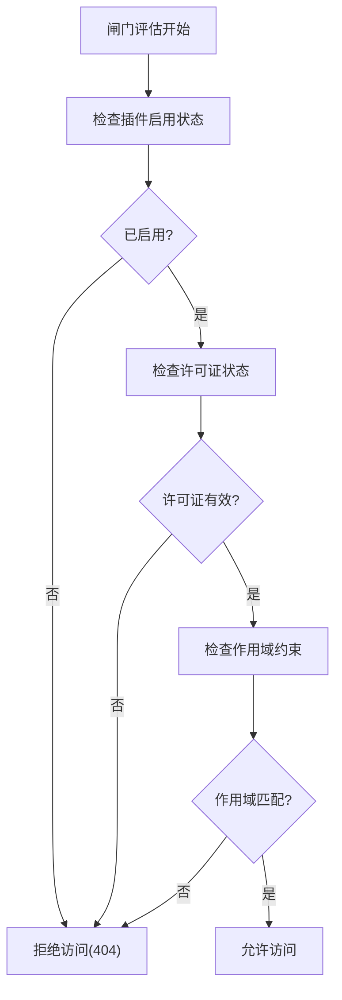
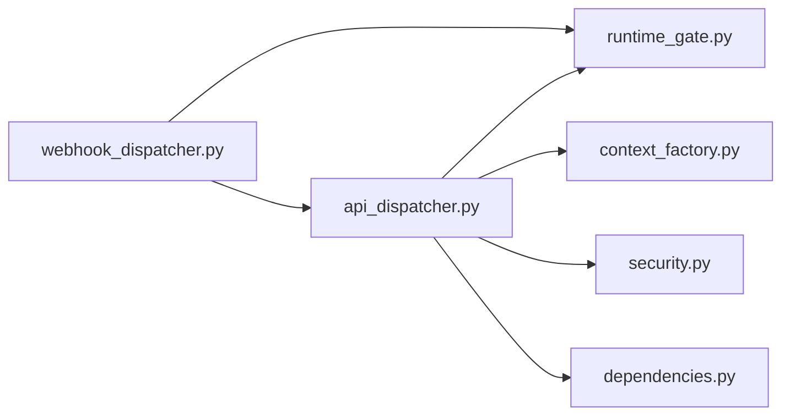

# 插件API分发器

<cite>
**本文档引用的文件**
- [api_dispatcher.py](file://backend/app/plugins/api_dispatcher.py)
- [context_factory.py](file://backend/app/plugins/context_factory.py)
- [context.py](file://backend/app/plugins/context.py)
- [runtime_gate.py](file://backend/app/plugins/runtime_gate.py)
- [dependencies.py](file://backend/app/plugins/dependencies.py)
- [exposure_policy.py](file://backend/app/plugins/exposure_policy.py)
- [security.py](file://backend/app/plugins/security.py)
- [webhook_dispatcher.py](file://backend/app/plugins/webhook_dispatcher.py)
- [test_plugin_api_dispatcher_security.py](file://backend/tests/test_plugin_api_dispatcher_security.py)
- [test_plugin_api_dispatcher_context_safety.py](file://backend/tests/test_plugin_api_dispatcher_context_safety.py)
</cite>

## 目录
1. [简介](#简介)
2. [项目结构](#项目结构)
3. [核心组件](#核心组件)
4. [架构总览](#架构总览)
5. [详细组件分析](#详细组件分析)
6. [依赖关系分析](#依赖关系分析)
7. [性能考虑](#性能考虑)
8. [故障排除指南](#故障排除指南)
9. [结论](#结论)

## 简介
本文件系统性阐述插件API分发器的设计与实现，涵盖插件API路由机制、请求分发策略、响应处理流程；深入说明插件上下文管理、依赖注入与资源共享机制；详述安全验证、权限控制与访问限制策略；解释插件路由注册、动态API暴露与版本兼容性管理；并描述插件间通信、事件传递与状态同步机制。通过具体测试用例与源码路径，帮助开发者理解插件扩展接口的设计思路与实现细节。

## 项目结构
插件API分发器位于后端应用的插件子系统中，围绕路由匹配、运行时闸门评估、上下文构建、处理器加载与响应封装等关键环节组织代码。相关模块包括：
- 路由分发与匹配：负责解析请求路径、匹配插件声明的API路由定义
- 运行时闸门：评估插件启用状态、许可证与作用域约束
- 上下文工厂：按插件清单中的API版本创建对应的插件上下文
- 安全与权限：基于用户角色、租户范围与能力授权进行访问控制
- 依赖注入与资源共享：提供数据库会话、宿主只读门面等共享资源
- Webhook分发：复用相同运行时闸门与路径匹配逻辑，实现事件驱动的插件回调

图表来源
- [api_dispatcher.py](file://backend/app/plugins/api_dispatcher.py)
- [context_factory.py](file://backend/app/plugins/context_factory.py)
- [context.py](file://backend/app/plugins/context.py)
- [runtime_gate.py](file://backend/app/plugins/runtime_gate.py)
- [dependencies.py](file://backend/app/plugins/dependencies.py)
- [exposure_policy.py](file://backend/app/plugins/exposure_policy.py)
- [security.py](file://backend/app/plugins/security.py)
- [webhook_dispatcher.py](file://backend/app/plugins/webhook_dispatcher.py)

章节来源
- [api_dispatcher.py](file://backend/app/plugins/api_dispatcher.py)
- [context_factory.py](file://backend/app/plugins/context_factory.py)
- [runtime_gate.py](file://backend/app/plugins/runtime_gate.py)
- [dependencies.py](file://backend/app/plugins/dependencies.py)
- [exposure_policy.py](file://backend/app/plugins/exposure_policy.py)
- [security.py](file://backend/app/plugins/security.py)
- [webhook_dispatcher.py](file://backend/app/plugins/webhook_dispatcher.py)

## 核心组件
- 插件API分发器（api_dispatcher.py）
  - 负责接收HTTP请求，解析插件名、路径与方法，匹配插件清单中的API路由定义，加载处理器函数，构建插件上下文，执行处理器并封装响应。
  - 支持管理员端、租户端与公开端三类路由，并对非标准处理器返回类型进行严格校验与错误包装。
- 上下文工厂（context_factory.py）
  - 根据插件清单中的API版本号选择对应版本的插件上下文类，当前版本为V1。
  - 提供插件上下文的创建入口，传入插件名、清单、数据库会话、已授权能力与请求上下文。
- 运行时闸门（runtime_gate.py）
  - 评估插件是否允许运行，包括许可证状态、启用状态、作用域约束等。
  - 返回包含插件配置、清单与闸门结果的对象，供分发器后续使用。
- 安全与权限（security.py）
  - 基于用户角色、租户ID与插件暴露策略进行访问控制，确保不同端点只能在授权范围内访问。
- 依赖注入与资源共享（dependencies.py）
  - 提供数据库会话、宿主只读门面等共享资源，作为插件上下文的一部分注入到处理器中。
- Webhook分发（webhook_dispatcher.py）
  - 复用运行时闸门与路径匹配逻辑，实现事件驱动的插件回调，支持路径参数提取与方法匹配。

章节来源
- [api_dispatcher.py](file://backend/app/plugins/api_dispatcher.py)
- [context_factory.py](file://backend/app/plugins/context_factory.py)
- [runtime_gate.py](file://backend/app/plugins/runtime_gate.py)
- [security.py](file://backend/app/plugins/security.py)
- [dependencies.py](file://backend/app/plugins/dependencies.py)
- [webhook_dispatcher.py](file://backend/app/plugins/webhook_dispatcher.py)

## 架构总览
插件API分发器采用“路由匹配—运行时闸门—上下文构建—处理器执行—响应封装”的流水线式设计。请求从HTTP层进入，经由分发器解析后，先通过运行时闸门评估插件可用性，再根据暴露策略与安全规则决定是否放行，随后构建插件上下文并加载处理器，最终将处理器返回值或流式响应封装为标准HTTP响应。

图表来源
- [api_dispatcher.py](file://backend/app/plugins/api_dispatcher.py)
- [runtime_gate.py](file://backend/app/plugins/runtime_gate.py)
- [context_factory.py](file://backend/app/plugins/context_factory.py)

## 详细组件分析

### 组件A：插件API分发器（api_dispatcher.py）
- 路由机制
  - 解析请求路径中的插件名称与API路径，匹配插件清单中声明的路由定义（管理员端、租户端、公开端）。
  - 使用路径参数匹配算法，支持REST风格路径参数提取。
- 请求分发策略
  - 先评估运行时闸门，若不允许则直接返回404错误。
  - 根据暴露策略与安全规则判断是否放行；若无匹配路由，返回404。
  - 加载处理器函数，传入请求对象与插件上下文，执行处理器。
- 响应处理流程
  - 对处理器返回值进行严格校验：仅接受特定类型（如字典、流式响应），否则抛出500错误并附带类型信息。
  - 将处理器返回值或流式响应封装为标准HTTP响应，设置状态码与媒体类型。
- 错误处理
  - 当处理器返回错误字典时，抛出应用异常并携带错误码与消息。
  - 当处理器抛出运行时异常且调试模式关闭时，统一包装为500错误。
  - 对非标准返回类型进行严格拒绝，避免“猜对”式成功包装。

图表来源
- [api_dispatcher.py](file://backend/app/plugins/api_dispatcher.py)

章节来源
- [api_dispatcher.py](file://backend/app/plugins/api_dispatcher.py)
- [test_plugin_api_dispatcher_security.py](file://backend/tests/test_plugin_api_dispatcher_security.py)
- [test_plugin_api_dispatcher_context_safety.py](file://backend/tests/test_plugin_api_dispatcher_context_safety.py)

### 组件B：插件上下文管理（context_factory.py 与 context.py）
- 版本化上下文
  - 根据插件清单中的API版本号选择对应版本的插件上下文类；当前版本为V1。
  - 提供统一的创建入口，传入插件名、清单、数据库会话、已授权能力与请求上下文。
- 上下文内容
  - 插件上下文包含请求ID（可继承自追踪ID）、数据库会话、宿主只读门面、能力授权列表等。
  - 通过依赖注入机制向处理器提供共享资源，确保插件在受控环境中运行。
- 安全边界
  - 上下文不直接暴露敏感操作，所有外部访问均通过宿主只读门面与能力授权进行约束。

图表来源
- [context_factory.py](file://backend/app/plugins/context_factory.py)
- [context.py](file://backend/app/plugins/context.py)

章节来源
- [context_factory.py](file://backend/app/plugins/context_factory.py)
- [context.py](file://backend/app/plugins/context.py)

### 组件C：运行时闸门与安全策略（runtime_gate.py 与 security.py）
- 运行时闸门
  - 评估插件是否启用、许可证状态、作用域约束等；返回闸门结果对象，包含插件配置、清单与允许标志。
- 暴露策略
  - 基于插件清单中的暴露策略，决定API在管理员端、租户端或公开端可见性。
- 安全控制
  - 结合用户角色、租户ID与能力授权，确保只有具备相应权限的请求才能访问特定路由。
  - 在Webhook场景中同样复用闸门评估，保证事件回调的安全性。

图表来源
- [runtime_gate.py](file://backend/app/plugins/runtime_gate.py)
- [exposure_policy.py](file://backend/app/plugins/exposure_policy.py)
- [security.py](file://backend/app/plugins/security.py)

章节来源
- [runtime_gate.py](file://backend/app/plugins/runtime_gate.py)
- [exposure_policy.py](file://backend/app/plugins/exposure_policy.py)
- [security.py](file://backend/app/plugins/security.py)

### 组件D：依赖注入与资源共享（dependencies.py）
- 资源提供
  - 提供数据库会话、宿主只读门面等共享资源，作为插件上下文的一部分注入到处理器中。
- 生命周期管理
  - 通过异步上下文管理数据库连接，确保在插件生命周期内稳定可用。
- 安全隔离
  - 仅暴露必要的只读接口，避免插件直接操作底层资源。

章节来源
- [dependencies.py](file://backend/app/plugins/dependencies.py)

### 组件E：Webhook分发（webhook_dispatcher.py）
- 路由匹配
  - 复用API分发器中的路径匹配工具，支持REST风格路径参数提取与方法匹配。
- 事件驱动
  - 基于插件清单中的webhooks声明，将外部事件路由到对应处理器。
- 安全一致性
  - 同样经过运行时闸门评估与暴露策略检查，确保回调的安全性与合规性。

章节来源
- [webhook_dispatcher.py](file://backend/app/plugins/webhook_dispatcher.py)

## 依赖关系分析
插件API分发器与其他模块存在明确的依赖关系：
- 分发器依赖运行时闸门进行可用性评估
- 分发器依赖上下文工厂创建插件上下文
- 分发器依赖安全策略与暴露策略进行访问控制
- 分发器依赖依赖注入模块提供共享资源
- Webhook分发复用运行时闸门与路径匹配逻辑

图表来源
- [api_dispatcher.py](file://backend/app/plugins/api_dispatcher.py)
- [runtime_gate.py](file://backend/app/plugins/runtime_gate.py)
- [context_factory.py](file://backend/app/plugins/context_factory.py)
- [security.py](file://backend/app/plugins/security.py)
- [dependencies.py](file://backend/app/plugins/dependencies.py)
- [webhook_dispatcher.py](file://backend/app/plugins/webhook_dispatcher.py)

章节来源
- [api_dispatcher.py](file://backend/app/plugins/api_dispatcher.py)
- [webhook_dispatcher.py](file://backend/app/plugins/webhook_dispatcher.py)

## 性能考虑
- 异步执行
  - 分发器与闸门评估均采用异步模式，减少阻塞，提升并发处理能力。
- 缓存与预检
  - 可在运行时闸门中引入缓存机制，避免重复查询插件状态与许可证信息。
- 路由匹配优化
  - 对常用路由进行前缀索引或预编译正则表达式，降低匹配开销。
- 流式响应
  - 对于大体量数据输出，优先采用流式响应以减少内存占用与延迟。

## 故障排除指南
- 404错误
  - 插件未找到或未启用：检查运行时闸门评估结果与插件清单中的启用状态。
  - 路由未匹配：确认请求路径与插件清单中的路径声明一致，注意大小写与尾部斜杠。
- 403错误
  - 权限不足：检查用户角色、租户ID与能力授权，确保满足暴露策略要求。
- 500错误
  - 处理器返回非标准类型：确保返回值为字典或流式响应；避免返回字符串等其他类型。
  - 处理器抛出异常：在调试模式开启时可查看详细堆栈；生产环境建议记录日志并统一包装。
- 流式响应问题
  - 确保处理器返回的是流式响应对象，媒体类型正确设置，避免阻塞与超时。

章节来源
- [test_plugin_api_dispatcher_security.py](file://backend/tests/test_plugin_api_dispatcher_security.py)
- [test_plugin_api_dispatcher_context_safety.py](file://backend/tests/test_plugin_api_dispatcher_context_safety.py)

## 结论
插件API分发器通过清晰的职责划分与严格的边界控制，实现了安全、可扩展、可维护的插件API路由与分发机制。其版本化的上下文管理、运行时闸门评估、依赖注入与资源共享，以及与Webhook分发的一致性设计，共同构成了插件生态的核心基础设施。开发者在扩展插件API时，应遵循暴露策略、安全规则与版本兼容性要求，确保系统的稳定性与安全性。