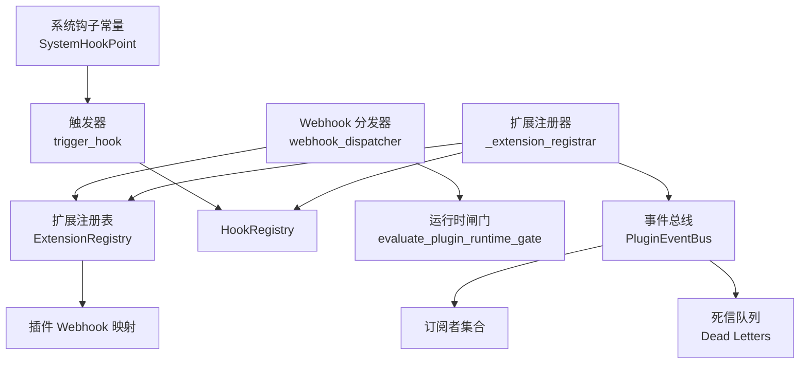
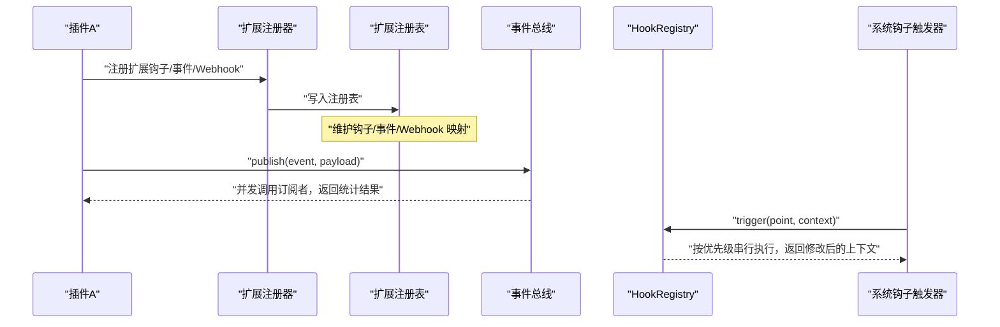
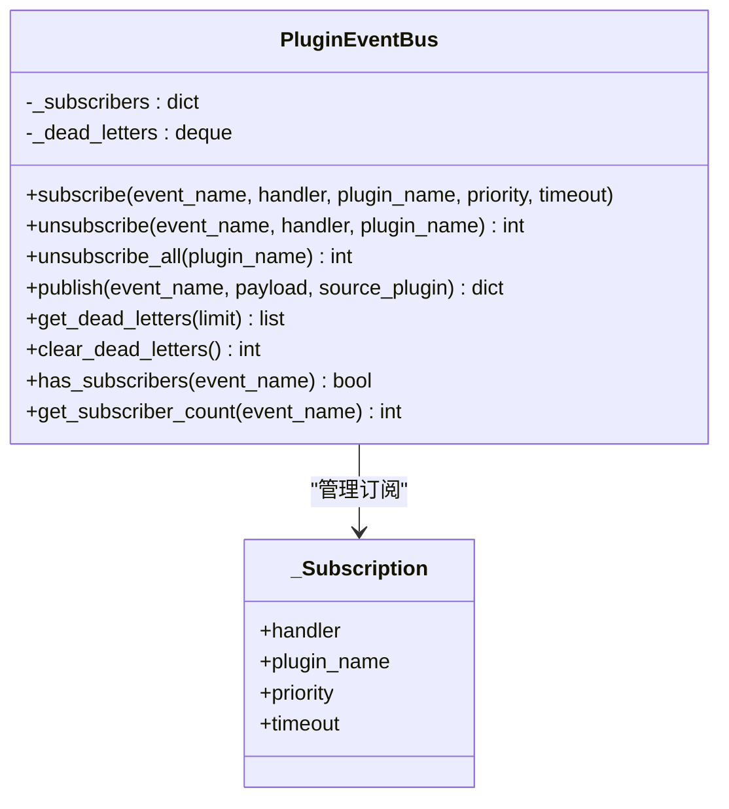
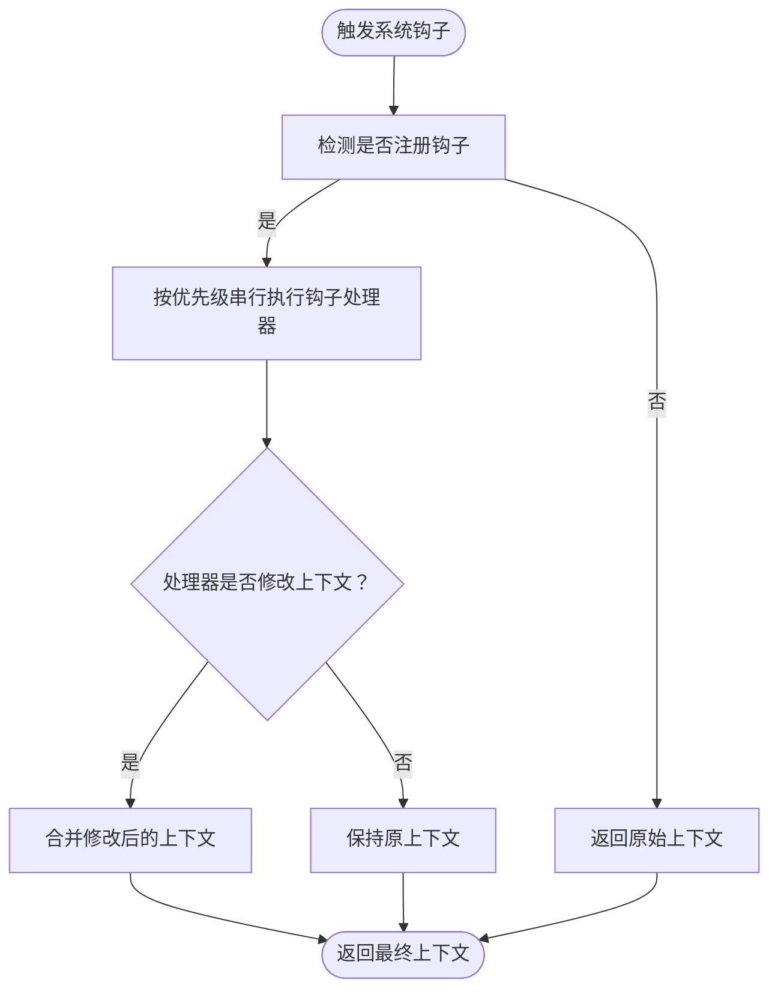
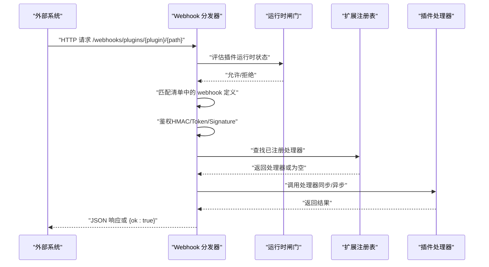
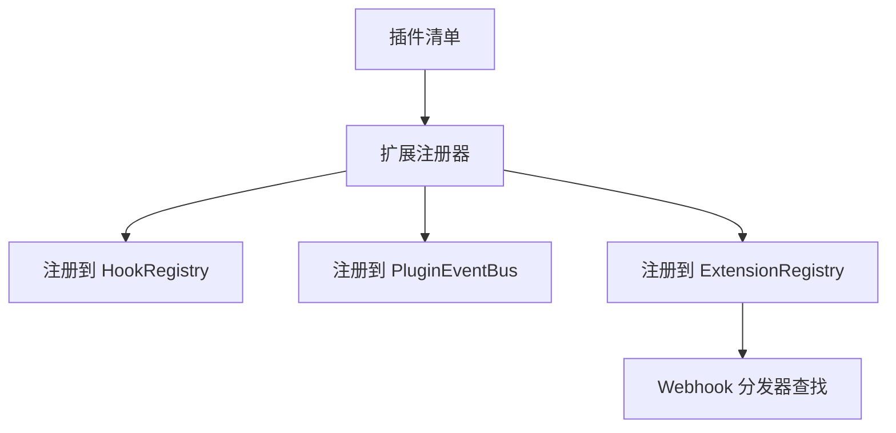
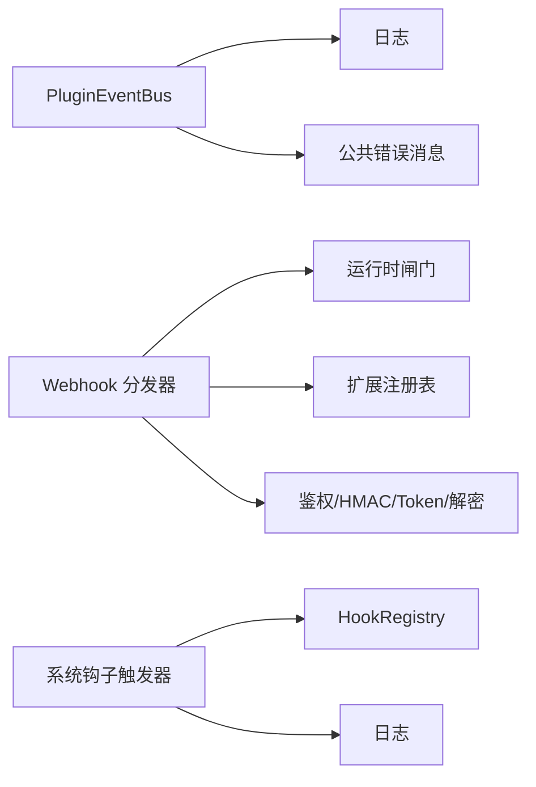

# 插件事件系统

<cite>
**本文引用的文件**
- [event_bus.py](file://backend/app/plugins/event_bus.py)
- [webhook_dispatcher.py](file://backend/app/plugins/webhook_dispatcher.py)
- [system_hooks.py](file://backend/app/plugins/system_hooks.py)
- [registry.py](file://backend/app/plugins/registry.py)
- [_extension_registrar.py](file://backend/app/plugins/_extension_registrar.py)
- [test_plugin_event_hook_runtime.py](file://backend/tests/test_plugin_event_hook_runtime.py)
- [test_plugin_webhook_dispatcher_security.py](file://backend/tests/test_plugin_webhook_dispatcher_security.py)
</cite>

## 目录
1. [简介](#简介)
2. [项目结构](#项目结构)
3. [核心组件](#核心组件)
4. [架构总览](#架构总览)
5. [详细组件分析](#详细组件分析)
6. [依赖关系分析](#依赖关系分析)
7. [性能考量](#性能考量)
8. [故障排查指南](#故障排查指南)
9. [结论](#结论)
10. [附录](#附录)

## 简介
本文件系统性阐述插件事件系统的架构与实现，覆盖跨插件事件总线、系统钩子、Webhook 分发器、权限与安全过滤、以及事件序列化与跨插件通信机制。文档通过代码级图示与测试用例路径，帮助开发者快速掌握事件驱动的插件扩展与通信模式。

## 项目结构
插件事件系统主要由以下模块构成：
- 事件总线：跨插件异步通知，支持订阅、取消订阅、并发执行与错误隔离
- 系统钩子：标准系统事件钩子点，插件可订阅并在框架触发时执行
- Webhook 分发器：面向外部系统的统一入口，支持多种鉴权方式与路由匹配
- 注册表与扩展注册：维护插件扩展（钩子、事件、Webhook）的注册与查找
- 测试用例：覆盖事件与钩子运行时桥接、Webhook 安全加固等关键场景

**图表来源**
- [event_bus.py:44-342](file://backend/app/plugins/event_bus.py#L44-L342)
- [system_hooks.py:29-127](file://backend/app/plugins/system_hooks.py#L29-L127)
- [webhook_dispatcher.py:32-206](file://backend/app/plugins/webhook_dispatcher.py#L32-L206)
- [registry.py:537-561](file://backend/app/plugins/registry.py#L537-L561)
- [_extension_registrar.py](file://backend/app/plugins/_extension_registrar.py)

**章节来源**
- [event_bus.py:1-342](file://backend/app/plugins/event_bus.py#L1-L342)
- [system_hooks.py:1-127](file://backend/app/plugins/system_hooks.py#L1-L127)
- [webhook_dispatcher.py:1-296](file://backend/app/plugins/webhook_dispatcher.py#L1-L296)
- [registry.py:537-561](file://backend/app/plugins/registry.py#L537-L561)
- [_extension_registrar.py](file://backend/app/plugins/_extension_registrar.py)

## 核心组件
- 事件总线（PluginEventBus）
  - 单例设计，提供订阅、取消订阅、批量清理、发布等能力
  - 发布采用并发执行，单个处理器超时保护，默认30秒
  - 事件负载大小上限约1MB，超限直接返回错误
  - 死信队列记录失败事件，便于运维排查
- 系统钩子（SystemHookPoint + trigger_hook）
  - 提供标准系统事件钩子点常量（如租户、用户、Agent、文件、知识库等生命周期）
  - 触发器非阻塞，异常不影响调用方，返回最终上下文
- Webhook 分发器（webhook_dispatcher）
  - 统一入口：/webhooks/plugins/{plugin_name}/{path}
  - 运行时闸门校验插件状态与许可
  - 路由匹配与鉴权（HMAC、Token、Signature）
  - 调用插件注册的处理器或从清单加载处理器
- 注册表与扩展注册
  - 维护插件扩展（钩子、事件、Webhook）注册信息
  - 扩展注册器将插件清单映射为运行时注册项

**章节来源**
- [event_bus.py:44-342](file://backend/app/plugins/event_bus.py#L44-L342)
- [system_hooks.py:29-127](file://backend/app/plugins/system_hooks.py#L29-L127)
- [webhook_dispatcher.py:32-206](file://backend/app/plugins/webhook_dispatcher.py#L32-L206)
- [registry.py:537-561](file://backend/app/plugins/registry.py#L537-L561)
- [_extension_registrar.py](file://backend/app/plugins/_extension_registrar.py)

## 架构总览
事件系统围绕“扩展注册—运行时桥接—事件分发”展开，形成插件间异步通知与系统级同步拦截的双轨机制。

**图表来源**
- [_extension_registrar.py](file://backend/app/plugins/_extension_registrar.py)
- [registry.py:537-561](file://backend/app/plugins/registry.py#L537-L561)
- [event_bus.py:170-264](file://backend/app/plugins/event_bus.py#L170-L264)
- [system_hooks.py:105-127](file://backend/app/plugins/system_hooks.py#L105-L127)

## 详细组件分析

### 事件总线（PluginEventBus）
- 订阅与去重
  - 同一插件与处理器组合不会重复订阅
  - 按优先级排序，数值越小优先级越高
- 发布与并发
  - 并行执行所有订阅处理器，单个失败不影响整体
  - 超时保护：默认30秒；线程/协程统一包装
  - 负载大小限制：约1MB，超限直接返回错误
- 死信队列
  - 记录失败事件（事件名、来源、处理器、错误、时间戳）
  - 内存环形缓冲，溢出丢弃最旧条目
- 查询与管理
  - 获取最近死信、清空死信队列
  - 查询是否存在订阅者、订阅数量

**图表来源**
- [event_bus.py:44-342](file://backend/app/plugins/event_bus.py#L44-L342)

**章节来源**
- [event_bus.py:79-316](file://backend/app/plugins/event_bus.py#L79-L316)

### 系统钩子（SystemHookPoint 与 trigger_hook）
- 钩子点常量
  - 覆盖租户、用户、Agent、AI 调用、插件生命周期、文件/存储、知识库等
- 触发流程
  - 非阻塞：异常不传播，返回最终上下文
  - 通过 HookRegistry 串行执行，支持修改上下文

**图表来源**
- [system_hooks.py:105-127](file://backend/app/plugins/system_hooks.py#L105-L127)

**章节来源**
- [system_hooks.py:29-127](file://backend/app/plugins/system_hooks.py#L29-L127)

### Webhook 分发器（webhook_dispatcher）
- 路由与匹配
  - 路径约定：/webhooks/plugins/{plugin_name}/{path}
  - 方法支持：GET/POST/PUT/DELETE
  - 与插件清单中 extensions.webhooks 进行路径与方法匹配
- 运行时闸门
  - 校验插件存在、启用状态、许可状态
  - 未通过返回 404/401 等错误码
- 鉴权
  - HMAC：基于密钥与请求体计算签名比对
  - Token：支持 Authorization 或自定义头部
  - Signature：与 HMAC 相同处理
  - 密钥支持加密存储，自动解密
- 处理与响应
  - 优先从注册表查找处理器，否则从清单加载
  - 处理器可同步或异步，返回字典则作为 JSON 响应
  - 异常统一处理，生产环境脱敏调试信息

**图表来源**
- [webhook_dispatcher.py:32-206](file://backend/app/plugins/webhook_dispatcher.py#L32-L206)
- [registry.py:537-561](file://backend/app/plugins/registry.py#L537-L561)

**章节来源**
- [webhook_dispatcher.py:32-206](file://backend/app/plugins/webhook_dispatcher.py#L32-L206)

### 扩展注册与桥接
- 扩展注册器
  - 将插件清单中的 extensions.hooks、extensions.events、extensions.webhooks 映射为运行时注册项
  - 与事件总线、HookRegistry 建立桥接，使发布/触发与注册项一致
- 注册表
  - 维护插件扩展映射，包含 Webhook 的方法、鉴权配置与处理器
  - 规范化路径，确保与分发器查找格式一致

**图表来源**
- [_extension_registrar.py](file://backend/app/plugins/_extension_registrar.py)
- [registry.py:537-561](file://backend/app/plugins/registry.py#L537-L561)
- [event_bus.py:170-264](file://backend/app/plugins/event_bus.py#L170-L264)

**章节来源**
- [_extension_registrar.py](file://backend/app/plugins/_extension_registrar.py)
- [registry.py:537-561](file://backend/app/plugins/registry.py#L537-L561)

## 依赖关系分析
- 事件总线依赖
  - 日志：结构化日志记录
  - 错误消息：对外暴露统一错误消息
- Webhook 分发器依赖
  - 运行时闸门：插件许可与状态校验
  - 扩展注册表：处理器查找
  - 鉴权工具：HMAC、Token、解密
- 系统钩子依赖
  - HookRegistry：钩子注册与触发
  - 日志：警告与调试

**图表来源**
- [event_bus.py:32-35](file://backend/app/plugins/event_bus.py#L32-L35)
- [webhook_dispatcher.py:24-25](file://backend/app/plugins/webhook_dispatcher.py#L24-L25)
- [system_hooks.py:115-126](file://backend/app/plugins/system_hooks.py#L115-L126)

**章节来源**
- [event_bus.py:32-35](file://backend/app/plugins/event_bus.py#L32-L35)
- [webhook_dispatcher.py:24-25](file://backend/app/plugins/webhook_dispatcher.py#L24-L25)
- [system_hooks.py:115-126](file://backend/app/plugins/system_hooks.py#L115-L126)

## 性能考量
- 事件总线
  - 并发执行订阅处理器，降低端到端延迟
  - 单处理器超时保护避免慢处理器拖垮整体
  - 负载大小限制防止内存膨胀
- Webhook 分发器
  - 路由匹配与鉴权在异步上下文中完成，避免阻塞
  - 处理器可同步或异步，满足不同性能需求
- 系统钩子
  - 串行执行，保证上下文一致性；建议处理器轻量化

[本节为通用性能讨论，无需具体文件分析]

## 故障排查指南
- 事件总线
  - 无订阅者：发布返回 delivered=0，检查扩展注册是否正确
  - 负载过大：返回错误并记录告警，检查 payload 大小
  - 处理器异常：记录到死信队列，可通过接口查询最近死信
- Webhook 分发器
  - 404：插件未找到或未启用，检查运行时闸门与清单
  - 401：鉴权失败，核对密钥、头部与签名格式
  - 500：处理器抛出异常，生产环境仅返回通用错误，检查日志
- 系统钩子
  - 触发失败：记录警告，确认 HookRegistry 是否存在对应钩子点

**章节来源**
- [event_bus.py:188-264](file://backend/app/plugins/event_bus.py#L188-L264)
- [webhook_dispatcher.py:93-205](file://backend/app/plugins/webhook_dispatcher.py#L93-L205)
- [system_hooks.py:123-126](file://backend/app/plugins/system_hooks.py#L123-L126)

## 结论
插件事件系统通过事件总线与系统钩子分别实现“异步通知”和“同步拦截”，配合 Webhook 分发器与严格的运行时闸门与鉴权机制，构建了高可用、可扩展且安全的插件扩展与通信平台。开发者可依据本文档的架构图与测试用例路径，快速定位实现细节并进行集成与扩展。

## 附录

### 使用示例与最佳实践（基于测试用例路径）
- 事件与钩子运行时桥接
  - 通过扩展注册器将插件清单映射为运行时注册项
  - 验证钩子触发与事件发布的桥接完整性
  - 参考路径：[test_plugin_event_hook_runtime.py:54-95](file://backend/tests/test_plugin_event_hook_runtime.py#L54-L95)
- Webhook 安全加固
  - 验证 Token 鉴权支持加密密钥解密
  - 生产环境异常脱敏返回
  - 插件许可拒绝时返回 404
  - 参考路径：[test_plugin_webhook_dispatcher_security.py:66-185](file://backend/tests/test_plugin_webhook_dispatcher_security.py#L66-L185)

**章节来源**
- [test_plugin_event_hook_runtime.py:54-95](file://backend/tests/test_plugin_event_hook_runtime.py#L54-L95)
- [test_plugin_webhook_dispatcher_security.py:66-185](file://backend/tests/test_plugin_webhook_dispatcher_security.py#L66-L185)