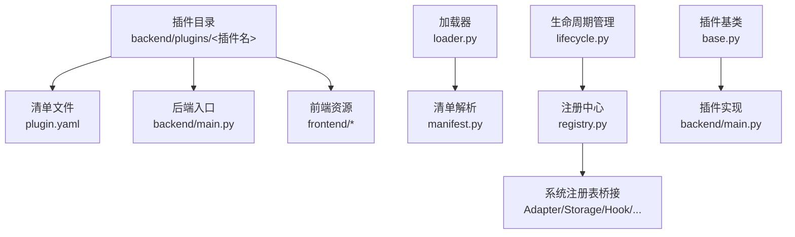
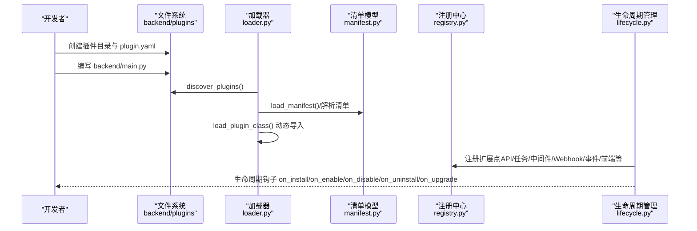
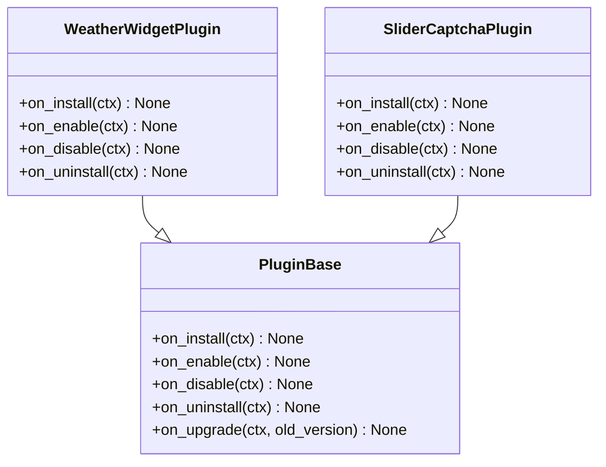
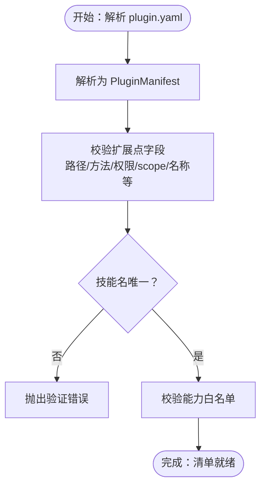
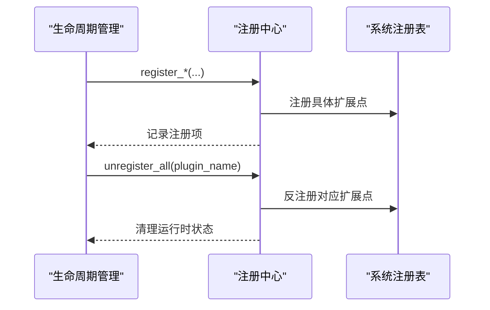
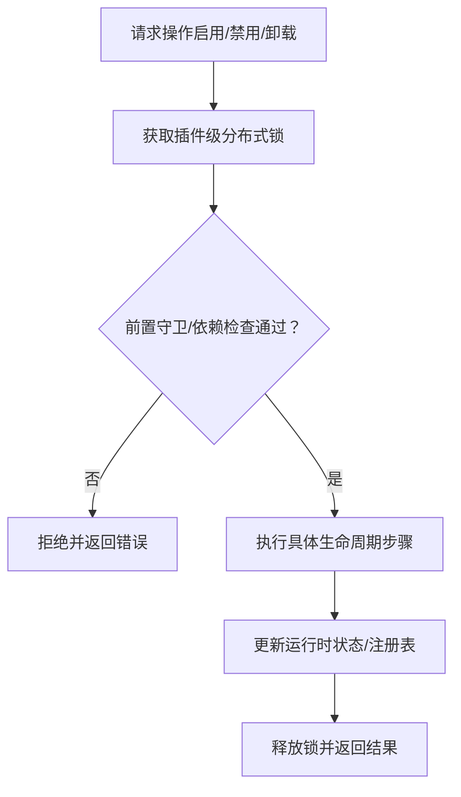
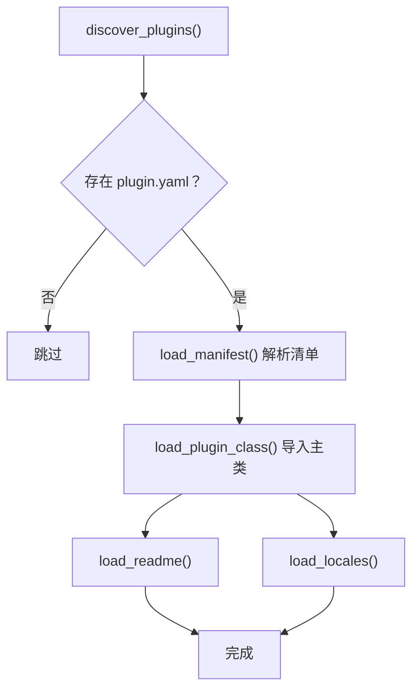
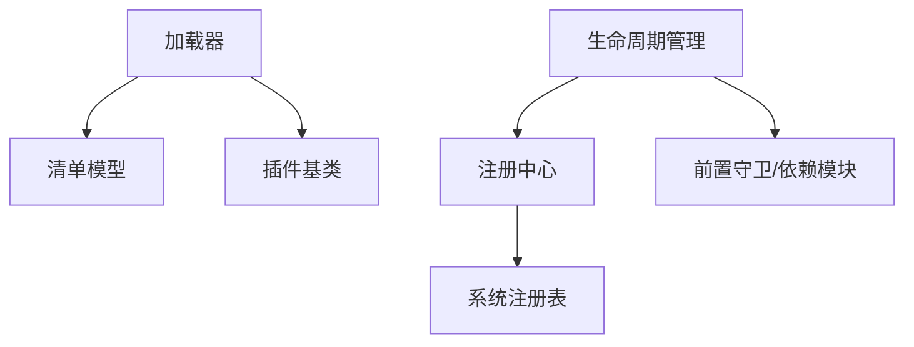

# 插件开发指南

<cite>
**本文档引用的文件**
- [manifest.py](file://backend/app/plugins/manifest.py)
- [base.py](file://backend/app/plugins/base.py)
- [registry.py](file://backend/app/plugins/registry.py)
- [lifecycle.py](file://backend/app/plugins/lifecycle.py)
- [loader.py](file://backend/app/plugins/loader.py)
- [main.py（天气插件）](file://backend/plugins/weather-widget/backend/main.py)
- [main.py（滑块验证码插件）](file://backend/plugins/slider-captcha/backend/main.py)
</cite>

## 目录
1. [简介](#简介)
2. [项目结构](#项目结构)
3. [核心组件](#核心组件)
4. [架构总览](#架构总览)
5. [详细组件分析](#详细组件分析)
6. [依赖分析](#依赖分析)
7. [性能考虑](#性能考虑)
8. [故障排查指南](#故障排查指南)
9. [结论](#结论)
10. [附录](#附录)

## 简介
本指南面向希望在本平台开发插件的工程师，系统讲解插件开发的标准流程、项目结构与代码规范，涵盖插件清单文件编写、依赖声明与接口定义方法；同时介绍开发工具链、代码生成器与调试技巧，以及测试策略（单元测试与集成测试）、打包发布、版本管理与分发流程。文中结合仓库中的真实插件示例（天气插件、验证码插件）演示完整开发过程，帮助开发者快速上手并掌握插件开发的完整技能。

## 项目结构
插件体系由“清单模型”“生命周期管理”“注册中心”“加载器”“插件基类”等核心模块构成，配合示例插件（天气、验证码）展示标准开发路径。后端插件目录位于 backend/plugins，每个插件包含 plugin.yaml 清单与约定的 backend/main.py 入口文件。

图表来源
- [loader.py:33-60](file://backend/app/plugins/loader.py#L33-L60)
- [manifest.py:784-800](file://backend/app/plugins/manifest.py#L784-L800)
- [registry.py:172-230](file://backend/app/plugins/registry.py#L172-L230)
- [base.py:19-45](file://backend/app/plugins/base.py#L19-L45)

章节来源
- [loader.py:33-60](file://backend/app/plugins/loader.py#L33-L60)
- [manifest.py:784-800](file://backend/app/plugins/manifest.py#L784-L800)
- [registry.py:172-230](file://backend/app/plugins/registry.py#L172-L230)
- [base.py:19-45](file://backend/app/plugins/base.py#L19-L45)

## 核心组件
- 插件基类：定义生命周期钩子（安装/启用/禁用/卸载/升级），插件开发者仅需按需覆盖。
- 清单模型：定义插件清单的完整模式（扩展点、权限、前端页面、API、任务、中间件、Webhook、Socket.IO、事件总线等），并进行严格校验。
- 注册中心：将插件声明的扩展点桥接到系统现有注册表，跟踪注册记录，支持反注册与运行时状态清理。
- 生命周期管理：提供安装、启用、禁用、卸载、依赖安装/卸载、修复、刷新计划等操作，内置分布式锁与前置守卫。
- 加载器：负责扫描插件目录、解析清单、动态导入主类、加载 README 与国际化资源。

章节来源
- [base.py:19-45](file://backend/app/plugins/base.py#L19-L45)
- [manifest.py:745-780](file://backend/app/plugins/manifest.py#L745-L780)
- [registry.py:172-230](file://backend/app/plugins/registry.py#L172-L230)
- [lifecycle.py:108-130](file://backend/app/plugins/lifecycle.py#L108-L130)
- [loader.py:33-60](file://backend/app/plugins/loader.py#L33-L60)

## 架构总览
下图展示了插件从发现、加载、清单解析、注册到生命周期管理的整体流程。

图表来源
- [loader.py:41-60](file://backend/app/plugins/loader.py#L41-L60)
- [loader.py:125-147](file://backend/app/plugins/loader.py#L125-L147)
- [loader.py:151-209](file://backend/app/plugins/loader.py#L151-L209)
- [manifest.py:745-780](file://backend/app/plugins/manifest.py#L745-L780)
- [registry.py:308-360](file://backend/app/plugins/registry.py#L308-L360)
- [lifecycle.py:235-244](file://backend/app/plugins/lifecycle.py#L235-L244)

## 详细组件分析

### 插件基类与生命周期钩子
- 插件必须继承 PluginBase，并可覆盖以下钩子：on_install、on_enable、on_disable、on_uninstall、on_upgrade。
- 钩子默认为空实现，开发者仅在需要时覆写，保证最小改动与可维护性。

图表来源
- [base.py:19-45](file://backend/app/plugins/base.py#L19-L45)
- [main.py（天气插件）:8-22](file://backend/plugins/weather-widget/backend/main.py#L8-L22)
- [main.py（滑块验证码插件）:9-25](file://backend/plugins/slider-captcha/backend/main.py#L9-L25)

章节来源
- [base.py:19-45](file://backend/app/plugins/base.py#L19-L45)
- [main.py（天气插件）:8-22](file://backend/plugins/weather-widget/backend/main.py#L8-L22)
- [main.py（滑块验证码插件）:9-25](file://backend/plugins/slider-captcha/backend/main.py#L9-L25)

### 清单模型与扩展点定义
- 清单模型定义了完整的扩展点聚合（skills/adapters/storage_drivers/api/hooks/tasks/notifications/permissions/frontend/webhooks/events/socketio/consumers/custom/middleware），并对每种扩展点进行字段校验与约束。
- 关键校验包括：路径规范化、方法/认证/权限值枚举、名称格式（如技能名、菜单 scope）、前端页面路径与 scope 前缀一致性等。
- 清单还支持能力白名单（如 db:read、http:outbound、storage:write、ai:call 等），用于声明插件所需平台能力。

图表来源
- [manifest.py:745-780](file://backend/app/plugins/manifest.py#L745-L780)
- [manifest.py:764-777](file://backend/app/plugins/manifest.py#L764-L777)
- [manifest.py:784-800](file://backend/app/plugins/manifest.py#L784-L800)

章节来源
- [manifest.py:745-780](file://backend/app/plugins/manifest.py#L745-L780)
- [manifest.py:764-777](file://backend/app/plugins/manifest.py#L764-L777)
- [manifest.py:784-800](file://backend/app/plugins/manifest.py#L784-L800)

### 注册中心与系统桥接
- 注册中心将插件声明的扩展点桥接到系统现有注册表（如适配器、钩子、存储驱动、技能解析器/执行器、事件总线、Webhook 路由、定时任务、前端插槽、中间件等）。
- 支持按插件维度追踪注册记录，提供反注册与运行时状态清理，确保插件启停/卸载后的干净环境。

图表来源
- [registry.py:308-360](file://backend/app/plugins/registry.py#L308-L360)
- [registry.py:526-571](file://backend/app/plugins/registry.py#L526-L571)
- [registry.py:574-670](file://backend/app/plugins/registry.py#L574-L670)
- [registry.py:688-716](file://backend/app/plugins/registry.py#L688-L716)

章节来源
- [registry.py:308-360](file://backend/app/plugins/registry.py#L308-L360)
- [registry.py:526-571](file://backend/app/plugins/registry.py#L526-L571)
- [registry.py:574-670](file://backend/app/plugins/registry.py#L574-L670)
- [registry.py:688-716](file://backend/app/plugins/registry.py#L688-L716)

### 生命周期管理与分布式锁
- 生命周期管理器封装 install/enable/disable/uninstall/repair/refresh_schedules 等操作，并在关键步骤加插件级分布式锁，避免并发修改导致的竞态。
- 内置前置守卫与依赖检查，确保启用前满足条件（如依赖可用、许可证有效、权限激活等）。

图表来源
- [lifecycle.py:235-244](file://backend/app/plugins/lifecycle.py#L235-L244)
- [lifecycle.py:250-256](file://backend/app/plugins/lifecycle.py#L250-L256)
- [lifecycle.py:356-371](file://backend/app/plugins/lifecycle.py#L356-L371)

章节来源
- [lifecycle.py:235-244](file://backend/app/plugins/lifecycle.py#L235-L244)
- [lifecycle.py:250-256](file://backend/app/plugins/lifecycle.py#L250-L256)
- [lifecycle.py:356-371](file://backend/app/plugins/lifecycle.py#L356-L371)

### 加载器与插件发现
- 加载器扫描 backend/plugins 下的子目录，识别包含 plugin.yaml 的插件。
- 解析清单、动态导入 backend/main.py 中的插件主类，加载 README 与 locales 资源。

图表来源
- [loader.py:41-60](file://backend/app/plugins/loader.py#L41-L60)
- [loader.py:125-147](file://backend/app/plugins/loader.py#L125-L147)
- [loader.py:151-209](file://backend/app/plugins/loader.py#L151-L209)
- [loader.py:212-226](file://backend/app/plugins/loader.py#L212-L226)
- [loader.py:230-259](file://backend/app/plugins/loader.py#L230-L259)

章节来源
- [loader.py:41-60](file://backend/app/plugins/loader.py#L41-L60)
- [loader.py:125-147](file://backend/app/plugins/loader.py#L125-L147)
- [loader.py:151-209](file://backend/app/plugins/loader.py#L151-L209)
- [loader.py:212-226](file://backend/app/plugins/loader.py#L212-L226)
- [loader.py:230-259](file://backend/app/plugins/loader.py#L230-L259)

### 示例插件：天气插件
- 结构：backend/plugins/weather-widget/plugin.yaml + backend/main.py。
- 实现：继承 PluginBase，覆盖生命周期钩子，记录日志。
- 用途：演示最简插件骨架与生命周期钩子使用。

章节来源
- [main.py（天气插件）:8-22](file://backend/plugins/weather-widget/backend/main.py#L8-L22)

### 示例插件：滑块验证码插件
- 结构：backend/plugins/slider-captcha/plugin.yaml + backend/main.py + captcha_provider.py。
- 实现：继承 PluginBase，覆盖生命周期钩子；导出 Provider 类型供其他模块使用。
- 用途：演示插件内模块化组织与导出公共类型。

章节来源
- [main.py（滑块验证码插件）:9-25](file://backend/plugins/slider-captcha/backend/main.py#L9-L25)

## 依赖分析
- 插件与系统注册表的耦合通过注册中心桥接，降低直接耦合风险。
- 生命周期管理器通过前置守卫与依赖模块协作，确保启用/卸载的安全性。
- 加载器与清单模型相互独立，分别负责“发现/导入”和“模式校验”，职责清晰。

图表来源
- [loader.py:33-60](file://backend/app/plugins/loader.py#L33-L60)
- [manifest.py:745-780](file://backend/app/plugins/manifest.py#L745-L780)
- [base.py:19-45](file://backend/app/plugins/base.py#L19-L45)
- [lifecycle.py:108-130](file://backend/app/plugins/lifecycle.py#L108-L130)
- [registry.py:172-230](file://backend/app/plugins/registry.py#L172-L230)

章节来源
- [loader.py:33-60](file://backend/app/plugins/loader.py#L33-L60)
- [manifest.py:745-780](file://backend/app/plugins/manifest.py#L745-L780)
- [base.py:19-45](file://backend/app/plugins/base.py#L19-L45)
- [lifecycle.py:108-130](file://backend/app/plugins/lifecycle.py#L108-L130)
- [registry.py:172-230](file://backend/app/plugins/registry.py#L172-L230)

## 性能考虑
- 清单解析与模式校验在加载阶段完成，避免运行时重复校验开销。
- 注册中心对技能解析器/执行器采用键控缓存，减少重复实例化成本。
- 定时任务通过 Celery 注册与调度，避免阻塞主请求线程。
- 分布式锁保护关键生命周期操作，避免并发冲突带来的额外重试与回滚成本。

## 故障排查指南
- 清单校验失败：检查 plugin.yaml 字段是否符合清单模型约束（路径、方法、权限、scope、名称等）。
- 插件导入失败：确认 backend/main.py 存在且包含 PluginBase 子类；检查模块缓存与异常堆栈。
- 启用失败：查看前置守卫与依赖检查输出，确认许可证、权限、依赖状态满足要求。
- 注销异常：注册中心会记录反注册过程中的异常并继续清理其他扩展点，关注日志中的警告信息。

章节来源
- [loader.py:163-209](file://backend/app/plugins/loader.py#L163-L209)
- [registry.py:688-716](file://backend/app/plugins/registry.py#L688-L716)
- [lifecycle.py:137-167](file://backend/app/plugins/lifecycle.py#L137-L167)

## 结论
本指南从架构与代码层面梳理了插件开发的全流程：以清单模型为契约，通过加载器与生命周期管理器完成安全可靠的插件发现、导入与启停，借助注册中心桥接系统能力，最终以最小改动实现业务扩展。结合天气与验证码两个示例，开发者可以快速搭建符合规范的插件工程，并在此基础上扩展 API、任务、中间件、Webhook、前端页面等丰富能力。

## 附录
- 插件清单字段建议参考清单模型中各扩展点的字段定义与校验规则，确保路径、方法、权限、scope、名称等均符合约束。
- 开发工具链与 CLI：仓库包含插件 CLI 脚本（如 plugin_cli_create.py、plugin_cli_pack.py、plugin_cli_build.py 等），可用于生成模板、打包与构建插件，建议结合实际脚本路径与参数使用。
- 测试策略：建议为插件编写单元测试（覆盖生命周期钩子、扩展点注册、权限与能力声明）与集成测试（覆盖 API/Webhook/任务/前端页面等端到端场景），并在 CI 中执行静态检查与安全扫描。