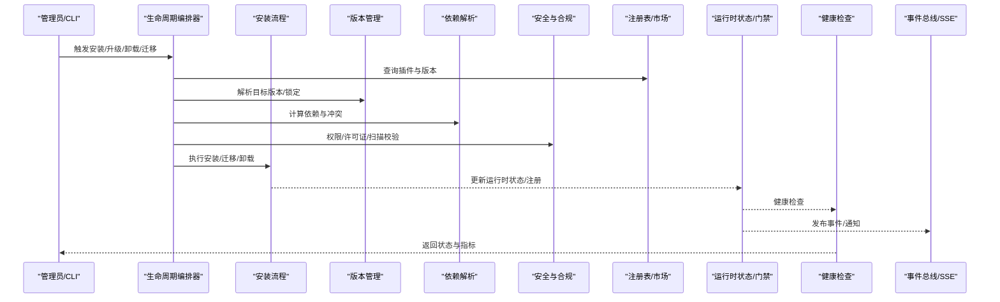
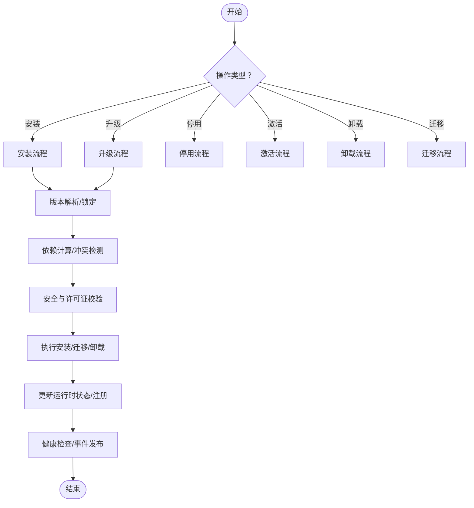
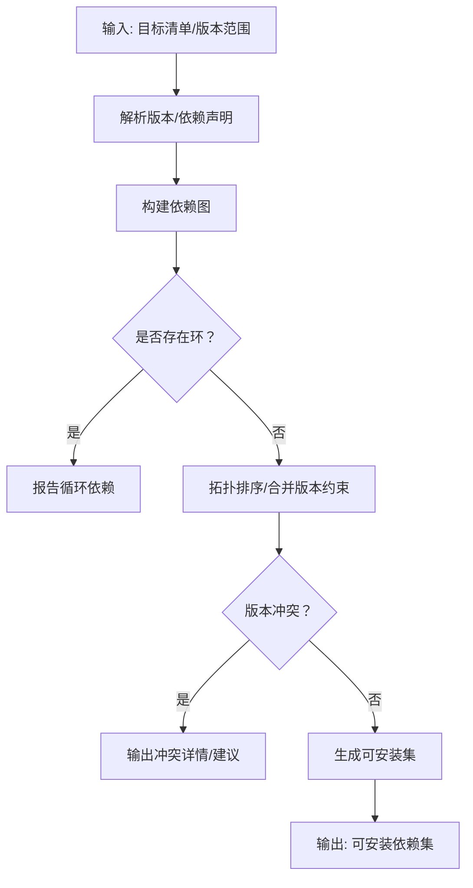
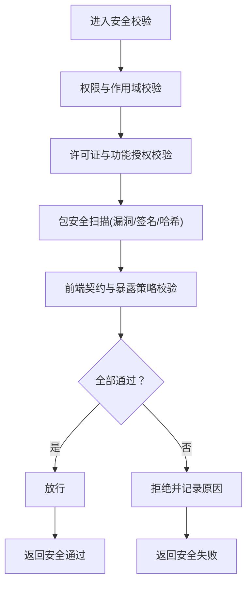
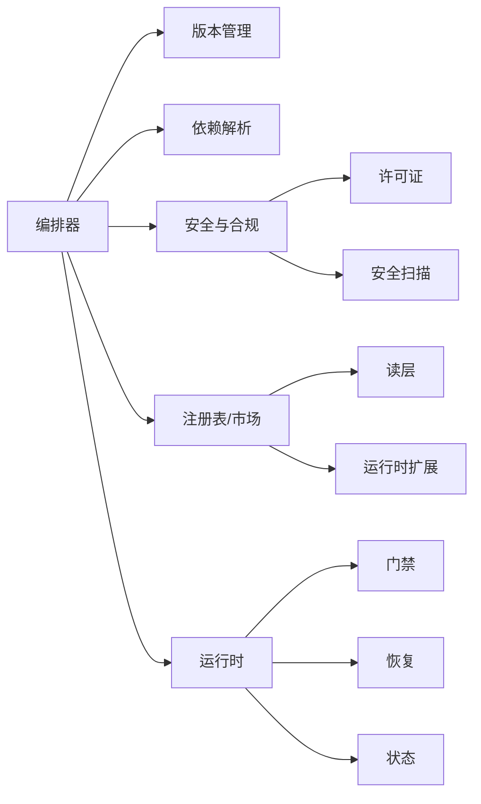

# 插件生命周期管理

<cite>
**本文引用的文件**
- [lifecycle.py](file://backend/app/plugins/lifecycle.py)
- [lifecycle_orchestrator.py](file://backend/app/plugins/lifecycle_orchestrator.py)
- [lifecycle_installation.py](file://backend/app/plugins/lifecycle_installation.py)
- [lifecycle_migrations.py](file://backend/app/plugins/lifecycle_migrations.py)
- [version_manager.py](file://backend/app/plugins/version_manager.py)
- [manifest.py](file://backend/app/plugins/manifest.py)
- [dependencies.py](file://backend/app/plugins/dependencies.py)
- [security.py](file://backend/app/plugins/security.py)
- [security_scan.py](file://backend/app/plugins/security_scan.py)
- [health.py](file://backend/app/plugins/health.py)
- [registry.py](file://backend/app/plugins/registry.py)
- [runtime_state.py](file://backend/app/plugins/lifecycle_runtime_state.py)
- [startup.py](file://backend/app/plugins/startup.py)
- [marketplace.py](file://backend/app/plugins/marketplace.py)
- [license.py](file://backend/app/plugins/license.py)
- [progress.py](file://backend/app/plugins/progress.py)
- [event_bus.py](file://backend/app/plugins/event_bus.py)
- [context.py](file://backend/app/plugins/context.py)
- [asset_resolver.py](file://backend/app/plugins/asset_resolver.py)
- [module_loader.py](file://backend/app/plugins/module_loader.py)
- [api_dispatcher.py](file://backend/app/plugins/api_dispatcher.py)
- [scheduler_refresh.py](file://backend/app/plugins/scheduler_refresh.py)
- [tenant_plan_preflight.py](file://backend/app/plugins/tenant_plan_preflight.py)
- [update_checker.py](file://backend/app/plugins/update_checker.py)
- [migration_paths.py](file://backend/app/plugins/migration_paths.py)
- [base.py](file://backend/app/plugins/base.py)
- [exceptions.py](file://backend/app/plugins/exceptions.py)
- [crypto.py](file://backend/app/plugins/crypto.py)
- [webhook_dispatcher.py](file://backend/app/plugins/webhook_dispatcher.py)
- [frontend_contract.py](file://backend/app/plugins/frontend_contract.py)
- [frontend_contract_checks.py](file://backend/app/plugins/frontend_contract_checks.py)
- [exposure_policy.py](file://backend/app/plugins/exposure_policy.py)
- [feature_entitlement_guards.py](file://backend/app/plugins/feature_entitlement_guards.py)
- [system_hooks.py](file://backend/app/plugins/system_hooks.py)
- [host_read_facade.py](file://backend/app/plugins/host_read_facade.py)
- [runtime_gate.py](file://backend/app/plugins/runtime_gate.py)
- [runtime_recovery.py](file://backend/app/plugins/runtime_recovery.py)
- [runtime_registration.py](file://backend/app/plugins/runtime_registration.py)
- [_extension_registrar.py](file://backend/app/plugins/_extension_registrar.py)
- [scope.py](file://backend/app/plugins/scope.py)
- [preview.py](file://backend/app/plugins/preview.py)
- [backup.py](file://backend/app/plugins/backup.py)
- [sse.py](file://backend/app/plugins/sse.py)
- [sio_auth.py](file://backend/app/plugins/sio_auth.py)
- [context_factory.py](file://backend/app/plugins/context_factory.py)
- [context_primitives.py](file://backend/app/plugins/context_primitives.py)
- [loader.py](file://backend/app/plugins/loader.py)
- [registry_read_layer.py](file://backend/app/plugins/registry_read_layer.py)
- [registry_runtime_extensions.py](file://backend/app/plugins/registry_runtime_extensions.py)
- [marketplace_registry/registry.json](file://backend/app/plugins/marketplace_registry/registry.json)
</cite>

## 目录
1. [简介](#简介)
2. [项目结构](#项目结构)
3. [核心组件](#核心组件)
4. [架构总览](#架构总览)
5. [详细组件分析](#详细组件分析)
6. [依赖关系分析](#依赖关系分析)
7. [性能考量](#性能考量)
8. [故障排查指南](#故障排查指南)
9. [结论](#结论)
10. [附录](#附录)

## 简介
本文件系统化阐述插件生命周期管理系统的完整机制，覆盖从“发现、验证、安装、激活、运行、停用、迁移、卸载”全链路流程；解释版本与依赖管理、冲突检测、迁移策略与兼容性保障；详述状态管理、运行时监控与健康检查；明确权限与安全扫描、合规性检查流程，并通过具体文件路径指引帮助开发者快速定位实现细节与最佳实践。

## 项目结构
插件子系统位于后端应用的 plugins 包中，采用按职责分层组织：生命周期编排、清单与元数据、依赖与版本、安全与合规、注册表与市场、运行时门禁与恢复、事件与上下文、API 分发与资产解析等模块协同工作。

```mermaid
graph TB
subgraph "插件子系统"
L["生命周期编排<br/>lifecycle_orchestrator.py"]
LI["安装流程<br/>lifecycle_installation.py"]
LM["迁移流程<br/>lifecycle_migrations.py"]
VM["版本管理<br/>version_manager.py"]
MF["清单模型<br/>manifest.py"]
DEP["依赖解析<br/>dependencies.py"]
SEC["安全策略<br/>security.py"]
SSC["安全扫描<br/>security_scan.py"]
HL["健康检查<br/>health.py"]
REG["注册表<br/>registry.py"]
ST["运行时状态<br/>lifecycle_runtime_state.py"]
SU["启动流程<br/>startup.py"]
MKT["市场接口<br/>marketplace.py"]
LIC["许可证<br/>license.py"]
PRG["进度跟踪<br/>progress.py"]
EVT["事件总线<br/>event_bus.py"]
CTX["上下文<br/>context.py"]
AR["资产解析<br/>asset_resolver.py"]
ML["模块加载<br/>module_loader.py"]
API["API分发<br/>api_dispatcher.py"]
SCH["调度刷新<br/>scheduler_refresh.py"]
TPF["租户计划预检<br/>tenant_plan_preflight.py"]
UPD["更新检查<br/>update_checker.py"]
MP["迁移路径<br/>migration_paths.py"]
BASE["基础抽象<br/>base.py"]
EXC["异常定义<br/>exceptions.py"]
CR["加密工具<br/>crypto.py"]
WH["Webhook分发<br/>webhook_dispatcher.py"]
FC["前端契约<br/>frontend_contract.py"]
FCC["前端契约校验<br/>frontend_contract_checks.py"]
EP["暴露策略<br/>exposure_policy.py"]
FEG["功能授权守卫<br/>feature_entitlement_guards.py"]
SH["系统钩子<br/>system_hooks.py"]
HR["主机只读门面<br/>host_read_facade.py"]
RG["运行时门禁<br/>runtime_gate.py"]
RR["运行时恢复<br/>runtime_recovery.py"]
RRE["运行时注册<br/>runtime_registration.py"]
ER["扩展注册器<br/>extension_registrar.py"]
SC["作用域<br/>scope.py"]
PV["预览<br/>preview.py"]
BK["备份<br/>backup.py"]
SSE["SSE通知<br/>sse.py"]
SIO["Socket认证<br/>sio_auth.py"]
CTF["上下文工厂<br/>context_factory.py"]
CTP["上下文原语<br/>context_primitives.py"]
LD["加载器<br/>loader.py"]
RRL["注册表读层<br/>registry_read_layer.py"]
RREXT["注册表运行扩展<br/>registry_runtime_extensions.py"]
end
```

图示来源
- [lifecycle_orchestrator.py](file://backend/app/plugins/lifecycle_orchestrator.py)
- [lifecycle_installation.py](file://backend/app/plugins/lifecycle_installation.py)
- [lifecycle_migrations.py](file://backend/app/plugins/lifecycle_migrations.py)
- [version_manager.py](file://backend/app/plugins/version_manager.py)
- [manifest.py](file://backend/app/plugins/manifest.py)
- [dependencies.py](file://backend/app/plugins/dependencies.py)
- [security.py](file://backend/app/plugins/security.py)
- [security_scan.py](file://backend/app/plugins/security_scan.py)
- [health.py](file://backend/app/plugins/health.py)
- [registry.py](file://backend/app/plugins/registry.py)
- [lifecycle_runtime_state.py](file://backend/app/plugins/lifecycle_runtime_state.py)
- [startup.py](file://backend/app/plugins/startup.py)
- [marketplace.py](file://backend/app/plugins/marketplace.py)
- [license.py](file://backend/app/plugins/license.py)
- [progress.py](file://backend/app/plugins/progress.py)
- [event_bus.py](file://backend/app/plugins/event_bus.py)
- [context.py](file://backend/app/plugins/context.py)
- [asset_resolver.py](file://backend/app/plugins/asset_resolver.py)
- [module_loader.py](file://backend/app/plugins/module_loader.py)
- [api_dispatcher.py](file://backend/app/plugins/api_dispatcher.py)
- [scheduler_refresh.py](file://backend/app/plugins/scheduler_refresh.py)
- [tenant_plan_preflight.py](file://backend/app/plugins/tenant_plan_preflight.py)
- [update_checker.py](file://backend/app/plugins/update_checker.py)
- [migration_paths.py](file://backend/app/plugins/migration_paths.py)
- [base.py](file://backend/app/plugins/base.py)
- [exceptions.py](file://backend/app/plugins/exceptions.py)
- [crypto.py](file://backend/app/plugins/crypto.py)
- [webhook_dispatcher.py](file://backend/app/plugins/webhook_dispatcher.py)
- [frontend_contract.py](file://backend/app/plugins/frontend_contract.py)
- [frontend_contract_checks.py](file://backend/app/plugins/frontend_contract_checks.py)
- [exposure_policy.py](file://backend/app/plugins/exposure_policy.py)
- [feature_entitlement_guards.py](file://backend/app/plugins/feature_entitlement_guards.py)
- [system_hooks.py](file://backend/app/plugins/system_hooks.py)
- [host_read_facade.py](file://backend/app/plugins/host_read_facade.py)
- [runtime_gate.py](file://backend/app/plugins/runtime_gate.py)
- [runtime_recovery.py](file://backend/app/plugins/runtime_recovery.py)
- [runtime_registration.py](file://backend/app/plugins/runtime_registration.py)
- [_extension_registrar.py](file://backend/app/plugins/_extension_registrar.py)
- [scope.py](file://backend/app/plugins/scope.py)
- [preview.py](file://backend/app/plugins/preview.py)
- [backup.py](file://backend/app/plugins/backup.py)
- [sse.py](file://backend/app/plugins/sse.py)
- [sio_auth.py](file://backend/app/plugins/sio_auth.py)
- [context_factory.py](file://backend/app/plugins/context_factory.py)
- [context_primitives.py](file://backend/app/plugins/context_primitives.py)
- [loader.py](file://backend/app/plugins/loader.py)
- [registry_read_layer.py](file://backend/app/plugins/registry_read_layer.py)
- [registry_runtime_extensions.py](file://backend/app/plugins/registry_runtime_extensions.py)

章节来源
- [lifecycle_orchestrator.py](file://backend/app/plugins/lifecycle_orchestrator.py)
- [manifest.py](file://backend/app/plugins/manifest.py)
- [dependencies.py](file://backend/app/plugins/dependencies.py)
- [version_manager.py](file://backend/app/plugins/version_manager.py)
- [registry.py](file://backend/app/plugins/registry.py)

## 核心组件
- 生命周期编排器：统一调度安装、激活、停用、卸载、迁移等流程，协调各子系统执行。
- 清单与元数据：定义插件元信息、能力声明、版本约束、依赖关系、前端契约等。
- 版本与依赖：提供版本解析、锁定、升级路径计算与冲突检测。
- 安全与合规：权限校验、包安全扫描、许可证与功能授权守卫。
- 注册表与市场：插件注册、查询、市场同步与安装源管理。
- 运行时：状态持久化、门禁控制、恢复与注册、上下文与资产解析。
- 监控与事件：健康检查、事件总线、SSE/Socket通知、Webhook分发。

章节来源
- [lifecycle_orchestrator.py](file://backend/app/plugins/lifecycle_orchestrator.py)
- [lifecycle.py](file://backend/app/plugins/lifecycle.py)
- [manifest.py](file://backend/app/plugins/manifest.py)
- [version_manager.py](file://backend/app/plugins/version_manager.py)
- [dependencies.py](file://backend/app/plugins/dependencies.py)
- [security.py](file://backend/app/plugins/security.py)
- [security_scan.py](file://backend/app/plugins/security_scan.py)
- [health.py](file://backend/app/plugins/health.py)
- [registry.py](file://backend/app/plugins/registry.py)
- [marketplace.py](file://backend/app/plugins/marketplace.py)
- [license.py](file://backend/app/plugins/license.py)
- [lifecycle_runtime_state.py](file://backend/app/plugins/lifecycle_runtime_state.py)
- [runtime_gate.py](file://backend/app/plugins/runtime_gate.py)
- [runtime_recovery.py](file://backend/app/plugins/runtime_recovery.py)
- [runtime_registration.py](file://backend/app/plugins/runtime_registration.py)
- [context.py](file://backend/app/plugins/context.py)
- [asset_resolver.py](file://backend/app/plugins/asset_resolver.py)
- [module_loader.py](file://backend/app/plugins/module_loader.py)
- [api_dispatcher.py](file://backend/app/plugins/api_dispatcher.py)
- [event_bus.py](file://backend/app/plugins/event_bus.py)
- [sse.py](file://backend/app/plugins/sse.py)
- [sio_auth.py](file://backend/app/plugins/sio_auth.py)
- [webhook_dispatcher.py](file://backend/app/plugins/webhook_dispatcher.py)

## 架构总览
下图展示了插件生命周期从“安装/升级/迁移/卸载”到“运行时监控与恢复”的整体交互：

图示来源
- [lifecycle_orchestrator.py](file://backend/app/plugins/lifecycle_orchestrator.py)
- [lifecycle_installation.py](file://backend/app/plugins/lifecycle_installation.py)
- [lifecycle_migrations.py](file://backend/app/plugins/lifecycle_migrations.py)
- [version_manager.py](file://backend/app/plugins/version_manager.py)
- [dependencies.py](file://backend/app/plugins/dependencies.py)
- [security.py](file://backend/app/plugins/security.py)
- [registry.py](file://backend/app/plugins/registry.py)
- [lifecycle_runtime_state.py](file://backend/app/plugins/lifecycle_runtime_state.py)
- [health.py](file://backend/app/plugins/health.py)
- [event_bus.py](file://backend/app/plugins/event_bus.py)
- [sse.py](file://backend/app/plugins/sse.py)

## 详细组件分析

### 生命周期编排器（Orchestrator）
- 职责：统一编排安装、升级、停用、激活、卸载、迁移、清理等流程；协调版本、依赖、安全、注册表、运行时与监控。
- 关键流程：
  - 安装/升级：解析目标版本、计算依赖、执行安装、注册运行时、发布事件。
  - 卸载：停止服务、清理资源、移除注册、回滚迁移。
  - 迁移：按路径执行迁移脚本，处理失败回滚与补偿。
- 并发与事务：在关键步骤使用锁与事务，确保一致性。

图示来源
- [lifecycle_orchestrator.py](file://backend/app/plugins/lifecycle_orchestrator.py)
- [lifecycle_installation.py](file://backend/app/plugins/lifecycle_installation.py)
- [lifecycle_migrations.py](file://backend/app/plugins/lifecycle_migrations.py)
- [version_manager.py](file://backend/app/plugins/version_manager.py)
- [dependencies.py](file://backend/app/plugins/dependencies.py)
- [security.py](file://backend/app/plugins/security.py)
- [lifecycle_runtime_state.py](file://backend/app/plugins/lifecycle_runtime_state.py)
- [health.py](file://backend/app/plugins/health.py)
- [event_bus.py](file://backend/app/plugins/event_bus.py)

章节来源
- [lifecycle_orchestrator.py](file://backend/app/plugins/lifecycle_orchestrator.py)

### 清单与元数据（Manifest）
- 定义插件标识、版本、依赖、能力、前端契约、许可证、作用域等。
- 与注册表协作进行同步与校验，支持市场侧展示与安装决策。

章节来源
- [manifest.py](file://backend/app/plugins/manifest.py)
- [registry.py](file://backend/app/plugins/registry.py)
- [marketplace.py](file://backend/app/plugins/marketplace.py)

### 版本与依赖管理
- 版本管理：解析语义化版本、锁定目标版本、生成升级路径。
- 依赖解析：计算依赖闭包、检测循环依赖与版本冲突，输出可安装集。
- 冲突检测：基于依赖图与版本范围进行冲突判定与提示。

图示来源
- [version_manager.py](file://backend/app/plugins/version_manager.py)
- [dependencies.py](file://backend/app/plugins/dependencies.py)
- [manifest.py](file://backend/app/plugins/manifest.py)

章节来源
- [version_manager.py](file://backend/app/plugins/version_manager.py)
- [dependencies.py](file://backend/app/plugins/dependencies.py)

### 安全与合规
- 权限验证：基于角色与租户作用域的访问控制。
- 许可证校验：有效期、功能授权、配额限制。
- 包安全扫描：依赖漏洞扫描、哈希校验、签名验证。
- 合规检查：前端契约一致性、暴露策略与功能守卫。

图示来源
- [security.py](file://backend/app/plugins/security.py)
- [license.py](file://backend/app/plugins/license.py)
- [security_scan.py](file://backend/app/plugins/security_scan.py)
- [frontend_contract.py](file://backend/app/plugins/frontend_contract.py)
- [frontend_contract_checks.py](file://backend/app/plugins/frontend_contract_checks.py)
- [exposure_policy.py](file://backend/app/plugins/exposure_policy.py)
- [feature_entitlement_guards.py](file://backend/app/plugins/feature_entitlement_guards.py)

章节来源
- [security.py](file://backend/app/plugins/security.py)
- [license.py](file://backend/app/plugins/license.py)
- [security_scan.py](file://backend/app/plugins/security_scan.py)
- [frontend_contract.py](file://backend/app/plugins/frontend_contract.py)
- [frontend_contract_checks.py](file://backend/app/plugins/frontend_contract_checks.py)
- [exposure_policy.py](file://backend/app/plugins/exposure_policy.py)
- [feature_entitlement_guards.py](file://backend/app/plugins/feature_entitlement_guards.py)

### 注册表与市场
- 注册表：维护插件元数据、版本索引、安装源、租户分配。
- 市场：提供插件发现、版本列表、安装预览、批量刷新与同步。
- 读层与运行时扩展：隔离读写路径，支持运行时扩展点。

章节来源
- [registry.py](file://backend/app/plugins/registry.py)
- [registry_read_layer.py](file://backend/app/plugins/registry_read_layer.py)
- [registry_runtime_extensions.py](file://backend/app/plugins/registry_runtime_extensions.py)
- [marketplace.py](file://backend/app/plugins/marketplace.py)
- [marketplace_registry/registry.json](file://backend/app/plugins/marketplace_registry/registry.json)

### 运行时状态、门禁与恢复
- 运行时状态：持久化插件启用/禁用、版本、租户绑定、安装源等。
- 门禁：在启动/请求前进行许可、健康、作用域检查。
- 恢复：异常后的状态修复、重试与补偿。

章节来源
- [lifecycle_runtime_state.py](file://backend/app/plugins/lifecycle_runtime_state.py)
- [runtime_gate.py](file://backend/app/plugins/runtime_gate.py)
- [runtime_recovery.py](file://backend/app/plugins/runtime_recovery.py)
- [runtime_registration.py](file://backend/app/plugins/runtime_registration.py)

### 安装与卸载流程
- 安装：下载包、解压、注册运行时、初始化上下文、发布事件。
- 卸载：停止服务、清理资源、移除注册、回滚迁移。
- 预览：在执行前提供变更摘要与风险提示。

章节来源
- [lifecycle_installation.py](file://backend/app/plugins/lifecycle_installation.py)
- [preview.py](file://backend/app/plugins/preview.py)
- [progress.py](file://backend/app/plugins/progress.py)

### 迁移策略与兼容性
- 迁移路径：按版本顺序执行迁移脚本，支持回滚与补偿。
- 兼容性：语义化版本规则、破坏性变更标记、降级策略。
- 数据兼容：字段重命名、类型转换、默认值填充。

章节来源
- [lifecycle_migrations.py](file://backend/app/plugins/lifecycle_migrations.py)
- [migration_paths.py](file://backend/app/plugins/migration_paths.py)
- [version_manager.py](file://backend/app/plugins/version_manager.py)

### 监控、事件与通知
- 健康检查：周期性探测、指标采集、失败告警。
- 事件总线：插件状态变更、安装/卸载事件、业务事件。
- 通知：SSE/Socket/Webhook 推送实时状态与告警。

章节来源
- [health.py](file://backend/app/plugins/health.py)
- [event_bus.py](file://backend/app/plugins/event_bus.py)
- [sse.py](file://backend/app/plugins/sse.py)
- [sio_auth.py](file://backend/app/plugins/sio_auth.py)
- [webhook_dispatcher.py](file://backend/app/plugins/webhook_dispatcher.py)

### 上下文、模块加载与API分发
- 上下文：为插件提供运行期上下文、租户/用户/会话信息。
- 模块加载：动态导入插件模块、注入依赖、注册扩展点。
- API分发：路由到插件提供的API端点或中间件。

章节来源
- [context.py](file://backend/app/plugins/context.py)
- [context_factory.py](file://backend/app/plugins/context_factory.py)
- [context_primitives.py](file://backend/app/plugins/context_primitives.py)
- [module_loader.py](file://backend/app/plugins/module_loader.py)
- [api_dispatcher.py](file://backend/app/plugins/api_dispatcher.py)

### 启动与系统集成
- 启动流程：系统启动时的插件发现、加载与激活。
- 系统钩子：在关键节点插入自定义逻辑。
- 主机只读门面：提供受控的只读访问能力。

章节来源
- [startup.py](file://backend/app/plugins/startup.py)
- [system_hooks.py](file://backend/app/plugins/system_hooks.py)
- [host_read_facade.py](file://backend/app/plugins/host_read_facade.py)

### 作用域与租户计划预检
- 作用域：全局/租户/系统级作用域控制。
- 租户计划预检：在安装/升级前检查套餐能力与配额。

章节来源
- [scope.py](file://backend/app/plugins/scope.py)
- [tenant_plan_preflight.py](file://backend/app/plugins/tenant_plan_preflight.py)

### 加密与备份
- 加密：敏感配置与许可证材料的加密存储与传输。
- 备份：安装/迁移前的快照与回滚准备。

章节来源
- [crypto.py](file://backend/app/plugins/crypto.py)
- [backup.py](file://backend/app/plugins/backup.py)

## 依赖关系分析
- 组件耦合：编排器对版本、依赖、安全、注册表、运行时均有直接依赖；其他模块相对独立，通过接口交互。
- 外部依赖：注册表/市场、许可证服务、安全扫描服务、事件总线、SSE/Socket/Webhook。
- 循环依赖：通过接口与分层避免直接循环，读层与运行时扩展分离降低耦合。

图示来源
- [lifecycle_orchestrator.py](file://backend/app/plugins/lifecycle_orchestrator.py)
- [version_manager.py](file://backend/app/plugins/version_manager.py)
- [dependencies.py](file://backend/app/plugins/dependencies.py)
- [security.py](file://backend/app/plugins/security.py)
- [license.py](file://backend/app/plugins/license.py)
- [security_scan.py](file://backend/app/plugins/security_scan.py)
- [registry.py](file://backend/app/plugins/registry.py)
- [registry_read_layer.py](file://backend/app/plugins/registry_read_layer.py)
- [registry_runtime_extensions.py](file://backend/app/plugins/registry_runtime_extensions.py)
- [lifecycle_runtime_state.py](file://backend/app/plugins/lifecycle_runtime_state.py)
- [runtime_gate.py](file://backend/app/plugins/runtime_gate.py)
- [runtime_recovery.py](file://backend/app/plugins/runtime_recovery.py)

章节来源
- [lifecycle_orchestrator.py](file://backend/app/plugins/lifecycle_orchestrator.py)
- [registry.py](file://backend/app/plugins/registry.py)

## 性能考量
- 批量操作：安装/卸载/迁移采用批处理与并发控制，减少锁竞争。
- 缓存与索引：注册表对常用查询建立索引，降低查找成本。
- 异步任务：健康检查、事件分发、Webhook推送异步化。
- 资源回收：及时释放未使用的上下文与模块引用，避免内存泄漏。
- 监控指标：采集关键路径耗时、错误率、队列长度，指导容量规划。

## 故障排查指南
- 常见问题
  - 安装失败：检查依赖冲突、许可证过期、安全扫描失败。
  - 升级中断：查看迁移脚本日志，确认回滚是否成功。
  - 运行异常：检查健康检查结果、事件总线堆积、SSE连接状态。
  - 权限不足：核对作用域与租户计划预检结果。
- 排查步骤
  - 查看编排器日志与进度条。
  - 核对注册表与市场状态。
  - 检查运行时状态与门禁规则。
  - 触发一次健康检查与事件重放。
- 相关文件
  - [exceptions.py](file://backend/app/plugins/exceptions.py)
  - [health.py](file://backend/app/plugins/health.py)
  - [event_bus.py](file://backend/app/plugins/event_bus.py)
  - [runtime_recovery.py](file://backend/app/plugins/runtime_recovery.py)

章节来源
- [exceptions.py](file://backend/app/plugins/exceptions.py)
- [health.py](file://backend/app/plugins/health.py)
- [event_bus.py](file://backend/app/plugins/event_bus.py)
- [runtime_recovery.py](file://backend/app/plugins/runtime_recovery.py)

## 结论
该插件生命周期管理系统以“编排器为核心”，围绕版本与依赖、安全与合规、注册表与市场、运行时状态与门禁、监控与事件形成闭环。通过标准化的清单模型、严格的依赖解析与冲突检测、完善的迁移与兼容策略、以及全面的安全与合规检查，确保插件在多租户场景下的稳定、可控与可审计。

## 附录
- 最佳实践
  - 在安装前先执行依赖与安全扫描预检。
  - 使用版本锁定与迁移路径，避免破坏性变更。
  - 将运行时状态持久化，配合门禁与恢复机制。
  - 通过事件总线与通知体系实现可观测性。
- 相关文件
  - [base.py](file://backend/app/plugins/base.py)
  - [update_checker.py](file://backend/app/plugins/update_checker.py)
  - [scheduler_refresh.py](file://backend/app/plugins/scheduler_refresh.py)
  - [loader.py](file://backend/app/plugins/loader.py)