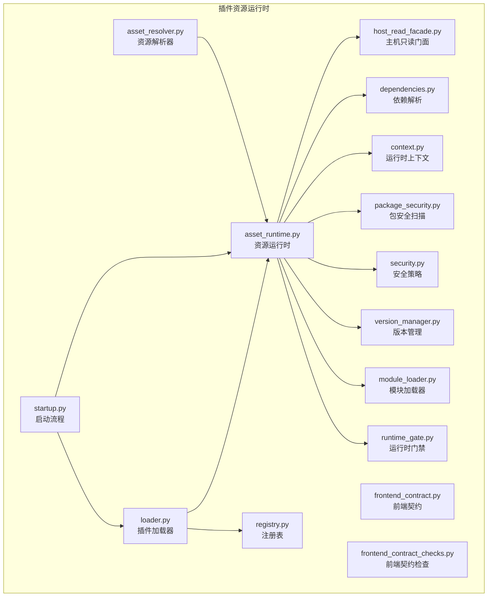
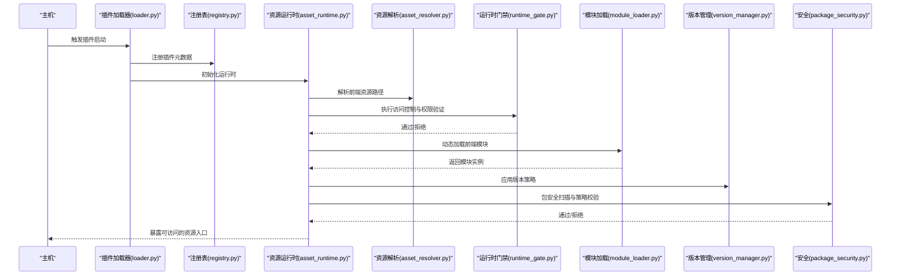
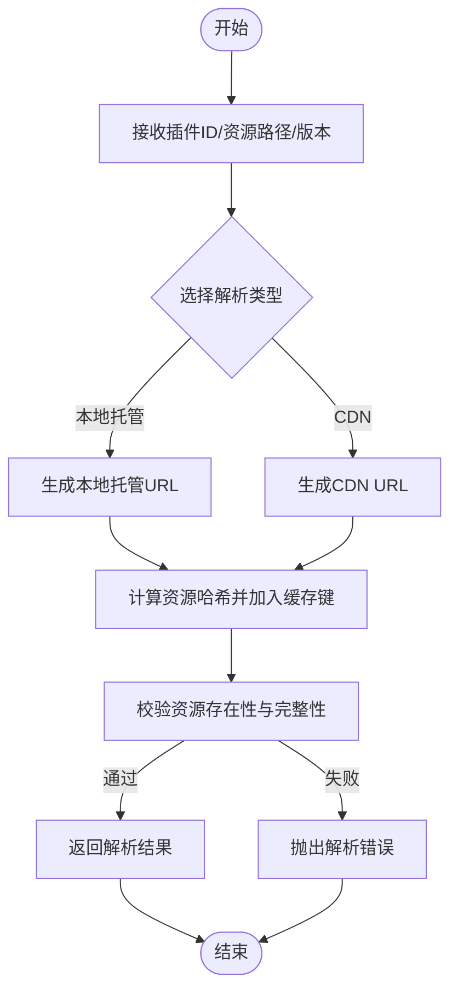
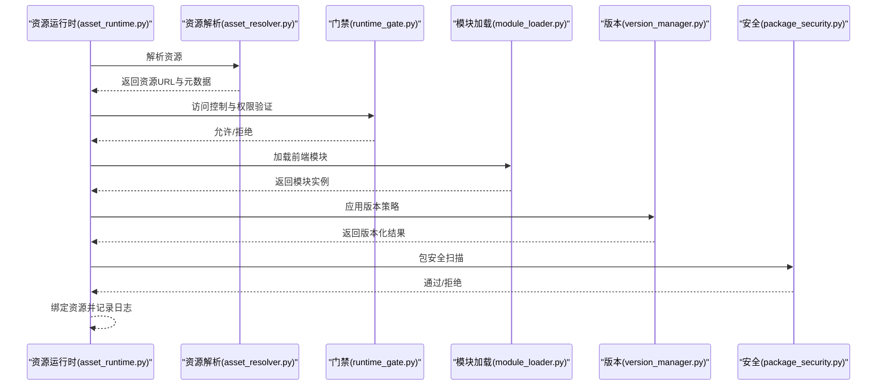
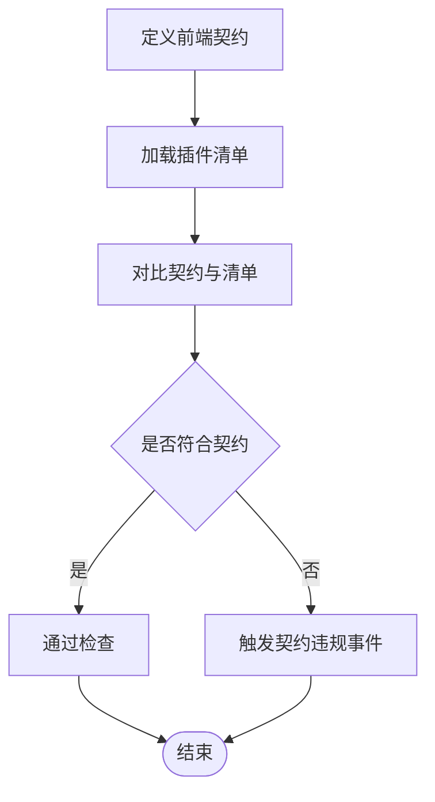
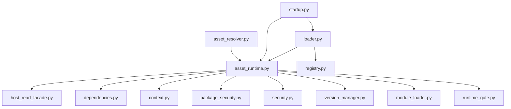

# 插件资源运行时

<cite>
**本文引用的文件**
- [asset_resolver.py](file://backend/app/plugins/asset_resolver.py)
- [asset_runtime.py](file://backend/app/plugins/asset_runtime.py)
- [frontend_contract.py](file://backend/app/plugins/frontend_contract.py)
- [frontend_contract_checks.py](file://backend/app/plugins/frontend_contract_checks.py)
- [runtime_gate.py](file://backend/app/plugins/runtime_gate.py)
- [module_loader.py](file://backend/app/plugins/module_loader.py)
- [loader.py](file://backend/app/plugins/loader.py)
- [version_manager.py](file://backend/app/plugins/version_manager.py)
- [security.py](file://backend/app/plugins/security.py)
- [package_security.py](file://backend/app/plugins/package_security.py)
- [startup.py](file://backend/app/plugins/startup.py)
- [registry.py](file://backend/app/plugins/registry.py)
- [context.py](file://backend/app/plugins/context.py)
- [dependencies.py](file://backend/app/plugins/dependencies.py)
- [host_read_facade.py](file://backend/app/plugins/host_read_facade.py)
- [test_plugin_asset_resolver.py](file://backend/tests/test_plugin_asset_resolver.py)
- [test_plugin_asset_runtime_gate.py](file://backend/tests/test_plugin_asset_runtime_gate.py)
- [test_plugin_public_asset_route.py](file://backend/tests/test_plugin_public_asset_route.py)
</cite>

## 目录
1. [引言](#引言)
2. [项目结构](#项目结构)
3. [核心组件](#核心组件)
4. [架构总览](#架构总览)
5. [详细组件分析](#详细组件分析)
6. [依赖关系分析](#依赖关系分析)
7. [性能考量](#性能考量)
8. [故障排查指南](#故障排查指南)
9. [结论](#结论)
10. [附录](#附录)

## 引言
本文件面向插件资源运行时系统，聚焦于插件前端静态资源的托管、动态加载与缓存机制，以及运行时初始化、依赖解析与资源绑定流程。文档同时覆盖版本管理、安全访问控制、权限验证与访问日志记录，并提供热更新、增量加载与性能优化的策略建议。通过具体文件路径与图示，帮助开发者快速理解并实践插件前端资源管理的最佳做法。

## 项目结构
围绕插件资源运行时的关键模块主要位于后端应用的 plugins 子目录中，涵盖资源解析、运行时门禁、模块加载、清单与版本管理、安全与权限、启动与上下文等子系统。测试用例则分布在 tests 目录下，用于验证资源解析、运行时门禁与公开资产路由的行为。

图表来源
- [asset_resolver.py](file://backend/app/plugins/asset_resolver.py)
- [asset_runtime.py](file://backend/app/plugins/asset_runtime.py)
- [frontend_contract.py](file://backend/app/plugins/frontend_contract.py)
- [frontend_contract_checks.py](file://backend/app/plugins/frontend_contract_checks.py)
- [runtime_gate.py](file://backend/app/plugins/runtime_gate.py)
- [module_loader.py](file://backend/app/plugins/module_loader.py)
- [loader.py](file://backend/app/plugins/loader.py)
- [version_manager.py](file://backend/app/plugins/version_manager.py)
- [security.py](file://backend/app/plugins/security.py)
- [package_security.py](file://backend/app/plugins/package_security.py)
- [startup.py](file://backend/app/plugins/startup.py)
- [registry.py](file://backend/app/plugins/registry.py)
- [context.py](file://backend/app/plugins/context.py)
- [dependencies.py](file://backend/app/plugins/dependencies.py)
- [host_read_facade.py](file://backend/app/plugins/host_read_facade.py)

章节来源
- [asset_resolver.py](file://backend/app/plugins/asset_resolver.py)
- [asset_runtime.py](file://backend/app/plugins/asset_runtime.py)
- [frontend_contract.py](file://backend/app/plugins/frontend_contract.py)
- [frontend_contract_checks.py](file://backend/app/plugins/frontend_contract_checks.py)
- [runtime_gate.py](file://backend/app/plugins/runtime_gate.py)
- [module_loader.py](file://backend/app/plugins/module_loader.py)
- [loader.py](file://backend/app/plugins/loader.py)
- [version_manager.py](file://backend/app/plugins/version_manager.py)
- [security.py](file://backend/app/plugins/security.py)
- [package_security.py](file://backend/app/plugins/package_security.py)
- [startup.py](file://backend/app/plugins/startup.py)
- [registry.py](file://backend/app/plugins/registry.py)
- [context.py](file://backend/app/plugins/context.py)
- [dependencies.py](file://backend/app/plugins/dependencies.py)
- [host_read_facade.py](file://backend/app/plugins/host_read_facade.py)

## 核心组件
- 资源解析器：负责将插件前端资源映射到可访问的托管路径或 CDN 资源，支持版本化与缓存键生成。
- 资源运行时：协调资源解析、模块加载、依赖解析、安全校验与运行时门禁，统一处理资源绑定与暴露。
- 前端契约与检查：定义插件前端资源的接口约束与一致性校验，确保运行时可用性。
- 运行时门禁：在资源暴露前进行访问控制与权限验证，保障安全边界。
- 模块加载器：按需加载插件前端模块，支持动态导入与缓存复用。
- 版本管理：维护插件前端资源版本，支持回滚、锁定与增量更新。
- 安全与包安全：对插件包进行安全扫描与策略校验，防止恶意资源注入。
- 启动与注册：插件启动阶段完成注册、上下文构建与前置检查。
- 上下文与依赖：提供运行时上下文与依赖解析能力，支撑资源绑定与生命周期管理。
- 主机只读门面：为运行时提供只读访问主机侧资源的能力。

章节来源
- [asset_resolver.py](file://backend/app/plugins/asset_resolver.py)
- [asset_runtime.py](file://backend/app/plugins/asset_runtime.py)
- [frontend_contract.py](file://backend/app/plugins/frontend_contract.py)
- [frontend_contract_checks.py](file://backend/app/plugins/frontend_contract_checks.py)
- [runtime_gate.py](file://backend/app/plugins/runtime_gate.py)
- [module_loader.py](file://backend/app/plugins/module_loader.py)
- [version_manager.py](file://backend/app/plugins/version_manager.py)
- [security.py](file://backend/app/plugins/security.py)
- [package_security.py](file://backend/app/plugins/package_security.py)
- [startup.py](file://backend/app/plugins/startup.py)
- [context.py](file://backend/app/plugins/context.py)
- [dependencies.py](file://backend/app/plugins/dependencies.py)
- [host_read_facade.py](file://backend/app/plugins/host_read_facade.py)

## 架构总览
插件资源运行时以“资源解析 → 运行时门禁 → 模块加载 → 版本管理 → 安全校验”的链路为核心，结合上下文与依赖解析，最终完成资源绑定与对外暴露。启动阶段由注册表与加载器驱动，形成完整的生命周期闭环。

图表来源
- [loader.py](file://backend/app/plugins/loader.py)
- [registry.py](file://backend/app/plugins/registry.py)
- [asset_runtime.py](file://backend/app/plugins/asset_runtime.py)
- [asset_resolver.py](file://backend/app/plugins/asset_resolver.py)
- [runtime_gate.py](file://backend/app/plugins/runtime_gate.py)
- [module_loader.py](file://backend/app/plugins/module_loader.py)
- [version_manager.py](file://backend/app/plugins/version_manager.py)
- [package_security.py](file://backend/app/plugins/package_security.py)

## 详细组件分析

### 资源解析器（asset_resolver.py）
职责
- 将插件前端资源映射为可访问的托管路径或 CDN 地址。
- 支持基于版本号与哈希的缓存键生成，便于浏览器与边缘缓存命中。
- 提供资源存在性与完整性校验，避免暴露无效资源。

关键流程
- 输入：插件标识、资源相对路径、版本信息。
- 处理：根据配置选择本地托管或外部存储；生成带版本与哈希的资源 URL；执行存在性检查。
- 输出：标准化资源 URL 与缓存头参数。

图表来源
- [asset_resolver.py](file://backend/app/plugins/asset_resolver.py)

章节来源
- [asset_resolver.py](file://backend/app/plugins/asset_resolver.py)

### 资源运行时（asset_runtime.py）
职责
- 协调资源解析、模块加载、依赖解析、安全校验与运行时门禁。
- 统一处理资源绑定与对外暴露，确保访问控制与权限验证贯穿始终。
- 集成版本管理与包安全策略，保障运行时稳定性与安全性。

关键流程
- 初始化：读取插件清单与上下文，构建运行时状态。
- 资源绑定：解析资源 → 门禁校验 → 模块加载 → 版本应用 → 安全扫描。
- 暴露入口：生成可访问的路由或代理规则，记录访问日志。

图表来源
- [asset_runtime.py](file://backend/app/plugins/asset_runtime.py)
- [asset_resolver.py](file://backend/app/plugins/asset_resolver.py)
- [runtime_gate.py](file://backend/app/plugins/runtime_gate.py)
- [module_loader.py](file://backend/app/plugins/module_loader.py)
- [version_manager.py](file://backend/app/plugins/version_manager.py)
- [package_security.py](file://backend/app/plugins/package_security.py)

章节来源
- [asset_runtime.py](file://backend/app/plugins/asset_runtime.py)

### 前端契约与检查（frontend_contract.py, frontend_contract_checks.py）
职责
- 定义插件前端资源的接口契约，包括入口文件、依赖声明、版本要求等。
- 在运行时对契约进行一致性检查，确保资源满足运行条件。

关键流程
- 契约定义：声明资源清单、入口点、依赖与版本约束。
- 运行时检查：比对实际资源与契约，发现不一致立即阻断。

图表来源
- [frontend_contract.py](file://backend/app/plugins/frontend_contract.py)
- [frontend_contract_checks.py](file://backend/app/plugins/frontend_contract_checks.py)

章节来源
- [frontend_contract.py](file://backend/app/plugins/frontend_contract.py)
- [frontend_contract_checks.py](file://backend/app/plugins/frontend_contract_checks.py)

### 运行时门禁（runtime_gate.py）
职责
- 在资源暴露前执行访问控制与权限验证，确保仅授权用户可访问特定资源。
- 结合租户域、角色与策略进行细粒度权限判定。

关键流程
- 输入：请求上下文、目标资源、访问意图。
- 处理：解析租户域与身份信息，匹配权限策略与白名单。
- 输出：允许或拒绝访问，并记录审计日志。

章节来源
- [runtime_gate.py](file://backend/app/plugins/runtime_gate.py)

### 模块加载器（module_loader.py）
职责
- 支持按需动态加载插件前端模块，提升首屏性能与内存占用。
- 缓存已加载模块，避免重复加载与网络开销。

关键流程
- 输入：模块标识、版本、缓存策略。
- 处理：查找缓存 → 未命中则动态导入 → 更新缓存。
- 输出：模块实例与缓存状态。

章节来源
- [module_loader.py](file://backend/app/plugins/module_loader.py)

### 版本管理（version_manager.py）
职责
- 管理插件前端资源版本，支持锁定、回滚与增量更新。
- 与资源解析器协作，生成带版本的缓存键，提升缓存命中率。

关键流程
- 输入：当前版本、目标版本、更新策略。
- 处理：校验版本合法性 → 应用锁定/回滚 → 生成新缓存键。
- 输出：版本化资源与缓存策略。

章节来源
- [version_manager.py](file://backend/app/plugins/version_manager.py)

### 安全与包安全（security.py, package_security.py）
职责
- 对插件包进行安全扫描与策略校验，防止恶意资源注入。
- 结合运行时门禁与版本管理，形成多层安全防护。

关键流程
- 输入：插件包、安全策略、白名单。
- 处理：扫描包内资源 → 校验签名与完整性 → 应用策略。
- 输出：通过/拒绝与告警日志。

章节来源
- [security.py](file://backend/app/plugins/security.py)
- [package_security.py](file://backend/app/plugins/package_security.py)

### 启动与注册（startup.py, registry.py）
职责
- 启动阶段完成插件注册、上下文构建与前置检查。
- 注册表维护插件元数据与运行时状态，为加载器与运行时提供查询能力。

关键流程
- 启动：读取配置 → 注册插件 → 构建上下文 → 前置检查。
- 查询：根据插件ID获取元数据与状态。

章节来源
- [startup.py](file://backend/app/plugins/startup.py)
- [registry.py](file://backend/app/plugins/registry.py)

### 上下文与依赖（context.py, dependencies.py）
职责
- 提供运行时上下文，包含租户域、用户身份、会话信息等。
- 依赖解析负责解析插件间的依赖关系，确保加载顺序与兼容性。

关键流程
- 上下文：构建与传递运行时上下文。
- 依赖：解析依赖图 → 排序 → 逐项加载。

章节来源
- [context.py](file://backend/app/plugins/context.py)
- [dependencies.py](file://backend/app/plugins/dependencies.py)

### 主机只读门面（host_read_facade.py）
职责
- 为运行时提供只读访问主机侧资源的能力，避免运行时对主机状态产生副作用。

章节来源
- [host_read_facade.py](file://backend/app/plugins/host_read_facade.py)

## 依赖关系分析
插件资源运行时内部模块之间存在清晰的职责划分与依赖关系。资源解析器与运行时门禁是资源暴露前的关键节点，模块加载器与版本管理分别负责动态加载与缓存策略，安全与包安全提供运行时安全防护，启动与注册为整个生命周期提供基础。

图表来源
- [asset_resolver.py](file://backend/app/plugins/asset_resolver.py)
- [asset_runtime.py](file://backend/app/plugins/asset_runtime.py)
- [runtime_gate.py](file://backend/app/plugins/runtime_gate.py)
- [module_loader.py](file://backend/app/plugins/module_loader.py)
- [version_manager.py](file://backend/app/plugins/version_manager.py)
- [security.py](file://backend/app/plugins/security.py)
- [package_security.py](file://backend/app/plugins/package_security.py)
- [context.py](file://backend/app/plugins/context.py)
- [dependencies.py](file://backend/app/plugins/dependencies.py)
- [host_read_facade.py](file://backend/app/plugins/host_read_facade.py)
- [loader.py](file://backend/app/plugins/loader.py)
- [registry.py](file://backend/app/plugins/registry.py)
- [startup.py](file://backend/app/plugins/startup.py)

章节来源
- [asset_resolver.py](file://backend/app/plugins/asset_resolver.py)
- [asset_runtime.py](file://backend/app/plugins/asset_runtime.py)
- [runtime_gate.py](file://backend/app/plugins/runtime_gate.py)
- [module_loader.py](file://backend/app/plugins/module_loader.py)
- [version_manager.py](file://backend/app/plugins/version_manager.py)
- [security.py](file://backend/app/plugins/security.py)
- [package_security.py](file://backend/app/plugins/package_security.py)
- [context.py](file://backend/app/plugins/context.py)
- [dependencies.py](file://backend/app/plugins/dependencies.py)
- [host_read_facade.py](file://backend/app/plugins/host_read_facade.py)
- [loader.py](file://backend/app/plugins/loader.py)
- [registry.py](file://backend/app/plugins/registry.py)
- [startup.py](file://backend/app/plugins/startup.py)

## 性能考量
- 缓存策略：资源解析器应生成稳定的缓存键，结合版本管理提升边缘缓存命中率；模块加载器应缓存已加载模块，减少重复加载。
- 动态加载：优先采用按需加载与懒加载策略，降低首屏资源体积与等待时间。
- 并发与限流：在高并发场景下，合理设置模块加载与资源解析的并发度与超时阈值，避免资源争用。
- 增量更新：通过版本管理与运行时门禁配合，实现灰度发布与增量更新，降低风险。
- 日志与监控：记录资源访问与加载耗时，结合指标分析热点资源与瓶颈环节。

## 故障排查指南
- 资源解析失败
  - 检查资源是否存在且可访问，确认版本与哈希是否正确。
  - 参考测试用例定位问题范围。
  - 参考路径：[test_plugin_asset_resolver.py](file://backend/tests/test_plugin_asset_resolver.py)
- 运行时门禁拒绝
  - 核对租户域、角色与权限策略，确认白名单与黑名单配置。
  - 参考路径：[runtime_gate.py](file://backend/app/plugins/runtime_gate.py)
- 公开资产路由异常
  - 检查路由配置与资源暴露策略，确保与运行时门禁一致。
  - 参考路径：[test_plugin_public_asset_route.py](file://backend/tests/test_plugin_public_asset_route.py)
- 运行时门禁测试失败
  - 检查门禁逻辑与测试用例预期，定位策略配置问题。
  - 参考路径：[test_plugin_asset_runtime_gate.py](file://backend/tests/test_plugin_asset_runtime_gate.py)

章节来源
- [test_plugin_asset_resolver.py](file://backend/tests/test_plugin_asset_resolver.py)
- [test_plugin_asset_runtime_gate.py](file://backend/tests/test_plugin_asset_runtime_gate.py)
- [test_plugin_public_asset_route.py](file://backend/tests/test_plugin_public_asset_route.py)
- [runtime_gate.py](file://backend/app/plugins/runtime_gate.py)

## 结论
插件资源运行时通过“资源解析 → 运行时门禁 → 模块加载 → 版本管理 → 安全校验”的完整链路，实现了对插件前端资源的静态托管、动态加载与缓存优化。结合契约约束、权限验证与安全扫描，系统在保证安全性的同时提升了性能与可维护性。建议在生产环境中启用严格的版本锁定与灰度发布策略，并持续监控资源访问与加载性能。

## 附录
- 测试参考
  - 资源解析测试：[test_plugin_asset_resolver.py](file://backend/tests/test_plugin_asset_resolver.py)
  - 运行时门禁测试：[test_plugin_asset_runtime_gate.py](file://backend/tests/test_plugin_asset_runtime_gate.py)
  - 公开资产路由测试：[test_plugin_public_asset_route.py](file://backend/tests/test_plugin_public_asset_route.py)