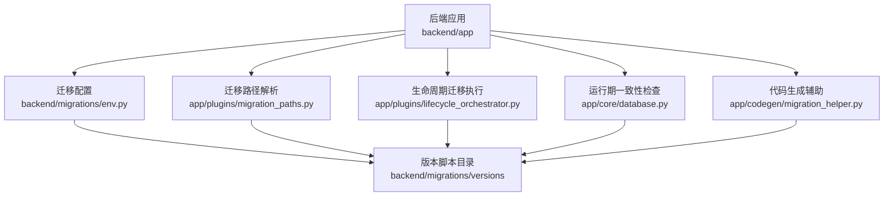
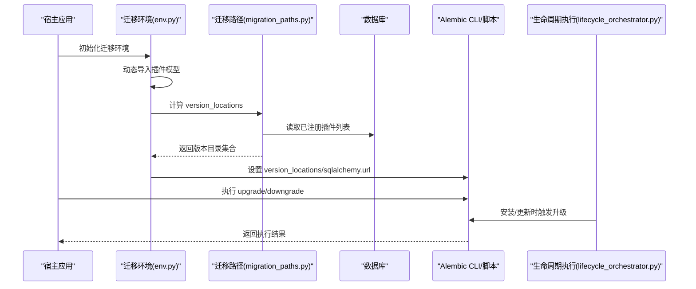
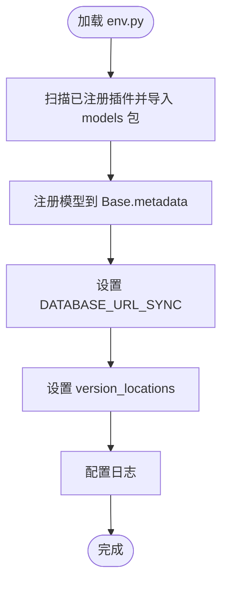
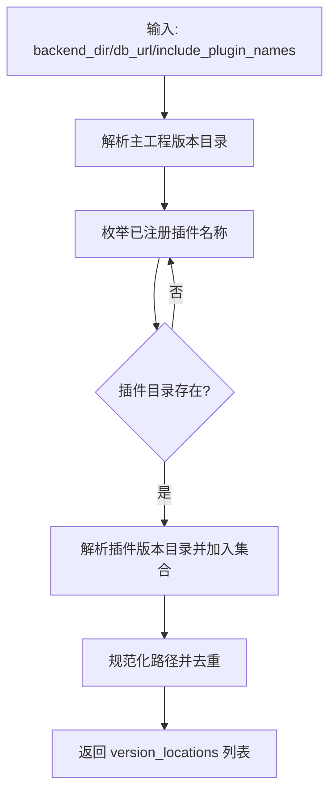
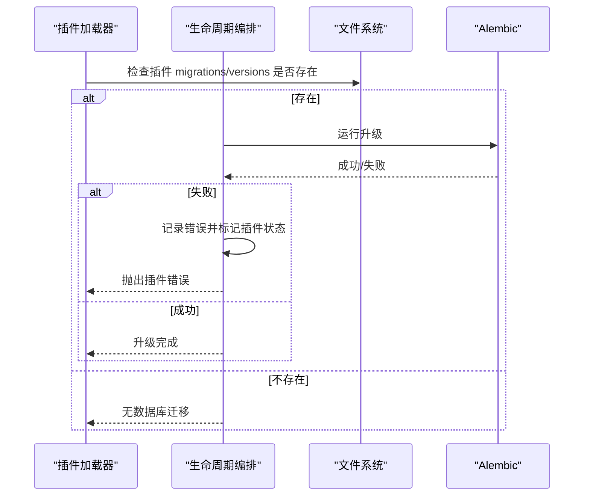
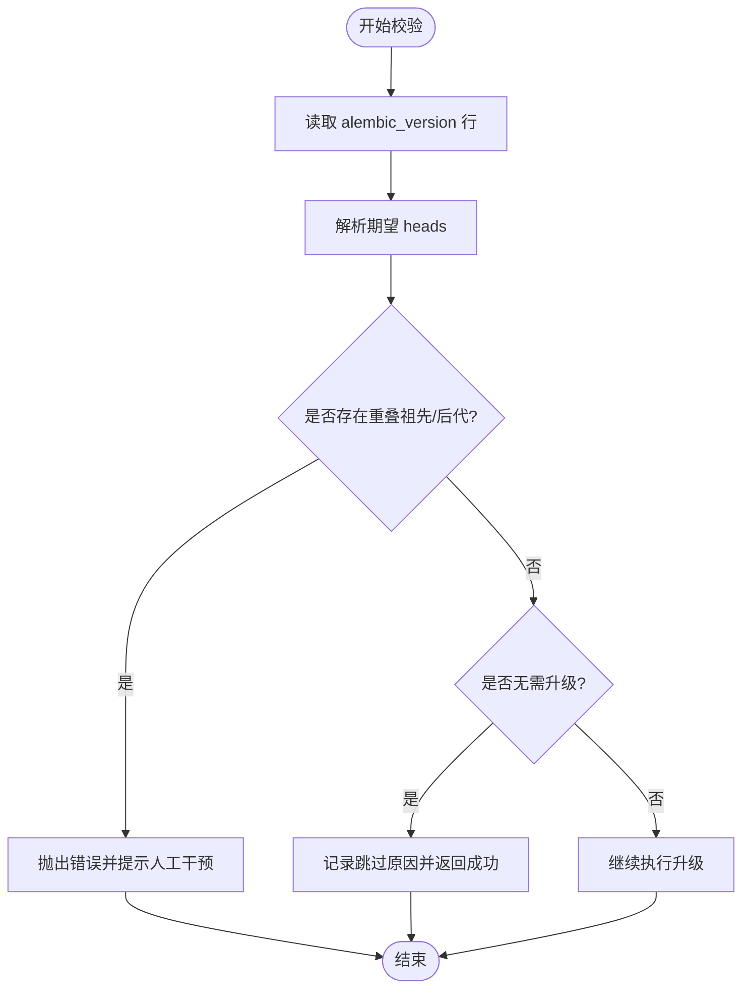
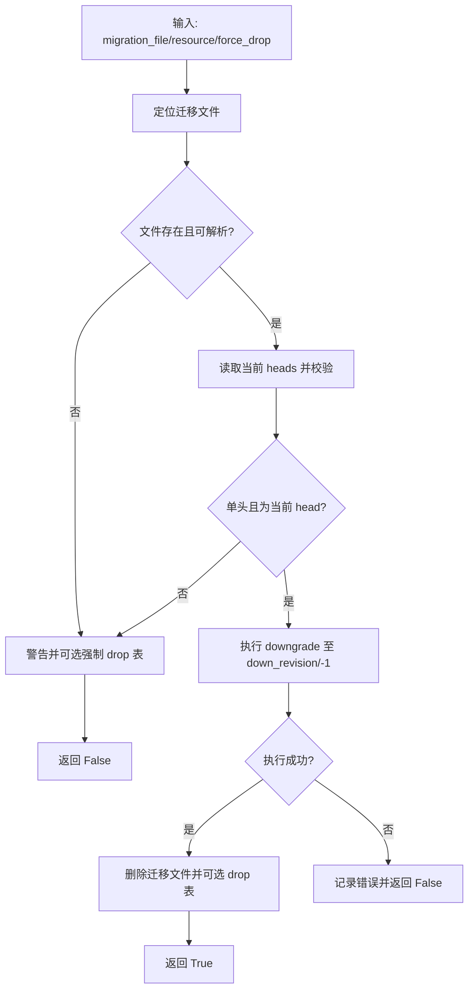
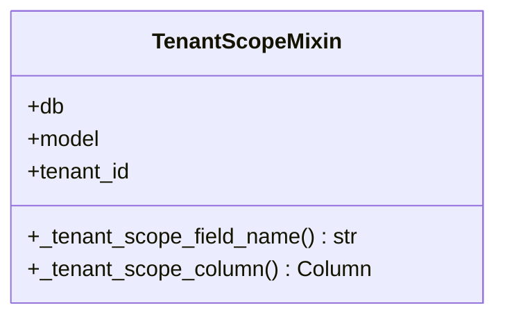
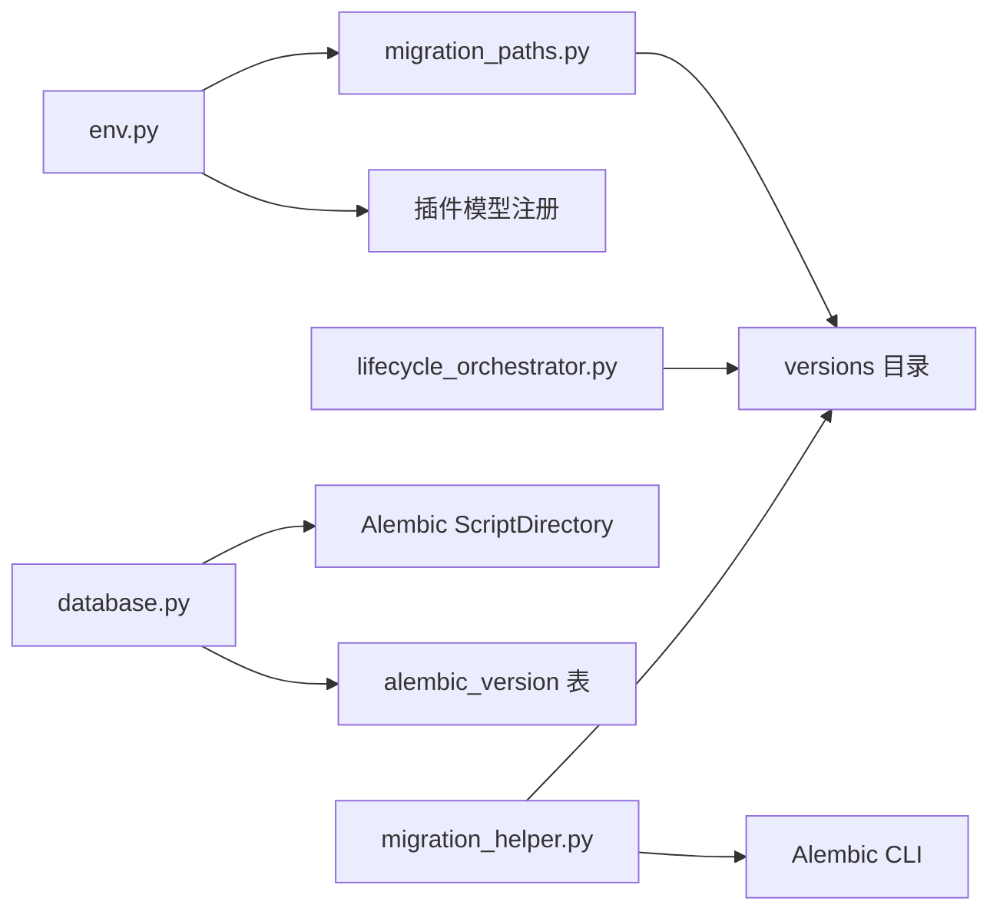

# 数据库迁移

<cite>
**本文引用的文件**
- [env.py](file://backend/migrations/env.py)
- [helpers.py](file://backend/migrations/helpers.py)
- [script.py.mako](file://backend/migrations/script.py.mako)
- [alembic.ini](file://backend/alembic.ini)
- [database.py](file://backend/app/core/database.py)
- [migration_paths.py](file://backend/app/plugins/migration_paths.py)
- [lifecycle_orchestrator.py](file://backend/app/plugins/lifecycle_orchestrator.py)
- [migration_helper.py](file://backend/app/codegen/migration_helper.py)
- [tenant_scope.py](file://backend/app/core/repository_parts/tenant_scope.py)
- [20260305_add_tenant_scoped_unique_constraints.py](file://backend/migrations/versions/20260305_add_tenant_scoped_unique_constraints.py)
- [test_alembic_plugin_paths_consistency.py](file://backend/tests/migrations/test_alembic_plugin_paths_consistency.py)
- [test_alembic_revision_ids.py](file://backend/tests/migrations/test_alembic_revision_ids.py)
</cite>

## 目录
1. [简介](#简介)
2. [项目结构](#项目结构)
3. [核心组件](#核心组件)
4. [架构总览](#架构总览)
5. [详细组件分析](#详细组件分析)
6. [依赖关系分析](#依赖关系分析)
7. [性能考虑](#性能考虑)
8. [故障排查指南](#故障排查指南)
9. [结论](#结论)
10. [附录](#附录)

## 简介
本文件面向 NovusAI SaaS 项目的数据库迁移体系，系统性阐述基于 Alembic 的迁移框架配置与使用，涵盖迁移脚本生成、版本管理、依赖关系处理、多租户策略与数据隔离、回滚与冲突解决、性能优化与事务管理等主题。文档以仓库中实际文件为依据，提供架构图、序列图与流程图，帮助开发者理解并高效管理数据库演进。

## 项目结构
后端迁移相关的核心位置如下：
- 迁移元配置与运行环境：backend/migrations/env.py、backend/migrations/script.py.mako、backend/alembic.ini
- 版本化迁移脚本：backend/migrations/versions/*.py
- 多插件迁移路径解析：backend/app/plugins/migration_paths.py
- 生命周期内自动执行迁移：backend/app/plugins/lifecycle_orchestrator.py
- 运行期迁移一致性校验与升级跳过逻辑：backend/app/core/database.py
- 代码生成辅助（含回滚与清理）：backend/app/codegen/migration_helper.py
- 多租户范围与约束：backend/app/core/repository_parts/tenant_scope.py
- 典型迁移示例（唯一约束与去重）：backend/migrations/versions/20260305_add_tenant_scoped_unique_constraints.py
- 迁移测试（路径一致性、修订 ID 合法性）：backend/tests/migrations/*.py

图表来源
- [env.py:1-77](file://backend/migrations/env.py#L1-L77)
- [migration_paths.py:210-242](file://backend/app/plugins/migration_paths.py#L210-L242)
- [lifecycle_orchestrator.py:387-426](file://backend/app/plugins/lifecycle_orchestrator.py#L387-L426)
- [database.py:284-314](file://backend/app/core/database.py#L284-L314)
- [migration_helper.py:152-249](file://backend/app/codegen/migration_helper.py#L152-L249)

章节来源
- [env.py:1-77](file://backend/migrations/env.py#L1-L77)
- [alembic.ini](file://backend/alembic.ini)
- [migration_paths.py:210-242](file://backend/app/plugins/migration_paths.py#L210-L242)

## 核心组件
- 迁移环境与模型发现
  - 在迁移环境初始化中动态导入插件模型，确保 Alembic 自动检测能识别到所有已注册模型，避免未安装插件污染宿主迁移图。
  - 通过设置 version_locations 将主工程与各插件的迁移版本目录统一纳入扫描范围。
- 多插件迁移路径构建
  - 基于数据库连接与插件清单，计算主工程与已注册插件的版本目录集合，形成 Alembic 的 version_locations。
- 生命周期内自动迁移
  - 插件生命周期在安装/更新阶段调用 Alembic 升级，失败时记录状态并抛出明确错误。
- 运行期一致性校验
  - 在启动或运维流程中读取 alembic_version 表，解析期望 heads，并对重叠祖先/后代 stamp 进行严格校验，必要时拒绝继续。
- 代码生成辅助
  - 提供安全的 down_rev 执行与迁移文件清理，防止误删无迁移文件的表；支持强制 drop 作为兜底手段。

章节来源
- [env.py:26-56](file://backend/migrations/env.py#L26-L56)
- [env.py:64-73](file://backend/migrations/env.py#L64-L73)
- [migration_paths.py:210-242](file://backend/app/plugins/migration_paths.py#L210-L242)
- [lifecycle_orchestrator.py:387-426](file://backend/app/plugins/lifecycle_orchestrator.py#L387-L426)
- [database.py:284-314](file://backend/app/core/database.py#L284-L314)
- [database.py:490-521](file://backend/app/core/database.py#L490-L521)
- [migration_helper.py:152-249](file://backend/app/codegen/migration_helper.py#L152-L249)

## 架构总览
下图展示了从应用启动到迁移执行的关键交互，包括模型发现、路径解析、版本定位与执行。

图表来源
- [env.py:26-56](file://backend/migrations/env.py#L26-L56)
- [env.py:64-73](file://backend/migrations/env.py#L64-L73)
- [migration_paths.py:210-242](file://backend/app/plugins/migration_paths.py#L210-L242)
- [lifecycle_orchestrator.py:387-426](file://backend/app/plugins/lifecycle_orchestrator.py#L387-L426)

## 详细组件分析

### 组件A：迁移环境与模型发现（env.py）
- 动态导入策略
  - 通过遍历数据库已注册插件，按需导入其 models 包，确保 Base.metadata 上注册了全部模型，从而让 Alembic 自动检测可用变更。
  - 对导入失败的情况进行告警但不中断宿主迁移，增强健壮性。
- 版本目录与日志
  - 设置 sqlalchemy.url 与 version_locations，启用日志配置，便于调试与审计。

图表来源
- [env.py:26-56](file://backend/migrations/env.py#L26-L56)
- [env.py:64-73](file://backend/migrations/env.py#L64-L73)

章节来源
- [env.py:26-56](file://backend/migrations/env.py#L26-L56)
- [env.py:64-73](file://backend/migrations/env.py#L64-L73)

### 组件B：多插件迁移路径解析（migration_paths.py）
- 路径构建规则
  - 主工程版本目录始终包含在内；对每个已注册插件，解析其 backend/plugins/<name>/backend/migrations/versions 目录并加入集合。
  - 使用规范化路径去重，保证 version_locations 的稳定性与可预测性。
- 可选插件模型导入
  - 仅对数据库中已注册的插件参与迁移路径构建，避免仓库中未安装插件影响宿主迁移。

图表来源
- [migration_paths.py:210-242](file://backend/app/plugins/migration_paths.py#L210-L242)

章节来源
- [migration_paths.py:210-242](file://backend/app/plugins/migration_paths.py#L210-L242)

### 组件C：生命周期内自动迁移（lifecycle_orchestrator.py）
- 执行时机
  - 在插件安装/更新流程中，若检测到插件存在 migrations/versions 目录，则触发 Alembic 升级步骤。
- 错误处理
  - 升级失败时记录公共错误信息、增加错误计数并标记插件状态，随后抛出插件错误，保证可观测性与可恢复性。

图表来源
- [lifecycle_orchestrator.py:387-426](file://backend/app/plugins/lifecycle_orchestrator.py#L387-L426)

章节来源
- [lifecycle_orchestrator.py:387-426](file://backend/app/plugins/lifecycle_orchestrator.py#L387-L426)

### 组件D：运行期一致性校验与升级跳过（database.py）
- 读取当前版本与期望 heads
  - 通过独立 Alembic Config 与 ScriptDirectory 获取当前 alembic_version 与 heads，用于一致性判断。
- 重叠 stamp 校验
  - 若发现祖先/后代 stamp 重叠，立即报错并要求人工确认后再清理，避免 schema 不一致。
- 升级跳过策略
  - 当当前版本已是期望 heads 或无需升级时，记录跳过原因并返回成功，减少不必要的执行。

图表来源
- [database.py:284-314](file://backend/app/core/database.py#L284-L314)
- [database.py:490-521](file://backend/app/core/database.py#L490-L521)

章节来源
- [database.py:284-314](file://backend/app/core/database.py#L284-L314)
- [database.py:490-521](file://backend/app/core/database.py#L490-L521)

### 组件E：代码生成辅助与安全回滚（migration_helper.py）
- 回滚前检查
  - 若目标迁移文件缺失或无法提取 down_revision，拒绝回滚并可选强制 drop 表。
  - 读取当前 heads，若多头或非当前 head，拒绝回滚以避免破坏迁移链。
- 执行回滚与清理
  - 调用 Alembic downgrade 至目标版本，成功后删除迁移文件并可选删除对应表，记录日志。

图表来源
- [migration_helper.py:152-249](file://backend/app/codegen/migration_helper.py#L152-L249)

章节来源
- [migration_helper.py:152-249](file://backend/app/codegen/migration_helper.py#L152-L249)

### 组件F：多租户范围与约束（tenant_scope.py 与示例迁移）
- 租户范围混入
  - 通过 TenantScopeMixin 在查询/写入时自动附加租户字段过滤条件，确保跨租户数据隔离。
- 唯一约束与去重
  - 示例迁移在添加多租户唯一约束前先执行去重，避免违反唯一性导致迁移失败。

图表来源
- [tenant_scope.py:17-40](file://backend/app/core/repository_parts/tenant_scope.py#L17-L40)

章节来源
- [tenant_scope.py:17-40](file://backend/app/core/repository_parts/tenant_scope.py#L17-L40)
- [20260305_add_tenant_scoped_unique_constraints.py:130-173](file://backend/migrations/versions/20260305_add_tenant_scoped_unique_constraints.py#L130-L173)

## 依赖关系分析
- 组件耦合
  - env.py 依赖 migration_paths.py 以获得完整的 version_locations；同时依赖插件模型注册以完成自动检测。
  - lifecycle_orchestrator.py 依赖插件目录结构与 Alembic CLI，负责在安装/更新阶段触发迁移。
  - database.py 依赖 Alembic ScriptDirectory 与 alembic_version 表，用于一致性校验与升级跳过。
  - migration_helper.py 依赖 Alembic CLI 与迁移文件元数据，提供安全回滚能力。
- 外部依赖
  - SQLAlchemy 与 Alembic 为核心依赖；PostgreSQL 提供 pg_tables 等系统表用于残留表清理与校验。

图表来源
- [env.py:26-56](file://backend/migrations/env.py#L26-L56)
- [migration_paths.py:210-242](file://backend/app/plugins/migration_paths.py#L210-L242)
- [lifecycle_orchestrator.py:387-426](file://backend/app/plugins/lifecycle_orchestrator.py#L387-L426)
- [database.py:284-314](file://backend/app/core/database.py#L284-L314)
- [migration_helper.py:152-249](file://backend/app/codegen/migration_helper.py#L152-L249)

章节来源
- [env.py:26-56](file://backend/migrations/env.py#L26-L56)
- [migration_paths.py:210-242](file://backend/app/plugins/migration_paths.py#L210-L242)
- [lifecycle_orchestrator.py:387-426](file://backend/app/plugins/lifecycle_orchestrator.py#L387-L426)
- [database.py:284-314](file://backend/app/core/database.py#L284-L314)
- [migration_helper.py:152-249](file://backend/app/codegen/migration_helper.py#L152-L249)

## 性能考虑
- 批量操作与事务管理
  - 在迁移中尽量合并 DDL/DML，减少长事务时间；对大表变更采用分批处理与索引重建策略，必要时使用在线 DDL 工具。
  - 使用 savepoint 或嵌套事务包裹关键清理逻辑，避免局部异常污染外层事务。
- 索引与约束
  - 新增唯一约束前先去重，避免全表扫描与锁竞争；对高基数列建立合适索引，降低查询成本。
- 迁移执行策略
  - 在 CI/CD 中优先使用 upgrade 而非 downgrade，减少回滚带来的复杂度；对生产环境采用灰度发布与回滚预案。

## 故障排查指南
- 迁移多头问题
  - 现象：alembic current 显示多个 heads。
  - 处理：先执行 merge 或使用工具生成合并迁移，再继续升级。
- 重叠祖先/后代 stamp
  - 现象：alembic_version 中出现祖先/后代重叠。
  - 处理：仅在确认下游 schema 已存在的情况下清理过时祖先 stamp，否则拒绝继续。
- 回滚被拒绝
  - 现象：迁移 helper 拒绝 downgrade。
  - 处理：确认目标迁移为当前 head，或先回滚后续依赖迁移；必要时使用 force_drop 清理残留表。

章节来源
- [migration_helper.py:152-249](file://backend/app/codegen/migration_helper.py#L152-L249)
- [database.py:490-521](file://backend/app/core/database.py#L490-L521)

## 结论
本项目通过 env.py 的动态模型发现、migration_paths.py 的多插件路径聚合、database.py 的运行期一致性校验与 lifecycle_orchestrator.py 的生命周期集成，形成了稳定可靠的迁移体系。配合 tenant_scope 与示例迁移中的去重与约束策略，实现了多租户场景下的数据隔离与一致性保障。建议在团队内固化迁移规范与回滚流程，持续完善测试覆盖，确保数据库演进的安全与可控。

## 附录
- 迁移测试
  - 路径一致性测试：验证迁移路径解析与版本目录集合的正确性。
  - 修订 ID 测试：确保迁移修订 ID 的合法性与唯一性。

章节来源
- [test_alembic_plugin_paths_consistency.py](file://backend/tests/migrations/test_alembic_plugin_paths_consistency.py)
- [test_alembic_revision_ids.py](file://backend/tests/migrations/test_alembic_revision_ids.py)