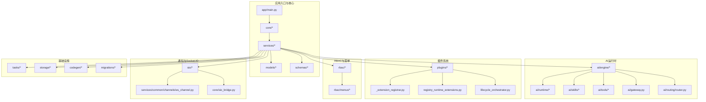
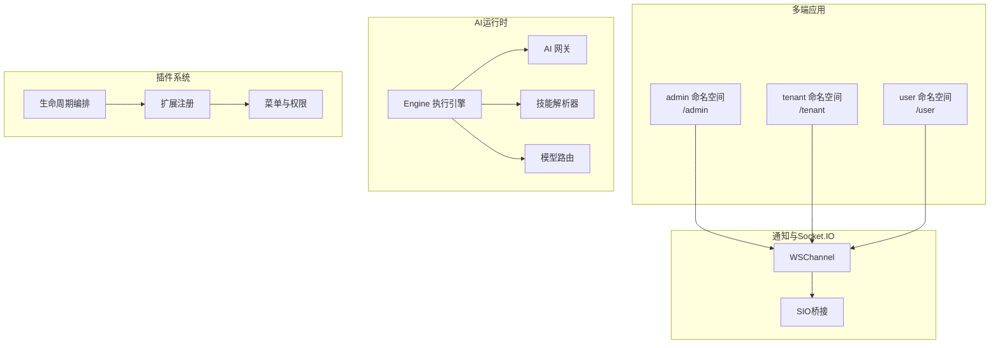
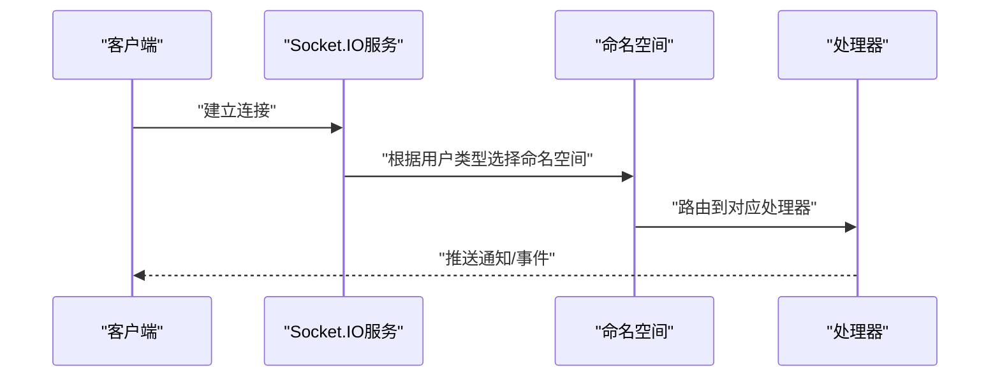
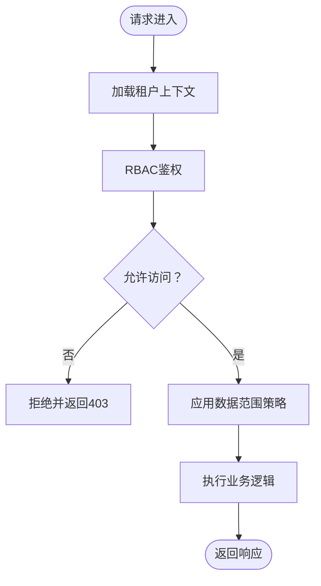
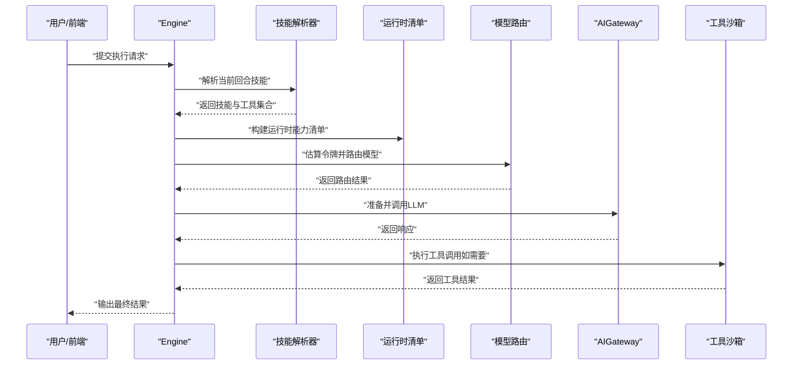
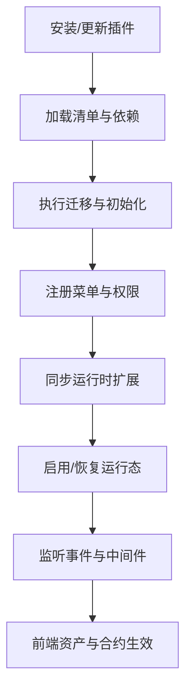
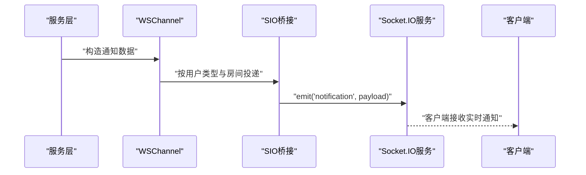
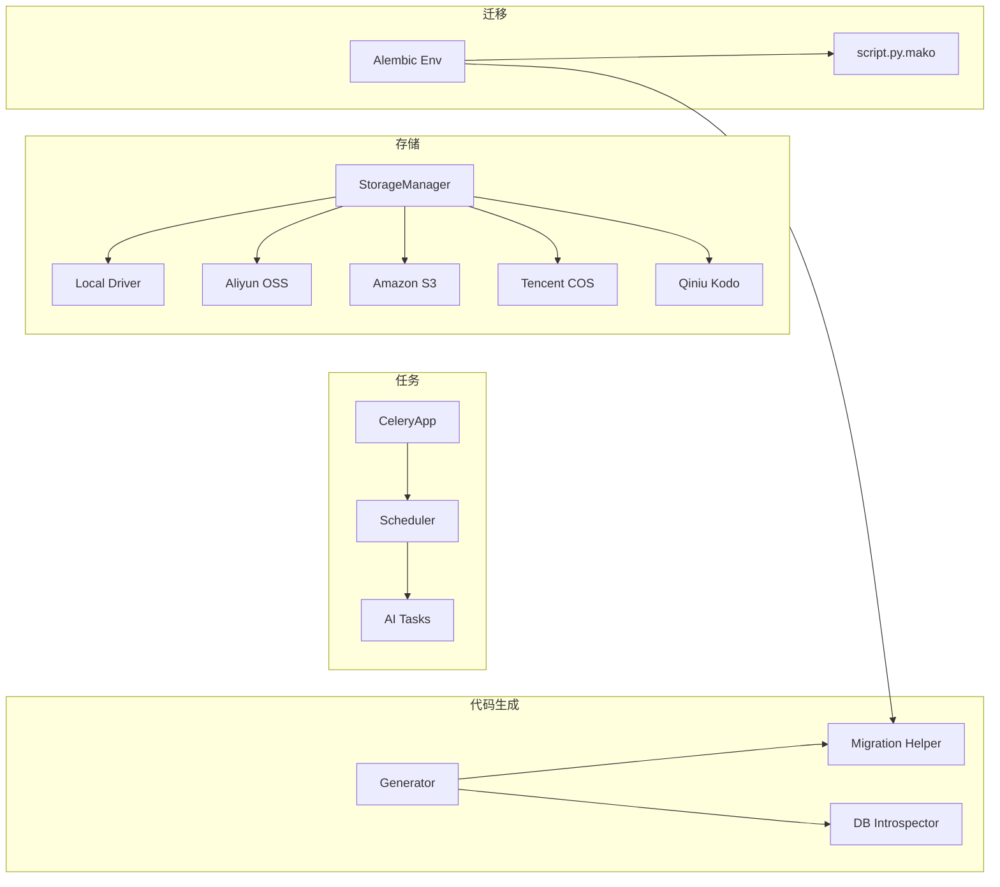
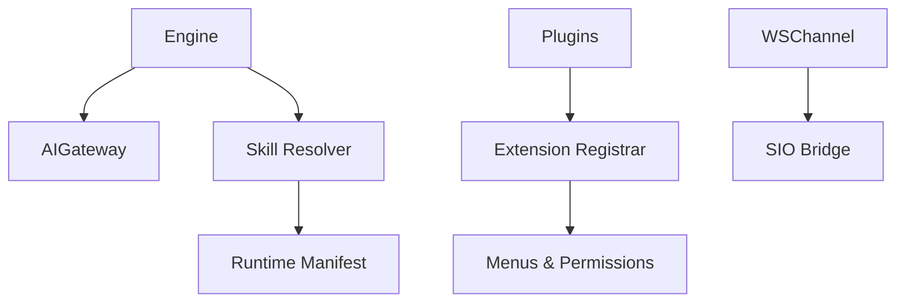

# 核心能力

<cite>
**本文引用的文件**
- [backend/app/main.py](file://backend/app/main.py)
- [backend/app/core/socketio_server.py](file://backend/app/core/socketio_server.py)
- [backend/app/sio/admin_ns.py](file://backend/app/sio/admin_ns.py)
- [backend/app/sio/tenant_ns.py](file://backend/app/sio/tenant_ns.py)
- [backend/app/sio/user_ns.py](file://backend/app/sio/user_ns.py)
- [backend/app/services/common/channels/ws_channel.py](file://backend/app/services/common/channels/ws_channel.py)
- [backend/app/core/sio_bridge.py](file://backend/app/core/sio_bridge.py)
- [backend/app/plugins/context.py](file://backend/app/plugins/context.py)
- [backend/app/plugins/_extension_registrar.py](file://backend/app/plugins/_extension_registrar.py)
- [backend/app/plugins/registry_runtime_extensions.py](file://backend/app/plugins/registry_runtime_extensions.py)
- [backend/app/plugins/lifecycle_orchestrator.py](file://backend/app/plugins/lifecycle_orchestrator.py)
- [backend/app/middleware/tenant.py](file://backend/app/middleware/tenant.py)
- [backend/app/middleware/access_control.py](file://backend/app/middleware/access_control.py)
- [backend/app/rbac/decorators.py](file://backend/app/rbac/decorators.py)
- [backend/app/rbac/registry.py](file://backend/app/rbac/registry.py)
- [backend/app/rbac/sync.py](file://backend/app/rbac/sync.py)
- [backend/app/rbac/menus/menu_admin.py](file://backend/app/rbac/menus/menu_admin.py)
- [backend/app/rbac/menus/menu_tenant.py](file://backend/app/rbac/menus/menu_tenant.py)
- [backend/app/rbac/menus/menu_user.py](file://backend/app/rbac/menus/menu_user.py)
- [backend/app/ai/gateway.py](file://backend/app/ai/gateway.py)
- [backend/app/ai/engine/base.py](file://backend/app/ai/engine/base.py)
- [backend/app/ai/engine/base_execution_support.py](file://backend/app/ai/engine/base_execution_support.py)
- [backend/app/ai/engine/engine_bootstrap_support.py](file://backend/app/ai/engine/engine_bootstrap_support.py)
- [backend/app/ai/runtime/manifest.py](file://backend/app/ai/runtime/manifest.py)
- [backend/app/ai/routing/router.py](file://backend/app/ai/routing/router.py)
- [backend/app/ai/skills/resolver.py](file://backend/app/ai/skills/resolver.py)
- [backend/app/ai/tools/sandbox.py](file://backend/app/ai/tools/sandbox.py)
- [backend/app/tasks/scheduler.py](file://backend/app/tasks/scheduler.py)
- [backend/app/tasks/ai.py](file://backend/app/tasks/ai.py)
- [backend/app/celery_app.py](file://backend/app/celery_app.py)
- [backend/app/storage/manager.py](file://backend/app/storage/manager.py)
- [backend/app/storage/drivers/local.py](file://backend/app/storage/drivers/local.py)
- [backend/app/storage/drivers/aliyun_oss.py](file://backend/app/storage/drivers/aliyun_oss.py)
- [backend/app/storage/drivers/amazon_s3.py](file://backend/app/storage/drivers/amazon_s3.py)
- [backend/app/storage/drivers/tencent_cos.py](file://backend/app/storage/drivers/tencent_cos.py)
- [backend/app/storage/drivers/qiniu_kodo.py](file://backend/app/storage/drivers/qiniu_kodo.py)
- [backend/app/codegen/generator.py](file://backend/app/codegen/generator.py)
- [backend/app/codegen/db_introspector.py](file://backend/app/codegen/db_introspector.py)
- [backend/app/codegen/migration_helper.py](file://backend/app/codegen/migration_helper.py)
- [backend/migrations/env.py](file://backend/migrations/env.py)
- [backend/migrations/script.py.mako](file://backend/migrations/script.py.mako)
- [backend/app/api/admin/ai_conversations.py](file://backend/app/api/admin/ai_conversations.py)
- [backend/app/api/tenant/ai_conversations.py](file://backend/app/api/tenant/ai_conversations.py)
- [backend/app/api/user/ai_conversations.py](file://backend/app/api/user/ai_conversations.py)
</cite>

## 目录
1. [引言](#引言)
2. [项目结构](#项目结构)
3. [核心组件](#核心组件)
4. [架构总览](#架构总览)
5. [详细组件分析](#详细组件分析)
6. [依赖关系分析](#依赖关系分析)
7. [性能考量](#性能考量)
8. [故障排查指南](#故障排查指南)
9. [结论](#结论)
10. [附录](#附录)

## 引言
本章节面向NovusAI SaaS项目的“核心能力”主题，聚焦以下方面：
- 多端应用（admin、tenant、user）的架构设计与隔离机制
- 多租户管理的数据访问模型与权限控制
- AI运行时的Agent-Skill-AIGateway链路设计与可扩展性
- 插件系统的生命周期管理、菜单集成与资源扩展
- 实时通知系统与Socket.IO集成方案
- 异步任务处理、附件存储、CRUD代码生成与数据库迁移等基础设施

目标是帮助开发者快速理解系统设计思路与实现要点，并在后续开发中遵循一致的模式。

## 项目结构
后端采用分层+领域模块化组织方式：
- 应用入口与核心服务：app/main.py、core、services、models、schemas
- AI子系统：ai/engine、ai/routing、ai/skills、ai/tools、ai/runtime、ai/gateway
- 插件体系：plugins、plugins/lifecycle_*、plugins/_extension_registrar.py
- RBAC与菜单：rbac/*、rbac/menus/*
- 通知与Socket.IO：sio/*、services/common/channels/ws_channel.py、core/sio_bridge.py
- 基础设施：tasks/*、storage/*、codegen/*、migrations/*

图表来源
- [backend/app/main.py](file://backend/app/main.py)
- [backend/app/core/socketio_server.py](file://backend/app/core/socketio_server.py)
- [backend/app/sio/admin_ns.py](file://backend/app/sio/admin_ns.py)
- [backend/app/sio/tenant_ns.py](file://backend/app/sio/tenant_ns.py)
- [backend/app/sio/user_ns.py](file://backend/app/sio/user_ns.py)
- [backend/app/services/common/channels/ws_channel.py](file://backend/app/services/common/channels/ws_channel.py)
- [backend/app/core/sio_bridge.py](file://backend/app/core/sio_bridge.py)
- [backend/app/plugins/_extension_registrar.py](file://backend/app/plugins/_extension_registrar.py)
- [backend/app/plugins/registry_runtime_extensions.py](file://backend/app/plugins/registry_runtime_extensions.py)
- [backend/app/plugins/lifecycle_orchestrator.py](file://backend/app/plugins/lifecycle_orchestrator.py)
- [backend/app/ai/gateway.py](file://backend/app/ai/gateway.py)
- [backend/app/ai/engine/base.py](file://backend/app/ai/engine/base.py)
- [backend/app/ai/engine/engine_bootstrap_support.py](file://backend/app/ai/engine/engine_bootstrap_support.py)
- [backend/app/ai/runtime/manifest.py](file://backend/app/ai/runtime/manifest.py)
- [backend/app/ai/routing/router.py](file://backend/app/ai/routing/router.py)
- [backend/app/ai/skills/resolver.py](file://backend/app/ai/skills/resolver.py)
- [backend/app/ai/tools/sandbox.py](file://backend/app/ai/tools/sandbox.py)
- [backend/app/tasks/scheduler.py](file://backend/app/tasks/scheduler.py)
- [backend/app/tasks/ai.py](file://backend/app/tasks/ai.py)
- [backend/app/celery_app.py](file://backend/app/celery_app.py)
- [backend/app/storage/manager.py](file://backend/app/storage/manager.py)
- [backend/app/codegen/generator.py](file://backend/app/codegen/generator.py)
- [backend/app/codegen/db_introspector.py](file://backend/app/codegen/db_introspector.py)
- [backend/app/codegen/migration_helper.py](file://backend/app/codegen/migration_helper.py)
- [backend/migrations/env.py](file://backend/migrations/env.py)
- [backend/migrations/script.py.mako](file://backend/migrations/script.py.mako)

章节来源
- [backend/app/main.py](file://backend/app/main.py)

## 核心组件
本节从“多端隔离、多租户权限、AI运行时、插件系统、实时通知、基础设施”六个维度，梳理关键组件与职责边界。

- 多端隔离与路由
  - 应用入口与中间件：通过多端命名空间与路由策略实现admin/tenant/user的业务域隔离
  - 参考路径：[backend/app/main.py](file://backend/app/main.py)

- 多租户数据访问与权限
  - 租户中间件与访问控制：在请求进入业务层前注入租户上下文，结合RBAC进行权限校验
  - 参考路径：[backend/app/middleware/tenant.py](file://backend/app/middleware/tenant.py)、[backend/app/middleware/access_control.py](file://backend/app/middleware/access_control.py)

- AI运行时链路
  - 引擎与网关：Engine负责执行流程编排，Gateway封装模型调用与计费记录
  - 参考路径：[backend/app/ai/engine/base.py](file://backend/app/ai/engine/base.py)、[backend/app/ai/gateway.py](file://backend/app/ai/gateway.py)

- 插件系统
  - 生命周期编排：安装、启用、禁用、迁移、权限同步、菜单注册与覆盖
  - 参考路径：[backend/app/plugins/lifecycle_orchestrator.py](file://backend/app/plugins/lifecycle_orchestrator.py)、[backend/app/plugins/_extension_registrar.py](file://backend/app/plugins/_extension_registrar.py)、[backend/app/plugins/registry_runtime_extensions.py](file://backend/app/plugins/registry_runtime_extensions.py)

- 实时通知与Socket.IO
  - 通道与桥接：WSChannel将通知推送到对应用户类型的命名空间房间
  - 参考路径：[backend/app/services/common/channels/ws_channel.py](file://backend/app/services/common/channels/ws_channel.py)、[backend/app/core/sio_bridge.py](file://backend/app/core/sio_bridge.py)

- 基础设施
  - 异步任务：Celery调度与任务定义
  - 存储：抽象驱动器与多云适配
  - CRUD与迁移：代码生成与数据库迁移工具
  - 参考路径：[backend/app/tasks/scheduler.py](file://backend/app/tasks/scheduler.py)、[backend/app/tasks/ai.py](file://backend/app/tasks/ai.py)、[backend/app/celery_app.py](file://backend/app/celery_app.py)、[backend/app/storage/manager.py](file://backend/app/storage/manager.py)、[backend/app/codegen/generator.py](file://backend/app/codegen/generator.py)、[backend/migrations/env.py](file://backend/migrations/env.py)

章节来源
- [backend/app/main.py](file://backend/app/main.py)
- [backend/app/middleware/tenant.py](file://backend/app/middleware/tenant.py)
- [backend/app/middleware/access_control.py](file://backend/app/middleware/access_control.py)
- [backend/app/ai/engine/base.py](file://backend/app/ai/engine/base.py)
- [backend/app/ai/gateway.py](file://backend/app/ai/gateway.py)
- [backend/app/plugins/lifecycle_orchestrator.py](file://backend/app/plugins/lifecycle_orchestrator.py)
- [backend/app/plugins/_extension_registrar.py](file://backend/app/plugins/_extension_registrar.py)
- [backend/app/plugins/registry_runtime_extensions.py](file://backend/app/plugins/registry_runtime_extensions.py)
- [backend/app/services/common/channels/ws_channel.py](file://backend/app/services/common/channels/ws_channel.py)
- [backend/app/core/sio_bridge.py](file://backend/app/core/sio_bridge.py)
- [backend/app/tasks/scheduler.py](file://backend/app/tasks/scheduler.py)
- [backend/app/tasks/ai.py](file://backend/app/tasks/ai.py)
- [backend/app/celery_app.py](file://backend/app/celery_app.py)
- [backend/app/storage/manager.py](file://backend/app/storage/manager.py)
- [backend/app/codegen/generator.py](file://backend/app/codegen/generator.py)
- [backend/migrations/env.py](file://backend/migrations/env.py)

## 架构总览
下图展示多端应用、AI运行时、插件系统与通知通道的整体交互关系。

图表来源
- [backend/app/sio/admin_ns.py](file://backend/app/sio/admin_ns.py)
- [backend/app/sio/tenant_ns.py](file://backend/app/sio/tenant_ns.py)
- [backend/app/sio/user_ns.py](file://backend/app/sio/user_ns.py)
- [backend/app/ai/engine/base.py](file://backend/app/ai/engine/base.py)
- [backend/app/ai/gateway.py](file://backend/app/ai/gateway.py)
- [backend/app/ai/skills/resolver.py](file://backend/app/ai/skills/resolver.py)
- [backend/app/ai/routing/router.py](file://backend/app/ai/routing/router.py)
- [backend/app/plugins/lifecycle_orchestrator.py](file://backend/app/plugins/lifecycle_orchestrator.py)
- [backend/app/plugins/_extension_registrar.py](file://backend/app/plugins/_extension_registrar.py)
- [backend/app/plugins/registry_runtime_extensions.py](file://backend/app/plugins/registry_runtime_extensions.py)
- [backend/app/services/common/channels/ws_channel.py](file://backend/app/services/common/channels/ws_channel.py)
- [backend/app/core/sio_bridge.py](file://backend/app/core/sio_bridge.py)

## 详细组件分析

### 多端应用与隔离机制
- 设计要点
  - 命名空间隔离：admin/tenant/user分别绑定不同Socket.IO命名空间，避免消息交叉
  - 请求路由：API路由按端点划分，中间件在进入控制器前注入租户上下文
  - 权限边界：RBAC在控制器与服务层共同生效，确保跨端口不越权
- 关键实现路径
  - Socket.IO命名空间：[backend/app/sio/admin_ns.py](file://backend/app/sio/admin_ns.py)、[backend/app/sio/tenant_ns.py](file://backend/app/sio/tenant_ns.py)、[backend/app/sio/user_ns.py](file://backend/app/sio/user_ns.py)
  - 应用入口与路由：[backend/app/main.py](file://backend/app/main.py)
  - 租户中间件：[backend/app/middleware/tenant.py](file://backend/app/middleware/tenant.py)
  - 访问控制中间件：[backend/app/middleware/access_control.py](file://backend/app/middleware/access_control.py)

图表来源
- [backend/app/sio/admin_ns.py](file://backend/app/sio/admin_ns.py)
- [backend/app/sio/tenant_ns.py](file://backend/app/sio/tenant_ns.py)
- [backend/app/sio/user_ns.py](file://backend/app/sio/user_ns.py)

章节来源
- [backend/app/sio/admin_ns.py](file://backend/app/sio/admin_ns.py)
- [backend/app/sio/tenant_ns.py](file://backend/app/sio/tenant_ns.py)
- [backend/app/sio/user_ns.py](file://backend/app/sio/user_ns.py)
- [backend/app/middleware/tenant.py](file://backend/app/middleware/tenant.py)
- [backend/app/middleware/access_control.py](file://backend/app/middleware/access_control.py)

### 多租户数据访问模型与权限控制
- 数据访问模型
  - 租户隔离：查询与写入均基于tenant_id过滤；部分表具备租户级唯一约束
  - 组织与角色：通过组织节点与角色层级实现数据范围控制
- 权限控制
  - RBAC装饰器与注册表：统一声明式权限与动态同步
  - 菜单权限：菜单项与权限解耦，支持运行时覆盖与自动授权
- 关键实现路径
  - RBAC装饰器与注册：[backend/app/rbac/decorators.py](file://backend/app/rbac/decorators.py)、[backend/app/rbac/registry.py](file://backend/app/rbac/registry.py)
  - 权限同步：[backend/app/rbac/sync.py](file://backend/app/rbac/sync.py)
  - 菜单定义（admin/tenant/user）：[backend/app/rbac/menus/menu_admin.py](file://backend/app/rbac/menus/menu_admin.py)、[backend/app/rbac/menus/menu_tenant.py](file://backend/app/rbac/menus/menu_tenant.py)、[backend/app/rbac/menus/menu_user.py](file://backend/app/rbac/menus/menu_user.py)

图表来源
- [backend/app/middleware/tenant.py](file://backend/app/middleware/tenant.py)
- [backend/app/middleware/access_control.py](file://backend/app/middleware/access_control.py)
- [backend/app/rbac/decorators.py](file://backend/app/rbac/decorators.py)
- [backend/app/rbac/sync.py](file://backend/app/rbac/sync.py)

章节来源
- [backend/app/middleware/tenant.py](file://backend/app/middleware/tenant.py)
- [backend/app/middleware/access_control.py](file://backend/app/middleware/access_control.py)
- [backend/app/rbac/decorators.py](file://backend/app/rbac/decorators.py)
- [backend/app/rbac/registry.py](file://backend/app/rbac/registry.py)
- [backend/app/rbac/sync.py](file://backend/app/rbac/sync.py)
- [backend/app/rbac/menus/menu_admin.py](file://backend/app/rbac/menus/menu_admin.py)
- [backend/app/rbac/menus/menu_tenant.py](file://backend/app/rbac/menus/menu_tenant.py)
- [backend/app/rbac/menus/menu_user.py](file://backend/app/rbac/menus/menu_user.py)

### AI运行时：Agent-Skill-AIGateway链路
- 执行链路
  - 引擎：封装消息构建、技能解析、工具调用循环、LLM调用
  - 技能：可组合的能力包，支持工具集与同意模式
  - 网关：统一模型调用、计费与日志
  - 路由：根据令牌估算与能力匹配选择模型
- 关键实现路径
  - 引擎基类与执行支持：[backend/app/ai/engine/base.py](file://backend/app/ai/engine/base.py)、[backend/app/ai/engine/base_execution_support.py](file://backend/app/ai/engine/base_execution_support.py)
  - 引擎引导与捆绑：[backend/app/ai/engine/engine_bootstrap_support.py](file://backend/app/ai/engine/engine_bootstrap_support.py)
  - 运行时清单与能力注入：[backend/app/ai/runtime/manifest.py](file://backend/app/ai/runtime/manifest.py)
  - 技能解析器：[backend/app/ai/skills/resolver.py](file://backend/app/ai/skills/resolver.py)
  - 模型路由：[backend/app/ai/routing/router.py](file://backend/app/ai/routing/router.py)
  - 网关：[backend/app/ai/gateway.py](file://backend/app/ai/gateway.py)
  - 工具沙箱：[backend/app/ai/tools/sandbox.py](file://backend/app/ai/tools/sandbox.py)

图表来源
- [backend/app/ai/engine/base.py](file://backend/app/ai/engine/base.py)
- [backend/app/ai/engine/base_execution_support.py](file://backend/app/ai/engine/base_execution_support.py)
- [backend/app/ai/engine/engine_bootstrap_support.py](file://backend/app/ai/engine/engine_bootstrap_support.py)
- [backend/app/ai/runtime/manifest.py](file://backend/app/ai/runtime/manifest.py)
- [backend/app/ai/skills/resolver.py](file://backend/app/ai/skills/resolver.py)
- [backend/app/ai/routing/router.py](file://backend/app/ai/routing/router.py)
- [backend/app/ai/gateway.py](file://backend/app/ai/gateway.py)
- [backend/app/ai/tools/sandbox.py](file://backend/app/ai/tools/sandbox.py)

章节来源
- [backend/app/ai/engine/base.py](file://backend/app/ai/engine/base.py)
- [backend/app/ai/engine/base_execution_support.py](file://backend/app/ai/engine/base_execution_support.py)
- [backend/app/ai/engine/engine_bootstrap_support.py](file://backend/app/ai/engine/engine_bootstrap_support.py)
- [backend/app/ai/runtime/manifest.py](file://backend/app/ai/runtime/manifest.py)
- [backend/app/ai/skills/resolver.py](file://backend/app/ai/skills/resolver.py)
- [backend/app/ai/routing/router.py](file://backend/app/ai/routing/router.py)
- [backend/app/ai/gateway.py](file://backend/app/ai/gateway.py)
- [backend/app/ai/tools/sandbox.py](file://backend/app/ai/tools/sandbox.py)

### 插件系统：生命周期、菜单集成与资源扩展
- 生命周期管理
  - 安装/启用/禁用/卸载：编排迁移、权限同步、菜单注册与覆盖
  - 运行时状态与恢复：维护插件运行态与健康检查
- 菜单集成
  - 页面派生导航注册：根据插件清单注册菜单项
  - 菜单覆盖：支持运行时修改父级、排序、标题等
- 资源扩展
  - 前端合约与资产解析：插件可扩展UI与静态资源
  - 事件钩子与中间件：扩展后端行为
- 关键实现路径
  - 生命周期编排：[backend/app/plugins/lifecycle_orchestrator.py](file://backend/app/plugins/lifecycle_orchestrator.py)
  - 导航扩展注册：[backend/app/plugins/_extension_registrar.py](file://backend/app/plugins/_extension_registrar.py)
  - 菜单注册与权限：[backend/app/plugins/registry_runtime_extensions.py](file://backend/app/plugins/registry_runtime_extensions.py)
  - 插件上下文推送：[backend/app/plugins/context.py](file://backend/app/plugins/context.py)

图表来源
- [backend/app/plugins/lifecycle_orchestrator.py](file://backend/app/plugins/lifecycle_orchestrator.py)
- [backend/app/plugins/_extension_registrar.py](file://backend/app/plugins/_extension_registrar.py)
- [backend/app/plugins/registry_runtime_extensions.py](file://backend/app/plugins/registry_runtime_extensions.py)
- [backend/app/plugins/context.py](file://backend/app/plugins/context.py)

章节来源
- [backend/app/plugins/lifecycle_orchestrator.py](file://backend/app/plugins/lifecycle_orchestrator.py)
- [backend/app/plugins/_extension_registrar.py](file://backend/app/plugins/_extension_registrar.py)
- [backend/app/plugins/registry_runtime_extensions.py](file://backend/app/plugins/registry_runtime_extensions.py)
- [backend/app/plugins/context.py](file://backend/app/plugins/context.py)

### 实时通知系统与Socket.IO集成
- 通知渠道
  - WSChannel：基于Socket.IO的实时推送，按用户类型与房间号投递
- 桥接与广播
  - SIO桥接：提供同步/异步通知发射与强制下线事件
- 插件侧推送
  - 插件上下文：通过notifications:send能力向指定用户实时推送事件
- 关键实现路径
  - WSChannel：[backend/app/services/common/channels/ws_channel.py](file://backend/app/services/common/channels/ws_channel.py)
  - SIO桥接：[backend/app/core/sio_bridge.py](file://backend/app/core/sio_bridge.py)
  - 插件推送：[backend/app/plugins/context.py](file://backend/app/plugins/context.py)

图表来源
- [backend/app/services/common/channels/ws_channel.py](file://backend/app/services/common/channels/ws_channel.py)
- [backend/app/core/sio_bridge.py](file://backend/app/core/sio_bridge.py)

章节来源
- [backend/app/services/common/channels/ws_channel.py](file://backend/app/services/common/channels/ws_channel.py)
- [backend/app/core/sio_bridge.py](file://backend/app/core/sio_bridge.py)
- [backend/app/plugins/context.py](file://backend/app/plugins/context.py)

### 异步任务处理、附件存储、CRUD代码生成与数据库迁移
- 异步任务
  - Celery应用与调度器：统一的任务注册、调度与执行
  - AI相关任务：健康检查、清理、通知等
- 附件存储
  - 抽象存储管理器与多云驱动：本地、阿里云OSS、Amazon S3、腾讯COS、七牛Kodo
- CRUD代码生成
  - 数据库内省与模板渲染：自动生成CRUD代码与配置
- 数据库迁移
  - Alembic环境与脚手架：版本化迁移与辅助工具
- 关键实现路径
  - Celery应用：[backend/app/celery_app.py](file://backend/app/celery_app.py)
  - 调度器：[backend/app/tasks/scheduler.py](file://backend/app/tasks/scheduler.py)
  - AI任务：[backend/app/tasks/ai.py](file://backend/app/tasks/ai.py)
  - 存储管理器与驱动：[backend/app/storage/manager.py](file://backend/app/storage/manager.py)、[backend/app/storage/drivers/local.py](file://backend/app/storage/drivers/local.py)、[backend/app/storage/drivers/aliyun_oss.py](file://backend/app/storage/drivers/aliyun_oss.py)、[backend/app/storage/drivers/amazon_s3.py](file://backend/app/storage/drivers/amazon_s3.py)、[backend/app/storage/drivers/tencent_cos.py](file://backend/app/storage/drivers/tencent_cos.py)、[backend/app/storage/drivers/qiniu_kodo.py](file://backend/app/storage/drivers/qiniu_kodo.py)
  - CRUD生成器：[backend/app/codegen/generator.py](file://backend/app/codegen/generator.py)、[backend/app/codegen/db_introspector.py](file://backend/app/codegen/db_introspector.py)、[backend/app/codegen/migration_helper.py](file://backend/app/codegen/migration_helper.py)
  - 迁移环境与脚手架：[backend/migrations/env.py](file://backend/migrations/env.py)、[backend/migrations/script.py.mako](file://backend/migrations/script.py.mako)

图表来源
- [backend/app/celery_app.py](file://backend/app/celery_app.py)
- [backend/app/tasks/scheduler.py](file://backend/app/tasks/scheduler.py)
- [backend/app/tasks/ai.py](file://backend/app/tasks/ai.py)
- [backend/app/storage/manager.py](file://backend/app/storage/manager.py)
- [backend/app/storage/drivers/local.py](file://backend/app/storage/drivers/local.py)
- [backend/app/storage/drivers/aliyun_oss.py](file://backend/app/storage/drivers/aliyun_oss.py)
- [backend/app/storage/drivers/amazon_s3.py](file://backend/app/storage/drivers/amazon_s3.py)
- [backend/app/storage/drivers/tencent_cos.py](file://backend/app/storage/drivers/tencent_cos.py)
- [backend/app/storage/drivers/qiniu_kodo.py](file://backend/app/storage/drivers/qiniu_kodo.py)
- [backend/app/codegen/generator.py](file://backend/app/codegen/generator.py)
- [backend/app/codegen/db_introspector.py](file://backend/app/codegen/db_introspector.py)
- [backend/app/codegen/migration_helper.py](file://backend/app/codegen/migration_helper.py)
- [backend/migrations/env.py](file://backend/migrations/env.py)
- [backend/migrations/script.py.mako](file://backend/migrations/script.py.mako)

章节来源
- [backend/app/celery_app.py](file://backend/app/celery_app.py)
- [backend/app/tasks/scheduler.py](file://backend/app/tasks/scheduler.py)
- [backend/app/tasks/ai.py](file://backend/app/tasks/ai.py)
- [backend/app/storage/manager.py](file://backend/app/storage/manager.py)
- [backend/app/codegen/generator.py](file://backend/app/codegen/generator.py)
- [backend/app/codegen/db_introspector.py](file://backend/app/codegen/db_introspector.py)
- [backend/app/codegen/migration_helper.py](file://backend/app/codegen/migration_helper.py)
- [backend/migrations/env.py](file://backend/migrations/env.py)
- [backend/migrations/script.py.mako](file://backend/migrations/script.py.mako)

## 依赖关系分析
- 组件耦合
  - 引擎与网关：强耦合（引擎依赖网关发起模型调用）
  - 引擎与技能：中等耦合（通过解析器与清单进行能力注入）
  - 插件与扩展注册：弱耦合（通过清单与注册表解耦）
  - 通知通道与Socket.IO：通过桥接层解耦
- 外部依赖
  - Socket.IO服务、Celery、数据库、对象存储服务
- 循环依赖
  - 当前模块化设计避免了直接循环依赖；若出现需通过接口或延迟导入解决

图表来源
- [backend/app/ai/engine/base.py](file://backend/app/ai/engine/base.py)
- [backend/app/ai/gateway.py](file://backend/app/ai/gateway.py)
- [backend/app/ai/skills/resolver.py](file://backend/app/ai/skills/resolver.py)
- [backend/app/ai/runtime/manifest.py](file://backend/app/ai/runtime/manifest.py)
- [backend/app/plugins/_extension_registrar.py](file://backend/app/plugins/_extension_registrar.py)
- [backend/app/services/common/channels/ws_channel.py](file://backend/app/services/common/channels/ws_channel.py)
- [backend/app/core/sio_bridge.py](file://backend/app/core/sio_bridge.py)

章节来源
- [backend/app/ai/engine/base.py](file://backend/app/ai/engine/base.py)
- [backend/app/ai/gateway.py](file://backend/app/ai/gateway.py)
- [backend/app/ai/skills/resolver.py](file://backend/app/ai/skills/resolver.py)
- [backend/app/ai/runtime/manifest.py](file://backend/app/ai/runtime/manifest.py)
- [backend/app/plugins/_extension_registrar.py](file://backend/app/plugins/_extension_registrar.py)
- [backend/app/services/common/channels/ws_channel.py](file://backend/app/services/common/channels/ws_channel.py)
- [backend/app/core/sio_bridge.py](file://backend/app/core/sio_bridge.py)

## 性能考量
- AI运行时
  - 模型路由与令牌估算：减少无效调用，提升吞吐
  - 工具调用批量化与沙箱隔离：降低失败影响面
- 插件系统
  - 清单缓存与增量注册：减少重复扫描成本
- 通知系统
  - 房间与命名空间粒度：避免广播风暴
- 存储与迁移
  - 并发上传与迁移：使用队列与幂等策略
- 任务调度
  - 优先级与重试策略：保障关键任务及时完成

## 故障排查指南
- Socket.IO推送失败
  - 检查WSChannel是否启用、命名空间映射是否正确、房间号格式是否符合约定
  - 参考路径：[backend/app/services/common/channels/ws_channel.py](file://backend/app/services/common/channels/ws_channel.py)、[backend/app/core/sio_bridge.py](file://backend/app/core/sio_bridge.py)
- 插件菜单未显示
  - 确认生命周期编排已完成菜单注册与权限同步，检查覆盖配置是否生效
  - 参考路径：[backend/app/plugins/lifecycle_orchestrator.py](file://backend/app/plugins/lifecycle_orchestrator.py)、[backend/app/plugins/_extension_registrar.py](file://backend/app/plugins/_extension_registrar.py)、[backend/app/plugins/registry_runtime_extensions.py](file://backend/app/plugins/registry_runtime_extensions.py)
- AI执行异常
  - 检查路由结果、工具同意模式、沙箱策略与网关调用日志
  - 参考路径：[backend/app/ai/engine/engine_bootstrap_support.py](file://backend/app/ai/engine/engine_bootstrap_support.py)、[backend/app/ai/runtime/manifest.py](file://backend/app/ai/runtime/manifest.py)、[backend/app/ai/gateway.py](file://backend/app/ai/gateway.py)
- 权限拒绝
  - 核对RBAC装饰器与权限同步状态，确认菜单权限与用户角色
  - 参考路径：[backend/app/rbac/decorators.py](file://backend/app/rbac/decorators.py)、[backend/app/rbac/sync.py](file://backend/app/rbac/sync.py)

章节来源
- [backend/app/services/common/channels/ws_channel.py](file://backend/app/services/common/channels/ws_channel.py)
- [backend/app/core/sio_bridge.py](file://backend/app/core/sio_bridge.py)
- [backend/app/plugins/lifecycle_orchestrator.py](file://backend/app/plugins/lifecycle_orchestrator.py)
- [backend/app/plugins/_extension_registrar.py](file://backend/app/plugins/_extension_registrar.py)
- [backend/app/plugins/registry_runtime_extensions.py](file://backend/app/plugins/registry_runtime_extensions.py)
- [backend/app/ai/engine/engine_bootstrap_support.py](file://backend/app/ai/engine/engine_bootstrap_support.py)
- [backend/app/ai/runtime/manifest.py](file://backend/app/ai/runtime/manifest.py)
- [backend/app/ai/gateway.py](file://backend/app/ai/gateway.py)
- [backend/app/rbac/decorators.py](file://backend/app/rbac/decorators.py)
- [backend/app/rbac/sync.py](file://backend/app/rbac/sync.py)

## 结论
本项目围绕“多端隔离、多租户权限、AI运行时、插件系统、实时通知、基础设施”六大能力构建了高内聚、低耦合的SaaS核心。通过清晰的模块边界与标准化的扩展点，既保证了平台的可演进性，也为业务创新提供了坚实基础。建议在后续开发中持续遵循现有模式，保持一致性与可维护性。

## 附录
- 示例路径索引（用于定位具体实现）
  - 多端命名空间与路由：[backend/app/sio/admin_ns.py](file://backend/app/sio/admin_ns.py)、[backend/app/sio/tenant_ns.py](file://backend/app/sio/tenant_ns.py)、[backend/app/sio/user_ns.py](file://backend/app/sio/user_ns.py)
  - AI引擎与网关：[backend/app/ai/engine/base.py](file://backend/app/ai/engine/base.py)、[backend/app/ai/gateway.py](file://backend/app/ai/gateway.py)
  - 插件生命周期与菜单：[backend/app/plugins/lifecycle_orchestrator.py](file://backend/app/plugins/lifecycle_orchestrator.py)、[backend/app/plugins/_extension_registrar.py](file://backend/app/plugins/_extension_registrar.py)、[backend/app/plugins/registry_runtime_extensions.py](file://backend/app/plugins/registry_runtime_extensions.py)
  - 通知通道与桥接：[backend/app/services/common/channels/ws_channel.py](file://backend/app/services/common/channels/ws_channel.py)、[backend/app/core/sio_bridge.py](file://backend/app/core/sio_bridge.py)
  - 异步任务与存储：[backend/app/celery_app.py](file://backend/app/celery_app.py)、[backend/app/tasks/scheduler.py](file://backend/app/tasks/scheduler.py)、[backend/app/storage/manager.py](file://backend/app/storage/manager.py)
  - CRUD与迁移：[backend/app/codegen/generator.py](file://backend/app/codegen/generator.py)、[backend/migrations/env.py](file://backend/migrations/env.py)