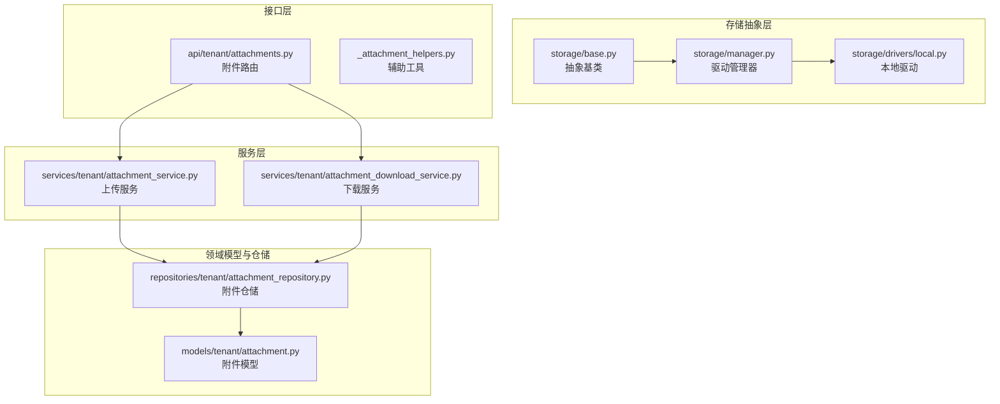
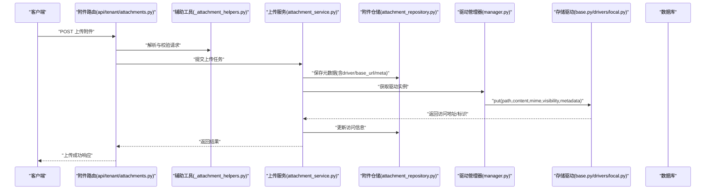
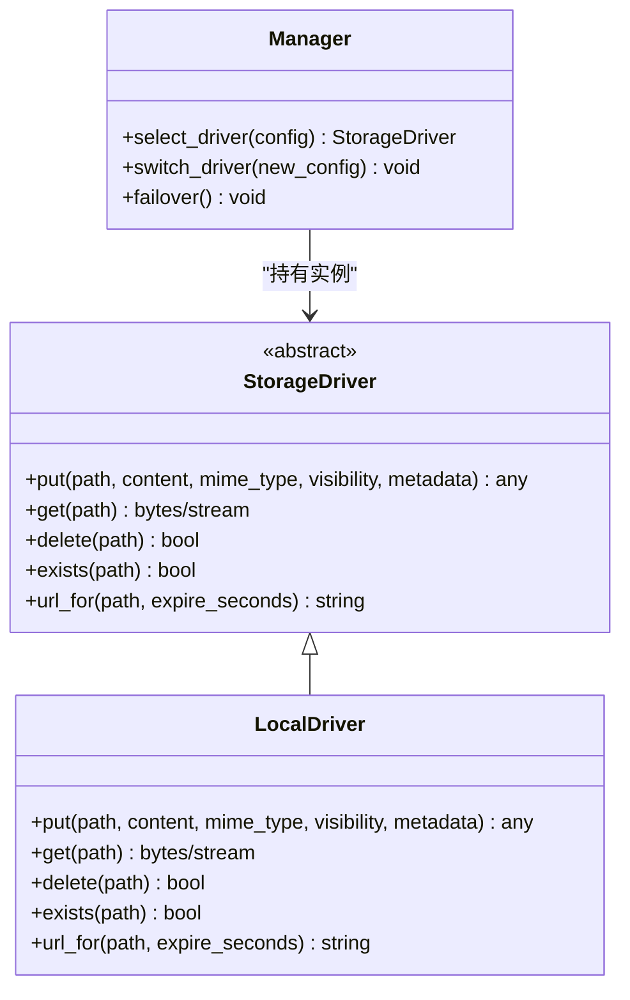
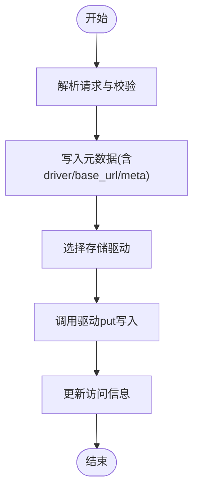
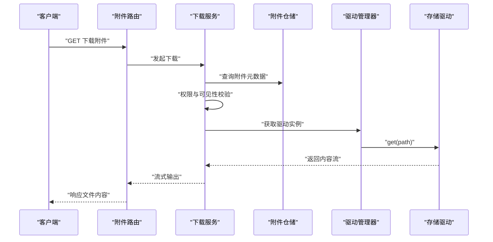
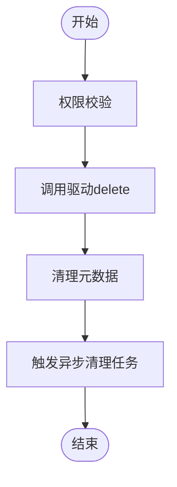
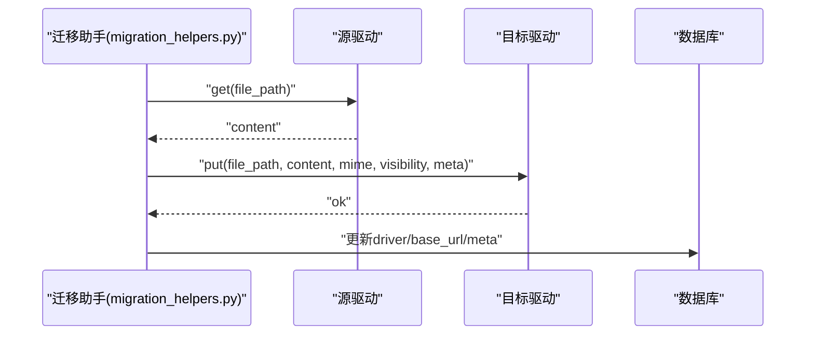
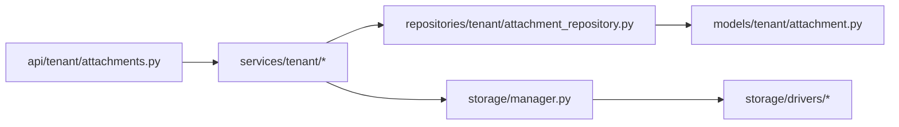

# 附件存储管理

<cite>
**本文引用的文件**
- [backend/app/storage/base.py](file://backend/app/storage/base.py)
- [backend/app/storage/manager.py](file://backend/app/storage/manager.py)
- [backend/app/storage/drivers/local.py](file://backend/app/storage/drivers/local.py)
- [backend/app/enums/attachment.py](file://backend/app/enums/attachment.py)
- [backend/app/models/tenant/attachment.py](file://backend/app/models/tenant/attachment.py)
- [backend/app/schemas/tenant/attachment.py](file://backend/app/schemas/tenant/attachment.py)
- [backend/app/repositories/tenant/attachment_repository.py](file://backend/app/repositories/tenant/attachment_repository.py)
- [backend/app/services/tenant/attachment_service.py](file://backend/app/services/tenant/attachment_service.py)
- [backend/app/services/tenant/attachment_download_service.py](file://backend/app/services/tenant/attachment_download_service.py)
- [backend/app/api/tenant/attachments.py](file://backend/app/api/tenant/attachments.py)
- [backend/app/api/shared/_attachment_helpers.py](file://backend/app/api/shared/_attachment_helpers.py)
- [backend/migrations/versions/20260124_0007_add_attachments_table.py](file://backend/migrations/versions/20260124_0007_add_attachments_table.py)
- [backend/migrations/versions/20260126_0008_add_base_url_to_attachments.py](file://backend/migrations/versions/20260126_0008_add_base_url_to_attachments.py)
- [backend/plugins/storage-migration/backend/services/migration_helpers.py](file://backend/plugins/storage-migration/backend/services/migration_helpers.py)
- [backend/tests/services/test_attachment_service.py](file://backend/tests/services/test_attachment_service.py)
</cite>

## 目录
1. [引言](#引言)
2. [项目结构](#项目结构)
3. [核心组件](#核心组件)
4. [架构总览](#架构总览)
5. [详细组件分析](#详细组件分析)
6. [依赖关系分析](#依赖关系分析)
7. [性能考量](#性能考量)
8. [故障排查指南](#故障排查指南)
9. [结论](#结论)
10. [附录](#附录)

## 引言
本文件面向NovusAI SaaS项目的附件存储管理子系统，系统性阐述存储驱动抽象层的设计与实现，覆盖本地存储与对象存储（如阿里云OSS、腾讯COS等）的统一接口；详解附件上传、下载、删除的全链路流程，包含文件校验、安全检查与元数据管理；说明多租户场景下的配额控制、访问权限与数据隔离机制；并给出存储驱动动态切换、故障转移与性能优化策略，以及附件预览、缩略图生成与批量处理的实现思路。文末提供具体代码示例路径，帮助开发者快速定位实现细节与扩展点。

## 项目结构
附件存储相关代码主要分布在以下模块：
- 存储抽象与驱动：storage包提供抽象基类与驱动管理器，drivers目录存放具体驱动实现
- 领域模型与仓储：models与repositories定义附件实体与持久化逻辑
- 服务层：services封装上传、下载、配额统计等业务能力
- 接口层：api路由负责对外暴露附件操作接口
- 迁移与测试：migrations定义数据库表结构，tests验证驱动选择与统计行为

图表来源
- [backend/app/storage/base.py](file://backend/app/storage/base.py)
- [backend/app/storage/manager.py](file://backend/app/storage/manager.py)
- [backend/app/storage/drivers/local.py](file://backend/app/storage/drivers/local.py)
- [backend/app/models/tenant/attachment.py](file://backend/app/models/tenant/attachment.py)
- [backend/app/repositories/tenant/attachment_repository.py](file://backend/app/repositories/tenant/attachment_repository.py)
- [backend/app/services/tenant/attachment_service.py](file://backend/app/services/tenant/attachment_service.py)
- [backend/app/services/tenant/attachment_download_service.py](file://backend/app/services/tenant/attachment_download_service.py)
- [backend/app/api/tenant/attachments.py](file://backend/app/api/tenant/attachments.py)
- [backend/app/api/shared/_attachment_helpers.py](file://backend/app/api/shared/_attachment_helpers.py)

章节来源
- [backend/app/storage/base.py](file://backend/app/storage/base.py)
- [backend/app/storage/manager.py](file://backend/app/storage/manager.py)
- [backend/app/storage/drivers/local.py](file://backend/app/storage/drivers/local.py)
- [backend/app/models/tenant/attachment.py](file://backend/app/models/tenant/attachment.py)
- [backend/app/repositories/tenant/attachment_repository.py](file://backend/app/repositories/tenant/attachment_repository.py)
- [backend/app/services/tenant/attachment_service.py](file://backend/app/services/tenant/attachment_service.py)
- [backend/app/services/tenant/attachment_download_service.py](file://backend/app/services/tenant/attachment_download_service.py)
- [backend/app/api/tenant/attachments.py](file://backend/app/api/tenant/attachments.py)
- [backend/app/api/shared/_attachment_helpers.py](file://backend/app/api/shared/_attachment_helpers.py)

## 核心组件
- 存储抽象基类：定义统一的驱动接口，包括上传、下载、删除、存在性检查等方法签名，确保不同驱动实现的一致性
- 驱动管理器：根据配置或运行时上下文选择具体驱动实例，支持动态切换与故障转移
- 本地驱动：基于文件系统实现的本地存储，适合开发与小规模部署
- 对象存储驱动：通过插件形式接入第三方对象存储（如阿里云OSS、腾讯COS等），统一接口以适配不同厂商
- 附件模型与仓储：定义附件元数据、可见性、驱动类型、基础URL等字段，并提供持久化与查询能力
- 上传/下载服务：封装上传与下载的业务流程，包含配额校验、安全检查、元数据写入与返回值构造
- 路由与辅助工具：对外暴露REST接口，提供通用的附件操作辅助函数

章节来源
- [backend/app/storage/base.py](file://backend/app/storage/base.py)
- [backend/app/storage/manager.py](file://backend/app/storage/manager.py)
- [backend/app/storage/drivers/local.py](file://backend/app/storage/drivers/local.py)
- [backend/app/enums/attachment.py](file://backend/app/enums/attachment.py)
- [backend/app/models/tenant/attachment.py](file://backend/app/models/tenant/attachment.py)
- [backend/app/repositories/tenant/attachment_repository.py](file://backend/app/repositories/tenant/attachment_repository.py)
- [backend/app/services/tenant/attachment_service.py](file://backend/app/services/tenant/attachment_service.py)
- [backend/app/services/tenant/attachment_download_service.py](file://backend/app/services/tenant/attachment_download_service.py)
- [backend/app/api/tenant/attachments.py](file://backend/app/api/tenant/attachments.py)
- [backend/app/api/shared/_attachment_helpers.py](file://backend/app/api/shared/_attachment_helpers.py)

## 架构总览
下图展示了从API到存储驱动的调用链路，以及多租户场景下的数据流与权限控制要点：

图表来源
- [backend/app/api/tenant/attachments.py](file://backend/app/api/tenant/attachments.py)
- [backend/app/api/shared/_attachment_helpers.py](file://backend/app/api/shared/_attachment_helpers.py)
- [backend/app/services/tenant/attachment_service.py](file://backend/app/services/tenant/attachment_service.py)
- [backend/app/repositories/tenant/attachment_repository.py](file://backend/app/repositories/tenant/attachment_repository.py)
- [backend/app/storage/manager.py](file://backend/app/storage/manager.py)
- [backend/app/storage/base.py](file://backend/app/storage/base.py)
- [backend/app/storage/drivers/local.py](file://backend/app/storage/drivers/local.py)

## 详细组件分析

### 存储驱动抽象层
- 抽象基类定义了统一的驱动接口，确保所有驱动实现具备一致的方法签名，便于替换与扩展
- 驱动管理器负责根据配置或上下文选择具体驱动实例，支持在运行时进行动态切换与故障转移
- 本地驱动提供文件系统级的实现，适合开发与小规模部署；对象存储驱动通过插件接入第三方厂商

图表来源
- [backend/app/storage/base.py](file://backend/app/storage/base.py)
- [backend/app/storage/manager.py](file://backend/app/storage/manager.py)
- [backend/app/storage/drivers/local.py](file://backend/app/storage/drivers/local.py)

章节来源
- [backend/app/storage/base.py](file://backend/app/storage/base.py)
- [backend/app/storage/manager.py](file://backend/app/storage/manager.py)
- [backend/app/storage/drivers/local.py](file://backend/app/storage/drivers/local.py)

### 附件上传流程
- 请求解析与校验：路由层解析请求参数，辅助工具执行文件类型、大小、命名等基础校验
- 元数据写入：上传服务先在数据库中写入附件元数据（包含驱动名、基础URL、可见性、自定义元数据）
- 写入存储：驱动管理器选择目标驱动，调用put方法完成实际写入
- 结果回写：根据驱动返回的访问信息更新数据库记录，最终返回给客户端

图表来源
- [backend/app/api/tenant/attachments.py](file://backend/app/api/tenant/attachments.py)
- [backend/app/api/shared/_attachment_helpers.py](file://backend/app/api/shared/_attachment_helpers.py)
- [backend/app/services/tenant/attachment_service.py](file://backend/app/services/tenant/attachment_service.py)
- [backend/app/repositories/tenant/attachment_repository.py](file://backend/app/repositories/tenant/attachment_repository.py)
- [backend/app/storage/manager.py](file://backend/app/storage/manager.py)

章节来源
- [backend/app/api/tenant/attachments.py](file://backend/app/api/tenant/attachments.py)
- [backend/app/api/shared/_attachment_helpers.py](file://backend/app/api/shared/_attachment_helpers.py)
- [backend/app/services/tenant/attachment_service.py](file://backend/app/services/tenant/attachment_service.py)
- [backend/app/repositories/tenant/attachment_repository.py](file://backend/app/repositories/tenant/attachment_repository.py)

### 附件下载流程
- 权限与可见性检查：根据附件可见性与当前租户/用户权限决定是否允许访问
- 驱动读取：通过驱动管理器选择对应驱动，调用get方法读取文件内容
- 流式输出：将文件内容以流式方式返回，避免大文件内存占用
- 访问日志：记录下载事件用于审计与统计

图表来源
- [backend/app/api/tenant/attachments.py](file://backend/app/api/tenant/attachments.py)
- [backend/app/services/tenant/attachment_download_service.py](file://backend/app/services/tenant/attachment_download_service.py)
- [backend/app/repositories/tenant/attachment_repository.py](file://backend/app/repositories/tenant/attachment_repository.py)
- [backend/app/storage/manager.py](file://backend/app/storage/manager.py)
- [backend/app/storage/base.py](file://backend/app/storage/base.py)

章节来源
- [backend/app/api/tenant/attachments.py](file://backend/app/api/tenant/attachments.py)
- [backend/app/services/tenant/attachment_download_service.py](file://backend/app/services/tenant/attachment_download_service.py)
- [backend/app/repositories/tenant/attachment_repository.py](file://backend/app/repositories/tenant/attachment_repository.py)

### 附件删除流程
- 权限校验：确认删除操作的合法性（附件归属、角色权限）
- 驱动删除：调用驱动delete方法删除对象存储中的文件
- 元数据清理：删除数据库中的附件记录，或标记软删除
- 同步清理：触发异步任务清理缓存、索引与衍生资源（如缩略图）

图表来源
- [backend/app/services/tenant/attachment_service.py](file://backend/app/services/tenant/attachment_service.py)
- [backend/app/storage/base.py](file://backend/app/storage/base.py)
- [backend/app/repositories/tenant/attachment_repository.py](file://backend/app/repositories/tenant/attachment_repository.py)

章节来源
- [backend/app/services/tenant/attachment_service.py](file://backend/app/services/tenant/attachment_service.py)
- [backend/app/storage/base.py](file://backend/app/storage/base.py)
- [backend/app/repositories/tenant/attachment_repository.py](file://backend/app/repositories/tenant/attachment_repository.py)

### 多租户配额控制、访问权限与数据隔离
- 配额控制：上传服务在写入前进行配额校验，结合租户维度限制总量与单文件大小
- 访问权限：下载与删除接口均包含权限校验，确保仅附件归属者或授权角色可访问
- 数据隔离：附件记录包含租户字段，查询与操作默认按租户边界隔离；迁移与同步逻辑亦遵循此约束
- 可见性策略：通过可见性枚举控制公开/私有访问范围，配合中间件实现统一鉴权

章节来源
- [backend/app/enums/attachment.py](file://backend/app/enums/attachment.py)
- [backend/app/models/tenant/attachment.py](file://backend/app/models/tenant/attachment.py)
- [backend/app/services/tenant/attachment_service.py](file://backend/app/services/tenant/attachment_service.py)
- [backend/app/services/tenant/attachment_download_service.py](file://backend/app/services/tenant/attachment_download_service.py)
- [backend/migrations/versions/20260124_0007_add_attachments_table.py](file://backend/migrations/versions/20260124_0007_add_attachments_table.py)
- [backend/migrations/versions/20260224_allow_null_attachment_tenant_id.py](file://backend/migrations/versions/20260224_allow_null_attachment_tenant_id.py)

### 存储驱动动态切换、故障转移与性能优化
- 动态切换：驱动管理器支持根据配置或上下文选择不同驱动；迁移插件演示了在运行时切换驱动并迁移数据的流程
- 故障转移：当主驱动不可用时，可自动切换至备用驱动；建议在驱动层实现重试与降级策略
- 性能优化：采用流式读写、分块传输、连接池复用；对大文件启用断点续传与并发分片上传

图表来源
- [backend/plugins/storage-migration/backend/services/migration_helpers.py](file://backend/plugins/storage-migration/backend/services/migration_helpers.py)

章节来源
- [backend/plugins/storage-migration/backend/services/migration_helpers.py](file://backend/plugins/storage-migration/backend/services/migration_helpers.py)

### 附件预览、缩略图生成与批量处理
- 预览：根据文件类型与可见性返回可预览的URL或内嵌资源
- 缩略图：在上传后异步生成多尺寸缩略图，存储于同一驱动下，命名规范与元数据关联
- 批量处理：提供批量上传、批量删除与批量迁移接口，结合队列实现异步处理

章节来源
- [backend/app/services/tenant/attachment_service.py](file://backend/app/services/tenant/attachment_service.py)
- [backend/app/api/tenant/attachments.py](file://backend/app/api/tenant/attachments.py)

## 依赖关系分析
- 组件耦合：API层依赖服务层；服务层依赖仓储层与驱动管理器；驱动管理器依赖具体驱动实现
- 外部依赖：对象存储驱动依赖第三方SDK；本地驱动依赖文件系统
- 循环依赖：当前结构未发现循环依赖，职责清晰

图表来源
- [backend/app/api/tenant/attachments.py](file://backend/app/api/tenant/attachments.py)
- [backend/app/services/tenant/attachment_service.py](file://backend/app/services/tenant/attachment_service.py)
- [backend/app/services/tenant/attachment_download_service.py](file://backend/app/services/tenant/attachment_download_service.py)
- [backend/app/repositories/tenant/attachment_repository.py](file://backend/app/repositories/tenant/attachment_repository.py)
- [backend/app/storage/manager.py](file://backend/app/storage/manager.py)
- [backend/app/storage/drivers/local.py](file://backend/app/storage/drivers/local.py)
- [backend/app/models/tenant/attachment.py](file://backend/app/models/tenant/attachment.py)

章节来源
- [backend/app/api/tenant/attachments.py](file://backend/app/api/tenant/attachments.py)
- [backend/app/services/tenant/attachment_service.py](file://backend/app/services/tenant/attachment_service.py)
- [backend/app/services/tenant/attachment_download_service.py](file://backend/app/services/tenant/attachment_download_service.py)
- [backend/app/repositories/tenant/attachment_repository.py](file://backend/app/repositories/tenant/attachment_repository.py)
- [backend/app/storage/manager.py](file://backend/app/storage/manager.py)
- [backend/app/storage/drivers/local.py](file://backend/app/storage/drivers/local.py)
- [backend/app/models/tenant/attachment.py](file://backend/app/models/tenant/attachment.py)

## 性能考量
- I/O优化：优先使用流式读写，避免一次性加载大文件至内存
- 并发与分片：对大文件采用分片上传与并发写入，提升吞吐
- 缓存策略：对频繁访问的小文件与缩略图引入缓存层，降低存储压力
- 连接池：复用驱动连接，减少握手开销
- 压缩与编码：根据文件类型选择合适的压缩与编码策略，平衡带宽与CPU

## 故障排查指南
- 上传失败：检查驱动可用性、配额限制与权限；查看服务层异常日志
- 下载异常：确认可见性设置与权限校验；核对驱动URL有效性
- 删除问题：验证软/硬删除策略；检查异步清理任务状态
- 迁移中断：核对源/目标驱动配置与网络连通性；重试失败批次

章节来源
- [backend/app/services/tenant/attachment_service.py](file://backend/app/services/tenant/attachment_service.py)
- [backend/app/services/tenant/attachment_download_service.py](file://backend/app/services/tenant/attachment_download_service.py)
- [backend/plugins/storage-migration/backend/services/migration_helpers.py](file://backend/plugins/storage-migration/backend/services/migration_helpers.py)

## 结论
附件存储管理子系统通过抽象驱动层实现了本地与对象存储的统一接口，结合多租户的配额与权限控制，提供了稳定、可扩展的存储能力。通过动态切换与故障转移机制，系统在可靠性与性能上具备良好弹性。建议在生产环境中进一步完善监控告警、缓存策略与异步批处理能力，以支撑更大规模的附件管理需求。

## 附录

### 数据模型与迁移
- 附件表结构：包含附件标识、文件名、MIME类型、大小、可见性、驱动名、基础URL、自定义元数据、租户字段等
- 迁移脚本：提供附件表创建与基础URL字段添加的迁移逻辑

章节来源
- [backend/migrations/versions/20260124_0007_add_attachments_table.py](file://backend/migrations/versions/20260124_0007_add_attachments_table.py)
- [backend/migrations/versions/20260126_0008_add_base_url_to_attachments.py](file://backend/migrations/versions/20260126_0008_add_base_url_to_attachments.py)

### 驱动选择与统计测试
- 驱动选择：测试覆盖本地与对象存储驱动的选择逻辑
- 统计功能：测试覆盖存储统计（总数与总大小）的行为

章节来源
- [backend/tests/services/test_attachment_service.py](file://backend/tests/services/test_attachment_service.py)