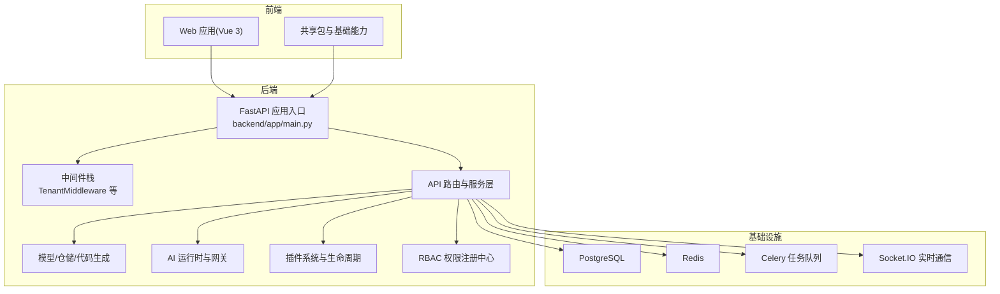
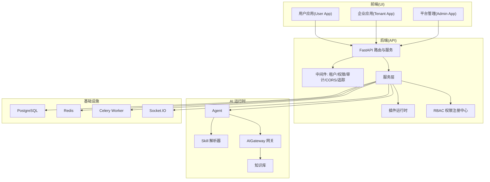
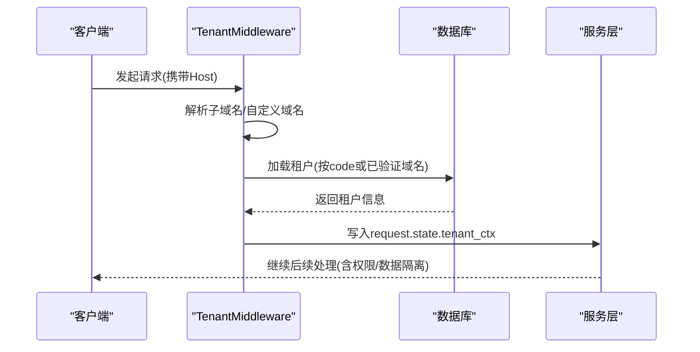
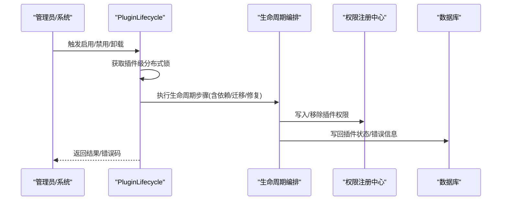
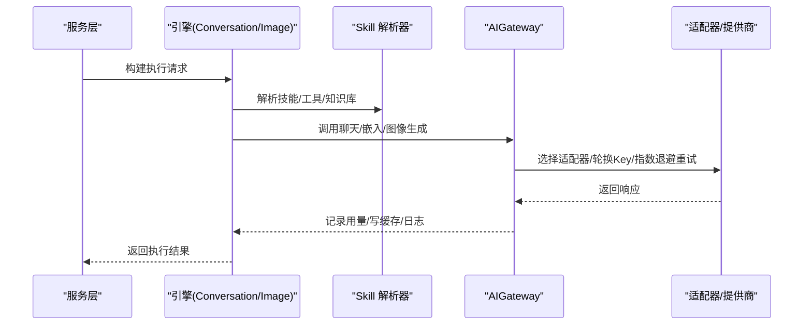
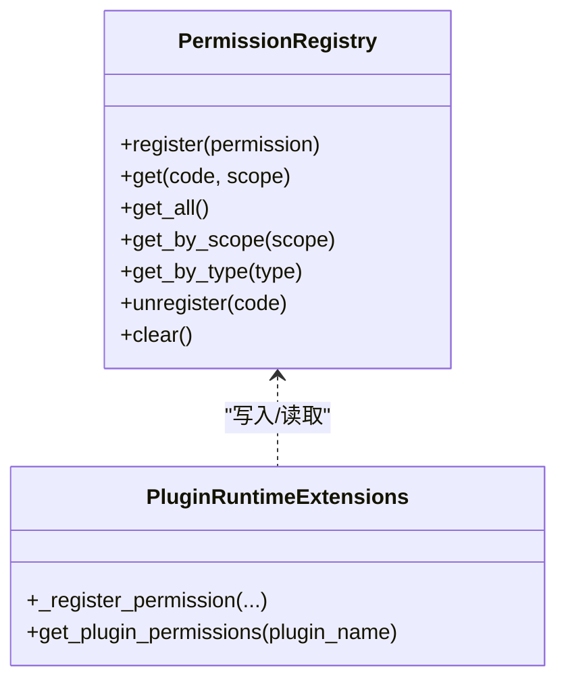
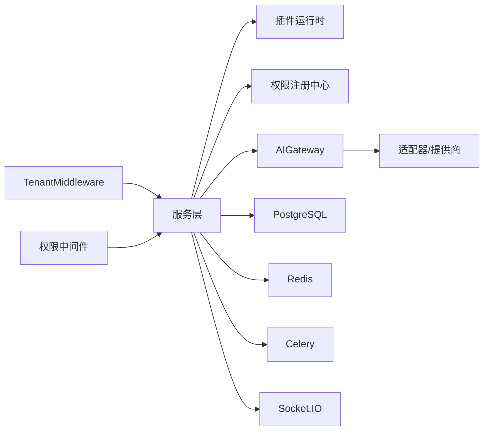

# 项目概述

<cite>
**本文引用的文件**
- [README.md](file://README.md)
- [README.en-US.md](file://README.en-US.md)
- [backend/app/main.py](file://backend/app/main.py)
- [backend/app/middleware/tenant.py](file://backend/app/middleware/tenant.py)
- [backend/app/plugins/lifecycle.py](file://backend/app/plugins/lifecycle.py)
- [backend/app/plugins/registry_runtime_extensions.py](file://backend/app/plugins/registry_runtime_extensions.py)
- [backend/app/rbac/registry.py](file://backend/app/rbac/registry.py)
- [backend/app/ai/gateway.py](file://backend/app/ai/gateway.py)
- [backend/app/ai/engine/base.py](file://backend/app/ai/engine/base.py)
- [backend/app/ai/engine/engine_bootstrap_support.py](file://backend/app/ai/engine/engine_bootstrap_support.py)
- [backend/app/ai/skills/resolver.py](file://backend/app/ai/skills/resolver.py)
- [backend/app/models/tenant/__init__.py](file://backend/app/models/tenant/__init__.py)
- [backend/app/models/system/plugin.py](file://backend/app/models/system/plugin.py)
</cite>

## 目录
1. [引言](#引言)
2. [项目结构](#项目结构)
3. [核心组件](#核心组件)
4. [架构总览](#架构总览)
5. [详细组件分析](#详细组件分析)
6. [依赖关系分析](#依赖关系分析)
7. [性能考虑](#性能考虑)
8. [故障排查指南](#故障排查指南)
9. [结论](#结论)
10. [附录](#附录)

## 引言
NovusAI SaaS 是一个面向二次开发的多租户 AI 原生 SaaS 开发框架，旨在为企业级产品、行业应用与 AI 原生业务系统提供工程化底座。其核心价值在于：
- 以“平台管理端、企业端、用户端”三表面向分离的多表面架构，配合严格的多租户隔离与权限体系，支撑复杂 SaaS 场景。
- 提供可扩展的 AI Agent 运行链路（Agent → Skill → AIGateway），支持模型、技能、知识库与工具调用的灵活组合。
- 通过插件系统实现功能解耦与生态扩展，结合生命周期管理、依赖治理与权限注册，保障运行时一致性与安全性。
- 集成实时通知、异步任务、附件与存储、CRUD 代码生成与数据库迁移，形成从开发到运维的一体化能力。

项目定位明确：既适合快速搭建 SaaS 产品原型，也适合在生产环境中进行深度定制与规模化演进。

## 项目结构
仓库采用前后端分离与模块化组织，后端以 FastAPI 为核心，围绕“API、服务、模型、仓储、AI、RBAC、任务、存储、插件”等子系统构建；前端采用 Vue 3 + Vite 的 monorepo 结构，提供多套应用与共享包。

图示来源
- [backend/app/main.py:635-800](file://backend/app/main.py#L635-L800)
- [backend/app/middleware/tenant.py:93-222](file://backend/app/middleware/tenant.py#L93-L222)

章节来源
- [README.md:99-119](file://README.md#L99-L119)
- [README.en-US.md:13-29](file://README.en-US.md#L13-L29)

## 核心组件
- 多租户与域名解析：通过 TenantMiddleware 基于 Host 头解析子域名或自定义域名，加载租户上下文，贯穿权限与数据隔离。
- 权限体系：PermissionRegistry 收集装饰器声明的权限，启动时同步至数据库，插件运行时通过注册表查询与菜单/操作权限桥接。
- 插件系统：PluginLifecycle 提供安装、启用、禁用、卸载的生命周期管理，内置分布式锁与依赖治理，确保多实例一致性。
- AI 运行时：AIGateway 提供统一调用门面，封装适配器、重试/轮换、用量统计与日志桥接，引擎层抽象 Agent → Skill → AIGateway 的执行链路。
- 实时与任务：Socket.IO 支持通知与事件，Celery + Redis 处理后台任务与定时作业。
- 附件与存储：可插拔的存储驱动与下载扩展，结合配置服务与插件生态实现多云/本地存储。

章节来源
- [backend/app/middleware/tenant.py:23-50](file://backend/app/middleware/tenant.py#L23-L50)
- [backend/app/rbac/registry.py:15-146](file://backend/app/rbac/registry.py#L15-L146)
- [backend/app/plugins/lifecycle.py:108-130](file://backend/app/plugins/lifecycle.py#L108-L130)
- [backend/app/ai/gateway.py:59-87](file://backend/app/ai/gateway.py#L59-L87)
- [backend/app/ai/engine/base.py:42-81](file://backend/app/ai/engine/base.py#L42-L81)

## 架构总览
下图展示从前端到后端、再到 AI 运行时与基础设施的整体架构，体现多表面、多租户、插件化与 AI 原生能力的协同。

图示来源
- [README.md:46-87](file://README.md#L46-L87)
- [backend/app/main.py:635-800](file://backend/app/main.py#L635-L800)
- [backend/app/ai/gateway.py:59-87](file://backend/app/ai/gateway.py#L59-L87)

## 详细组件分析

### 多租户与租户上下文
- 设计理念：通过 Host 头识别租户，支持子域名与自定义域名两种模式；仅对特定路径前缀进行租户解析，降低无关请求开销。
- 数据访问隔离：解析到的租户上下文贯穿中间件与服务层，用于权限判定与数据过滤。
- 健壮性：对平台管理域名与非租户路径进行排除，避免误判；自定义域名解析依赖已验证的租户域名表。

图示来源
- [backend/app/middleware/tenant.py:120-164](file://backend/app/middleware/tenant.py#L120-L164)
- [backend/app/middleware/tenant.py:166-222](file://backend/app/middleware/tenant.py#L166-L222)

章节来源
- [backend/app/middleware/tenant.py:52-91](file://backend/app/middleware/tenant.py#L52-L91)
- [backend/app/models/tenant/__init__.py:8-31](file://backend/app/models/tenant/__init__.py#L8-L31)

### 插件生命周期与权限注册
- 生命周期管理：PluginLifecycle 以分布式锁保证同一插件的并发安全，编排安装、启用、依赖安装、迁移、修复与卸载等步骤。
- 权限注册：插件在运行时将声明的权限写入内存注册表，供 RBAC 中间件查询；同时支持菜单权限桥接与标题国际化。
- 启动期同步：应用启动时通过分布式锁同步权限与配置，避免多实例并发冲突。

图示来源
- [backend/app/plugins/lifecycle.py:235-244](file://backend/app/plugins/lifecycle.py#L235-L244)
- [backend/app/plugins/lifecycle.py:56-91](file://backend/app/plugins/lifecycle.py#L56-L91)
- [backend/app/plugins/registry_runtime_extensions.py:317-375](file://backend/app/plugins/registry_runtime_extensions.py#L317-L375)
- [backend/app/main.py:120-166](file://backend/app/main.py#L120-L166)

章节来源
- [backend/app/plugins/lifecycle.py:108-130](file://backend/app/plugins/lifecycle.py#L108-L130)
- [backend/app/plugins/registry_runtime_extensions.py:458-486](file://backend/app/plugins/registry_runtime_extensions.py#L458-L486)
- [backend/app/rbac/registry.py:36-74](file://backend/app/rbac/registry.py#L36-L74)

### AI 运行时与网关
- 统一门面：AIGateway 封装聊天、嵌入、图像生成与模型测试，内置重试/轮换、用量统计与日志桥接。
- 执行链路：引擎层抽象 Agent → Skill → AIGateway 的调用序列，支持工具调用循环与路由决策。
- 能力装配：根据模型类型与请求特征选择合适的引擎工厂，组装网关与引擎，避免重复的转调逻辑。

图示来源
- [backend/app/ai/gateway.py:88-176](file://backend/app/ai/gateway.py#L88-L176)
- [backend/app/ai/engine/base.py:66-81](file://backend/app/ai/engine/base.py#L66-L81)
- [backend/app/ai/engine/engine_bootstrap_support.py:150-184](file://backend/app/ai/engine/engine_bootstrap_support.py#L150-L184)
- [backend/app/ai/skills/resolver.py:924-963](file://backend/app/ai/skills/resolver.py#L924-L963)

章节来源
- [backend/app/ai/gateway.py:59-87](file://backend/app/ai/gateway.py#L59-L87)
- [backend/app/ai/engine/base_execution_support.py:110-138](file://backend/app/ai/engine/base_execution_support.py#L110-L138)

### 权限注册中心与中间件
- 权限注册：PermissionRegistry 以“code:scope”为键聚合权限，支持按作用域/类型查询与动态注销。
- 运行时查询：插件在启用时将菜单/权限桥接为 PermissionMeta，供权限中间件在请求阶段快速判定。
- 启动同步：应用启动时通过分布式锁同步权限与配置，避免并发写入冲突。

图示来源
- [backend/app/rbac/registry.py:15-146](file://backend/app/rbac/registry.py#L15-L146)
- [backend/app/plugins/registry_runtime_extensions.py:317-375](file://backend/app/plugins/registry_runtime_extensions.py#L317-L375)

章节来源
- [backend/app/rbac/registry.py:36-74](file://backend/app/rbac/registry.py#L36-L74)
- [backend/app/plugins/registry_runtime_extensions.py:458-486](file://backend/app/plugins/registry_runtime_extensions.py#L458-L486)

## 依赖关系分析
- 组件耦合：中间件层对租户解析与权限预加载强依赖；服务层对插件运行时与权限注册中心存在运行时耦合；AI 网关对适配器、重试与用量记录存在跨模块协作。
- 外部依赖：PostgreSQL 与 Redis 为关键基础设施；Celery 与 Socket.IO 用于任务与实时通信；插件系统依赖 Python 包管理与分布式锁。
- 生命周期依赖：插件启用/修复/卸载涉及依赖安装、迁移与状态写回，需严格顺序与锁保护。

图示来源
- [backend/app/main.py:635-800](file://backend/app/main.py#L635-L800)
- [backend/app/plugins/lifecycle.py:235-244](file://backend/app/plugins/lifecycle.py#L235-L244)
- [backend/app/ai/gateway.py:59-87](file://backend/app/ai/gateway.py#L59-L87)

章节来源
- [backend/app/plugins/lifecycle.py:56-91](file://backend/app/plugins/lifecycle.py#L56-L91)
- [backend/app/models/system/plugin.py:14-76](file://backend/app/models/system/plugin.py#L14-L76)

## 性能考虑
- 启动阶段优化：通过分布式锁避免多实例并发同步权限/配置；早期初始化 Redis 以支持后续分布式锁与健康检查。
- AI 调用链路：缓存命中优先、限流与配额前置检查、指数退避重试与 Key 轮换，减少超时与失败重试成本。
- 插件生命周期：对长耗时流程（如依赖安装/迁移）设置较长 TTL，避免锁过早释放引发并发问题。
- 数据访问：租户解析仅对特定路径生效，减少不必要的数据库查询；权限注册中心内存化，查询 O(1)。

## 故障排查指南
- 启动失败：检查数据库初始化与连接、Redis 初始化、插件发现与恢复、权限/配置同步是否成功；关注启动日志中的异常堆栈。
- 权限问题：确认权限是否在启动时同步成功；检查插件启用后是否正确注册权限；核对权限中间件是否在审计中间件之前注册。
- 插件异常：查看插件错误计数与错误信息字段；确认生命周期锁是否被占用；必要时执行修复流程。
- AI 调用异常：检查 AIGateway 的重试/轮换策略与用量记录；核对提供商配置与模型路由；关注缓存与日志桥接状态。
- 多租户解析：确认 Host 头是否正确；核对子域名/自定义域名规则与已验证域名表；检查租户状态与删除标记。

章节来源
- [backend/app/main.py:476-486](file://backend/app/main.py#L476-L486)
- [backend/app/plugins/lifecycle.py:373-387](file://backend/app/plugins/lifecycle.py#L373-L387)
- [backend/app/ai/gateway.py:88-176](file://backend/app/ai/gateway.py#L88-L176)
- [backend/app/middleware/tenant.py:166-222](file://backend/app/middleware/tenant.py#L166-L222)

## 结论
NovusAI SaaS 以多租户与多表面架构为基础，结合插件化与 AI 原生能力，提供了从开发到生产的完整工程化支撑。其设计强调：
- 可靠性：分布式锁、健康检查与重试/轮换机制。
- 可扩展性：插件生命周期与权限注册中心的解耦设计。
- 可维护性：统一的 AI 网关与引擎抽象，清晰的调用链路与可观测性。

对于初学者，建议从多租户与权限体系入手，理解租户上下文与权限注册流程；对于资深开发者，可深入插件生命周期与 AI 运行时的实现细节，结合实际业务场景进行定制与扩展。

## 附录
- 快速开始与环境要求：详见项目自述文件中的“快速开始”与“环境要求”章节。
- 技术栈与仓库结构：后端采用 Python 3.10+、FastAPI、SQLAlchemy 2.x、Alembic、Pydantic、Celery、Socket.IO；前端采用 Vue 3、TypeScript、Vben Admin、Ant Design Vue、Vite、pnpm、vue-i18n。
- 部署参考：提供 Docker Compose 开发与生产编排参考文件，建议在生产环境完善 HTTPS、CORS、可信域名与安全响应头配置。

章节来源
- [README.md:121-129](file://README.md#L121-L129)
- [README.md:130-186](file://README.md#L130-L186)
- [README.md:188-256](file://README.md#L188-L256)
- [README.md:89-98](file://README.md#L89-L98)
- [README.md:99-119](file://README.md#L99-L119)