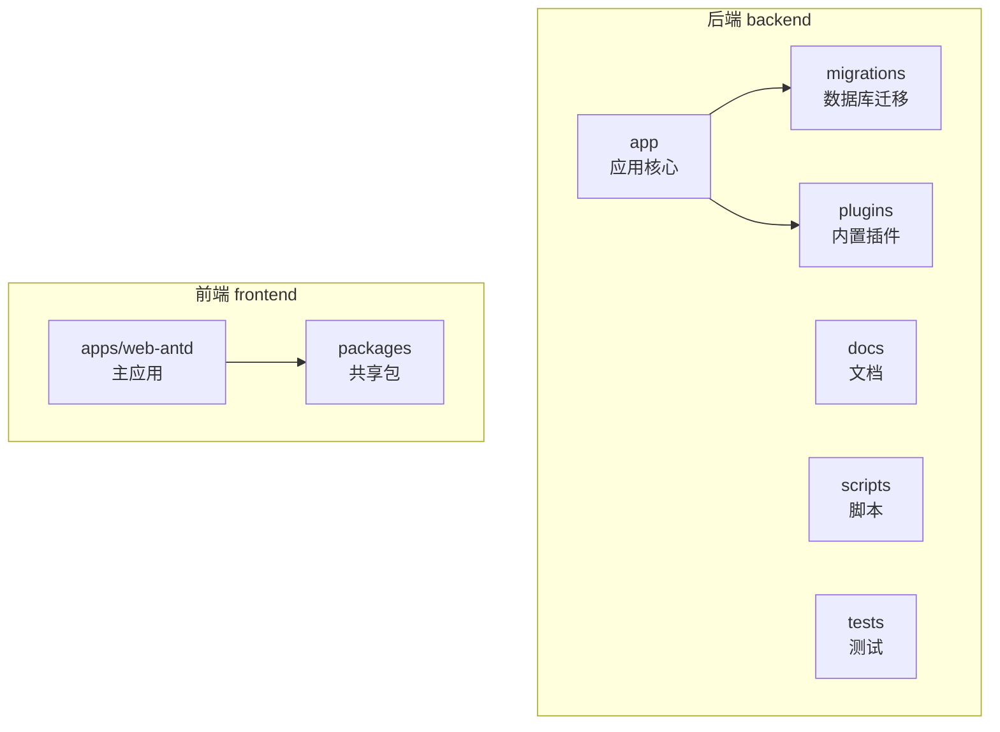
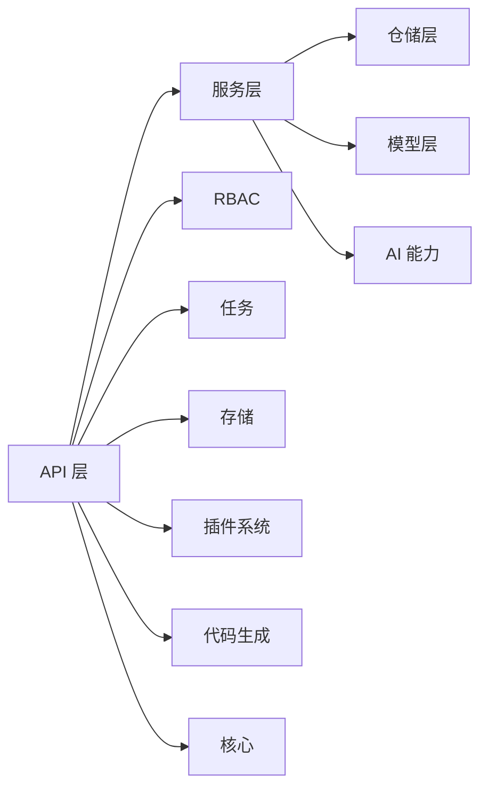
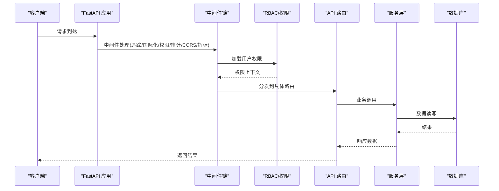
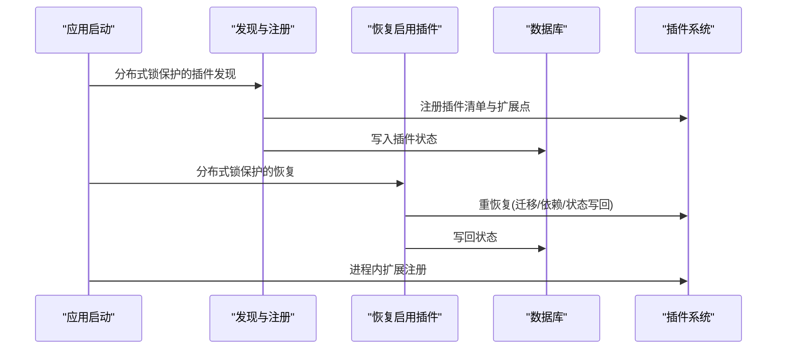
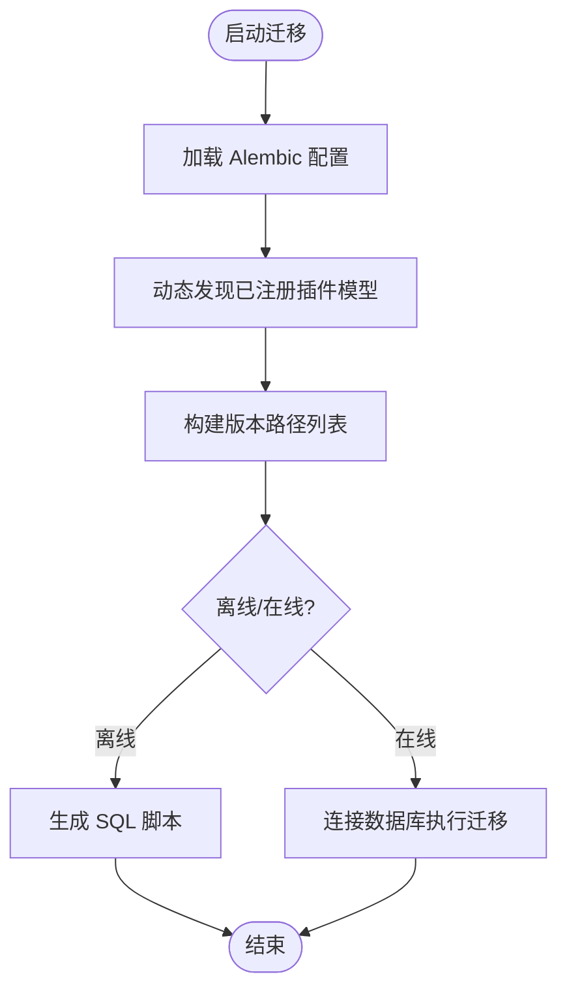
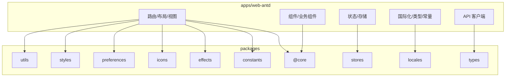
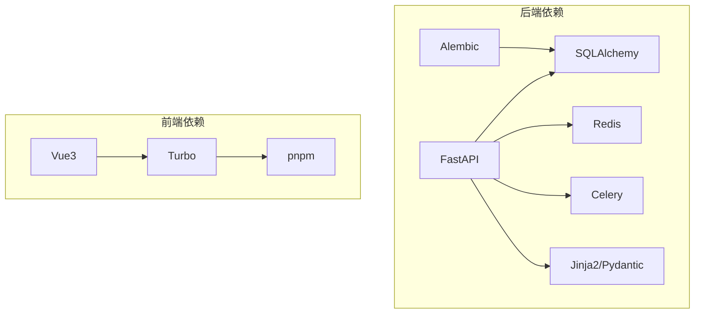

# 项目结构

<cite>
**本文引用的文件**
- [backend/app/main.py](file://backend/app/main.py)
- [backend/pyproject.toml](file://backend/pyproject.toml)
- [backend/migrations/env.py](file://backend/migrations/env.py)
- [backend/alembic.ini](file://backend/alembic.ini)
- [frontend/package.json](file://frontend/package.json)
- [backend/app/api/admin/agents.py](file://backend/app/api/admin/agents.py)
- [backend/app/api/tenant/agents.py](file://backend/app/api/tenant/agents.py)
- [backend/app/api/public/health.py](file://backend/app/api/public/health.py)
- [backend/app/models/ai/agent.py](file://backend/app/models/ai/agent.py)
- [backend/app/services/ai/agent_service.py](file://backend/app/services/ai/agent_service.py)
- [backend/app/repositories/ai/agent_repository.py](file://backend/app/repositories/ai/agent_repository.py)
- [backend/app/plugins/startup.py](file://backend/app/plugins/startup.py)
- [backend/app/plugins/lifecycle.py](file://backend/app/plugins/lifecycle.py)
- [backend/app/plugins/manifest.py](file://backend/app/plugins/manifest.py)
- [backend/plugins/novusdoc/backend/main.py](file://backend/plugins/novusdoc/backend/main.py)
- [backend/plugins/slider-captcha/backend/main.py](file://backend/plugins/slider-captcha/backend/main.py)
- [backend/plugins/weather-widget/backend/main.py](file://backend/plugins/weather-widget/backend/main.py)
- [backend/plugins/aliyun-oss/backend/main.py](file://backend/plugins/aliyun-oss/backend/main.py)
- [backend/plugins/amazon-s3/backend/main.py](file://backend/plugins/amazon-s3/backend/main.py)
- [backend/plugins/qiniu-kodo/backend/main.py](file://backend/plugins/qiniu-kodo/backend/main.py)
- [backend/plugins/tencent-cos/backend/main.py](file://backend/plugins/tencent-cos/backend/main.py)
- [backend/plugins/storage-billing/backend/main.py](file://backend/plugins/storage-billing/backend/main.py)
- [backend/plugins/storage-migration/backend/main.py](file://backend/plugins/storage-migration/backend/main.py)
- [frontend/apps/web-antd/src/router/access.ts](file://frontend/apps/web-antd/src/router/access.ts)
- [frontend/apps/web-antd/src/bootstrap.ts](file://frontend/apps/web-antd/src/bootstrap.ts)
- [frontend/apps/web-antd/src/main.ts](file://frontend/apps/web-antd/src/main.ts)
- [frontend/apps/web-antd/package.json](file://frontend/apps/web-antd/package.json)
- [frontend/packages/@core/package.json](file://frontend/packages/@core/package.json)
- [frontend/packages/constants/package.json](file://frontend/packages/constants/package.json)
- [frontend/packages/utils/package.json](file://frontend/packages/utils/package.json)
- [frontend/packages/stores/package.json](file://frontend/packages/stores/package.json)
- [frontend/packages/icons/package.json](file://frontend/packages/icons/package.json)
- [frontend/packages/styles/package.json](file://frontend/packages/styles/package.json)
- [frontend/packages/types/package.json](file://frontend/packages/types/package.json)
- [frontend/packages/preferences/package.json](file://frontend/packages/preferences/package.json)
- [frontend/packages/effects/package.json](file://frontend/packages/effects/package.json)
- [frontend/packages/locales/package.json](file://frontend/packages/locales/package.json)
</cite>

## 目录
1. [简介](#简介)
2. [项目结构总览](#项目结构总览)
3. [核心模块与职责划分](#核心模块与职责划分)
4. [架构概览](#架构概览)
5. [详细模块分析](#详细模块分析)
6. [依赖关系分析](#依赖关系分析)
7. [性能考量](#性能考量)
8. [故障排查指南](#故障排查指南)
9. [结论](#结论)
10. [附录](#附录)

## 简介
本文件面向 NovusAI SaaS 项目的贡献者与使用者，系统梳理后端 backend 与前端 frontend 的目录结构与组织原则，重点说明：
- 后端 app 子目录下 API、服务、模型、仓储、AI、RBAC、任务、存储、插件、代码生成等模块的职责边界与协作方式
- migrations 目录的数据库迁移管理机制与版本化策略
- plugins 目录内置插件与示例插件的结构与扩展点
- 前端 pnpm monorepo 架构中 apps/web-antd 主应用与 packages 共享包的设计理念
- business、customer、extensions 等扩展目录的用途与组织原则
- docs、scripts、tests 等辅助目录的功能定位
- 各目录的最佳实践与开发约定，帮助快速理解与高效协作

## 项目结构总览
项目采用前后端分离的多模块布局：
- backend：Python/FastAPI 后端，包含应用核心、API 层、模型、服务、仓储、AI 能力、RBAC、任务调度、存储、插件系统、代码生成与数据库迁移
- frontend：TypeScript/Vue3 前端，采用 pnpm monorepo，apps/web-antd 为主应用，packages 下为共享包
- plugins：内置插件集合，覆盖存储、验证码、天气小部件、文档能力等
- docs、scripts、tests：文档、脚本与测试辅助目录

**章节来源**
- [backend/app/main.py:635-800](file://backend/app/main.py#L635-L800)
- [backend/pyproject.toml:1-239](file://backend/pyproject.toml#L1-L239)
- [frontend/package.json:1-127](file://frontend/package.json#L1-L127)

## 核心模块与职责划分
后端 app 子目录遵循“分层+领域”的混合架构：
- API 层：按角色与功能域划分 admin/tenant/user/public/shared 等子包，统一暴露 REST 接口
- 服务层：封装业务逻辑，协调模型、仓储与外部能力
- 模型层：ORM 映射，定义数据结构与关系
- 仓储层：数据访问抽象，隔离持久化细节
- AI 能力：适配器、网关、路由、RAG、技能、工具、上下文、运行时等
- RBAC：权限注册、同步、装饰器、菜单与权限映射
- 任务：定时任务、异步任务、通知与回收站清理
- 存储：驱动抽象、管理器与多云存储适配
- 插件：生命周期、清单、资产、事件总线、市场等
- 代码生成：模板、类型注册、迁移助手、回滚等
- 核心：基础控制器、模型、仓库、配置、依赖注入、日志、安全等

**章节来源**
- [backend/app/api/admin/agents.py](file://backend/app/api/admin/agents.py)
- [backend/app/api/tenant/agents.py](file://backend/app/api/tenant/agents.py)
- [backend/app/api/public/health.py](file://backend/app/api/public/health.py)
- [backend/app/models/ai/agent.py](file://backend/app/models/ai/agent.py)
- [backend/app/services/ai/agent_service.py](file://backend/app/services/ai/agent_service.py)
- [backend/app/repositories/ai/agent_repository.py](file://backend/app/repositories/ai/agent_repository.py)

## 架构概览
后端以 FastAPI 为核心，通过中间件链路实现国际化、权限、审计、追踪、CORS、指标与就绪探针等横切能力；应用生命周期负责数据库初始化、Redis 初始化、权限与配置同步、插件发现与恢复、通知模板种子数据等。

**图表来源**
- [backend/app/main.py:635-800](file://backend/app/main.py#L635-L800)

**章节来源**
- [backend/app/main.py:53-120](file://backend/app/main.py#L53-L120)
- [backend/app/main.py:273-449](file://backend/app/main.py#L273-L449)

## 详细模块分析

### 后端 app/API 层
- admin：平台级管理接口，如代理、AI 管理、租户管理、插件管理、系统日志等
- tenant：租户域接口，如租户代理聊天、知识库、附件、域与计划等
- user：用户域接口，如用户代理聊天、权限查询等
- public：公开接口，如健康检查、平台信息、验证码等
- shared：跨域共享逻辑，如代理聊天辅助、富文本 AI 操作、插件槽位过滤等

最佳实践：
- 路由按域划分，避免交叉耦合
- 使用共享模块沉淀通用逻辑，减少重复
- 对敏感操作使用装饰器与中间件双重防护

**章节来源**
- [backend/app/api/admin/agents.py](file://backend/app/api/admin/agents.py)
- [backend/app/api/tenant/agents.py](file://backend/app/api/tenant/agents.py)
- [backend/app/api/public/health.py](file://backend/app/api/public/health.py)
- [backend/app/api/shared/_agent_chat_helpers.py](file://backend/app/api/shared/_agent_chat_helpers.py)

### 后端 app/服务层
- ai：代理聊天、对话历史、知识库、技能、模型、配额、用量统计、监控等
- common/system/tenant：通用认证、邮件、通知、附件、任务定义与运行、SSL 证书等

最佳实践：
- 服务方法单一职责，必要时拆分为 parts 或 support 模块
- 与仓储解耦，通过服务聚合业务规则
- 对外暴露 facade，内部使用 mixins 或支持类组合复杂流程

**章节来源**
- [backend/app/services/ai/agent_service.py](file://backend/app/services/ai/agent_service.py)
- [backend/app/services/ai/conversation_service.py](file://backend/app/services/ai/conversation_service.py)
- [backend/app/services/system/task_definition_repository.py](file://backend/app/services/system/task_definition_repository.py)

### 后端 app/模型层
- ai：代理、会话、消息、知识库、技能、调用日志、能力等
- auth/system/tenant/common/org：权限、管理员、租户、公告、附件、配置等

最佳实践：
- 模型命名清晰，字段语义明确
- 使用枚举与约束表达业务状态
- 通过 __init__.py 汇总导出，便于迁移环境导入

**章节来源**
- [backend/app/models/ai/agent.py](file://backend/app/models/ai/agent.py)
- [backend/app/models/ai/knowledge_base.py](file://backend/app/models/ai/knowledge_base.py)
- [backend/app/models/system/config.py](file://backend/app/models/system/config.py)

### 后端 app/仓储层
- ai/system/tenant/common：分别对应模型层的仓储实现，提供 CRUD 与复杂查询封装

最佳实践：
- 仓储方法尽量无副作用，避免在仓储中编写业务逻辑
- 对高频查询建立索引与投影视图
- 使用事务包装复合写入

**章节来源**
- [backend/app/repositories/ai/agent_repository.py](file://backend/app/repositories/ai/agent_repository.py)
- [backend/app/repositories/system/plugin_repository.py](file://backend/app/repositories/system/plugin_repository.py)

### 后端 app/AI 能力
- engine/adapters/routing/rag/skills/tools/context/runtime/gateway_support/prompt_contracts 等子模块构成完整的 AI 能力栈
- 支持多适配器、路由策略、RAG 注入、工具与技能编排、上下文管理与运行时桥接

最佳实践：
- 适配器与网关解耦，便于替换与扩展
- 工具与技能通过清单注册，支持动态启用
- 上下文与内存策略可配置，满足不同场景

**章节来源**
- [backend/app/ai/engine/__init__.py](file://backend/app/ai/engine/__init__.py)
- [backend/app/ai/routing/__init__.py](file://backend/app/ai/routing/__init__.py)
- [backend/app/ai/rag/__init__.py](file://backend/app/ai/rag/__init__.py)

### 后端 app/RBAC 权限
- decorators/registry/sync/menus：装饰器定义权限、注册表同步、菜单与权限映射
- 生命周期启动时进行权限与配置的分布式锁同步，保证多实例一致性

最佳实践：
- 权限声明集中，路由与装饰器配合
- 启动阶段同步，避免运行期遗漏
- 菜单与权限解耦，支持动态装配

**章节来源**
- [backend/app/rbac/decorators.py](file://backend/app/rbac/decorators.py)
- [backend/app/rbac/sync.py](file://backend/app/rbac/sync.py)

### 后端 app/任务与调度
- scheduler/scheduled/base：定时任务、异步任务、通知与回收站清理等
- 与 Celery 集成，支持后台执行与幂等

最佳实践：
- 任务粒度细，关注失败重试与补偿
- 使用租户隔离与范围控制
- 任务定义与绑定分离，便于运维

**章节来源**
- [backend/app/tasks/scheduler.py](file://backend/app/tasks/scheduler.py)
- [backend/app/tasks/notification.py](file://backend/app/tasks/notification.py)

### 后端 app/存储
- drivers/manager/base：驱动抽象与管理器，支持本地与多云存储
- 通过配置选择驱动，运行时校验可用性

最佳实践：
- 驱动可插拔，避免硬编码
- 文件上传与清理流程标准化
- 错误与回退策略明确

**章节来源**
- [backend/app/storage/manager.py](file://backend/app/storage/manager.py)

### 后端 app/插件系统
- lifecycle/api_dispatcher/asset_runtime/registry/marketplace：生命周期管理、API 分发、资产运行时、注册表、市场等
- 启动阶段进行插件发现、恢复与注册，支持分布式锁避免竞态

**图表来源**
- [backend/app/plugins/startup.py](file://backend/app/plugins/startup.py)
- [backend/app/plugins/lifecycle.py](file://backend/app/plugins/lifecycle.py)
- [backend/app/plugins/manifest.py](file://backend/app/plugins/manifest.py)

**章节来源**
- [backend/app/plugins/startup.py](file://backend/app/plugins/startup.py)
- [backend/app/plugins/lifecycle.py](file://backend/app/plugins/lifecycle.py)
- [backend/app/plugins/manifest.py](file://backend/app/plugins/manifest.py)

### 后端 app/代码生成
- templates/generator/migration_helper/type_registry/zip_exporter：模板引擎、生成器、迁移助手、类型注册、压缩导出等
- 支持从数据库反向生成代码与迁移

最佳实践：
- 模板可配置，生成物可审计
- 类型注册与回滚策略完善
- 生成器上下文构建清晰

**章节来源**
- [backend/app/codegen/generator.py](file://backend/app/codegen/generator.py)
- [backend/app/codegen/migration_helper.py](file://backend/app/codegen/migration_helper.py)

### 后端 app/核心基础
- base_controller/base_model/base_repository/base_schema/base_service：统一基类与约定
- config/database/redis/logging/security/sse/socketio_server：基础设施与横切能力

最佳实践：
- 基类抽象统一，减少重复代码
- 配置集中管理，环境隔离
- 日志与安全贯穿始终

**章节来源**
- [backend/app/core/base_model.py](file://backend/app/core/base_model.py)
- [backend/app/core/database.py](file://backend/app/core/database.py)
- [backend/app/core/security.py](file://backend/app/core/security.py)

### 后端 migrations 数据库迁移
- env.py：动态插件模型发现与版本路径构建，仅注册数据库已注册插件的模型，避免仓库插件污染宿主迁移
- alembic.ini：版本位置与命名模板、日志配置等

**图表来源**
- [backend/migrations/env.py:138-191](file://backend/migrations/env.py#L138-L191)
- [backend/alembic.ini:16-31](file://backend/alembic.ini#L16-L31)

**章节来源**
- [backend/migrations/env.py:1-191](file://backend/migrations/env.py#L1-191)
- [backend/alembic.ini:1-76](file://backend/alembic.ini#L1-L76)

### 后端 plugins 内置插件与示例插件
- 存储类：aliyun-oss、amazon-s3、qiniu-kodo、tencent-cos
- 验证码：slider-captcha
- 文档：novusdoc
- 任务与迁移：storage-billing、storage-migration
- 示例：weather-widget

每个插件包含：
- backend：后端主程序、API、模型、服务、迁移、常量、任务等
- frontend（部分）：前端组件与页面
- locales：国际化资源
- plugin.yaml：插件清单

最佳实践：
- 插件最小可用单元，独立发布与版本管理
- 通过清单声明依赖与扩展点
- 前后端协同，保持一致的交互契约

**章节来源**
- [backend/plugins/aliyun-oss/backend/main.py](file://backend/plugins/aliyun-oss/backend/main.py)
- [backend/plugins/amazon-s3/backend/main.py](file://backend/plugins/amazon-s3/backend/main.py)
- [backend/plugins/novusdoc/backend/main.py](file://backend/plugins/novusdoc/backend/main.py)
- [backend/plugins/slider-captcha/backend/main.py](file://backend/plugins/slider-captcha/backend/main.py)
- [backend/plugins/weather-widget/backend/main.py](file://backend/plugins/weather-widget/backend/main.py)
- [backend/plugins/storage-billing/backend/main.py](file://backend/plugins/storage-billing/backend/main.py)
- [backend/plugins/storage-migration/backend/main.py](file://backend/plugins/storage-migration/backend/main.py)

### 前端 monorepo 架构
- apps/web-antd：主应用，包含路由、布局、视图、组件、状态、国际化、API 客户端等
- packages：共享包，包括 @core、constants、effects、icons、locales、preferences、stores、styles、types、utils 等
- scripts：构建、部署、脚手架工具
- playground：演示与集成测试环境

**图表来源**
- [frontend/apps/web-antd/src/router/access.ts](file://frontend/apps/web-antd/src/router/access.ts)
- [frontend/apps/web-antd/src/bootstrap.ts](file://frontend/apps/web-antd/src/bootstrap.ts)
- [frontend/apps/web-antd/src/main.ts](file://frontend/apps/web-antd/src/main.ts)

**章节来源**
- [frontend/package.json:1-127](file://frontend/package.json#L1-L127)
- [frontend/apps/web-antd/package.json](file://frontend/apps/web-antd/package.json)
- [frontend/packages/@core/package.json](file://frontend/packages/@core/package.json)
- [frontend/packages/constants/package.json](file://frontend/packages/constants/package.json)
- [frontend/packages/utils/package.json](file://frontend/packages/utils/package.json)
- [frontend/packages/stores/package.json](file://frontend/packages/stores/package.json)
- [frontend/packages/icons/package.json](file://frontend/packages/icons/package.json)
- [frontend/packages/styles/package.json](file://frontend/packages/styles/package.json)
- [frontend/packages/types/package.json](file://frontend/packages/types/package.json)
- [frontend/packages/preferences/package.json](file://frontend/packages/preferences/package.json)
- [frontend/packages/effects/package.json](file://frontend/packages/effects/package.json)
- [frontend/packages/locales/package.json](file://frontend/packages/locales/package.json)

### 扩展目录 business、customer、extensions
- business：业务组件与页面，按功能域组织
- customer：客户相关视图与逻辑
- extensions：扩展功能与第三方集成

最佳实践：
- 与 apps/web-antd 的组件体系协同，避免重复造轮子
- 通过 packages 共享公共能力
- 保持扩展与核心的松耦合

**章节来源**
- [frontend/apps/web-antd/src/components/business/](file://frontend/apps/web-antd/src/components/business/)

### 辅助目录 docs、scripts、tests
- docs：文档资产与指南
- scripts：插件 CLI、迁移检查、注释审计等工具脚本
- tests：单元、集成、回归、插件专项等测试套件

最佳实践：
- 文档与代码同维护，变更即更新
- 脚本可复用，参数化与错误处理完善
- 测试覆盖关键路径，插件与迁移单独校验

**章节来源**
- [backend/scripts/lint_migrations.py](file://backend/scripts/lint_migrations.py)
- [backend/tests/test_plugin_startup.py](file://backend/tests/test_plugin_startup.py)

## 依赖关系分析

**图表来源**
- [backend/pyproject.toml:23-110](file://backend/pyproject.toml#L23-L110)
- [frontend/package.json:73-127](file://frontend/package.json#L73-L127)

**章节来源**
- [backend/pyproject.toml:1-239](file://backend/pyproject.toml#L1-L239)
- [frontend/package.json:1-127](file://frontend/package.json#L1-L127)

## 性能考量
- 启动阶段的分布式锁与幂等：权限与配置同步、插件发现与恢复均使用 Redis 分布式锁，避免多实例并发冲突
- 就绪探针与指标：Prometheus 指标中间件与主动健康刷新，保障可观测性
- 任务与队列：Celery 与 Redis 协作，结合幂等与重试策略
- 存储驱动：运行时可用性检查，避免配置错误导致的失败风暴

**章节来源**
- [backend/app/main.py:120-213](file://backend/app/main.py#L120-L213)
- [backend/app/main.py:273-449](file://backend/app/main.py#L273-L449)
- [backend/app/main.py:505-594](file://backend/app/main.py#L505-L594)

## 故障排查指南
- 启动失败：检查数据库连接与迁移开关、Redis 初始化、插件发现与恢复日志
- 权限问题：确认权限同步是否成功、装饰器与中间件顺序
- 插件异常：查看插件启动日志、分布式锁持有者、恢复阶段的错误堆栈
- 存储不可用：核对平台配置的驱动名称与插件启用状态
- 迁移异常：使用迁移检查脚本与 Alembic 命令，核对版本路径与插件模型注册

**章节来源**
- [backend/app/main.py:476-486](file://backend/app/main.py#L476-L486)
- [backend/app/plugins/startup.py](file://backend/app/plugins/startup.py)
- [backend/migrations/env.py:46-55](file://backend/migrations/env.py#L46-L55)

## 结论
本项目通过清晰的目录划分与模块职责，实现了后端的高内聚低耦合与前端的可复用共享包体系。插件化设计进一步增强了扩展能力，迁移机制保证了数据库演进的可控性。建议在日常开发中严格遵循模块边界、共享包复用与测试先行的原则，持续提升系统的稳定性与可维护性。

## 附录
- 开发约定速记
  - 后端：API → 服务 → 仓储 → 模型；插件通过清单与生命周期管理；迁移仅注册已启用插件模型
  - 前端：apps/web-antd 作为主应用，packages 作为共享资产；组件按业务域组织
  - 文档与脚本：随代码同步更新，测试覆盖关键路径与插件生态
  - 性能：启动阶段加锁、就绪探针与指标、任务幂等与补偿、存储驱动可用性检查