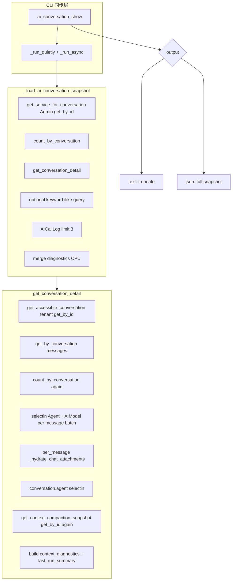

# CLI `ai conversation show` 全面审计与修复计划（迭代版）

> 由三路只读子代理并行审计结论合并，用于定位「慢 / 错 / 费 token / 诊断误导」分别落在哪一环节。  
> 命令：`novusai ai conversation show <conversation_id>`（如 `666` 表示对话主键）。

---

## 1. 环节总览（数据流）

---

## 2. 按问题类型归因（哪一环节导致）

### 2.1 慢 — 主要贡献者

| 优先级 | 环节 | 证据 | 说明 |
|--------|------|------|------|
| **P0** | 重复 `COUNT` | `cli.py` 1282–1290 + `conversation_service.py` 342–344 | 同一请求内 `count_by_conversation` **执行两次**。 |
| **P0** | 同一会话多 次 `get_by_id` | `get_service_for_conversation`（Admin repo）→ `get_accessible_conversation`（租户 repo）→ `get_context_compaction_snapshot` 内再 `get_by_id` | 一次 CLI 至少 **3 次** 读 `agent_conversations` 行（路径不同 repo，会话 identity map 不必然命中）。 |
| **P1** | 附件补水 | `conversation_service.py` 349–361 循环内 `await _hydrate_chat_attachments` | **每条**带附件消息可触发 **一次** `Attachment ... IN (...)`；跨消息**未合并**，上界约 **≤ tail**。 |
| **P1** | `--keyword` | `cli.py` 1295–1307 | `content ILIKE '%kw%'` 仅按会话过滤；`keyword_limit` 只限返回行数，**不保证**降低扫描成本（依赖索引/计划）。 |
| **P2** | `OFFSET` 分页 | `skip = max(total_messages - tail, 0)` | 大会话 + 大 offset 时数据库侧可能偏慢（常规分页问题）。 |
| **次要** | `_run_quietly(True)` | `cli.py` 2099–2107, 836–849 | 将 logging 提到 CRITICAL，**不吞异常**，但排障时**看不到** info/warning。 |
| **次要** | `asyncio.run` | `cli.py` 766–770 | 每次子命令新建事件循环，固定开销；相对 DB 通常非主因。 |
| **CPU** | `call_logs` 双遍解析 | `cli.py` 1362–1371 与 1644–1692 | 最多 3 行，对 `_extract_turn_diagnostics_from_call_log_metadata` **重复调用**，属 CPU 非 DB。 |

**结论（慢）**：瓶颈主要在 **DB 层重复 COUNT、重复会话 SELECT、按消息附件查询**；其次 keyword 与 offset。不是 `asyncio` 本身。

---

### 2.2 报错 / 难排 — 主要贡献者

| 环节 | 证据 | 说明 |
|------|------|------|
| 异常范围窄 | `ai_conversation_show` 仅 catch `NotFoundException`、`AppException`（约 2098–2126） | **DB/驱动/其它异常** 不落 JSON 错误体，用户易见**堆栈**而非统一 `code`。 |
| 日志静音 | `_run_quietly(True)` 恒开 | 内部若「只打 log 不抛」的路径更难发现（本主流程以抛为主）。 |
| 编码 | `_ensure_utf8_stdio` 失败时静默 continue（784–792） | 极端控制台编码下仍可能乱码，无专门错误码。 |

**结论（错）**：「一直出错」若指 **未捕获异常暴露栈** — 属 **CLI 异常策略** 环节；若指 **业务 NotFound** — 已有 `conversation_not_found`。

---

### 2.3 浪费 token — 主要贡献者

| 环节 | 证据 | 说明 |
|------|------|------|
| **`--json` 全量** | `_echo_json` 对整棵 `snapshot` `indent=2`（795–799）；`--json` 分支无截断（2128–2129） | **`recent_messages` 含完整 content / tool_calls / metadata**；`diagnostics` 可含整段 `turn_record`。 |
| 文本模式默认更小 | `_render_ai_conversation_text` 用 `_truncate_cli_block`（默认约 600 字符）、tool_calls/metadata `max_chars=1200`（1920–1947） | 人工复制给 LLM 时应优先 **文本** 或新增 **compact json**。 |

**结论（费 token）**：几乎完全由 **输出形态（`--json` vs 文本）** 决定，不是推理引擎。

---

### 2.4 「全流程规划」看起来不对 — 主要贡献者

| 环节 | 证据 | 说明 |
|------|------|------|
| 标量链不一致 | `turn_outcome` 等含 `assistant_metadata`；`tool_loop_progress` 链 **不含** 同层 `assistant_metadata`（1624–1641 vs 1377+） | 同一屏上字段可能来自 **不同来源**，组合易误解。 |
| `latest_call_log_diagnostics` | 在最多 3 条 log 中取 **第一个** 能抽出非空的 metadata 后 `break`（1362–1371） | 若**最新一条** log 无诊断，合并结果可能对应 **更早一轮**，却与「最后一条 assistant」并排展示。 |
| `diagnostics.source` | `turn_record` 非空即标 `assistant_turn_record`（1744–1756） | 标量可能实际来自 **call_log / detail**，标签 **高估** 单一来源。 |
| 双套摘要 | 文本里既有合并后的 `Turn diagnostics`，又有 `Recent call_logs` 每条独立字段（约 1827–1897 vs 2000–2046） | 两套不一致时用户需人工对齐。 |

**结论（诊断误导）**：主要是 **合并策略与 `source` 标注** 环节，不是「模型规划逻辑」本身（除非对比的是线上对话行为）。

---

## 3. 单次调用 SQL 粗算（无 keyword、附件少）

- 固定约 **7 次** 核心 SQL：Admin `get_by_id` + CLI `count` + 租户 `get_by_id` + 消息列表 + **detail 内再次 `count`** + compaction 的 **`get_by_id`** + `AICallLog` x1。
- `+keyword`：**+1**。
- 附件：上界约 **≤ tail** 次额外 `Attachment` 查询（每条消息一次，未批处理）。

---

## 4. 修复优先级（与初版计划对齐并加强）

1. **P0 DB**：去掉重复 `count`；compaction 从已加载 `conversation.metadata_` 读取，去掉第三次 `get_by_id`；评估 CLI 是否可避免第二次租户 `get_by_id`（与权限模型一致前提下）。
2. **P1 性能**：CLI 可选跳过附件 hydration；或实现 **跨 tail 消息批量** attachment 查询后回填。
3. **P2 输出**：`--compact-json` / `--max-content-chars`；help 明确 **`--json` 面向程序、喂 LLM 用 compact 或 text**。
4. **P3 可靠性**：`--verbose` 保留日志；非 `AppException` 的 catch 转统一 JSON（可选）；DB 错误提示检查 `DATABASE_URL`。
5. **P4 诊断**：统一 `tool_loop_progress` 与 `turn_outcome` 的 fallback 链；修正 `source` 语义或输出 **provenance 列表**；call_log 选取规则与「最新 assistant」对齐说明。

---

## 5. 实施任务清单（Todos）

- [ ] **dedupe-db-count**：CLI 与 `get_conversation_detail` 只保留一处 `count`（或 CLI 仅用 detail 返回值算 skip）。
- [ ] **compaction-inline**：`get_context_compaction_snapshot` 重载为接受 `conversation` 或从 metadata 直读，避免额外 `get_by_id`。
- [ ] **cli-attach-batch-or-skip**：`hydrate_attachments=False` CLI 开关 + 可选批量 IN 跨消息。
- [ ] **compact-json-output**：压缩 JSON / 正文长度上限。
- [ ] **errors-and-docs**：连接失败可行动提示；可选 `--verbose`。
- [ ] **diagnostics-provenance**：合并链一致化 + `source` 真实含义或并列来源。
- [ ] **tests**：查询次数或 snapshot 形状断言。

---

## 6. 子代理引用（内部）

- 代理 A：CLI 加载链、查询次数估算、`_run_quietly`/`asyncio` 影响。  
- 代理 B：`get_conversation_detail` 顺序、selectin、附件逐条、冗余 `get_by_id`。  
- 代理 C：JSON vs 文本 token、诊断合并与误导、异常类型覆盖。
