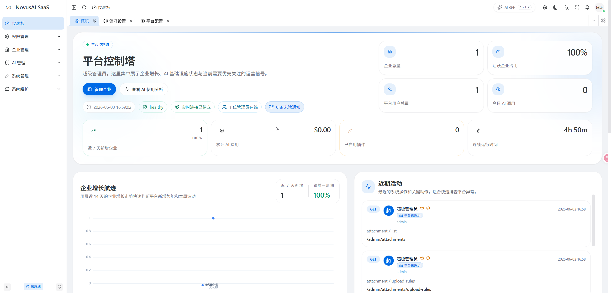
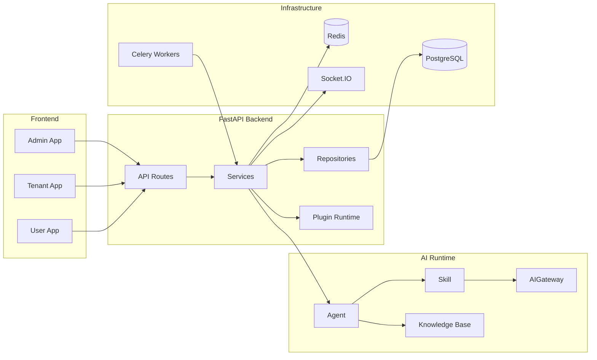

<p align="center">
  
</p>

<p align="center">
  <a href="https://nvuai.cc">Website</a> ·
  <a href="https://nvuai.cc/docs/quick-start">Quick Start</a> ·
  <a href="https://nvuai.cc/docs">Docs</a> ·
  <a href="https://qm.qq.com/q/lyeGthTbm8">QQ Group</a>
</p>

# NovusAI SaaS

**Languages:** [简体中文](README.md) · English

NovusAI SaaS is a multi-tenant, AI-native SaaS development framework for building extensible business applications. It provides platform admin, tenant, and user surfaces, RBAC, a plugin system, AI Agent runtime flows, realtime notifications, attachment storage, CRUD code generation, and database migrations as a production-oriented foundation for SaaS products, vertical applications, and AI-enabled business systems.



## Table of Contents

- [Capabilities](#capabilities)
- [Architecture](#architecture)
- [Tech Stack](#tech-stack)
- [Repository Structure](#repository-structure)
- [Requirements](#requirements)
- [Quick Start](#quick-start)
- [Configuration](#configuration)
- [Development and Testing](#development-and-testing)
- [Code Generation](#code-generation)
- [API Documentation](#api-documentation)
- [Deployment](#deployment)
- [Extension Development](#extension-development)
- [Contributing](#contributing)
- [Community](#community)
- [Security](#security)
- [License](#license)

## Capabilities

| Capability | Description |
|------------|-------------|
| Multi-surface apps | Built-in `admin`, `tenant`, and `user` product surfaces with separated routes, menus, permissions, and API namespaces. |
| Multi-tenancy | Platform administration, tenant administration, tenant users, and tenant-isolated data access models. |
| Access control | RBAC, menu permissions, data permissions, organization boundaries, and operation audit foundations. |
| AI runtime | Business AI flow based on **Agent → Skill → AIGateway**, with extensible models, skills, knowledge bases, and tool calls. |
| Plugin system | Backend plugins, frontend plugin entry points, plugin menus, plugin assets, lifecycle management, and extension points. |
| Realtime features | Socket.IO support for notifications and realtime events across admin, tenant, and user surfaces. |
| Async tasks | Celery and Redis for background jobs, scheduled jobs, and long-running workflows. |
| Attachments and storage | Pluggable attachment, object storage, download, and plugin storage support. |
| CRUD codegen | CRUD generation and rollback manifest support for admin-style management screens. |
| Migrations | Alembic migrations for the main application and plugins. |

## Architecture



## Tech Stack

| Layer | Technologies |
|-------|--------------|
| Backend | Python 3.10+, FastAPI, SQLAlchemy 2.x, Alembic, Pydantic, Celery, Socket.IO |
| Data and cache | PostgreSQL, Redis, with optional images/extensions such as pgvector when needed |
| Frontend | Vue 3, TypeScript, Vben Admin, Ant Design Vue, Vite, pnpm, vue-i18n |
| Tooling | Ruff, pytest, ESLint, Prettier, Stylelint, Vitest, Turbo |
| Deployment reference | Docker, Docker Compose |

## Repository Structure

```text
novusai-saas/
├── backend/                 # FastAPI backend, migrations, plugin runtime, tests
│   ├── app/                 # API, services, models, repositories, AI, RBAC, tasks, storage, codegen
│   ├── migrations/          # Alembic migrations
│   ├── plugins/             # Bundled plugins and plugin examples
│   └── tests/               # Backend tests
├── frontend/                # Frontend pnpm monorepo
│   ├── apps/web-antd/       # Main web application
│   └── packages/            # Shared frontend packages and foundation modules
├── business/                # Business module extension directory
├── customer/                # Delivery, deployment, seed, and branding overlays
├── extensions/              # Reusable plugins, connectors, and integration assets
├── docs/                    # Project documentation
├── docker-compose.dev.yml   # Local development services
├── docker-compose.prod.yml  # Production orchestration reference
├── README.md                # Simplified Chinese README
└── README.en-US.md          # English README
```

## Requirements

- Python 3.10+
- Node.js 20.19+
- pnpm 10+
- PostgreSQL
- Redis
- Docker and Docker Compose, recommended for local dependency services

## Quick Start

### Option A: Source Development (Recommended)

Best for active development. Backend and frontend run from source; only PostgreSQL and Redis are containerised.

#### 1. Start Dependency Services

From the repository root, start local PostgreSQL and Redis:

```bash
docker compose -f docker-compose.dev.yml up -d postgres redis
```

#### 2. Start the Backend

```bash
cd backend
cp .env.example .env

python -m venv .venv

# Windows
.venv\Scripts\activate

# macOS / Linux
source .venv/bin/activate

uv sync --extra dev
# Or use pip:
# pip install -e ".[dev]"

novusai db upgrade head
novusai run --reload
```

Start a Celery worker in a second terminal:

```bash
cd backend
source .venv/bin/activate
novusai celery dev
```

#### 3. Start the Frontend

```bash
cd frontend
pnpm install
pnpm dev:antd
```

### Option B: Docker Full-Stack Build

Best for a quick trial or integration testing. All services — backend, frontend, and databases — run in containers.

#### 1. Prepare the backend config

```bash
cp backend/.env.example backend/.env
```

#### 2. Build and start all services

```bash
docker compose -f docker-compose.dev.yml up --build -d
```

The first build takes about 5–10 minutes (the frontend pnpm install is the slowest step). Subsequent starts reuse cached layers.

If you change Postgres initialisation parameters (e.g. credentials), remove the old volume first:

```bash
docker compose -f docker-compose.dev.yml down -v
docker compose -f docker-compose.dev.yml up --build -d
```

### Access URLs

| Item | Source Development | Docker Full-Stack |
|------|--------------------|--------------------|
| Web app | `http://localhost:5666` | `http://localhost:5666` |
| API | `http://127.0.0.1:8000` | `http://localhost:8000` |
| Swagger UI | `http://127.0.0.1:8000/docs` | `http://localhost:8000/docs` |
| ReDoc | `http://127.0.0.1:8000/redoc` | `http://localhost:8000/redoc` |
| PostgreSQL | `127.0.0.1:5432` | `localhost:5432` |
| Redis | `127.0.0.1:6379` | `localhost:6379` |

### Default Admin Account

Initial migrations create a platform super-administrator:

| Field | Value |
|-------|-------|
| Username | `admin` |
| Password | `admin123456` |
| Email | `admin@novusai.com` |

> **Warning:** The default account is for local development and initial testing only. Change the password immediately after deploying to production.

## Configuration

Copy example configuration files and adjust them per environment. Do not commit real secrets.

| Scope | File | Description |
|-------|------|-------------|
| Backend | `backend/.env.example` → `backend/.env` | Database, Redis, JWT, logging, Celery, AI providers, storage, and related settings |
| Frontend | `frontend/apps/web-antd/.env.development` | API URL, development port, platform domains, and related settings |
| Local overrides | `frontend/apps/web-antd/.env.local` | Optional Vite local override file |

## Development and Testing

Backend commands:

```bash
cd backend
pytest
ruff check .
ruff format .
```

Frontend commands:

```bash
cd frontend
pnpm lint
pnpm test:unit
pnpm build:antd
```

## Code Generation

The framework includes CRUD code generation. After generation, a runtime `codegen_manifest.json` file is created at the repository root to record generated artifacts and support rollback. This file is a workspace artifact, is ignored by Git, and should not be committed.

## API Documentation

When backend `DEBUG=true`, the following API documentation endpoints are available:

| URL | Description |
|-----|-------------|
| `http://127.0.0.1:8000/docs` | Swagger UI |
| `http://127.0.0.1:8000/redoc` | ReDoc |
| `http://127.0.0.1:8000/openapi.json` | OpenAPI JSON |

Interactive API documentation should usually be disabled in production. Publish API contracts through controlled channels instead.

## Deployment

This repository provides framework source code and Docker Compose reference files:

- `docker-compose.dev.yml` is for local PostgreSQL and Redis.
- `docker-compose.prod.yml` is a production orchestration reference. Real deployments should add private environment files, reverse proxies, HTTPS, logging, monitoring, backups, and capacity planning.
- `production.env.example` is the production environment example file. Copy it to `production.env` and adjust it for your deployment.

Reference production Compose startup:

```bash
cp production.env.example production.env
docker compose --env-file production.env -f docker-compose.prod.yml up -d
```

Before production deployment, at minimum:

- Replace all default secrets and default accounts.
- Use dedicated database, Redis, and object storage services.
- Configure HTTPS, CORS, trusted domains, and security response headers.
- Configure logging, monitoring, alerting, backups, and recovery procedures.
- Review AI provider, plugin permission, file upload, and external HTTP tool policies for your business context.

## Extension Development

Recommended extension locations:

| Directory | Purpose |
|-----------|---------|
| `backend/plugins/` | Built-in or framework-distributed plugins |
| `business/` | Business-domain modules |
| `customer/` | Delivery environment, branding, configuration, seed data, and deployment overlays |
| `extensions/` | Reusable plugins, connectors, skill packages, and integration assets |


## Contributing

Issues and pull requests are welcome. Before submitting changes, read [CONTRIBUTING.md](CONTRIBUTING.md) and make sure relevant tests, formatting, and static checks pass.

## Community

- **QQ Group**: [Join us](https://qm.qq.com/q/lyeGthTbm8) to connect with other developers, share experiences, report issues, and join discussions.

## Security

Report vulnerabilities according to [SECURITY.md](SECURITY.md). Do not disclose sensitive vulnerability details in public issues.

## License

This project is licensed under the [MIT License](LICENSE).
