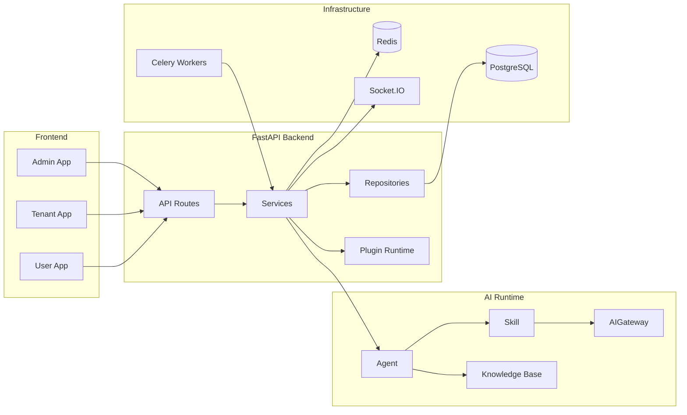

# NovusAI SaaS

**语言：** 简体中文 · [English](README.en-US.md)

NovusAI SaaS 是一个面向二次开发的多租户 AI SaaS 开发框架。它提供平台管理端、企业端、用户端、权限体系、插件系统、AI Agent 运行链路、实时通知、附件存储、代码生成与数据库迁移等基础能力，适合作为企业级 SaaS 产品、行业应用和 AI 原生业务系统的工程底座。

## 目录

- [核心能力](#核心能力)
- [架构概览](#架构概览)
- [技术栈](#技术栈)
- [仓库结构](#仓库结构)
- [环境要求](#环境要求)
- [快速开始](#快速开始)
- [配置说明](#配置说明)
- [开发与测试](#开发与测试)
- [代码生成](#代码生成)
- [API 文档](#api-文档)
- [部署说明](#部署说明)
- [扩展开发](#扩展开发)
- [贡献](#贡献)
- [安全](#安全)
- [许可证](#许可证)

## 核心能力

| 能力 | 说明 |
|------|------|
| 多端应用 | 内置 `admin`、`tenant`、`user` 三类产品面，路由、菜单、权限和 API 命名空间相互隔离。 |
| 多租户 | 支持平台级管理、企业级管理、企业用户和租户隔离的数据访问模型。 |
| 权限体系 | 提供 RBAC、菜单权限、数据权限、组织边界和操作审计等基础能力。 |
| AI 运行时 | 支持 **Agent → Skill → AIGateway** 的业务 AI 链路，可扩展模型、技能、知识库与工具调用。 |
| 插件系统 | 支持后端插件、前端插件入口、插件菜单、插件资源、插件生命周期和插件扩展点。 |
| 实时能力 | 使用 Socket.IO 支持管理端、企业端、用户端通知与实时事件。 |
| 异步任务 | 使用 Celery 与 Redis 处理后台任务、定时任务和长耗时流程。 |
| 附件与存储 | 提供可插拔的附件、对象存储、下载和插件存储扩展能力。 |
| CRUD 代码生成 | 提供面向后台管理场景的 CRUD 生成与回滚清单机制。 |
| 数据库迁移 | 使用 Alembic 管理主应用和插件迁移。 |

## 架构概览



## 技术栈

| 层级 | 技术 |
|------|------|
| 后端 | Python 3.10+、FastAPI、SQLAlchemy 2.x、Alembic、Pydantic、Celery、Socket.IO |
| 数据与缓存 | PostgreSQL、Redis，可按需启用 pgvector 等扩展镜像 |
| 前端 | Vue 3、TypeScript、Vben Admin、Ant Design Vue、Vite、pnpm、vue-i18n |
| 工程化 | Ruff、pytest、ESLint、Prettier、Stylelint、Vitest、Turbo |
| 部署参考 | Docker、Docker Compose |

## 仓库结构

```text
novusai-saas/
├── backend/                 # FastAPI 后端、迁移、插件运行时、测试
│   ├── app/                 # API、服务、模型、仓储、AI、RBAC、任务、存储、codegen
│   ├── migrations/          # Alembic 迁移
│   ├── plugins/             # 内置插件与插件示例
│   └── tests/               # 后端测试
├── frontend/                # 前端 pnpm monorepo
│   ├── apps/web-antd/       # 主 Web 应用
│   └── packages/            # 前端共享包与基础能力
├── business/                # 业务模块扩展目录
├── customer/                # 交付、部署、种子数据和品牌覆盖目录
├── extensions/              # 可复用插件、连接器和集成资产
├── docs/                    # 项目文档目录
├── docker-compose.dev.yml   # 本地开发依赖服务
├── docker-compose.prod.yml  # 生产编排参考
├── README.md                # 中文自述
└── README.en-US.md          # English README
```

## 环境要求

- Python 3.10+
- Node.js 20.19+
- pnpm 10+
- PostgreSQL
- Redis
- Docker 与 Docker Compose（推荐用于本地依赖服务）

## 快速开始

### 1. 启动依赖服务

在仓库根目录启动本地 PostgreSQL 与 Redis：

```bash
docker compose -f docker-compose.dev.yml up -d
```

### 2. 启动后端

```bash
cd backend
python -m venv .venv

# Windows
.venv\Scripts\activate

# macOS / Linux
source .venv/bin/activate

uv sync --extra dev
# 或者使用 pip:
# pip install -e ".[dev]"

cp .env.example .env
novusai db upgrade head
novusai run --reload
```

另开一个终端启动 Celery worker：

```bash
cd backend
source .venv/bin/activate
novusai celery dev
```

### 3. 启动前端

```bash
cd frontend
pnpm install
pnpm dev:antd
```

默认访问地址：

| 项目 | 地址 |
|------|------|
| API | `http://127.0.0.1:8000` |
| Web 应用 | `http://localhost:5666` |
| Swagger UI | `http://127.0.0.1:8000/docs` |
| ReDoc | `http://127.0.0.1:8000/redoc` |

初始迁移会创建开发管理员账号。默认账号仅用于本地开发，生产环境必须修改或移除。

## 配置说明

请复制示例配置并按环境调整，真实密钥不要提交到 Git。

| 范围 | 文件 | 说明 |
|------|------|------|
| 后端 | `backend/.env.example` → `backend/.env` | 数据库、Redis、JWT、日志、Celery、AI Provider、存储等配置 |
| 前端 | `frontend/apps/web-antd/.env.development` | API 地址、开发端口、平台域名等配置 |
| 本地覆盖 | `frontend/apps/web-antd/.env.local` | Vite 本地覆盖配置，可按需创建 |

## 开发与测试

后端常用命令：

```bash
cd backend
pytest
ruff check .
ruff format .
```

前端常用命令：

```bash
cd frontend
pnpm lint
pnpm test:unit
pnpm build:antd
```

## 代码生成

框架包含 CRUD 代码生成能力。生成后，仓库根目录会产生运行时文件 `codegen_manifest.json`，用于记录生成产物并支持回滚。该文件属于工作区生成物，已被 Git 忽略，不应提交到仓库。

## API 文档

当后端 `DEBUG=true` 时，会开放以下接口文档：

| 地址 | 说明 |
|------|------|
| `http://127.0.0.1:8000/docs` | Swagger UI |
| `http://127.0.0.1:8000/redoc` | ReDoc |
| `http://127.0.0.1:8000/openapi.json` | OpenAPI JSON |

生产环境通常应关闭交互式 API 文档，并通过受控方式发布接口契约。

## 部署说明

本仓库提供框架源码和 Docker Compose 参考文件：

- `docker-compose.dev.yml` 用于本地 PostgreSQL 与 Redis。
- `docker-compose.prod.yml` 作为生产编排参考，实际部署时需要结合私有环境变量、反向代理、HTTPS、日志、监控、备份和容量规划。
- `production.env.example` 是生产环境变量示例文件，复制为 `production.env` 后按部署环境修改。

生产 Compose 参考启动方式：

```bash
cp production.env.example production.env
docker compose --env-file production.env -f docker-compose.prod.yml up -d
```

生产部署前请至少完成：

- 替换所有默认密钥和默认账号。
- 使用独立数据库、Redis 和对象存储。
- 配置 HTTPS、CORS、可信域名和安全响应头。
- 配置日志、监控、告警、备份和恢复流程。
- 按业务需要审查 AI Provider、插件权限、文件上传和外部 HTTP 工具策略。

## 扩展开发

建议按以下目录组织扩展代码：

| 目录 | 用途 |
|------|------|
| `backend/plugins/` | 内置或随框架分发的插件 |
| `business/` | 面向具体业务域的模块 |
| `customer/` | 交付环境、品牌、配置、种子数据和部署覆盖 |
| `extensions/` | 可复用插件、连接器、技能包和集成资产 |

## 贡献

欢迎提交 Issue 和 Pull Request。提交前请阅读 [CONTRIBUTING.md](CONTRIBUTING.md)，并确保相关测试、格式化和静态检查通过。

## 安全

安全漏洞请按 [SECURITY.md](SECURITY.md) 中的方式报告。请不要在公开 Issue 中披露敏感漏洞细节。

## 许可证

本项目采用 [MIT License](LICENSE)。
