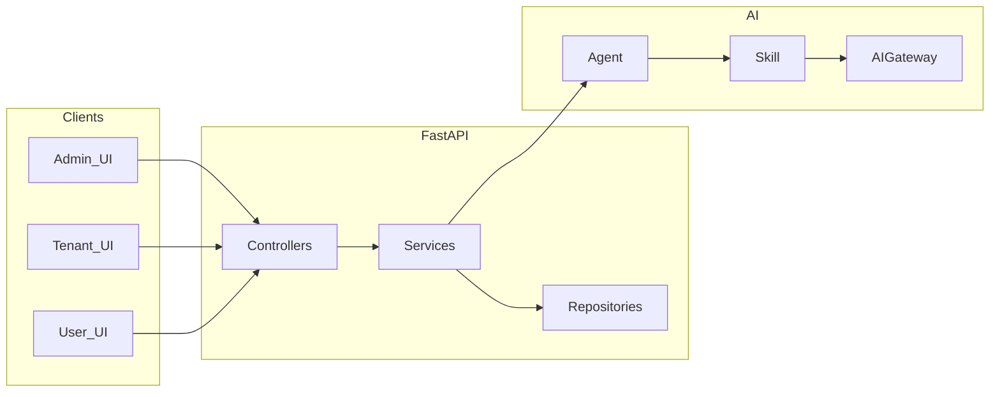

# NovusAI SaaS

> Status: this repo remains the multi-tenant SaaS source system with `admin`,
> `tenant`, and `user` product surfaces.
> Single-instance / `admin + member` split planning or implementation docs must
> not be kept as canonical docs in this repo.

**Languages:** English · [简体中文](README.zh-CN.md)

Multi-tenant, AI-native SaaS platform with **platform admin**, **tenant**, and **user** apps, **RBAC**, **plugins**, **Agent → Skill → AIGateway** flows, **Socket.IO**, pluggable **attachments**, **codegen**, and **Alembic** migrations.

## Table of contents

- [Overview](#overview)
- [Architecture](#architecture)
- [Tech stack](#tech-stack)
- [Repository structure](#repository-structure)
- [Prerequisites](#prerequisites)
- [Quick start](#quick-start)
- [Configuration](#configuration)
- [Development](#development)
- [API documentation](#api-documentation)
- [Default development URLs and accounts](#default-development-urls-and-accounts)
- [Documentation](#documentation)
- [Deployment](#deployment)
- [Contributing](#contributing)
- [Security](#security)
- [License](#license)
- [Support](#support)

## Overview

NovusAI SaaS is a **monorepo**: [`backend`](backend) (FastAPI), [`frontend`](frontend) (Vben Admin monorepo), [`docs`](docs), [`.trellis`](.trellis) (canonical workflow/spec entry), [`.agents`](.agents) (active local agent skills), and [`.cursor`](.cursor) (editor compatibility rules). Three UI surfaces share patterns but **must not cross-import** business modules between admin, tenant, and user.

| Area | Notes |
|------|--------|
| **Surfaces** | `admin` / `tenant` / `user` — separate routes and API namespaces. |
| **AI** | Business AI uses **Agent → Skill → AIGateway**; current runtime contracts live under `.trellis/spec/ai-runtime/`. |
| **Data** | JSON:API-style `filter` / `sort` / `page`; tenant isolation and data permissions in services and RBAC. |
| **Realtime** | Celery for async work; Socket.IO for notifications and tenant/user/admin realtime channels. |
| **Extensibility** | Plugins under `backend/plugins/`; CRUD codegen and rollback via root [`codegen_manifest.json`](codegen_manifest.json). |

## Architecture



## Tech stack

| Layer | Stack |
|-------|--------|
| **Backend** | Python **3.10+**, FastAPI, SQLAlchemy 2.x (async), PostgreSQL (pgvector image in dev Compose), Redis, Celery, Alembic, Socket.IO |
| **Frontend** | Vue 3, TypeScript, Vben Admin 5.x, Ant Design Vue, Vite, pnpm, vue-i18n |
| **Auth** | JWT (access / refresh; impersonation where applicable) |

## Repository structure

```
novusai-saas-yudi/
├── backend/
│   ├── app/                 # FastAPI: api/, services/, models/, repositories/,
│   │                        # ai/, rbac/, storage/, tasks/, sio/, codegen/, …
│   ├── migrations/          # Alembic
│   ├── plugins/             # Bundled / first-party plugins
│   └── tests/
├── frontend/                # pnpm + Turbo monorepo
│   ├── apps/web-antd/       # Main NovusAI app (admin / tenant / user)
│   └── packages/
├── docs/                    # Guides, audits, design notes
├── shared/
├── .trellis/                # Canonical workflow, specs, and task records
├── .agents/                 # Active local agent skills and project agent helpers
├── .cursor/
│   ├── rules/               # Editor compatibility rules
│   └── skills/              # Compatibility skills; Trellis/.agents are authoritative
├── codegen_manifest.json    # Codegen rollback manifest (may be empty)
├── docker-compose.dev.yml   # Dev PostgreSQL + Redis
├── LICENSE
├── CONTRIBUTING.md
├── SECURITY.md
├── README.md
└── README.zh-CN.md
```

## Prerequisites

- **Python** 3.10+ ([`backend/pyproject.toml`](backend/pyproject.toml))
- **Node.js** 20.19+ and **pnpm** 10+ (workspace lock: `pnpm@10.28.2`)
- **PostgreSQL** and **Redis** (local or Docker)

## Quick start

### 1) Infrastructure (recommended)

From the repository root:

```bash
docker compose -f docker-compose.dev.yml up -d
```

This starts **PostgreSQL** (port `5432`) and **Redis** (`6379`) with named volumes.

### 2) Backend

Run all commands from the **`backend`** directory:

```bash
cd backend
python -m venv .venv
# Windows: .venv\Scripts\activate
# Linux/macOS: source .venv/bin/activate

uv sync --extra dev
# or: pip install -e ".[dev]"

cp .env.example .env
# Edit .env — see Configuration

novusai db upgrade head
novusai run --reload
```

In a **second** terminal (same virtualenv):

```bash
cd backend
novusai celery dev
```

Optional: tune logging via variables in `.env` (e.g. SQL file logging under `logs/`, WebSocket handshake verbosity).

### 3) Frontend

Run from the **`frontend`** directory:

```bash
cd frontend
pnpm install
```

Set the API base URL in [`frontend/apps/web-antd/.env.development`](frontend/apps/web-antd/.env.development) (`VITE_GLOB_API_URL`, default `http://localhost:8000`). You may add `frontend/apps/web-antd/.env.local` for local overrides (Vite).

```bash
pnpm dev:antd
```

The default dev server port is **5666** (`VITE_PORT` in `.env.development`).

## Configuration

Do **not** commit real secrets. Copy templates and edit:

| Scope | File | Highlights |
|--------|------|------------|
| Backend | [`backend/.env.example`](backend/.env.example) → `.env` | `DEBUG`, `SECRET_KEY`, `DATABASE_*`, `REDIS_*`, `CELERY_*`, JWT settings, `LOG_*`, … |
| Frontend | [`frontend/apps/web-antd/.env.development`](frontend/apps/web-antd/.env.development) | `VITE_GLOB_API_URL`, `VITE_PORT`, `VITE_PLATFORM_DOMAINS`, … |

See comments inside each example file for semantics and production guidance.

## Development

### Backend

From `backend` (with dev extras installed):

```bash
pytest
ruff check .
ruff format .
```

Tests are configured in [`backend/pyproject.toml`](backend/pyproject.toml) (`testpaths = ["tests"]`).

### Frontend

From `frontend`:

```bash
pnpm lint
pnpm test:unit
pnpm build:antd
```

## API documentation

When **`DEBUG=true`**, the API serves interactive docs (see [`backend/app/main.py`](backend/app/main.py)):

| URL | Description |
|-----|----------------|
| `http://localhost:8000/docs` | Swagger UI |
| `http://localhost:8000/redoc` | ReDoc |
| `http://localhost:8000/openapi.json` | OpenAPI schema |

In typical **production** settings, these URLs are disabled (`None` when `DEBUG` is false). Rely on versioned API contracts and internal documentation instead.

## Default development URLs and accounts

> **Development only.** Change passwords and remove demo accounts before production.

| Item | Value |
|------|--------|
| API | `http://localhost:8000` |
| Web app | `http://localhost:5666` |
| Platform login | `/admin/login` — example: `admin` / `admin123456` |
| Tenant login | `/tenant/login` — example: `adminsss` / `admin123456` |

## Documentation

| Location | Purpose |
|----------|---------|
| [`.trellis/workflow.md`](.trellis/workflow.md) | Current workflow shell and path selector |
| [`.trellis/spec/guides/trellis-paths.md`](.trellis/spec/guides/trellis-paths.md) | Canonical `fast` / `normal` / `deep` selection rules |
| [`.trellis/spec/backend/index.md`](.trellis/spec/backend/index.md) | Backend conventions and guide index |
| [`.trellis/spec/frontend/index.md`](.trellis/spec/frontend/index.md) | Frontend conventions and guide index |
| [`.trellis/spec/ai-runtime/index.md`](.trellis/spec/ai-runtime/index.md) | AI runtime governance and testing discipline |
| [`.agents/skills/`](.agents/skills) | Active local agent skills that point back to Trellis specs |
| [`.cursor/skills/`](.cursor/skills) | Editor compatibility skills; use Trellis specs as the source of truth |

**Codegen:** after generating CRUD from the monorepo root, `codegen_manifest.json` records artifacts for rollback; the admin UI may warn if the manifest is missing or out of sync.

## Deployment

Production and environment-specific assets are owned by the active operations runbooks and task records. This README stays focused on local development and canonical code/spec entry points.

## Contributing

See [**CONTRIBUTING.md**](CONTRIBUTING.md) for branches, pull requests, style checks, and tests.

## Security

See [**SECURITY.md**](SECURITY.md) for how to report vulnerabilities.

## License

This project is licensed under the **MIT License** — see [**LICENSE**](LICENSE).

## Support

- **Bug reports and feature requests:** use your Git hosting’s issue tracker (e.g. GitHub **Issues** on the repository).
- **Questions:** prefer issues or team channels so answers stay searchable.
