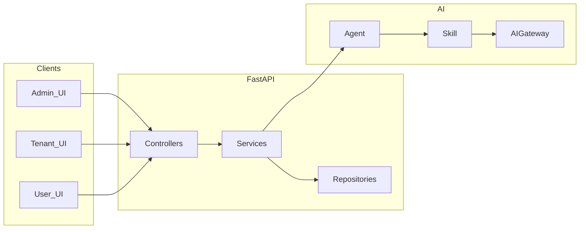

# NovusAI SaaS

> 状态说明：这个仓库仍然是当前多租户 SaaS 母本，正式产品面仍是 `admin`、
> `tenant`、`user` 三端。
> 单实例 / `admin + member` 拆分规划与实施文档不应继续作为本仓的正式文档保留。

**语言：** [English](README.md) · 简体中文

多租户、AI 优先的 SaaS 平台：包含**平台管理端**、**企业端**、**用户端**，具备 **RBAC**、**插件**、**Agent → Skill → AIGateway** 链路、**Socket.IO**、可插拔**附件**、**代码生成（codegen）** 与 **Alembic** 迁移。

## 目录

- [概述](#概述)
- [架构](#架构)
- [技术栈](#技术栈)
- [仓库结构](#仓库结构)
- [环境要求](#环境要求)
- [快速开始](#快速开始)
- [配置](#配置)
- [开发](#开发)
- [API 文档](#api-文档)
- [默认开发地址与账号](#默认开发地址与账号)
- [文档索引](#文档索引)
- [部署](#部署)
- [参与贡献](#参与贡献)
- [安全](#安全)
- [许可证](#许可证)
- [支持](#支持)

## 概述

本仓库为 **monorepo**：[`backend`](backend)（FastAPI）、[`frontend`](frontend)（Vben Admin）、[`docs`](docs)、[`.trellis`](.trellis)（正式 workflow/spec 入口）、[`.agents`](.agents)（当前本地代理技能）、[`.cursor`](.cursor)（编辑器兼容规则）。三端（admin / tenant / user）共享模式，但**禁止**跨端业务模块引用。

| 领域 | 说明 |
|------|------|
| **三端** | `admin` / `tenant` / `user`，路由与 API 命名空间分离。 |
| **AI** | 业务 AI 走 **Agent → Skill → AIGateway**；当前运行时契约以 `.trellis/spec/ai-runtime/` 为准。 |
| **数据** | 列表协议含 `filter` / `sort` / `page`；租户隔离与数据权限在 Service / RBAC 中实现。 |
| **实时** | Celery 异步；Socket.IO 用于通知及 admin / tenant / user 实时通道。 |
| **扩展** | 插件位于 `backend/plugins/`；CRUD 生成与回滚依赖根目录 [`codegen_manifest.json`](codegen_manifest.json)。 |

## 架构



## 技术栈

| 层级 | 说明 |
|------|------|
| **后端** | Python **3.10+**、FastAPI、SQLAlchemy 2.x、PostgreSQL、Redis、Celery、Alembic、Socket.IO |
| **前端** | Vue 3、TypeScript、Vben Admin 5.x、Ant Design Vue、Vite、pnpm、vue-i18n |
| **鉴权** | JWT（access / refresh；含模拟登录等场景） |

## 仓库结构

与 [Repository structure](README.md#repository-structure) 一致；主应用位于 `frontend/apps/web-antd/`。

## 环境要求

- **Python** 3.10+（见 [`backend/pyproject.toml`](backend/pyproject.toml)）
- **Node.js** 20.19+ 与 **pnpm** 10+（workspace 锁定 `pnpm@10.28.2`）
- **PostgreSQL** 与 **Redis**（本地或 Docker）

## 快速开始

### 1）依赖服务（推荐）

在仓库根目录：

```bash
docker compose -f docker-compose.dev.yml up -d
```

启动 **PostgreSQL**（`5432`）与 **Redis**（`6379`）。

### 2）后端

在 **`backend`** 目录下执行：

```bash
cd backend
python -m venv .venv
# Windows: .venv\Scripts\activate
# Linux/macOS: source .venv/bin/activate

uv sync --extra dev
# 或: pip install -e ".[dev]"

cp .env.example .env
# 编辑 .env，详见下文「配置」

novusai db upgrade head
novusai run --reload
```

另开终端（同一虚拟环境）：

```bash
cd backend
novusai celery dev
```

### 3）前端

在 **`frontend`** 目录下：

```bash
cd frontend
pnpm install
```

按需修改 [`frontend/apps/web-antd/.env.development`](frontend/apps/web-antd/.env.development) 中的 `VITE_GLOB_API_URL`（默认 `http://localhost:8000`）；可新增 `frontend/apps/web-antd/.env.local` 覆盖本地变量。

```bash
pnpm dev:antd
```

默认开发端口 **5666**（`VITE_PORT`）。

## 配置

勿将真实密钥提交到 Git。请复制模板后编辑：

| 范围 | 文件 | 要点 |
|------|------|------|
| 后端 | [`backend/.env.example`](backend/.env.example) → `.env` | `DEBUG`、`SECRET_KEY`、`DATABASE_*`、`REDIS_*`、`CELERY_*`、JWT、`LOG_*` 等 |
| 前端 | [`frontend/apps/web-antd/.env.development`](frontend/apps/web-antd/.env.development) | `VITE_GLOB_API_URL`、`VITE_PORT`、`VITE_PLATFORM_DOMAINS` 等 |

具体含义以各文件内注释为准。

## 开发

### 后端（在 `backend` 下）

```bash
pytest
ruff check .
ruff format .
```

### 前端（在 `frontend` 下）

```bash
pnpm lint
pnpm test:unit
pnpm build:antd
```

## API 文档

当 **`DEBUG=true`** 时，后端提供（见 [`backend/app/main.py`](backend/app/main.py)）：

| URL | 说明 |
|-----|------|
| `http://localhost:8000/docs` | Swagger UI |
| `http://localhost:8000/redoc` | ReDoc |
| `http://localhost:8000/openapi.json` | OpenAPI JSON |

生产环境通常在 `DEBUG=false` 时关闭上述入口；以发布流程与内部文档为准。

## 默认开发地址与账号

> **仅用于本地开发。** 生产环境务必修改密码并关闭演示账号。

| 项 | 值 |
|----|-----|
| API | `http://localhost:8000` |
| 前端 | `http://localhost:5666` |
| 平台登录 | `/admin/login` — 示例：`admin` / `admin123456` |
| 企业登录 | `/tenant/login` — 示例：`adminsss` / `admin123456` |

## 文档索引

| 位置 | 用途 |
|------|------|
| [`.trellis/workflow.md`](.trellis/workflow.md) | 当前 workflow 壳层与路径选择入口 |
| [`.trellis/spec/guides/trellis-paths.md`](.trellis/spec/guides/trellis-paths.md) | `fast` / `normal` / `deep` 正式选择规则 |
| [`.trellis/spec/backend/index.md`](.trellis/spec/backend/index.md) | 后端规范与指南索引 |
| [`.trellis/spec/frontend/index.md`](.trellis/spec/frontend/index.md) | 前端规范与指南索引 |
| [`.trellis/spec/ai-runtime/index.md`](.trellis/spec/ai-runtime/index.md) | AI runtime 治理与测试纪律 |
| [`.agents/skills/`](.agents/skills) | 当前本地代理技能；入口应回指 Trellis specs |
| [`.cursor/skills/`](.cursor/skills) | 编辑器兼容技能；事实源以 Trellis spec 为准 |

**Codegen：** 在 monorepo 根目录执行生成后，根目录 `codegen_manifest.json` 用于回滚；管理端可能对清单缺失或不一致给出提示。

## 部署

生产与运维入口以当前运维 runbook 和任务记录为准；本 README 只保留本地开发与正式 code/spec 入口。

## 参与贡献

详见 [**CONTRIBUTING.md**](CONTRIBUTING.md)（分支、PR、风格、测试等）。

## 安全

漏洞报告方式见 [**SECURITY.md**](SECURITY.md)。

## 许可证

本项目采用 **MIT License**，全文见 [**LICENSE**](LICENSE)。

## 支持

- **缺陷与需求**：使用托管平台自带的 **Issues**（如 GitHub 仓库 Issues）。
- **疑问**：建议走 Issues 或团队渠道，便于检索。
