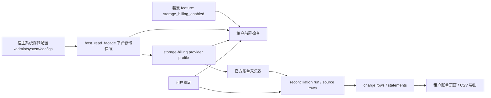

# storage-billing 官方对账实施规范

更新时间：2026-03-25

## 1. 文档目的

本规范定义 `storage-billing` 插件在 NovusAI SaaS 中的正式落地方式，用于统一以下五个协作域：

- 套餐开关
- 宿主对象存储配置
- `storage-billing` 独立插件
- 官方账单对账调度
- 租户绑定与企业侧可见性

本规范目标是让平台内部对象存储收费严格对齐云厂商官方账单口径，而不是依据上传/下载事件实时估算。

## 2. 约束结论

- `storage-billing` 必须保持独立插件，不得下沉进 `qiniu-kodo`、`aliyun-oss`、`tencent-cos` 驱动插件目录。
- `local` 存储永远不计费。
- 当前正式方案只允许使用已落地的官方账单源：
  - 七牛云 Kodo：`finance_api`
  - 阿里云 OSS：`bss_openapi`
  - 腾讯云 COS：`describe_bill_detail`
- 历史文件订阅/账单桶导入方案不属于当前正式契约，不得在 UI、manifest、运行时配置表单中继续暴露。
- 宿主 `/admin/system/configs` 中当前生效的对象存储配置，是运行时地域、Endpoint、Bucket、密钥状态的单一事实源。
- `storage-billing` 插件只保存计费域自己的参数，例如 `enabled`、`profile_code`、`bill_source`、`account_identifier`，不重复保存宿主已有的 AK/SK、地域、Endpoint、Bucket。
- 管理端只显示“当前实际启用并生效的对象存储提供方”，不同时展示三个云厂商配置卡片。

## 3. 角色分工

| 协作域 | 职责 | 不负责 |
| --- | --- | --- |
| 套餐系统 | 控制企业是否具备 `storage_billing_enabled` 能力 | 不保存云厂商对账凭证 |
| 宿主系统存储配置 | 决定当前生效对象存储驱动与运行时配置 | 不负责企业计费绑定、账单归集 |
| `storage-billing` 插件 | 维护 provider profile、租户绑定、官方账单采集、台账、账单、对账任务 | 不接管宿主上传驱动实现 |
| OSS 驱动插件 | 提供对象存储驱动与上传能力 | 不负责内部计费台账与租户账单 |
| 租户绑定 | 将官方账单中的 bucket/domain/account/tag 归属到明确企业 | 不替代套餐开关与宿主驱动配置 |

## 4. 正式支持矩阵

| 提供方 | 正式 bill source | 官方口径 | 插件结算模式 | 插件账期 | 默认调度口径 | 推荐绑定范围 |
| --- | --- | --- | --- | --- | --- | --- |
| 七牛云 Kodo | `finance_api` | 月结官方账单 | `monthly_settled` | `monthly` | 每月 6 日 `03:00` 拉取上月 | `account` |
| 阿里云 OSS | `bss_openapi` | `DescribeSplitItemBill` 分账账单 | `strict_daily_reconciliation` | `daily` | 每天 `03:00` 对 `D-3` | `bucket`、`domain`、`account`、`tag` |
| 腾讯云 COS | `describe_bill_detail` | `DescribeBillDetail` 账单明细 | `strict_daily_reconciliation` | `daily` | 每天 `03:00` 对 `D-2` | `bucket`、`domain`、`account`、`tag` |
| 本地上传 | 不支持 | 不计费 | `unsupported` | 无 | 无 | 无 |

### 4.1 官方口径依据

本规范基于 2026-03-24 查核的官方文档：

- 七牛云“查看账单”文档说明：每月第四个自然日出上月账单，应在次月 4 日后查看完整账单。
- 阿里云 `DescribeSplitItemBill` 文档说明：分账账单相对实际费用延迟 48 小时更新，像 OSS 这类分拆型产品的分拆项明细最多延迟 72 小时。
- 腾讯云 `DescribeBillDetail` 文档说明：大体量账单明细更适合走账单数据存储到 COS；当前 API 方案用于正式明细对账。

## 5. 套餐协作规则

- 套餐 feature `storage_billing_enabled` 是企业是否可见、可使用此能力的唯一业务开关。
- 当套餐开启该 feature 时，运行时必须满足以下条件，否则租户侧前置检查返回不满足：
  - 当前宿主对象存储驱动属于 `qiniu-kodo`、`aliyun-oss`、`tencent-cos` 之一。
  - 对应存储插件已安装并启用。
  - `storage-billing` 中该 provider 的 profile 已启用并校验通过。
  - 至少存在一个与当前 active storage driver 匹配且状态为 `valid` 的租户绑定。
- 当套餐未开启该 feature 时：
  - 企业端不展示可计费账单能力。
  - 管理端仍可维护全局 provider profile 与对账任务，但不应将其解释为租户已具备可见性。
- `plugin.yaml` 当前保留 `scope: all_tenants`，仅表示插件存在 tenant-side route surface，不表示所有企业默认可见。
- `plugin.yaml -> extensions.custom[type=tenant_menu_policy].data.grant_mode=manual_entitlement` 当前只是为了关闭生命周期 auto-grant；租户实际可见性与权限授予以套餐 feature 同步结果为准。

## 6. 宿主对象存储配置规则

宿主系统配置页面 `/admin/system/configs` 是对象存储运行时配置的唯一来源。`storage-billing` 插件必须只读复用，不得复制录入。

运行时读取项包括：

- 当前生效 driver
- bucket / root path
- base URL
- region
- endpoint
- prefix
- 凭证是否已配置

插件对宿主配置的依赖方式：

- 通过宿主读门面读取平台对象存储快照。
- 仅当当前 active driver 与 provider 一致时，才判定该 provider 可以进入 billable path。
- provider profile 页面展示“只读运行时快照”，而不是再次要求管理员填写地域、AK/SK、Bucket。

## 7. storage-billing 插件职责

`storage-billing` 插件负责：

- 保存 provider 级计费配置
- 保存租户级绑定规则
- 触发官方账单拉取
- 记录 source rows、run rows、charge rows、statement rows
- 生成租户账单与导出 CSV
- 当前 `charge rows` 定义为“按 tenant + provider + charge_basis + currency 聚合后的账单行”，不是独立资源级 line-item 表
- 当前资源级原始账单项保存在 `StorageTenantDailyCharge.details_json.items`，用于导出与后续深挖，不应在文案里误称为“资源级明细表”
- 输出前置校验结果

`storage-billing` 插件不负责：

- 上传文件
- 对象存储 SDK 驱动
- 文件真实落盘
- 宿主存储配置写入
- 云厂商发票、税票、支付结算

## 8. Provider Profile 规范

当前 provider profile 允许持久化的字段仅包括：

- `enabled`
- `profile_code`
- `bill_source`
- `account_identifier`

以下字段不得继续出现在正式契约中：

- `bill_bucket`
- `bill_prefix`
- 宿主 AK/SK / Secret / Region / Endpoint / Bucket 等重复字段

兼容要求：

- 历史遗留的死字段在读取时应忽略。
- 历史遗留的死字段在保存时应剔除。
- 历史遗留的非正式 `bill_source` 在运行时应归一化为当前 provider 的正式官方 source，避免在 UI 中再次暴露。

## 9. 租户绑定规范

租户绑定用于把官方账单上的资源维度归属到企业。

当前允许的绑定范围：

- `bucket`
- `domain`
- `account`
- `tag`

provider 限制：

- 七牛云 Kodo 当前只允许 `account` 绑定。
- 七牛云 Kodo 当前不允许 `official_pass_through`。
- 阿里云 OSS 与腾讯云 COS 允许 `bucket`、`domain`、`account`、`tag`。

绑定有效性的硬规则：

- `provider_code` 必须与当前 active storage driver 一致。
- 绑定必须依赖已启用且有效的 provider profile。
- 绑定状态必须为 `valid` 才可进入租户账单链路。
- local 存储即使存在上传行为，也不得通过任何绑定进入计费。

## 10. 调度与账期规范

### 10.1 每日日对账任务

- 调度：`0 3 * * *`
- 时区：平台时区，当前部署以 `Asia/Shanghai` 为准

provider 规则：

- 阿里云 OSS：默认对 `D-3` 执行
- 腾讯云 COS：默认对 `D-2` 执行

原因：

- 阿里云官方分账明细存在最长 72 小时延迟，因此固定走 `D-3`
- 腾讯云 API 作为正式明细源，平台固定在 `03:00` 跑批时不直接追 yesterday，而是选择更稳定的 `D-2`

### 10.2 七牛月结任务

- 调度：`0 3 6 * *`
- 账期：上一个自然月
- 原因：七牛官方完整月账单在次月 4 日后稳定可查，平台保守地在 6 日 `03:00` 拉取

### 10.3 手动补跑规则

- 显式传入 `billing_date` 时，按该日账期重跑
- 未传 `billing_date` 时，按 provider 默认官方滞后规则拆分执行
- 七牛月结补跑必须传 `billing_month`，格式为 `YYYY-MM`

## 11. 管理端与租户端 UI 规范

### 11.1 管理端

- Provider 配置区只显示当前 active provider
- Provider 配置区展示宿主运行时快照为只读信息
- 表单只允许编辑 `enabled`、`profile_code`、`bill_source`、`account_identifier`
- 只有具备 `billing_admin:configure` 时才允许请求企业下拉选项；`billing_admin:view` 首屏不得依赖宿主 `tenant:select`
- 不得出现 `oss_subscription`、`cos_bill_bucket` 这类未落地 source
- 不得出现 `bill_bucket`、`bill_prefix` 这类已废弃字段

### 11.2 租户端

- 仅当套餐 feature 与运行时前置条件同时满足时，账单页面才进入 ready 状态
- 对账未就绪时，必须返回结构化 missing reasons
- `billing_portal:view` 只负责账单门户与当前账单摘要可见
- `billing_statement:list` 只负责账期账单行可见；缺少该权限时，当前账单摘要不得被前端误清空
- 插件页面首屏请求前必须先通过 `window.NovusPluginShared.getAccessCodes()` / `hasAccessByCodes()` 做权限 gating；shared access bridge 缺失时应 fail-close
- 页面内 CTA 必须同时按权限与当前 ready 状态 gating，不能只凭菜单可见性放行
- 租户端当前展示的是聚合账单行，不得在标题、副标题、按钮、表头里把它写成“资源级费用明细”
- 若要展示更细粒度信息，允许展示 `scope_values`、`item_count` 与导出 CSV 中的 `details_json`
- 若产品未来要求真正资源级明细，必须新增独立 line-item 数据模型，而不是继续复用当前聚合 charge rows
- missing reasons 需覆盖：
  - feature 未开启
  - 当前 driver 不可计费
  - 当前 driver 为 local
  - 缺少可用 provider profile
  - 缺少有效绑定
  - 当前绑定与 active provider 不匹配

### 11.3 插件声明契约

- `plugin.yaml` 是页面、菜单、标题、权限和前端入口的唯一声明源
- 页面标题只来自 `extensions.frontend.pages[*].title`
- 菜单标题只来自 `extensions.frontend.pages[*].menu.title`
- 插件内部文案必须注册 canonical locale prefix `plugin.storage-billing`
- 禁止把插件菜单标题写回宿主 `menu.json`
- 生产态前端入口只认 `extensions.frontend.release.manifest`

## 12. 运行时数据流

补充说明：

- `StorageProviderBillSource.raw_payload_json.allocation_rows` 是 run detail 的 source 级快照来源，用于避免 rerun 后历史 run 明细漂移
- `StorageTenantDailyCharge` 是基于当前 authoritative run sources 重建的 live projection，用于 tenant statement、当前账单页和导出

## 13. 关键校验清单

- 套餐开启时，必须存在可计费云对象存储驱动
- 当前 driver 必须属于 `qiniu-kodo`、`aliyun-oss`、`tencent-cos`
- 当前 driver 不能是 `local`
- 对应 provider profile 必须 `enabled`
- 当前 provider 的 bill source 必须属于正式支持矩阵
- 宿主凭证状态必须完整
- 租户绑定必须存在且为 `valid`
- 绑定 provider 必须与 active driver 一致

## 14. 关键文件

- `backend/app/plugins/host_read_facade.py`
- `backend/plugins/storage-billing/plugin.yaml`
- `backend/plugins/storage-billing/backend/constants.py`
- `backend/plugins/storage-billing/backend/services/profile_service.py`
- `backend/plugins/storage-billing/backend/services/reconciliation_service.py`
- `backend/plugins/storage-billing/backend/services/binding_service.py`
- `backend/plugins/storage-billing/frontend/src/views/admin/index.vue`
- `backend/plugins/storage-billing/frontend/src/views/tenant/index.vue`

## 15. 验证基线

最低验证基线：

- `novusai plugin validate backend/plugins/storage-billing`
- `novusai plugin build backend/plugins/storage-billing`
- `novusai plugin pack backend/plugins/storage-billing --release`
- `pytest backend/tests/services/test_storage_billing_provider_profile_service.py backend/tests/plugins/test_storage_billing_admin_services.py backend/tests/services/test_storage_billing_binding_service.py backend/tests/services/test_storage_billing_reconciliation_service.py -q`
- `npm run build` in `backend/plugins/storage-billing/frontend`
- 浏览器矩阵至少覆盖：菜单进入、direct URL、硬刷新、切语言、普通插件页资源路径只命中 `/plugin-assets/...`

说明：

- 若宿主存在与本插件无关的循环导入或平台级校验问题，应先区分“宿主问题”与“storage-billing 插件问题”，不得把宿主失败误判为本插件 contract 失败。

## 16. 官方参考

- 七牛云查看账单：[https://developer.qiniu.com/af/12835/bill_review](https://developer.qiniu.com/af/12835/bill_review)
- 七牛云财务对外 API：[https://developer.qiniu.com/af/10420/financial-external-api-documentation](https://developer.qiniu.com/af/10420/financial-external-api-documentation)
- 阿里云 `DescribeSplitItemBill`：[https://help.aliyun.com/zh/user-center/developer-reference/api-bssopenapi-2017-12-14-describesplititembill](https://help.aliyun.com/zh/user-center/developer-reference/api-bssopenapi-2017-12-14-describesplititembill)
- 腾讯云 `DescribeBillDetail`：[https://cloud.tencent.com/document/product/555/19182](https://cloud.tencent.com/document/product/555/19182)
