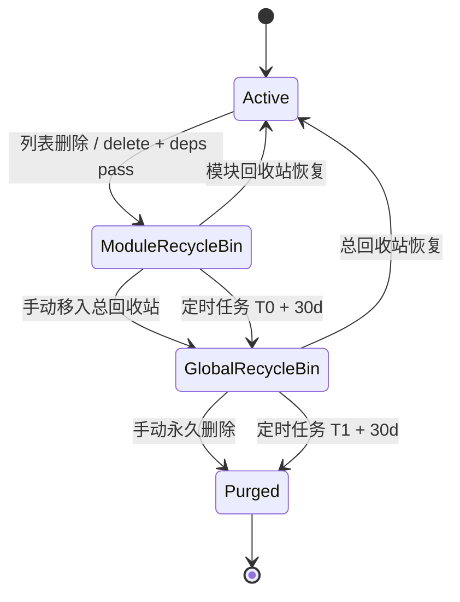

# Recycle Bin 双阶段状态机说明

## 生命周期

## 字段语义

### Active

- `is_deleted = false`
- `deleted_at = null`
- `delete_level = null`
- `recycle_stage = null`
- `promoted_to_global_at = null`

### ModuleRecycleBin

- `is_deleted = true`
- `deleted_at = T0`
- `delete_level = admin | tenant`
- `recycle_stage = module`
- `promoted_to_global_at = null`

### GlobalRecycleBin

- `is_deleted = true`
- `deleted_at = T0`
- `delete_level = admin | tenant`
- `recycle_stage = global`
- `promoted_to_global_at = T1`

### Purged

- 已执行 `service.permanent_delete()` / repository 物理删除
- 不再保留业务记录

## 时间线

### 模块删除

1. 业务列表执行删除
2. 后端先跑 `delete-preview`
3. 若存在 BLOCK 依赖，返回 `4221 + dependencies`
4. 若通过，写入 `ModuleRecycleBin`

### 30 + 30

1. `T0 = deleted_at`
2. `T0 + module_retention_days` 到期后，定时任务推进到 `GlobalRecycleBin`
3. `T1 = promoted_to_global_at`
4. `T1 + global_retention_days` 到期后，定时任务执行最终物理删除

默认配置：

- `RECYCLE_BIN_MODULE_RETENTION_DAYS = 30`
- `RECYCLE_BIN_GLOBAL_RETENTION_DAYS = 30`

## 触发点与接口

### 首次删除

- 列表页 `DELETE /resource/{id}`
- Service: `delete(soft=True)`
- 依赖保护：`check_deletion_deps()` -> `DependencyBlockedException(4221)`

### 模块回收站恢复

- `POST /resource/recycle-bin/{id}/restore`
- Service: `restore(id, recycle_stage='module')`

### 模块回收站推进到总回收站

- `DELETE /resource/recycle-bin/{id}`
- `DELETE /resource/recycle-bin/batch`
- Service: `promote_to_global()` / `batch_promote_to_global()`

### 总回收站恢复

- Admin: `POST /admin/recycle-bin/{module}/{id}/restore`
- Tenant: `POST /tenant/recycle-bin/{module}/{id}/restore`
- Service: `restore(id, recycle_stage='global')`

### 总回收站最终删除

- Admin: `DELETE /admin/recycle-bin/{module}/{id}`
- Tenant: `DELETE /tenant/recycle-bin/{module}/{id}`
- Service: `permanent_delete(id)`

### 定时任务

- 任务：`app.tasks.recycle_bin.cleanup_recycle_bin`
- 第一阶段：
  - 查询 `is_deleted = true AND recycle_stage = 'module' AND deleted_at < cutoff`
  - 执行 `promote_to_global()`
- 第二阶段：
  - 查询 `is_deleted = true AND recycle_stage = 'global' AND promoted_to_global_at < cutoff`
  - 执行 `permanent_delete()`

## 幂等性与重跑安全

- 已在 global stage 的记录不会再次被 promote
- 非 global stage 的记录不会被最终物理删除
- 每一条推进 / 删除都通过 service 层逐条执行，失败可回滚当前项并安全重跑下一轮
- `cleanup_recycle_bin` 支持：
  - `retention_days`
  - `module_retention_days`
  - `global_retention_days`

其中：

- 若传 `retention_days`，两个阶段都取同一个值
- 若只传 `module_retention_days/global_retention_days`，则分别生效

## 管理端与企业端隔离

### 管理端

- 聚合总回收站只读取 `delete_level = 'admin'`
- 支持跨租户查看带归属字段的资源

### 企业端

- 聚合总回收站只读取 `delete_level = 'tenant'`
- service lookup 必须注入 `tenant_id`
- clear / restore / permanent delete 都限定当前租户作用域

## 前端映射

### 模块页

- `useCrudPage` / `useCrudList` 的 `recycleBin: true`
- Drawer 中：
  - 恢复 = 从 module stage 恢复
  - 删除 = 移入总回收站，不是物理删除

### 总回收站页

- 管理端：`/admin/system/recycle-bin`
- 企业端：`/tenant/system/recycle-bin`
- 表格列 / 搜索 / 排序：
  - 重点模块优先复用业务页 adapter
  - 其余模块退回后端 metadata
